# 3. 系统流程与时序图 (System Flows & Sequence Diagrams)

> 本章详细描述 Advanced RAG Techniques 项目的 10+ 个核心业务流程，每个流程均配有 Mermaid 流程图/时序图及 300-500 字详细说明。预计字数：~15000 字。

---

## 3.1 流程总览

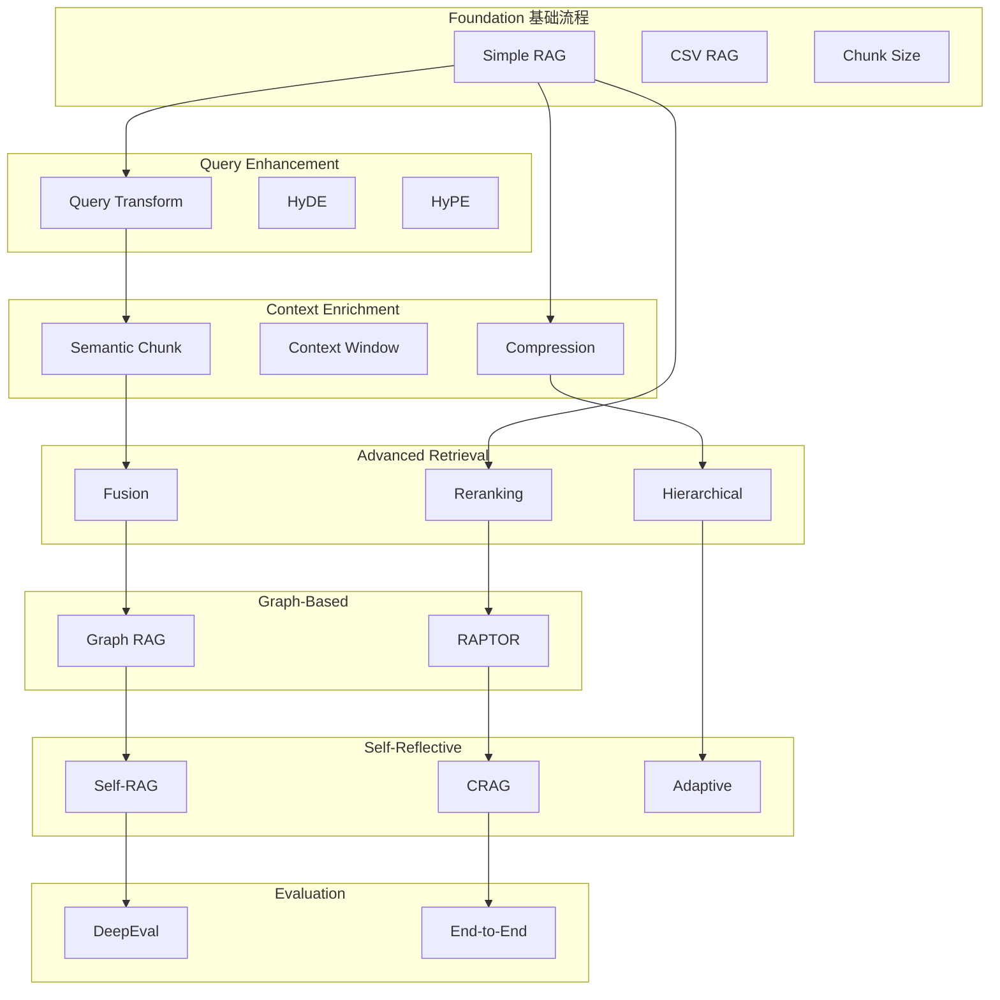
```mermaid
flowchart TB
    subgraph Foundation["Foundation 基础流程"]
        F1[Simple RAG]
        F2[CSV RAG]
        F3[Chunk Size]
    end
    subgraph QueryEnhance["Query Enhancement"]
        Q1[Query Transform]
        Q2[HyDE]
        Q3[HyPE]
    end
    subgraph ContextEnrich["Context Enrichment"]
        C1[Semantic Chunk]
        C2[Context Window]
        C3[Compression]
    end
    subgraph AdvancedRetrieval["Advanced Retrieval"]
        A1[Fusion]
        A2[Reranking]
        A3[Hierarchical]
    end
    subgraph GraphBased["Graph-Based"]
        G1[Graph RAG]
        G2[RAPTOR]
    end
    subgraph Reflective["Self-Reflective"]
        S1[Self-RAG]
        S2[CRAG]
        S3[Adaptive]
    end
    subgraph Eval["Evaluation"]
        E1[DeepEval]
        E2[End-to-End]
    end

    F1 --> Q1 --> C1 --> A1 --> G1 --> S1 --> E1
    F1 --> A2 --> G2 --> S2 --> E2
    F1 --> C3 --> A3 --> S3
```

---

## 3.2 流程 1: Simple RAG Pipeline（基础流程）

### 3.2.1 流程图（Mermaid）

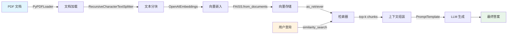
```mermaid
flowchart LR
    A[PDF 文档] -->|PyPDFLoader| B[文档加载]
    B -->|RecursiveCharacterTextSplitter| C[文本分块]
    C -->|OpenAIEmbeddings| D[向量嵌入]
    D -->|FAISS.from_documents| E[向量存储]
    E -->|as_retriever| F[检索器]
    G[用户查询] -->|similarity_search| F
    F -->|top-k chunks| H[上下文组装]
    H -->|PromptTemplate| I[LLM 生成]
    I --> J[最终答案]

    style A fill:#e1f5fe
    style G fill:#fff3e0
    style J fill:#e8f5e9
```

### 3.2.2 时序图（Mermaid）

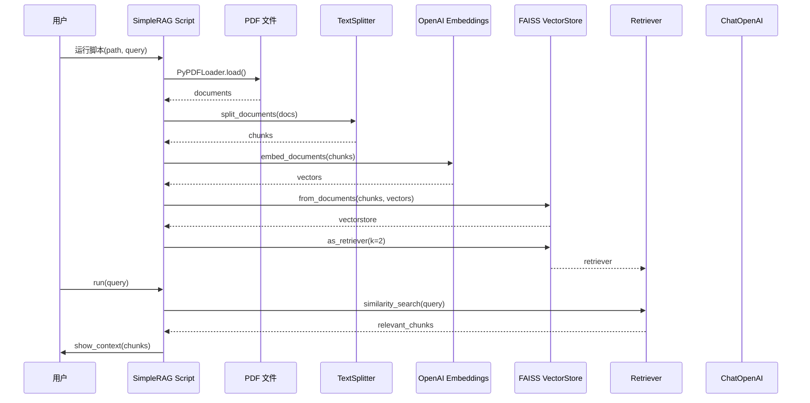
```mermaid
sequenceDiagram
    participant User as 用户
    participant Script as SimpleRAG Script
    participant PDF as PDF 文件
    participant Splitter as TextSplitter
    participant Embed as OpenAI Embeddings
    participant VS as FAISS VectorStore
    participant Retriever as Retriever
    participant LLM as ChatOpenAI

    User->>Script: 运行脚本(path, query)
    Script->>PDF: PyPDFLoader.load()
    PDF-->>Script: documents
    Script->>Splitter: split_documents(docs)
    Splitter-->>Script: chunks
    Script->>Embed: embed_documents(chunks)
    Embed-->>Script: vectors
    Script->>VS: from_documents(chunks, vectors)
    VS-->>Script: vectorstore
    Script->>VS: as_retriever(k=2)
    VS-->>Retriever: retriever

    User->>Script: run(query)
    Script->>Retriever: similarity_search(query)
    Retriever-->>Script: relevant_chunks
    Script->>User: show_context(chunks)
```

### 3.2.3 详细说明（500 字）

**Simple RAG** 是所有技术的基础流程，对应文件 `simple_rag.py` 和 `simple_rag.ipynb`。

**步骤逻辑**：
1. **初始化阶段**（`__init__`）：
   - 调用 `encode_pdf(path, chunk_size=1000, chunk_overlap=200)` 编码 PDF
   - 内部使用 `PyPDFLoader` 加载 PDF
   - `RecursiveCharacterTextSplitter` 按 1000 字符切分，200 字符重叠
   - `OpenAIEmbeddings()` 生成向量
   - `FAISS.from_documents()` 创建向量存储
   - `as_retriever(search_kwargs={"k": n_retrieved})` 创建检索器

2. **查询阶段**（`run(query)`）：
   - 调用 `retrieve_context_per_question(query, retriever)`
   - 内部使用 `retriever.get_relevant_documents(query)` 检索
   - 返回上下文列表
   - 调用 `show_context(context)` 展示结果

**涉及的文件与函数**：
- `helper_functions.py:23-45`：`encode_pdf()` — PDF 编码核心函数
- `helper_functions.py:103-120`：`retrieve_context_per_question()` — 检索上下文
- `helper_functions.py:155-170`：`show_context()` — 展示上下文
- `simple_rag.py:14-45`：`SimpleRAG` 类

**异常处理**：
- `validate_args()` 在脚本入口校验参数（chunk_size > 0, chunk_overlap >= 0）
- `encode_from_string()` 对内容进行 `isinstance` 和 `strip()` 校验
- 嵌入过程在 `encode_pdf()` 中可能抛出 `RuntimeError`

**性能特征**：
- 编码阶段：取决于 PDF 大小，通常 5-30 秒（需要 LLM API 调用）
- 检索阶段：< 100ms（FAISS 本地检索）
- 内存：所有向量存储在内存中

**扩展点**：
- 可替换 `chunk_size` 和 `chunk_overlap` 参数
- 可替换 `n_retrieved` 控制返回文档数
- 可添加 `--evaluate` 标志启用评估

---

## 3.3 流程 2: HyDE（假设计答嵌入）

### 3.3.1 流程图（Mermaid）

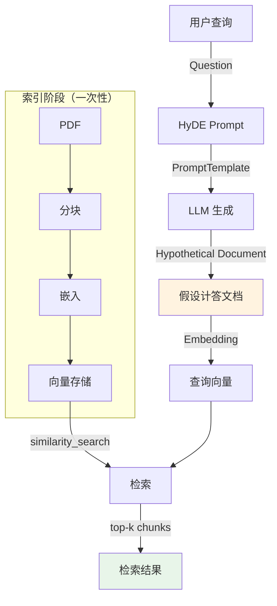
```mermaid
flowchart TB
    A[用户查询] -->|Question| B[HyDE Prompt]
    B -->|PromptTemplate| C[LLM 生成]
    C -->|Hypothetical Document| D[假设计答文档]
    D -->|Embedding| E[查询向量]
    F[向量存储] -->|similarity_search| G[检索]
    E --> G
    G -->|top-k chunks| H[检索结果]

    subgraph IndexTime["索引阶段（一次性）"]
        I[PDF] --> J[分块] --> K[嵌入] --> F
    end

    style D fill:#fff3e0
    style H fill:#e8f5e9
```

### 3.3.2 时序图（Mermaid）

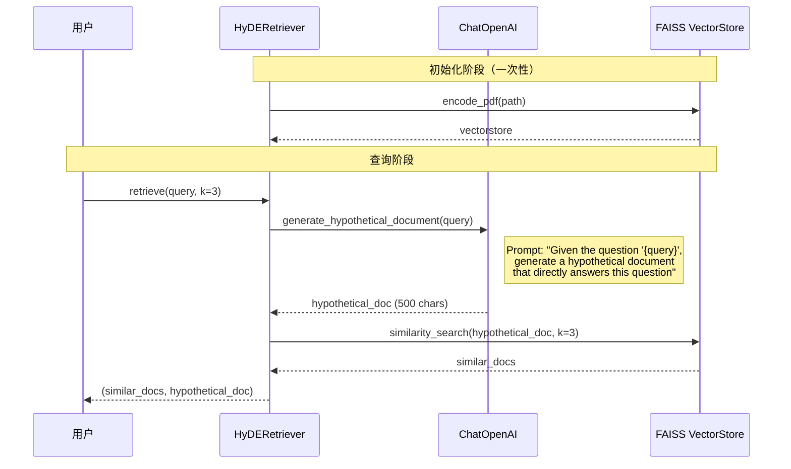
```mermaid
sequenceDiagram
    participant User as 用户
    participant HyDE as HyDERetriever
    participant LLM as ChatOpenAI
    participant VS as FAISS VectorStore

    Note over HyDE,VS: 初始化阶段（一次性）
    HyDE->>VS: encode_pdf(path)
    VS-->>HyDE: vectorstore

    Note over User,VS: 查询阶段
    User->>HyDE: retrieve(query, k=3)
    HyDE->>LLM: generate_hypothetical_document(query)
    Note right of LLM: Prompt: "Given the question '{query}',<br/>generate a hypothetical document<br/>that directly answers this question"
    LLM-->>HyDE: hypothetical_doc (500 chars)
    HyDE->>VS: similarity_search(hypothetical_doc, k=3)
    VS-->>HyDE: similar_docs
    HyDE-->>User: (similar_docs, hypothetical_doc)
```

### 3.3.3 详细说明（450 字）

**HyDE（Hypothetical Document Embedding）** 的核心思想是：**用 LLM 生成假设计答文档，用该文档的嵌入去检索，而非直接用查询检索**。这解决了查询-文档语义鸿沟问题。

**核心类**：`HyDERetriever`（`HyDe_Hypothetical_Document_Embedding.py:14-40`）

**关键函数**：
- `generate_hypothetical_document(query)`：使用 `PromptTemplate` + `ChatOpenAI` 生成指定长度（chunk_size）的假设计答
- `retrieve(query, k=3)`：先调用生成函数，再用假设计答进行相似度检索

**设计 Rationale**：
- 假设计答文档的语义空间更接近文档而非简短查询
- 文档-文档相似度 > 查询-文档相似度
- 代价：每次查询多一次 LLM 调用

**与 HyPE 的区别**：
- HyDE：查询时生成假设计答（有运行时开销）
- HyPE：索引时预计算假设计答（无运行时开销）

---

## 3.4 流程 3: Fusion Retrieval（混合检索）

### 3.4.1 流程图（Mermaid）

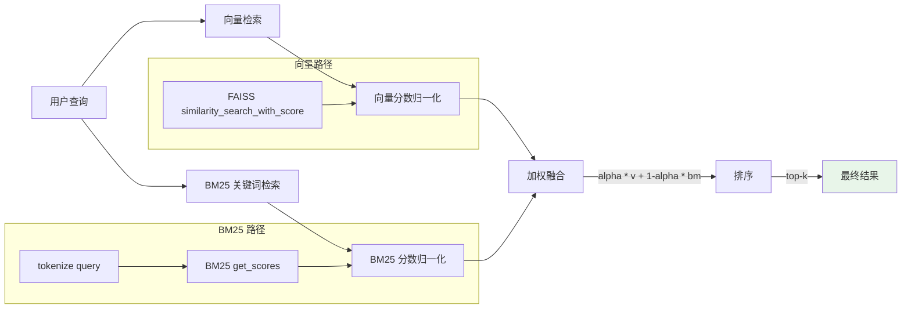
```mermaid
flowchart LR
    A[用户查询] --> B[向量检索]
    A --> C[BM25 关键词检索]
    B --> D[向量分数归一化]
    C --> E[BM25 分数归一化]
    D --> F[加权融合]
    E --> F
    F -->|alpha * v + 1-alpha * bm| G[排序]
    G -->|top-k| H[最终结果]

    subgraph VectorPath["向量路径"]
        B1[FAISS similarity_search_with_score] --> D
    end
    subgraph BM25Path["BM25 路径"]
        B2[tokenize query] --> B3[BM25 get_scores] --> E
    end

    style H fill:#e8f5e9
```

### 3.4.2 时序图（Mermaid）

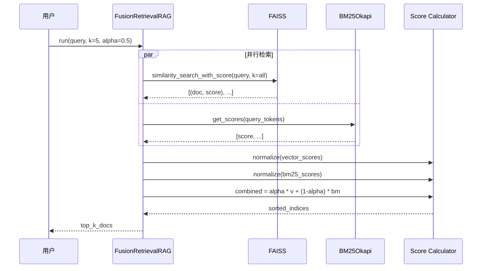
```mermaid
sequenceDiagram
    participant User as 用户
    participant FR as FusionRetrievalRAG
    participant VS as FAISS
    participant BM25 as BM25Okapi
    participant Calc as Score Calculator

    User->>FR: run(query, k=5, alpha=0.5)
    
    par 并行检索
        FR->>VS: similarity_search_with_score(query, k=all)
        VS-->>FR: [(doc, score), ...]
    and
        FR->>BM25: get_scores(query_tokens)
        BM25-->>FR: [score, ...]
    end

    FR->>Calc: normalize(vector_scores)
    FR->>Calc: normalize(bm25_scores)
    FR->>Calc: combined = alpha * v + (1-alpha) * bm
    Calc-->>FR: sorted_indices
    FR-->>User: top_k_docs
```

### 3.4.3 详细说明（450 字）

**Fusion Retrieval** 结合 **向量检索**（语义理解）和 **BM25 检索**（关键词匹配），通过加权融合获得更全面的检索结果。

**核心函数**：`fusion_retrieval()`（`fusion_retrieval.py:45-75`）

**算法步骤**：
1. 获取所有文档：`vectorstore.similarity_search("", k=ntotal)`
2. BM25 检索：`bm25.get_scores(query.split())`
3. 向量检索：`vectorstore.similarity_search_with_score(query, k=all)`
4. 归一化：两个分数分别 min-max 归一化
5. 融合：`combined = alpha * vector + (1-alpha) * bm25`
6. 排序取 top-k

**参数**：
- `alpha=0.5`：向量检索权重（0.5 表示等权融合）
- `k=5`：返回文档数

**关键文件**：
- `fusion_retrieval.py:25-40`：`create_bm25_index()` 创建 BM25 索引
- `fusion_retrieval.py:45-75`：`fusion_retrieval()` 核心融合函数
- `helper_functions.py:220-245`：`bm25_retrieval()` BM25 检索辅助函数

**设计 Rationale**：
- 向量检索擅长语义匹配（同义词、释义）
- BM25 擅长精确关键词匹配（专有名词、数字）
- 融合取长补短

---

## 3.5 流程 4: Adaptive RAG（自适应检索）

### 3.5.1 流程图（Mermaid）

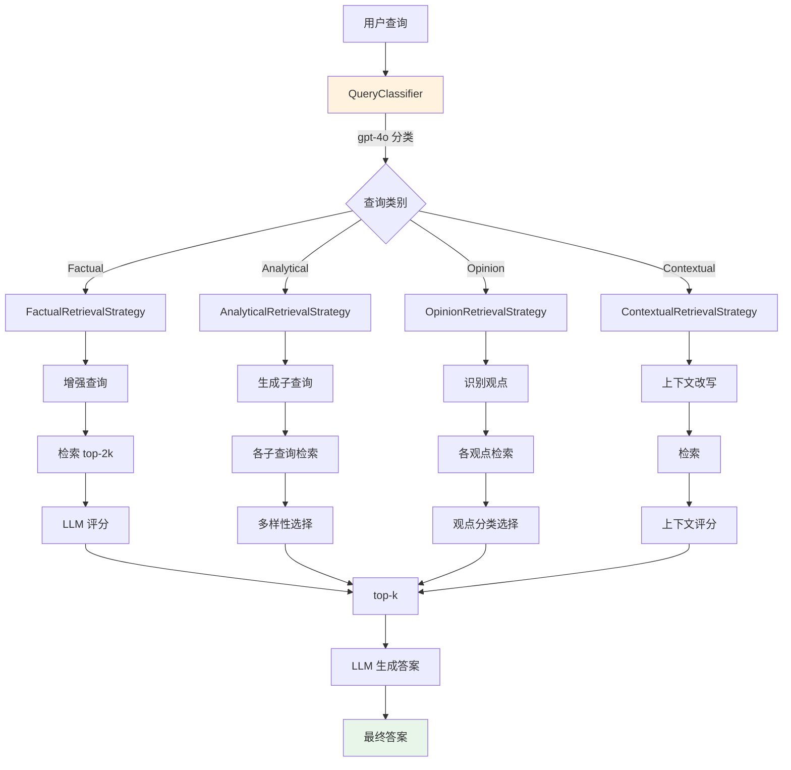
```mermaid
flowchart TB
    A[用户查询] --> B[QueryClassifier]
    B -->|gpt-4o 分类| C{查询类别}
    C -->|Factual| D[FactualRetrievalStrategy]
    C -->|Analytical| E[AnalyticalRetrievalStrategy]
    C -->|Opinion| F[OpinionRetrievalStrategy]
    C -->|Contextual| G[ContextualRetrievalStrategy]
    
    D --> D1[增强查询] --> D2[检索 top-2k] --> D3[LLM 评分] --> H[top-k]
    E --> E1[生成子查询] --> E2[各子查询检索] --> E3[多样性选择] --> H
    F --> F1[识别观点] --> F2[各观点检索] --> F3[观点分类选择] --> H
    G --> G1[上下文改写] --> G2[检索] --> G3[上下文评分] --> H
    
    H --> I[LLM 生成答案]
    I --> J[最终答案]

    style B fill:#fff3e0
    style J fill:#e8f5e9
```

### 3.5.2 时序图（Mermaid）

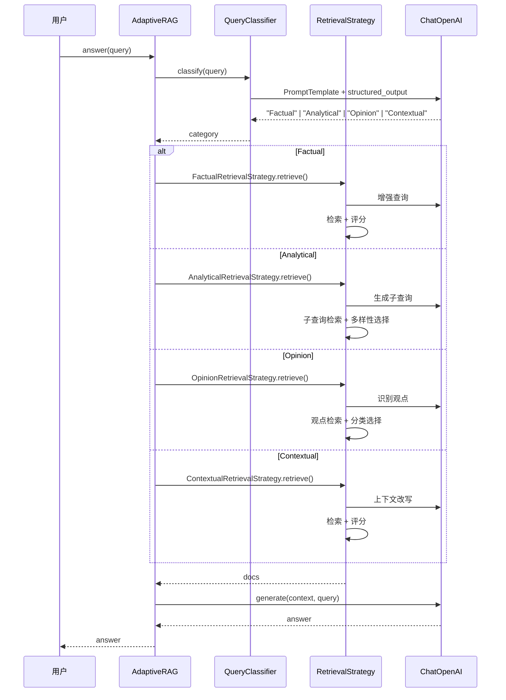
```mermaid
sequenceDiagram
    participant User as 用户
    participant AR as AdaptiveRAG
    participant QC as QueryClassifier
    participant Strat as RetrievalStrategy
    participant LLM as ChatOpenAI

    User->>AR: answer(query)
    AR->>QC: classify(query)
    QC->>LLM: PromptTemplate + structured_output
    LLM-->>QC: "Factual" | "Analytical" | "Opinion" | "Contextual"
    QC-->>AR: category

    alt Factual
        AR->>Strat: FactualRetrievalStrategy.retrieve()
        Strat->>LLM: 增强查询
        Strat->>Strat: 检索 + 评分
    else Analytical
        AR->>Strat: AnalyticalRetrievalStrategy.retrieve()
        Strat->>LLM: 生成子查询
        Strat->>Strat: 子查询检索 + 多样性选择
    else Opinion
        AR->>Strat: OpinionRetrievalStrategy.retrieve()
        Strat->>LLM: 识别观点
        Strat->>Strat: 观点检索 + 分类选择
    else Contextual
        AR->>Strat: ContextualRetrievalStrategy.retrieve()
        Strat->>LLM: 上下文改写
        Strat->>Strat: 检索 + 评分
    end

    Strat-->>AR: docs
    AR->>LLM: generate(context, query)
    LLM-->>AR: answer
    AR-->>User: answer
```

### 3.5.3 详细说明（500 字）

**Adaptive RAG** 的核心思想是：**根据查询类型自动选择最优检索策略**。

**核心类**（`adaptive_retrieval.py`）：
- `QueryClassifier`：使用 GPT-4o 将查询分类为 4 种类型
- `BaseRetrievalStrategy`：基类，包含向量存储和 LLM
- `FactualRetrievalStrategy`：增强查询 → 检索 → LLM 评分排序
- `AnalyticalRetrievalStrategy`：生成子查询 → 各子查询检索 → 多样性选择
- `OpinionRetrievalStrategy`：识别观点 → 各观点检索 → 分类选择
- `ContextualRetrievalStrategy`：上下文改写 → 检索 → 评分
- `AdaptiveRAG`：主类，协调分类和策略执行

**查询分类 Prompt**：
```
"Classify the following query into one of these categories: 
Factual, Analytical, Opinion, or Contextual."
```

**策略选择逻辑**：
- **Factual**：事实查询（"什么是..."），需要精确匹配
- **Analytical**：分析查询（"为什么..."），需要多角度子查询
- **Opinion**：观点查询（"如何看待..."），需要多视角
- **Contextual**：上下文查询（"对我而言..."），需要结合用户背景

**设计模式**：经典 **Strategy 模式**，将算法族封装为可互换的策略对象。

---

## 3.6 流程 5: Self-RAG（自反思检索）

### 3.6.1 流程图（Mermaid）

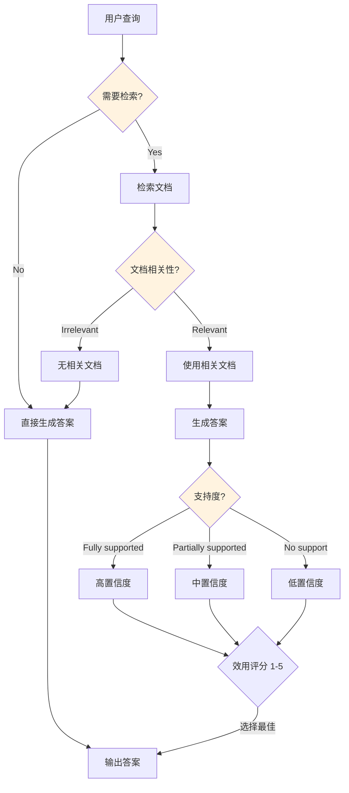
```mermaid
flowchart TD
    A[用户查询] --> B{需要检索?}
    B -->|Yes| C[检索文档]
    B -->|No| G[直接生成答案]
    C --> D{文档相关性?}
    D -->|Relevant| E[使用相关文档]
    D -->|Irrelevant| F[无相关文档]
    F --> G
    E --> H[生成答案]
    G --> I[输出答案]
    H --> J{支持度?}
    J -->|Fully supported| K[高置信度]
    J -->|Partially supported| L[中置信度]
    J -->|No support| M[低置信度]
    K --> N{效用评分 1-5}
    L --> N
    M --> N
    N -->|选择最佳| I

    style B fill:#fff3e0
    style D fill:#fff3e0
    style J fill:#fff3e0
```

### 3.6.2 时序图（Mermaid）

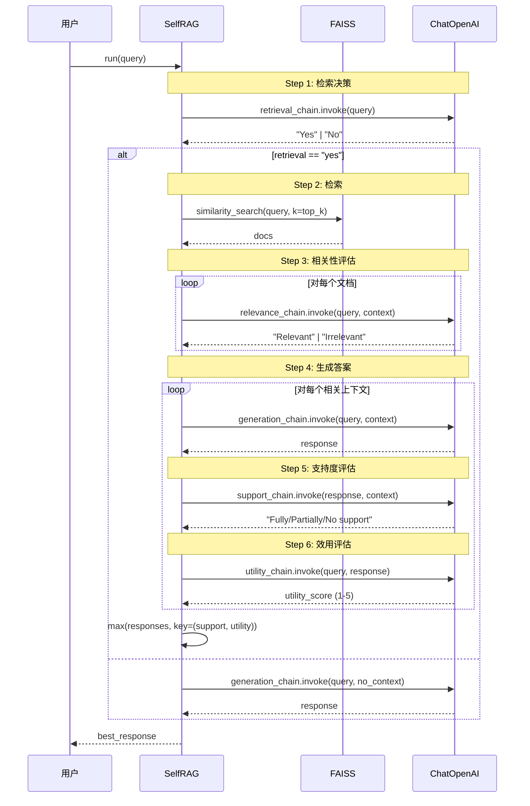
```mermaid
sequenceDiagram
    participant User as 用户
    participant SR as SelfRAG
    participant VS as FAISS
    participant LLM as ChatOpenAI

    User->>SR: run(query)
    
    Note over SR,LLM: Step 1: 检索决策
    SR->>LLM: retrieval_chain.invoke(query)
    LLM-->>SR: "Yes" | "No"

    alt retrieval == "yes"
        Note over SR,LLM: Step 2: 检索
        SR->>VS: similarity_search(query, k=top_k)
        VS-->>SR: docs
        
        Note over SR,LLM: Step 3: 相关性评估
        loop 对每个文档
            SR->>LLM: relevance_chain.invoke(query, context)
            LLM-->>SR: "Relevant" | "Irrelevant"
        end

        Note over SR,LLM: Step 4: 生成答案
        loop 对每个相关上下文
            SR->>LLM: generation_chain.invoke(query, context)
            LLM-->>SR: response
            
            Note over SR,LLM: Step 5: 支持度评估
            SR->>LLM: support_chain.invoke(response, context)
            LLM-->>SR: "Fully/Partially/No support"
            
            Note over SR,LLM: Step 6: 效用评估
            SR->>LLM: utility_chain.invoke(query, response)
            LLM-->>SR: utility_score (1-5)
        end
        
        SR->>SR: max(responses, key=(support, utility))
    else
        SR->>LLM: generation_chain.invoke(query, no_context)
        LLM-->>SR: response
    end
    
    SR-->>User: best_response
```

### 3.6.3 详细说明（500 字）

**Self-RAG** 的核心思想是：**让模型自己决定是否需要检索、检索结果是否相关、生成答案是否有依据**。

**6 步流水线**（`self_rag.py:97-145`）：

| 步骤 | Prompt 类型 | 输出 |
|------|------------|------|
| 1. 检索决策 | `retrieval_prompt` | "Yes" / "No" |
| 2. 文档检索 | FAISS similarity_search | 文档列表 |
| 3. 相关性评估 | `relevance_prompt` | "Relevant" / "Irrelevant" |
| 4. 答案生成 | `generation_prompt` | 生成答案 |
| 5. 支持度评估 | `support_prompt` | "Fully/Partially/No support" |
| 6. 效用评估 | `utility_prompt` | 1-5 分 |

**选择逻辑**：
```python
best_response = max(responses, key=lambda x: (x[1] == 'fully supported', x[2]))
```

**结构化输出模型**（Pydantic）：
- `RetrievalResponse`：response: str (Yes/No)
- `RelevanceResponse`：response: str (Relevant/Irrelevant)
- `GenerationResponse`：response: str
- `SupportResponse`：response: str (Fully/Partially/No)
- `UtilityResponse`：response: int (1-5)

**设计 Rationale**：
- 减少不必要的检索（节省成本）
- 过滤不相关文档（提高质量）
- 自我评估答案可靠性（减少幻觉）

---

## 3.7 流程 6: CRAG（纠错检索）

### 3.7.1 流程图（Mermaid）

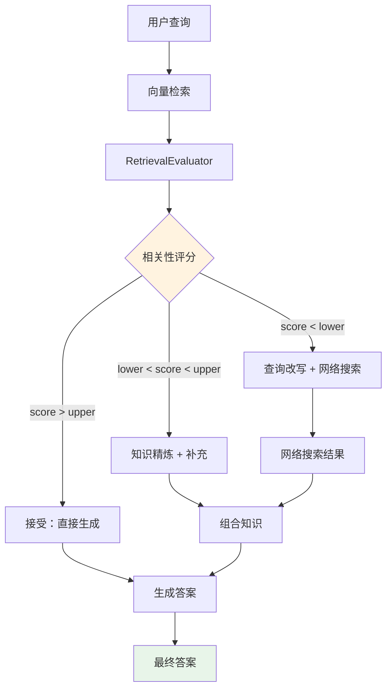
```mermaid
flowchart TD
    A[用户查询] --> B[向量检索]
    B --> C[RetrievalEvaluator]
    C --> D{相关性评分}
    D -->|score > upper| E[接受：直接生成]
    D -->|lower < score < upper| F[知识精炼 + 补充]
    D -->|score < lower| G[查询改写 + 网络搜索]
    
    F --> H[组合知识]
    G --> I[网络搜索结果]
    I --> H
    E --> J[生成答案]
    H --> J
    J --> K[最终答案]

    style D fill:#fff3e0
    style K fill:#e8f5e9
```

### 3.7.2 时序图（Mermaid）

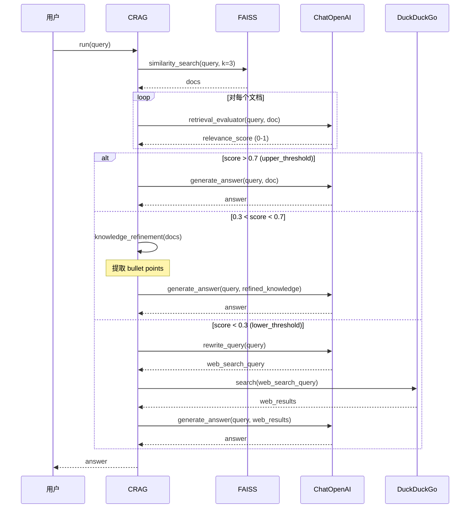
```mermaid
sequenceDiagram
    participant User as 用户
    participant CR as CRAG
    participant VS as FAISS
    participant LLM as ChatOpenAI
    participant DDG as DuckDuckGo

    User->>CR: run(query)
    CR->>VS: similarity_search(query, k=3)
    VS-->>CR: docs

    loop 对每个文档
        CR->>LLM: retrieval_evaluator(query, doc)
        LLM-->>CR: relevance_score (0-1)
    end

    alt score > 0.7 (upper_threshold)
        CR->>LLM: generate_answer(query, doc)
        LLM-->>CR: answer
    else 0.3 < score < 0.7
        CR->>CR: knowledge_refinement(docs)
        Note over CR: 提取 bullet points
        CR->>LLM: generate_answer(query, refined_knowledge)
        LLM-->>CR: answer
    else score < 0.3 (lower_threshold)
        CR->>LLM: rewrite_query(query)
        LLM-->>CR: web_search_query
        CR->>DDG: search(web_search_query)
        DDG-->>CR: web_results
        CR->>LLM: generate_answer(query, web_results)
        LLM-->>CR: answer
    end

    CR-->>User: answer
```

### 3.7.3 详细说明（450 字）

**CRAG（Corrective RAG）** 的核心思想是：**评估检索结果质量，质量不足时自动纠正**。

**三种处理路径**（`crag.py:45-90`）：

| 条件 | 阈值 | 处理方式 |
|------|------|----------|
| 高相关 | score > 0.7 | 直接使用检索结果生成答案 |
| 中等相关 | 0.3 < score < 0.7 | 知识精炼（提取关键点） |
| 低相关 | score < 0.3 | 查询改写 + 网络搜索 |

**核心类**：`CRAG`（`crag.py:25-90`）
- `evaluate_documents(query, documents)`：评估每个文档的相关性
- `knowledge_refinement(document)`：提取 bullet points 形式的关键信息
- `rewrite_query(query)`：改写为适合网络搜索的查询
- `parse_search_results(results_string)`：解析 DuckDuckGo 搜索结果

**阈值参数**：
- `lower_threshold=0.3`：低于此值触发网络搜索
- `upper_threshold=0.7`：高于此值直接接受

**网络搜索工具**：`DuckDuckGoSearchResults`（`langchain_community.tools`）

---

## 3.8 流程 7: Graph RAG（知识图谱检索）

### 3.8.1 流程图（Mermaid）

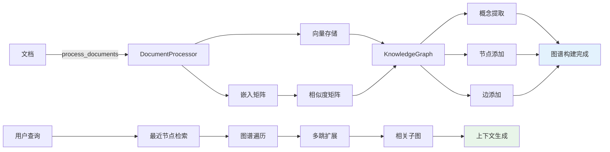
```mermaid
flowchart LR
    A[文档] -->|process_documents| B[DocumentProcessor]
    B --> C[向量存储]
    B --> D[嵌入矩阵]
    D --> E[相似度矩阵]
    C --> F[KnowledgeGraph]
    E --> F
    F --> G[概念提取]
    F --> H[节点添加]
    F --> I[边添加]
    G --> J[图谱构建完成]
    H --> J
    I --> J
    
    K[用户查询] --> L[最近节点检索]
    L --> M[图谱遍历]
    M --> N[多跳扩展]
    N --> O[相关子图]
    O --> P[上下文生成]

    style J fill:#e3f2fd
    style P fill:#e8f5e9
```

### 3.8.2 时序图（Mermaid）

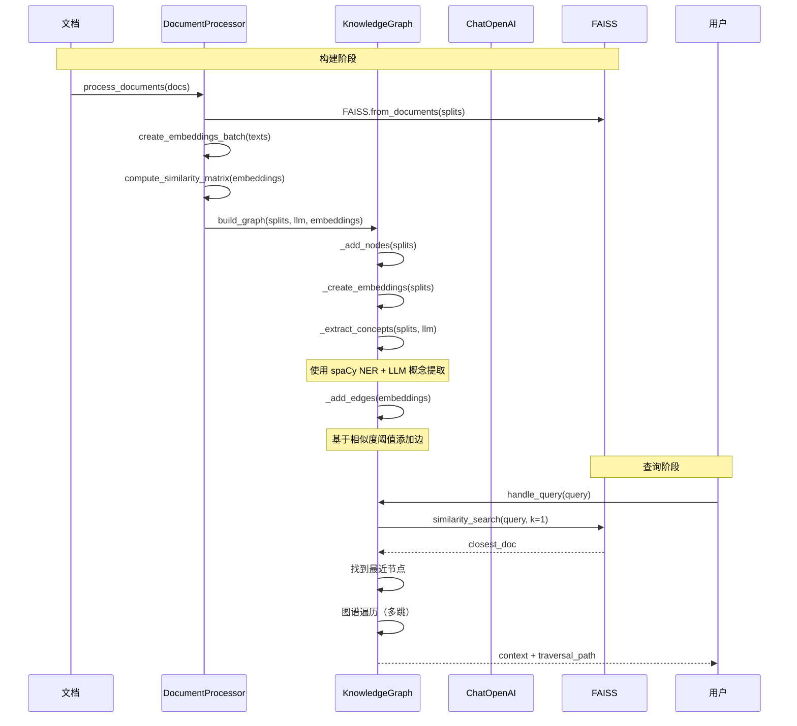
```mermaid
sequenceDiagram
    participant Doc as 文档
    participant DP as DocumentProcessor
    participant KG as KnowledgeGraph
    participant LLM as ChatOpenAI
    participant VS as FAISS
    participant User as 用户

    Note over Doc,VS: 构建阶段
    Doc->>DP: process_documents(docs)
    DP->>VS: FAISS.from_documents(splits)
    DP->>DP: create_embeddings_batch(texts)
    DP->>DP: compute_similarity_matrix(embeddings)
    
    DP->>KG: build_graph(splits, llm, embeddings)
    KG->>KG: _add_nodes(splits)
    KG->>KG: _create_embeddings(splits)
    KG->>KG: _extract_concepts(splits, llm)
    Note over KG: 使用 spaCy NER + LLM 概念提取
    KG->>KG: _add_edges(embeddings)
    Note over KG: 基于相似度阈值添加边

    Note over User,VS: 查询阶段
    User->>KG: handle_query(query)
    KG->>VS: similarity_search(query, k=1)
    VS-->>KG: closest_doc
    KG->>KG: 找到最近节点
    KG->>KG: 图谱遍历（多跳）
    KG-->>User: context + traversal_path
```

### 3.8.3 详细说明（500 字）

**Graph RAG** 的核心思想是：**构建实体-关系知识图谱，利用图谱的多跳推理能力增强检索**。

**核心类**（`graph_rag.py`）：

1. **DocumentProcessor**：
   - `process_documents(documents)`：分块 + 向量存储
   - `create_embeddings_batch(texts, batch_size=32)`：批量嵌入
   - `compute_similarity_matrix(embeddings)`：余弦相似度矩阵

2. **KnowledgeGraph**：
   - `build_graph(splits, llm, embedding_model)`：构建图谱
   - `_add_nodes(splits)`：添加文档节点
   - `_create_embeddings(splits, embedding_model)`：创建节点嵌入
   - `_extract_concepts(splits, llm)`：使用 spaCy + LLM 提取概念
   - `_add_edges(embeddings)`：基于相似度阈值（0.8）添加边

**关键技术**：
- **spaCy**：命名实体识别（NER）
- **NLTK**：词形还原（WordNetLemmatizer）
- **NetworkX**：图数据结构
- **余弦相似度**：计算节点间相似度

**查询流程**：
1. 找到查询的最近节点（向量检索）
2. 从该节点开始图谱遍历
3. 多跳扩展获取相关子图
4. 组合子图信息生成上下文

---

## 3.9 流程 8: RAPTOR（递归抽象树检索）

### 3.9.1 流程图（Mermaid）

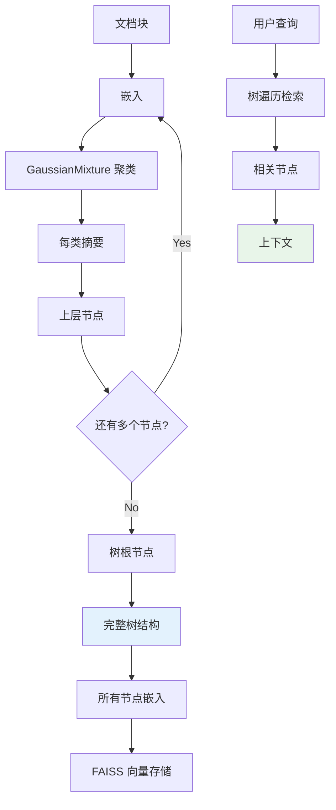
```mermaid
flowchart TD
    A[文档块] --> B[嵌入]
    B --> C[GaussianMixture 聚类]
    C --> D[每类摘要]
    D --> E[上层节点]
    E --> F{还有多个节点?}
    F -->|Yes| B
    F -->|No| G[树根节点]
    
    G --> H[完整树结构]
    H --> I[所有节点嵌入]
    I --> J[FAISS 向量存储]
    
    K[用户查询] --> L[树遍历检索]
    L --> M[相关节点]
    M --> N[上下文]

    style H fill:#e3f2fd
    style N fill:#e8f5e9
```

### 3.9.2 详细说明（450 字）

**RAPTOR（Recursive Abstractive Processing for Tree-Organized Retrieval）** 的核心思想是：**递归地构建文档的树状摘要结构，实现多粒度检索**。

**核心函数**（`raptor.py`）：
- `embed_texts(texts)`：文本嵌入
- `perform_clustering(embeddings, n_clusters=10)`：GaussianMixture 聚类
- `summarize_texts(texts, llm)`：LLM 摘要
- `build_vectorstore(tree_results)`：构建向量存储
- `create_retriever(vectorstore, llm)`：创建压缩检索器

**算法流程**：
1. 初始文档块嵌入
2. 聚类（GaussianMixture）
3. 每类生成摘要
4. 摘要作为上层节点
5. 递归直到只剩一个根节点
6. 所有节点（原始 + 摘要）存入 FAISS

**优势**：
- 高层节点提供全局视角
- 低层节点提供细节信息
- 查询时可跨层级检索

---

## 3.10 流程 9: Reranking（智能重排序）

### 3.10.1 流程图（Mermaid）

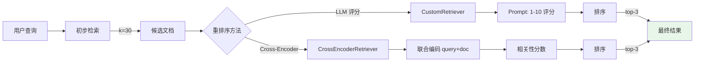
```mermaid
flowchart LR
    A[用户查询] --> B[初步检索]
    B -->|k=30| C[候选文档]
    C --> D{重排序方法}
    
    D -->|LLM 评分| E[CustomRetriever]
    D -->|Cross-Encoder| F[CrossEncoderRetriever]
    
    E --> G[Prompt: 1-10 评分]
    G --> H[排序]
    H -->|top-3| I[最终结果]
    
    F --> J[联合编码 query+doc]
    J --> K[相关性分数]
    K --> L[排序]
    L -->|top-3| I

    style I fill:#e8f5e9
```

### 3.10.2 详细说明（400 字）

**Reranking** 的核心思想：**先宽松检索（大 k），再精确重排序（小 k），提高检索精度**。

**两种实现**（`reranking.py`）：

1. **CustomRetriever**（LLM 评分）：
   - 初始检索 k=30
   - 对每个文档使用 LLM 评分（1-10）
   - 按分数排序取 top-3
   - Prompt: "On a scale of 1-10, rate the relevance..."

2. **CrossEncoderRetriever**：
   - 使用 `cross-encoder/ms-marco-MLM-L-6-v2`
   - 联合编码 query + document
   - 直接输出相关性分数
   - 无需 LLM 调用，速度更快

**核心函数**：
- `rerank_documents(query, docs, top_n=3)`：LLM 评分重排序
- `compare_rag_techniques(query, docs)`：对比基线与高级检索

---

## 3.11 流程 10: Evaluation Pipeline（评估流水线）

### 3.11.1 流程图（Mermaid）

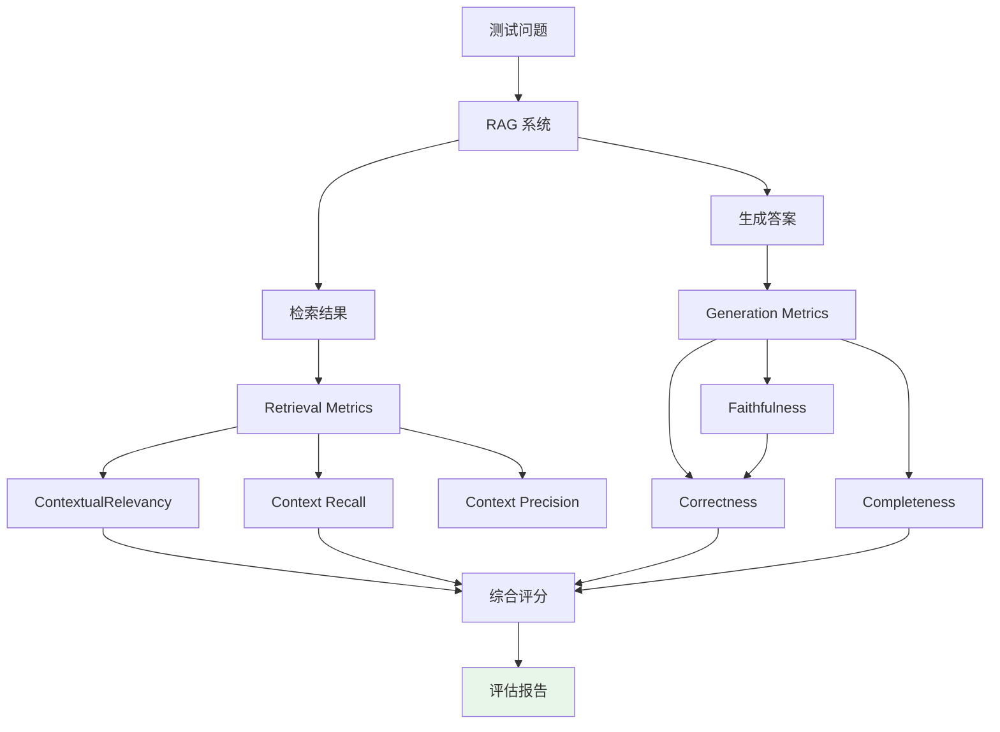
```mermaid
flowchart TD
    A[测试问题] --> B[RAG 系统]
    B --> C[检索结果]
    B --> D[生成答案]
    
    C --> E[Retrieval Metrics]
    D --> F[Generation Metrics]
    
    E --> G[ContextualRelevancy]
    E --> H[Context Recall]
    E --> H2[Context Precision]
    
    F --> I[Faithfulness]
    F --> J[Correctness]
    F --> K[Completeness]
    
    G --> L[综合评分]
    H --> L
    I --> J
    J --> L
    K --> L
    
    L --> M[评估报告]

    style M fill:#e8f5e9
```

### 3.11.2 时序图（Mermaid）

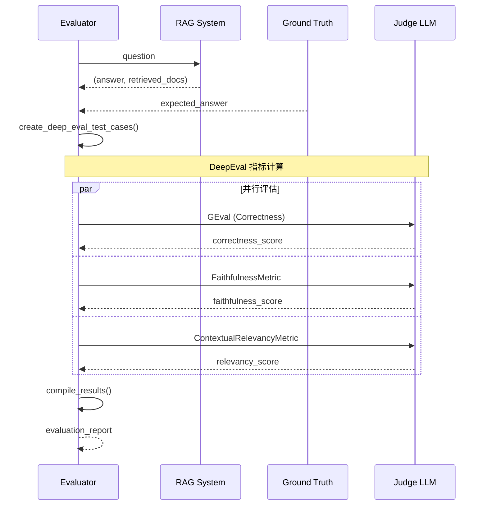
```mermaid
sequenceDiagram
    participant Eval as Evaluator
    participant RAG as RAG System
    participant GT as Ground Truth
    participant LLM as Judge LLM

    Eval->>RAG: question
    RAG-->>Eval: (answer, retrieved_docs)
    GT-->>Eval: expected_answer

    Eval->>Eval: create_deep_eval_test_cases()
    
    Note over Eval,LLM: DeepEval 指标计算
    par 并行评估
        Eval->>LLM: GEval (Correctness)
        LLM-->>Eval: correctness_score
    and
        Eval->>LLM: FaithfulnessMetric
        LLM-->>Eval: faithfulness_score
    and
        Eval->>LLM: ContextualRelevancyMetric
        LLM-->>Eval: relevancy_score
    end

    Eval->>Eval: compile_results()
    Eval-->>Eval: evaluation_report
```

### 3.11.3 详细说明（450 字）

**Evaluation Pipeline** 对 RAG 系统进行多维度评估。

**核心函数**（`evalute_rag.py`）：
- `create_deep_eval_test_cases()`：创建评估测试用例
- `evaluate_rag(retriever, num_questions)`：执行评估
- `calculate_average_scores(results)`：计算平均分数

**评估指标**：

| 指标 | 类型 | 描述 |
|------|------|------|
| **Correctness** (GEval) | Generation | 答案与 ground truth 的事实一致性 |
| **Faithfulness** | Generation | 答案是否基于检索上下文 |
| **ContextualRelevancy** | Retrieval | 检索结果与查询的相关性 |
| **Relevancy** (GroUSE) | Generation | 上下文 grounding |
| **Completeness** | Generation | 答案完整性 |

**评估模型**：
- GPT-4-turbo（默认 judge）
- 可替换为 Llama 3.1 405B（GroUSE）

**测试数据来源**：
- `data/q_a.json`：预定义问答对
- `DatasetGenerator`（LlamaIndex）：自动生成

---

## 3.12 流程 11: Hierarchical Indices（层次化索引）

### 3.12.1 流程图（Mermaid）

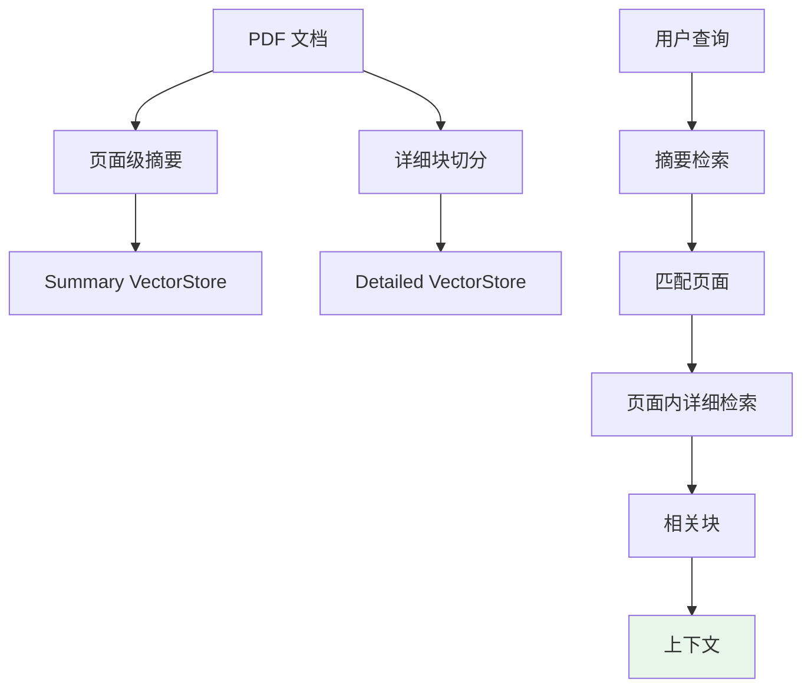
```mermaid
flowchart TD
    A[PDF 文档] --> B[页面级摘要]
    A --> C[详细块切分]
    
    B --> D[Summary VectorStore]
    C --> E[Detailed VectorStore]
    
    F[用户查询] --> G[摘要检索]
    G --> H[匹配页面]
    H --> I[页面内详细检索]
    I --> J[相关块]
    J --> K[上下文]

    style K fill:#e8f5e9
```

### 3.12.2 详细说明（400 字）

**Hierarchical Indices** 的核心思想：**双层索引（摘要层 + 详细层），先定位到相关页面，再在页面内检索详细块**。

**核心函数**（`hierarchical_indices.py`）：
- `encode_pdf_hierarchical(path)`：异步编码，创建两个向量存储
- `retrieve_hierarchical(query)`：双层检索

**异步处理**：
- 使用 `asyncio` 并发处理
- 批量摘要（batch_size=5）
- 指数退避重试

**检索流程**：
1. 在摘要向量存储中检索 top-k 摘要
2. 提取匹配页面的页码
3. 在详细向量存储中按页码过滤检索
4. 返回相关详细块

---

## 3.13 流程 12: Contextual Compression（上下文压缩）

### 3.13.1 流程图（Mermaid）

```mermaid
flowchart LR
    A[用户查询] --> B[基础检索]
    B --> C[原始检索结果]
    C --> D[LLMChainExtractor]
    D --> E[压缩后上下文]
    E --> F[RetrievalQA Chain]
    F --> G[生成答案]

    style E fill:#fff3e0
    style G fill:#e8f5e9
```

### 3.13.2 详细说明（350 字）

**Contextual Compression** 的核心思想：**使用 LLM 压缩检索结果，只保留与查询相关的部分**。

**核心组件**（`contextual_compression.py`）：
- `LLMChainExtractor.from_llm(llm)`：创建压缩器
- `ContextualCompressionRetriever(base_compressor, base_retriever)`：压缩检索器
- `RetrievalQA.from_chain_type(llm, retriever=compression_retriever)`：问答链

**优势**：
- 减少 token 消耗
- 提高答案质量（去除噪声）
- 可处理更长的文档

---

## 3.14 流程总结

| 流程 | 核心技术 | 复杂度 | 文件 |
|------|----------|--------|------|
| Simple RAG | 基础检索 | ★☆☆☆☆ | `simple_rag.py` |
| HyDE | 假设计答 | ★★☆☆☆ | `HyDe_*.py` |
| Fusion | BM25 + 向量 | ★★★☆☆ | `fusion_retrieval.py` |
| Adaptive | 策略选择 | ★★★★☆ | `adaptive_retrieval.py` |
| Self-RAG | 自反思 | ★★★★☆ | `self_rag.py` |
| CRAG | 纠错检索 | ★★★★☆ | `crag.py` |
| Graph RAG | 知识图谱 | ★★★★★ | `graph_rag.py` |
| RAPTOR | 递归树 | ★★★★★ | `raptor.py` |
| Reranking | 重排序 | ★★★☆☆ | `reranking.py` |
| Evaluation | 评估 | ★★★☆☆ | `evalute_rag.py` |
| Hierarchical | 层次索引 | ★★★★☆ | `hierarchical_indices.py` |
| Compression | 上下文压缩 | ★★★☆☆ | `contextual_compression.py` |

---

☕️ 制作不易，请我喝咖啡☕️关注我➕

