# 4. 模块/包结构与依赖分析 (Module/Package Structure & Dependency Analysis)

> 本章详细分析项目的目录结构、模块职责、输入输出及模块间依赖关系。预计字数：~8000 字。

---

## 4.1 完整项目目录结构树

```
RAG_Techniques/
├── .github/
│   ├── FUNDING.yml                          # GitHub Sponsors 配置
│   └── workflows/
│       ├── github-test.yml                  # PR 自动化测试（云端）
│       └── local-test.yml                   # 本地测试（act 工具）
├── all_rag_techniques/                      # 42+ Jupyter Notebook（教学版）
│   ├── Agentic_RAG.ipynb                    # Agentic RAG
│   ├── HyDe_Hypothetical_Document_Embedding.ipynb
│   ├── HyPE_Hypothetical_Prompt_Embeddings.ipynb
│   ├── Microsoft_GraphRag.ipynb             # Microsoft GraphRAG
│   ├── adaptive_retrieval.ipynb             # 自适应检索
│   ├── choose_chunk_size.ipynb              # 分块大小实验
│   ├── context_enrichment_window_around_chunk.ipynb
│   ├── context_enrichment_window_around_chunk_with_llamaindex.ipynb
│   ├── contextual_chunk_headers.ipynb       # 上下文块头
│   ├── contextual_compression.ipynb         # 上下文压缩
│   ├── crag.ipynb                           # Corrective RAG
│   ├── dartboard.ipynb                      # Dartboard 检索
│   ├── document_augmentation.ipynb          # 文档增强
│   ├── explainable_retrieval.ipynb          # 可解释检索
│   ├── fusion_retrieval.ipynb               # 混合检索
│   ├── fusion_retrieval_with_llamaindex.ipynb
│   ├── graph_rag.ipynb                      # Graph RAG
│   ├── graph_rag_local_attribution.ipynb    # 本地 Graph RAG
│   ├── graphrag_with_milvus_vectordb.ipynb  # Milvus Graph RAG
│   ├── hierarchical_indices.ipynb           # 层次化索引
│   ├── json_rag.ipynb                       # JSON RAG
│   ├── local_rag_huggingface_faiss.ipynb    # 本地 RAG
│   ├── memorag.ipynb                        # MemoRAG
│   ├── multi_model_rag_with_captioning.ipynb
│   ├── multi_model_rag_with_colpali.ipynb
│   ├── proposition_chunking.ipynb           # 命题分块
│   ├── query_transformations.ipynb          # 查询变换
│   ├── raptor.ipynb                         # RAPTOR
│   ├── relevant_segment_extraction.ipynb    # RSE
│   ├── reliable_rag.ipynb                   # Reliable RAG
│   ├── reranking.ipynb                      # 重排序
│   ├── reranking_with_llamaindex.ipynb
│   ├── retrieval_with_feedback_loop.ipynb   # 反馈循环
│   ├── self_rag.ipynb                       # Self-RAG
│   ├── semantic_chunking.ipynb              # 语义分块
│   ├── simple_csv_rag.ipynb                 # CSV RAG
│   ├── simple_csv_rag_with_llamaindex.ipynb
│   └── simple_rag.ipynb                     # 基础 RAG
├── all_rag_techniques_runnable_scripts/     # 20 个可运行脚本（生产版）
│   ├── HyDe_Hypothetical_Document_Embedding.py
│   ├── HyPE_Hypothetical_Prompt_Embeddings.py
│   ├── adaptive_retrieval.py
│   ├── choose_chunk_size.py
│   ├── context_enrichment_window_around_chunk.py
│   ├── contextual_compression.py
│   ├── crag.py
│   ├── document_augmentation.py
│   ├── explainable_retrieval.py
│   ├── fusion_retrieval.py
│   ├── graph_rag.py
│   ├── hierarchical_indices.py
│   ├── query_transformations.py
│   ├── raptor.py
│   ├── reranking.py
│   ├── retrieval_with_feedback_loop.py
│   ├── self_rag.py
│   ├── semantic_chunking.py
│   └── simple_rag.py
├── data/                                    # 示例数据文件
│   ├── Understanding_Climate_Change.pdf     # 气候变化 PDF（主要数据源）
│   ├── customers-100.csv                    # 客户 CSV 数据
│   ├── nike_2023_annual_report.txt          # Nike 年报
│   ├── q_a.json                             # 问答对（评估用）
│   ├── q_a_smith.json                       # Smith 问答对
│   ├── q_a_smith_short.json                 # Smith 问答对（短版）
│   └── wealth_retrieved_passages_from_original_memorag.csv
├── docs/
│   └── wangbin/                             # 本文档目录
│       ├── README.md
│       ├── 01-project-overview.md
│       ├── 02-c4-architecture.md
│       ├── 03-flows-sequence.md
│       ├── 04-module-structure.md
│       ├── 05-core-code-walkthrough.md
│       ├── 06-data-model.md
│       ├── 07-api-design.md
│       ├── 08-deployment.md
│       ├── 09-improvements.md
│       └── 10-developer-guide.md
├── evaluation/                              # 评估 Notebook 和脚本
│   ├── define_evaluation_metrics.ipynb
│   ├── end-2-end_rag_evaluation.ipynb
│   ├── evaluation_deep_eval.ipynb
│   ├── evaluation_grouse.ipynb
│   ├── evalute_rag.py                       # 评估核心脚本
│   └── open-rag-eval-example.ipynb
├── images/                                  # 图片资源（46 个文件）
│   ├── rag_book_best_seller.png
│   ├── subscribe-button.svg
│   └── ...（各种技术示意图、赞助商 Logo）
├── tests/                                   # 测试文件
│   ├── conftest.py                          # pytest fixture 配置
│   └── test_imports.py                      # import 可执行性测试
├── .gitignore                               # Git 忽略规则
├── CONTRIBUTING.md                          # 贡献者指南
├── LICENSE                                  # 许可证（MIT 或其他）
├── helper_functions.py                      # ★ 核心共享工具模块（362 行）
└── README.md                                # 项目主文档（660 行）
```

---

## 4.2 目录/模块功能职责分析

### 4.2.1 顶层文件

| 文件 | 职责 | 输入 | 输出 |
|------|------|------|------|
| `helper_functions.py` | 核心共享工具函数库 | PDF 路径、文本、查询 | VectorStore、Chain、答案 |
| `README.md` | 项目主文档 | - | 技术列表、使用说明 |
| `CONTRIBUTING.md` | 贡献者指南 | - | 贡献流程、代码规范 |
| `LICENSE` | 开源许可证 | - | 使用权限 |
| `.gitignore` | Git 忽略规则 | - | 排除 `__pycache__/`、`.env` 等 |

### 4.2.2 `all_rag_techniques/` 目录

| 属性 | 值 |
|------|-----|
| **文件数量** | 40+ Notebook |
| **文件格式** | Jupyter Notebook (`.ipynb`) |
| **用途** | 教学演示、可视化、交互式运行 |
| **输入** | 数据文件（PDF/CSV/JSON） |
| **输出** | 检索结果、生成答案、评估指标 |
| **依赖** | `helper_functions.py`、`evaluation/evalute_rag.py` |
| **框架** | 主要 LangChain，部分 LlamaIndex |

**按类别分组**：

| 类别 | Notebook 数量 | 代表文件 |
|------|--------------|----------|
| Foundation | 5 | `simple_rag.ipynb`, `simple_csv_rag.ipynb` |
| Query Enhancement | 3 | `query_transformations.ipynb`, `HyDe_*.ipynb` |
| Context Enrichment | 6 | `semantic_chunking.ipynb`, `contextual_compression.ipynb` |
| Advanced Retrieval | 5 | `fusion_retrieval.ipynb`, `reranking.ipynb` |
| Multi-modal | 2 | `multi_model_rag_with_captioning.ipynb` |
| Iterative | 3 | `retrieval_with_feedback_loop.ipynb`, `adaptive_retrieval.ipynb` |
| Graph | 5 | `graph_rag.ipynb`, `raptor.ipynb` |
| Agentic | 3 | `self_rag.ipynb`, `crag.ipynb`, `Agentic_RAG.ipynb` |
| Special | 2 | `memorag.ipynb`, `explainable_retrieval.ipynb` |

### 4.2.3 `all_rag_techniques_runnable_scripts/` 目录

| 属性 | 值 |
|------|-----|
| **文件数量** | 20 Python 脚本 |
| **文件格式** | Python (`.py`) |
| **用途** | 可独立运行的 CLI 工具 |
| **输入** | CLI 参数（`--path`, `--query`, `--chunk_size` 等） |
| **输出** | 检索结果、答案、评估指标 |
| **依赖** | `helper_functions.py`、`evaluation/evalute_rag.py` |
| **入口** | `if __name__ == "__main__"` + `argparse` |

**每个脚本的统一结构**：
```python
# 1. 导入
import os, sys
from dotenv import load_dotenv
from helper_functions import *
from evaluation.evalute_rag import *

# 2. 环境配置
load_dotenv()
os.environ["OPENAI_API_KEY"] = os.getenv('OPENAI_API_KEY')

# 3. 核心类定义
class TechniqueName:
    def __init__(self, path, ...):
        self.vectorstore = encode_pdf(path)
        ...
    def run(self, query):
        ...

# 4. CLI 参数解析
def parse_args():
    parser = argparse.ArgumentParser(...)
    return parser.parse_args()

# 5. 主入口
if __name__ == "__main__":
    args = parse_args()
    technique = TechniqueName(...)
    technique.run(args.query)
```

### 4.2.4 `evaluation/` 目录

| 文件 | 职责 | 输入 | 输出 |
|------|------|------|------|
| `evalute_rag.py` | 评估核心脚本 | Retriever + 问题列表 | 评估指标（Correctness, Faithfulness, Relevancy） |
| `evaluation_deep_eval.ipynb` | DeepEval 评估演示 | RAG 系统 | DeepEval 指标报告 |
| `evaluation_grouse.ipynb` | GroUSE 评估演示 | RAG 系统 | GroUSE 指标报告 |
| `end-2-end_rag_evaluation.ipynb` | 端到端评估流水线 | RAG 系统 + 数据集 | 完整评估报告 |
| `open-rag-eval-example.ipynb` | Open-RAG-Eval 演示 | RAG 系统 + FIQA 数据集 | UMBRELA、AutoNuggetizer 分数 |
| `define_evaluation_metrics.ipynb` | 指标定义演示 | - | 自定义指标 |

### 4.2.5 `tests/` 目录

| 文件 | 职责 | 输入 | 输出 |
|------|------|------|------|
| `conftest.py` | pytest fixture 配置 | CLI `--exclude` 选项 | notebook_paths, script_paths, llm, embeddings, vector_store, retriever fixtures |
| `test_imports.py` | import 可执行性测试 | Notebook/Script 路径列表 | 测试通过/失败 |

### 4.2.6 `data/` 目录

| 文件 | 类型 | 大小 | 用途 |
|------|------|------|------|
| `Understanding_Climate_Change.pdf` | PDF | 206 KB | 主要数据源（几乎所有技术） |
| `customers-100.csv` | CSV | 17 KB | CSV RAG 演示 |
| `nike_2023_annual_report.txt` | TXT | 376 KB | 年报分析 |
| `q_a.json` | JSON | 10 KB | 评估问答对 |
| `q_a_smith.json` | JSON | 9 KB | Smith 问答对 |
| `q_a_smith_short.json` | JSON | 4 KB | Smith 问答对（短版） |
| `wealth_retrieved_passages_from_original_memorag.csv` | CSV | 103 KB | MemoRAG 评估数据 |

---

## 4.3 模块间依赖关系图

### 4.3.1 依赖图（Mermaid）

```mermaid
graph TB
    subgraph Core["核心层"]
        HF[helper_functions.py<br/>共享工具函数]
        EV[evaluation/evalute_rag.py<br/>评估框架]
    end

    subgraph Scripts["脚本层"]
        SR[simple_rag.py]
        HY[HyDE.py]
        FR[fusion_retrieval.py]
        AR[adaptive_retrieval.py]
        SELF[self_rag.py]
        CR[crag.py]
        GR[graph_rag.py]
        RA[raptor.py]
        RR[reranking.py]
        HI[hierarchical_indices.py]
        CC[contextual_compression.py]
        QT[query_transformations.py]
        DA[document_augmentation.py]
        SC[semantic_chunking.py]
        CE[context_enrichment.py]
        ER[explainable_retrieval.py]
        FL[feedback_loop.py]
        HYPE[HyPE.py]
        CS[choose_chunk_size.py]
    end

    subgraph Notebooks["Notebook层"]
        NB[all_rag_techniques/*.ipynb]
    end

    subgraph Tests["测试层"]
        CF[tests/conftest.py]
        TI[tests/test_imports.py]
    end

    subgraph CI["CI/CD层"]
        GT[.github/workflows/github-test.yml]
        LT[.github/workflows/local-test.yml]
    end

    SR --> HF
    SR --> EV
    HY --> HF
    FR --> HF
    AR --> HF
    SELF --> HF
    CR --> HF
    GR --> HF
    RA --> HF
    RR --> HF
    HI --> HF
    CC --> HF
    QT --> HF
    DA --> HF
    SC --> HF
    CE --> HF
    ER --> HF
    FL --> HF
    HYPE --> HF
    CS --> HF

    NB --> HF
    NB --> EV

    TI --> CF
    TI --> NB
    TI --> SR

    GT --> TI
    LT --> TI

    style HF fill:#e3f2fd
    style EV fill:#e3f2fd
```



### 4.3.2 依赖关系详细说明（500 字）

**核心依赖层级**：

1. **Core Layer（核心层）**：
   - `helper_functions.py`：被所有脚本和 Notebook 依赖，提供基础编码/检索/问答功能
   - `evaluation/evalute_rag.py`：被大多数脚本和评估 Notebook 依赖，提供评估框架

2. **Script Layer（脚本层）**：
   - 20 个独立脚本，每个实现一种 RAG 技术
   - 所有脚本都依赖 `helper_functions.py`
   - 部分脚本依赖 `evaluation/evalute_rag.py`
   - 脚本之间 **无相互依赖**（保持独立）

3. **Notebook Layer（Notebook 层）**：
   - 40+ Notebook，每个对应一种技术
   - 依赖关系与脚本层类似
   - Notebook 之间可能有概念引用，但代码独立

4. **Test Layer（测试层）**：
   - `conftest.py` 提供共享 fixture
   - `test_imports.py` 测试所有 Notebook 和 Script 的 import 可执行性

5. **CI/CD Layer（CI/CD 层）**：
   - GitHub Actions 工作流触发测试
   - `github-test.yml`：PR 触发
   - `local-test.yml`：本地 `act` 工具触发

**依赖方向**：
- 所有依赖都是 **单向的**（从技术文件指向核心模块）
- 核心模块之间 **无循环依赖**
- 测试层依赖所有被测试的文件

**关键设计决策**：
1. **共享核心**：`helper_functions.py` 作为唯一共享模块，避免代码重复
2. **技术独立**：每个技术文件可独立运行，不依赖其他技术
3. **测试覆盖**：import 测试确保所有文件的基本可执行性

---

## 4.4 `helper_functions.py` 详细分析

### 4.4.1 函数清单

| 函数 | 行号 | 输入 | 输出 | 职责 |
|------|------|------|------|------|
| `replace_t_with_space()` | 12-22 | 文档列表 | 文档列表 | 替换制表符为空格 |
| `text_wrap()` | 25-35 | 文本、宽度 | 包裹文本 | 文本格式化 |
| `encode_pdf()` | 38-62 | PDF 路径、chunk_size、chunk_overlap | FAISS VectorStore | PDF 编码 |
| `encode_from_string()` | 65-100 | 文本、chunk_size、chunk_overlap | FAISS VectorStore | 文本编码 |
| `retrieve_context_per_question()` | 103-120 | 问题、Retriever | 上下文列表 | 检索上下文 |
| `QuestionAnswerFromContext` | 123-128 | - | Pydantic Model | 结构化输出模型 |
| `create_question_answer_from_context_chain()` | 131-152 | LLM | Chain | 创建问答链 |
| `answer_question_from_context()` | 155-175 | 问题、上下文、Chain | 答案字典 | 生成答案 |
| `show_context()` | 178-190 | 上下文列表 | None（打印） | 展示上下文 |
| `read_pdf_to_string()` | 193-210 | PDF 路径 | 字符串 | PDF 读取为字符串 |
| `bm25_retrieval()` | 213-235 | BM25、文本列表、查询、k | Top-k 文本 | BM25 检索 |
| `exponential_backoff()` | 238-250 | 尝试次数 | None（异步等待） | 指数退避 |
| `retry_with_exponential_backoff()` | 253-275 | 协程、max_retries | 结果 | 带退避的重试 |
| `EmbeddingProvider` | 278-282 | - | Enum | 嵌入提供方枚举 |
| `ModelProvider` | 285-290 | - | Enum | 模型提供方枚举 |
| `get_langchain_embedding_provider()` | 293-315 | Provider、model_id | 嵌入模型 | 嵌入工厂 |

### 4.4.2 被依赖统计

| 函数 | 被调用次数（跨文件） | 调用文件 |
|------|----------------------|----------|
| `encode_pdf()` | 15+ | 几乎所有脚本 |
| `retrieve_context_per_question()` | 10+ | 多数脚本 |
| `show_context()` | 8+ | 多数脚本 |
| `answer_question_from_context()` | 5+ | 部分脚本 |
| `bm25_retrieval()` | 2 | fusion_retrieval.py |
| `retry_with_exponential_backoff()` | 3 | hierarchical_indices.py, raptor.py |
| `read_pdf_to_string()` | 3 | semantic_chunking.py |
| `encode_from_string()` | 2 | 部分脚本 |

---

## 4.5 技术间差异对比

### 4.5.1 框架使用对比

| 技术 | LangChain | LlamaIndex | 纯 Python |
|------|-----------|------------|-----------|
| Simple RAG | ✓ | ✓ | - |
| CSV RAG | ✓ | ✓ | - |
| Context Enrichment | ✓ | ✓ | - |
| Reranking | ✓ | ✓ | - |
| Choose Chunk Size | - | ✓ | - |
| 其他技术 | ✓ | - | - |

### 4.5.2 数据源对比

| 数据源 | 使用技术 |
|--------|----------|
| PDF（Climate Change） | 绝大多数技术 |
| CSV（customers-100） | CSV RAG |
| JSON | JSON RAG, Evaluation |
| TXT（Nike 年报） | 部分技术 |
| 网络搜索（DuckDuckGo） | CRAG |

### 4.5.3 LLM 使用对比

| 模型 | 使用场景 |
|------|----------|
| GPT-4o | 主要生成、查询分类、答案生成 |
| GPT-4o-mini | 轻量任务、HyDE、评估 |
| GPT-4-turbo | DeepEval 评估 judge |
| GPT-3.5-turbo | LlamaIndex 评估 |
| Claude | 可选（通过 ModelProvider） |
| Llama 3.1 405B | GroUSE 评估 |
| Ollama（本地） | Local Graph RAG |

---

## 4.6 文件大小统计

| 文件 | 行数 | 大小 | 复杂度 |
|------|------|------|--------|
| `helper_functions.py` | 362 | 12 KB | ★★★☆☆ |
| `simple_rag.py` | 115 | 4.5 KB | ★☆☆☆☆ |
| `adaptive_retrieval.py` | 210 | 10.5 KB | ★★★★☆ |
| `self_rag.py` | 200 | 7.5 KB | ★★★★☆ |
| `crag.py` | 250 | 9.9 KB | ★★★★☆ |
| `graph_rag.py` | 850+ | 34 KB | ★★★★★ |
| `raptor.py` | 230 | 9 KB | ★★★★☆ |
| `fusion_retrieval.py` | 145 | 5.6 KB | ★★★☆☆ |
| `reranking.py` | 180 | 6.9 KB | ★★★☆☆ |
| `hierarchical_indices.py` | 150 | 5.6 KB | ★★★☆☆ |
| `evalute_rag.py` | 155 | 5 KB | ★★★☆☆ |

---

## 4.7 模块边界与接口

### 4.7.1 核心接口定义

```python
# 编码接口
def encode_pdf(path: str, chunk_size: int = 1000, chunk_overlap: int = 200) -> FAISS:
    """PDF → FAISS VectorStore"""

# 检索接口
def retrieve_context_per_question(question: str, retriever: BaseRetriever) -> List[str]:
    """Query → Context List"""

# 问答接口
def create_question_answer_from_context_chain(llm: ChatOpenAI) -> Chain:
    """LLM → QA Chain"""

def answer_question_from_context(question: str, context: List[str], chain: Chain) -> Dict:
    """Question + Context → Answer Dict"""

# 评估接口
def evaluate_rag(retriever: BaseRetriever, num_questions: int = 5) -> Dict[str, Any]:
    """Retriever → Evaluation Metrics"""
```

### 4.7.2 数据流接口

```
PDF/CSV/JSON
    ↓
Document Loader (PyPDFLoader / CSVLoader)
    ↓
Text Splitter (RecursiveCharacterTextSplitter / SemanticChunker)
    ↓
Embedding Model (OpenAIEmbeddings / CohereEmbeddings)
    ↓
Vector Store (FAISS / Milvus / ChromaDB)
    ↓
Retriever (BaseRetriever / CustomRetriever)
    ↓
LLM (ChatOpenAI / ChatAnthropic)
    ↓
Answer / Evaluation
```

---

☕️ 制作不易，请我喝咖啡☕️关注我➕

