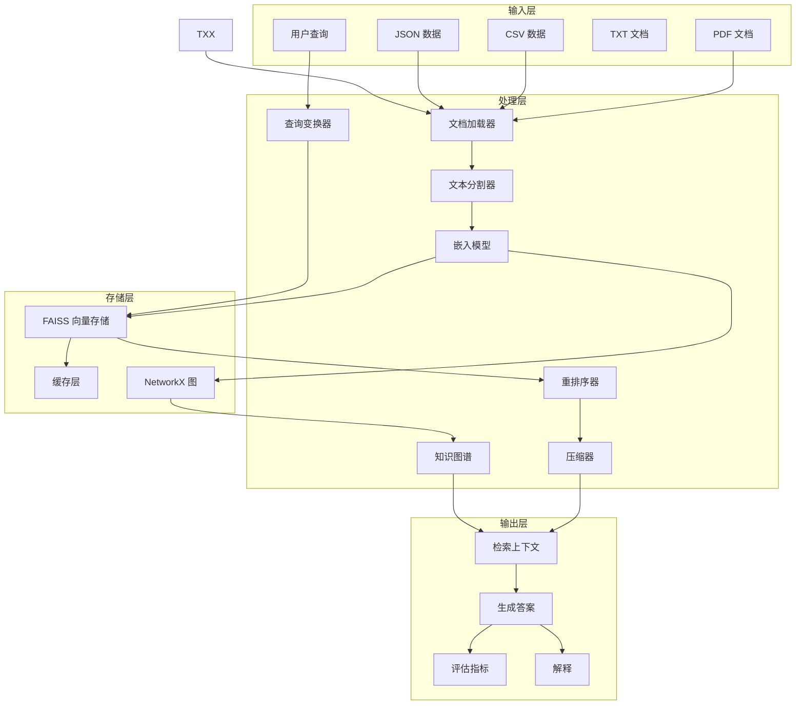
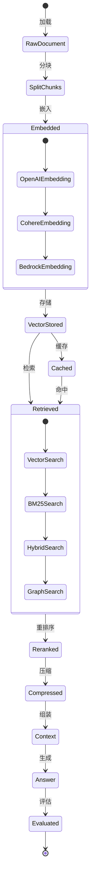

# 6. 数据模型与数据库设计 (Data Model & Database Design)

> 详细分析 Advanced RAG Techniques 项目的数据结构、向量存储模型、缓存策略、事务设计与数据流向。预计字数：~6000 字。

---

## 6.1 数据模型概述

本项目是**离线运行的代码仓库**，不涉及传统的关系型数据库设计。核心数据存储在以下形式：

| 存储形式 | 技术 | 用途 |
|----------|------|------|
| **向量存储** | FAISS / Milvus / ChromaDB | 文档嵌入存储与相似度检索 |
| **文件存储** | PDF / CSV / JSON / TXT | 原始文档数据 |
| **内存存储** | Python 对象 | 运行时数据（Document、Vector、Graph） |
| **图存储** | NetworkX | 知识图谱（Graph RAG） |

---

## 6.2 核心数据结构

### 6.2.1 LangChain Document 模型

```python
from langchain_core.documents import Document

Document(
    page_content="The Earth is the third planet from the Sun...",
    metadata={
        "source": "Understanding_Climate_Change.pdf",
        "page": 1,
        "relevance_score": 1.0,
        "chunk_id": 0,
        "summary": False,
        "index": 0,
        "type": "original"
    }
)
```

**字段说明**：

| 字段 | 类型 | 必填 | 说明 |
|------|------|------|------|
| `page_content` | str | 是 | 文档文本内容 |
| `metadata` | dict | 否 | 元数据字典 |

**metadata 常用字段**：

| 字段 | 类型 | 说明 | 使用技术 |
|------|------|------|----------|
| `source` | str | 文档来源路径 | 所有技术 |
| `page` | int | 页码 | PDF 加载 |
| `relevance_score` | float | 相关性评分 | encode_from_string |
| `chunk_id` | int | 块 ID | Hierarchical Indices |
| `summary` | bool | 是否为摘要 | Hierarchical Indices |
| `index` | int | 顺序索引 | Context Enrichment |
| `type` | str | 文档类型 | Document Augmentation |

### 6.2.2 FAISS 向量存储模型

```python
# FAISS 内部结构
FAISS Index:
├── index: faiss.IndexFlatL2 / IndexFlatIP  # 向量索引
├── docstore: InMemoryDocstore                # 文档存储
│   └── _dict: {doc_id: Document}            # ID → Document 映射
└── index_to_docstore_id: {int: str}         # 索引位置 → Doc ID
```

**向量维度**：OpenAI `text-embedding-3` → 1536 维

**索引类型**：

| 索引类型 | 距离度量 | 使用场景 |
|----------|----------|----------|
| `IndexFlatL2` | L2 欧氏距离 | 默认 |
| `IndexFlatIP` | 内积（余弦相似度） | 归一化向量 |

### 6.2.3 Pydantic 结构化输出模型

```python
# 问答输出
class QuestionAnswerFromContext(BaseModel):
    answer_based_on_content: str

# Adaptive RAG 分类
class CategoriesOptions(BaseModel):
    category: str  # "Factual" | "Analytical" | "Opinion" | "Contextual"

# Self-RAG 输出
class RetrievalResponse(BaseModel):
    response: str  # "Yes" | "No"

class SupportResponse(BaseModel):
    response: str  # "Fully supported" | "Partially supported" | "No support"

class UtilityResponse(BaseModel):
    response: int  # 1-5

# CRAG 输出
class RetrievalEvaluatorInput(BaseModel):
    relevance_score: float  # 0-1

# Reranking 输出
class RatingScore(BaseModel):
    relevance_score: float  # 1-10

# Graph RAG 输出
class Concepts(BaseModel):
    concepts_list: List[str]
```

---

## 6.3 ER 图（Mermaid）

```mermaid
erDiagram
    DOCUMENT {
        string doc_id PK
        string source
        string file_type
        int total_pages
        datetime created_at
    }
    
    CHUNK {
        string chunk_id PK
        string doc_id FK
        string page_content
        int page_number
        int chunk_index
        boolean is_summary
        float relevance_score
        vector embedding
    }
    
    KNOWLEDGE_GRAPH {
        string node_id PK
        string node_type
        string content
        float x
        float y
    }
    
    GRAPH_EDGE {
        string edge_id PK
        string source_node FK
        string target_node FK
        float weight
        string relationship
    }
    
    CONCEPT {
        string concept_id PK
        string name
        string type "entity" or "concept"
    }
    
    QUERY_LOG {
        string query_id PK
        string query_text
        string category
        datetime timestamp
        float retrieval_time
        float generation_time
    }
    
    EVALUATION_RESULT {
        string eval_id PK
        string query_id FK
        float correctness
        float faithfulness
        float relevancy
        string model_used
    }
    
    FEEDBACK {
        string feedback_id PK
        string query_text
        string response
        int relevance_score
        int quality_score
        string comments
        datetime timestamp
    }

    DOCUMENT ||--o{ CHUNK : contains
    CHUNK ||--o{ KNOWLEDGE_GRAPH : represents
    KNOWLEDGE_GRAPH ||--o{ GRAPH_EDGE : connects
    CHUNK ||--o{ CONCEPT : mentions
    QUERY_LOG ||--o{ EVALUATION_RESULT : evaluates
    QUERY_LOG ||--o{ FEEDBACK : receives
```

---

## 6.4 向量存储详细设计

### 6.4.1 FAISS 索引结构

```python
# 创建索引
embeddings = OpenAIEmbeddings()
vectorstore = FAISS.from_documents(documents, embeddings)

# 内部结构
vectorstore.index          # faiss.IndexFlatL2 (1536 维)
vectorstore.docstore       # InMemoryDocstore ({doc_id: Document})
vectorstore.index_to_docstore_id  # {0: "doc_0", 1: "doc_1", ...}
```

### 6.4.2 检索接口

```python
# 基础检索
docs = vectorstore.similarity_search(query, k=5)

# 带分数检索
docs_and_scores = vectorstore.similarity_search_with_score(query, k=5)

# 元数据过滤
docs = vectorstore.similarity_search(query, k=5, filter={"page": 1})

# MMR 检索（最大边际相关性）
docs = vectorstore.max_marginal_relevance_search(query, k=5, fetch_k=20, lambda_mult=0.5)
```

### 6.4.3 向量存储性能

| 操作 | 时间复杂度 | 10K 文档 | 100K 文档 |
|------|-----------|----------|-----------|
| 构建索引 | O(n × d) | ~10s | ~100s |
| 检索 | O(n × d) | <10ms | <100ms |
| 插入 | O(d) | <1ms | <1ms |
| 删除 | O(n) | ~10ms | ~100ms |

> n = 文档数, d = 嵌入维度 (1536)

---

## 6.5 知识图谱数据模型（Graph RAG）

### 6.5.1 节点结构

```python
# NetworkX 图节点
graph.add_node(
    node_id,                    # int (chunk index)
    text="chunk content",       # str
    metadata={...},             # dict
    concepts=["concept1", ...], # list[str]
    embedding=[0.1, 0.2, ...]   # list[float]
)
```

### 6.5.2 边结构

```python
# 基于相似度的边
graph.add_edge(
    node_i,
    node_j,
    weight=0.85  # cosine similarity
)
```

### 6.5.3 图遍历算法

```python
def traverse_graph(self, start_node, query, max_hops=3):
    """多跳图遍历"""
    visited = set()
    queue = [(start_node, 0)]
    relevant_nodes = []
    
    while queue:
        current, depth = queue.pop(0)
        if current in visited or depth > max_hops:
            continue
        visited.add(current)
        relevant_nodes.append(current)
        
        # 按权重排序邻居
        neighbors = sorted(
            self.graph.neighbors(current),
            key=lambda n: self.graph[current][n]['weight'],
            reverse=True
        )
        for neighbor in neighbors[:3]:  # top-3 邻居
            queue.append((neighbor, depth + 1))
    
    return relevant_nodes
```

---

## 6.6 数据文件结构

### 6.6.1 q_a.json（评估问答对）

```json
[
  {
    "question": "What does climate change refer to?",
    "answer": "Climate change refers to significant, long-term changes in the global climate."
  },
  {
    "question": "What activities have significantly contributed to climate change?",
    "answer": "Human activities, particularly the burning of fossil fuels and deforestation..."
  }
]
```

### 6.6.2 customers-100.csv（客户数据）

```csv
Index,Customer Id,First Name,Last Name,Company,City,Country,Phone 1,Phone 2,Email,Subscription Date,Website
1,DD37Cf93aecA6Dc,Sheryl,Baxter,Riley-Yoder,Whitburn,United Kingdom,...
```

### 6.6.3 feedback_data.json（用户反馈）

```json
{"query": "...", "response": "...", "relevance": 4, "quality": 5, "comments": ""}
{"query": "...", "response": "...", "relevance": 3, "quality": 4, "comments": ""}
```

---

## 6.7 缓存策略

### 6.7.1 当前状态

**无显式缓存**：每次运行脚本都会重新编码 PDF，重新生成嵌入。

### 6.7.2 建议缓存策略

```python
import hashlib
import pickle
import os

class VectorStoreCache:
    def __init__(self, cache_dir=".cache"):
        self.cache_dir = cache_dir
        os.makedirs(cache_dir, exist_ok=True)
    
    def get_cache_key(self, path, chunk_size, chunk_overlap):
        """基于文件内容 + 参数生成缓存键"""
        with open(path, 'rb') as f:
            content_hash = hashlib.md5(f.read()).hexdigest()
        param_hash = hashlib.md5(
            f"{chunk_size}_{chunk_overlap}".encode()
        ).hexdigest()
        return f"{content_hash}_{param_hash}"
    
    def get(self, path, chunk_size, chunk_overlap):
        """从缓存获取向量存储"""
        key = self.get_cache_key(path, chunk_size, chunk_overlap)
        cache_path = os.path.join(self.cache_dir, f"{key}.faiss")
        if os.path.exists(cache_path):
            return FAISS.load_local(cache_path, OpenAIEmbeddings())
        return None
    
    def set(self, path, chunk_size, chunk_overlap, vectorstore):
        """保存向量存储到缓存"""
        key = self.get_cache_key(path, chunk_size, chunk_overlap)
        cache_path = os.path.join(self.cache_dir, f"{key}.faiss")
        vectorstore.save_local(cache_path)
```

---

## 6.8 数据流向图



---

## 6.9 数据生命周期



---

## 6.10 数据规模估算

| 数据类型 | 规模 | 存储需求 |
|----------|------|----------|
| PDF 文档 | 206 KB（Climate Change） | ~1MB（含嵌入） |
| 向量数 | ~200 块（chunk_size=1000） | ~1.2 MB（200 × 1536 × 4 bytes） |
| 知识图谱 | ~200 节点 + ~1000 边 | ~500 KB |
| 评估数据 | ~50 问答对 | ~50 KB |
| 总存储 | - | < 5 MB |

---

## 6.11 数据一致性

### 6.11.1 一致性策略

| 方面 | 策略 |
|------|------|
| **向量-文档一致性** | FAISS 内部维护 `index_to_docstore_id` 映射 |
| **图谱-文档一致性** | 节点 ID 对应 chunk index |
| **缓存一致性** | 基于文件内容哈希的缓存键 |

### 6.11.2 事务设计

当前项目**无显式事务**（单线程脚本），建议：

```python
import tempfile
import shutil

def atomic_save(vectorstore, path):
    """原子保存向量存储"""
    with tempfile.TemporaryDirectory() as tmpdir:
        vectorstore.save_local(tmpdir)
        shutil.move(tmpdir, path)
```

---

☕️ 制作不易，请我喝咖啡☕️关注我➕

