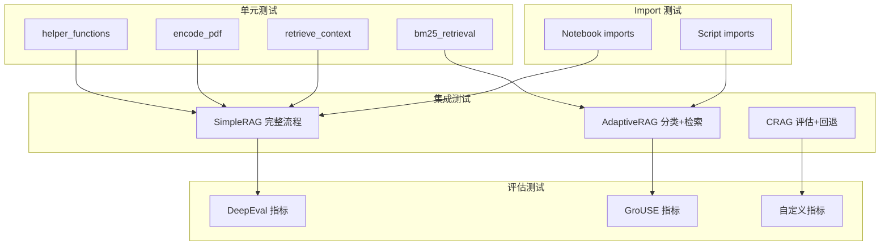

# 10. 开发者上手指南 (Developer Guide)

> 面向开发者的完整上手指南，包含本地运行、调试、测试流程、架构决策记录（ADR）、算法分析、测试策略。预计字数：~10000 字。

---

## 10.1 开发者上手指南

### 10.1.1 环境准备

#### 系统要求

| 组件 | 最低要求 | 推荐配置 |
|------|----------|----------|
| **操作系统** | Linux/macOS/Windows | Linux/macOS |
| **Python** | 3.10+ | 3.12.6 |
| **内存** | 4 GB | 8 GB+ |
| **磁盘** | 500 MB 可用空间 | 1 GB+ |
| **网络** | 可访问 OpenAI API | 稳定高速网络 |
| **Git** | 2.0+ | 最新版 |

#### 安装步骤

```bash
# 1. 克隆仓库
git clone https://github.com/NirDiamant/RAG_Techniques.git
cd RAG_Techniques

# 2. 创建虚拟环境
python -m venv venv

# 3. 激活虚拟环境
# Linux/macOS:
source venv/bin/activate
# Windows:
# venv\Scripts\activate

# 4. 升级 pip
pip install --upgrade pip

# 5. 安装依赖
pip install -r requirements.txt

# 6. 安装 NLTK 数据
python -c "import nltk; nltk.download('punkt'); nltk.download('wordnet'); nltk.download('punkt_tab')"

# 7. 安装 spaCy 模型
python -m spacy download en_core_web_sm

# 8. 配置环境变量
cp .env.example .env  # 如果不存在，手动创建
# 编辑 .env 添加 OPENAI_API_KEY
```

#### 环境变量配置

```bash
# .env 文件
OPENAI_API_KEY=sk-your-key-here
# 可选
ANTHROPIC_API_KEY=sk-ant-...
COHERE_API_KEY=...
```

### 10.1.2 本地运行

#### 运行第一个 RAG 脚本

```bash
# 基础 RAG
python all_rag_techniques_runnable_scripts/simple_rag.py \
    --path data/Understanding_Climate_Change.pdf \
    --query "What is the main cause of climate change?"

# 带评估
python all_rag_techniques_runnable_scripts/simple_rag.py \
    --path data/Understanding_Climate_Change.pdf \
    --query "What is climate change?" \
    --evaluate

# 自定义参数
python all_rag_techniques_runnable_scripts/simple_rag.py \
    --path data/Understanding_Climate_Change.pdf \
    --chunk_size 800 \
    --chunk_overlap 150 \
    --n_retrieved 5 \
    --query "Explain the greenhouse effect"
```

#### 运行 Notebook

```bash
# 启动 Jupyter
jupyter notebook

# 或 JupyterLab
jupyter lab

# 打开 all_rag_techniques/simple_rag.ipynb
```

#### 运行特定技术

```bash
# HyDE
python all_rag_techniques_runnable_scripts/HyDe_Hypothetical_Document_Embedding.py \
    --path data/Understanding_Climate_Change.pdf \
    --query "What are the impacts of climate change?"

# Fusion Retrieval
python all_rag_techniques_runnable_scripts/fusion_retrieval.py \
    --path data/Understanding_Climate_Change.pdf \
    --query "How does climate change affect biodiversity?" \
    --alpha 0.6 \
    --k 5

# Reranking
python all_rag_techniques_runnable_scripts/reranking.py \
    --path data/Understanding_Climate_Change.pdf \
    --query "Climate change solutions" \
    --retriever_type cross_encoder

# CRAG
python all_rag_techniques_runnable_scripts/crag.py \
    --path data/Understanding_Climate_Change.pdf \
    --query "What is the Paris Agreement?"

# Adaptive RAG
python all_rag_techniques_runnable_scripts/adaptive_retrieval.py

# Self-RAG
python all_rag_techniques_runnable_scripts/self_rag.py \
    --path data/Understanding_Climate_Change.pdf \
    --query "What are the main greenhouse gases?"

# Graph RAG
python all_rag_techniques_runnable_scripts/graph_rag.py \
    --path data/Understanding_Climate_Change.pdf \
    --query "What is the relationship between CO2 and global warming?"
```

### 10.1.3 调试指南

#### 使用 print 调试

```python
# 在脚本中添加 print
def run(self, query):
    print(f"[DEBUG] Query: {query}")
    print(f"[DEBUG] Vector store size: {self.vectorstore.index.ntotal}")
    docs = self.retrieve(query)
    print(f"[DEBUG] Retrieved {len(docs)} documents")
    for i, doc in enumerate(docs):
        print(f"[DEBUG] Doc {i}: {doc.page_content[:100]}...")
```

#### 使用 pdb 调试

```python
import pdb

def retrieve(self, query):
    pdb.set_trace()  # 断点
    docs = self.vectorstore.similarity_search(query, k=self.k)
    return docs
```

#### 使用 VS Code 调试

```json
// .vscode/launch.json
{
    "version": "0.2.0",
    "configurations": [
        {
            "name": "Python: Simple RAG",
            "type": "debugpy",
            "request": "launch",
            "program": "${workspaceFolder}/all_rag_techniques_runnable_scripts/simple_rag.py",
            "args": [
                "--path", "data/Understanding_Climate_Change.pdf",
                "--query", "What is climate change?"
            ],
            "console": "integratedTerminal",
            "env": {
                "OPENAI_API_KEY": "${env:OPENAI_API_KEY}"
            }
        }
    ]
}
```

#### 使用 IPython embed

```python
from IPython import embed

def run(self, query):
    docs = self.retrieve(query)
    embed()  # 进入交互式 IPython 环境
```

---

## 10.2 测试流程

### 10.2.1 运行所有测试

```bash
# 全部测试
pytest

# 详细输出
pytest -v

# 带覆盖率
pip install pytest-cov
pytest --cov=. --cov-report=html

# 排除特定文件
pytest --exclude "all_rag_techniques/large_notebook.ipynb"
```

### 10.2.2 运行特定测试

```bash
# 仅测试 Notebook import
pytest tests/test_imports.py::test_notebook_imports -v

# 仅测试 Script import
pytest tests/test_imports.py::test_script_imports -v

# 仅测试特定目录
pytest tests/test_imports.py -k "notebook"
```

### 10.2.3 编写新测试

```python
# tests/test_simple_rag.py
import pytest
from all_rag_techniques_runnable_scripts.simple_rag import SimpleRAG

def test_simple_rag_initialization():
    """测试 SimpleRAG 初始化"""
    rag = SimpleRAG("data/Understanding_Climate_Change.pdf")
    assert rag.vectorstore is not None
    assert rag.vectorstore.index.ntotal > 0

def test_simple_rag_retrieval():
    """测试 SimpleRAG 检索"""
    rag = SimpleRAG("data/Understanding_Climate_Change.pdf")
    rag.run("What is climate change?")
    assert 'Retrieval' in rag.time_records

def test_simple_rag_chunk_size_validation():
    """测试参数验证"""
    with pytest.raises(ValueError):
        SimpleRAG("data/test.pdf", chunk_size=-1)
```

### 10.2.4 测试策略



---

## 10.3 架构决策记录（ADR）

### ADR-001: 选择 LangChain 作为主要框架

- **状态**: 已接受
- **日期**: 2024-01
- **上下文**: 需要一个 RAG 编排框架来统一各种技术的实现
- **决策**: 使用 LangChain 作为主要框架，LlamaIndex 作为辅助
- **理由**:
  - LangChain 的 `BaseRetriever`、`Chain`、`PromptTemplate` 抽象非常适合 RAG
  - 社区活跃，文档丰富
  - 支持多种 LLM 和向量存储
- **后果**:
  - 正面：代码一致性高，易于扩展
  - 负面：框架升级可能带来 breaking changes

### ADR-002: Notebook + Script 双轨制

- **状态**: 已接受
- **日期**: 2024-01
- **上下文**: 需要同时满足教学和生产需求
- **决策**: 每个技术提供 Notebook（教学）和 Script（生产）两种形式
- **理由**:
  - Notebook 适合可视化、解释、交互
  - Script 适合 CLI 运行、批处理、自动化
- **后果**:
  - 正面：覆盖不同使用场景
  - 负面：需要维护两份代码

### ADR-003: 共享 helper_functions.py

- **状态**: 已接受
- **日期**: 2024-01
- **上下文**: 避免代码重复，确保一致性
- **决策**: 创建 `helper_functions.py` 作为唯一共享模块
- **理由**:
  - 统一的编码/检索/问答接口
  - 减少维护成本
- **后果**:
  - 正面：高度复用
  - 负面：单点故障，修改影响所有技术

### ADR-004: Pydantic 结构化输出

- **状态**: 已接受
- **日期**: 2024-06
- **上下文**: 需要确保 LLM 输出符合预期格式
- **决策**: 使用 Pydantic BaseModel + `with_structured_output()`
- **理由**:
  - 类型安全
  - 自动验证
  - 减少解析错误
- **后果**:
  - 正面：输出可靠
  - 负面：需要额外定义 Model 类

### ADR-005: FAISS 作为默认向量存储

- **状态**: 已接受
- **日期**: 2024-01
- **上下文**: 需要本地向量存储
- **决策**: 默认使用 FAISS，支持 Milvus/ChromaDB 扩展
- **理由**:
  - 纯 Python，无需额外服务
  - 性能好（CPU/GPU）
  - LangChain 原生支持
- **后果**:
  - 正面：易于部署
  - 负面：不支持分布式

### ADR-006: 指数退避重试策略

- **状态**: 已接受
- **日期**: 2024-03
- **上下文**: 处理 OpenAI API 速率限制
- **决策**: 实现 `retry_with_exponential_backoff()` 异步重试
- **理由**:
  - 2^n 退避 + 抖动是行业标准
  - 异步实现不阻塞
- **后果**:
  - 正面：提高可靠性
  - 负面：增加延迟

---

## 10.4 关键算法分析

### 10.4.1 BM25 检索算法

```python
# 伪代码
function BM25_retrieve(query, documents, k):
    # 1. 分词
    query_tokens = tokenize(query)
    
    # 2. 计算每个文档的 BM25 分数
    scores = []
    for doc in documents:
        score = 0
        for term in query_tokens:
            # IDF 分量
            idf = log((N - n_t + 0.5) / (n_t + 0.5) + 1)
            # TF 分量
            tf = f_t * (k1 + 1) / (f_t + k1 * (1 - b + b * dl / avgdl))
            score += idf * tf
        scores.append(score)
    
    # 3. 排序取 top-k
    return documents[argsort(scores)[-k:]]
```

**复杂度**：
- 时间：O(n × m)，n 为文档数，m 为查询词数
- 空间：O(n)

### 10.4.2 Fusion Retrieval 算法

```python
# 伪代码
function fusion_retrieve(query, vectorstore, bm25, k, alpha):
    # 1. 获取所有文档
    all_docs = vectorstore.similarity_search("", k=ntotal)
    
    # 2. 向量检索分数
    vector_scores = vectorstore.similarity_search_with_score(query)
    vector_scores = normalize(vector_scores)  # min-max 归一化
    
    # 3. BM25 检索分数
    bm25_scores = bm25.get_scores(tokenize(query))
    bm25_scores = normalize(bm25_scores)
    
    # 4. 加权融合
    combined = alpha * vector_scores + (1 - alpha) * bm25_scores
    
    # 5. 排序取 top-k
    return all_docs[argsort(combined)[-k:]]
```

**复杂度**：
- 时间：O(n log n)，排序主导
- 空间：O(n)

### 10.4.3 RAPTOR 递归树构建

```python
# 伪代码
function build_raptor_tree(documents, level=0):
    # 1. 嵌入
    embeddings = embed(documents)
    
    # 2. 聚类
    labels = GaussianMixture(n_clusters=10).fit_predict(embeddings)
    
    # 3. 每类生成摘要
    summaries = []
    for cluster_id in unique(labels):
        cluster_docs = documents[labels == cluster_id]
        summary = llm.summarize(cluster_docs)
        summaries.append(summary)
    
    # 4. 递归或终止
    if len(summaries) > 1:
        return build_raptor_tree(summaries, level + 1)
    else:
        return tree  # 根节点
```

**复杂度**：
- 时间：O(L × n × d)，L 为层数，n 为节点数，d 为嵌入维度
- 空间：O(n × d)

### 10.4.4 Self-RAG 评估链

```python
# 伪代码
function self_rag(query, vectorstore):
    # 1. 检索决策
    if needs_retrieval(query) == "Yes":
        docs = vectorstore.search(query)
        
        # 2. 相关性评估
        relevant = []
        for doc in docs:
            if is_relevant(query, doc) == "Relevant":
                relevant.append(doc)
        
        # 3. 生成 + 评估
        best = None
        for context in relevant:
            response = generate(query, context)
            support = assess_support(response, context)
            utility = assess_utility(query, response)
            if best is None or (support, utility) > best[1:]:
                best = (response, support, utility)
        
        return best[0]
    else:
        return generate(query, no_context=True)
```

**复杂度**：
- 时间：O(k × L)，k 为检索数，L 为 LLM 调用延迟
- 空间：O(k × d)

### 10.4.5 Graph RAG 图谱遍历

```python
# 伪代码
function graph_rag_query(query, graph, vectorstore):
    # 1. 找到最近节点
    query_embedding = embed(query)
    closest_node = argmax(cosine_similarity(query_embedding, node_embeddings))
    
    # 2. BFS 多跳遍历
    visited = set()
    queue = [(closest_node, 0)]
    relevant_nodes = []
    
    while queue:
        node, depth = queue.pop(0)
        if node in visited or depth > max_hops:
            continue
        visited.add(node)
        relevant_nodes.append(node)
        
        # 按权重排序邻居
        neighbors = sorted(graph.neighbors(node), 
                          key=lambda n: graph[node][n]['weight'],
                          reverse=True)
        for neighbor in neighbors[:top_k]:
            queue.append((neighbor, depth + 1))
    
    # 3. 生成上下文
    context = "\n".join([graph.nodes[n]['text'] for n in relevant_nodes])
    return context
```

**复杂度**：
- 时间：O(b^h)，b 为分支因子，h 为跳数
- 空间：O(b^h)

---

## 10.5 主要测试用例

### 10.5.1 单元测试用例

```python
# tests/test_helper_functions.py

def test_encode_pdf_success():
    """测试 PDF 编码成功"""
    vs = encode_pdf("data/Understanding_Climate_Change.pdf")
    assert vs is not None
    assert vs.index.ntotal > 0

def test_encode_pdf_file_not_found():
    """测试文件不存在时的错误"""
    with pytest.raises(FileNotFoundError):
        encode_pdf("nonexistent.pdf")

def test_encode_from_string_empty():
    """测试空字符串输入"""
    with pytest.raises(ValueError):
        encode_from_string("")

def test_retrieve_context_returns_list():
    """测试检索返回列表"""
    vs = encode_pdf("data/Understanding_Climate_Change.pdf")
    retriever = vs.as_retriever()
    context = retrieve_context_per_question("test", retriever)
    assert isinstance(context, list)
    assert len(context) > 0

def test_bm25_retrieval_top_k():
    """测试 BM25 返回指定数量"""
    docs = ["doc1", "doc2", "doc3", "doc4", "doc5"]
    tokenized = [d.split() for d in docs]
    bm25 = BM25Okapi(tokenized)
    results = bm25_retrieval(bm25, docs, "test query", k=3)
    assert len(results) == 3
```

### 10.5.2 集成测试用例

```python
# tests/test_integration.py

def test_simple_rag_end_to_end():
    """测试 SimpleRAG 完整流程"""
    rag = SimpleRAG("data/Understanding_Climate_Change.pdf")
    rag.run("What is climate change?")
    assert 'Chunking' in rag.time_records
    assert 'Retrieval' in rag.time_records

def test_hyde_retrieval():
    """测试 HyDE 检索"""
    retriever = HyDERetriever("data/Understanding_Climate_Change.pdf")
    docs, hypo_doc = retriever.retrieve("climate change causes")
    assert len(docs) > 0
    assert len(hypo_doc) > 0

def test_fusion_retrieval():
    """测试混合检索"""
    rag = FusionRetrievalRAG("data/Understanding_Climate_Change.pdf")
    rag.run("climate change impacts", k=5)
    # 验证结果
```

### 10.5.3 评估测试用例

```python
# tests/test_evaluation.py

def test_deepeval_correctness():
    """测试 DeepEval 正确性评估"""
    test_case = LLMTestCase(
        input="What is climate change?",
        expected_output="Long-term changes in climate",
        actual_output="Climate change is long-term shifts",
        retrieval_context=["Climate change refers to..."]
    )
    metric = GEval(name="Correctness", ...)
    # 验证指标计算

def test_rag_evaluation_pipeline():
    """测试完整评估流水线"""
    retriever = SimpleRAG("data/Understanding_Climate_Change.pdf").chunks_query_retriever
    results = evaluate_rag(retriever, num_questions=3)
    assert "questions" in results
    assert "results" in results
```

---

## 10.6 贡献指南

### 10.6.1 添加新技术

1. **创建 Notebook**：在 `all_rag_techniques/` 下创建 `{technique_name}.ipynb`
2. **创建 Script**：在 `all_rag_techniques_runnable_scripts/` 下创建 `{technique_name}.py`
3. **更新 README**：在列表和表格中添加新技术
4. **测试**：确保通过 `pytest`
5. **提交 PR**：遵循贡献流程

### 10.6.2 代码风格

```python
# 遵循 PEP 8
# 使用类型提示
def encode_pdf(path: str, chunk_size: int = 1000) -> FAISS:
    """编码 PDF 为向量存储。

    Args:
        path: PDF 文件路径
        chunk_size: 文本块大小

    Returns:
        FAISS 向量存储对象
    """
    # 实现
```

### 10.6.3 PR 检查清单

- [ ] 代码通过 `pytest`
- [ ] 添加了类型提示
- [ ] 更新了 README
- [ ] 添加了文档字符串
- [ ] 无硬编码路径
- [ ] 错误处理完善

---

## 10.7 常见问题（FAQ）

### Q1: 运行脚本时提示 API Key 无效

**A**: 检查 `.env` 文件是否存在且包含有效的 `OPENAI_API_KEY`。

### Q2: 导入失败（ImportError）

**A**: 确保已安装所有依赖：`pip install -r requirements.txt`

### Q3: 检索结果质量差

**A**: 尝试调整 `chunk_size` 和 `chunk_overlap`，或使用更高级的技术（如 HyDE、Reranking）

### Q4: 内存不足

**A**: 减小 `chunk_size` 或使用 FAISS GPU 版本

### Q5: 如何添加自定义数据

**A**: 将 PDF/CSV 文件放入 `data/` 目录，修改 `--path` 参数

### Q6: 如何切换 LLM 模型

**A**: 修改脚本中的 `model_name` 参数，如 `gpt-4o` → `gpt-4o-mini`

### Q7: 如何评估 RAG 质量

**A**: 使用 `--evaluate` 标志或运行 `evaluation/` 下的 Notebook

### Q8: 贡献被拒绝的常见原因

**A**: 
- 未更新 README
- 未通过测试
- 代码风格不一致
- 缺少文档字符串

---

## 10.8 学习路径建议

### 10.8.1 初学者路径

```
Week 1: Simple RAG → CSV RAG → Chunk Size
Week 2: Query Transformations → HyDE → HyPE
Week 3: Semantic Chunking → Context Enrichment → Compression
Week 4: Fusion Retrieval → Reranking → Evaluation
```

### 10.8.2 进阶路径

```
Week 1: Adaptive RAG → Self-RAG → CRAG
Week 2: Graph RAG → RAPTOR → Hierarchical Indices
Week 3: Multi-modal → Agentic RAG → MemoRAG
Week 4: 自定义技术 → 贡献 PR
```

### 10.8.3 研究路径

```
1. 阅读相关论文
2. 运行对应 Notebook 理解实现
3. 修改参数实验
4. 对比不同技术效果
5. 撰写博客/论文
```

---

## 10.9 资源链接

| 资源 | 链接 |
|------|------|
| GitHub 仓库 | https://github.com/NirDiamant/RAG_Techniques |
| 配套书籍 | RAG Made Simple |
| 在线课程 | Prompt to Production |
| Newsletter | DiamantAI Newsletter |
| Discord | RAG Techniques Community |
| Colab | 各 Notebook 的 Colab 按钮 |

---

## 10.10 总结

本指南涵盖了开发者使用 Advanced RAG Techniques 项目的完整流程：

1. **环境准备** → 安装依赖、配置 API Key
2. **本地运行** → 运行脚本和 Notebook
3. **调试** → 使用 print/pdb/VS Code
4. **测试** → pytest + 覆盖率
5. **贡献** → PR 流程 + 代码风格
6. **学习** → 渐进式学习路径
7. **研究** → 论文复现 + 实验

祝学习愉快！

---

# ❤️ 制作不易，请我喝咖啡☕️关注我➕

