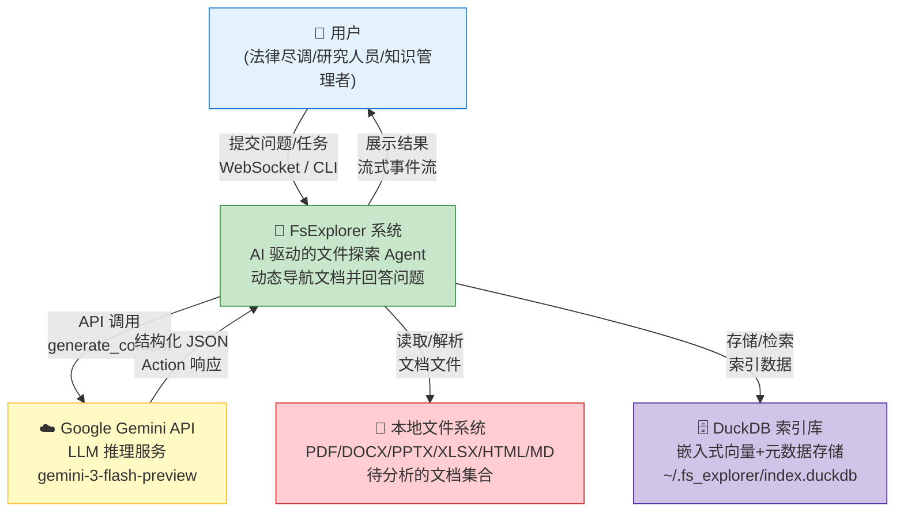
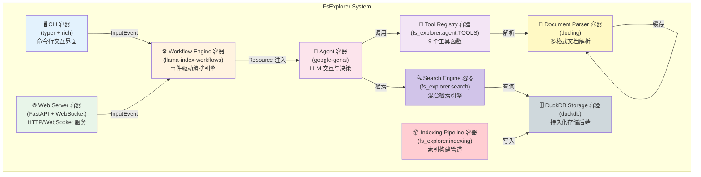

# FsExplorer C4 架构模型

> **版本**: v0.1.0  
> **最后更新**: 2026-07-26  
> **方法论**: C4 Model for Software Architecture

---

## 目录

1. [C4 模型概述](#1-c4-模型概述)
2. [Level 1: 系统上下文图 (System Context)](#2-level-1-系统上下文图-system-context)
3. [Level 2: 容器图 (Container)](#3-level-2-容器图-container)
4. [Level 3: 组件图 (Component)](#4-level-3-组件图-component)
5. [Level 4: 代码图 (Code)](#5-level-4-代码图-code)

---

## 1. C4 模型概述

C4 模型是由 Simon Brown 提出的软件架构可视化方法，包含四个抽象层次：

| 层级 | 名称 | 关注点 | 受众 |
|------|------|--------|------|
| Level 1 | System Context | 系统与外部实体的关系 | 所有利益相关者 |
| Level 2 | Container | 系统内部的应用/数据存储 | 开发者、运维 |
| Level 3 | Component | 容器内部的组件结构 | 开发者 |
| Level 4 | Code | 类/接口级别的设计 | 开发者 |

---

## 2. Level 1: 系统上下文图 (System Context)

### 2.1 上下文图



### 2.2 上下文边界详解

FsExplorer 系统作为核心枢纽，连接四个外部实体，共同构成一个完整的动态文档探索生态。以下从系统边界、外部依赖、交互协议和数据流四个维度进行深入分析。

#### 2.2.1 系统边界定义

FsExplorer 系统的边界由以下接口定义：

- **北向接口**：面向用户的任务提交接口（CLI 参数 / WebSocket JSON）
- **南向接口**：面向基础设施的 API 调用和文件读取接口
- **内部能力**：Agent 决策引擎、工具执行环境、工作流编排、索引管道

系统内部包含完整的探索逻辑，用户只需提供自然语言问题和目标文件夹即可获得带引用的答案，无需了解内部实现细节。

#### 2.2.2 外部依赖分析

**Google Gemini API** 是系统最关键外部依赖，承担以下职责：

1. **推理决策**：接收对话历史和系统提示，返回结构化的 Action JSON
2. **嵌入计算**：提供 `gemini-embedding-001` 向量嵌入服务（可选）
3. **实体提取**：langextract 底层调用 Gemini 进行命名实体识别

Gemini API 的可用性直接影响系统功能。系统通过 `GOOGLE_API_KEY` 环境变量进行认证，API 版本为 `v1beta`，使用 `gemini-3-flash-preview` 模型以平衡成本与性能。

**本地文件系统** 是数据源，支持以下格式：
- PDF（扫描件 + 数字文档）
- DOCX / DOC（Word 文档）
- PPTX（演示文稿）
- XLSX（电子表格）
- HTML（网页文档）
- MD（Markdown）

文件系统访问遵循最小权限原则，仅读取用户显式指定的目录。

**DuckDB 索引库** 是可选的持久化存储层，默认路径为 `~/.fs_explorer/index.duckdb`。当启用索引模式时，系统将：
- 存储解析后的文档内容
- 存储文本块（chunks）及其向量嵌入
- 存储元数据 JSON 和 Schema 定义
- 提供语义检索和元数据过滤查询

#### 2.2.3 交互协议

| 交互 | 协议 | 数据格式 | 认证 |
|------|------|----------|------|
| 用户 → System | CLI / WebSocket | 纯文本 / JSON | 无 |
| System → Gemini | HTTPS / JSON | `application/json` + `response_schema` | API Key |
| System → Filesystem | 文件系统调用 | 二进制文件 | OS 权限 |
| System → DuckDB | DuckDB 嵌入式协议 | SQL | 文件权限 |

#### 2.2.4 数据流概览

```
用户输入 (自然语言问题)
    ↓
[输入解析] → 提取 task, folder, use_index 等参数
    ↓
[工作流启动] → InputEvent → start_exploration 步骤
    ↓
[Agent 决策循环]
    ├── LLM 推理 → 生成 Action JSON
    ├── 工具执行 → 文件系统操作 / 索引查询
    └── 结果累积 → chat_history 更新
    ↓
[终止条件] → StopAction 或超时
    ↓
[结果输出] → final_result (含引用) + 统计信息
```

---

## 3. Level 2: 容器图 (Container)

### 3.1 容器图



### 3.2 容器职责与通信详解

容器图揭示了 FsExplorer 系统内部的八个核心容器，每个容器承担明确的职责边界，通过定义良好的接口进行通信。以下详细阐述各容器的设计决策、职责范围和交互模式。

#### 3.2.1 CLI 容器 (typer + rich)

CLI 容器是系统的命令行入口点，由 `main.py` 中的 Typer 应用实现。其主要职责包括：

1. **参数解析**：通过 Typer 的 `Option` 和 `Argument` 注解解析命令行参数
2. **工作流驱动**：创建 `InputEvent` 并启动 Workflow 执行
3. **事件处理**：监听流式事件并渲染 Rich Panel 输出
4. **结果展示**：格式化最终答案、Token 统计、引用来源
5. **子命令管理**：`index`、`query`、`schema discover`、`schema show`

CLI 容器通过 `asyncio.run()` 桥接同步 CLI 与异步 Workflow，内部使用 `console.status()` 提供实时进度反馈。

#### 3.2.2 Web Server 容器 (FastAPI + WebSocket)

Web Server 容器提供基于 HTTP 和 WebSocket 的 Web 交互能力：

1. **静态资源服务**：`GET /` 返回单文件 HTML UI (`ui.html`)
2. **文件夹浏览 API**：`GET /api/folders` 列出目录结构
3. **索引状态 API**：`GET /api/index/status` 查询索引状态
4. **索引构建 API**：`POST /api/index` 触发索引构建
5. **搜索 API**：`POST /api/search` 直接搜索索引
6. **WebSocket 探索**：`WS /ws/explore` 实时流式探索

WebSocket 协议定义了客户端-服务器消息格式：
- 客户端发送：`{"task": "...", "folder": "...", "use_index": bool}`
- 服务器推送：`{"type": "tool_call|go_deeper|ask_human|complete|error", "data": {...}}`

#### 3.2.3 Workflow Engine 容器 (llama-index-workflows)

Workflow Engine 是系统的编排核心，基于 llama-index-workflows 的事件驱动架构：

1. **状态管理**：通过 `WorkflowState` Pydantic 模型维护执行状态
2. **事件系统**：定义了 7 种事件类型驱动状态转换
3. **步骤编排**：4 个 `@step` 装饰的处理步骤
4. **资源注入**：通过 `Annotated[FsExplorerAgent, Resource(get_agent)]` 实现单例注入
5. **流式输出**：`ctx.write_event_to_stream()` 推送事件到订阅者
6. **超时控制**：`WORKFLOW_TIMEOUT_SECONDS = 300` 全局超时

Workflow 实现了有限状态机模式，状态转换包括：
- `start_exploration` → `tool_call_action` / `go_deeper_action` / `receive_human_answer`
- 循环直到生成 `ExplorationEndEvent`

#### 3.2.4 Agent 容器 (google-genai)

Agent 容器封装了与 Google Gemini API 的交互逻辑：

1. **对话管理**：维护 `_chat_history: list[Content]` 累积对话上下文
2. **任务配置**：`configure_task()` 追加用户消息到历史
3. **动作决策**：`take_action()` 发送历史到 LLM，接收 Action JSON
4. **工具执行**：`call_tool()` 调用 TOOLS 注册表中的函数
5. **Token 追踪**：`TokenUsage` 数据类记录 API 调用和费用
6. **系统提示**：`SYSTEM_PROMPT` 定义三阶段策略和工具使用说明

Agent 采用单例模式（通过 `contextvars.ContextVar` 实现每任务单例），确保对话状态隔离。

#### 3.2.5 Tool Registry 容器 (fs_explorer.agent.TOOLS)

Tool Registry 是一个字典映射，将工具名称与实现函数关联：

```python
TOOLS: dict[Tools, Callable[..., str]] = {
    "read": read_file,
    "grep": grep_file_content,
    "glob": glob_paths,
    "scan_folder": scan_folder,
    "preview_file": preview_file,
    "parse_file": parse_file,
    "semantic_search": semantic_search,
    "get_document": get_document,
    "list_indexed_documents": list_indexed_documents,
}
```

工具分为三类：
- **Filesystem 工具**：read, grep, glob（直接操作文件系统）
- **Document 工具**：scan_folder, preview_file, parse_file（使用 Docling 解析）
- **Indexed 工具**：semantic_search, get_document, list_indexed_documents（查询 DuckDB）

#### 3.2.6 Document Parser 容器 (docling)

Document Parser 基于 Docling 库实现多格式文档到 Markdown 的转换：

1. **格式检测**：自动检测输入文件格式
2. **内容提取**：提取文本、表格、图像（导出为描述）
3. **结构保持**：保留标题层级、列表、表格结构
4. **Markdown 导出**：统一输出为 Markdown 格式
5. **缓存层**：基于 `{path}:{mtime}` 键的内存缓存避免重复解析

缓存策略确保同一文档在多次工具调用中只解析一次，显著提升性能。

#### 3.2.7 Indexing Pipeline 容器 (fs_explorer.indexing)

Indexing Pipeline 负责将文件系统文档转换为可检索的索引：

1. **文件发现**：`os.walk()` 遍历目录，筛选支持的扩展名
2. **文档解析**：调用 `parse_file()` 获取 Markdown 内容
3. **智能分块**：`SmartChunker` 按段落边界切分（1500 字符 + 150 重叠）
4. **元数据提取**：启发式字段 + 可选 langextract 实体提取
5. **向量嵌入**：调用 `EmbeddingProvider` 生成 chunk 嵌入
6. **DuckDB 写入**：批量 upsert 文档、chunks、embeddings
7. **Schema 管理**：自动发现和存储元数据 Schema
8. **删除清理**：标记已删除文件，维护索引一致性

#### 3.2.8 Search Engine 容器 (fs_explorer.search)

Search Engine 实现混合检索逻辑：

1. **语义检索**：向量余弦相似度（使用 DuckDB 的 `array_cosine_similarity`）
2. **关键词检索**：SQL LIKE 词项匹配（回退方案）
3. **元数据过滤**：JSON 路径查询（`json_extract_string`）
4. **过滤器解析**：将人类可读 DSL 转换为 `MetadataFilter` 对象
5. **并行执行**：`ThreadPoolExecutor(max_workers=2)` 并行语义+元数据检索
6. **结果合并**：加权评分公式合并多路结果
7. **排序限制**：`rank_documents()` 按 combined_score 排序

#### 3.2.9 DuckDB Storage 容器 (duckdb)

DuckDB Storage 提供嵌入式持久化存储：

1. **表结构**：`corpora`, `documents`, `chunks`, `schemas`, `chunk_embeddings`
2. **稳定 ID**：SHA1 哈希生成确定性 ID
3. **Upsert 语义**：`INSERT ... ON CONFLICT DO UPDATE`
4. **向量检索**：VSS 扩展 + HNSW 索引（可选）
5. **JSON 查询**：`json_extract_string()` 元数据过滤
6. **删除标记**：软删除机制，标记而非物理删除

---

## 4. Level 3: 组件图 (Component)

### 4.1 组件图

```mermaid
graph TB
    subgraph "Agent Container"
        FsExplorerAgent["FsExplorerAgent<br/>Gemini 交互 + 对话管理"]
        TokenUsage["TokenUsage<br/>Token 追踪 + 费用估算"]
        TOOLS["TOOLS Registry<br/>工具名称→函数映射"]
        SYSTEM_PROMPT["SYSTEM_PROMPT<br/>三阶段策略提示"]
        IndexContext["IndexContext<br/>索引执行上下文"]
    end
    
    subgraph "Workflow Container"
        FsExplorerWorkflow["FsExplorerWorkflow<br/>事件驱动步骤编排"]
        WorkflowState["WorkflowState<br/>工作流状态模型"]
        Events["Events<br/>InputEvent / ToolCallEvent<br/>GoDeeperEvent / AskHumanEvent<br/>HumanAnswerEvent / ExplorationEndEvent"]
        Steps["Steps<br/>start_exploration<br/>go_deeper_action<br/>tool_call_action<br/>receive_human_answer"]
    end
    
    subgraph "Indexing Container"
        IndexingPipeline["IndexingPipeline<br/>索引构建编排"]
        SmartChunker["SmartChunker<br/>段落感知分块器"]
        SchemaDiscovery["SchemaDiscovery<br/>元数据 Schema 自动发现"]
        MetadataExtractor["extract_metadata()<br/>启发式 + langextract"]
        EmbeddingProvider["EmbeddingProvider<br/>向量嵌入服务"]
    end
    
    subgraph "Search Container"
        IndexedQueryEngine["IndexedQueryEngine<br/>并行检索引擎"]
        FilterParser["parse_metadata_filters()<br/>过滤器 DSL 解析器"]
        Ranker["rank_documents()<br/>结果排序器"]
        SemanticEngine["SemanticSearchEngine<br/>向量语义搜索"]
    end
    
    subgraph "Storage Container"
        DuckDBStorage["DuckDBStorage<br/>DuckDB 存储实现"]
        StorageBackend["StorageBackend Protocol<br/>存储接口契约"]
        DataModels["Data Models<br/>DocumentRecord / ChunkRecord<br/>SchemaRecord"]
    end
    
    FsExplorerAgent --> TokenUsage
    FsExplorerAgent --> TOOLS
    FsExplorerAgent --> SYSTEM_PROMPT
    FsExplorerAgent --> IndexContext
    
    FsExplorerWorkflow --> FsExplorerAgent
    FsExplorerWorkflow --> WorkflowState
    FsExplorerWorkflow --> Events
    FsExplorerWorkflow --> Steps
    
    IndexingPipeline --> SmartChunker
    IndexingPipeline --> SchemaDiscovery
    IndexingPipeline --> MetadataExtractor
    IndexingPipeline --> EmbeddingProvider
    IndexingPipeline --> DuckDBStorage
    
    IndexedQueryEngine --> FilterParser
    IndexedQueryEngine --> Ranker
    IndexedQueryEngine --> SemanticEngine
    IndexedQueryEngine --> DuckDBStorage
    
    DuckDBStorage -.->|实现| StorageBackend
    DuckDBStorage --> DataModels
    
    style FsExplorerAgent fill:#fce4ec
    style FsExplorerWorkflow fill:#fff3e0
    style IndexingPipeline fill:#ffcdd2
    style IndexedQueryEngine fill:#d1c4e9
    style DuckDBStorage fill:#cfd8dc
```



### 4.2 组件详解

组件图深入到容器内部，揭示了各容器中关键组件的职责划分和协作关系。以下按容器维度详细阐述组件设计。

#### 4.2.1 Agent 容器内部组件

**FsExplorerAgent** 是 Agent 容器的核心类，封装了与 Gemini API 的完整交互生命周期。其关键设计决策包括：

1. **对话历史累积**：`_chat_history` 列表保存完整的对话上下文，包括用户消息、模型响应和工具结果。这种设计使 LLM 能够基于之前的工具执行结果进行推理。

2. **单例模式**：通过 `contextvars.ContextVar` 实现每 asyncio 任务一个 Agent 实例。这支持 WebSocket 场景下多个并发连接各自维护独立的对话状态。

3. **自动工具执行**：当 LLM 返回 `toolcall` 类型的 Action 时，Agent 自动调用 `call_tool()` 执行工具并将结果追加到对话历史，无需外部干预。

4. **Token 追踪**：每次 API 调用后，从 `response.usage_metadata` 提取 `prompt_token_count` 和 `candidates_token_count`，累加到 `TokenUsage` 对象。

**TokenUsage** 数据类提供：
- 累计 token 统计（prompt/completion/total）
- API 调用次数
- 工具结果字符数
- 文档扫描/解析计数
- 基于 Gemini Flash 单价的费用估算

**TOOLS 注册表** 是一个类型安全的字典，将 `Tools` 类型别名（Literal 联合类型）映射到对应的 Python 函数。这种设计使得添加新工具只需：
1. 实现函数（返回 str）
2. 添加到 TOOLS 字典
3. 更新 Tools 类型别名
4. 更新 SYSTEM_PROMPT

**SYSTEM_PROMPT** 是一个大型多行字符串，定义了 Agent 的行为规范：
- 工具使用指南（参数、用途）
- 三阶段探索策略（Parallel Scan → Deep Dive → Backtracking）
- 引用格式规范（`[Source: filename, Section]`）
- 最终答案结构要求

**IndexContext** 是一个冻结数据类，保存当前索引执行的上下文信息（root_folder, db_path），通过模块级变量 `_INDEX_CONTEXT` 管理。

#### 4.2.2 Workflow 容器内部组件

**FsExplorerWorkflow** 继承自 `Workflow` 基类，定义了四个 `@step` 装饰的处理步骤：

1. **start_exploration**：处理 `InputEvent`，初始化工作流状态，描述目录内容，请求 Agent 的第一个动作
2. **go_deeper_action**：处理 `GoDeeperEvent`，更新当前目录状态，描述新目录，请求下一个动作
3. **tool_call_action**：处理 `ToolCallEvent`，基于工具结果请求下一个动作
4. **receive_human_answer**：处理 `HumanAnswerEvent`，将人类回答传递给 Agent

**WorkflowState** 是一个 Pydantic BaseModel，保存：
- `initial_task`：原始用户任务
- `root_directory`：探索的根目录
- `current_directory`：当前工作目录
- `use_index`：是否启用索引模式
- `enable_semantic` / `enable_metadata`：检索路径开关

**Events** 类型体系：
- `InputEvent(StartEvent)`：包含 task, folder, use_index 等参数
- `GoDeeperEvent(Event)`：包含 directory 和 reason
- `ToolCallEvent(Event)`：包含 tool_name, tool_input, reason
- `AskHumanEvent(InputRequiredEvent)`：包含 question, reason
- `HumanAnswerEvent(HumanResponseEvent)`：包含 response
- `ExplorationEndEvent(StopEvent)`：包含 final_result 或 error

**Steps** 通过装饰器模式定义，每个步骤接收事件、上下文和注入的 Agent 资源，返回下一个事件驱动状态转换。

#### 4.2.3 Indexing 容器内部组件

**IndexingPipeline** 是索引构建的编排器，其 `index_folder()` 方法实现了两遍处理：

1. **第一遍（并行）**：
   - 遍历目录发现支持的文件
   - 调用 `parse_file()` 解析每个文档
   - 并行提取元数据（ThreadPoolExecutor）

2. **第二遍（顺序）**：
   - 对每个文档调用 `SmartChunker.chunk_text()`
   - 构建 DocumentRecord 和 ChunkRecord
   - 调用 `storage.upsert_document()` 写入 DuckDB

3. **收尾阶段**：
   - 标记已删除文件
   - 生成向量嵌入（可选）
   - 创建 HNSW 索引（可选）

**SmartChunker** 实现段落感知的文本切分：
- 默认 chunk_size=1500 字符
- 默认 overlap=150 字符
- 优先在段落边界（`\n\n`）切分
- 返回 `TextChunk` 列表（包含 position, start_char, end_char）

**SchemaDiscovery** 自动发现语料库的元数据 Schema：
- 遍历文件推断 document_type
- 定义启发式字段（filename, extension, mentions_currency 等）
- 可选调用 langextract 生成实体字段
- 返回完整的 Schema 定义字典

**extract_metadata()** 函数实现双层元数据提取：
1. **启发式层**：正则表达式检测货币/日期，文件名推断文档类型
2. **langextract 层**：调用 LLM 提取组织名、人名、交易条款等实体

**EmbeddingProvider** 封装 Google GenAI 嵌入 API：
- 支持批量嵌入（默认 batch_size=50）
- 支持单查询嵌入
- 可配置模型、维度、批量大小
- 默认使用 `gemini-embedding-001`（768 维）

#### 4.2.4 Search 容器内部组件

**IndexedQueryEngine** 是检索引擎的核心类，其 `search()` 方法实现了三路检索：

1. **查询解析**：解析元数据过滤器 DSL
2. **并行检索**：使用 ThreadPoolExecutor 并行执行语义和元数据检索
3. **结果合并**：按 doc_id 合并，取最高分数
4. **排序输出**：按 combined_score 降序排列

**parse_metadata_filters()** 实现了一个完整的 DSL 解析器：
- 支持的操作符：`=`, `!=`, `>`, `>=`, `<`, `<=`, `in`, `~`
- 支持的条件连接：`,`, `and`
- 支持引号字符串、数字、布尔值、列表
- 字段名验证（仅允许 Schema 中定义的字段）

**rank_documents()** 实现多维度排序：
```python
sorted(documents, key=(
    -combined_score,    # 主排序：加权综合分
    -semantic_score,    # 次排序：语义分
    -metadata_score,    # 第三排序：元数据分
    position,           # 第四排序：块位置
    relative_path       # 第五排序：路径字母序
))
```

**SemanticSearchEngine** 是向量检索的封装：
- 调用 `embedding_provider.embed_query()` 生成查询向量
- 调用 `storage.search_chunks_semantic()` 执行余弦相似度搜索
- 返回排序后的 chunk 列表

#### 4.2.5 Storage 容器内部组件

**DuckDBStorage** 是 StorageBackend 协议的具体实现，管理五张表：

1. **corpora**：语料库元数据（id, root_path, created_at）
2. **documents**：文档记录（id, corpus_id, relative_path, content, metadata_json, ...）
3. **chunks**：文本块（id, doc_id, text, position, start_char, end_char）
4. **schemas**：Schema 定义（id, corpus_id, name, schema_def, is_active）
5. **chunk_embeddings**：向量嵌入（chunk_id, corpus_id, embedding）

**StorageBackend Protocol** 定义了存储层的接口契约，包含 18 个方法签名，涵盖：
- 语料库管理（get_or_create_corpus, get_corpus_id）
- 文档 CRUD（upsert_document, list_documents, get_document）
- 检索（search_chunks, search_documents_by_metadata, search_chunks_semantic）
- Schema 管理（save_schema, list_schemas, get_active_schema）
- 嵌入管理（store_chunk_embeddings, has_embeddings）

**Data Models** 包含三个冻结数据类：
- `DocumentRecord`：文档完整记录
- `ChunkRecord`：文本块记录
- `SchemaRecord`：Schema 记录

---

## 5. Level 4: 代码图 (Code)

### 5.1 类图

```mermaid
classDiagram
    class Action {
        <<Pydantic BaseModel>>
        +action : ToolCallAction | GoDeeperAction | StopAction | AskHumanAction
        +reason : str
        +to_action_type() ActionType
    }
    
    class ToolCallAction {
        <<Pydantic BaseModel>>
        +tool_name : Tools
        +tool_input : list~ToolCallArg~
        +to_fn_args() dict
    }
    
    class ToolCallArg {
        <<Pydantic BaseModel>>
        +parameter_name : str
        +parameter_value : Any
    }
    
    class GoDeeperAction {
        <<Pydantic BaseModel>>
        +directory : str
    }
    
    class StopAction {
        <<Pydantic BaseModel>>
        +final_result : str
    }
    
    class AskHumanAction {
        <<Pydantic BaseModel>>
        +question : str
    }
    
    class FsExplorerAgent {
        -_client : GenAIClient
        -_chat_history : list~Content~
        +token_usage : TokenUsage
        +__init__(api_key : str)
        +configure_task(task : str) void
        +take_action() tuple~Action, ActionType~
        +call_tool(tool_name : Tools, tool_input : dict) void
        +reset() void
    }
    
    class TokenUsage {
        <<dataclass>>
        +prompt_tokens : int
        +completion_tokens : int
        +total_tokens : int
        +api_calls : int
        +tool_result_chars : int
        +documents_parsed : int
        +documents_scanned : int
        +add_api_call(prompt_tokens, completion_tokens) void
        +add_tool_result(result, tool_name) void
        +summary() str
    }
    
    class FsExplorerWorkflow {
        +start_exploration(ev, ctx, agent) WorkflowEvent
        +go_deeper_action(ev, ctx, agent) WorkflowEvent
        +tool_call_action(ev, ctx, agent) WorkflowEvent
        +receive_human_answer(ev, ctx, agent) WorkflowEvent
    }
    
    class WorkflowState {
        <<Pydantic BaseModel>>
        +initial_task : str
        +root_directory : str
        +current_directory : str
        +use_index : bool
        +enable_semantic : bool
        +enable_metadata : bool
    }
    
    class DuckDBStorage {
        +db_path : str
        +read_only : bool
        +embedding_dim : int
        +initialize() void
        +get_or_create_corpus(root_path) str
        +upsert_document(document, chunks) void
        +search_chunks(corpus_id, query, limit) list
        +search_documents_by_metadata(corpus_id, filters, limit) list
        +search_chunks_semantic(corpus_id, query_embedding, limit) list
        +save_schema(corpus_id, name, schema_def, is_active) str
        +get_active_schema(corpus_id) SchemaRecord
        +store_chunk_embeddings(corpus_id, chunk_embeddings) int
        +create_hnsw_index(corpus_id) bool
    }
    
    class StorageBackend {
        <<Protocol>>
        +initialize() void
        +get_or_create_corpus(root_path) str
        +upsert_document(document, chunks) void
        +search_chunks(corpus_id, query, limit) list
        +search_documents_by_metadata(corpus_id, filters, limit) list
        +get_active_schema(corpus_id) SchemaRecord
    }
    
    class DocumentRecord {
        <<dataclass>>
        +id : str
        +corpus_id : str
        +relative_path : str
        +absolute_path : str
        +content : str
        +metadata_json : str
        +file_mtime : float
        +file_size : int
        +content_sha256 : str
    }
    
    class ChunkRecord {
        <<dataclass>>
        +id : str
        +doc_id : str
        +text : str
        +position : int
        +start_char : int
        +end_char : int
    }
    
    class SchemaRecord {
        <<dataclass>>
        +id : str
        +corpus_id : str
        +name : str
        +schema_def : dict
        +is_active : bool
        +created_at : str
    }
    
    class SmartChunker {
        +chunk_size : int
        +overlap : int
        +chunk_text(text) list~TextChunk~
    }
    
    class TextChunk {
        <<dataclass>>
        +text : str
        +position : int
        +start_char : int
        +end_char : int
    }
    
    class IndexedQueryEngine {
        +storage : StorageBackend
        +embedding_provider : EmbeddingProvider
        +search(corpus_id, query, filters, limit) list~SearchHit~
    }
    
    class SearchHit {
        <<dataclass>>
        +doc_id : str
        +relative_path : str
        +absolute_path : str
        +position : int
        +text : str
        +semantic_score : float
        +metadata_score : int
        +score : float
        +matched_by : str
    }
    
    class RankedDocument {
        <<dataclass>>
        +doc_id : str
        +relative_path : str
        +absolute_path : str
        +position : int
        +text : str
        +semantic_score : float
        +metadata_score : int
        +combined_score float
        +matched_by str
    }
    
    class MetadataFilter {
        <<dataclass>>
        +field : str
        +operator : FilterOperator
        +value : Any
        +to_storage_dict() dict
    }
    
    class EmbeddingProvider {
        +model : str
        +dim : int
        +batch_size : int
        +embed_texts(texts) list~list[float]~
        +embed_query(query) list[float]
    }
    
    class ExplorationTrace {
        +root_directory : str
        +step_path : list~str~
        +referenced_documents : set~str~
        +record_tool_call(step_number, tool_name, tool_input) void
        +record_go_deeper(step_number, directory) void
        +sorted_documents() list~str~
    }
    
    Action --> ToolCallAction
    Action --> GoDeeperAction
    Action --> StopAction
    Action --> AskHumanAction
    ToolCallAction --> ToolCallArg
    
    FsExplorerAgent --> TokenUsage
    FsExplorerAgent --> Action
    
    FsExplorerWorkflow --> WorkflowState
    FsExplorerWorkflow --> FsExplorerAgent
    
    DuckDBStorage ..|> StorageBackend
    DuckDBStorage --> DocumentRecord
    DuckDBStorage --> ChunkRecord
    DuckDBStorage --> SchemaRecord
    
    IndexedQueryEngine --> StorageBackend
    IndexedQueryEngine --> SearchHit
    IndexedQueryEngine --> RankedDocument
    IndexedQueryEngine --> MetadataFilter
    
    SmartChunker --> TextChunk
```



### 5.2 设计模式详解

代码图揭示了 FsExplorer 系统中运用的多种设计模式，这些模式共同构成了系统的设计骨架，确保了代码的可扩展性、可维护性和类型安全。

#### 5.2.1 策略模式 (Strategy Pattern)

**Action 类型体系** 是策略模式的典型应用：

- `Action` 作为上下文容器，包含一个策略对象（`ToolCallAction | GoDeeperAction | StopAction | AskHumanAction`）
- 每个策略代表 Agent 的一种行为选择
- `to_action_type()` 方法实现策略的类型分发
- 工作流引擎根据策略类型决定后续处理逻辑

这种设计使得新增 Agent 行为（如 `ThinkAction`、`DelegateAction`）只需：
1. 定义新的策略类
2. 添加到 Action 的联合类型
3. 在 `_handle_action_result()` 中添加处理分支

#### 5.2.2 注册表模式 (Registry Pattern)

**TOOLS 字典** 实现了工具注册表：

```python
TOOLS: dict[Tools, Callable[..., str]] = {
    "read": read_file,
    "grep": grep_file_content,
    ...
}
```

注册表模式的优势：
- **解耦**：工具定义与调用逻辑分离
- **可扩展**：新增工具只需添加字典条目
- **类型安全**：`Tools` 类型别名确保编译时检查
- **运行时查找**：O(1) 时间复杂度的工具查找

#### 5.2.3 协议模式 (Protocol Pattern)

**StorageBackend Protocol** 定义了存储层的接口契约：

```python
class StorageBackend(Protocol):
    def initialize(self) -> None: ...
    def get_or_create_corpus(self, root_path: str) -> str: ...
    def upsert_document(self, document: DocumentRecord, chunks: list[ChunkRecord]) -> None: ...
    ...
```

Protocol 模式（结构化子类型）的优势：
- **隐式实现**：无需显式继承，只需实现所有方法
- **灵活替换**：任何实现了协议的对象都可作为存储后端
- **类型检查**：静态类型检查器验证协议合规性
- **可测试性**：轻松创建 Mock 实现用于测试

#### 5.2.4 单例模式 (Singleton Pattern)

**Agent 单例** 通过 `contextvars.ContextVar` 实现：

```python
_AGENT_VAR: contextvars.ContextVar[FsExplorerAgent | None] = ContextVar("_AGENT_VAR")

def get_agent() -> FsExplorerAgent:
    agent = _AGENT_VAR.get()
    if agent is None:
        agent = FsExplorerAgent()
        _AGENT_VAR.set(agent)
    return agent
```

这种设计的精妙之处：
- **每任务单例**：每个 asyncio 任务拥有独立的 Agent 实例
- **WebSocket 隔离**：多个并发 WebSocket 连接互不干扰
- **资源复用**：同一任务内复用 Agent 和对话历史

#### 5.2.5 管道模式 (Pipeline Pattern)

**IndexingPipeline** 实现了管道-过滤器架构：

```
File Discovery → Parsing → Chunking → Metadata → Embedding → Storage
```

每个阶段：
- 接收输入数据
- 执行转换
- 传递给下一阶段
- 可独立测试和替换

管道模式的优势：
- **关注点分离**：每个阶段只处理一个任务
- **可组合性**：可插入/移除阶段（如跳过 Embedding）
- **并行化**：独立阶段可并行执行（如 Metadata 提取）

#### 5.2.6 观察者模式 (Observer Pattern)

**Workflow 事件流** 实现了观察者模式：

- **Subject**：Workflow 引擎通过 `ctx.write_event_to_stream()` 发布事件
- **Observers**：CLI 和 WebSocket 服务器订阅事件流
- **事件类型**：ToolCallEvent, GoDeeperEvent, AskHumanEvent, ExplorationEndEvent

观察者模式的优势：
- **松耦合**：Workflow 不直接依赖具体的 UI 实现
- **多订阅者**：可同时输出到 CLI、WebSocket、日志等
- **流式处理**：事件实时推送，无需等待完整结果

#### 5.2.7 数据类模式 (Data Class Pattern)

系统大量使用 `@dataclass(frozen=True)` 定义不可变数据对象：

- `TokenUsage`：可变数据类，累积统计
- `DocumentRecord` / `ChunkRecord` / `SchemaRecord`：不可变记录
- `TextChunk`：不可变文本块
- `SearchHit` / `RankedDocument`：不可变搜索结果
- `MetadataFilter`：不可变过滤条件
- `IndexContext`：不可变执行上下文

不可变数据类的优势：
- **线程安全**：无需锁机制
- **可哈希**：可用作字典键或集合元素
- **可预测**：状态不会意外改变
- **易于测试**：值语义，直接比较

#### 5.2.8 工厂方法模式 (Factory Method Pattern)

**ID 生成** 使用工厂方法：

```python
@staticmethod
def make_document_id(corpus_id: str, relative_path: str) -> str:
    return _stable_id("doc", f"{corpus_id}:{relative_path}")

@staticmethod
def make_chunk_id(doc_id: str, position: int, start_char: int, end_char: int) -> str:
    return _stable_id("chunk", f"{doc_id}:{position}:{start_char}:{end_char}")
```

工厂方法确保：
- **ID 稳定性**：相同输入总是生成相同 ID（SHA1 哈希）
- **ID 唯一性**：不同输入生成不同 ID
- **Upsert 语义**：稳定 ID 支持幂等写入

---

## 附录：C4 模型与代码映射

| C4 层级 | 模型元素 | 代码位置 |
|---------|----------|----------|
| System Context | FsExplorer System | `src/fs_explorer/` 整个包 |
| Container | CLI | `src/fs_explorer/main.py` |
| Container | Web Server | `src/fs_explorer/server.py` |
| Container | Workflow Engine | `src/fs_explorer/workflow.py` |
| Container | Agent | `src/fs_explorer/agent.py` |
| Container | Tool Registry | `src/fs_explorer/agent.py` (TOOLS dict) |
| Container | Document Parser | `src/fs_explorer/fs.py` |
| Container | Indexing Pipeline | `src/fs_explorer/indexing/pipeline.py` |
| Container | Search Engine | `src/fs_explorer/search/query.py` |
| Container | DuckDB Storage | `src/fs_explorer/storage/duckdb.py` |
| Component | Action Models | `src/fs_explorer/models.py` |
| Component | Events | `src/fs_explorer/workflow.py` |
| Component | SmartChunker | `src/fs_explorer/indexing/chunker.py` |
| Component | SchemaDiscovery | `src/fs_explorer/indexing/schema.py` |
| Component | Metadata Extraction | `src/fs_explorer/indexing/metadata.py` |
| Component | Filter Parsing | `src/fs_explorer/search/filters.py` |
| Component | Ranking | `src/fs_explorer/search/ranker.py` |
| Component | StorageBackend Protocol | `src/fs_explorer/storage/base.py` |

---

# ❤️ 制作不易，请我喝咖啡☕️关注我➕

