# FsExplorer 系统流程与时序图

> **版本**: v0.1.0  
> **最后更新**: 2026-07-26  
> **图表数量**: 12 个 Mermaid 图表

---

## 目录

1. [系统整体数据流图](#1-系统整体数据流图)
2. [Agentic 探索主流程](#2-agentic-探索主流程)
3. [索引构建流程](#3-索引构建流程)
4. [索引查询流程](#4-索引查询流程)
5. [WebSocket 实时通信流程](#5-websocket-实时通信流程)
6. [文档解析与缓存流程](#6-文档解析与缓存流程)
7. [元数据提取流程](#7-元数据提取流程)
8. [三阶段探索策略流程](#8-三阶段探索策略流程)
9. [时序图：Agent 决策循环](#9-时序图agent-决策循环)
10. [时序图：并行文档扫描](#10-时序图并行文档扫描)
11. [时序图：混合检索](#11-时序图混合检索)
12. [Workflow 状态机图](#12-workflow-状态机图)

---

## 1. 系统整体数据流图

### 1.1 流程图

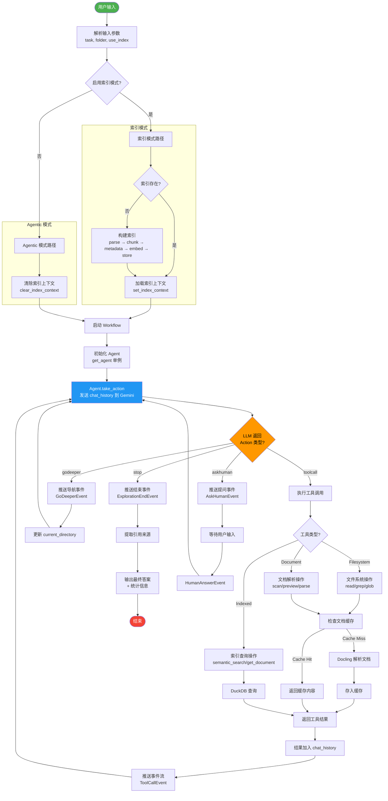

### 1.2 流程详解

系统整体数据流图展示了从用户输入到最终答案的完整路径。该流程体现了 FsExplorer 双模式架构的核心设计：索引模式与 Agentic 模式共享相同的 Agent 决策循环，仅在工具可用性上有所区别。

**输入解析阶段**：系统接收用户提供的自然语言问题（task）、目标文件夹（folder）和模式标志（use_index）。CLI 通过 Typer 解析命令行参数，WebSocket 通过 JSON 反序列化获取参数。

**模式分支**：根据 `use_index` 标志，系统进入不同的初始化路径。索引模式要求目标文件夹已预先构建 DuckDB 索引，否则提示用户先运行 `explore index` 命令。Agentic 模式则无需任何预处理，直接进入探索循环。

**Agent 决策循环**：这是系统的核心引擎。Agent 将累积的对话历史（chat_history）发送给 Gemini LLM，接收结构化的 Action JSON。根据 Action 类型，系统执行不同的处理逻辑：

- **toolcall**：调用 TOOLS 注册表中的对应函数，工具结果追加到 chat_history
- **godeeper**：更新工作流状态中的 current_directory
- **askhuman**：暂停循环，等待用户输入
- **stop**：终止循环，输出最终答案

**工具执行路径**：工具分为三类，每类有不同的执行逻辑。Filesystem 工具直接操作文件系统；Document 工具通过 Docling 解析文档，使用缓存避免重复解析；Indexed 工具查询 DuckDB 索引。

**事件流推送**：每个状态转换都通过事件流推送给订阅者（CLI 或 WebSocket 客户端），实现实时反馈。

---

## 2. Agentic 探索主流程

### 2.1 流程图

```mermaid
flowchart LR
    START([用户查询]) --> INIT[工作流初始化<br/>InputEvent]
    
    INIT --> DESCRIBE[describe_dir_content<br/>获取目录结构]
    
    DESCRIBE --> PROMPT[构建初始提示<br/>目录描述 + 用户任务]
    
    PROMPT --> CONFIGURE[agent.configure_task<br/>追加到 chat_history]
    
    CONFIGURE --> LOOP_START{开始<br/>决策循环}
    
    LOOP_START --> TAKE_ACTION[agent.take_action<br/>调用 Gemini API]
    
    TAKE_ACTION --> PARSE_ACTION[解析 Action JSON<br/>Action.model_validate_json]
    
    PARSE_ACTION --> CHECK_TYPE{Action 类型?}
    
    CHECK_TYPE -->|toolcall| EXEC_TOOL[执行工具<br/>TOOLSname]
    
    EXEC_TOOL --> TRACK_METRICS[追踪指标<br/>token_usage.add_tool_result]
    
    TRACK_METRICS --> APPEND_RESULT[结果追加到 chat_history]
    
    APPEND_RESULT --> LOOP_CONTINUE{继续循环?}
    
    CHECK_TYPE -->|godeeper| UPDATE_STATE[更新 WorkflowState<br/>current_directory]
    
    UPDATE_STATE --> LOOP_CONTINUE
    
    CHECK_TYPE -->|askhuman| EMIT_ASK[发出 AskHumanEvent]
    
    EMIT_ASK --> WAIT[等待用户响应]
    
    WAIT --> RECEIVE[接收 HumanAnswerEvent]
    
    RECEIVE --> LOOP_CONTINUE
    
    CHECK_TYPE -->|stop| FINAL[生成最终答案<br/>StopAction.final_result]
    
    LOOP_CONTINUE -->|是| TAKE_ACTION
    LOOP_CONTINUE -->|超时| TIMEOUT[超时终止<br/>ExplorationEndEvent.error]
    
    FINAL --> EMIT_END[发出 ExplorationEndEvent]
    
    TIMEOUT --> EMIT_END
    
    EMIT_END --> OUTPUT[输出结果]
    
    OUTPUT --> END([结束])
    
    style START fill:#4caf50,color:#fff
    style END fill:#f44336,color:#fff
    style TAKE_ACTION fill:#2196f3,color:#fff
    style CHECK_TYPE fill:#ff9800,color:#000
```

### 2.2 流程详解

Agentic 探索主流程是 FsExplorer 的核心工作流，体现了 ReAct（Reason + Act）模式的完整实现。该流程从用户查询开始，经过多轮 Agent 决策循环，最终生成带引用的答案。

**初始化阶段**：工作流引擎接收 `InputEvent`，解析任务参数并初始化 `WorkflowState`。`describe_dir_content()` 函数列出目标文件夹的所有文件和子目录，为 Agent 提供初始上下文。

**提示构建**：系统将目录描述和用户任务组合成初始提示，通过 `agent.configure_task()` 追加到对话历史。提示中包含索引模式提示（如适用），指导 Agent 优先使用 `semantic_search` 工具。

**决策循环**：循环的核心是 `agent.take_action()` 方法，它执行以下步骤：
1. 发送完整 chat_history 到 Gemini API
2. 接收结构化 JSON 响应（包含 `response_schema: Action`）
3. 解析为 Action Pydantic 模型
4. 如果是 toolcall 类型，自动执行工具并追加结果
5. 返回 (Action, ActionType) 元组

**工具执行与指标追踪**：工具执行后，`token_usage.add_tool_result()` 记录工具结果的字符数，并根据工具类型更新 `documents_parsed` 或 `documents_scanned` 计数器。

**循环终止条件**：
- Agent 返回 `StopAction`：正常终止
- 工作流超时（300 秒）：强制终止，返回错误事件
- 异常终止：捕获并包装为错误事件

**流式输出**：每个事件通过 `ctx.write_event_to_stream()` 推送到事件流，CLI 和 WebSocket 订阅者实时接收并渲染。

---

## 3. 索引构建流程

### 3.1 流程图

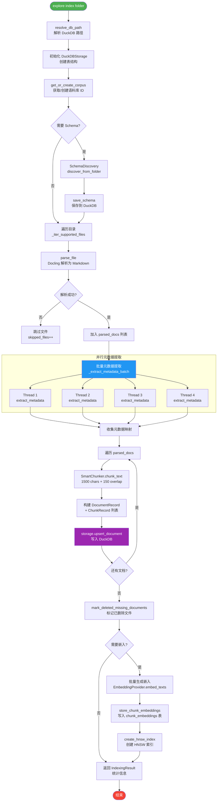

### 3.2 流程详解

索引构建流程将文件系统文档转换为可检索的 DuckDB 索引，支持后续的快速语义搜索和元数据过滤。该流程采用两遍处理策略：第一遍并行解析和提取元数据，第二遍顺序写入数据库。

**初始化阶段**：`resolve_db_path()` 根据优先级（CLI 参数 > 环境变量 > 默认路径）确定 DuckDB 文件位置。`DuckDBStorage.initialize()` 创建五张表：corpora、documents、chunks、schemas、chunk_embeddings。

**Schema 解析**：如果启用 `--discover-schema` 或 `--with-metadata`，系统调用 `SchemaDiscovery.discover_from_folder()` 自动发现语料库的元数据 Schema。Schema 定义了可用的过滤字段及其类型。

**文件发现**：`_iter_supported_files()` 使用 `os.walk()` 遍历目录，筛选出支持的文件扩展名（.pdf, .docx, .pptx, .xlsx, .html, .md）。

**文档解析**：对每个文件调用 `parse_file()`，该函数使用 Docling 将文档转换为 Markdown 格式。解析结果缓存在 `_DOCUMENT_CACHE` 中，避免重复解析。

**并行元数据提取**：使用 `ThreadPoolExecutor(max_workers=4)` 并行提取每个文档的元数据。元数据包括：
- 启发式字段：filename, extension, document_type, mentions_currency, mentions_dates
- langextract 字段（可选）：lx_organizations, lx_people, lx_deal_terms 等

**分块与写入**：`SmartChunker.chunk_text()` 将文档切分为 1500 字符的块（150 字符重叠），优先在段落边界切分。每个块生成 `ChunkRecord`，与 `DocumentRecord` 一起通过 `upsert_document()` 写入 DuckDB。

**删除清理**：`mark_deleted_missing_documents()` 标记在当前索引运行中未找到的文件为已删除（软删除），保持索引与文件系统一致。

**嵌入生成**（可选）：如果启用 `--with-embeddings`，系统批量生成 chunk 的向量嵌入，存储到 `chunk_embeddings` 表，并创建 HNSW 索引加速余弦相似度搜索。

---

## 4. 索引查询流程

### 4.1 流程图

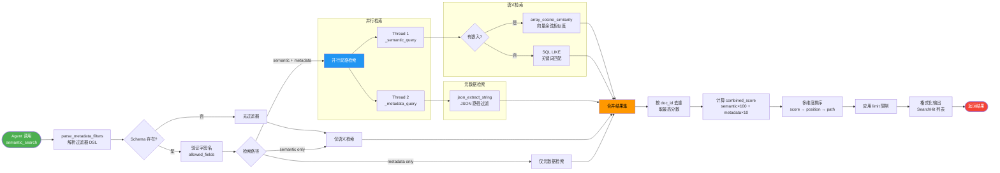

### 4.2 流程详解

索引查询流程实现了混合检索引擎，支持语义检索、关键词检索和元数据过滤的灵活组合。该流程通过并行执行和加权合并，提供高质量的检索结果。

**过滤器解析**：`parse_metadata_filters()` 将人类可读的 DSL 字符串（如 `"mentions_currency=true, lx_has_escrow=true"`）解析为 `MetadataFilter` 对象列表。解析器支持多种操作符和条件连接。

**Schema 验证**：如果语料库有活跃的 Schema，系统验证过滤器字段名是否在 Schema 定义的 `fields` 列表中，防止无效字段查询。

**检索路径选择**：根据 `enable_semantic` 和 `enable_metadata` 标志，系统选择以下路径之一：
- 双路并行：同时执行语义和元数据检索
- 仅语义：跳过元数据检索
- 仅元数据：跳过语义检索

**语义检索**：如果语料库有嵌入向量，使用 `array_cosine_similarity()` 计算查询向量与 chunk 向量的余弦相似度。否则回退到 SQL LIKE 关键词匹配。

**元数据检索**：使用 DuckDB 的 `json_extract_string()` 函数查询 `metadata_json` 列，支持 eq/ne/gt/gte/lt/lte/in/contains 等操作符。

**结果合并**：按 `doc_id` 合并语义和元数据结果，取最高分数。合并后的文档计算 `combined_score = semantic_score × 100 + metadata_score × 10`。

**排序与限制**：按 combined_score 降序排列，应用 limit 限制，返回 `SearchHit` 列表。

---

## 5. WebSocket 实时通信流程

### 5.1 流程图

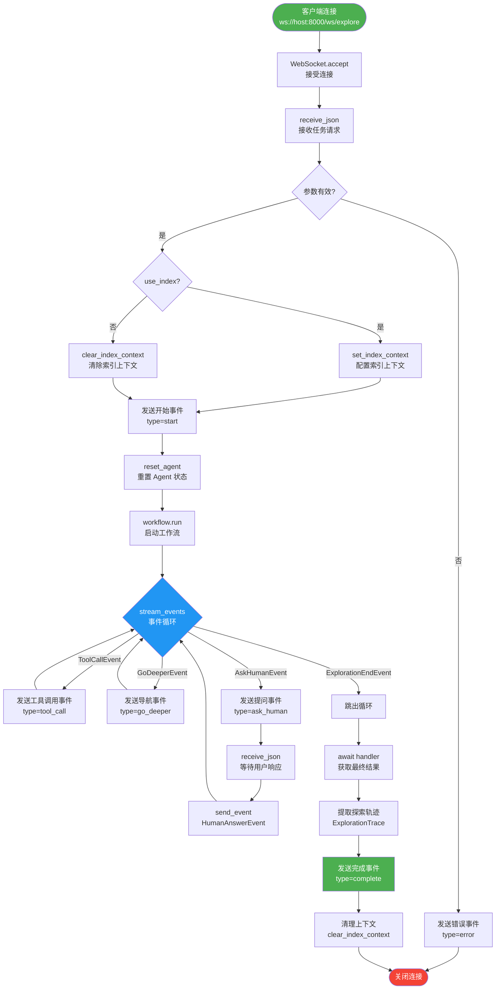

### 5.2 流程详解

WebSocket 实时通信流程实现了客户端与服务器的双向交互，支持流式事件推送和人类介入。该流程是 Web UI 的核心通信机制。

**连接建立**：客户端通过 WebSocket 连接到 `/ws/explore` 端点。服务器调用 `websocket.accept()` 接受连接。

**任务接收**：服务器等待客户端发送 JSON 格式的任务请求，包含 `task`（问题）、`folder`（目标目录）、`use_index`（是否使用索引）等字段。

**参数验证**：服务器验证任务参数的有效性。如果任务为空或文件夹无效，发送错误事件并关闭连接。

**索引上下文配置**：如果启用索引模式，调用 `set_index_context()` 配置 DuckDB 连接和语料库 ID。否则调用 `clear_index_context()` 清除之前的状态。

**工作流启动**：发送 `type=start` 事件通知客户端探索开始。调用 `reset_agent()` 重置 Agent 状态，然后启动 Workflow。

**事件循环**：通过 `async for event in handler.stream_events()` 循环处理流式事件：
- **ToolCallEvent**：发送 `type=tool_call` 事件，包含工具名、参数和推理过程
- **GoDeeperEvent**：发送 `type=go_deeper` 事件，包含目标目录
- **AskHumanEvent**：发送 `type=ask_human` 事件，然后等待客户端发送 `type=human_response`

**人类交互**：当 Agent 需要澄清问题时，服务器暂停事件循环，等待用户输入。用户响应通过 `HumanAnswerEvent` 传回工作流。

**完成处理**：当 `ExplorationEndEvent` 触发时，循环结束。服务器获取最终结果，提取引用来源和探索轨迹，发送 `type=complete` 事件。

**清理**：在 `finally` 块中调用 `clear_index_context()` 清理上下文，确保连接关闭后不残留状态。

---

## 6. 文档解析与缓存流程

### 6.1 流程图

```mermaid
flowchart LR
    START([工具调用<br/>parse_file/preview/scan]) --> CHECK_EXT{扩展名<br/>支持?}
    
    CHECK_EXT -->|否| UNSUPPORTED[返回错误<br/>Unsupported extension]
    
    CHECK_EXT -->|是| GEN_KEY[生成缓存键<br/>abs_path:mtime]
    
    GEN_KEY --> CHECK_CACHE{键存在于<br/>_DOCUMENT_CACHE?}
    
    CHECK_CACHE -->|是| CACHE_HIT[缓存命中<br/>直接返回]
    
    CHECK_CACHE -->|否| CACHE_MISS[缓存未命中<br/>需要解析]
    
    CACHE_MISS --> DOCLING[DocumentConverter<br/>.convert(file_path)]
    
    DOCLING --> EXPORT[result.document<br/>.export_to_markdown]
    
    EXPORT --> STORE[存入缓存<br/>_DOCUMENT_CACHEkey]
    
    STORE --> RETURN[返回内容]
    
    CACHE_HIT --> RETURN
    
    RETURN --> END([结束])
    
    style START fill:#4caf50,color:#fff
    style END fill:#f44336,color:#fff
    style CACHE_HIT fill:#4caf50,color:#fff
    style CACHE_MISS fill:#ff9800,color:#000
    style DOCLING fill:#2196f3,color:#fff
```

### 6.2 流程详解

文档解析与缓存流程是系统性能优化的关键。通过基于文件修改时间的缓存键设计，系统避免了重复解析未更改的文档，显著提升了多轮探索的效率。

**扩展名检查**：首先检查文件扩展名是否在 `SUPPORTED_EXTENSIONS` 中（.pdf, .docx, .doc, .pptx, .xlsx, .html, .md）。不支持的扩展名直接返回错误信息。

**缓存键生成**：缓存键由文件的绝对路径和修改时间（mtime）组成：`f"{abs_path}:{os.path.getmtime(abs_path)}"`。这种设计确保：
- 同一文件的不同版本有不同的键（mtime 变化时）
- 同一版本在不同工具调用中复用缓存

**缓存查找**：在 `_DOCUMENT_CACHE` 字典中查找缓存键。如果命中，直接返回缓存的 Markdown 内容，跳过解析。

**Docling 解析**：缓存未命中时，使用 Docling 的 `DocumentConverter` 解析文档。Docling 执行以下操作：
1. 格式检测（自动识别 PDF/DOCX/PPTX 等）
2. 内容提取（文本、表格、图像）
3. 结构分析（标题层级、列表、段落）
4. Markdown 导出

**缓存存储**：解析结果存入 `_DOCUMENT_CACHE` 字典，供后续调用复用。

**内存管理**：当前实现使用全局字典缓存，适用于中等规模文档集。对于大规模场景，可考虑 LRU 缓存或磁盘缓存。

---

## 7. 元数据提取流程

### 7.1 流程图

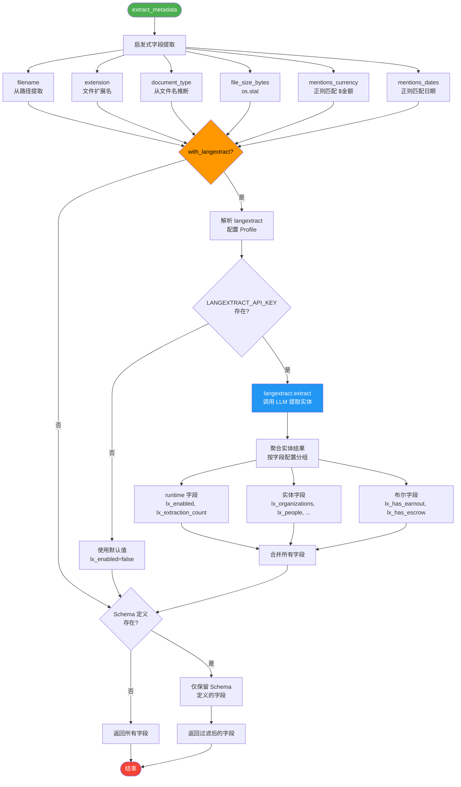

### 7.2 流程详解

元数据提取流程实现了双层提取策略：轻量级启发式字段始终可用，重量级 langextract 实体提取按需启用。这种设计平衡了功能丰富性和性能成本。

**启发式字段提取**：使用正则表达式和文件系统 API 提取基础元数据：
- `filename`：从文件路径提取
- `extension`：文件扩展名（小写）
- `document_type`：从文件名词元推断（去除停用词后的最后一个有意义的词）
- `file_size_bytes`：`os.stat().st_size`
- `mentions_currency`：正则 `\$\s?\d[\d,]*(?:\.\d+)?` 匹配
- `mentions_dates`：正则匹配 ISO 日期和英文日期格式

**langextract 配置解析**：如果启用 langextract，系统解析 Profile 配置。Profile 定义了：
- `prompt_description`：LLM 提取指令
- `fields`：字段定义列表，每个字段包含 name, type, source, source_classes, mode

**API Key 检查**：langextract 需要 API Key（`LANGEXTRACT_API_KEY` 或 `GOOGLE_API_KEY`）。如果不可用，返回默认值（lx_enabled=false）。

**langextract 调用**：调用 `langextract.extract()` 执行实体提取：
- 输入：文档内容前 N 个字符（默认 6000）
- 输出：实体列表（extraction_class, extraction_text）
- 模型：默认 `gemini-3-flash-preview`

**实体聚合**：根据 Profile 配置聚合实体：
- `runtime` 字段：lx_enabled（是否成功）、lx_extraction_count（实体数量）、lx_entity_classes（实体类别）
- `entities` 字段：按 source_classes 分组，mode 决定输出格式（values/count/exists/contains）

**Schema 过滤**：如果存在 Schema 定义，仅保留 Schema 中列出的字段，确保元数据与 Schema 一致。

---

## 8. 三阶段探索策略流程

### 8.1 流程图

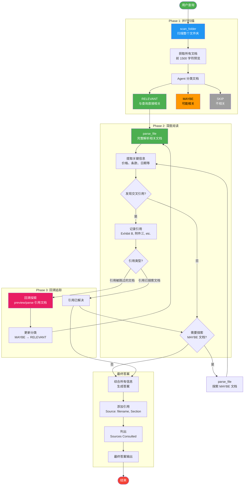

### 8.2 流程详解

三阶段探索策略是 FsExplorer 的核心创新，模拟了人类专家分析文档的过程：先快速浏览、再深度阅读、最后追踪引用。该策略在 SYSTEM_PROMPT 中详细定义，指导 Agent 的行为。

**Phase 1: 并行扫描**：Agent 调用 `scan_folder()` 获取文件夹内所有文档的预览（前 1500 字符）。基于预览内容，Agent 将文档分类为：
- **RELEVANT**：与查询直接相关（如查询收购价格时的主协议）
- **MAYBE**：可能相关（如被其他文档引用的附件）
- **SKIP**：不相关（如员工手册、HR 政策）

分类结果在 `reason` 字段中明确列出，供用户审查。

**Phase 2: 深度阅读**：Agent 对 RELEVANT 文档调用 `parse_file()` 获取完整内容。在阅读过程中，Agent 执行以下任务：
1. 提取关键信息（价格、条款、日期、当事方等）
2. 检测交叉引用模式：
   - "See Exhibit A/B/C..."
   - "As stated in the [Document Name]..."
   - "Refer to [filename]..."
   - 文档编号、附件标签、文件名

**Phase 3: 回溯追踪**：如果发现交叉引用指向被 SKIP 的文档，Agent 执行回溯：
1. 在 `reason` 中解释回溯原因
2. 调用 `preview_file()` 或 `parse_file()` 探索引用文档
3. 更新分类（MAYBE → RELEVANT）
4. 继续分析直到所有引用解决

**最终答案生成**：综合所有收集的信息，生成结构化答案：
1. 直接回答用户问题
2. 带引用的详细论据
3. 来源清单（Sources Consulted）

---

## 9. 时序图：Agent 决策循环

### 9.1 时序图

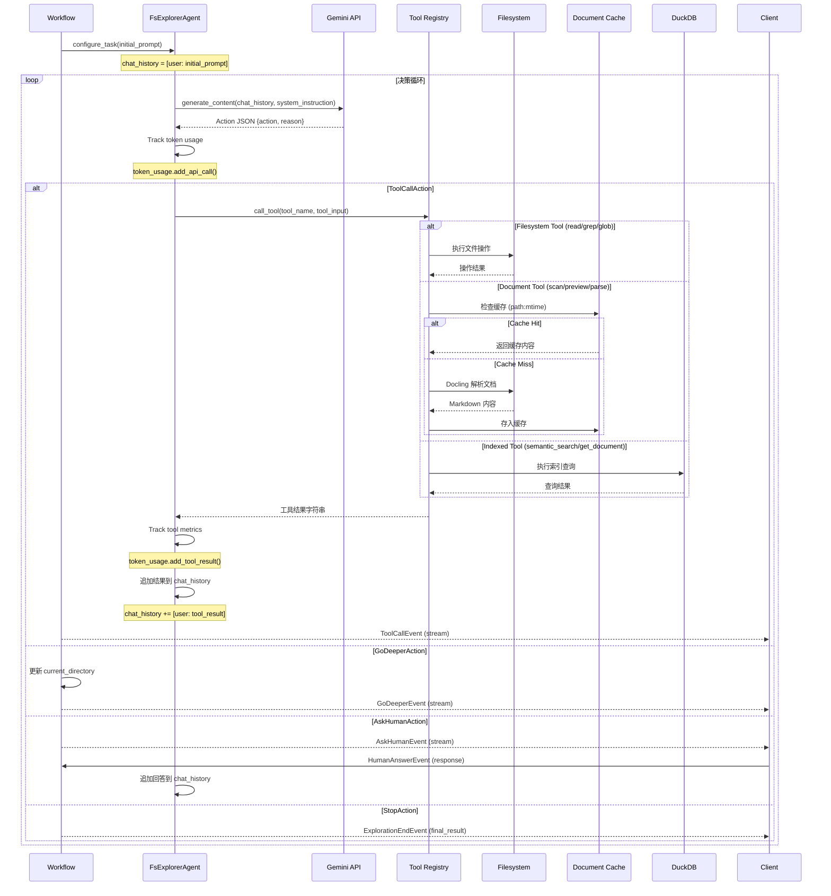

### 9.2 时序详解

Agent 决策循环时序图展示了 Workflow、Agent、LLM 和工具之间的交互。该循环是 FsExplorer 智能探索的核心引擎。

**初始化**：Workflow 调用 `configure_task()` 将初始提示（包含目录描述和用户任务）追加到 Agent 的 chat_history。

**LLM 调用**：Agent 将完整 chat_history 发送给 Gemini API，请求结构化 JSON 响应。API 配置包括：
- `system_instruction`：包含三阶段策略的 SYSTEM_PROMPT
- `response_mime_type`：`application/json`
- `response_schema`：Action Pydantic 模型

**Token 追踪**：从 `response.usage_metadata` 提取 token 使用量，累加到 TokenUsage。

**工具执行分支**：
- **Filesystem 工具**：直接操作文件系统，无需缓存
- **Document 工具**：先检查缓存，未命中则调用 Docling 解析
- **Indexed 工具**：查询 DuckDB 索引

**结果累积**：工具结果作为 `user` 角色消息追加到 chat_history，供下一轮 LLM 推理使用。

**事件推送**：每个状态转换通过事件流推送给客户端，实现实时反馈。

---

## 10. 时序图：并行文档扫描

### 10.1 时序图

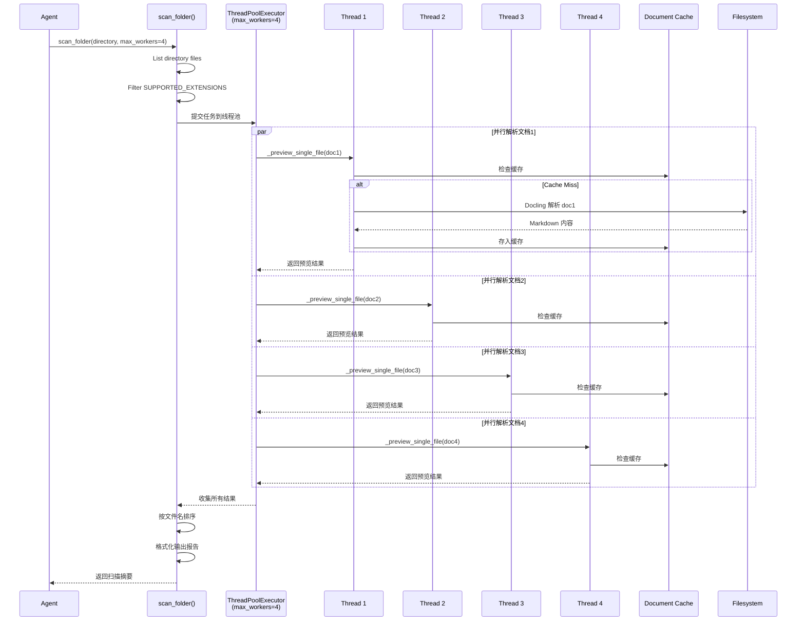

### 10.2 时序详解

并行文档扫描时序图展示了 `scan_folder()` 如何使用 ThreadPoolExecutor 并行处理多个文档。该设计显著提升了多文档场景的扫描效率。

**文件发现**：`scan_folder()` 列出目录中的所有文件，筛选出支持的文件扩展名。

**线程池创建**：创建 `ThreadPoolExecutor(max_workers=4)` 线程池，提交每个文档的预览任务。

**并行执行**：四个工作线程并行执行 `_preview_single_file()`，每个线程：
1. 检查文档缓存（基于 path:mtime 键）
2. 缓存未命中时调用 Docling 解析
3. 返回预览结果（前 1500 字符）

**结果收集**：`as_completed()` 收集所有线程结果，按文件名排序。

**报告格式化**：生成格式化的扫描报告，包含每个文档的预览和状态信息。

---

## 11. 时序图：混合检索

### 11.1 时序图

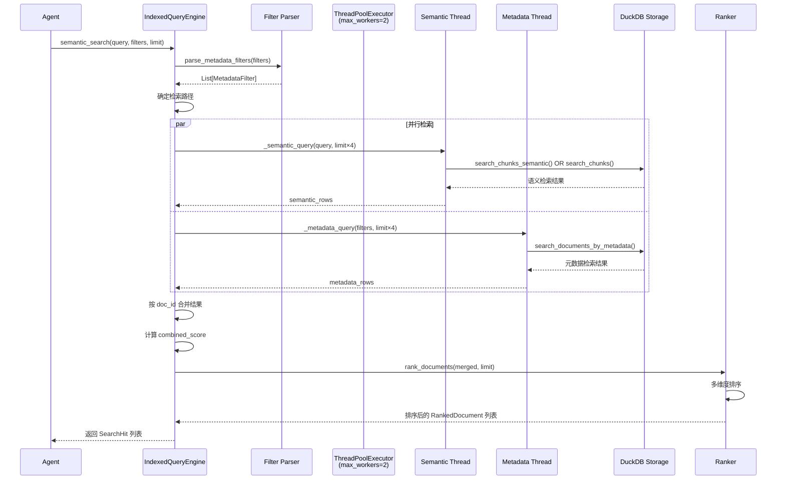

### 11.2 时序详解

混合检索时序图展示了 `IndexedQueryEngine` 如何并行执行语义和元数据检索，并合并排序结果。

**过滤器解析**：`parse_metadata_filters()` 将 DSL 字符串解析为 `MetadataFilter` 对象列表，验证字段名是否在 Schema 允许范围内。

**并行检索**：使用 `ThreadPoolExecutor(max_workers=2)` 并行执行两路检索：
- **语义检索**：使用向量余弦相似度或关键词匹配
- **元数据检索**：使用 JSON 路径查询过滤文档

**结果合并**：按 `doc_id` 合并两路结果，取最高分数。计算 `combined_score = semantic_score × 100 + metadata_score × 10`。

**排序输出**：`rank_documents()` 按 combined_score 降序排列，应用 limit 限制，返回最终结果。

---

## 12. Workflow 状态机图

### 12.1 状态机图

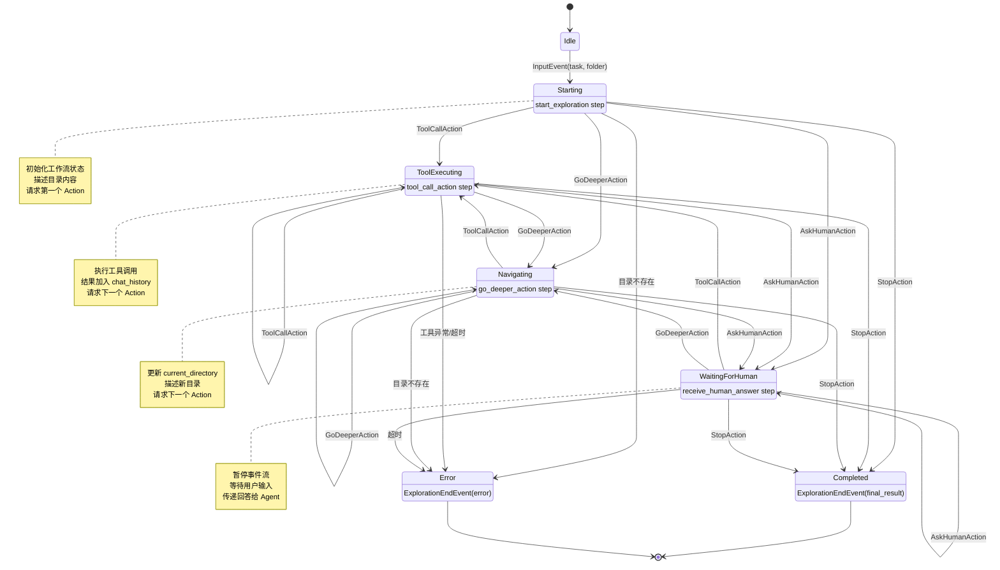

### 12.2 状态机详解

Workflow 状态机图展示了 FsExplorer 探索流程的所有状态和状态转换。该状态机由 llama-index-workflows 引擎驱动，实现了事件驱动的探索循环。

**状态定义**：
- **Idle**：初始状态，等待 InputEvent
- **Starting**：处理 InputEvent，初始化状态，请求第一个 Action
- **ToolExecuting**：执行工具调用，循环请求下一个 Action
- **Navigating**：更新目录状态，请求下一个 Action
- **WaitingForHuman**：暂停等待用户输入
- **Completed**：正常终止，输出最终结果
- **Error**：异常终止，输出错误信息

**状态转换**：
- 每个状态都可以转换到 ToolExecuting、Navigating、WaitingForHuman 或 Completed
- 异常情况转换到 Error 状态
- 超时（300 秒）强制转换到 Error

**事件驱动**：状态转换由事件触发，事件通过 `ctx.write_event_to_stream()` 推送到订阅者。

---

## 附录：图表索引

| 编号 | 图表名称 | 类型 | 说明 |
|------|----------|------|------|
| 1 | 系统整体数据流图 | flowchart | 从输入到输出的完整路径 |
| 2 | Agentic 探索主流程 | flowchart | Agent 决策循环的详细流程 |
| 3 | 索引构建流程 | flowchart | 文档到索引的转换过程 |
| 4 | 索引查询流程 | flowchart | 混合检索引擎的工作流程 |
| 5 | WebSocket 实时通信流程 | flowchart | WebSocket 交互协议 |
| 6 | 文档解析与缓存流程 | flowchart | 缓存机制与 Docling 解析 |
| 7 | 元数据提取流程 | flowchart | 双层元数据提取策略 |
| 8 | 三阶段探索策略流程 | flowchart | Phase 1/2/3 与回溯 |
| 9 | Agent 决策循环 | sequenceDiagram | Agent ↔ LLM ↔ Tools 交互 |
| 10 | 并行文档扫描 | sequenceDiagram | ThreadPoolExecutor 并行处理 |
| 11 | 混合检索 | sequenceDiagram | 语义+元数据并行检索 |
| 12 | Workflow 状态机 | stateDiagram-v2 | 所有状态和转换 |

---

☕️ 制作不易，请我喝咖啡☕️关注我➕

