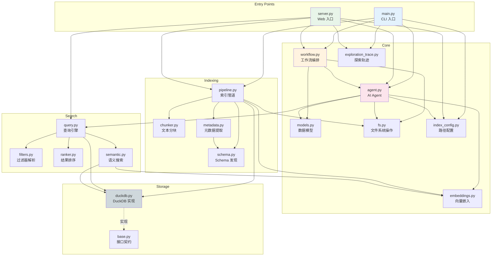
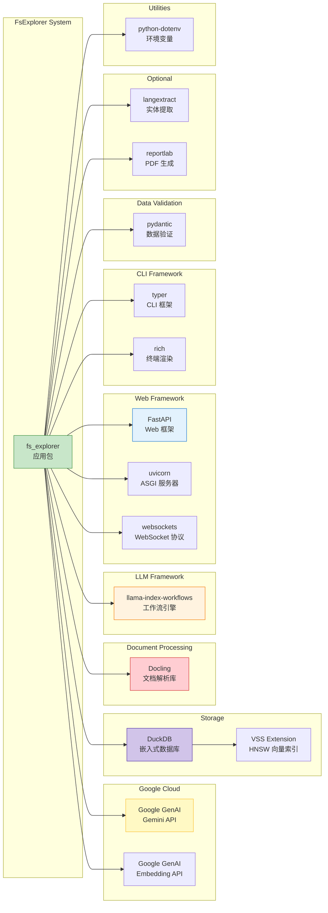

# FsExplorer 模块结构与依赖分析

> **版本**: v0.1.0  
> **最后更新**: 2026-07-26  
> **分析范围**: 完整项目结构、模块职责、依赖关系、接口契约

---

## 目录

1. [完整项目目录树](#1-完整项目目录树)
2. [模块功能职责表](#2-模块功能职责表)
3. [模块间依赖关系图](#3-模块间依赖关系图)
4. [外部依赖关系图](#4-外部依赖关系图)
5. [数据流与调用链分析](#5-数据流与调用链分析)
6. [接口契约总结](#6-接口契约总结)

---

## 1. 完整项目目录树

```
agentic-file-search/
├── .env.example                    # 环境变量示例
├── .github/
│   └── workflows/
│       ├── build.yaml              # CI 构建工作流
│       ├── lint.yaml               # CI 代码检查工作流
│       ├── test.yaml               # CI 测试工作流
│       └── typecheck.yaml          # CI 类型检查工作流
├── .gitignore                      # Git 忽略规则
├── .pre-commit-config.yaml         # Pre-commit 钩子配置
├── .python-version                 # Python 版本锁定 (3.10)
├── ARCHITECTURE.md                 # 项目架构文档（英文）
├── CLAUDE.md                       # Claude Code 项目指令
├── IMPLEMENTATION_PLAN.md          # 实施计划文档
├── Makefile                        # 开发命令快捷方式
├── README.md                       # 项目说明文档
├── YOUTUBE_DEMO_TESTS.md           # YouTube 演示测试文档
├── pyproject.toml                  # 项目配置与依赖声明
├── uv.lock                         # uv 锁定文件
├── data/
│   ├── large_acquisition/          # 大型测试文档集（25 个文档）
│   │   └── TEST_QUESTIONS.md       # 测试问题集
│   ├── test_acquisition/           # 标准测试文档集（10 个文档）
│   │   └── TEST_QUESTIONS.md       # 测试问题集
│   └── testfile.txt                # 简单测试文件
├── docker/
│   └── docker-compose.yml          # Docker 部署配置
├── docs/
│   └── wangbin/                    # 本文档目录
│       ├── 00-项目概述.md          # 项目概述文档
│       ├── 01-C4架构模型.md        # C4 架构模型文档
│       ├── 02-系统流程与时序图.md  # 系统流程与时序图文档
│       └── 03-模块结构与依赖分析.md # 本文档
├── scripts/
│   ├── generate_large_docs.py      # 大型测试文档生成脚本
│   └── generate_test_docs.py       # 标准测试文档生成脚本
├── src/
│   └── fs_explorer/                # 主包
│       ├── __init__.py             # 包初始化与公共 API 导出
│       ├── agent.py                # AI Agent + Gemini 集成 + 工具注册表
│       ├── embeddings.py           # 向量嵌入提供者
│       ├── exploration_trace.py    # 探索轨迹记录与引用提取
│       ├── fs.py                   # 文件系统操作 + Docling 解析
│       ├── index_config.py         # 索引路径配置解析
│       ├── main.py                 # CLI 入口点 (typer)
│       ├── models.py               # Pydantic 数据模型
│       ├── server.py               # FastAPI Web 服务器
│       ├── ui.html                 # 单文件 Web UI
│       ├── indexing/               # 索引子系统
│       │   ├── __init__.py         # 包初始化
│       │   ├── chunker.py          # 智能文本分块器
│       │   ├── metadata.py         # 元数据提取（启发式 + langextract）
│       │   ├── pipeline.py         # 索引构建管道编排
│       │   └── schema.py           # Schema 自动发现
│       ├── search/                 # 搜索子系统
│       │   ├── __init__.py         # 包初始化
│       │   ├── filters.py          # 元数据过滤器 DSL 解析器
│       │   ├── query.py            # 索引查询引擎
│       │   ├── ranker.py           # 结果排序器
│       │   └── semantic.py         # 向量语义搜索引擎
│       └── storage/                # 存储子系统
│           ├── __init__.py         # 包初始化
│           ├── base.py             # 存储接口契约 + 数据模型
│           └── duckdb.py           # DuckDB 存储实现
└── tests/                          # 测试套件
    ├── __init__.py                 # 包初始化
    ├── conftest.py                 # 测试配置与 Mock 固件
    ├── test_agent.py               # Agent 单元测试
    ├── test_cli_indexing.py        # CLI 索引命令测试
    ├── test_e2e.py                 # 端到端集成测试
    ├── test_embeddings.py          # 嵌入提供者测试
    ├── test_exploration_trace.py   # 探索轨迹测试
    ├── test_fs.py                  # 文件系统工具测试
    ├── test_indexing.py            # 索引管道测试
    ├── test_models.py              # 数据模型测试
    ├── test_search.py              # 搜索/过滤/排序测试
    ├── test_server_search.py       # 服务器搜索 API 测试
    └── testfiles/                  # 测试数据文件
        ├── file1.txt               # 测试文本文件 1
        ├── file2.md                # 测试 Markdown 文件
        └── last/
            └── lastfile.txt        # 嵌套测试文件
```

---

## 2. 模块功能职责表

### 2.1 核心模块

| 路径 | 职责 | 关键文件 | 输入 | 输出 |
|------|------|----------|------|------|
| `src/fs_explorer/__init__.py` | 包初始化，导出公共 API | `__init__.py` | - | 公共符号 |
| `src/fs_explorer/agent.py` | AI Agent 核心，Gemini 交互，工具注册表 | `agent.py` | 用户任务 | Action 决策 |
| `src/fs_explorer/workflow.py` | 事件驱动工作流编排 | `workflow.py` | InputEvent | ExplorationEndEvent |
| `src/fs_explorer/models.py` | Pydantic 数据模型定义 | `models.py` | JSON | Action 对象 |
| `src/fs_explorer/fs.py` | 文件系统操作，文档解析 | `fs.py` | 文件路径 | 文件内容/Markdown |
| `src/fs_explorer/main.py` | CLI 入口点 | `main.py` | 命令行参数 | 终端输出 |
| `src/fs_explorer/server.py` | Web 服务器 | `server.py` | HTTP/WebSocket | JSON/HTML |
| `src/fs_explorer/embeddings.py` | 向量嵌入服务 | `embeddings.py` | 文本 | 嵌入向量 |
| `src/fs_explorer/exploration_trace.py` | 探索轨迹记录 | `exploration_trace.py` | 工具调用 | 轨迹/引用 |
| `src/fs_explorer/index_config.py` | 索引路径配置 | `index_config.py` | CLI/环境变量 | DuckDB 路径 |

### 2.2 索引子系统

| 路径 | 职责 | 关键文件 | 输入 | 输出 |
|------|------|----------|------|------|
| `src/fs_explorer/indexing/pipeline.py` | 索引构建管道编排 | `pipeline.py` | 文件夹路径 | IndexingResult |
| `src/fs_explorer/indexing/chunker.py` | 智能文本分块 | `chunker.py` | 文档文本 | TextChunk 列表 |
| `src/fs_explorer/indexing/metadata.py` | 元数据提取 | `metadata.py` | 文件路径+内容 | 元数据字典 |
| `src/fs_explorer/indexing/schema.py` | Schema 自动发现 | `schema.py` | 文件夹路径 | Schema 定义 |

### 2.3 搜索子系统

| 路径 | 职责 | 关键文件 | 输入 | 输出 |
|------|------|----------|------|------|
| `src/fs_explorer/search/query.py` | 混合检索引擎 | `query.py` | 查询+过滤器 | SearchHit 列表 |
| `src/fs_explorer/search/filters.py` | 过滤器 DSL 解析 | `filters.py` | DSL 字符串 | MetadataFilter 列表 |
| `src/fs_explorer/search/ranker.py` | 结果排序 | `ranker.py` | RankedDocument 列表 | 排序后列表 |
| `src/fs_explorer/search/semantic.py` | 向量语义搜索 | `semantic.py` | 查询文本 | 语义搜索结果 |

### 2.4 存储子系统

| 路径 | 职责 | 关键文件 | 输入 | 输出 |
|------|------|----------|------|------|
| `src/fs_explorer/storage/base.py` | 存储接口契约 | `base.py` | - | Protocol/数据类 |
| `src/fs_explorer/storage/duckdb.py` | DuckDB 存储实现 | `duckdb.py` | SQL 操作 | 查询结果 |

---

## 3. 模块间依赖关系图

### 3.1 依赖关系图



### 3.2 依赖关系详解

模块间依赖关系图揭示了 FsExplorer 系统的内部结构。依赖方向遵循分层架构原则：上层模块依赖下层模块，同层模块通过接口交互。

**入口层**：`main.py` 和 `server.py` 是系统的两个入口点，它们依赖核心层、索引子系统和存储子系统，但不直接依赖搜索子系统（通过 Agent 间接使用）。

**核心层**：
- `workflow.py` 是编排中心，依赖 Agent、Models 和 FS
- `agent.py` 是智能核心，依赖 Models、FS、Embeddings、Query 和 Config
- `models.py` 是纯数据定义，无内部依赖
- `fs.py` 是文件系统抽象，仅依赖 Docling（外部）

**索引子系统**：
- `pipeline.py` 是编排器，依赖 chunker、metadata、schema、fs、embeddings、duckdb
- `chunker.py` 是纯算法，无内部依赖
- `metadata.py` 依赖 schema（用于 langextract 字段）
- `schema.py` 依赖 metadata（用于 langextract 字段定义）

**搜索子系统**：
- `query.py` 是检索引擎，依赖 filters、ranker、semantic、duckdb
- `filters.py` 是纯解析器，无内部依赖
- `ranker.py` 是纯排序算法，无内部依赖
- `semantic.py` 依赖 duckdb 和 embeddings

**存储子系统**：
- `base.py` 定义 Protocol 和数据类，无内部依赖
- `duckdb.py` 实现 base.py 的 Protocol

---

## 4. 外部依赖关系图

### 4.1 外部依赖图



### 4.2 外部依赖详解

FsExplorer 依赖多个外部库和服务，按功能分类如下：

**Google Cloud 服务**：
- `google-genai`：Gemini API 客户端，用于 LLM 推理和嵌入计算
- 认证方式：`GOOGLE_API_KEY` 环境变量
- API 版本：`v1beta`

**存储引擎**：
- `duckdb`：嵌入式分析数据库，支持 SQL 查询和向量操作
- `vss` 扩展：可选的 HNSW 向量索引加速

**文档处理**：
- `docling`：IBM 开源文档解析库，支持 PDF/DOCX/PPTX/XLSX/HTML/MD

**LLM 框架**：
- `llama-index-workflows`：事件驱动工作流引擎，支持步骤编排和流式输出

**Web 框架**：
- `fastapi`：现代 Web 框架，支持 WebSocket 和自动 API 文档
- `uvicorn`：ASGI 服务器
- `websockets`：WebSocket 协议实现

**CLI 框架**：
- `typer`：基于类型提示的 CLI 框架
- `rich`：终端富文本渲染库

**数据验证**：
- `pydantic`：数据验证和序列化库

**可选依赖**：
- `langextract`：实体提取库（需要额外 API Key）
- `reportlab`：PDF 生成库（仅脚本使用）

**工具库**：
- `python-dotenv`：环境变量管理

---

## 5. 数据流与调用链分析

### 5.1 Agentic 探索调用链

```
用户输入
    │
    ▼
main.py: run_workflow()
    │
    ├── workflow.py: workflow.run(InputEvent)
    │       │
    │       ├── step: start_exploration()
    │       │       │
    │       │       ├── fs.py: describe_dir_content()
    │       │       ├── agent.py: configure_task()
    │       │       └── agent.py: take_action()
    │       │               │
    │       │               ├── Gemini API: generate_content()
    │       │               └── agent.py: call_tool() [if toolcall]
    │       │                       │
    │       │                       ├── fs.py: scan_folder()
    │       │                       │       └── ThreadPoolExecutor
    │       │                       │               └── fs.py: _preview_single_file()
    │       │                       │                       └── fs.py: _get_cached_or_parse()
    │       │                       │                               └── docling: DocumentConverter
    │       │                       │
    │       │                       ├── fs.py: parse_file()
    │       │                       │       └── fs.py: _get_cached_or_parse()
    │       │                       │
    │       │                       ├── fs.py: preview_file()
    │       │                       │       └── fs.py: _get_cached_or_parse()
    │       │                       │
    │       │                       ├── fs.py: read_file()
    │       │                       ├── fs.py: grep_file_content()
    │       │                       └── fs.py: glob_paths()
    │       │
    │       ├── step: tool_call_action() [loop]
    │       │       └── agent.py: take_action() → call_tool()
    │       │
    │       ├── step: go_deeper_action() [if godeeper]
    │       │       └── agent.py: take_action()
    │       │
    │       └── step: receive_human_answer() [if askhuman]
    │               └── agent.py: take_action()
    │
    └── ExplorationEndEvent(final_result)
```

### 5.2 索引构建调用链

```
explore index <folder>
    │
    ▼
main.py: index_command()
    │
    ├── index_config.py: resolve_db_path()
    ├── storage/duckdb.py: DuckDBStorage.__init__()
    │       └── storage/duckdb.py: initialize() [创建表]
    │
    ├── indexing/pipeline.py: IndexingPipeline.__init__()
    │
    └── indexing/pipeline.py: index_folder()
            │
            ├── Pass 1: 解析文档
            │       ├── pipeline.py: _iter_supported_files()
            │       └── fs.py: parse_file() [per file]
            │
            ├── 并行元数据提取
            │       └── pipeline.py: _extract_metadata_batch()
            │               └── ThreadPoolExecutor
            │                       └── indexing/metadata.py: extract_metadata()
            │                               ├── 启发式字段
            │                               └── langextract.extract() [可选]
            │
            ├── Pass 2: 分块与写入
            │       ├── indexing/chunker.py: chunk_text()
            │       └── storage/duckdb.py: upsert_document()
            │
            ├── 删除清理
            │       └── storage/duckdb.py: mark_deleted_missing_documents()
            │
            └── 嵌入生成 [可选]
                    ├── embeddings.py: embed_texts()
                    └── storage/duckdb.py: store_chunk_embeddings()
                            └── storage/duckdb.py: create_hnsw_index()
```

### 5.3 索引查询调用链

```
agent.py: semantic_search()
    │
    ├── agent.py: _get_index_storage_and_corpus()
    │       └── storage/duckdb.py: get_corpus_id()
    │
    └── search/query.py: IndexedQueryEngine.search()
            │
            ├── search/filters.py: parse_metadata_filters()
            │
            ├── 并行检索
            │       ├── _semantic_query()
            │       │       ├── embeddings.py: embed_query() [if embeddings]
            │       │       └── storage/duckdb.py: search_chunks_semantic()
            │       │       └── storage/duckdb.py: search_chunks() [fallback]
            │       │
            │       └── _metadata_query()
            │               └── storage/duckdb.py: search_documents_by_metadata()
            │
            ├── 合并与排序
            │       ├── _merge_and_rank()
            │       └── search/ranker.py: rank_documents()
            │
            └── 返回 SearchHit 列表
```

### 5.4 WebSocket 探索调用链

```
客户端 WebSocket 连接
    │
    ▼
server.py: websocket_explore()
    │
    ├── 接收任务 JSON
    ├── agent.py: set_index_context() [if use_index]
    ├── agent.py: set_search_flags()
    ├── workflow.py: workflow.run(InputEvent)
    │
    ├── 事件循环
    │       ├── ToolCallEvent → websocket.send_json(type=tool_call)
    │       ├── GoDeeperEvent → websocket.send_json(type=go_deeper)
    │       ├── AskHumanEvent → websocket.send_json(type=ask_human)
    │       │       └── websocket.receive_json() [等待响应]
    │       └── ExplorationEndEvent → 跳出循环
    │
    ├── 完成处理
    │       ├── exploration_trace.py: extract_cited_sources()
    │       └── websocket.send_json(type=complete)
    │
    └── 清理
            └── agent.py: clear_index_context()
```

---

## 6. 接口契约总结

### 6.1 StorageBackend Protocol

```python
class StorageBackend(Protocol):
    """存储层接口契约 - 所有存储实现必须遵循此协议"""
    
    # 初始化
    def initialize(self) -> None: ...
    
    # 语料库管理
    def get_or_create_corpus(self, root_path: str) -> str: ...
    def get_corpus_id(self, root_path: str) -> str | None: ...
    
    # 文档 CRUD
    def upsert_document(self, document: DocumentRecord, chunks: list[ChunkRecord]) -> None: ...
    def mark_deleted_missing_documents(self, *, corpus_id: str, active_relative_paths: set[str]) -> int: ...
    def list_documents(self, *, corpus_id: str, include_deleted: bool = False) -> list[dict[str, Any]]: ...
    def count_chunks(self, *, corpus_id: str) -> int: ...
    def get_document(self, *, doc_id: str) -> dict[str, Any] | None: ...
    
    # 检索
    def search_chunks(self, *, corpus_id: str, query: str, limit: int = 5) -> list[dict[str, Any]]: ...
    def search_documents_by_metadata(self, *, corpus_id: str, filters: list[dict[str, Any]], limit: int = 20) -> list[dict[str, Any]]: ...
    def search_chunks_semantic(self, *, corpus_id: str, query_embedding: list[float], limit: int = 5) -> list[dict[str, Any]]: ...
    
    # Schema 管理
    def save_schema(self, *, corpus_id: str, name: str, schema_def: dict[str, Any], is_active: bool = True) -> str: ...
    def list_schemas(self, *, corpus_id: str) -> list[SchemaRecord]: ...
    def get_schema_by_name(self, *, corpus_id: str, name: str) -> SchemaRecord | None: ...
    def get_active_schema(self, *, corpus_id: str) -> SchemaRecord | None: ...
    
    # 嵌入管理
    def store_chunk_embeddings(self, *, corpus_id: str, chunk_embeddings: list[tuple[str, list[float]]]) -> int: ...
    def get_metadata_field_values(self, *, corpus_id: str, field_names: list[str], max_distinct: int = 10) -> dict[str, list[str]]: ...
    def has_embeddings(self, *, corpus_id: str) -> bool: ...
```

### 6.2 TOOLS 注册表

```python
TOOLS: dict[Tools, Callable[..., str]] = {
    # Filesystem 工具
    "read": read_file,                    # (file_path: str) -> str
    "grep": grep_file_content,            # (file_path: str, pattern: str) -> str
    "glob": glob_paths,                   # (directory: str, pattern: str) -> str
    
    # Document 工具
    "scan_folder": scan_folder,           # (directory: str, max_workers: int, preview_chars: int) -> str
    "preview_file": preview_file,         # (file_path: str, max_chars: int) -> str
    "parse_file": parse_file,             # (file_path: str) -> str
    
    # Indexed 工具
    "semantic_search": semantic_search,   # (query: str, filters: str | None, limit: int) -> str
    "get_document": get_document,         # (doc_id: str) -> str
    "list_indexed_documents": list_indexed_documents,  # () -> str
}
```

### 6.3 Event 类型体系

```python
# 开始事件
class InputEvent(StartEvent):
    task: str
    folder: str = "."
    use_index: bool = False
    enable_semantic: bool = False
    enable_metadata: bool = False

# 中间事件
class GoDeeperEvent(Event):
    directory: str
    reason: str

class ToolCallEvent(Event):
    tool_name: str
    tool_input: dict[str, Any]
    reason: str

class AskHumanEvent(InputRequiredEvent):
    question: str
    reason: str

class HumanAnswerEvent(HumanResponseEvent):
    response: str

# 结束事件
class ExplorationEndEvent(StopEvent):
    final_result: str | None = None
    error: str | None = None

# 类型别名
WorkflowEvent = ExplorationEndEvent | GoDeeperEvent | ToolCallEvent | AskHumanEvent
```

### 6.4 Action 类型体系

```python
# 工具调用
class ToolCallAction(BaseModel):
    tool_name: Tools
    tool_input: list[ToolCallArg]
    def to_fn_args(self) -> dict[str, Any]: ...

class ToolCallArg(BaseModel):
    parameter_name: str
    parameter_value: Any

# 导航
class GoDeeperAction(BaseModel):
    directory: str

# 终止
class StopAction(BaseModel):
    final_result: str

# 人类交互
class AskHumanAction(BaseModel):
    question: str

# 容器
class Action(BaseModel):
    action: ToolCallAction | GoDeeperAction | StopAction | AskHumanAction
    reason: str
    def to_action_type() -> ActionType: ...

# 类型别名
ActionType = Literal["stop", "godeeper", "toolcall", "askhuman"]
Tools = Literal["read", "grep", "glob", "scan_folder", "preview_file",
                 "parse_file", "semantic_search", "get_document",
                 "list_indexed_documents"]
```

### 6.5 数据模型

```python
# 文档记录
@dataclass(frozen=True)
class DocumentRecord:
    id: str
    corpus_id: str
    relative_path: str
    absolute_path: str
    content: str
    metadata_json: str
    file_mtime: float
    file_size: int
    content_sha256: str

# 文本块记录
@dataclass(frozen=True)
class ChunkRecord:
    id: str
    doc_id: str
    text: str
    position: int
    start_char: int
    end_char: int
    embedding: list[float] | None = None

# Schema 记录
@dataclass(frozen=True)
class SchemaRecord:
    id: str
    corpus_id: str
    name: str
    schema_def: dict[str, Any]
    is_active: bool
    created_at: str

# 搜索结果
@dataclass(frozen=True)
class SearchHit:
    doc_id: str
    relative_path: str
    absolute_path: str
    position: int | None
    text: str
    semantic_score: float
    metadata_score: int
    score: float
    matched_by: str

# 排序文档
@dataclass(frozen=True)
class RankedDocument:
    doc_id: str
    relative_path: str
    absolute_path: str
    position: int | None
    text: str
    semantic_score: float
    metadata_score: int
    
    @property
    def combined_score(self) -> float:
        return float(self.semantic_score * 100 + self.metadata_score * 10)
    
    @property
    def matched_by(self) -> str: ...

# 元数据过滤器
@dataclass(frozen=True)
class MetadataFilter:
    field: str
    operator: FilterOperator  # "eq", "ne", "gt", "gte", "lt", "lte", "in", "contains"
    value: str | bool | int | float | list[str | bool | int | float]
```

### 6.6 环境变量接口

| 变量名 | 必需 | 默认值 | 说明 |
|--------|------|--------|------|
| `GOOGLE_API_KEY` | 是 | - | Google Gemini API 密钥 |
| `FS_EXPLORER_DB_PATH` | 否 | `~/.fs_explorer/index.duckdb` | DuckDB 索引文件路径 |
| `FS_EXPLORER_LANGEXTRACT_MAX_CHARS` | 否 | 6000 | langextract 最大字符数 |
| `FS_EXPLORER_LANGEXTRACT_MODEL` | 否 | `gemini-3-flash-preview` | langextract 模型 |
| `FS_EXPLORER_EMBEDDING_MODEL` | 否 | `gemini-embedding-001` | 嵌入模型 |
| `FS_EXPLORER_EMBEDDING_DIM` | 否 | 768 | 嵌入维度 |
| `FS_EXPLORER_EMBEDDING_BATCH_SIZE` | 否 | 50 | 嵌入批量大小 |
| `FS_EXPLORER_AUTO_INDEX` | 否 | - | 设置为 `1` 自动启用索引模式 |
| `LANGEXTRACT_API_KEY` | 否 | - | langextract 专用 API Key |

### 6.7 CLI 命令接口

```bash
# 默认探索命令
explore --task "问题" [--folder PATH] [--use-index] [--db-path PATH]

# 索引构建
explore index FOLDER [--db-path PATH] [--discover-schema] [--schema-name NAME]
              [--with-metadata] [--metadata-profile PATH] [--with-embeddings]

# 索引查询
explore query --task "问题" [--folder PATH] [--db-path PATH]

# Schema 管理
explore schema discover FOLDER [--db-path PATH] [--name NAME] [--activate/--no-activate]
                             [--with-metadata] [--metadata-profile PATH]
explore schema show FOLDER [--db-path PATH]

# Web UI
explore-ui [--host HOST] [--port PORT]
```

### 6.8 WebSocket 消息协议

```json
// 客户端 → 服务器：任务提交
{
    "task": "收购价格是多少？",
    "folder": "./data/test_acquisition/",
    "use_index": true,
    "db_path": null,
    "enable_semantic": true,
    "enable_metadata": true
}

// 服务器 → 客户端：开始事件
{"type": "start", "data": {"task": "...", "folder": "...", "use_index": true}}

// 服务器 → 客户端：工具调用事件
{"type": "tool_call", "data": {"step": 1, "tool_name": "scan_folder", "tool_input": {...}, "reason": "..."}}

// 服务器 → 客户端：导航事件
{"type": "go_deeper", "data": {"step": 2, "directory": "...", "reason": "..."}}

// 服务器 → 客户端：提问事件
{"type": "ask_human", "data": {"step": 3, "question": "...", "reason": "..."}}

// 客户端 → 服务器：回答
{"type": "human_response", "response": "..."}

// 服务器 → 客户端：完成事件
{"type": "complete", "data": {"final_result": "...", "stats": {...}, "trace": {...}}}

// 服务器 → 客户端：错误事件
{"type": "error", "data": {"message": "..."}}
```

---

## 附录 A：模块依赖矩阵

| 模块 | agent | workflow | models | fs | main | server | pipeline | query | duckdb | embeddings |
|------|-------|----------|--------|-----|------|--------|----------|-------|--------|------------|
| **agent** | - | ✓ | ✓ | ✓ | - | - | - | ✓ | ✓ | ✓ |
| **workflow** | ✓ | - | ✓ | ✓ | - | - | - | - | - | - |
| **models** | - | - | - | - | - | - | - | - | - | - |
| **fs** | - | - | - | - | - | - | - | - | - | - |
| **main** | ✓ | ✓ | - | - | - | - | ✓ | - | ✓ | - |
| **server** | ✓ | ✓ | - | - | - | - | ✓ | ✓ | ✓ | - |
| **pipeline** | - | - | - | ✓ | - | - | - | - | ✓ | ✓ |
| **query** | - | - | - | - | - | - | - | - | ✓ | ✓ |
| **duckdb** | - | - | - | - | - | - | - | - | - | - |
| **embeddings** | - | - | - | - | - | - | - | - | - | - |

> 说明：行依赖列，✓ 表示存在依赖关系

## 附录 B：文件大小统计

| 文件 | 行数 | 说明 |
|------|------|------|
| `agent.py` | 663 | 最大核心模块 |
| `server.py` | 531 | Web 服务器 |
| `main.py` | 799 | CLI 入口（含子命令） |
| `workflow.py` | 301 | 工作流编排 |
| `fs.py` | 388 | 文件系统操作 |
| `models.py` | 147 | 数据模型 |
| `pipeline.py` | 398 | 索引管道 |
| `metadata.py` | 967 | 元数据提取（最大） |
| `duckdb.py` | 731 | DuckDB 实现 |
| `filters.py` | 226 | 过滤器解析 |
| `query.py` | 275 | 查询引擎 |
| `chunker.py` | 77 | 分块器 |
| `ranker.py` | 52 | 排序器 |
| `schema.py` | 110 | Schema 发现 |
| `embeddings.py` | 86 | 嵌入提供者 |
| `exploration_trace.py` | 92 | 探索轨迹 |
| `index_config.py` | 28 | 路径配置 |

---

☕️ 制作不易，请我喝咖啡☕️关注我➕

