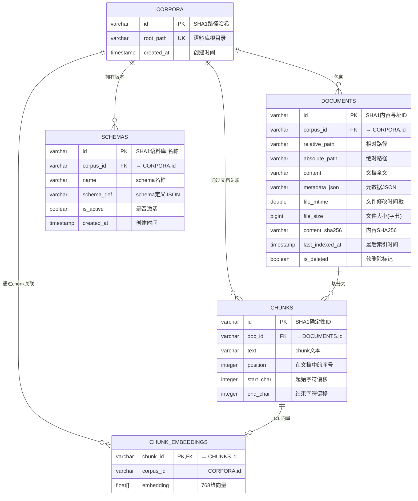
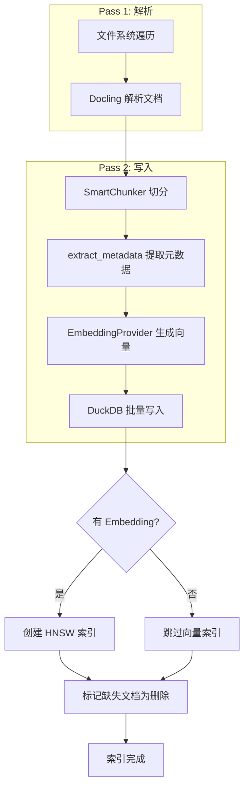
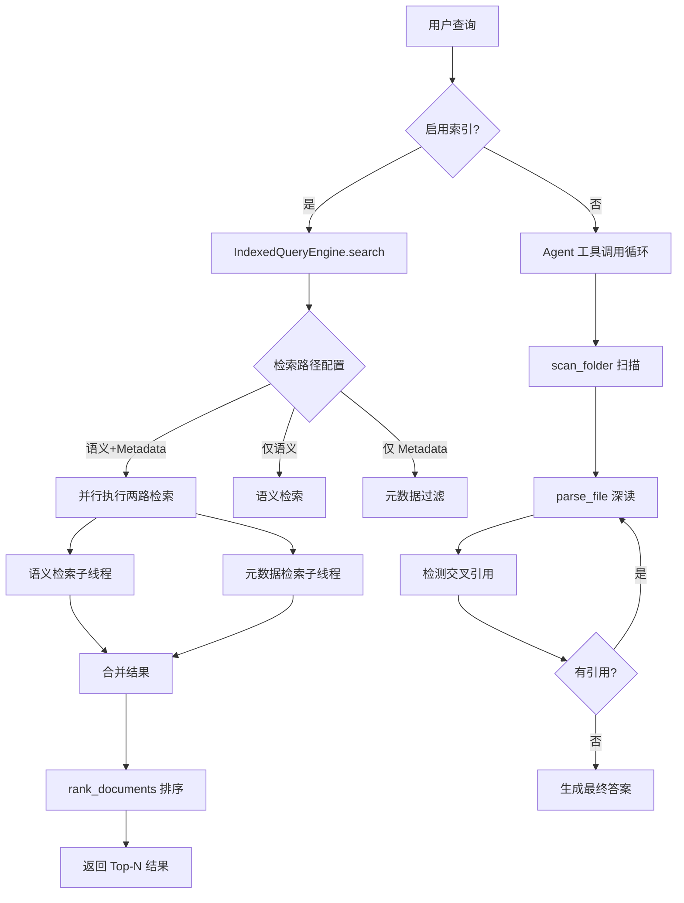

# 数据模型与数据库设计

> **版本**: v0.1.0
> **最后更新**: 2026-07-26
> **作者**: 技术文档团队
> **数据库引擎**: DuckDB ≥ 1.0.0

---

## 目录

1. [ER 关系图](#1-er-关系图)
2. [表结构详解](#2-表结构详解)
3. [索引策略](#3-索引策略)
4. [稳定 ID 生成策略](#4-稳定-id-生成策略)
5. [JSON 字段查询设计](#5-json-字段查询设计)
6. [软删除机制](#6-软删除机制)
7. [数据流向图](#7-数据流向图)
8. [事务设计](#8-事务设计)
9. [DuckDB 特有设计](#9-duckdb-特有设计)
10. [容量规划建议](#10-容量规划建议)

---

## 1. ER 关系图



### 关系说明

| 关系 | 类型 | 说明 |
|------|------|------|
| CORPORA → DOCUMENTS | 1:N | 一个语料库包含多个文档 |
| CORPORA → SCHEMAS | 1:N | 一个语料库可有多个 schema 版本 |
| DOCUMENTS → CHUNKS | 1:N | 一个文档切分为多个 chunk |
| CHUNKS → CHUNK_EMBEDDINGS | 1:1 | 每个 chunk 对应一个嵌入向量（可选） |
| DOCUMENTS → CHUNK_EMBEDDINGS | 间接关联 | 通过 `corpus_id` 字段实现语料库级别的批量操作 |

---

## 2. 表结构详解

### 2.1 corpora 表

> **设计理由**：作为整个索引系统的顶层实体，每个被索引的文件夹对应一个语料库。使用路径的 SHA1 哈希作为主键，确保同一路径在不同时间、不同会话中始终映射到相同的语料库 ID。

| 字段 | 类型 | 约束 | 说明 |
|------|------|------|------|
| `id` | VARCHAR | PRIMARY KEY | SHA1 哈希，格式 `corpus_{32位十六进制}` |
| `root_path` | VARCHAR | UNIQUE NOT NULL | 语料库根目录的绝对路径 |
| `created_at` | TIMESTAMP | DEFAULT CURRENT_TIMESTAMP | 语料库首次创建时间 |

**设计要点**：
- `root_path` 使用 `Path.resolve()` 归一化，消除 `./`、`../`、符号链接等差异
- `UNIQUE` 约束保证同一路径不会被重复创建
- 无 `updated_at` 字段——语料库元数据极少变更，文档级别的变更由 `documents.last_indexed_at` 追踪

---

### 22 documents 表

> **设计理由**：文档是索引系统的核心实体。采用内容寻址（content-addressed）策略，通过 `corpus_id:relative_path` 的哈希生成稳定 ID。支持软删除以处理文件删除场景。

| 字段 | 类型 | 约束 | 说明 |
|------|------|------|------|
| `id` | VARCHAR | PRIMARY KEY | SHA1(`corpus_id:relative_path`)，格式 `doc_{32位十六进制}` |
| `corpus_id` | VARCHAR | NOT NULL, FK → corpora.id | 所属语料库 |
| `relative_path` | VARCHAR | NOT NULL | 相对于语料库根目录的路径 |
| `absolute_path` | VARCHAR | NOT NULL | 绝对路径（冗余存储，便于直接访问） |
| `content` | VARCHAR | NOT NULL | 文档全文（Docling 转换后的 Markdown） |
| `metadata_json` | VARCHAR | NOT NULL, DEFAULT '{}' | 元数据 JSON 字符串 |
| `file_mtime` | DOUBLE | NOT NULL | 文件修改时间戳（Unix epoch 浮点数） |
| `file_size` | BIGINT | NOT NULL | 文件原始大小（字节） |
| `content_sha256` | VARCHAR | NOT NULL | 文档内容的 SHA256 哈希（用于变更检测） |
| `last_indexed_at` | TIMESTAMP | DEFAULT CURRENT_TIMESTAMP | 最近一次索引时间 |
| `is_deleted` | BOOLEAN | DEFAULT FALSE | 软删除标记 |

**约束**：
- `UNIQUE(corpus_id, relative_path)`：同一语料库内不允许重复路径

**设计要点**：
- `content` 字段存储完整 Markdown 文本，使 `get_document` 工具可即时返回全文
- `metadata_json` 以 JSON 字符串存储，利用 DuckDB 的 `json_extract_string()` 函数实现高效查询
- `file_mtime` 使用 DOUBLE 类型以兼容亚秒级精度
- `content_sha256` 用于检测内容变更（未来可实现增量更新优化）

---

### 2.3 chunks 表

> **设计理由**：文档被切分为重叠的 chunk 用于检索。chunk ID 由 `doc_id:position:start_char:end_char` 哈希生成，确保幂等性——同一文档重新索引会产生相同的 chunk ID，避免重复插入。

| 字段 | 类型 | 约束 | 说明 |
|------|------|------|------|
| `id` | VARCHAR | PRIMARY KEY | SHA1(`doc_id:position:start:end`)，格式 `chunk_{32位十六进制}` |
| `doc_id` | VARCHAR | NOT NULL, FK → documents.id | 所属文档 |
| `text` | VARCHAR | NOT NULL | chunk 文本内容 |
| `position` | INTEGER | NOT NULL | 在文档中的序号（从 0 开始） |
| `start_char` | INTEGER | NOT NULL | 在原文中的起始字符偏移 |
| `end_char` | INTEGER | NOT NULL | 在原文中的结束字符偏移 |

**设计要点**：
- 确定性 ID 使得 `INSERT OR REPLACE` 模式可安全使用
- `position` 字段保持 chunk 顺序，便于重建文档上下文
- `start_char` / `end_char` 支持高亮定位和原文引用
- 默认 chunk_size=1500 字符，overlap=150 字符（段落感知切分）

---

### 2.4 chunk_embeddings 表

> **设计理由**：嵌入向量作为可选功能独立存储。分离设计使得系统可在无 API Key 或无需语义检索时正常运行，同时避免主表因大体积向量数据而膨胀。

| 字段 | 类型 | 约束 | 说明 |
|------|------|------|------|
| `chunk_id` | VARCHAR | PRIMARY KEY, FK → chunks.id | 关联的 chunk（1:1 关系） |
| `corpus_id` | VARCHAR | NOT NULL | 所属语料库（冗余存储，便于语料库级批量操作） |
| `embedding` | FLOAT[768] | NOT NULL | 768 维嵌入向量 |

**设计要点**：
- `chunk_id` 同时作为 PK 和 FK，确保严格的 1:1 关系
- `corpus_id` 冗余存储避免了 JOIN 查询，提升语料库级操作（如删除、统计）性能
- 向量维度可配置（默认 768，对应 `gemini-embedding-001` 模型）
- 使用 DuckDB 的 `FLOAT[N]` 原生向量类型，支持 `array_cosine_similarity()` 函数

---

### 2.5 schemas 表

> **设计理由**：元数据 schema 定义了文档的元数据字段结构（如 `mentions_currency`、`document_type` 等）。支持版本化管理——同一语料库可有多个 schema，但仅一个激活。

| 字段 | 类型 | 约束 | 说明 |
|------|------|------|------|
| `id` | VARCHAR | PRIMARY KEY | SHA1(`corpus_id:name`)，格式 `schema_{32位十六进制}` |
| `corpus_id` | VARCHAR | NOT NULL, FK → corpora.id | 所属语料库 |
| `name` | VARCHAR | NOT NULL | schema 名称（如 `auto_test_acquisition`） |
| `schema_def` | VARCHAR | NOT NULL | schema 定义的 JSON 字符串 |
| `is_active` | BOOLEAN | DEFAULT FALSE | 是否为当前激活的 schema |
| `created_at` | TIMESTAMP | DEFAULT CURRENT_TIMESTAMP | 创建时间 |

**约束**：
- `UNIQUE(corpus_id, name)`：同一语料库内 schema 名称唯一

**schema_def 结构示例**：
```json
{
  "name": "auto_test_acquisition",
  "fields": [
    {"name": "filename", "type": "string", "description": "原始文件名"},
    {"name": "extension", "type": "string", "description": "文件扩展名"},
    {"name": "document_type", "type": "string", "description": "文档类型推断"},
    {"name": "mentions_currency", "type": "boolean", "description": "是否提及货币金额"},
    {"name": "mentions_dates", "type": "boolean", "description": "是否提及日期"}
  ],
  "metadata_profile": {
    "prompt": "Extract key entities...",
    "fields": {"organization": {"type": "string"}, ...}
  }
}
```

---

## 3. 索引策略

### 3.1 主键索引

所有表均使用 SHA1 哈希生成的 VARCHAR 作为主键，DuckDB 自动创建 B-Tree 索引：

| 表 | 主键 | 索引类型 |
|----|------|----------|
| corpora | `id` | B-Tree (PK) |
| documents | `id` | B-Tree (PK) |
| chunks | `id` | B-Tree (PK) |
| chunk_embeddings | `chunk_id` | B-Tree (PK) |
| schemas | `id` | B-Tree (PK) |

### 3.2 唯一约束索引

| 表 | 唯一约束 | 用途 |
|----|----------|------|
| corpora | `root_path` | 防止同一路径重复创建语料库 |
| documents | `(corpus_id, relative_path)` | 保证文档路径唯一性 |
| schemas | `(corpus_id, name)` | 保证 schema 名称唯一性 |

### 3.3 HNSW 向量索引（VSS 扩展）

```sql
CREATE INDEX IF NOT EXISTS hnsw_<corpus_id>
ON chunk_embeddings
USING HNSW (embedding)
WITH (metric = 'cosine');
```

**特性**：
- 依赖 DuckDB 的 `vss` 扩展（需 `INSTALL vss; LOAD vss`）
- 使用余弦相似度度量（`metric = 'cosine'`）
- 索引名称包含 corpus_id 以实现语料库级隔离
- 创建失败时优雅降级（`_vss_available = False`），回退到全表扫描

### 3.4 JSON 查询索引

DuckDB 的 `json_extract_string()` 函数在 `metadata_json` 字段上执行路径查询：

```sql
SELECT DISTINCT json_extract_string(d.metadata_json, '$.field_name')
FROM documents d
WHERE d.corpus_id = ?
  AND d.is_deleted = FALSE;
```

> **注意**：DuckDB 当前不支持 JSON 路径的函数索引，因此元数据查询在大数据集上可能较慢。对于超大规模语料库，建议将高频过滤字段提取为独立列。

---

## 4. 稳定 ID 生成策略

### 4.1 算法

所有实体 ID 均采用 **SHA1 哈希** 生成，确保确定性和幂等性：

```python
def _stable_id(prefix: str, value: str) -> str:
    digest = hashlib.sha1(value.encode("utf-8")).hexdigest()
    return f"{prefix}_{digest}"
```

### 4.2 ID 格式与种子值

| 实体 | 前缀 | 种子值 | 示例 ID |
|------|------|--------|---------|
| 语料库 | `corpus_` | `root_path`（绝对路径） | `corpus_a1b2c3d4...` |
| 文档 | `doc_` | `corpus_id:relative_path` | `doc_e5f6a7b8...` |
| Chunk | `chunk_` | `doc_id:position:start_char:end_char` | `chunk_9c8d7e6f...` |
| Schema | `schema_` | `corpus_id:name` | `schema_1a2b3c4d...` |

### 4.3 设计优势

| 优势 | 说明 |
|------|------|
| **确定性** | 相同输入始终产生相同 ID，无需查询数据库即可预知 ID |
| **幂等性** | 重复索引同一文档不会产生重复记录（`ON CONFLICT` 处理） |
| **无序列依赖** | 不依赖自增序列，支持分布式/并行写入 |
| **内容寻址** | 文档 ID 包含路径信息，便于调试和日志追踪 |
| **冲突避免** | SHA1 的 160 位空间保证实际场景中几乎无碰撞 |

---

## 5. JSON 字段查询设计

### 5.1 metadata_json 列

`documents.metadata_json` 以 JSON 字符串形式存储文档元数据，结构如下：

```json
{
  "filename": "01_master_agreement.pdf",
  "extension": ".pdf",
  "document_type": "contract",
  "mentions_currency": true,
  "mentions_dates": true,
  "organization": ["Acme Corp", "Widget Inc"],
  "deal_value_usd": 125000000
}
```

### 5.2 查询函数

使用 DuckDB 的 `json_extract_string()` 函数提取 JSON 字段：

```sql
-- 布尔字段查询
lower(coalesce(json_extract_string(d.metadata_json, '$.mentions_currency'), '')) = 'true'

-- 数值字段查询
try_cast(json_extract_string(d.metadata_json, '$.deal_value_usd') AS DOUBLE) >= 1000000

-- 字符串字段查询
lower(coalesce(json_extract_string(d.metadata_json, '$.document_type'), '')) = 'contract'

-- 子串匹配
lower(coalesce(json_extract_string(d.metadata_json, '$.filename'), '')) LIKE '%agreement%'
```

### 5.3 支持的操作符

| 操作符 | SQL 映射 | 适用类型 | 示例 |
|--------|----------|----------|------|
| `=` / `:` | `=` / `=` | string, boolean, number | `document_type=contract` |
| `!=` | `<>` | string, boolean, number | `mentions_currency!=false` |
| `>` | `>` | number | `deal_value>1000000` |
| `>=` | `>=` | number | `file_size>=1024` |
| `<` | `<` | number | `deal_value<5000000` |
| `<=` | `<=` | number | `file_size<=1048576` |
| `in` | `IN (...)` | string, boolean, number | `document_type in (contract, agreement)` |
| `~` | `LIKE '%...%'` | string | `filename~exhibit` |

### 5.4 类型处理规则

| 字段类型 | 存储格式 | 查询处理 |
|----------|----------|----------|
| boolean | JSON `true`/`false` | 转为小写字符串比较（`'true'`/`'false'`） |
| number | JSON 数字 | `try_cast(... AS DOUBLE)` 安全转换 |
| string | JSON 字符串 | `lower()` 大小写不匹配比较 |
| array | JSON 数组 | 当前版本以 JSON 字符串存储，不支持元素级查询 |

---

## 6. 软删除机制

### 6.1 设计原理

文件系统索引需要处理文件删除场景。采用软删除（Soft Delete）策略而非物理删除，原因：
- 保留删除历史，支持审计和调试
- 避免级联删除导致的性能开销
- 支持"取消删除"（文件重新出现时重置标记）

### 6.2 is_deleted 标记

| 值 | 含义 |
|----|------|
| `FALSE` | 文档活跃，参与所有查询 |
| `TRUE` | 文档已删除，被查询过滤排除 |

### 6.3 mark_deleted_missing_documents() 逻辑

```python
def mark_deleted_missing_documents(*, corpus_id, active_relative_paths):
    # 将本次索引中未出现的活跃文档标记为已删除
    UPDATE documents
    SET is_deleted = TRUE
    WHERE corpus_id = ?
      AND is_deleted = FALSE
      AND relative_path NOT IN (<active_paths>)
```

**执行时机**：在 `IndexingPipeline.index_folder()` 的 Pass 2（Chunk + Upsert）完成后调用。

**边界情况**：
- 若 `active_relative_paths` 为空（文件夹被清空），则标记该语料库下所有文档为已删除
- 使用参数化查询防止 SQL 注入

### 6.4 查询过滤

所有面向用户的查询均包含 `is_deleted = FALSE` 过滤条件：

```sql
-- 文档列表查询
SELECT * FROM documents
WHERE corpus_id = ? AND is_deleted = FALSE
ORDER BY relative_path;

-- Chunk 搜索查询
SELECT ... FROM chunks c
JOIN documents d ON d.id = c.doc_id
WHERE d.corpus_id = ?
  AND d.is_deleted = FALSE;
```

---

## 7. 数据流向图

### 7.1 索引流程



### 7.2 查询流程



---

## 8. 事务设计

### 8.1 DuckDB 单写入器模型

DuckDB 采用 **单写入器（Single-Writer）** 架构：同一时刻只允许一个写连接，但支持多并发读连接。

| 特性 | 说明 |
|------|------|
| 写并发 | 单连接串行写入，无锁竞争 |
| 读并发 | 多连接并行读取（MVCC 快照隔离） |
| 事务粒度 | 每条 SQL 语句自动构成一个事务（autocommit 模式） |
| 隔离级别 | 快照隔离（Snapshot Isolation） |

### 8.2 INSERT ON CONFLICT Upsert 模式

```sql
INSERT INTO documents (id, corpus_id, relative_path, ...)
VALUES (?, ?, ?, ...)
ON CONFLICT(id) DO UPDATE SET
    corpus_id = excluded.corpus_id,
    relative_path = excluded.relative_path,
    content = excluded.content,
    ...
    last_indexed_at = now(),
    is_deleted = FALSE;
```

**应用场景**：
- 文档重新索引时更新内容
- 重置 `is_deleted` 标记（文件重新出现时）
- 更新 `last_indexed_at` 时间戳

### 8.3 executemany 批量操作

```python
self._conn.executemany(
    "INSERT INTO chunks (id, doc_id, text, position, start_char, end_char) VALUES (?, ?, ?, ?, ?)",
    [(chunk.id, chunk.doc_id, chunk.text, ...) for chunk in chunks],
)
```

**优势**：
- 减少 Python ↔ DuckDB 的跨语言调用开销
- 单次事务完成全部写入，保证原子性
- 性能比逐条 INSERT 提升 10-100 倍

### 8.4 级联删除

```python
# 先删除关联的 embeddings
DELETE FROM chunk_embeddings
WHERE chunk_id IN (SELECT id FROM chunks WHERE doc_id = ?);

# 再删除 chunks
DELETE FROM chunks WHERE doc_id = ?;

# 最后 upsert 文档（带新的 chunks）
INSERT INTO documents ... ON CONFLICT(id) DO UPDATE ...;
```

**设计理由**：
- `chunk_embeddings` 表没有声明外键级联删除（`REFERENCES chunks(id)` 无 `ON DELETE CASCADE`）
- 手动级联确保数据一致性
- 在 `upsert_document()` 中原子执行

---

## 9. DuckDB 特有设计

### 9.1 VSS 扩展

```sql
INSTALL vss;
LOAD vss;
```

**功能**：提供 HNSW（Hierarchical Navigable Small World）向量索引，加速近似最近邻搜索。

**加载策略**：
- 在 `DuckDBStorage.__init__()` 中尝试加载
- 加载失败时设置 `_vss_available = False`，系统正常运行（回退到全表扫描）
- 不阻塞核心功能

### 9.2 array_cosine_similarity 函数

```sql
SELECT array_cosine_similarity(ce.embedding, ?::FLOAT[768]) AS score
FROM chunk_embeddings ce
...
ORDER BY score DESC;
```

**说明**：
- VSS 扩展提供的原生函数
- 计算两个向量间的余弦相似度（值域 [-1, 1]，越高越相似）
- 配合 HNSW 索引可实现亚毫秒级 ANN 搜索

### 9.3 FLOAT[N] 向量类型

```sql
CREATE TABLE chunk_embeddings (
    chunk_id VARCHAR PRIMARY KEY,
    corpus_id VARCHAR NOT NULL,
    embedding FLOAT[768] NOT NULL  -- 固定维度向量
);
```

**特性**：
- 编译时确定维度（`embedding_dim` 参数）
- 支持向量运算（点积、余弦相似度）
- 存储为紧凑的二进制格式

### 9.4 read_only 模式

```python
storage = DuckDBStorage(db_path, read_only=True, initialize=False)
```

**应用场景**：
- Web API 的查询端点（`/api/search`、`/api/index/status`）
- 多进程并发读取
- 防止意外写入

**注意**：`read_only=True` 时跳过 `initialize()` 和 `_try_load_vss()`，因此不会创建表或索引。

### 9.5 json_extract_string 函数

```sql
json_extract_string(d.metadata_json, '$.field_name')
```

**说明**：
- DuckDB 原生 JSON 函数
- 提取指定路径的字段值并返回字符串
- 路径不存在时返回 NULL
- 配合 `coalesce()` 处理空值

---

## 10. 容量规划建议

### 10.1 预期行数规模

| 表 | 每文档行数 | 1000 文档语料库 | 10000 文档语料库 |
|----|-----------|----------------|-----------------|
| corpora | 1 | 1 | 1 |
| documents | 1 | 1,000 | 10,000 |
| chunks | ~5-20 | 5,000-20,000 | 50,000-200,000 |
| chunk_embeddings | 0-1 | 0-20,000 | 0-200,000 |
| schemas | 1-5 | 1-5 | 1-5 |

> **注**：chunk 数量取决于文档长度。默认 chunk_size=1500 字符，平均 5000 字符的文档产生约 4 个 chunk。

### 10.2 嵌入向量存储计算

| 参数 | 值 |
|------|-----|
| 向量维度 | 768 |
| 每维字节数 | 4 (FLOAT32) |
| 单个向量大小 | 768 × 4 = 3,072 字节 ≈ 3 KB |
| 每 chunk 额外开销 | ~100 字节 (chunk_id + corpus_id) |

**存储估算**：

| 语料库规模 | Chunk 数 | 嵌入存储 |
|-----------|----------|----------|
| 小型 (100 文档) | ~400 | ~1.2 MB |
| 中型 (1,000 文档) | ~4,000 | ~12 MB |
| 大型 (10,000 文档) | ~40,000 | ~120 MB |
| 超大型 (100,000 文档) | ~400,000 | ~1.2 GB |

### 10.3 DuckDB 文件总大小估算

| 组件 | 每文档估算 | 10,000 文档 |
|------|-----------|-------------|
| documents.content | ~5 KB (Markdown) | ~50 MB |
| documents.metadata_json | ~0.5 KB | ~5 MB |
| chunks.text | ~5 KB (与 content 相当) | ~50 MB |
| chunk_embeddings.embedding | ~3 KB | ~30 MB |
| 索引开销 | ~20% | ~27 MB |
| **总计** | | **~162 MB** |

### 10.4 性能基准参考

| 操作 | 1,000 文档 | 10,000 文档 | 备注 |
|------|-----------|-------------|------|
| 全量索引 | ~3 分钟 | ~30 分钟 | 取决于文件大小和 API 调用 |
| 语义检索 (HNSW) | <10 ms | <50 ms | 需预先创建 HNSW 索引 |
| 语义检索 (全表) | ~100 ms | ~1,000 ms | 无 HNSW 索引时 |
| 元数据过滤 | ~50 ms | ~500 ms | 取决于过滤条件复杂度 |
| 文档读取 | <1 ms | <1 ms | 主键查找 |

### 10.5 扩展建议

| 规模 | 建议 |
|------|------|
| < 1,000 文档 | 默认配置即可，无需优化 |
| 1,000-10,000 文档 | 启用 HNSW 索引，使用 SSD 存储 |
| 10,000-100,000 文档 | 考虑按语料库分库，启用 VSS 扩展 |
| > 100,000 文档 | 评估迁移到专用向量数据库（如 pgvector、Milvus） |

---

# ❤️ 制作不易，请我喝咖啡☕️关注我➕

