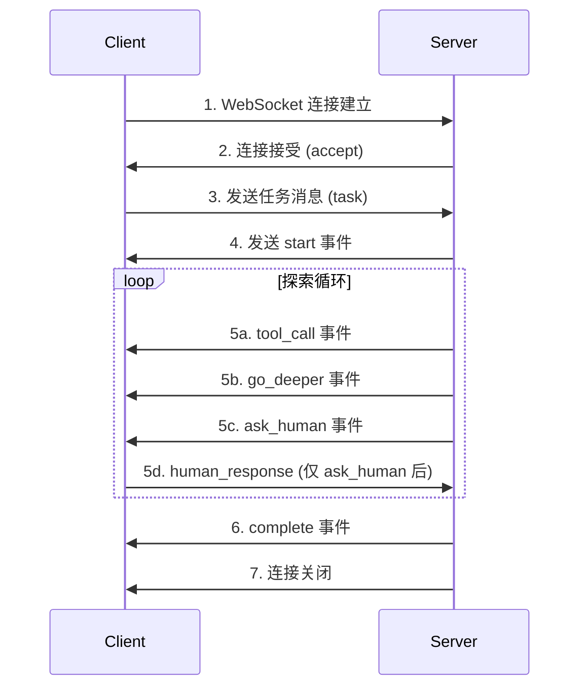
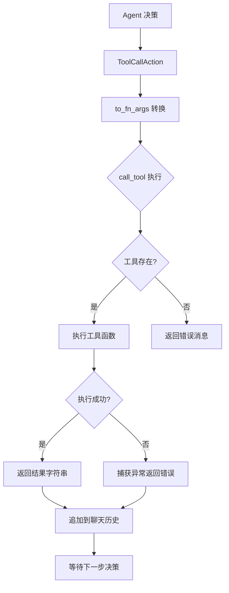

# API 与接口设计

> **版本**: v0.1.0
> **最后更新**: 2026-07-26
> **作者**: 技术文档团队
> **协议**: CLI (Typer) / REST (FastAPI) / WebSocket

---

## 目录

1. [CLI 命令参考](#1-cli-命令参考)
2. [REST API 端点](#2-rest-api-端点)
3. [WebSocket 协议详解](#3-websocket-协议详解)
4. [工具调用协议 (TOOLS 注册表)](#4-工具调用协议-tools-注册表)
5. [LLM 交互协议](#5-llm-交互协议)
6. [错误处理](#6-错误处理)
7. [认证与安全](#7-认证与安全)

---

## 1. CLI 命令参考

### 1.1 explore（主命令）

执行 Agent 驱动的文件系统探索，支持纯 Agentic 模式和索引加速模式。

```bash
explore --task "查询内容" [OPTIONS]
```

#### 参数

| 参数 | 简写 | 类型 | 默认值 | 说明 |
|------|------|------|--------|------|
| `--task` | `-t` | str | 必填 | Agent 要执行的任务/问题 |
| `--folder` | `-f` | str | `.` | 要探索的文件夹路径 |
| `--use-index` | | bool | False | 启用索引检索工具（需预先索引） |
| `--db-path` | | str | None | DuckDB 索引文件路径（覆盖默认路径） |

#### 行为

1. 验证文件夹存在性
2. 若启用 `--use-index`，检查索引是否存在
3. 初始化 Agent 和 Workflow
4. 流式执行探索步骤，实时输出 Rich 格式化面板
5. 输出最终答案、Token 使用统计、探索路径、引用文档

#### 自动索引检测

当环境变量 `FS_EXPLORER_AUTO_INDEX=1` 时，即使未指定 `--use-index`，也会自动检测并使用已有索引。

#### 示例

```bash
# 基础用法
explore --task "收购价格是多少？" --folder data/test_acquisition/

# 使用索引加速
explore --task "哪些合同涉及知识产权？" --folder data/test_acquisition/ --use-index

# 指定数据库路径
explore --task "总结财务条款" --folder ./docs --use-index --db-path ~/.fs_explorer/my_index.duckdb
```

#### 输出示例

```
╭─ Starting Exploration ──────────────────────────────────────╮
│ 🤖 FsExplorer Agent                                        │
│ 📋 Task: 收购价格是多少？                                    │
│ 📁 Folder: /Users/xxx/data/test_acquisition                │
│ 🕐 Started: 2026-07-26 14:30:00                            │
╰──────────────────────────────────────────────────────────────╯

╭─ 📂 Step 1: scan_folder [Phase 1: Parallel Document Scan] ─╮
│ **Target Directory:** `/Users/xxx/data/test_acquisition`   │
│ **Agent's Reasoning:**                                     │
│ Scanned 10 documents. Categorizing:                        │
│ - RELEVANT: 01_master_agreement.pdf                       │
│ - RELEVANT: 10_stock_purchase.pdf                          │
│ - SKIP: employee_handbook.pdf                              │
╰──────────────────────────────────────────────────────────────╯

...

╭─ ✅ Final Answer ──────────────────────────────────────────╮
│ 收购价格为 $125,000,000 [Source: 01_master_agreement.pdf]  │
╰──────────────────────────────────────────────────────────────╯

╭─ 📊 Workflow Summary ─────────────────────────────────────╮
│ Total Steps:           5                                   │
│ API Calls:             5                                   │
│ Documents Scanned:     10                                  │
│ Documents Parsed:      3                                   │
│ Total Tokens:          12,345                              │
│ Est. Total Cost:       $0.0012                             │
╰──────────────────────────────────────────────────────────────╯
```

---

### 1.2 explore index

构建或刷新指定文件夹的索引。

```bash
explore index <folder> [OPTIONS]
```

#### 参数

| 参数 | 类型 | 默认值 | 说明 |
|------|------|--------|------|
| `folder` (位置参数) | str | `.` | 要索引的文件夹路径 |
| `--db-path` | str | None | DuckDB 索引文件路径 |
| `--discover-schema` | bool | False | 自动发现元数据 schema 并设为激活 |
| `--schema-name` | str | None | 使用已存储的 schema 名称 |
| `--with-metadata` | bool | False | 启用 langextract 元数据提取（需要 API Key） |
| `--metadata-profile` | str | None | 自定义元数据 profile JSON 文件路径 |
| `--with-embeddings` | bool | False | 为索引的 chunk 生成向量嵌入 |

#### 行为

1. 遍历文件夹中的所有支持文件
2. 使用 Docling 解析文档为 Markdown
3. 使用 SmartChunker 切分为重叠 chunk
4. 提取元数据（启发式或 langextract）
5. 可选：生成嵌入向量
6. 批量写入 DuckDB
7. 标记已删除的文件
8. 输出索引统计摘要

#### 示例

```bash
# 基础索引
explore index data/test_acquisition/

# 带 schema 发现和元数据提取
explore index data/test_acquisition/ --discover-schema --with-metadata

# 带嵌入向量（支持语义检索）
explore index data/test_acquisition/ --with-embeddings

# 使用自定义 profile
explore index data/test_acquisition/ --metadata-profile ./my_profile.json --with-embeddings
```

---

### 1.3 explore query

以索引检索模式运行 Agent（等价于 `explore --use-index`）。

```bash
explore query --task "查询内容" [OPTIONS]
```

#### 参数

| 参数 | 简写 | 类型 | 默认值 | 说明 |
|------|------|------|--------|------|
| `--task` | `-t` | str | 必填 | 要回答的问题 |
| `--folder` | `-f` | str | `.` | 要查询的文件夹 |
| `--db-path` | | str | None | DuckDB 索引文件路径 |

#### 示例

```bash
explore query --task "哪些文件涉及知识产权转让？" --folder data/test_acquisition/
```

---

### 1.4 explore schema discover

自动发现并存储指定文件夹的元数据 schema。

```bash
explore schema discover <folder> [OPTIONS]
```

#### 参数

| 参数 | 类型 | 默认值 | 说明 |
|------|------|--------|------|
| `folder` (位置参数) | str | `.` | 要分析的文件夹 |
| `--db-path` | str | None | DuckDB 索引文件路径 |
| `--name` | str | None | 覆盖自动发现的 schema 名称 |
| `--activate / --no-activate` | bool | True | 是否设为激活 schema |
| `--with-metadata` | bool | False | 包含 langextract 元数据字段 |
| `--metadata-profile` | str | None | 自定义元数据 profile 文件路径 |

#### 示例

```bash
explore schema discover data/test_acquisition/ --name my_schema --activate
```

---

### 1.5 explore schema show

显示指定文件夹语料库的所有已存储 schema。

```bash
explore schema show <folder> [OPTIONS]
```

#### 参数

| 参数 | 类型 | 默认值 | 说明 |
|------|------|--------|------|
| `folder` (位置参数) | str | `.` | 要查询的文件夹 |
| `--db-path` | str | None | DuckDB 索引文件路径 |

#### 示例

```bash
explore schema show data/test_acquisition/
```

#### 输出示例

```
Schemas for /Users/xxx/data/test_acquisition
┏━━━━━━━━━━━━━━━━┳━━━━━━━━┳━━━━━━━━━━━━━━━━━━━━━┳━━━━━━━━━━━━━┓
┃ Name           ┃ Active ┃ Created At          ┃ Field Count ┃
┡━━━━━━━━━━━━━━━━╇━━━━━━━━╇━━━━━━━━━━━━━━━━━━━━━╇━━━━━━━━━━━━━┩
│ auto_test_...  │ yes    │ 2026-07-26 14:00:00 │ 8           │
│ custom_schema  │ no     │ 2026-07-25 10:00:00 │ 5           │
└────────────────┴────────┴─────────────────────┴─────────────┘
```

---

## 2. REST API 端点

### 2.1 端点总览

| 方法 | 路径 | 说明 |
|------|------|------|
| GET | `/` | 提供 HTML UI 界面 |
| GET | `/api/folders` | 列出目录内容 |
| GET | `/api/index/status` | 查询索引状态 |
| POST | `/api/index/auto-profile` | 生成元数据 profile |
| POST | `/api/index` | 构建/刷新索引 |
| POST | `/api/search` | 搜索语料库 |

### 2.2 GET /

提供单页 HTML 界面。

| 属性 | 值 |
|------|-----|
| 响应类型 | `text/html` |
| 状态码 | 200 (成功) / 404 (UI 文件不存在) |

**响应体**：`ui.html` 文件内容。

---

### 2.3 GET /api/folders

列出指定路径下的子目录。

| 属性 | 值 |
|------|-----|
| 方法 | GET |
| 查询参数 | `path` (str, 默认 `.`) |

**请求示例**：
```
GET /api/folders?path=/Users/xxx/documents
```

**响应模型**：
```json
{
  "current": "/Users/xxx/documents",
  "parent": "/Users/xxx",
  "folders": ["contracts", "invoices", "reports"],
  "files_count": 15
}
```

**错误码**：

| 状态码 | 条件 | 响应 |
|--------|------|------|
| 404 | 路径不存在 | `{"error": "Path not found"}` |
| 400 | 路径不是目录 | `{"error": "Not a directory"}` |
| 403 | 权限不足 | `{"error": "Permission denied"}` |
| 500 | 其他异常 | `{"error": "<message>"}` |

---

### 2.4 GET /api/index/status

检查文件夹是否已索引并返回状态详情。

| 属性 | 值 |
|------|-----|
| 方法 | GET |
| 查询参数 | `folder` (str, 必填), `db_path` (str, 可选) |

**请求示例**：
```
GET /api/index/status?folder=/Users/xxx/data/test_acquisition
```

**响应模型**：
```json
{
  "indexed": true,
  "corpus_id": "corpus_a1b2c3d4...",
  "document_count": 10,
  "schema_name": "auto_test_acquisition",
  "has_metadata": true,
  "has_embeddings": false,
  "schema_fields": ["filename", "extension", "document_type", "mentions_currency"]
}
```

**未索引时响应**：
```json
{"indexed": false}
```

---

### 2.5 POST /api/index/auto-profile

为指定文件夹生成自动发现的元数据 profile（用于预览/编辑）。

| 属性 | 值 |
|------|-----|
| 方法 | POST |
| Content-Type | `application/json` |

**请求模型**：
```json
{
  "folder": "/Users/xxx/data/test_acquisition"
}
```

**响应模型**：
```json
{
  "profile": {
    "prompt": "Extract key entities...",
    "fields": {
      "organization": {"type": "string"},
      "deal_value": {"type": "number"}
    }
  }
}
```

**错误码**：

| 状态码 | 条件 |
|--------|------|
| 400 | 无效文件夹路径 |
| 500 | 生成失败 |

---

### 2.6 POST /api/index

构建或刷新指定文件夹的索引。

| 属性 | 值 |
|------|-----|
| 方法 | POST |
| Content-Type | `application/json` |
| 并发控制 | 使用 per-folder asyncio Lock 防止并发索引同一文件夹 |

**请求模型**：
```json
{
  "folder": "/Users/xxx/data/test_acquisition",
  "db_path": null,
  "discover_schema": true,
  "schema_name": null,
  "with_metadata": false,
  "metadata_profile": null,
  "with_embeddings": false
}
```

| 字段 | 类型 | 默认值 | 说明 |
|------|------|--------|------|
| `folder` | str | `.` | 要索引的文件夹 |
| `db_path` | str | None | DuckDB 路径 |
| `discover_schema` | bool | True | 是否自动发现 schema |
| `schema_name` | str | None | 使用已有 schema 名称 |
| `with_metadata` | bool | False | 启用 langextract 元数据 |
| `metadata_profile` | dict | None | 自定义 profile |
| `with_embeddings` | bool | False | 生成嵌入向量 |

**响应模型**：
```json
{
  "db_path": "/Users/xxx/.fs_explorer/index.duckdb",
  "folder": "/Users/xxx/data/test_acquisition",
  "corpus_id": "corpus_a1b2c3d4...",
  "indexed_files": 10,
  "skipped_files": 0,
  "deleted_files": 0,
  "chunks_written": 45,
  "active_documents": 10,
  "schema_used": "auto_test_acquisition",
  "embeddings_written": 45,
  "metadata_mode": "heuristic"
}
```

**错误码**：

| 状态码 | 条件 |
|--------|------|
| 400 | 无效参数或路径 |
| 403 | 权限不足 |
| 404 | 路径不存在 |
| 500 | 索引失败 |

---

### 2.7 POST /api/search

搜索已索引的语料库并返回排序结果。

| 属性 | 值 |
|------|-----|
| 方法 | POST |
| Content-Type | `application/json` |

**请求模型**：
```json
{
  "corpus_folder": "/Users/xxx/data/test_acquisition",
  "query": "收购价格是多少？",
  "filters": "mentions_currency=true, document_type=contract",
  "limit": 5,
  "db_path": null
}
```

| 字段 | 类型 | 默认值 | 说明 |
|------|------|--------|------|
| `corpus_folder` | str | 必填 | 语料库文件夹 |
| `query` | str | 必填 | 搜索查询 |
| `filters` | str | None | 元数据过滤表达式 |
| `limit` | int | 5 | 返回结果数量上限 |
| `db_path` | str | None | DuckDB 路径 |

**响应模型**：
```json
{
  "corpus_folder": "/Users/xxx/data/test_acquisition",
  "query": "收购价格是多少？",
  "hits": [
    {
      "doc_id": "doc_e5f6a7b8...",
      "relative_path": "01_master_agreement.pdf",
      "absolute_path": "/Users/xxx/data/test_acquisition/01_master_agreement.pdf",
      "position": 2,
      "text": "The total purchase price is $125,000,000...",
      "semantic_score": 0.89,
      "metadata_score": 2,
      "score": 91.0,
      "matched_by": "semantic+metadata"
    }
  ]
}
```

**错误码**：

| 状态码 | 条件 |
|--------|------|
| 400 | 无效文件夹 |
| 404 | 语料库未索引 |
| 500 | 搜索失败 |

---

## 3. WebSocket 协议详解 (/ws/explore)

### 3.1 连接生命周期



### 3.2 连接流程

| 步骤 | 方向 | 说明 |
|------|------|------|
| 1 | C → S | 客户端发起 WebSocket 连接 |
| 2 | S → C | 服务器接受连接 (`websocket.accept()`) |
| 3 | C → S | 客户端发送任务消息 |
| 4 | S → C | 验证参数，发送 `start` 事件 |
| 5 | S → C | 流式发送探索事件 |
| 6 | C → S | (可选) 发送人类回答 |
| 7 | S → C | 发送 `complete` 事件 |
| 8 | - | 连接关闭 |

### 3.3 客户端 → 服务器消息

#### 任务消息

```json
{
  "task": "收购价格是多少？",
  "folder": "/Users/xxx/data/test_acquisition",
  "use_index": true,
  "db_path": null,
  "enable_semantic": true,
  "enable_metadata": true
}
```

| 字段 | 类型 | 必填 | 说明 |
|------|------|------|------|
| `task` | str | 是 | 用户查询/任务 |
| `folder` | str | 否 | 目标文件夹（默认 `.`） |
| `use_index` | bool | 否 | 是否使用索引（默认 false） |
| `db_path` | str | 否 | DuckDB 路径 |
| `enable_semantic` | bool | 否 | 启用语义检索 |
| `enable_metadata` | bool | 否 | 启用元数据过滤 |

#### 人类回答消息

```json
{
  "type": "human_response",
  "response": "我想查看2024年的合同"
}
```

| 字段 | 类型 | 必填 | 说明 |
|------|------|------|------|
| `type` | str | 是 | 固定值 `"human_response"` |
| `response` | str | 是 | 用户回答内容 |

### 3.4 服务器 → 客户端消息

#### start 事件

```json
{
  "type": "start",
  "data": {
    "task": "收购价格是多少？",
    "folder": "/Users/xxx/data/test_acquisition",
    "use_index": true
  }
}
```

#### tool_call 事件

```json
{
  "type": "tool_call",
  "data": {
    "step": 1,
    "tool_name": "scan_folder",
    "tool_input": {
      "directory": "/Users/xxx/data/test_acquisition"
    },
    "reason": "Scanned 10 documents. Categorizing: RELEVANT: 01_master_agreement.pdf..."
  }
}
```

| 字段 | 类型 | 说明 |
|------|------|------|
| `step` | int | 步骤序号（从 1 递增） |
| `tool_name` | str | 工具名称 |
| `tool_input` | dict | 工具参数 |
| `reason` | str | Agent 推理说明 |

#### go_deeper 事件

```json
{
  "type": "go_deeper",
  "data": {
    "step": 2,
    "directory": "/Users/xxx/data/test_acquisition/exhibits",
    "reason": "Need to explore exhibits subdirectory for supporting documents"
  }
}
```

#### ask_human 事件

```json
{
  "type": "ask_human",
  "data": {
    "step": 3,
    "question": "您想查看哪个年度的合同？",
    "reason": "需要缩小搜索范围"
  }
}
```

> **注意**：收到 `ask_human` 后，客户端应显示问题并等待用户输入，然后发送 `human_response` 消息。

#### complete 事件

```json
{
  "type": "complete",
  "data": {
    "final_result": "收购价格为 $125,000,000 [Source: 01_master_agreement.pdf, Section 2.1]...",
    "error": null,
    "stats": {
      "steps": 5,
      "api_calls": 5,
      "documents_scanned": 10,
      "documents_parsed": 3,
      "prompt_tokens": 8500,
      "completion_tokens": 1200,
      "total_tokens": 9700,
      "tool_result_chars": 15000,
      "estimated_cost": 0.0012
    },
    "trace": {
      "step_path": [
        "1. tool:scan_folder (directory=/Users/xxx/data/test_acquisition)",
        "2. tool:parse_file (file=/Users/xxx/.../01_master_agreement.pdf)"
      ],
      "referenced_documents": [
        "/Users/xxx/data/test_acquisition/01_master_agreement.pdf",
        "/Users/xxx/data/test_acquisition/10_stock_purchase.pdf"
      ],
      "cited_sources": [
        "01_master_agreement.pdf",
        "10_stock_purchase.pdf"
      ]
    }
  }
}
```

**Stats 对象**：

| 字段 | 类型 | 说明 |
|------|------|------|
| `steps` | int | 总步骤数 |
| `api_calls` | int | LLM API 调用次数 |
| `documents_scanned` | int | 扫描的文档数 |
| `documents_parsed` | int | 深度解析的文档数 |
| `prompt_tokens` | int | 输入 Token 数 |
| `completion_tokens` | int | 输出 Token 数 |
| `total_tokens` | int | 总 Token 数 |
| `tool_result_chars` | int | 工具结果字符数 |
| `estimated_cost` | float | 估算费用（美元） |

**Trace 对象**：

| 字段 | 类型 | 说明 |
|------|------|------|
| `step_path` | list[str] | 步骤路径记录 |
| `referenced_documents` | list[str] | 工具调用引用的文档（绝对路径） |
| `cited_sources` | list[str] | 最终答案中引用的源文件 |

#### error 事件

```json
{
  "type": "error",
  "data": {
    "message": "No index found for the selected folder. Run `explore index <folder>` first."
  }
```

---

## 4. 工具调用协议 (TOOLS 注册表)

### 4.1 工具总览

| # | 工具名称 | 来源模块 | 类型 | 说明 |
|---|----------|----------|------|------|
| 1 | `read` | fs.py | 文件系统 | 读取纯文本文件 |
| 2 | `grep` | fs.py | 文件系统 | 正则搜索文件内容 |
| 3 | `glob` | fs.py | 文件系统 | 模式匹配查找文件 |
| 4 | `scan_folder` | fs.py | 文件系统 | 并行扫描文件夹 |
| 5 | `preview_file` | fs.py | 文件系统 | 快速预览文档 |
| 6 | `parse_file` | fs.py | 文件系统 | 深度解析文档 |
| 7 | `semantic_search` | agent.py | 索引检索 | 语义+元数据混合检索 |
| 8 | `get_document` | agent.py | 索引检索 | 按 ID 获取文档全文 |
| 9 | `list_indexed_documents` | agent.py | 索引检索 | 列出索引文档 |

### 4.2 工具详细规格

#### read

| 属性 | 值 |
|------|-----|
| 函数 | `read_file(file_path: str) -> str` |
| 参数 | `file_path` (str): 文件路径 |
| 返回 | 文件内容字符串，或错误消息 |
| 说明 | 读取纯文本文件内容，不做格式转换 |

#### grep

| 属性 | 值 |
|------|-----|
| 函数 | `grep_file_content(file_path: str, pattern: str) -> str` |
| 参数 | `file_path` (str): 文件路径, `pattern` (str): 正则表达式 |
| 返回 | 匹配结果列表，或 "No matches found" |
| 说明 | 使用 `re.MULTILINE` 标志进行多行正则匹配 |

#### glob

| 属性 | 值 |
|------|-----|
| 函数 | `glob_paths(directory: str, pattern: str) -> str` |
| 参数 | `directory` (str): 搜索目录, `pattern` (str): glob 模式（如 `**/*.pdf`） |
| 返回 | 匹配路径列表，或 "No matches found" |
| 说明 | 使用 `pathlib` + `glob` 模块实现递归匹配 |

#### scan_folder

| 属性 | 值 |
|------|-----|
| 函数 | `scan_folder(directory: str, max_workers: int = 4, preview_chars: int = 1500) -> str` |
| 参数 | `directory`: 文件夹路径, `max_workers`: 并行 workers 数, `preview_chars`: 每文件预览字符数 |
| 返回 | 格式化的文档扫描报告 |
| 说明 | 使用 ThreadPoolExecutor 并行处理所有支持的文档 |

#### preview_file

| 属性 | 值 |
|------|-----|
| 函数 | `preview_file(file_path: str, max_chars: int = 3000) -> str` |
| 参数 | `file_path`: 文件路径, `max_chars`: 最大字符数（默认 3000，约 2-3 页） |
| 返回 | 文档预览（前 N 个字符） |
| 说明 | 使用 Docling 解析后截取前 N 个字符 |

#### parse_file

| 属性 | 值 |
|------|-----|
| 函数 | `parse_file(file_path: str) -> str` |
| 参数 | `file_path` (str): 文件路径 |
| 返回 | 完整文档内容（Markdown 格式） |
| 说明 | 使用 Docling 解析 PDF/DOCX/PPTX/XLSX/HTML/MD 为 Markdown |

#### semantic_search

| 属性 | 值 |
|------|-----|
| 函数 | `semantic_search(query: str, filters: str \| None = None, limit: int = 5) -> str` |
| 参数 | `query`: 搜索查询, `filters`: 元数据过滤表达式, `limit`: 结果数量 |
| 返回 | 格式化的搜索结果（包含 doc_id、路径、分数、摘要） |
| 说明 | 需要启用索引上下文；首次调用返回字段目录 |

#### get_document

| 属性 | 值 |
|------|-----|
| 函数 | `get_document(doc_id: str) -> str` |
| 参数 | `doc_id` (str): 文档 ID |
| 返回 | 文档全文（带路径头信息） |
| 说明 | 从索引中读取完整文档内容 |

#### list_indexed_documents

| 属性 | 值 |
|------|-----|
| 函数 | `list_indexed_documents() -> str` |
| 参数 | 无 |
| 返回 | 索引文档列表（doc_id + 路径） |
| 说明 | 列出当前语料库所有活跃文档 |

### 4.3 工具调用流程



---

## 5. LLM 交互协议

### 5.1 模型配置

| 属性 | 值 |
|------|-----|
| 模型名称 | `gemini-3-flash-preview` |
| API 版本 | `v1beta` |
| SDK | `google-genai` (≥ 1.55.0) |
| 客户端 | `google.genai.Client` |
| 异步客户端 | `client.aio.models.generate_content` |

### 5.2 请求配置

```python
response = await self._client.aio.models.generate_content(
    model="gemini-3-flash-preview",
    contents=self._chat_history,
    config={
        "system_instruction": _build_system_prompt(enable_semantic, enable_metadata),
        "response_mime_type": "application/json",
        "response_schema": Action,
    },
)
```

| 配置项 | 值 | 说明 |
|--------|-----|------|
| `model` | `gemini-3-flash-preview` | Gemini 3 Flash 模型 |
| `response_mime_type` | `application/json` | 强制 JSON 输出 |
| `response_schema` | `Action` (Pydantic) | 结构化输出 schema |
| `system_instruction` | 动态构建 | 根据检索模式追加提示 |

### 5.3 System Prompt 构建

基础 prompt 定义在 `agent.py` 的 `SYSTEM_PROMPT` 常量中，包含：
- 工具使用说明
- 三阶段探索策略（Parallel Scan → Deep Dive → Backtracking）
- 引用格式要求
- 示例工作流

根据检索模式动态追加提示：

| 模式 | 追加提示 |
|------|----------|
| Semantic + Metadata | "Start with `semantic_search` using optional `filters` for best results" |
| Semantic Only | "Use `semantic_search` WITHOUT the `filters` parameter" |
| Metadata Only | "Use `semantic_search` with the `filters=` parameter" |
| 无索引 | 不追加 |

### 5.4 聊天历史格式

使用 `google.genai.types.Content` 和 `Part` 结构：

```python
from google.genai.types import Content, Part

# 用户消息
Content(role="user", parts=[Part.from_text(text="任务描述")])

# 助手响应
Content(role="model", parts=[Part.from_text(text='{"action": {...}, "reason": "..."}')])

# 工具结果
Content(role="user", parts=[Part.from_text(text="Tool result for xxx:\n\n结果内容")])
```

**历史结构示例**：

```
[0] user: "Given that the current directory looks like this: ... what action should you take first?"
[1] model: {"action": {"tool_name": "scan_folder", ...}, "reason": "..."}
[2] user: "Tool result for scan_folder:\n\n扫描结果..."
[3] model: {"action": {"tool_name": "parse_file", ...}, "reason": "..."}
[4] user: "Tool result for parse_file:\n\n文档内容..."
[5] model: {"action": {"final_result": "答案..."}, "reason": "..."}
```

### 5.5 响应解析

```python
action = Action.model_validate_json(response.text)
action_type = action.to_action_type()  # "toolcall" | "godeeper" | "askhuman" | "stop"
```

**Action Schema**：

```python
class Action(BaseModel):
    action: ToolCallAction | GoDeeperAction | StopAction | AskHumanAction
    reason: str
```

### 5.6 Token 追踪

```python
if response.usage_metadata:
    self.token_usage.add_api_call(
        prompt_tokens=response.usage_metadata.prompt_token_count or 0,
        completion_tokens=response.usage_metadata.candidates_token_count or 0,
    )
```

**费用计算**：

| 类型 | 单价（每百万 Token） |
|------|---------------------|
| Input | $0.075 |
| Output | $0.30 |

---

## 6. 错误处理

### 6.1 错误类型与消息

| 错误类型 | 来源 | 消息格式 | 处理方式 |
|----------|------|----------|----------|
| 配置错误 | Agent 初始化 | `GOOGLE_API_KEY not found...` | 抛出 `ValueError` |
| 目录不存在 | Workflow | `No such directory: {path}` | 返回 `ExplorationEndEvent(error=...)` |
| 索引缺失 | CLI | `No index found for this folder` | 提示运行 `explore index` |
| 工具执行错误 | `call_tool` | `An error occurred while calling tool {name} with {args}: {e}` | 捕获异常，返回错误消息给 Agent |
| 过滤器解析错误 | `parse_metadata_filters` | `Invalid filter syntax: ...` | 返回 `MetadataFilterParseError` |
| WebSocket 异常 | Server | `{"type": "error", "data": {"message": "..."}}` | 发送 error 事件 |

### 6.2 HTTP 状态码

| 状态码 | 场景 |
|--------|------|
| 200 | 成功 |
| 400 | 请求参数无效（非目录、无效 JSON） |
| 403 | 文件系统权限不足 |
| 404 | 路径不存在、索引不存在、UI 文件不存在 |
| 500 | 服务器内部错误 |

### 6.3 WebSocket 错误事件

```json
{
  "type": "error",
  "data": {
    "message": "具体错误描述"
  }
}
```

**触发条件**：
- 任务为空：`"No task provided"`
- 文件夹无效：`"Invalid folder: {folder}"`
- 索引缺失：`"No index found for the selected folder..."`
- 运行时异常：`str(exception)`

### 6.4 工具错误处理

```python
def call_tool(self, tool_name: Tools, tool_input: dict[str, Any]) -> None:
    try:
        result = TOOLS[tool_name](**tool_input)
    except Exception as e:
        result = (
            f"An error occurred while calling tool {tool_name} "
            f"with {tool_input}: {e}"
        )
    # 将结果（或错误）追加到聊天历史
    self._chat_history.append(...)
```

**设计理由**：
- 工具错误不会中断 Agent 执行
- 错误消息作为工具结果返回给 LLM
- Agent 可根据错误消息调整策略（如重试、换工具）

---

## 7. 认证与安全

### 7.1 API Key 管理

| 密钥 | 环境变量 | 用途 | 获取方式 |
|------|----------|------|----------|
| Google API Key | `GOOGLE_API_KEY` | Gemini LLM 调用、嵌入生成 | [Google AI Studio](https://aistudio.google.com/apikey) |
| Langextract API Key | `LANGEXTRACT_API_KEY` | 元数据提取（可选，默认复用 GOOGLE_API_KEY） | 同上 |

**加载优先级**：
1. 构造函数参数 `api_key`
2. 环境变量 `GOOGLE_API_KEY`
3. `.env` 文件（通过 `python-dotenv` 加载）

### 7.2 本地服务器安全

| 属性 | 值 |
|------|-----|
| 默认绑定地址 | `127.0.0.1`（仅本地访问） |
| 默认端口 | `8000` |
| 内置认证 | 无 |
| CORS | 未配置（默认限制） |

> **警告**：当前版本无内置认证机制。若需暴露到网络，务必通过反向代理添加认证（如 Basic Auth、OAuth）。

### 7.3 文件系统访问范围

| 范围 | 说明 |
|------|------|
| 读取 | Agent 可读取指定文件夹及其子目录下的所有支持文件 |
| 写入 | 仅在 DuckDB 索引文件中写入（路径由 `--db-path` 或默认路径控制） |
| 执行 | 不执行任何系统命令 |

### 7.4 数据传输

| 方向 | 内容 | 目标 |
|------|------|------|
| 发送 | 文档内容、查询 | Google Gemini API |
| 接收 | LLM 响应、嵌入向量 | Google Gemini API |
| 本地 | 索引数据、日志 | 本地 DuckDB 文件 |

> **隐私说明**：文档内容通过 Google Gemini API 处理。若数据敏感，请确保符合 Google AI 使用条款。

### 7.5 pre-commit 安全钩子

| 钩子 | 用途 |
|------|------|
| `detect-private-key` | 检测意外提交私钥文件 |
| `check-yaml` | 验证 YAML 文件格式 |
| `ruff format` | 代码格式化 |
| `ruff lint` | 代码风格检查 |

---

☕️ 制作不易，请我喝咖啡☕️关注我➕

