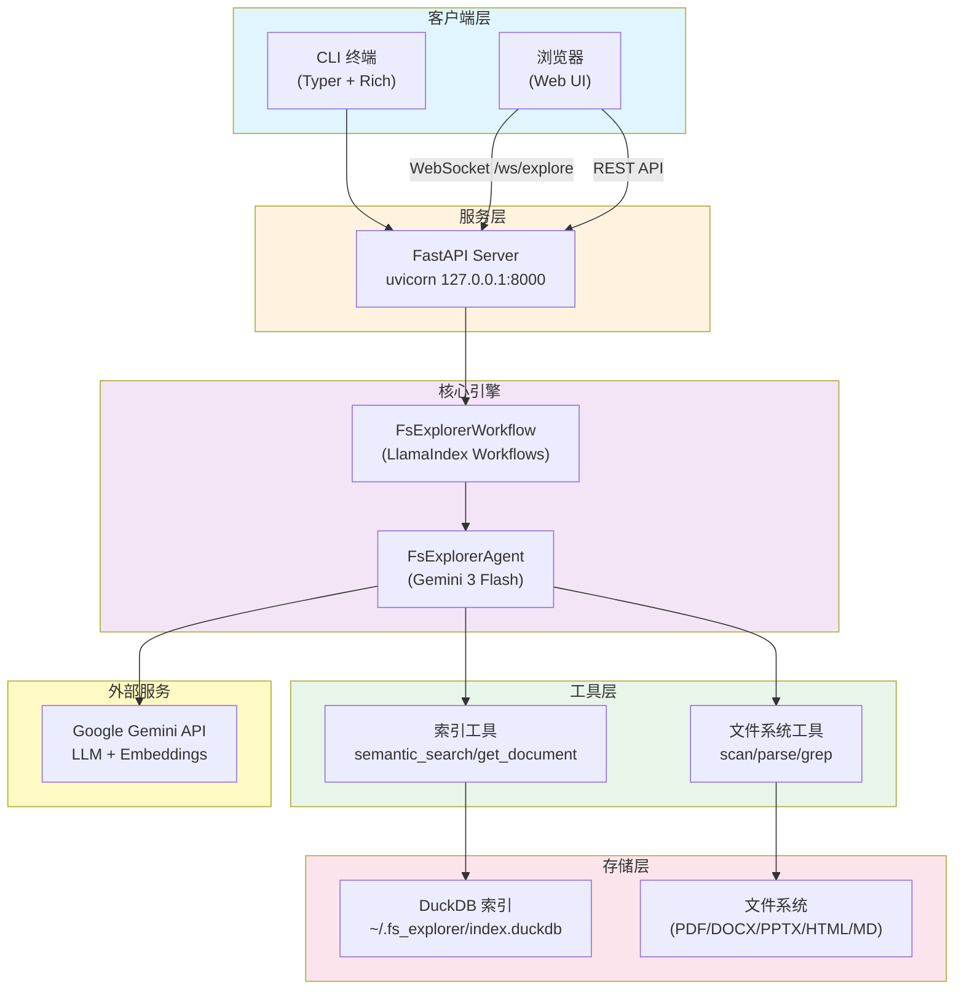
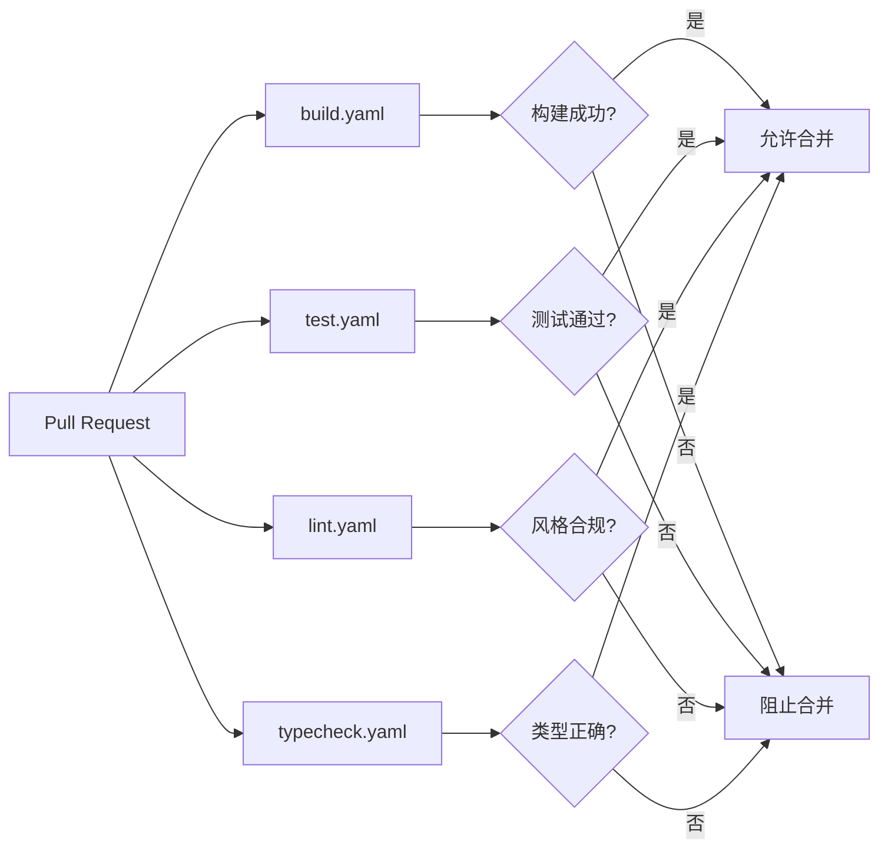
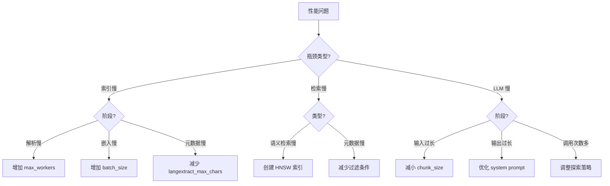

# 部署运维与基础设施

> **版本**: v0.1.0
> **最后更新**: 2026-07-26
> **作者**: 技术文档团队
> **运行环境**: Python 3.10+, macOS / Linux / Windows (WSL)

---

## 目录

1. [部署架构图](#1-部署架构图)
2. [本地开发环境部署](#2-本地开发环境部署)
3. [Docker 部署](#3-docker-部署)
4. [CI/CD 流水线 (GitHub Actions)](#4-cicd-流水线-github-actions)
5. [环境变量与配置管理](#5-环境变量与配置管理)
6. [监控与日志方案](#6-监控与日志方案)
7. [备份与恢复策略](#7-备份与恢复策略)
8. [安全最佳实践](#8-安全最佳实践)
9. [性能调优工作流](#9-性能调优工作流)
10. [生产部署建议](#10-生产部署建议)

---

## 1. 部署架构图



### 组件说明

| 组件 | 技术 | 职责 |
|------|------|------|
| CLI 终端 | Typer + Rich | 命令行交互，Rich 格式化输出 |
| 浏览器 UI | HTML + WebSocket | 单页 Web 界面 |
| FastAPI Server | uvicorn | HTTP/WebSocket 服务 |
| FsExplorerWorkflow | LlamaIndex Workflows | 事件驱动工作流编排 |
| FsExplorerAgent | google-genai | Gemini LLM 交互决策 |
| 文件系统工具 | Docling | 文档解析、扫描、搜索 |
| 索引工具 | DuckDB | 语义检索、元数据过滤 |
| Google Gemini API | gemini-3-flash-preview | LLM 推理、嵌入生成 |

---

## 2. 本地开发环境部署

### 2.1 前置要求

| 依赖 | 版本 | 安装方式 |
|------|------|----------|
| Python | ≥ 3.10 | `pyenv` / `brew` / 官方安装包 |
| uv | ≥ 0.9.10 | `curl -LsSf https://astral.sh/uv/install.sh \| sh` |
| GOOGLE_API_KEY | - | [Google AI Studio](https://aistudio.google.com/apikey) |

### 2.2 安装步骤

```bash
# 1. 克隆仓库
git clone https://github.com/PhunkyBob/agentic-file-search.git
cd agentic-file-search

# 2. 安装依赖
uv pip install .
uv pip install -e ".[dev]"  # 包含开发依赖

# 3. 配置环境变量
cp .env.example .env
# 编辑 .env 文件，填入 GOOGLE_API_KEY

# 4. 验证安装
uv run explore --help
```

### 2.3 首次运行

```bash
# CLI 模式（Agentic 探索）
uv run explore --task "收购价格是多少？" --folder data/test_acquisition/

# 构建索引
uv run explore index data/test_acquisition/ --with-embeddings

# 使用索引查询
uv run explore query --task "哪些文件涉及知识产权？" --folder data/test_acquisition/

# 启动 Web UI
uv run uvicorn fs_explorer.server:app --host 127.0.0.1 --port 8000
# 浏览器访问 http://127.0.0.1:8000
```

### 2.4 开发工具链

| 工具 | 命令 | 说明 |
|------|------|------|
| 测试 | `uv run pytest` | 运行全部测试 |
| 测试(单文件) | `uv run pytest tests/test_fs.py` | 运行指定测试文件 |
| 测试(按名称) | `uv run pytest -k "test_name"` | 按名称过滤测试 |
| 代码检查 | `uv run pre-commit run -a` | 运行所有 pre-commit 钩子 |
| 格式化 | `uv run ruff format` | 代码格式化 |
| 类型检查 | `uv run ty check src/fs_explorer/` | 静态类型检查 |
| 构建 | `uv run build` | 构建发布包 |

或通过 Makefile 快捷命令：

```bash
make test        # 运行测试
make lint        # 代码检查
make format      # 格式化
make typecheck   # 类型检查
make build       # 构建
make all         # 全部执行
```

---

## 3. Docker 部署

### 3.1 docker-compose.yml 分析

```yaml
version: '3.8'

services:
  postgres:
    image: pgvector/pgvector:pg17
    container_name: fs-explorer-db
    environment:
      POSTGRES_USER: ${POSTGRES_USER:-fs_explorer}
      POSTGRES_PASSWORD: ${POSTGRES_PASSWORD:-devpassword}
      POSTGRES_DB: ${POSTGRES_DB:-fs_explorer}
    ports:
      - "${POSTGRES_PORT:-5432}:5432"
    volumes:
      - postgres_data:/var/lib/postgresql/data
      - ./init.sql:/docker-entrypoint-initdb.d/init.sql:ro
    healthcheck:
      test: ["CMD-SHELL", "pg_isready -U fs_explorer -d fs_explorer"]
      interval: 5s
      timeout: 5s
      retries: 5
    restart: unless-stopped

volumes:
  postgres_data:
```

### 3.2 架构说明

> **注意**：当前 Docker Compose 仅提供可选的 pgvector 数据库服务。FsExplorer 主应用默认使用 DuckDB（无需外部数据库），主应用在本地运行。

| 组件 | 运行位置 | 说明 |
|------|----------|------|
| FsExplorer 应用 | 本地 | 直接通过 `uv run` 运行 |
| DuckDB | 本地文件 | 默认存储于 `~/.fs_explorer/index.duckdb` |
| pgvector (可选) | Docker | 预留用于未来扩展或外部向量存储 |

### 3.3 启动 pgvector（可选）

```bash
# 启动数据库服务
docker compose up -d postgres

# 查看日志
docker compose logs -f postgres

# 停止服务
docker compose down

# 停止并删除数据卷
docker compose down -v
```

### 3.4 配置参数

| 参数 | 环境变量 | 默认值 | 说明 |
|------|----------|--------|------|
| 用户名 | `POSTGRES_USER` | `fs_explorer` | 数据库用户名 |
| 密码 | `POSTGRES_PASSWORD` | `devpassword` | 数据库密码 |
| 数据库名 | `POSTGRES_DB` | `fs_explorer` | 数据库名称 |
| 端口 | `POSTGRES_PORT` | `5432` | 映射到宿主机的端口 |

### 3.5 数据持久化

| 卷 | 路径 | 说明 |
|----|------|------|
| `postgres_data` | `/var/lib/postgresql/data` | PostgreSQL 数据目录 |
| `./init.sql` | `/docker-entrypoint-initdb.d/init.sql` | 初始化脚本（只读挂载） |

### 3.6 健康检查

```yaml
healthcheck:
  test: ["CMD-SHELL", "pg_isready -U fs_explorer -d fs_explorer"]
  interval: 5s        # 检查间隔
  timeout: 5s         # 超时时间
  retries: 5          # 重试次数
```

### 3.7 重启策略

| 策略 | 值 | 说明 |
|------|-----|------|
| `restart` | `unless-stopped` | 除非手动停止，否则始终重启 |

---

## 4. CI/CD 流水线 (GitHub Actions)

### 4.1 流水线总览

| 工作流文件 | 名称 | 触发条件 |
|-----------|------|----------|
| `build.yaml` | Build | PR |
| `test.yaml` | CI Tests - Pull Request | PR |
| `lint.yaml` | Linting | PR |
| `typecheck.yaml` | Typecheck | PR |

### 4.2 build.yaml — 构建检查

```yaml
name: Build

on:
  pull_request

jobs:
  build:
    runs-on: ubuntu-latest
    steps:
      - uses: actions/checkout@v4
      - name: Install uv
        uses: astral-sh/setup-uv@v6
      - name: Set up Python
        run: uv python install 3.13
      - name: Build package
        run: make build
```

| 属性 | 值 |
|------|-----|
| 触发条件 | PR（任何分支） |
| 运行环境 | `ubuntu-latest` |
| Python 版本 | 3.13 |
| 矩阵策略 | 无（单版本） |
| 步骤 | checkout → install uv → setup python → build |

### 4.3 test.yaml — 多版本测试

```yaml
name: CI Tests - Pull Request

on:
  pull_request

jobs:
  testing_pr:
    runs-on: ubuntu-latest
    strategy:
      matrix:
        python-version: ["3.10", "3.11", "3.12", "3.13"]
    steps:
      - uses: actions/checkout@v4
        with:
          fetch-depth: 1
      - name: Install uv
        uses: astral-sh/setup-uv@v6
        with:
          python-version: ${{ matrix.python-version }}
          enable-cache: true
      - name: Run Tests on Main Package
        run: make test
```

| 属性 | 值 |
|------|-----|
| 触发条件 | PR（任何分支） |
| 运行环境 | `ubuntu-latest` |
| 矩阵策略 | Python 3.10, 3.11, 3.12, 3.13 |
| 并行任务数 | 4 |
| 缓存 | uv 启用缓存 |
| 步骤 | checkout → install uv (带缓存) → run tests |

### 4.4 lint.yaml — 代码风格检查

```yaml
name: Linting

on:
  pull_request

jobs:
  lint:
    runs-on: ubuntu-latest
    steps:
      - uses: actions/checkout@v4
      - name: Install uv
        uses: astral-sh/setup-uv@v6
      - name: Set up Python
        run: uv python install 3.12
      - name: Run formatter
        run: make format-check
      - name: Run linter
        run: make lint
```

| 属性 | 值 |
|------|-----|
| 触发条件 | PR（任何分支） |
| 运行环境 | `ubuntu-latest` |
| Python 版本 | 3.12 |
| 步骤 | checkout → install uv → setup python → format-check → lint |
| 检查工具 | ruff format (格式), pre-commit (风格) |

### 4.5 typecheck.yaml — 静态类型检查

```yaml
name: Typecheck

on:
  pull_request

jobs:
  core-typecheck:
    runs-on: ubuntu-latest
    steps:
      - uses: actions/checkout@v4
        with:
          fetch-depth: 1
      - name: Install uv
        uses: astral-sh/setup-uv@v6
      - name: Set up Python
        run: uv python install
      - name: Run Mypy
        run: make typecheck
```

| 属性 | 值 |
|------|-----|
| 触发条件 | PR（任何分支） |
| 运行环境 | `ubuntu-latest` |
| Python 版本 | 最新稳定版 |
| 检查工具 | `ty` (Python type checker by Astral) |
| 检查范围 | `src/fs_explorer/` |

### 4.6 CI 流水线执行流程图



---

## 5. 环境变量与配置管理

### 5.1 环境变量总览

| 变量名 | 必需 | 默认值 | 说明 |
|--------|------|--------|------|
| `GOOGLE_API_KEY` | **是** | - | Google Gemini API 密钥 |
| `FS_EXPLORER_DB_PATH` | 否 | `~/.fs_explorer/index.duckdb` | DuckDB 索引文件路径 |
| `FS_EXPLORER_LANGEXTRACT_MAX_CHARS` | 否 | `6000` | langextract 最大字符数 |
| `FS_EXPLORER_LANGEXTRACT_MODEL` | 否 | `gemini-3-flash-preview` | langextract 使用的模型 |
| `FS_EXPLORER_AUTO_INDEX` | 否 | `0` | 自动启用索引模式（设为 `1` 启用） |
| `FS_EXPLORER_EMBEDDING_MODEL` | 否 | `gemini-embedding-001` | 嵌入模型名称 |
| `FS_EXPLORER_EMBEDDING_DIM` | 否 | `768` | 嵌入向量维度 |
| `FS_EXPLORER_EMBEDDING_BATCH_SIZE` | 否 | `50` | 嵌入批处理大小 |
| `FS_EXPLORER_PROFILE_MODEL` | 否 | - | 元数据 profile 生成模型 |
| `LANGEXTRACT_API_KEY` | 否 | - | langextract 专用 API Key（默认复用 GOOGLE_API_KEY） |

### 5.2 配置优先级

#### DuckDB 路径解析

```python
def resolve_db_path(override_path: str | None = None) -> str:
    raw_path = override_path or os.getenv(ENV_DB_PATH) or DEFAULT_DB_PATH
    resolved = Path(raw_path).expanduser().resolve()
    resolved.parent.mkdir(parents=True, exist_ok=True)
    return str(resolved)
```

| 优先级 | 来源 | 示例 |
|--------|------|------|
| 1 (最高) | CLI 参数 `--db-path` | `explore --db-path /tmp/my.db` |
| 2 | 环境变量 `FS_EXPLORER_DB_PATH` | `export FS_EXPLORER_DB_PATH=/tmp/my.db` |
| 3 (最低) | 默认值 | `~/.fs_explorer/index.duckdb` |

#### 嵌入模型配置

```python
self.model = model or os.getenv("FS_EXPLORER_EMBEDDING_MODEL", "gemini-embedding-001")
self.dim = dim or int(os.getenv("FS_EXPLORER_EMBEDDING_DIM", "768"))
self.batch_size = batch_size or int(os.getenv("FS_EXPLORER_EMBEDDING_BATCH_SIZE", "50"))
```

### 5.3 .env 文件配置

```bash
# .env 文件示例
GOOGLE_API_KEY=your_api_key_here

# 可选配置
# FS_EXPLORER_DB_PATH=~/.fs_explorer/index.duckdb
# FS_EXPLORER_AUTO_INDEX=0
# FS_EXPLORER_EMBEDDING_MODEL=gemini-embedding-001
# FS_EXPLORER_EMBEDDING_DIM=768
# LANGEXTRACT_API_KEY=your_langextract_key_here
```

### 5.4 路径解析规则

| 原始路径 | 解析结果 |
|----------|----------|
| `~/.fs_explorer/index.duckdb` | `/Users/<user>/.fs_explorer/index.duckdb` |
| `./data/index.duckdb` | `/<cwd>/data/index.duckdb` |
| `/tmp/my_index.db` | `/tmp/my_index.db`（绝对路径不变） |

---

## 6. 监控与日志方案

### 6.1 CLI 输出（Rich Console）

| 组件 | 功能 |
|------|------|
| `Console.status()` | 实时状态更新（旋转指示器 + 文本） |
| `Panel` | 带边框的格式化面板 |
| `Table` | 表格形式的数据展示 |
| `Markdown` | Markdown 渲染输出 |

**状态更新示例**：
```python
with console.status("[bold cyan]🔄 Analyzing task...") as status:
    status.update(f"[bold cyan]{icon} Scanning documents in parallel...")
    # ... 执行扫描 ...
    status.update("[bold cyan]🔄 Processing results...")
```

### 6.2 Token 使用追踪

`TokenUsage` 数据类记录以下指标：

| 指标 | 字段 | 说明 |
|------|------|------|
| API 调用次数 | `api_calls` | LLM 调用累计次数 |
| 输入 Token | `prompt_tokens` | 发送的 Token 总数 |
| 输出 Token | `completion_tokens` | 接收的 Token 总数 |
| 总 Token | `total_tokens` | 输入 + 输出 |
| 扫描文档数 | `documents_scanned` | `scan_folder` 调用涉及的文档 |
| 解析文档数 | `documents_parsed` | `parse_file` 调用涉及的文档 |
| 工具结果字符 | `tool_result_chars` | 所有工具返回结果的总字符数 |

**费用估算**：

| 类型 | 单价（每百万 Token） |
|------|---------------------|
| Input | $0.075 |
| Output | $0.30 |

### 6.3 探索路径追踪

`ExplorationTrace` 记录完整的探索过程：

```python
@dataclass
class ExplorationTrace:
    root_directory: str
    step_path: list[str]          # 步骤路径
    referenced_documents: set[str] # 工具调用的文档
```

**输出示例**：
```
🧭 Exploration Path
- 1. tool:scan_folder (directory=/Users/xxx/data/test_acquisition)
- 2. tool:parse_file (file=/Users/xxx/data/test_acquisition/01_master_agreement.pdf)
- 3. tool:parse_file (file=/Users/xxx/data/test_acquisition/10_stock_purchase.pdf)

📚 Referenced Documents (Tool Calls)
- /Users/xxx/data/test_acquisition/01_master_agreement.pdf
- /Users/xxx/data/test_acquisition/10_stock_purchase.pdf

🔖 Cited Sources (Final Answer)
- 01_master_agreement.pdf
- 10_stock_purchase.pdf
```

### 6.4 当前限制

| 限制 | 说明 | 改进方向 |
|------|------|----------|
| 无结构化日志 | 使用 Rich 直接输出到控制台 | 集成 `structlog` / `logging` JSON 格式 |
| 无指标导出 | 无 Prometheus/StatsD 指标 | 添加 `/metrics` 端点 |
| 无分布式追踪 | 无 OpenTelemetry 追踪 | 添加 OTel SDK 集成 |
| 无持久化日志 | 日志仅输出到 stdout | 添加文件日志轮转 |

---

## 7. 备份与恢复策略

### 7.1 DuckDB 文件备份

DuckDB 将所有数据存储在单个文件中，备份极其简单：

```bash
# 手动备份
cp ~/.fs_explorer/index.duckdb ~/.fs_explorer/index.duckdb.bak.$(date +%Y%m%d)

# 自动备份脚本
#!/bin/bash
BACKUP_DIR=~/.fs_explorer/backups
mkdir -p $BACKUP_DIR
cp ~/.fs_explorer/index.duckdb $BACKUP_DIR/index.duckdb.$(date +%Y%m%d_%H%M%S)
find $BACKUP_DIR -mtime +30 -delete  # 保留30天
```

### 7.2 索引重建

索引可从源文档完全重建，无需特殊恢复流程：

```bash
# 重建索引（保留原文件）
explore index <folder> --with-embeddings --with-metadata

# 更换数据库路径重建
explore index <folder> --db-path /tmp/fresh_index.duckdb
```

### 7.3 .env 文件安全

| 项目 | 建议 |
|------|------|
| 版本控制 | `.env` 已加入 `.gitignore`，不会被提交 |
| 备份 | 使用密码管理器（1Password、Bitwarden）存储 API Key |
| 权限 | `chmod 600 .env` 限制文件访问权限 |
| 轮换 | 定期在 Google AI Studio 重新生成 API Key |

### 7.4 备份策略建议

| 数据类型 | 备份频率 | 保留周期 | 方式 |
|----------|----------|----------|------|
| DuckDB 索引文件 | 每日 | 30 天 | 文件复制 + cron |
| .env 文件 | 变更时 | 永久 | 密码管理器 |
| 源文档 | 视业务需求 | 永久 | 业务备份系统 |

---

## 8. 安全最佳实践

### 8.1 API Key 保护

| 实践 | 说明 |
|------|------|
| 环境变量存储 | 通过 `GOOGLE_API_KEY` 环境变量传入，避免硬编码 |
| .env 文件 | 使用 `.env` 本地开发，已加入 `.gitignore` |
| 文件权限 | `chmod 600 .env` 限制其他用户读取 |
| 避免日志 | 不打印 API Key 到日志或终端 |
| 定期轮换 | 定期在 Google AI Studio 重新生成 |

**.gitignore 配置**：
```gitignore
# Environment
.env
```

### 8.2 pre-commit 安全钩子

| 钩子 | 功能 |
|------|------|
| `detect-private-key` | 检测意外提交的私钥文件（RSA、DSA、EC、Ed25519） |
| `check-yaml` | 验证 YAML 文件格式正确性 |
| `check-added-large-files` | 阻止提交大文件（>500KB） |
| `ruff` | 代码风格检查（含安全相关规则） |

### 8.3 文件系统访问控制

| 控制点 | 实现 |
|--------|------|
| 访问范围 | 仅限 `--folder` 指定的目录及其子目录 |
| 符号链接 | `Path.resolve()` 解析符号链接，可能逃逸目标目录 |
| 路径遍历 | 未做额外防护，依赖操作系统权限控制 |

> **警告**：Agent 可以读取指定目录下的任意文件。请勿将 `--folder` 设置为系统敏感目录（如 `/`、`/etc`）。

### 8.4 网络安全

| 场景 | 建议 |
|------|------|
| 本地开发 | 默认绑定 `127.0.0.1`，仅本地可访问 |
| 局域网访问 | 若需暴露，使用反向代理（nginx/traefik）添加 TLS + 认证 |
| 生产部署 | 不直接暴露 uvicorn，始终使用反向代理 + 防火墙 |

### 8.5 数据传输安全

| 传输 | 加密 | 说明 |
|------|------|------|
| 客户端 ↔ Gemini API | TLS 1.3 | Google API 默认 HTTPS |
| 浏览器 ↔ FastAPI | 无（默认 HTTP） | 生产环境需配置 TLS |
| DuckDB 文件 | 无 | 本地文件，依赖文件系统加密 |

---

## 9. 性能调优工作流

### 9.1 DEFAULT_MAX_WORKERS 调优

| 参数 | 位置 | 默认值 | 说明 |
|------|------|--------|------|
| `max_workers` | `fs.py:scan_folder` | 4 | 并行扫描文档的线程数 |
| `max_workers` | `pipeline.py` | 4 | 并行提取元数据 |

**调优建议**：

| 场景 | 建议值 | 理由 |
|------|--------|------|
| 小型语料库 (<50文件) | 2-4 | 避免线程切换开销 |
| 中型语料库 (50-500文件) | 4-8 | 匹配 CPU 核心数 |
| 大型语料库 (>500文件) | 8-16 | I/O 密集，可超配 |
| SSD 存储 | 较高 (8-16) | SSD 支持高并发 I/O |
| 机械硬盘 | 较低 (2-4) | 避免磁盘争用 |

### 9.2 嵌入批处理大小

| 参数 | 默认值 | 说明 |
|------|--------|------|
| `FS_EXPLORER_EMBEDDING_BATCH_SIZE` | 50 | 单次 API 请求的文本数量 |

**调优建议**：
- 值越大，API 调用次数越少，但单次请求延迟增加
- 建议范围：20-100
- 若遇到超时，减小批大小

### 9.3 Chunk 大小调优

| 参数 | 位置 | 默认值 | 说明 |
|------|------|--------|------|
| `chunk_size` | `chunker.py:SmartChunker` | 1500 | 每个 chunk 的目标字符数 |
| `overlap` | `chunker.py:SmartChunker` | 150 | 相邻 chunk 的重叠字符数 |

**调优建议**：

| 场景 | chunk_size | overlap | 理由 |
|------|-----------|---------|------|
| 精确问答 | 800-1200 | 100-150 | 更精细的检索粒度 |
| 摘要生成 | 2000-3000 | 200-300 | 保持更多上下文 |
| 长文档 | 1500-2000 | 150-200 | 平衡粒度与上下文 |

### 9.4 Workflow 超时

| 参数 | 位置 | 默认值 | 说明 |
|------|------|--------|------|
| `WORKFLOW_TIMEOUT_SECONDS` | `workflow.py` | 300 | 工作流最大执行时间（秒） |

**调优建议**：
- 简单查询：120 秒
- 复杂分析：300-600 秒
- 批量任务：考虑拆分任务

### 9.5 文档缓存

`_DOCUMENT_CACHE` 基于 `path:mtime` 键缓存解析结果：

```python
cache_key = f"{abs_path}:{os.path.getmtime(abs_path)}"
```

**特性**：
- 文件修改后自动失效
- 内存缓存，进程内有效
- 适用于同一文档被多次解析的场景

### 9.6 性能调优决策树



---

## 10. 生产部署建议

### 10.1 Uvicorn 配置

```bash
# 生产环境启动命令
uvicorn fs_explorer.server:app \
    --host 127.0.0.1 \
    --port 8000 \
    --workers 4 \
    --log-level info \
    --access-log \
    --proxy-headers \
    --forwarded-allow-ips="10.0.0.0/8,172.16.0.0/12"
```

| 参数 | 值 | 说明 |
|------|-----|------|
| `--workers` | 4 | 工作进程数（建议 = CPU 核心数） |
| `--log-level` | info | 日志级别 |
| `--access-log` | | 启用访问日志 |
| `--proxy-headers` | | 信任反向代理的 X-Forwarded-* 头 |
| `--forwarded-allow-ips` | | 允许的代理 IP 范围 |

### 10.2 反向代理配置（nginx）

```nginx
server {
    listen 443 ssl http2;
    server_name fs-explorer.example.com;

    ssl_certificate /etc/ssl/certs/fs-explorer.crt;
    ssl_certificate_key /etc/ssl/private/fs-explorer.key;

    # WebSocket 支持
    location /ws/ {
        proxy_pass http://127.0.0.1:8000;
        proxy_http_version 1.1;
        proxy_set_header Upgrade $http_upgrade;
        proxy_set_header Connection "upgrade";
        proxy_set_header Host $host;
        proxy_read_timeout 300s;
    }

    location / {
        proxy_pass http://127.0.0.1:8000;
        proxy_set_header Host $host;
        proxy_set_header X-Real-IP $remote_addr;
        proxy_set_header X-Forwarded-For $proxy_add_x_forwarded_for;
        proxy_set_header X-Forwarded-Proto $scheme;
    }
}
```

### 10.3 进程管理（systemd）

```ini
# /etc/systemd/system/fs-explorer.service
[Unit]
Description=FsExplorer Web Service
After=network.target

[Service]
Type=exec
User=fs-explorer
Group=fs-explorer
WorkingDirectory=/opt/fs-explorer
ExecStart=/opt/fs-explorer/.venv/bin/uvicorn fs_explorer.server:app --host 127.0.0.1 --port 8000 --workers 4
Restart=always
RestartSec=5
Environment=GOOGLE_API_KEY={{ vault_api_key }}
Environment=FS_EXPLORER_DB_PATH=/var/lib/fs-explorer/index.duckdb

[Install]
WantedBy=multi-user.target
```

### 10.4 资源需求

| 资源 | 最小配置 | 推荐配置 | 说明 |
|------|----------|----------|------|
| CPU | 2 核 | 4-8 核 | 并行文档处理 |
| 内存 | 2 GB | 4-8 GB | 文档缓存 + DuckDB 缓冲 |
| 存储 | 10 GB | 50-100 GB | 索引文件 + 日志 |
| 网络 | - | - | 仅需访问 Google API |

### 10.5 高可用建议

| 策略 | 说明 |
|------|------|
| 无状态设计 | 应用本身无状态，可水平扩展 |
| DuckDB 限制 | DuckDB 单写入器，多进程需各自连接或使用 read_only 模式 |
| 外部数据库 | 大规模场景考虑迁移到 PostgreSQL + pgvector |
| 负载均衡 | 多个 uvicorn 实例前置负载均衡器（注意 WebSocket 粘性会话） |
| 健康检查 | 添加 `/health` 端点（当前未实现，需自行添加） |

### 10.6 部署检查清单

| 检查项 | 说明 |
|--------|------|
| ☐ GOOGLE_API_KEY 已配置 | 环境变量或 .env 文件 |
| ☐ .env 文件权限 | `chmod 600 .env` |
| ☐ 工作目录权限 | 确保运行用户有读写权限 |
| ☐ 防火墙规则 | 仅开放必要端口 |
| ☐ TLS 证书 | 生产环境必须启用 HTTPS |
| ☐ 日志轮转 | 配置 logrotate 防止磁盘耗尽 |
| ☐ 备份策略 | 定期备份 DuckDB 文件 |
| ☐ 监控告警 | API 调用异常、磁盘空间等 |
| ☐ 资源限制 | 设置 ulimit 和 systemd MemoryMax |

---

☕️ 制作不易，请我喝咖啡☕️关注我➕

