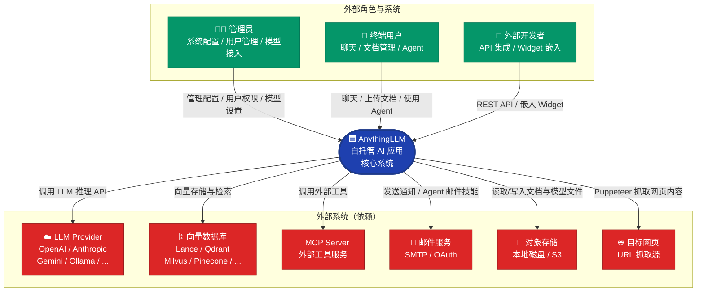
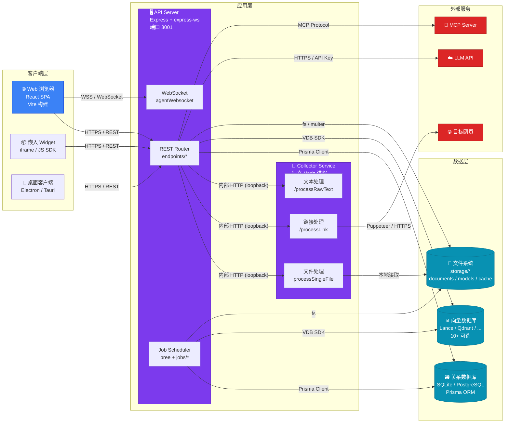
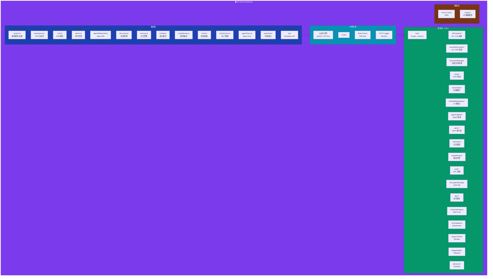
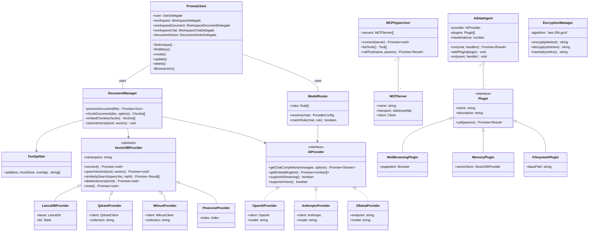

# 第 2 章 C4 架构模型

> **章节编号**: 02  
> **预计阅读时间**: 40 分钟  
> **方法论**: C4 Model（Context / Container / Component / Code）  
> **关联章节**: [上一章 01-项目概述](./01-项目概述.md) | [下一章 03-系统流程与时序图](./03-系统流程与时序图.md)

---

## 2.1 本章导读

C4 架构模型由 Simon Brown 提出，通过 **四个抽象层级**（Context、Container、Component、Code）自顶向下地描述软件系统。每个层级面向不同受众，缩放系统的不同粒度：

| 层级 | 问题 | 受众 | 粒度 |
|------|------|------|------|
| **L0 Context** | 系统是什么？谁用它？与什么外部系统交互？ | 非技术人员 + 技术人员 | 系统级 |
| **L1 Container** | 系统由哪些容器（进程/应用/数据库）组成？如何通信？ | 开发者 + 运维 | 进程级 |
| **L2 Component** | 每个容器内部由哪些组件组成？组件间如何协作？ | 开发者 | 模块级 |
| **L3 Code** | 每个组件由哪些类/接口/函数构成？ | 开发者 | 代码级 |

> **说明**: 标准 C4 模型使用 `C4Context`、`C4Container`、`C4Component` 等专用图表类型。Mermaid 原生不直接支持 C4，因此本章使用 Mermaid 的 `flowchart`、`graph`、`classDiagram` 等通用语法等效表达 C4 各层级，并通过节点形状、分组、样式模拟 C4 的视觉语义。

---

## 2.2 L0 — Context 图（系统上下文）

### 2.2.1 Mermaid 图表



### 2.2.2 详细解释（≥400 字）

#### 系统边界与定位

Context 图的首要任务是界定 **系统边界**。AnythingLLM 被定义为一个 **自托管 AI 应用系统**，其边界是虚线框内的所有功能。边界之外的一切（LLM Provider、向量数据库、MCP Server、外部网页）均为 **外部系统**，AnythingLLM 通过标准化的 API 协议与之交互，但不拥有或控制它们。

#### 外部角色（ Actors）

AnythingLLM 定义了 **三类外部角色**：

1. **管理员（Admin）**：拥有系统最高权限，负责全局配置（LLM Provider 密钥、向量数据库连接、系统设置）、用户管理（创建/暂停/删除用户）、模型路由规则配置、安全策略设定。管理员通过前端 Admin 面板（`frontend/src/pages/Admin/`）与系统交互。

2. **终端用户（User）**：系统的核心使用者，通过前端 SPA 完成以下操作：
   - 创建/加入工作空间（Workspace）
   - 上传文档（拖拽 / 热目录 / URL）
   - 与文档进行 RAG 对话
   - 使用 Agent 执行复杂任务（网页浏览、文件操作、代码执行）
   - 管理个人记忆

3. **外部开发者（ExtDev）**：通过 Developer API（`/api/developer/*`）或可嵌入聊天组件（Embed Chat Widget）将 AnythingLLM 能力集成到自有产品中。外部开发者使用 API Key 认证，受速率限制与白名单域名约束。

#### 外部系统（External Systems）

AnythingLLM 依赖 **六类外部系统**，每一类都是可替换的（这是其架构的核心优势）：

1. **LLM Provider**：AnythingLLM 支持 40+ LLM 提供商，包括商业 API（OpenAI、Anthropic、Google Gemini、Azure OpenAI、AWS Bedrock）和自托管方案（Ollama、LM Studio、LocalAI、KoboldCPP）。Provider 选择由管理员在系统设置中配置，或由模型路由规则动态决定。

2. **向量数据库（Vector DB）**：用于存储文档嵌入（Embedding）并提供语义相似度检索。AnythingLLM 支持 10+ 向量数据库，从嵌入式（LanceDB）到云服务（Pinecone、Weaviate、Astra DB）。向量数据库是 RAG 管线的核心依赖。

3. **MCP Server**：Model Context Protocol 服务器，AnythingLLM 作为 MCP 客户端连接外部工具服务（如数据库、文件系统、第三方 API）。MCP 服务器由管理员在 MCP Server 管理界面配置。

4. **邮件服务**：用于 Agent 的邮件技能（Gmail / Outlook）和密码恢复通知。通过 OAuth 2.0 或 SMTP 配置。

5. **对象存储**：默认使用本地磁盘（`server/storage/`），可配置为 S3 兼容存储。存储原始文档、向量缓存、用户头像、模型文件。

6. **目标网页**：当用户提交 URL 作为文档源时，Collector 使用 Puppeteer 抓取网页内容。

#### 设计 Rationale

Context 图的设计遵循以下原则：

- **黑盒视角**：将 AnythingLLM 视为一个黑盒，只展示输入（用户请求）和输出（AI 响应、文档、Agent 结果），不暴露内部实现。
- **可替换性标注**：外部系统使用红色标注，强调它们是可替换的依赖，而非系统的一部分。这是 AnythingLLM「无厂商锁定」价值主张的架构体现。
- **协议透明**：图中标注了交互方式（REST API、向量存储协议、Puppeteer 抓取），使运维团队能快速理解网络拓扑与防火墙规则需求。

---

## 2.3 L1 — Container 图（容器视图）

### 2.3.1 Mermaid 图表



### 2.3.2 详细解释（≥400 字）

#### 容器定义

在 C4 模型中，「容器」是可独立部署/运行的单元（进程、应用、数据库）。AnythingLLM 系统由 **6 个容器** 组成：

1. **Web 浏览器（React SPA）**：前端单页应用，Vite 开发服务器或构建后的静态资源。运行在用户浏览器中，通过 HTTPS 与 API Server 通信，通过 WSS 接收 Agent 实时消息。

2. **嵌入 Widget**：可嵌入第三方网站的聊天组件，通过 `<iframe>` 或 JS SDK 加载。与 SPA 共享同一 API Server，但会话隔离（独立的 embed_chat 会话）。

3. **桌面客户端**（可选）：基于 Electron 或 Tauri 的桌面封装，提供原生体验。

4. **API Server（Express）**：后端核心，承载所有 REST 端点、WebSocket 服务、Job 调度器。监听端口 3001，是整个系统的「大脑」。

5. **Collector Service（文档采集器）**：独立的 Node.js 进程，负责文档解析、网页抓取、音频转写、OCR。与 API Server 通过内部 HTTP（loopback）通信。

6. **数据存储**：
   - **关系数据库**（SQLite / PostgreSQL）：存储用户、工作空间、配置、聊天历史等结构化数据。
   - **向量数据库**（10+ 可选）：存储文档嵌入，提供语义检索。
   - **文件系统**（`server/storage/`）：存储原始文档、向量缓存、用户头像、模型文件。

#### 通信协议

容器间的通信协议是 Container 图的关键信息：

| 通信路径 | 协议 | 说明 |
|---------|------|------|
| 浏览器 ↔ API Server | HTTPS (REST) / WSS | 标准 Web 协议 |
| API Server ↔ Collector | HTTP (loopback) | 本地回环，安全且低延迟 |
| API Server ↔ 关系数据库 | Prisma Client (TCP/Socket) | ORM 层封装 |
| API Server ↔ 向量数据库 | 各 VDB SDK (HTTP/gRPC) | 取决于具体 Provider |
| API Server ↔ LLM API | HTTPS (REST + SSE) | 流式响应使用 Server-Sent Events |
| Collector ↔ 目标网页 | Puppeteer (Headless Chrome) | 网页渲染与抓取 |
| API Server ↔ MCP Server | MCP Protocol (stdio/SSE/HTTP) | 取决于 MCP Server 传输方式 |

#### 进程拓扑

生产部署时的进程拓扑：

```
                    ┌─────────────────────────────────────┐
                    │           Nginx / Load Balancer      │
                    └──────────────┬──────────────────────┘
                                   │
              ┌────────────────────┼────────────────────┐
              │                    │                     │
     ┌────────▼────────┐  ┌───────▼────────┐   ┌───────▼────────┐
     │  API Server #1  │  │ API Server #2  │   │ API Server #N  │
     │  (Express)      │  │                │   │                │
     └────────┬────────┘  └───────┬────────┘   └───────┬────────┘
              │                    │                     │
     ┌────────▼────────┐  ┌───────▼────────┐   ┌───────▼────────┐
     │ Collector #1    │  │ Collector #2   │   │ Collector #N   │
     └────────┬────────┘  └───────┬────────┘   └───────┬────────┘
              │                    │                     │
     ┌────────▼────────────────────▼─────────────────────▼────────┐
     │         共享存储层（PG / Vector DB / S3 / 文件）             │
     └─────────────────────────────────────────────────────────────┘
```

#### 设计 Rationale

1. **Collector 独立进程**：文档处理（尤其是 OCR、Puppeteer、大文件解析）是 CPU/内存密集型操作。将其隔离到独立进程，避免阻塞 API Server 的事件循环，保证聊天响应的低延迟。

2. **内部 HTTP 通信**：API Server 与 Collector 之间使用 HTTP 而非进程内调用，原因有三：
   - **故障隔离**：Collector 崩溃不影响 API Server。
   - **独立扩展**：可部署多个 Collector 实例。
   - **语言无关性**：未来可用其他语言重写 Collector。

3. **存储分层**：关系数据库存储结构化元数据，向量数据库存储嵌入向量，文件系统存储原始文档。三者各司其职，避免单一存储的性能瓶颈。

---

## 2.4 L2 — Component 图（组件视图）

### 2.4.1 Mermaid 图表

本节以 **API Server 容器** 为焦点，展开其内部组件结构。



### 2.4.2 详细解释（≥400 字）

#### 四层组件结构

API Server 内部采用 **四层组件结构**，自顶向下依次为：

##### 1. 路由层（Router Layer）

路由层是系统的入口，由 `server/endpoints/` 下的 ~20 个端点文件组成。每个文件对应一个业务域，通过 Express Router 注册路由。关键端点包括：

- `system.js`：系统级操作（健康检查、设置读写、版本信息、遥测开关）
- `workspaces.js`：工作空间 CRUD、成员管理、文档列表
- `chat.js`：核心聊天端点（RAG 检索 + LLM 调用 + SSE 流式）
- `admin.js`：管理员操作（用户 CRUD、系统统计、全局设置）
- `agentWebsocket.js`：Agent WebSocket 端点（双向实时通信）
- `document.js`：文档上传、删除、元数据更新
- `memory.js`：记忆 CRUD、自动提取触发
- `embed.js`：嵌入聊天端点（公开访问，会话隔离）
- `modelRouter.js`：模型路由规则 CRUD
- `mcpServers.js`：MCP Server 管理（增删改查、工具发现）

路由层负责 **HTTP 协议适配**（请求解析、响应序列化、状态码设定），不包含业务逻辑，仅委托给服务层。

##### 2. 中间件层（Middleware Layer）

中间件层是请求处理的管道，按顺序执行：

1. **CORS 中间件**（`cors({ origin: true })`）：允许跨域（生产环境应配置白名单）。
2. **Body Parser**（`bodyParser.text/json/urlencoded`，limit: 3GB）：解析请求体，支持大文件上传。
3. **认证中间件**（`server/utils/middleware/*`）：验证 Session Cookie 或 API Key，注入 `req.user`。
4. **HTTP Logger**（`middleware/httpLogger.js`，仅开发模式）：记录请求/响应日志。
5. **graceful 中间件**（`@ladjs/graceful`）：优雅关闭信号处理。

##### 3. 服务层（Service Layer）

服务层是系统的 **业务核心**，包含 ~30 个服务模块：

- **Auth 服务**：bcrypt 密码验证、Session 管理、API Key 校验、邀请码验证。
- **DocumentManager**：文档生命周期管理（上传 → 分块 → 嵌入 → 入库 → 检索 → 删除）。
- **chats/***：RAG 管线核心（上下文组装、向量检索、LLM 调用、流式响应、聊天历史持久化）。
- **AiProviders/***：40+ LLM Provider 适配器，统一接口（`getChatCompletion`、`getEmbedding`、流式适配）。
- **vectorDbProviders/***：10+ 向量数据库适配器，统一接口（`upsert`、`similaritySearch`、`deleteVectors`）。
- **EmbeddingEngines/***：12 种嵌入引擎适配器（OpenAI、本地模型、Ollama 等）。
- **agents/aibitat/***：自研 Agent 框架（函数调用循环、插件系统、多 Provider 支持）。
- **MCP/***：MCP 客户端与 Hypervisor（Server 管理、工具发现、调用代理）。
- **memories/***：记忆提取、存储、检索、注入。
- **modelRouter/***：模型路由规则引擎（规则匹配、Provider 选择、回退策略）。
- **jobs/***：后台任务（嵌入 worker、记忆提取、文档同步、定时任务执行）。

##### 4. 数据层（Data Layer）

数据层封装所有持久化操作：

- **Prisma Client**：类型安全的数据库访问，自动生成查询构建器。
- **models/***：35 个数据模型封装（每个模型一个文件），封装 CRUD 操作与业务规则。

#### 组件间依赖规则

组件间依赖遵循 **单向向下** 原则：
- 路由层 → 中间件层 → 服务层 → 数据层
- 服务层内部可相互依赖（如 ChatSvc 依赖 VecStore 和 Providers）
- 数据层不依赖任何上层组件

#### 设计 Rationale

1. **分层隔离**：每层只与相邻下层通信，降低耦合，便于独立测试与替换。
2. **服务层内聚**：相关业务逻辑聚合到同一服务模块（如所有向量操作在 `vectorDbProviders/`），遵循高内聚原则。
3. **Provider 插件化**：服务层通过接口与 Provider 解耦，新增 Provider 不影响现有代码（开闭原则）。
4. **端点按域拆分**：路由层按业务域拆分为多个文件，避免单文件过大，便于团队协作。

---

## 2.5 L3 — Code 图（代码/类视图）

### 2.5.1 Mermaid 图表

本节聚焦 **核心抽象接口与关键类** 的静态结构。



### 2.5.2 详细解释（≥400 字）

#### 核心抽象接口

Code 图展示了 AnythingLLM 系统的 **核心抽象接口** 及其实现类。这些抽象是系统可扩展性的基石。

##### 1. VectorDBProvider（向量数据库抽象）

`VectorDBProvider` 是向量数据库的抽象基类（定义于 `server/utils/vectorDbProviders/base.js`），声明了所有向量数据库必须实现的统一接口：

- `connect()`：建立数据库连接
- `upsertVector(docId, vectors)`：批量插入/更新向量
- `similaritySearch(queryVec, topN)`：语义相似度检索
- `deleteVectors(docId)`：删除指定文档的所有向量
- `reset()`：清空当前命名空间

当前实现了 **10+ 具体 Provider**：LanceDBProvider、QdrantProvider、MilvusProvider、PineconeProvider、WeaviateProvider、ChromaProvider、AstraProvider、PGVectorProvider、ZillizProvider、ChromaCloudProvider。

**设计模式**：策略模式（Strategy Pattern）。上层代码（如 `DocumentManager`）依赖抽象 `VectorDBProvider`，运行时注入具体实现，实现运行时多态。

##### 2. AIProvider（LLM 提供者接口）

`AIProvider` 定义了所有 LLM 提供者必须实现的能力契约：

- `getChatCompletion(messages, options)`：获取聊天完成（支持流式）
- `getEmbedding(text)`：获取文本嵌入
- `supportsStreaming()`：是否支持流式输出
- `supportsVision()`：是否支持多模态输入

当前实现了 **40+ 具体 Provider**，覆盖所有主流 LLM 服务。

**设计模式**：桥接模式（Bridge Pattern）。将抽象（聊天能力）与实现（各 Provider SDK）解耦，使两者可独立变化。

##### 3. AibitatAgent（Agent 框架核心类）

`AibitatAgent` 是自研 Agent 框架的核心类（`server/utils/agents/aibitat/index.js`），实现了 **ReAct（Reason + Act）** 循环：

- `run(chat, handlers)`：启动 Agent 执行循环
- `addPlugin(plugin)`：注册工具插件
- `on(event, handler)`：注册事件监听器（用于 WebSocket 实时推送）

Agent 通过组合多个 `Plugin` 实例获得工具能力，每个 Plugin 实现 `Plugin` 接口（`name`、`description`、`call`）。

**设计模式**：观察者模式（事件推送）+ 组合模式（插件聚合）+ 模板方法（执行循环骨架）。

##### 4. MCPHypervisor（MCP 管理调度器）

`MCPHypervisor` 负责管理多个 `MCPServer` 实例，提供统一的工具发现与调用入口：

- `connect(server)`：连接到 MCP Server
- `listTools()`：聚合所有 Server 的工具列表
- `callTool(name, params)`：路由到对应 Server 执行工具调用

**设计模式**：外观模式（Facade Pattern），为多个 MCP Server 提供统一入口。

##### 5. DocumentManager（文档管理器）

`DocumentManager` 封装文档处理管线，组合使用 `TextSplitter`、`VectorDBProvider`、`AIProvider`：

- `processDocument(file)`：协调整个文档处理流程
- `chunkDocument(doc, options)`：委托 `TextSplitter` 分块
- `embedChunks(chunks)`：委托 Embedding 引擎生成向量
- `storeVectors(docId, vectors)`：委托向量数据库存储

**设计模式**：外观模式（Facade），封装复杂的多步骤管线。

##### 6. EncryptionManager（加密管理器）

`EncryptionManager` 使用 **AES-256-GCM** 算法提供端到端加密，保护 API Key、MCP 凭证等敏感数据。使用 `comKey`（Communication Key）作为加密密钥的派生源。

#### 设计 Rationale

1. **面向接口编程**：核心抽象（`VectorDBProvider`、`AIProvider`、`Plugin`）定义契约，具体实现可替换。这是系统「无厂商锁定」的技术基础。
2. **组合优于继承**：`AibitatAgent` 通过组合 `Plugin` 获得能力，`DocumentManager` 组合 `TextSplitter` + `VectorDBProvider`，避免深层继承树。
3. **单一职责**：每个类只有一个变更理由（如 `EncryptionManager` 只负责加密，`ModelRouter` 只负责路由）。
4. **依赖注入**：上层类通过构造函数或方法注入依赖（如 `DocumentManager` 注入 `VectorDBProvider`），便于测试时 mock。

---

## 2.6 C4 模型总结

| 层级 | 核心关注点 | AnythingLLM 的关键设计 |
|------|----------|----------------------|
| **L0 Context** | 系统边界与外部交互 | 三类角色（管理员/用户/开发者）+ 六类外部系统（LLM/VDB/MCP/邮件/存储/网页） |
| **L1 Container** | 进程拓扑与通信 | 三进程（SPA/Server/Collector）+ 三层存储（RDBMS/VDB/FS），内部 HTTP 通信 |
| **L2 Component** | 模块划分与依赖 | 四层结构（路由/中间件/服务/数据），Provider 插件化 |
| **L3 Code** | 类与接口设计 | 核心抽象（VectorDBProvider、AIProvider、Plugin）+ 设计模式（策略/桥接/外观/组合） |

C4 模型的价值在于：**为同一系统提供多粒度、多视角的描述**。架构师关注 L0/L1（系统边界与部署拓扑），开发者关注 L2/L3（模块划分与代码结构）。本章的四张图共同构成了 AnythingLLM 的「架构全景图」，后续章节将在此基础上深入流程、代码与数据。

---

**上一章 ← [01-项目概述](./01-项目概述.md)** | **下一章 → [03-系统流程与时序图](./03-系统流程与时序图.md)**

---

☕️ 制作不易，请我喝咖啡☕️关注我➕

