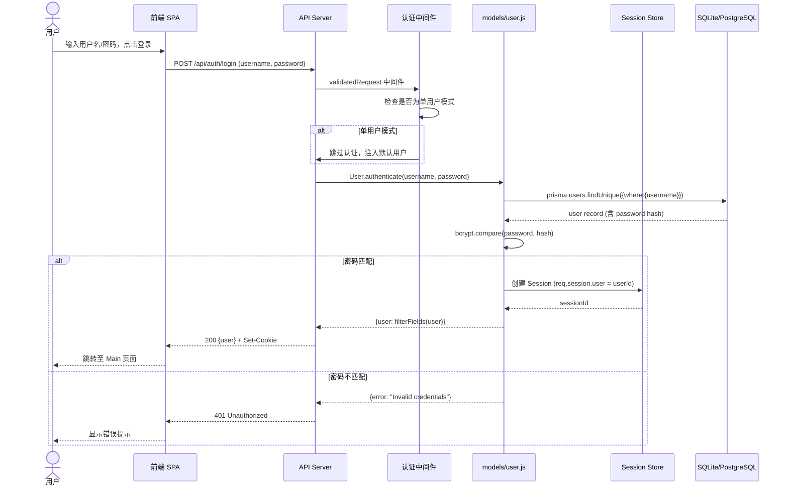
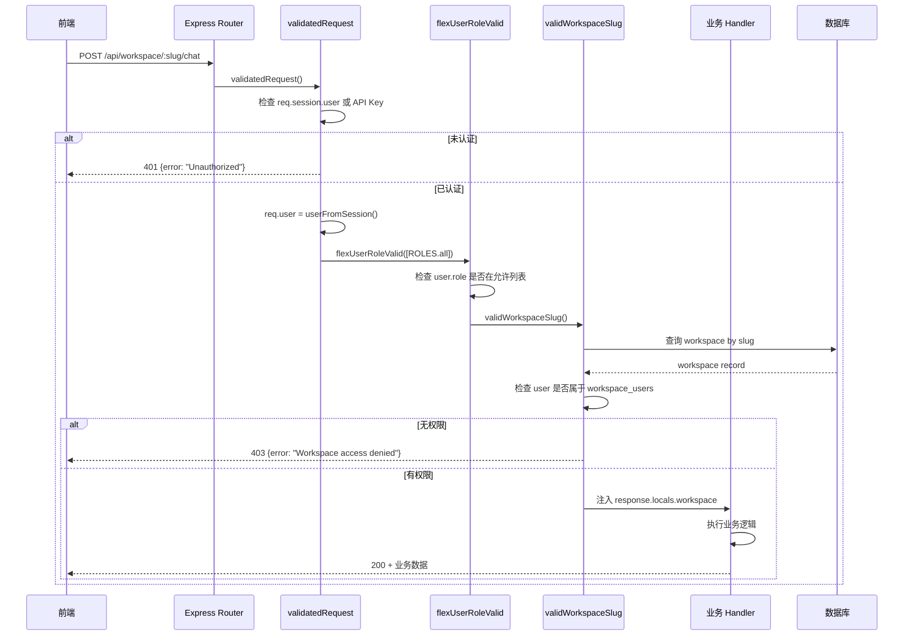
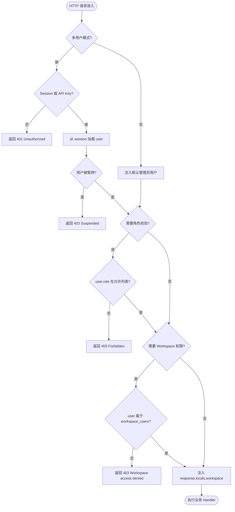

# 03-01 用户认证与多租户流程

> **所属章节**: [03-系统流程与时序图](./03-系统流程与时序图.md)  
> **流程类型**: 用户注册、登录、Session 验证、角色权限检查、邀请码机制  
> **核心文件**: `server/models/user.js`、`server/endpoints/admin.js`、`server/utils/middleware/multiUserProtected.js`、`server/utils/middleware/validatedRequest.js`、`server/models/workspaceUsers.js`、`server/models/invite.js`

---

## 1. 流程概述

AnythingLLM 的多用户系统是其区别于其他自托管 LLM 应用的核心特性之一。该系统支持两种运行模式：
- **单用户模式**（默认）：无需登录，所有操作以默认管理员身份执行。
- **多用户模式**（Docker 部署默认启用）：需登录，支持角色（admin / manager / default）与 Workspace 级权限隔离。

认证采用 **Session Cookie**（基于 Express Session）+ **bcrypt 密码哈希**，API 访问支持 **API Key** 认证。

---

## 2. 时序图 — 登录流程（L1）

---

## 3. 时序图 — 请求鉴权流程（L2）

---

## 4. 流程图 — 多租户权限模型（L3）

---

## 5. 详细步骤说明

### 5.1 登录流程步骤

1. **前端发起登录**：用户在 `frontend/src/pages/Login/` 页面输入凭据，前端 `models/system.js` 的 `login()` 函数发送 `POST /api/auth/login` 请求。

2. **中间件链执行**：请求经过 `validatedRequest` 中间件（`server/utils/middleware/validatedRequest.js`），该中间件检查 Session Cookie 或 `Authorization: Bearer <API Key>` 头。

3. **单用户模式短路**：若环境变量 `MULTI_USER_MODE !== "true"`，`validatedRequest` 直接注入默认管理员用户（`username: "anything-llm"`），跳过登录校验。

4. **密码验证**：`User.authenticate()` 函数从数据库查询用户记录，使用 `bcrypt.compare()` 比对密码哈希。

5. **Session 创建**：验证通过后，Express Session 在服务端创建会话，返回 `Set-Cookie: connect.sid=...`。

6. **用户信息返回**：`User.filterFields()` 移除敏感字段（`password`、`web_push_subscription_config`），返回安全的用户对象。

### 5.2 角色体系

| 角色 | 权限范围 | 常量定义 |
|------|---------|---------|
| `admin` | 全局管理（用户 CRUD、系统设置、所有 Workspace） | `ROLES.admin` |
| `manager` | 管理自己创建的 Workspace、邀请用户 | `ROLES.manager` |
| `default` | 仅访问被授权的 Workspace | `ROLES.all`（所有角色） |

`flexUserRoleValid(roles)` 中间件根据路由声明的允许角色列表进行校验。

### 5.3 邀请码机制

- 管理员通过 `POST /api/admin/invites` 创建邀请码（`models/invite.js`）。
- 邀请码可绑定特定 Workspace ID 列表。
- 用户通过 `POST /api/auth/invite` 使用邀请码注册，自动加入绑定的 Workspace。

### 5.4 每日消息限制

- 管理员可为每个用户设置 `dailyMessageLimit`。
- `User.canSendChat(user)` 检查过去 24 小时内的聊天数是否超限。
- 超限后返回错误：`"You have met your maximum 24 hour chat quota"`。

---

## 6. 涉及文件与函数索引

| 文件 | 关键函数/方法 | 职责 |
|------|-------------|------|
| `server/models/user.js` | `User.authenticate()`、`User.create()`、`User.canSendChat()`、`User.filterFields()` | 用户 CRUD、认证、字段过滤 |
| `server/models/workspaceUsers.js` | `WorkspaceUser.add()`、`WorkspaceUser.roleForUser()` | Workspace-用户关联 |
| `server/models/invite.js` | `Invite.create()`、`Invite.claim()`、`Invite.validInvite()` | 邀请码生命周期 |
| `server/utils/middleware/validatedRequest.js` | `validatedRequest()` | Session/API Key 认证 |
| `server/utils/middleware/multiUserProtected.js` | `flexUserRoleValid(roles)`、`isSingleUserMode()` | 角色权限检查 |
| `server/utils/middleware/validWorkspace.js` | `validWorkspaceSlug()`、`validWorkspaceAndThreadSlug()` | Workspace 存在性与权限校验 |
| `server/endpoints/admin.js` | `adminEndpoints()` | 管理员端点（用户 CRUD、邀请管理） |
| `server/utils/http.js` | `userFromSession()`、`multiUserMode()` | 会话解析、模式检测 |

---

## 7. 异常处理

| 异常场景 | 处理方式 | 返回状态码 |
|---------|---------|----------|
| 用户名不存在 | `User.authenticate()` 返回 `{ user: null, error }` | 401 |
| 密码错误 | `bcrypt.compare()` 返回 false | 401 |
| 用户被暂停 | `suspended === 1` 时拒绝 | 403 |
| Session 过期 | `validatedRequest` 检测不到 user | 401 |
| API Key 无效 | 数据库无匹配 `api_keys` 记录 | 401 |
| 角色不匹配 | `flexUserRoleValid` 拒绝 | 403 |
| Workspace 无权限 | `validWorkspaceSlug` 拒绝 | 403 |
| 每日消息超限 | `User.canSendChat()` 返回 false | 400（聊天端点） |

---

**返回 → [03-系统流程与时序图.md](./03-系统流程与时序图.md)** | **下一子文件 → [03-02-文档上传与向量化流程.md](./03-02-文档上传与向量化流程.md)**

---

# ❤️ 制作不易，请我喝咖啡☕️关注我➕

