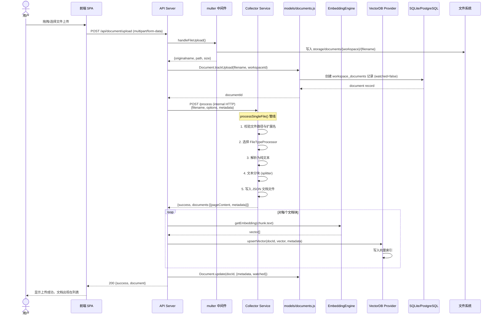

# 03-02 文档上传与向量化流程

> **所属章节**: [03-系统流程与时序图](./03-系统流程与时序图.md)  
> **流程类型**: 文档上传、格式解析、文本分块、嵌入生成、向量入库  
> **核心文件**: `collector/processSingleFile/index.js`、`collector/utils/constants.js`、`server/models/documents.js`、`server/utils/DocumentManager/index.js`、`server/utils/collectorApi/index.js`、`server/utils/TextSplitter/*`、`server/utils/EmbeddingEngines/*`、`server/utils/vectorDbProviders/*`

---

## 1. 流程概述

文档上传与向量化是 AnythingLLM 的 **核心数据管线**，将用户上传的原始文档（PDF、DOCX、XLSX、HTML、TXT、Markdown、音频等）转化为可语义检索的向量集合。整个流程涉及 **前端上传 → 后端暂存 → Collector 解析 → 文本分块 → 嵌入生成 → 向量入库** 六个阶段。

---

## 2. 时序图 — 文档上传端到端流程（L1）



---

## 3. 流程图 — Collector 单文件处理管线（L3）

```mermaid
flowchart TD
    Start([processSingleFile 入口]) --> Normalize[normalizePath 路径规范化]
    Normalize --> CheckReserved{是保留文件名<br/>__HOTDIR__.md?}
    CheckReserved -- 是 --> Reject1[拒绝: reserved filename]
    CheckReserved -- 否 --> CheckExist{文件是否存在?}
    CheckExist -- 否 --> Reject2[拒绝: file does not exist]
    CheckExist -- 是 --> CheckExt{有文件扩展名?}
    CheckExt -- 否 --> Reject3[拒绝: no extension]
    CheckExt -- 是 --> LookupConv{扩展名在<br/>SUPPORTED_FILETYPE_CONVERTERS?}
    LookupConv -- 否 --> IsText{是文本类型?}
    IsText -- 是 --> ProcessTxt[按 .txt 处理]
    IsText -- 否 --> TrashFile[删除文件]
    TrashFile --> Reject4[拒绝: unsupported extension]
    LookupConv -- 是 --> LoadProcessor[加载对应 FileTypeProcessor]
    ProcessTxt --> LoadProcessor
    LoadProcessor --> Convert[转换为纯文本]
    Convert --> Split[文本分块]
    Split --> WriteJSON[写入 storage/documents/*.json]
    WriteJSON --> Return([返回 {success, documents}])
```

---

## 4. 详细步骤说明

### 4.1 前端上传阶段

1. **文件选择**：用户在 `frontend/src/components/` 的上传区域（`react-dropzone`）拖拽或选择文件。
2. **分块上传**：前端使用 `FormData` 封装文件，通过 `POST /api/document/upload` 发送。
3. **进度反馈**：前端监听 `XMLHttpRequest.upload.onprogress` 事件，显示上传进度条。

### 4.2 后端暂存阶段

1. **multer 处理**：`server/utils/files/multer.js` 的 `handleFileUpload()` 配置 multer，将文件写入 `server/storage/documents/{workspaceSlug}/`。
2. **文档记录创建**：`Document.trackUpload()` 在 `workspace_documents` 表创建记录，状态为 `watched=false`（非热目录监听）。
3. **调用 Collector**：`CollectorApi.processSingleFile()` 通过内部 HTTP（`http://0.0.0.0:8888/process`）调用 Collector 服务。

### 4.3 Collector 解析阶段

Collector 的 `processSingleFile()` 函数（`collector/processSingleFile/index.js`）执行以下步骤：

1. **路径校验**：`normalizePath()` + `isWithin()` 防止路径遍历攻击。
2. **保留文件检查**：拒绝处理 `__HOTDIR__.md`（热目录标记文件）。
3. **扩展名解析**：从 `SUPPORTED_FILETYPE_CONVERTERS`（`collector/utils/constants.js`）查找对应的处理器。
4. **处理器加载**：动态 `require()` 对应处理器模块。
5. **文档转换**：处理器将原始文件转换为纯文本 + 元数据。

**支持的文件类型与处理器映射**（部分）：

| 文件类型 | 处理器 | 依赖库 |
|---------|--------|-------|
| `.pdf` | `convert/pdf` | `@mintplex-labs/mdpdf`、`pdf-parse` |
| `.docx` | `convert/docx` | `docx`、`mammoth` |
| `.xlsx` / `.xls` | `convert/xlsx` | `node-xlsx`、`exceljs` |
| `.pptx` | `convert/pptx` | `pptxgenjs` |
| `.html` / `.htm` | `convert/html` | `html-to-text`、`node-html-parser` |
| `.txt` / `.md` / `.csv` | `convert/txt` | 原生读取 |
| `.epub` | `convert/epub` | `epub2` |
| `.mbox` | `convert/mbox` | `mbox-parser` |
| 音频文件 | `convertAudioToWav` + Whisper | 音频转写 |

### 4.4 文本分块阶段

Collector 内部使用 `splitter`（基于 LangChain 的 `RecursiveCharacterTextSplitter` 或自定义分块器）将长文本分割为小块：

- **默认块大小**：~1000-2000 字符（取决于配置）
- **块重叠**：~200 字符（保证上下文连续性）
- **分块策略**：优先按段落/换行符分割，其次按句子，最后按字符

每个分块生成一个 JSON 文件，存储在 `server/storage/documents/` 下，格式为：
```json
{
  "pageContent": "...",
  "metadata": {
    "source": "anythingllm",
    "chunkSource": "localfile://path/to/file.pdf",
    "title": "file.pdf",
    "chunk": 1,
    "token_count_estimate": 256
  }
}
```

### 4.5 嵌入生成阶段

后端对每个分块调用 Embedding 引擎：

1. **引擎选择**：根据系统设置 `EMBEDDING_ENGINE` 选择对应引擎（`server/utils/EmbeddingEngines/`）。
2. **批量嵌入**：为提高效率，通常将多个分批发送给 Embedding API。
3. **本地嵌入**：若使用 `native` 引擎，通过 `@xenova/transformers` 在本地运行嵌入模型。

### 4.6 向量入库阶段

1. **向量存储**：`VectorDb.upsertVector(docId, vectors, metadata)` 将向量写入向量数据库。
2. **命名空间隔离**：每个 Workspace 使用独立的命名空间（`workspace.slug`），实现多租户向量隔离。
3. **元数据索引**：向量附带元数据（文档 ID、分块序号、来源路径），支持过滤检索。

---

## 5. 涉及文件与函数索引

| 文件 | 关键函数/方法 | 职责 |
|------|-------------|------|
| `collector/processSingleFile/index.js` | `processSingleFile()` | 单文件处理管线入口 |
| `collector/utils/constants.js` | `SUPPORTED_FILETYPE_CONVERTERS`、`ACCEPTED_MIMES` | 文件类型映射表 |
| `collector/utils/files/index.js` | `normalizePath()`、`isWithin()`、`isTextType()` | 文件工具函数 |
| `server/utils/collectorApi/index.js` | `CollectorApi.processSingleFile()` | 调用 Collector 的 HTTP 客户端 |
| `server/models/documents.js` | `Document.trackUpload()`、`Document.update()`、`Document.forWorkspace()` | 文档元数据 CRUD |
| `server/utils/DocumentManager/index.js` | `DocumentManager.pinnedDocs()` | 固定文档加载 |
| `server/utils/TextSplitter/*` | `TextSplitter.split()` | 文本分块 |
| `server/utils/EmbeddingEngines/*` | `getEmbedding()` | 嵌入生成 |
| `server/utils/vectorDbProviders/*` | `upsertVector()`、`similaritySearch()` | 向量存储与检索 |
| `server/utils/files/multer.js` | `handleFileUpload()` | 文件上传处理 |

---

## 6. 异常处理

| 异常场景 | 处理方式 | 影响 |
|---------|---------|------|
| 文件不存在 | Collector 返回 `{success: false, reason}` | 上传失败，前端显示错误 |
| 不支持的格式 | 尝试按文本解析，失败则拒绝 | 用户需转换格式后重试 |
| 文件过大 | multer 限制 3GB | 超过限制返回 413 |
| 路径遍历攻击 | `isWithin()` 校验拒绝 | 安全日志记录 |
| 嵌入 API 超时 | 重试机制（取决于 Provider） | 部分分块可能失败 |
| 向量库连接失败 | 抛出异常，回滚事务 | 文档元数据保留，需手动重试 |
| OCR 失败（扫描件） | 返回空文本或错误 | 用户需手动输入文本 |

---

## 7. 热目录监听（Hot Directory）

除手动上传外，AnythingLLM 还支持 **热目录监听**（`collector/hotdir/`）：

1. 用户将文件放入指定目录（`server/storage/documents/__hotdir__/`）。
2. Collector 定期扫描目录，检测到新文件后自动触发 `processSingleFile()`。
3. 处理完成后，文件被移动到工作空间目录或删除。
4. 热目录适用于批量导入场景（如监控网络共享文件夹）。

---

**返回 → [03-系统流程与时序图.md](./03-系统流程与时序图.md)** | **上一子文件 ← [03-01-用户认证与多租户流程.md](./03-01-用户认证与多租户流程.md)** | **下一子文件 → [03-03-聊天与RAG检索流程.md](./03-03-聊天与RAG检索流程.md)**

---

☕️ 制作不易，请我喝咖啡☕️关注我➕

