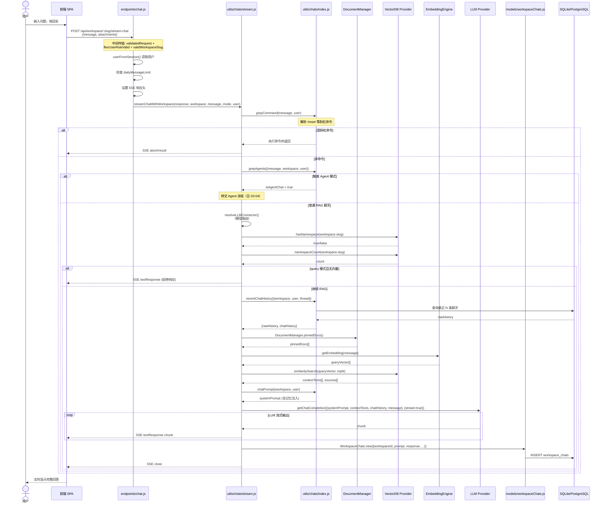
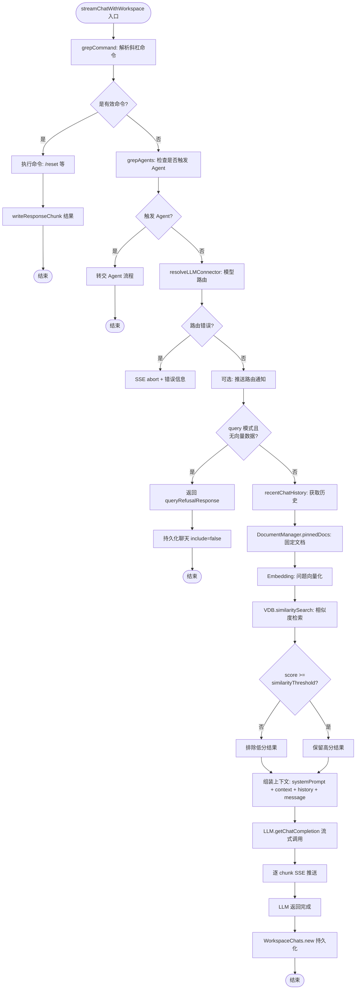

# 03-03 聊天与 RAG 检索流程

> **所属章节**: [03-系统流程与时序图](./03-系统流程与时序图.md)  
> **流程类型**: 用户提问、向量检索、上下文组装、LLM 调用、流式响应、聊天持久化  
> **核心文件**: `server/endpoints/chat.js`、`server/utils/chats/stream.js`、`server/utils/chats/index.js`、`server/utils/vectorDbProviders/*`、`server/utils/AiProviders/*`、`server/models/workspaceChats.js`、`server/utils/DocumentManager/index.js`

---

## 1. 流程概述

聊天与 RAG 检索是 AnythingLLM 的 **核心交互流程**。当用户在工作空间内发送消息时，系统执行以下步骤：

1. **消息预处理**：斜杠命令解析、Agent 路由判断
2. **模型路由**：根据规则选择最优 LLM Provider
3. **向量检索**：将用户问题嵌入后在向量库中检索相关文档块
4. **上下文组装**：将检索结果、聊天历史、系统提示、记忆、固定文档组装为 LLM 输入
5. **LLM 调用**：调用选定 Provider 的聊天完成 API
6. **流式响应**：通过 SSE 将 LLM 输出实时推送到前端
7. **聊天持久化**：将问答对存入 `workspace_chats` 表

---

## 2. 时序图 — RAG 聊天端到端流程（L1）



---

## 3. 流程图 — RAG 管线详细逻辑（L3）



---

## 4. 详细步骤说明

### 4.1 消息预处理阶段

1. **斜杠命令解析**（`grepCommand()`）：
   - 检查消息是否以 `/reset` 等内置命令开头。
   - 检查用户自定义的 Slash Command Presets（`slash_command_presets` 表），将命令替换为对应 Prompt。
   - 支持单条消息中多个命令（正则全局替换）。

2. **Agent 路由判断**（`grepAgents()`）：
   - 检查工作空间是否配置了 Agent Provider（`workspace.agentProvider`）。
   - 检查消息是否匹配 Agent 触发条件。
   - 若触发 Agent 模式，提前退出 RAG 流程，转交 Agent 系统处理（见 03-04）。

### 4.2 模型路由阶段

`resolveLLMConnector()` 函数（`server/utils/chats/stream.js` 内）执行模型路由：

1. 检查 Workspace 是否绑定模型路由规则（`workspace.router_id`）。
2. 若有规则，调用 `ModelRouterService.resolve()` 匹配最优 Provider。
3. 若无规则，使用 Workspace 的 `chatProvider` / `chatModel` 或系统默认 Provider。
4. 返回 `LLMConnector` 实例（已初始化的 Provider 适配器）。

### 4.3 向量检索阶段

1. **问题嵌入**：将用户问题通过 Embedding 引擎转换为向量。
2. **相似度检索**：`VectorDb.similaritySearch(queryVector, topN)` 在向量库中检索最相似的文档块。
   - `topN` 默认 4（`workspace.topN` 可配置）。
   - 返回结果包含 `pageContent`、`metadata`、`score`。
3. **阈值过滤**：`score >= workspace.similarityThreshold`（默认 0.25）的结果被保留。
4. **重排序（可选）**：若配置了 Reranker，对检索结果进行二次精排。

### 4.4 上下文组装阶段

`chatPrompt()` 函数（`server/utils/chats/index.js`）组装完整的 LLM 输入：

```
[System Prompt]
  └─ 工作空间自定义提示 (workspace.openAiPrompt)
  └─ 系统默认提示 (SystemSettings.saneDefaultSystemPrompt)
  └─ 记忆注入 (promptWithMemories)
  └─ 系统提示变量替换 (SystemPromptVariables)

[Context Sources]
  └─ 固定文档 (pinnedDocs)
  └─ 向量检索结果 (contextTexts)
  └─ 解析文件 (WorkspaceParsedFiles)

[Chat History]
  └─ 最近 N 轮对话 (workspace.openAiHistory, 默认 20)

[User Message]
  └─ 当前用户问题
```

### 4.5 LLM 调用与流式响应

1. **Provider 调用**：`LLMConnector.getChatCompletion(messages, { stream: true })` 调用具体 Provider 的 API。
2. **SSE 推送**：通过 `writeResponseChunk(response, chunk)` 将每个 Token 实时推送到前端。
   - `type: "textResponse"`：正常文本块
   - `type: "sources"`：引用来源
   - `type: "abort"`：错误终止
   - `type: "close"`：流结束
3. **引用来源**：检索到的文档块元数据作为 `sources` 随最终响应发送，前端显示引用链接。

### 4.6 聊天持久化阶段

`WorkspaceChats.new()` 将问答对存入数据库：

- `workspaceId`：关联工作空间
- `prompt`：用户问题
- `response`：LLM 完整回答（JSON 格式，含 sources、type）
- `user_id`：关联用户（多用户模式）
- `thread_id`：关联线程（可选）
- `include`：是否纳入聊天历史上下文（命令类消息设为 false）

---

## 5. 聊天模式（Chat Mode）

| 模式 | 行为 | 适用场景 |
|------|------|---------|
| `chat` | 始终聊天，即使无向量数据也调用 LLM | 通用对话 |
| `query` | 仅在有向量数据时回答，否则返回拒绝响应 | 纯文档问答 |
| `automatic`（默认） | 有向量时 RAG，无向量时回退到普通聊天 | 混合模式 |

---

## 6. 涉及文件与函数索引

| 文件 | 关键函数/方法 | 职责 |
|------|-------------|------|
| `server/endpoints/chat.js` | `chatEndpoints()`、`stream-chat` 路由 | 聊天端点注册 |
| `server/utils/chats/stream.js` | `streamChatWithWorkspace()` | RAG 管线主函数 |
| `server/utils/chats/index.js` | `grepCommand()`、`grepAgents()`、`chatPrompt()`、`recentChatHistory()` | 消息处理、提示组装 |
| `server/utils/chats/agents.js` | `grepAgents()` | Agent 路由判断 |
| `server/utils/DocumentManager/index.js` | `DocumentManager.pinnedDocs()` | 固定文档加载 |
| `server/utils/vectorDbProviders/*` | `similaritySearch()`、`hasNamespace()`、`namespaceCount()` | 向量检索 |
| `server/utils/EmbeddingEngines/*` | `getEmbedding()` | 嵌入生成 |
| `server/utils/AiProviders/*` | `getChatCompletion()` | LLM 调用 |
| `server/models/workspaceChats.js` | `WorkspaceChats.new()`、`WorkspaceChats.where()` | 聊天持久化 |
| `server/utils/helpers/chat/responses.js` | `writeResponseChunk()`、`convertToPromptHistory()` | SSE 推送、历史格式转换 |

---

## 7. 异常处理

| 异常场景 | 处理方式 | SSE 事件 |
|---------|---------|---------|
| 消息为空 | 返回 400 JSON 错误 | —（非 SSE） |
| 超过每日限额 | 检查 `dailyMessageLimit` | `abort` |
| 模型路由失败 | `resolveLLMConnector` 返回 error | `abort` |
| 向量库无数据（query 模式） | 返回 `queryRefusalResponse` | `textResponse` + `close` |
| LLM API 超时 | Provider SDK 抛出异常 | `abort` |
| LLM 返回错误 | 捕获异常 | `abort` |
| 流式写入失败 | `response.write()` 异常 | 静默关闭连接 |

---

**返回 → [03-系统流程与时序图.md](./03-系统流程与时序图.md)** | **上一子文件 ← [03-02-文档上传与向量化流程.md](./03-02-文档上传与向量化流程.md)** | **下一子文件 → [03-04-Agent执行流程.md](./03-04-Agent执行流程.md)**

---

# ❤️ 制作不易，请我喝咖啡☕️关注我➕

