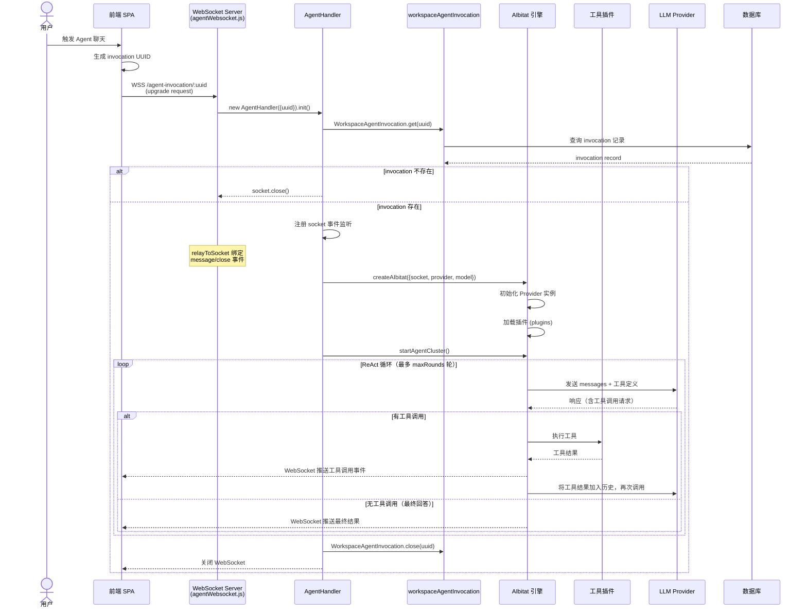

# 03-04 Agent 执行流程

> **所属章节**: [03-系统流程与时序图](./03-系统流程与时序图.md)  
> **流程类型**: Agent WebSocket 连接、aibitat 函数调用循环、插件调度、工具执行、实时推送  
> **核心文件**: `server/endpoints/agentWebsocket.js`、`server/utils/agents/index.js`、`server/utils/agents/ephemeral.js`、`server/utils/agents/aibitat/index.js`、`server/utils/agents/aibitat/plugins/*`、`server/models/workspaceAgentInvocation.js`

---

## 1. 流程概述

AnythingLLM 内置了一套 **自研 Agent 框架 —— aibitat**，实现了完整的 **ReAct（Reasoning + Acting）** 循环。Agent 系统允许 LLM 调用外部工具（网页浏览、文件操作、代码执行、SQL 查询、邮件收发、MCP 工具等）来完成复杂任务。

Agent 的执行通过 **WebSocket** 实现双向实时通信：
- **客户端 → 服务器**：用户消息、工具审批、反馈、中断命令
- **服务器 → 客户端**：思考过程、工具调用、中间结果、最终回答

---

## 2. 架构组件关系

```
┌─────────────────────────────────────────────────────────────┐
│                      Agent 系统架构                          │
├─────────────────────────────────────────────────────────────┤
│  endpoints/agentWebsocket.js  ← WebSocket 入口               │
│         │                                                    │
│         ▼                                                    │
│  utils/agents/index.js (AgentHandler) ← 会话管理器            │
│         │                                                    │
│         ├── EphemeralAgentHandler (一次性 Agent)              │
│         └── [SessionAgentHandler] (持久会话 Agent)            │
│         │                                                    │
│         ▼                                                    │
│  utils/agents/aibitat/index.js (AIbitat) ← 核心循环引擎       │
│         │                                                    │
│         ├── providers/* ← LLM Provider 适配                   │
│         ├── plugins/*  ← 工具插件（20+）                      │
│         ├── utils/*    ← 工具辅助（toolReranker 等）           │
│        └── EventEmitter ← 事件推送（→ WebSocket → 前端）       │
└─────────────────────────────────────────────────────────────┘
```

---

## 3. 时序图 — Agent WebSocket 执行流程（L1）



---

## 4. 流程图 — aibitat ReAct 循环（L3）

```mermaid
flowchart TD
    Start([startAgentCluster 入口]) --> AddSystemPrompt[添加 System Prompt]
    AddSystemPrompt --> AddHistory[添加聊天历史]
    AddHistory --> AddTools[注册工具定义给 LLM]
    AddTools --> LoopStart{轮次 < maxRounds?}
    LoopStart -- 否 --> MaxReached[返回: 达到最大轮次]
    LoopStart -- 是 --> CallLLM[LLM.chatComplete(messages, tools)]
    CallLLM --> ParseResp[解析 LLM 响应]
    ParseResp --> HasToolCall{包含工具调用?}
    HasToolCall -- 否 --> FinalAnswer[提取最终回答]
    FinalAnswer --> EmitFinal[emit: final]
    EmitFinal --> EndFinal([结束])
    HasToolCall -- 是 --> CheckLimit{工具调用次数<br/>< maxToolCalls?}
    CheckLimit -- 否 --> ToolLimit[返回: 达到工具调用上限]
    CheckLimit -- 是 --> ExecTool[执行工具插件]
    ExecTool --> ToolErr{工具执行出错?}
    ToolErr -- 是 --> AddError[将错误信息加入历史]
    AddError --> LoopNext[轮次 +1]
    ToolErr -- 否 --> AddResult[将工具结果加入历史]
    AddResult --> EmitTool[emit: toolResult]
    EmitTool --> LoopNext
    LoopNext --> LoopStart
```

---

## 5. 详细步骤说明

### 5.1 WebSocket 连接建立

1. **前端发起升级**：用户在前端触发 Agent 聊天时，前端生成一个 `invocation UUID`，并通过 `new WebSocket(`wss://host/agent-invocation/${uuid}`)` 发起 WebSocket 升级请求。

2. **AgentHandler 初始化**：`agentWebsocket.js` 的 `app.ws()` 回调创建 `AgentHandler` 实例并调用 `.init()`，从数据库加载 invocation 记录。

3. **事件绑定**：`relayToSocket` 函数绑定 `socket.on('message')` 和 `socket.on('close')`，处理用户输入（工具审批、反馈、中断命令）。

### 5.2 aibitat 实例创建

`createAIbitat()` 方法（`AgentHandler` 内）创建 aibitat 实例：

1. **Provider 初始化**：根据 Workspace 配置（`agentProvider` / `agentModel`）初始化对应 LLM Provider。
2. **插件加载**：根据系统设置与用户配置加载工具插件列表。默认插件包括：
   - `chat-history`：聊天历史访问
   - `memory`：记忆系统
   - `filesystem`：文件读写
   - `web-browsing`：网页浏览
   - `web-scraping`：网页抓取
   - `create-files`：文件创建
   - `rechart`：图表生成
   - `http-socket`：HTTP 请求
   - `gmail`：Gmail 邮件
   - `outlook`：Outlook 邮件
   - `google-calendar`：Google 日历
   - `sql-agent`：SQL 查询
   - `request-user-input`：用户输入请求
   - `cli`：命令行执行
   - `summarize`：内容摘要
   - `create-scheduled-job`：创建定时任务
   - `router-classifier`：工具智能选择

3. **工具注册**：每个插件的 `definition`（名称、描述、参数 Schema）注册到 aibitat 的工具映射表，发送给 LLM。

### 5.3 ReAct 执行循环

`startAgentCluster()` 启动主循环（`server/utils/agents/aibitat/index.js`）：

1. **System Prompt 注入**：包含 Agent 角色定义、可用工具列表、行为约束。
2. **用户消息加入历史**：将用户初始问题作为第一条用户消息。
3. **LLM 调用**：发送完整消息历史 + 工具定义给 LLM。
4. **响应解析**：
   - 若 LLM 返回纯文本（无工具调用），视为最终回答，退出循环。
   - 若 LLM 返回工具调用请求，提取工具名称与参数。
5. **工具执行**：调用对应插件的 `call()` 方法执行工具。
6. **结果反馈**：将工具执行结果作为 `tool` 角色消息加入历史。
7. **再次调用 LLM**：LLM 根据工具结果决定下一步操作（继续调用工具或给出最终回答）。
8. **循环终止条件**：
   - LLM 返回最终回答
   - 达到 `maxRounds`（默认 100）
   - 达到 `maxToolCalls`（默认 10，可通过 `AGENT_MAX_TOOL_CALLS` 环境变量调整）
   - 用户发送中断命令

### 5.4 实时事件推送

aibitat 通过 `EventEmitter` 向 WebSocket 推送实时事件：

| 事件类型 | 含义 | 前端响应 |
|---------|------|---------|
| `thinking` | LLM 正在思考 | 显示加载动画 |
| `toolCall` | 工具调用请求 | 显示工具调用卡片 |
| `toolResult` | 工具执行结果 | 更新工具卡片状态 |
| `final` | 最终回答 | 显示完整回答 |
| `error` | 执行错误 | 显示错误提示 |
| `abort` | 用户中断 | 终止显示 |

### 5.5 工具审批与用户交互

部分高风险工具（如 `create-files`、`cli`、`sql-agent`）支持 **工具审批机制**：
- Agent 发起工具调用前，通过 `request-user-input` 插件暂停执行，等待用户审批。
- 用户通过 WebSocket 发送审批结果（批准/拒绝）。
- `relayToSocket` 的 `handleToolApproval` 方法处理审批消息。

---

## 6. EphemeralAgentHandler vs SessionAgentHandler

| 特性 | EphemeralAgentHandler | SessionAgentHandler |
|------|----------------------|---------------------|
| 生命周期 | 单次执行，结束后销毁 | 持久会话，支持多轮交互 |
| 通信方式 | 无 WebSocket（或一次性） | WebSocket 双向通信 |
| 状态保持 | 无 | 保持聊天历史与工具状态 |
| 适用场景 | 定时任务、API 调用 | 用户交互式 Agent 聊天 |
| 文件 | `utils/agents/ephemeral.js` | `utils/agents/index.js` |

---

## 7. 涉及文件与函数索引

| 文件 | 关键函数/方法 | 职责 |
|------|-------------|------|
| `server/endpoints/agentWebsocket.js` | `agentWebsocket()`、`relayToSocket()` | WebSocket 入口与消息路由 |
| `server/utils/agents/index.js` | `AgentHandler` 类 | Agent 会话管理器 |
| `server/utils/agents/ephemeral.js` | `EphemeralAgentHandler` 类 | 一次性 Agent 执行器 |
| `server/utils/agents/aibitat/index.js` | `AIbitat` 类、`startAgentCluster()` | aibitat 核心引擎 |
| `server/utils/agents/aibitat/providers/index.js` | 40+ Provider 适配 | Agent 的 LLM 调用 |
| `server/utils/agents/aibitat/plugins/index.js` | 插件注册 | 插件加载与管理 |
| `server/utils/agents/aibitat/plugins/web-browsing.js` | `call()` | 网页浏览工具 |
| `server/utils/agents/aibitat/plugins/filesystem.js` | `call()` | 文件读写工具 |
| `server/utils/agents/aibitat/plugins/router-classifier.js` | `classify()` | 工具智能选择 |
| `server/models/workspaceAgentInvocation.js` | `WorkspaceAgentInvocation.create()`、`.close()` | Agent 调用记录 |
| `server/utils/agents/defaults.js` | `agentSkillsFromSystemSettings()` | 默认 Agent 技能加载 |

---

## 8. 异常处理

| 异常场景 | 处理方式 | 事件 |
|---------|---------|------|
| invocation 不存在 | WebSocket 直接关闭 | — |
| LLM 调用失败 | 重试或返回错误信息 | `error` |
| 工具执行超时 | 插件内部超时控制 | `error` |
| 工具不存在 | 返回 "Unknown tool" 错误 | 加入历史 |
| 达到最大轮次 | 强制退出循环 | `final`（带警告） |
| 用户中断 | `aibitat.abort()` 终止循环 | `abort` |
| WebSocket 断开 | `handleClose` 清理资源 | — |

---

**返回 → [03-系统流程与时序图.md](./03-系统流程与时序图.md)** | **上一子文件 ← [03-03-聊天与RAG检索流程.md](./03-03-聊天与RAG检索流程.md)** | **下一子文件 → [03-05-模型路由流程.md](./03-05-模型路由流程.md)**

---

☕️ 制作不易，请我喝咖啡☕️关注我➕

