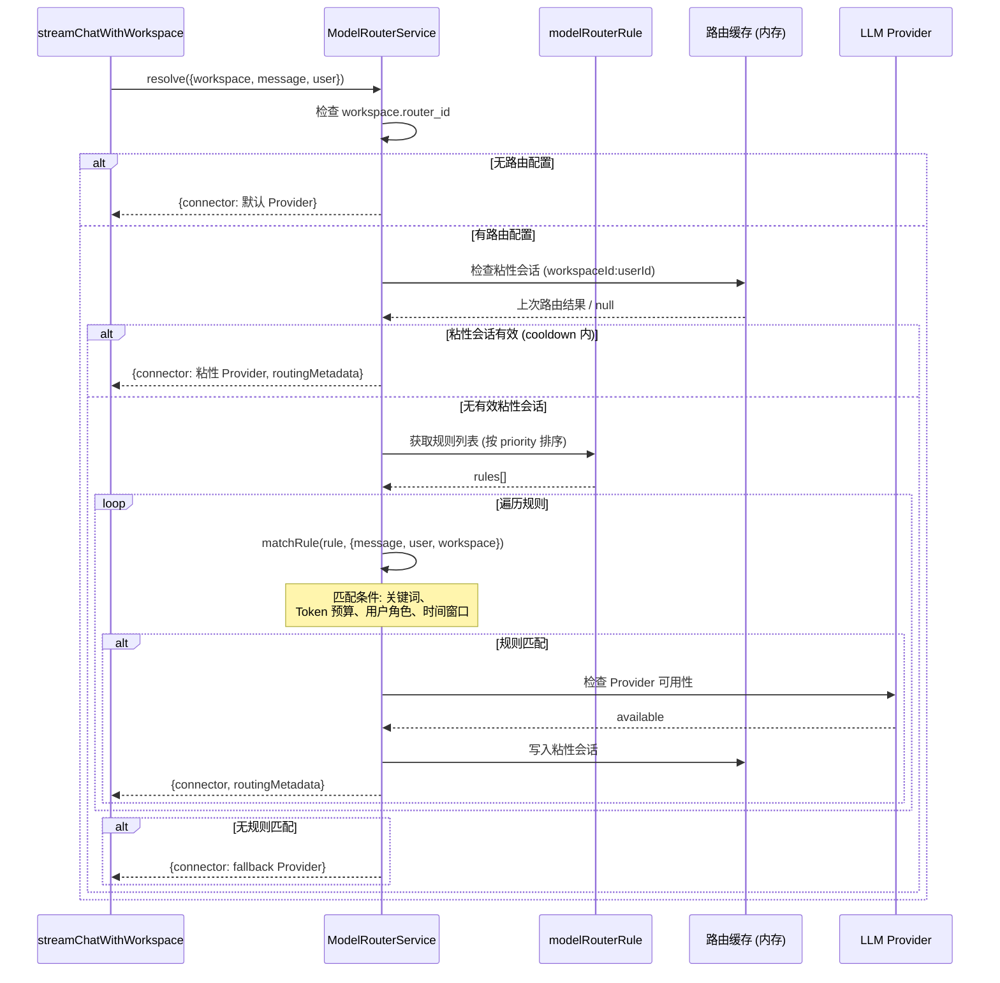

# 03-05 模型路由流程

> **所属章节**: [03-系统流程与时序图](./03-系统流程与时序图.md)  
> **流程类型**: 路由规则匹配、Provider 选择、回退策略、粘性会话  
> **核心文件**: `server/models/modelRouter.js`、`server/models/modelRouterRule.js`、`server/utils/AiProviders/modelRouter/index.js`、`server/utils/router/index.js`、`server/endpoints/modelRouter.js`

---

## 1. 流程概述

**动态模型路由（Dynamic Model Routing）** 是 AnythingLLM 的高级功能，允许管理员定义规则，将聊天请求自动分配到最优的 LLM Provider + 模型组合。这解决了以下问题：

- **成本优化**：简单问题用便宜模型，复杂问题用高端模型
- **性能优化**：低延迟模型处理实时交互，高能力模型处理深度推理
- **负载均衡**：多个 Provider 之间分配请求
- **故障转移**：主 Provider 不可用时自动回退

---

## 2. 流程图 — 模型路由决策引擎（L3）

```mermaid
flowchart TD
    Start([resolveLLMConnector 入口]) --> CheckRouter{workspace.router_id<br/>存在?}
    CheckRouter -- 否 --> UseWSProvider[使用 workspace.chatProvider<br/>+ 系统默认]
    CheckRouter -- 是 --> LoadRouter[加载 ModelRouter 配置]
    LoadRouter --> LoadRules[加载关联的 ModelRouterRule 列表]
    LoadRules --> CheckSticky{存在粘性会话?<br/>(cooldown 内)}
    CheckSticky -- 是 --> UseSticky[使用上次路由结果<br/>(粘性 Provider)]
    CheckSticky -- 否 --> SortRules[按优先级排序规则]
    SortRules --> LoopRules{还有未匹配规则?}
    LoopRules -- 否 --> UseFallback[使用 fallback_provider<br/>+ fallback_model]
    LoopRules -- 是 --> MatchRule[评估当前规则条件]
    MatchRule --> RuleMatch{规则匹配?}
    RuleMatch -- 否 --> NextRule[下一条规则]
    NextRule --> LoopRules
    RuleMatch -- 是 --> CheckAvailable{目标 Provider<br/>可用且已配置?}
    CheckAvailable -- 否 --> NextRule2[下一条规则]
    NextRule2 --> LoopRules
    CheckAvailable -- 是 --> SelectProvider[选择该 Provider + Model]
    SelectProvider --> UpdateSticky[更新粘性会话时间戳]
    UpdateSticky --> ReturnConnector[返回 LLMConnector]
    UseWSProvider --> ReturnConnector
    UseFallback --> ReturnConnector
    UseSticky --> ReturnConnector
    ReturnConnector --> End([返回给聊天管线])
```

---

## 3. 时序图 — 模型路由在聊天流程中的位置（L2）



---

## 4. 详细步骤说明

### 4.1 路由配置模型

模型路由由两个 Prisma 模型组成：

1. **`model_routers`**（路由器）：
   - `name`：路由器名称
   - `description`：描述
   - `fallback_provider`：回退 Provider
   - `fallback_model`：回退模型
   - `cooldown_seconds`：粘性会话冷却时间（默认 30 秒）
   - `created_by`：创建者

2. **`model_router_rules`**（路由规则）：
   - `router_id`：关联路由器
   - `priority`：优先级（数字越小优先级越高）
   - `match_type`：匹配类型（keyword / token_budget / role / time_window）
   - `match_value`：匹配值（如关键词列表、Token 阈值）
   - `target_provider`：目标 Provider
   - `target_model`：目标模型

### 4.2 规则匹配逻辑

`matchRule()` 函数（`server/utils/router/index.js`）根据规则类型执行不同匹配策略：

| 匹配类型 | 逻辑 | 示例 |
|---------|------|------|
| `keyword` | 消息包含指定关键词 | "代码"、"Python" → DeepSeek Coder |
| `token_budget` | 预估 Token 消耗超过阈值 | > 4000 tokens → Claude Sonnet |
| `role` | 用户角色匹配 | admin → GPT-4 |
| `time_window` | 时间窗口匹配 | 工作时间 → 快速模型 |

### 4.3 粘性会话（Sticky Session）

为避免同一会话中频繁切换 Provider 导致上下文丢失，模型路由实现了 **粘性会话**：

1. 首次路由决策后，将结果缓存在内存中（`Map<workspaceId:userId, {provider, model, timestamp}>`）。
2. 后续请求在 `cooldown_seconds` 内直接复用上次结果。
3. 冷却期过后，重新执行规则匹配。

### 4.4 回退策略

当所有规则均不匹配或目标 Provider 不可用时，系统使用路由器配置的 `fallback_provider` + `fallback_model`。这确保了 **任何情况下都有可用的 LLM**。

### 4.5 路由通知

若路由结果与用户预期不同（如从默认模型切换到了其他模型），系统通过 SSE 推送 `modelRouteNotification` 事件，前端可显示提示（如"已自动切换至 Claude Sonnet"）。

---

## 5. 涉及文件与函数索引

| 文件 | 关键函数/方法 | 职责 |
|------|-------------|------|
| `server/models/modelRouter.js` | `ModelRouter.create()`、`ModelRouter.get()`、`ModelRouter.where()` | 路由器 CRUD |
| `server/models/modelRouterRule.js` | `ModelRouterRule.create()`、`ModelRouterRule.rulesForRouter()` | 规则 CRUD |
| `server/utils/router/index.js` | `ModelRouterService.resolve()`、`matchRule()` | 路由决策引擎 |
| `server/utils/AiProviders/modelRouter/index.js` | 模型路由 Provider 适配 | Provider 选择封装 |
| `server/endpoints/modelRouter.js` | `modelRouterEndpoints()` | 路由管理 API |
| `server/utils/chats/stream.js` | `resolveLLMConnector()` | 在聊天管线中调用路由 |

---

## 6. 异常处理

| 异常场景 | 处理方式 |
|---------|---------|
| 路由器不存在 | 回退到 Workspace 默认 Provider |
| 规则匹配失败 | 继续下一条规则 |
| 目标 Provider 未配置 | 跳过该规则 |
| 目标 Provider API 不可用 | 回退到 fallback Provider |
| 缓存失效 | 重新执行规则匹配 |

---

**返回 → [03-系统流程与时序图.md](./03-系统流程与时序图.md)** | **上一子文件 ← [03-04-Agent执行流程.md](./03-04-Agent执行流程.md)** | **下一子文件 → [03-06-嵌入聊天组件流程.md](./03-06-嵌入聊天组件流程.md)**

---

# ❤️ 制作不易，请我喝咖啡☕️关注我➕

