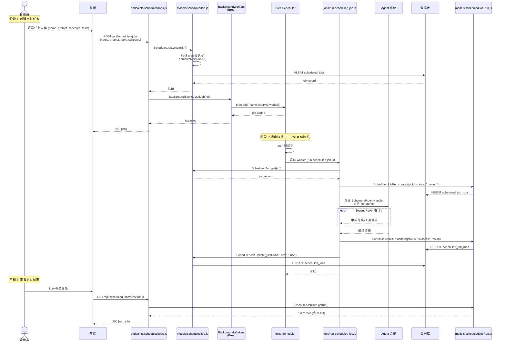
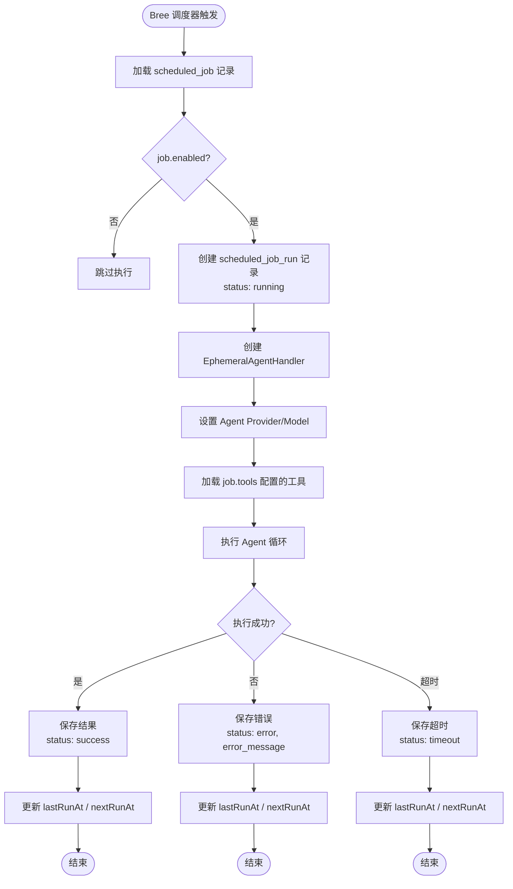

# 03-07 定时任务流程

> **所属章节**: [03-系统流程与时序图](./03-系统流程与时序图.md)  
> **流程类型**: Cron 任务创建、调度、执行、日志记录  
> **核心文件**: `server/models/scheduledJob.js`、`server/models/scheduledJobRun.js`、`server/jobs/run-scheduled-job.js`、`server/utils/BackgroundWorkers/index.js`、`server/endpoints/scheduledJobs.js`

---

## 1. 流程概述

AnythingLLM 的 **定时任务（Scheduled Jobs）** 系统允许用户创建基于 cron 表达式的周期性任务，这些任务具有完整的 Agent 能力（可调用工具）。典型场景：

- 每日自动生成工作空间摘要
- 定期检查某个网页并报告变化
- 定时发送提醒或报告到 Telegram
- 周期性执行数据同步

定时任务基于 **Bree**（`@mintplex-labs/bree` fork）实现，是 Node.js 的作业调度库。

---

## 2. 时序图 — 定时任务生命周期（L1）

---

## 3. 流程图 — 定时任务执行引擎（L3）

---

## 4. 详细步骤说明

### 4.1 任务创建

1. **前端表单**：管理员在 `frontend/src/pages/GeneralSettings/ScheduledJobs` 页面填写：
   - `name`：任务名称
   - `prompt`：Agent 执行指令（支持 Agent 工具调用）
   - `tools`：启用的工具列表（如 web-scraping、create-files 等）
   - `schedule`：Cron 表达式（如 `0 9 * * *` 表示每天 9:00）

2. **Cron 验证**：`ScheduledJob.isValidCron()` 使用 `cron-validate` 库验证表达式合法性。

3. **下次执行时间计算**：`ScheduledJob.computeNextRunAt()` 使用 `@breejs/later` 库解析 cron 并计算下次执行时间（UTC）。

4. **Bree 注册**：`BackgroundService.addJob()` 将任务注册到 Bree 调度器。

### 4.2 Bree 调度器

`BackgroundService`（`server/utils/BackgroundWorkers/index.js`）是 Bree 的单例封装：

- 在 `server/index.js` 启动时初始化
- 加载所有已启用的定时任务
- 管理任务的生命周期（添加、启动、停止、删除）

Bree 支持多种调度方式：
- `interval`：Cron 表达式或时间间隔
- `timeout`：任务启动前的延迟
- `cronValidation`：Cron 验证

### 4.3 任务执行

`run-scheduled-job.js` 是任务的执行入口：

1. **加载配置**：从数据库读取任务详情。
2. **创建运行记录**：在 `scheduled_job_runs` 表创建记录，状态为 `running`。
3. **初始化 Agent**：创建 `EphemeralAgentHandler`，配置 Provider、Model、工具。
4. **执行 Agent**：运行 Agent 的 ReAct 循环，处理工具调用。
5. **保存结果**：将 Agent 输出保存到 `run.result`。
6. **更新状态**：根据执行结果更新 `run.status`（success / error / timeout）。

### 4.4 执行日志

每次执行都在 `scheduled_job_runs` 表留下记录：

| 字段 | 说明 |
|------|------|
| `job_id` | 关联任务 |
| `status` | running / success / error / timeout |
| `result` | Agent 输出（JSON） |
| `error_message` | 错误信息（如有） |
| `duration_ms` | 执行耗时 |
| `started_at` | 开始时间 |
| `completed_at` | 完成时间 |

---

## 5. 涉及文件与函数索引

| 文件 | 关键函数/方法 | 职责 |
|------|-------------|------|
| `server/models/scheduledJob.js` | `ScheduledJob.create()`、`computeNextRunAt()`、`isValidCron()`、`availableTools()` | 任务 CRUD、Cron 处理 |
| `server/models/scheduledJobRun.js` | `ScheduledJobRun.create()`、`ScheduledJobRun.update()`、`ScheduledJobRun.get()` | 执行日志 CRUD |
| `server/jobs/run-scheduled-job.js` | 默认导出函数 | 任务执行入口 |
| `server/utils/BackgroundWorkers/index.js` | `BackgroundService` 类 | Bree 调度器单例 |
| `server/endpoints/scheduledJobs.js` | `scheduledJobEndpoints()` | 任务管理 API |
| `server/utils/agents/ephemeral.js` | `EphemeralAgentHandler` | 一次性 Agent 执行器 |

---

## 6. 异常处理

| 异常场景 | 处理方式 |
|---------|---------|
| Cron 表达式无效 | 创建时拒绝，返回错误 |
| 任务执行超时 | Bree 超时机制，标记为 timeout |
| Agent 执行错误 | 捕获异常，标记为 error，保存错误信息 |
| Provider 不可用 | Agent 内部重试或返回错误 |
| 任务删除 | 从 Bree 调度器移除，保留历史记录 |
| 服务器重启 | Bree 重新启动时加载所有已启用任务 |

---

**返回 → [03-系统流程与时序图.md](./03-系统流程与时序图.md)** | **上一子文件 ← [03-06-嵌入聊天组件流程.md](./03-06-嵌入聊天组件流程.md)** | **下一子文件 → [03-08-记忆系统流程.md](./03-08-记忆系统流程.md)**

---

☕️ 制作不易，请我喝咖啡☕️关注我➕

