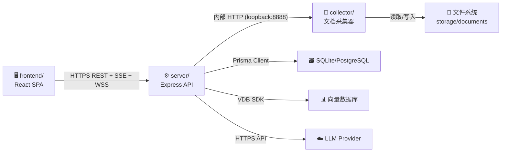
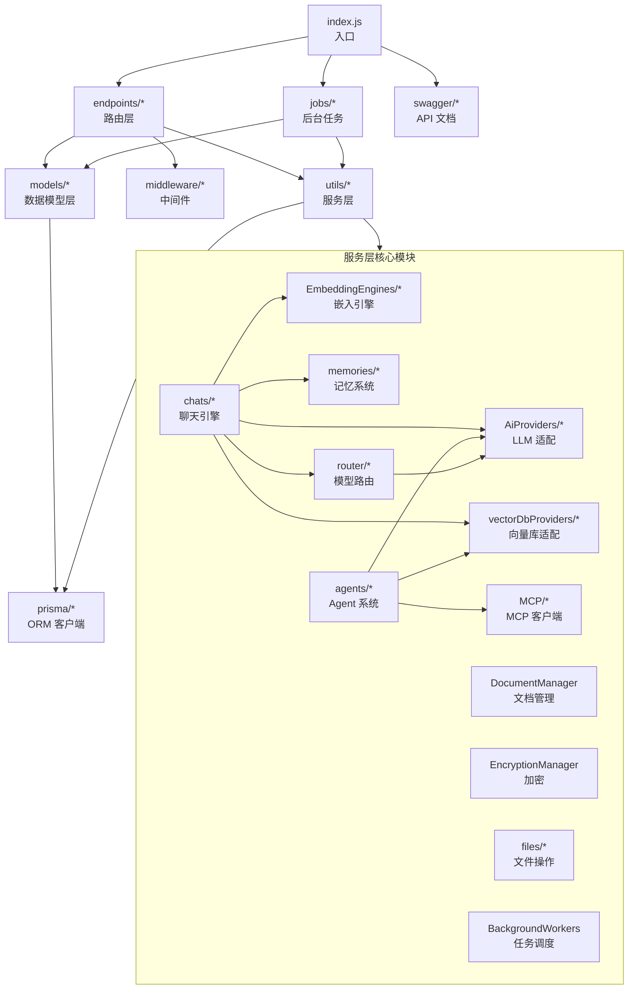
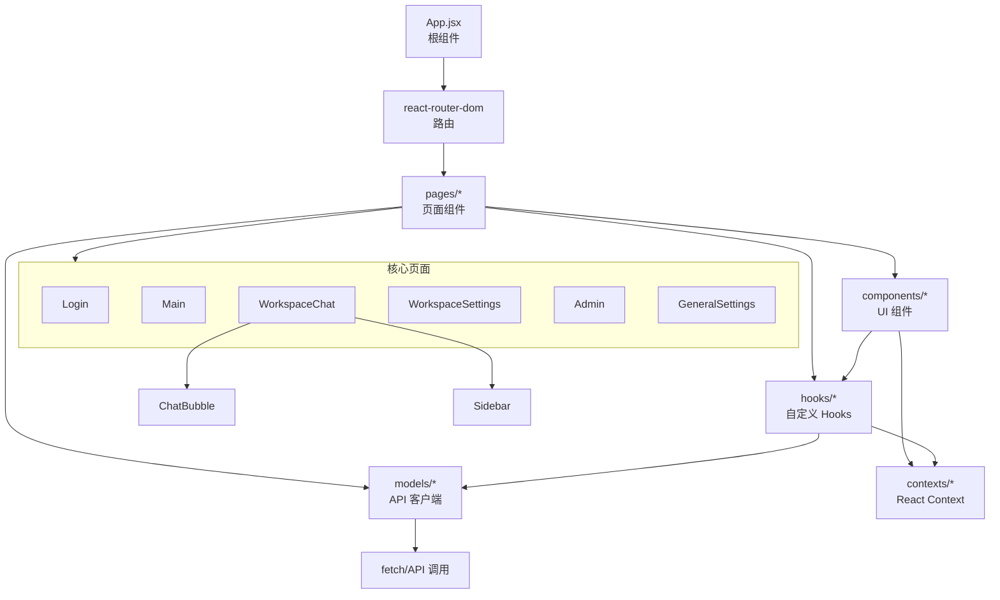

# 第 4 章 模块/包结构与依赖分析

> **章节编号**: 04  
> **预计阅读时间**: 30 分钟  
> **关联章节**: [上一章 03-系统流程与时序图](./03-系统流程与时序图.md) | [下一章 05-核心代码讲解](./05-核心代码讲解.md)

---

## 4.1 本章导读

本章提供 AnythingLLM 项目的 **完整目录结构树**，分析每个主要目录/模块的功能职责、输入输出，并通过 Mermaid 依赖图展示模块间的依赖关系。

**项目规模统计**：

| 模块 | 文件数（JS/JSX） | 说明 |
|------|-----------------|------|
| `server/` | ~461 | 后端核心（含 Provider、向量库、Agent 插件） |
| `frontend/src/` | ~693 | 前端 SPA |
| `collector/` | ~61 | 文档采集器 |
| **合计** | **~686**（去重后） | 不含 `node_modules`、构建产物、存储 |

---

## 4.2 顶层目录结构

```
anything-llm/
├── .devcontainer/                    # VS Code 开发容器配置
├── .github/workflows/                # CI/CD 工作流（8 个）
├── browser-extension/                # 浏览器扩展
├── cloud-deployments/                # 多云部署模板（AWS/GCP/DO/Helm/K8s/OpenShift/HF）
├── collector/                        # 📦 文档采集子服务（独立 Node 进程）
├── docker/                           # Docker 部署配置
├── embed/                            # 可嵌入聊天组件
├── extras/                           # 辅助工具（翻译、公告、脚本）
├── frontend/                         # 📦 前端 SPA（React + Vite）
├── images/                           # README 截图与部署按钮
├── locales/                          # 多语言 README
├── open-computer/                    # Open Computer 子项目
├── server/                           # 📦 后端 API 服务（Express）
├── package.json                      # 根包配置（scripts + devDeps）
├── eslint.config.js                  # 根 ESLint 配置
├── jest.config.cjs                   # Jest 测试配置
└── README.md                         # 项目主文档
```

---

## 4.3 server/ 目录结构

```
server/
├── index.js                          # 🚀 入口：Express 初始化、路由注册、WebSocket
├── middleware/                       # 全局中间件
│   ├── httpLogger.js                 #   HTTP 请求日志
│   └── ...                           #   其他中间件（位于 utils/middleware/）
├── endpoints/                        # REST 端点（控制器层）
│   ├── admin.js                      #   管理员操作
│   ├── agentFileServer.js            #   代理服务文件
│   ├── agentFlows.js                 #   Agent Flow 管理
│   ├── agentSkillWhitelist.js        #   技能白名单
│   ├── agentWebsocket.js             #   Agent WebSocket
│   ├── browserExtension.js           #   浏览器扩展 API
│   ├── chat.js                       #   聊天端点（核心）
│   ├── communityHub.js               #   社区 Hub
│   ├── document.js                   #   文档管理
│   ├── embed/                        #   嵌入聊天端点
│   ├── embedManagement.js            #   嵌入配置管理
│   ├── experimental/                 #   实验性功能
│   ├── extensions/                   #   扩展端点
│   ├── invite.js                     #   邀请码
│   ├── memory.js                     #   记忆管理
│   ├── mobile/                       #   移动端端点
│   ├── modelRouter.js                #   模型路由管理
│   ├── mcpServers.js                 #   MCP Server 管理
│   ├── scheduledJobs.js              #   定时任务管理
│   ├── system.js                     #   系统设置与健康检查
│   ├── telegram.js                   #   Telegram Bot
│   ├── utils.js                      #   通用工具端点
│   ├── utils/                        #   端点辅助函数
│   ├── webPush.js                    #   Web Push 订阅
│   ├── workspaceThreads.js           #   工作空间线程
│   ├── workspaces.js                 #   工作空间 CRUD（核心）
│   └── workspacesParsedFiles.js      #   解析文件管理
├── models/                           # 数据模型层（封装 Prisma 操作，35 个模型）
│   ├── apiKeys.js
│   ├── browserExtensionApiKey.js
│   ├── cacheData.js
│   ├── communityHub.js
│   ├── documentSyncQueue.js
│   ├── documentSyncRun.js
│   ├── documents.js                  #   文档元数据
│   ├── embedChats.js                 #   嵌入聊天
│   ├── embedConfig.js                #   嵌入配置
│   ├── eventLogs.js                  #   事件日志
│   ├── externalCommunicationConnector.js
│   ├── invite.js                     #   邀请码
│   ├── memory.js                     #   记忆
│   ├── mobileDevice.js
│   ├── modelRouter.js                #   模型路由器
│   ├── modelRouterRule.js            #   路由规则
│   ├── passwordRecovery.js
│   ├── promptHistory.js
│   ├── scheduledJob.js               #   定时任务
│   ├── scheduledJobRun.js            #   任务执行记录
│   ├── slashCommandsPresets.js       #   斜杠命令预设
│   ├── systemPromptVariables.js
│   ├── systemSettings.js             #   系统设置
│   ├── telemetry.js                  #   遥测
│   ├── temporaryAuthToken.js
│   ├── user.js                       #   用户
│   ├── vectors.js                    #   向量元数据
│   ├── workspace.js                  #   工作空间
│   ├── workspaceAgentInvocation.js   #   Agent 调用记录
│   ├── workspaceChats.js             #   聊天历史
│   ├── workspaceParsedFiles.js
│   ├── workspaceThread.js            #   线程
│   ├── workspaceUsers.js             #   工作空间-用户关联
│   └── workspacesSuggestedMessages.js
├── utils/                            # 服务层（业务逻辑）
│   ├── AiProviders/                  #   40+ LLM Provider 适配器
│   │   ├── anthropic/
│   │   ├── openAi/
│   │   ├── ollama/
│   │   ├── gemini/
│   │   ├── modelMap/                 #     Provider 注册表
│   │   ├── modelRouter/               #     路由 Provider
│   │   └── ...（40+ 目录）
│   ├── agents/                       #   Agent 系统
│   │   ├── aibitat/                  #     aibitat 核心引擎
│   │   │   ├── index.js
│   │   │   ├── providers/             #       40+ Agent Provider
│   │   │   ├── plugins/               #       20+ 工具插件
│   │   │   └── utils/
│   │   ├── defaults.js
│   │   ├── ephemeral.js
│   │   ├── imported.js
│   │   └── index.js
│   ├── agentFlows/                   #   Agent Flow 执行引擎
│   ├── BackgroundWorkers/             #   Bree 调度器封装
│   ├── boot/                         #   启动逻辑
│   ├── chats/                        #   聊天引擎
│   │   ├── index.js                  #     核心（grepCommand、chatPrompt、recentChatHistory）
│   │   ├── stream.js                 #     SSE 流式 RAG 管线
│   │   ├── embed.js                 #     嵌入聊天管线
│   │   ├── openaiCompatible.js       #     OpenAI 兼容 API
│   │   ├── apiChatHandler.js         #     API 聊天处理
│   │   ├── agents.js                 #     Agent 路由判断
│   │   ├── commands/                 #     斜杠命令实现
│   │   └── exportChatToFile.js
│   ├── collectorApi/                 #   Collector HTTP 客户端
│   ├── comKey/                       #   通信密钥
│   ├── database/                     #   数据库工具
│   ├── DocumentManager/               #   文档管理器
│   ├── EmbeddingEngines/             #   12 种嵌入引擎
│   ├── EmbeddingRerankers/            #   重排序器
│   ├── EncryptionManager/             #   AES-256 加密
│   ├── files/                        #   文件操作
│   ├── helpers/                      #   通用辅助函数
│   ├── http/                         #   HTTP 工具（reqBody、userFromSession）
│   ├── logger/                       #   Winston 日志配置
│   ├── MCP/                          #   MCP 客户端与 Hypervisor
│   ├── memories/                     #   记忆注入
│   ├── middleware/                   #   认证/授权中间件
│   ├── PasswordRecovery/              #   密码恢复
│   ├── prisma/                       #   Prisma 客户端单例
│   ├── PushNotifications/             #   Web Push
│   ├── router/                       #   路由辅助（ModelRouterService）
│   ├── SpeechToText/                  #   语音转文字
│   ├── telegramBot/                   #   Telegram Bot
│   ├── telemetry/                    #   PostHog 遥测
│   ├── TextSplitter/                  #   文本分块
│   ├── TextToSpeech/                  #   文字转语音
│   ├── vectorDbProviders/             #   10+ 向量数据库适配器
│   │   ├── base.js                   #     抽象基类
│   │   ├── lance.js
│   │   ├── milvus.js
│   │   ├── qdrant.js
│   │   ├── pinecone.js
│   │   ├── weaviate.js
│   │   ├── chroma.js
│   │   ├── astra.js
│   │   ├── pgvector.js
│   │   ├── zilliz.js
│   │   └── chromacloud.js
│   ├── vectorStore/                   #   向量缓存管理
│   └── EmbeddingWorkerManager.js      #   嵌入 Worker 管理器
├── jobs/                             # 后台定时任务
│   ├── cleanup-generated-files.js
│   ├── cleanup-orphan-documents.js
│   ├── embedding-worker.js
│   ├── extract-memories.js           #   记忆提取
│   ├── handle-telegram-chat.js
│   ├── run-scheduled-job.js          #   定时任务执行
│   ├── sync-watched-documents.js     #   文档同步
│   └── helpers/
├── prisma/                           # Prisma ORM
│   ├── schema.prisma                 #   数据库 Schema（487 行，35+ 模型）
│   ├── seed.js                       #   种子数据
│   └── migrations/                   #   迁移历史
├── storage/                          # 持久化存储根目录
│   ├── anythingllm.db                #   SQLite 数据库
│   ├── assets/                       #   用户上传资源
│   ├── documents/                    #   文档 JSON 文件
│   ├── models/                       #   本地模型文件
│   └── vector-cache/                 #   向量缓存
└── swagger/                          # Swagger/OpenAPI 自动生成
```

---

## 4.4 frontend/src/ 目录结构

```
frontend/src/
├── App.jsx                           # 根组件（路由配置）
├── index.jsx                         # 入口（ReactDOM.createRoot）
├── components/                       # 通用 UI 组件（30+）
│   ├── CanViewChatHistory/
│   ├── ChangeWarning/
│   ├── ChatBubble/                   #   聊天气泡
│   ├── CommunityHub/
│   ├── ContextualSaveBar/
│   ├── DataConnectorOption/
│   ├── DefaultChat/
│   ├── EmbeddingSelection/
│   ├── ErrorBoundaryFallback/
│   ├── Footer/
│   ├── ImageLightbox/
│   ├── KeyboardShortcutsHelp/
│   ├── LLMSelection/                 #   LLM 选择器
│   ├── ModalWrapper/
│   ├── Modals/                       #   模态框集合
│   ├── PrivateRoute/                 #   私有路由守卫
│   ├── ProviderPrivacy/
│   ├── SettingsButton/
│   ├── SettingsSidebar/
│   ├── Sidebar/                      #   侧边栏导航
│   ├── SpeechToText/
│   ├── TextToSpeech/
│   ├── TranscriptionSelection/
│   ├── UserIcon/
│   ├── UserMenu/
│   ├── VectorDBSelection/            #   向量库选择器
│   ├── WorkspaceChat/                 #   聊天主组件（核心）
│   ├── contexts/                     #   React Context 提供者
│   └── lib/                          #   组件工具库
├── hooks/                            # 自定义 React Hooks（25）
│   ├── useAppVersion.js
│   ├── useAutoScroll.js              #   自动滚动
│   ├── useChatContainerQuickScroll.js
│   ├── useCommunityHubAuth.js
│   ├── useCopyText.js
│   ├── useGetProvidersModels.js      #   获取 Provider 模型列表
│   ├── useLanguageOptions.js
│   ├── useLoginMode.js
│   ├── useLogo.js
│   ├── useModal.js
│   ├── useOnboardingComplete.js
│   ├── usePfp.js
│   ├── usePolling.js                 #   轮询
│   ├── usePrefersDarkMode.js
│   ├── usePromptInputStorage.js
│   ├── useProviderEndpointAutoDiscovery.js
│   ├── useQuery.js                   #   数据查询
│   ├── useScrollActiveItemIntoView.js
│   ├── useSimpleSSO.js
│   ├── useTextSize.js
│   ├── useTheme.js                   #   主题
│   ├── useTimeoutProgress.js
│   ├── useUser.js                    #   当前用户
│   └── useWebPushNotifications.js
├── locales/                          # i18n 国际化（30+ 语言）
│   ├── en/  zh/  ja/  ko/  de/  fr/  es/  ...
├── media/                            # 静态媒体资源
│   ├── agents/
│   ├── animations/
│   ├── announcements/
│   ├── dataConnectors/
│   ├── embeddingprovider/
│   ├── illustrations/
│   ├── llmprovider/                  #   LLM Provider Logo
│   ├── logo/
│   ├── ttsproviders/
│   └── vectordbs/                    #   向量库 Logo
├── models/                           # API 客户端封装
│   ├── admin.js
│   ├── agentFlows.js
│   ├── agentSkillWhitelist.js
│   ├── appearance.js
│   ├── browserExtensionApiKey.js
│   ├── communityHub.js
│   ├── dataConnector.js
│   ├── document.js
│   ├── embed.js
│   ├── experimental/
│   ├── files.js
│   ├── googleAgentSkills.js
│   ├── invite.js
│   ├── mcpServers.js
│   ├── memory.js
│   ├── mobile.js
│   ├── modelRouter.js
│   ├── outlookAgent.js
│   ├── promptHistory.js
│   ├── scheduledJobs.js
│   ├── system.js
│   ├── systemPromptVariable.js
│   ├── telegram.js
│   ├── utils/
│   ├── workspace.js
│   └── workspaceThread.js
├── pages/                            # 页面级组件（路由入口）
│   ├── 404.jsx
│   ├── Admin/                        #   管理员面板
│   ├── GeneralSettings/              #   通用设置
│   ├── Invite/                       #   邀请页面
│   ├── Login/                        #   登录页面
│   ├── Main/                         #   主页面（工作空间列表）
│   ├── OnboardingFlow/               #   引导流程
│   ├── WorkspaceChat/                #   聊天页面（核心）
│   └── WorkspaceSettings/            #   工作空间设置
└── utils/                            # 前端工具库
    ├── chat/                         #   聊天辅助
    ├── piperTTS/                     #   Piper TTS 集成
    └── ...
```

---

## 4.5 collector/ 目录结构

```
collector/
├── index.js                          # 🚀 入口：Express 初始化、/process 端点
├── middleware/
│   ├── httpLogger.js
│   ├── setDataSigner.js              #   数据签名
│   └── verifyIntegrity.js            #   完整性校验（comKey）
├── processSingleFile/                # 单文件处理管线
│   ├── index.js                      #   入口：路径校验、处理器选择
│   └── convert/                      #   格式转换器
│       ├── pdf.js
│       ├── docx.js
│       ├── xlsx.js
│       ├── pptx.js
│       ├── html.js
│       ├── txt.js
│       ├── epub.js
│       ├── mbox.js
│       └── ...
├── processLink/                      # 网页链接处理
│   ├── index.js
│   ├── convert/
│   └── helpers/
├── processRawText/                   # 原始文本处理
│   └── index.js
├── convertAudioToWav/                # 音频转 WAV
│   └── index.js
├── extensions/                       # 扩展模块
│   └── resync/
├── hotdir/                           # 热目录监听
│   └── ...
└── utils/
    ├── constants.js                  #   SUPPORTED_FILETYPE_CONVERTERS 等
    ├── shell.js
    ├── files/                        #   文件工具
    ├── http/                         #   HTTP 工具
    ├── logger/
    ├── tokenizer/                    #   Token 计数
    ├── url/                          #   URL 工具
    ├── OCRLoader/                    #   OCR 文字识别
    ├── WhisperProviders/             #   Whisper 转写
    ├── EncryptionWorker/             #   加密 Worker
    ├── comKey/                       #   通信密钥
    ├── downloadURIToFile/            #   URI 下载
    ├── extensions/                   #   扩展工具
    └── runtimeSettings/              #   运行时设置
```

---

## 4.6 模块间依赖关系图

### 4.6.1 顶层三端依赖



### 4.6.2 server/ 内部模块依赖



### 4.6.3 frontend/src/ 内部模块依赖



---

## 4.7 模块职责矩阵

| 目录/模块 | 职责 | 输入 | 输出 | 关键依赖 |
|----------|------|------|------|---------|
| `server/index.js` | 应用启动、路由注册、中间件配置 | HTTP 请求 | HTTP 响应 | express、cors、body-parser |
| `server/endpoints/*` | REST 端点（控制器） | req/res | JSON / SSE | models/*、utils/* |
| `server/models/*` | 数据访问层（封装 Prisma） | 查询条件 | 数据记录 | @prisma/client |
| `server/utils/chats/*` | 聊天引擎（RAG 管线） | 用户消息 | SSE 流 | AiProviders、vectorDbProviders |
| `server/utils/agents/*` | Agent 系统 | 用户任务 | 工具调用结果 | aibitat、plugins |
| `server/utils/AiProviders/*` | LLM Provider 适配 | 聊天请求 | LLM 响应 | 各 Provider SDK |
| `server/utils/vectorDbProviders/*` | 向量库适配 | 向量/查询 | 搜索结果 | 各 VDB SDK |
| `server/utils/EmbeddingEngines/*` | 嵌入引擎适配 | 文本 | 向量 | 各 Embedding SDK |
| `server/utils/MCP/*` | MCP 客户端 | 工具调用 | 工具结果 | @modelcontextprotocol/sdk |
| `server/utils/EncryptionManager` | AES-256 加密 | 明文/密文 | 密文/明文 | crypto |
| `server/jobs/*` | 后台定时任务 | 定时触发 | 执行结果 | models、utils |
| `collector/index.js` | 采集器入口 | HTTP /process | 解析结果 | express |
| `collector/processSingleFile` | 单文件处理 | 文件路径 | 文档块 JSON | 各格式解析库 |
| `collector/processLink` | 网页抓取 | URL | 文档块 JSON | puppeteer |
| `frontend/src/pages/*` | 页面组件 | 路由参数 | JSX | components、hooks |
| `frontend/src/components/*` | UI 组件 | props | JSX | hooks、contexts |
| `frontend/src/hooks/*` | 自定义 Hooks | 参数 | 状态/操作 | models、contexts |
| `frontend/src/models/*` | API 客户端 | 参数 | Promise | fetch |

---

## 4.8 依赖耦合度分析

### 4.8.1 高内聚模块（低耦合，高复用）

| 模块 | 内聚度 | 说明 |
|------|--------|------|
| `utils/EncryptionManager` | 极高 | 纯加密逻辑，无外部业务依赖 |
| `utils/TextSplitter` | 极高 | 纯文本分块算法 |
| `utils/AiProviders/*` | 高 | 每个 Provider 独立封装，通过 modelMap 注册 |
| `utils/vectorDbProviders/*` | 高 | 每个 VDB 独立封装，通过 base.js 抽象 |
| `models/*` | 高 | 每个模型独立封装 CRUD |

### 4.8.2 中耦合模块（需关注）

| 模块 | 耦合点 | 风险 |
|------|--------|------|
| `utils/chats/stream.js` | 依赖 Providers、VDB、Embedding、Router、Memories | 变更影响面大 |
| `utils/agents/aibitat/index.js` | 依赖 20+ 插件、40+ Provider | 插件增减需谨慎 |
| `endpoints/workspaces.js` | 依赖 10+ 模型、多个服务 | 工作空间操作复杂 |

### 4.8.3 潜在循环依赖

经代码分析，AnythingLLM 的模块依赖整体为 **有向无环图（DAG）**，未发现严重循环依赖。但存在以下需要注意的相互引用：

- `utils/chats/index.js` 内部引用 `models/systemSettings.js` 和 `models/slashCommandsPresets.js`，而模型层通常不引用服务层，这是可接受的单向依赖。
- `utils/agents/ephemeral.js` 引用 `utils/agents/aibitat/plugins/*`，插件又可能引用服务层，形成较深的依赖链。

---

## 4.9 第三方依赖版本与选型理由

| 依赖 | 版本 | 用途 | 选型理由 |
|------|------|------|---------|
| express | ^4.21.2 | HTTP 框架 | 生态成熟、中间件丰富 |
| @prisma/client | 5.3.1 | ORM | 类型安全、迁移管理、SQLite/PG 双支持 |
| bcryptjs | ^3.0.3 | 密码哈希 | 纯 JS 实现，无原生编译依赖 |
| winston | ^3.13.0 | 日志 | 多传输、结构化日志 |
| @mintplex-labs/bree | ^9.2.6 | 任务调度 | 基于 cron，支持 Worker 线程 |
| @modelcontextprotocol/sdk | ^1.24.3 | MCP 协议 | Anthropic 官方 SDK |
| puppeteer | ~21.5.2 | 网页抓取 | Headless Chrome，渲染完整 |
| @xenova/transformers | ^2.14.0 | 本地嵌入/推理 | 浏览器/Node 通用 ONNX 运行时 |
| langchain | 0.1.36 | 文档处理 | 文本分块、文档加载 |
| openai | 4.95.1 | OpenAI API | 官方 SDK，兼容多数 OpenAI-compatible API |
| react | ^18.2.0 | UI 框架 | 生态成熟、并发特性 |
| vite | ^5.x | 构建工具 | 快速 HMR、优化构建 |
| i18next | ^23.11.3 | 国际化 | 生态成熟、框架无关 |

---

**上一章 ← [03-系统流程与时序图](./03-系统流程与时序图.md)** | **下一章 → [05-核心代码讲解](./05-核心代码讲解.md)**

---

☕️ 制作不易，请我喝咖啡☕️关注我➕

