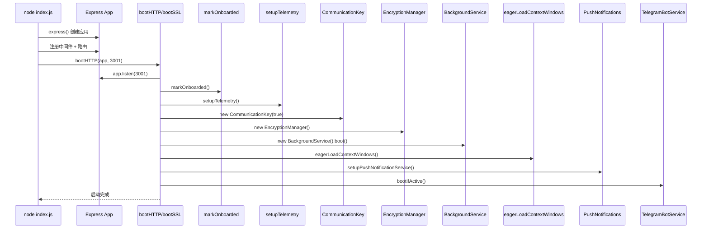

# 05-01 服务端启动与路由

> **所属章节**: [05-核心代码讲解](./05-核心代码讲解.md)  
> **核心文件**: `server/index.js`、`server/utils/boot/index.js`、`server/utils/boot/*`

---

## 1. server/index.js — 系统入口

### 1.1 功能

`server/index.js` 是整个后端应用的入口点，负责：
1. 加载环境变量（dotenv）
2. 初始化日志系统
3. 创建 Express 应用
4. 注册中间件（CORS、Body Parser）
5. 注册所有 REST 端点
6. 启动 HTTP/HTTPS 服务器
7. 启动 WebSocket 服务

### 1.2 逐段代码讲解

#### 阶段 A：环境初始化

```javascript
process.env.NODE_ENV === "development"
  ? require("dotenv").config({ path: `.env.${process.env.NODE_ENV}` })
  : require("dotenv").config();
```

**功能**：根据 `NODE_ENV` 加载对应的环境变量文件。开发模式加载 `.env.development`，生产模式加载 `.env`。

**设计决策**：使用三目运算符而非 if/else，简洁但可读性略差。

```javascript
require("./utils/logger")();      // 初始化 Winston 日志
require("./utils/boot/patchSdkTimeouts")();  // 修补 SDK 超时
```

**`patchSdkTimeouts()`**：修补某些 SDK 的默认超时设置，避免长时间挂起。

#### 阶段 B：Express 应用创建与中间件注册

```javascript
const app = express();
const apiRouter = express.Router();
const FILE_LIMIT = "3GB";

app.use(cors({ origin: true }));
app.use(bodyParser.text({ limit: FILE_LIMIT }));
app.use(bodyParser.json({ limit: FILE_LIMIT }));
app.use(bodyParser.urlencoded({ limit: FILE_LIMIT, extended: true }));
```

**关键设计**：
- **`cors({ origin: true })`**：允许所有来源跨域（生产环境应配置白名单）。
- **3GB 文件限制**：支持大文件上传（如大型 PDF、视频）。
- **三种 Body Parser**：分别处理 text、json、urlencoded 格式。

**潜在问题**：
- `cors({ origin: true })` 在生产环境中存在 CSRF 风险，建议配置具体域名白名单。
- 3GB 的 body 限制可能导致内存压力，建议对大文件使用流式处理。

#### 阶段 C：WebSocket 与 HTTPS 配置

```javascript
if (!!process.env.ENABLE_HTTPS) {
  bootSSL(app, process.env.SERVER_PORT || 3001);
} else {
  require("@mintplex-labs/express-ws").default(app); // 非 SSL 模式加载 WebSocket
}
```

**设计决策**：
- SSL 模式下由 `bootSSL()` 内部加载 WebSocket（传入 server 实例）。
- 非 SSL 模式下直接加载 WebSocket（使用 app 默认 HTTP server）。
- 这种条件分支避免了 SSL 模式下重复创建 HTTP server。

#### 阶段 D：路由注册

```javascript
app.use("/api", apiRouter);

// 注册各业务端点
systemEndpoints(apiRouter);
workspaceEndpoints(apiRouter);
chatEndpoints(apiRouter);
adminEndpoints(apiRouter);
// ... 20+ 个端点注册
```

**设计模式**：
- **模块化路由**：每个端点文件导出一个函数，接收 `apiRouter` 参数并注册路由。
- **统一前缀**：所有 API 路由挂载在 `/api` 下，便于版本管理（未来可添加 `/api/v2`）。

**端点注册顺序**（影响中间件匹配优先级）：
1. `systemEndpoints` — 系统级（健康检查、设置）
2. `workspaceEndpoints` — 工作空间 CRUD
3. `chatEndpoints` — 聊天（核心）
4. `adminEndpoints` — 管理员操作
5. `documentEndpoints` — 文档管理
6. `agentWebsocket` — Agent WebSocket
7. ... 其他端点

#### 阶段 E：Agent WebSocket 注册

```javascript
const { agentWebsocket } = require("./endpoints/agentWebsocket");
agentWebsocket(app);  // 注意：传入 app 而非 apiRouter
```

**设计决策**：WebSocket 路由直接注册在 `app` 上（`/agent-invocation/:uuid`），而非 `/api` 下，因为 WebSocket 路径通常独立于 REST API。

---

## 2. server/utils/boot/index.js — 启动引导

### 2.1 功能

`boot/index.js` 负责应用启动后的初始化序列，包括：
1. 标记已引导（`markOnboarded`）
2. 设置遥测（`setupTelemetry`）
3. 初始化通信密钥（`CommunicationKey`）
4. 初始化加密管理器（`EncryptionManager`）
5. 启动后台任务调度器（`BackgroundService`）
6. 预加载上下文窗口（`eagerLoadContextWindows`）
7. 设置推送通知（`PushNotifications`）
8. 启动 Telegram Bot（如已配置）

### 2.2 核心函数

#### `bootHTTP(app, port = 3001)`

```javascript
function bootHTTP(app, port = 3001) {
  if (!app) throw new Error('No "app" defined - crashing!');
  app.listen(port, async () => {
    await markOnboarded();
    await setupTelemetry();
    new CommunicationKey(true);
    new EncryptionManager();
    new BackgroundService().boot();
    await eagerLoadContextWindows();
    await PushNotifications.setupPushNotificationService();
    await TelegramBotService.bootIfActive();
    console.log(`Primary server in HTTP mode listening on port ${port}`);
  }).on("error", catchSigTerms);
  return { app, server: null };
}
```

**启动序列详解**：

| 步骤 | 函数 | 功能 |
|------|------|------|
| 1 | `markOnboarded()` | 标记系统已完成引导（写入 `system_settings` 表） |
| 2 | `setupTelemetry()` | 初始化 PostHog 遥测（如启用） |
| 3 | `new CommunicationKey(true)` | 生成/加载通信密钥（服务间签名） |
| 4 | `new EncryptionManager()` | 初始化 AES-256 加密管理器 |
| 5 | `new BackgroundService().boot()` | 启动 Bree 调度器，加载定时任务 |
| 6 | `eagerLoadContextWindows()` | 预加载 LLM 上下文窗口数据（缓存到本地） |
| 7 | `PushNotifications.setupPushNotificationService()` | 初始化 Web Push VAPID 密钥 |
| 8 | `TelegramBotService.bootIfActive()` | 如配置了 Telegram Bot Token，启动 Bot |

#### `bootSSL(app, port = 3001)`

与 `bootHTTP` 类似，但使用 HTTPS 创建 server：

```javascript
function bootSSL(app, port = 3001) {
  const privateKey = fs.readFileSync(process.env.HTTPS_KEY_PATH);
  const certificate = fs.readFileSync(process.env.HTTPS_CERT_PATH);
  const credentials = { key: privateKey, cert: certificate };
  const server = https.createServer(credentials, app);
  server.listen(port, async () => { /* 同 bootHTTP 初始化序列 */ });
  require("@mintplex-labs/express-ws").default(app, server);
  return { app, server };
}
```

**异常处理**：SSL 启动失败时自动回退到 HTTP 模式（`catch` 中调用 `bootHTTP`）。

#### `catchSigTerms()`

```javascript
function catchSigTerms() {
  process.once("SIGUSR2", function () {
    Telemetry.flush();
    process.kill(process.pid, "SIGUSR2");
  });
  process.on("SIGINT", function () {
    Telemetry.flush();
    process.kill(process.pid, "SIGINT");
  });
}
```

**功能**：优雅关闭信号处理。收到 `SIGINT`（Ctrl+C）或 `SIGUSR2`（Nodemon 重启）时，先刷新遥测数据再退出。

**潜在问题**：未处理 `SIGTERM`（Docker/K8s 默认终止信号），可能导致容器停止时遥测数据丢失。

---

## 3. 启动序列时序图



---

## 4. 潜在问题与改进建议

| 问题 | 影响 | 改进建议 |
|------|------|---------|
| `cors({ origin: true })` 允许所有来源 | CSRF 攻击风险 | 配置具体域名白名单 |
| 未处理 SIGTERM 信号 | Docker 优雅关闭失败 | 添加 `process.on('SIGTERM', ...)` |
| 启动序列无超时控制 | 某步骤阻塞导致启动卡住 | 为每个初始化步骤添加超时 |
| 同步初始化（无重试） | 临时故障导致启动失败 | 添加重试机制（尤其网络依赖） |
| 3GB body 限制 | 大文件上传内存压力 | 流式处理大文件 |
| 无健康检查就绪探针 | K8s 无法判断服务就绪 | 添加 `/ready` 端点 |

---

**返回 → [05-核心代码讲解.md](./05-核心代码讲解.md)** | **下一子文件 → [05-02-认证与授权.md](./05-02-认证与授权.md)**

---

# ❤️ 制作不易，请我喝咖啡☕️关注我➕

