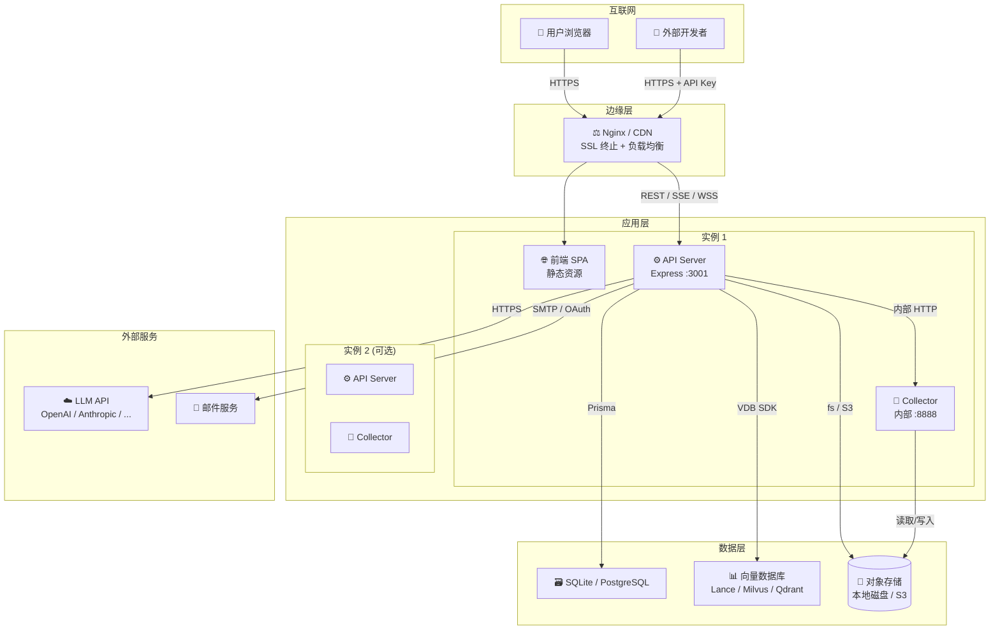

# 第 8 章 部署、运维与基础设施

> **章节编号**: 08  
> **预计阅读时间**: 30 分钟  
> **关联章节**: [上一章 07-API与接口设计](./07-API与接口设计.md) | [下一章 09-改进建议风险点与未来规划](./09-改进建议风险点与未来规划.md)

---

## 8.1 部署架构图



---

## 8.2 Docker 部署

### 8.2.1 Dockerfile 详解

AnythingLLM 的 Dockerfile 支持 **amd64** 和 **arm64** 多架构构建：

```dockerfile
# 基础镜像
FROM ubuntu:noble-20251013 AS base

# 安装系统依赖
RUN apt-get install -yq \
    unzip curl gnupg libgfortran5 libgbm1 \
    ffmpeg nodejs yarn uvx \
    # ... 其他依赖（Chromium 依赖库）

# 创建非 root 用户
RUN groupadd -g $ARG_GID anythingllm && \
    useradd -u $ARG_UID -m -d /app -g anythingllm anythingllm

# ARM64 专用：安装兼容 Chromium
FROM base AS build-arm64
RUN curl -fSL https://webassets.anythingllm.com/chromium-1088-linux-arm64.zip -o chrome-linux.zip && \
    unzip chrome-linux.zip
ENV PUPPETEER_EXECUTABLE_PATH=/app/chrome-linux/chrome

# AMD64 构建阶段
FROM base AS build-amd64
# ... 安装前端/后端依赖，构建前端资源

# 最终阶段
FROM base AS final
COPY --from=build-amd64 /app/frontend/dist /app/frontend/dist
COPY --from=build-amd64 /app/server /app/server
COPY --from=build-amd64 /app/collector /app/collector
COPY ./docker/docker-entrypoint.sh /usr/local/bin/
COPY ./docker/docker-healthcheck.sh /usr/local/bin/
USER anythingllm
WORKDIR /app
ENTRYPOINT ["docker-entrypoint.sh"]
CMD ["server"]
```

**关键设计**：
- **多阶段构建**：分离构建环境与运行环境，减小镜像体积。
- **非 root 用户**：使用 `anythingllm` 用户运行，提升安全性。
- **ARM64 兼容**：手动安装兼容 Chromium，支持 Apple Silicon / ARM 服务器。
- **uvx 安装**：用于 MCP Server 支持。

### 8.2.2 docker-compose.yml

```yaml
name: anythingllm

networks:
  anything-llm:
    driver: bridge

services:
  anything-llm:
    container_name: anythingllm
    build:
      context: ../.
      dockerfile: ./docker/Dockerfile
      args:
        ARG_UID: ${UID:-1000}
        ARG_GID: ${GID:-1000}
    cap_add:
      - SYS_ADMIN  # Puppeteer 需要
    volumes:
      - "./.env:/app/server/.env"
      - "../server/storage:/app/server/storage"
      - "../collector/hotdir/:/app/collector/hotdir"
      - "../collector/outputs/:/app/collector/outputs"
    user: "${UID:-1000}:${GID:-1000}"
    ports:
      - "3001:3001"
    env_file:
      - .env
    networks:
      - anything-llm
    extra_hosts:
      - "host.docker.internal:host-gateway"
```

**关键配置**：
- **`cap_add: SYS_ADMIN`**：Puppeteer 运行 Chromium 所需。
- **数据卷挂载**：存储目录挂载到宿主机，实现数据持久化。
- **`extra_hosts`**：允许容器访问宿主机服务（如本地 Ollama）。

### 8.2.3 入口脚本

```bash
# docker-entrypoint.sh（简化）
#!/bin/bash
set -e

# 设置权限
chown -R anythingllm:anythingllm /app/server/storage

# 执行 Prisma 迁移
cd /app/server && npx prisma migrate deploy

# 启动服务
cd /app/server && node index.js &
cd /app/collector && node index.js &

# 等待子进程
wait
```

### 8.2.4 健康检查

```bash
# docker-healthcheck.sh
#!/bin/bash
curl -f http://localhost:3001/api/ping || exit 1
```

**使用**：在 docker-compose 或 K8s 中配置：
```yaml
healthcheck:
  test: ["CMD", "docker-healthcheck.sh"]
  interval: 30s
  timeout: 10s
  retries: 3
  start_period: 60s
```

---

## 8.3 裸机部署（Bare Metal）

参考 `BARE_METAL.md`：

1. **安装依赖**：Node.js ≥ 18、Yarn、FFmpeg
2. **克隆仓库**：`git clone https://github.com/mintplex-labs/anything-llm.git`
3. **安装依赖**：`yarn setup`
4. **配置环境变量**：复制 `.env.example` 为 `.env.development` / `.env`
5. **构建前端**：`yarn prod:frontend`
6. **启动服务**：
   ```bash
   yarn prod:server      # API Server
   yarn dev:collector    # Collector（开发模式）
   ```

---

## 8.4 Kubernetes 部署

### 8.4.1 Helm Chart

`cloud-deployments/helm/charts/anythingllm/` 提供 Helm Chart，包含：
- `Deployment`：应用部署
- `Service`：服务暴露
- `PersistentVolumeClaim`：存储卷声明
- `ConfigMap`：配置管理
- `Ingress`：路由入口

### 8.4.2 原生 K8s Manifests

`cloud-deployments/k8s/` 提供原生 Kubernetes manifests。

---

## 8.5 CI/CD（GitHub Actions）

### 8.5.1 工作流清单

| 文件 | 触发条件 | 功能 |
|------|---------|------|
| `build-and-push-image.yaml` | Push to master | 构建并推送 Docker 镜像 |
| `build-and-push-image-semver.yaml` | Semver tag | 构建并推送带版本标签的镜像 |
| `build-qa-tag.yaml` | QA tag | 构建 QA 镜像 |
| `cleanup-qa-tag.yaml` | QA tag 删除 | 清理 QA 镜像 |
| `check-package-versions.yaml` | Schedule | 检查依赖版本更新 |
| `check-translations.yaml` | PR/Push | 检查翻译文件完整性 |
| `lint.yaml` | PR/Push | ESLint 代码检查 |
| `run-tests.yaml` | PR/Push | 运行 Jest 测试 |
| `sponsors.yaml` | Schedule | 更新赞助商列表 |

### 8.5.2 构建推送流程

```yaml
# build-and-push-image.yaml（简化）
name: Build and Push Docker Image

on:
  push:
    branches: [master]

jobs:
  build:
    runs-on: ubuntu-latest
    steps:
      - uses: actions/checkout@v4
      - name: Set up QEMU
        uses: docker/setup-qemu-action@v3
      - name: Set up Docker Buildx
        uses: docker/setup-buildx-action@v3
      - name: Login to Docker Hub
        uses: docker/login-action@v3
        with:
          username: ${{ secrets.DOCKERHUB_USERNAME }}
          password: <REDACTED> secrets.DOCKERHUB_TOKEN }}
      - name: Build and push
        uses: docker/build-push-action@v5
        with:
          context: .
          file: ./docker/Dockerfile
          platforms: linux/amd64,linux/arm64
          push: true
          tags: mintplexlabs/anything-llm:latest
```

---

## 8.6 多云部署

### 8.6.1 AWS CloudFormation

`cloud-deployments/aws/cloudformation/`：
- 生成 CloudFormation 模板
- 一键部署到 AWS EC2/ECS

### 8.6.2 GCP Deployment

`cloud-deployments/gcp/deployment/`：
- GCP Deployment Manager 模板
- 一键部署到 GCE/GKE

### 8.6.3 DigitalOcean

`cloud-deployments/digitalocean/terraform/`：
- Terraform 模板
- 一键部署到 DO Droplet

### 8.6.4 HuggingFace Spaces

`cloud-deployments/huggingface-spaces/`：
- 部署到 HuggingFace Spaces

### 8.6.5 OpenShift

`cloud-deployments/openshift/`：
- OpenShift 模板

---

## 8.7 监控与日志

### 8.7.1 日志系统

**Winston 配置**（`server/utils/logger/`）：

```javascript
const winston = require("winston");

const logger = winston.createLogger({
  level: process.env.LOG_LEVEL || "info",
  format: winston.format.combine(
    winston.format.timestamp(),
    winston.format.json()
  ),
  transports: [
    new winston.transports.Console(),
    new winston.transports.File({ filename: "logs/error.log", level: "error" }),
    new winston.transports.File({ filename: "logs/combined.log" }),
  ],
});
```

**日志级别**：`error`、`warn`、`info`、`http`、`verbose`、`debug`、`silly`

### 8.7.2 遥测（PostHog）

```javascript
// server/utils/telemetry/
const PostHog = require("posthog-node");

const client = new PostHog(process.env.POSTHOG_API_KEY, {
  host: process.env.POSTHOG_HOST || "https://app.posthog.com",
});

// 发送事件
await client.capture({
  distinctId: "system",
  event: "sent_chat",
  properties: {
    LLMSelection: process.env.LLM_PROVIDER,
    VectorDbSelection: process.env.VECTOR_DB,
  },
});
```

**遥测事件**：`sent_chat`、`workspace_created`、`agent_chat_started` 等

**禁用遥测**：设置 `DISABLE_TELEMETRY=true`

### 8.7.3 系统指标

```
GET /api/metrics
```

返回：
```json
{
  "online": true,
  "version": "1.15.0",
  "worker_version": "1.0.0",
  "vector_db": "lancedb",
  "llm_provider": "openai",
  "embedding_engine": "native",
  "workspace_count": 5,
  "document_count": 42,
  "chat_count": 1234
}
```

### 8.7.4 健康检查

```
GET /api/ping
```

返回：
```json
{ "online": true }
```

---

## 8.8 备份方案

### 8.8.1 SQLite 备份

```bash
# 文件级备份
cp server/storage/anythingllm.db /backup/anythingllm-$(date +%Y%m%d).db

# 使用 .backup 命令（推荐，避免锁冲突）
sqlite3 server/storage/anythingllm.db ".backup '/backup/anythingllm.db'"
```

### 8.8.2 PostgreSQL 备份

```bash
pg_dump -h localhost -U user anythingllm > backup.sql
```

### 8.8.3 向量库备份

- **LanceDB**：复制 `server/storage/vector-cache/` 目录
- **远程 VDB**：使用 VDB 自带导出工具

### 8.8.4 文件系统备份

```bash
# 备份存储目录
tar -czf storage-backup.tar.gz server/storage/
```

### 8.8.5 自动化备份脚本

```bash
#!/bin/bash
# backup.sh
BACKUP_DIR="/backup/$(date +%Y%m%d)"
mkdir -p $BACKUP_DIR

# 备份数据库
sqlite3 server/storage/anythingllm.db ".backup '$BACKUP_DIR/anythingllm.db'"

# 备份向量缓存
cp -r server/storage/vector-cache $BACKUP_DIR/

# 备份文档
cp -r server/storage/documents $BACKUP_DIR/

# 保留最近 7 天
find /backup -type d -mtime +7 -exec rm -rf {} \;
```

---

## 8.9 告警方案

### 9.1 当前告警机制

AnythingLLM 无内置告警系统，需依赖外部监控：

| 监控项 | 方案 |
|--------|------|
| 服务可用性 | Docker healthcheck + K8s liveness probe |
| 错误率 | Winston 日志 + ELK/Loki |
| 资源使用率 | Prometheus + Grafana |
| 磁盘空间 | `check-disk-space` 库 + 系统监控 |

### 9.2 推荐告警配置

```yaml
# Prometheus 告警规则（示例）
groups:
  - name: anythingllm
    rules:
      - alert: ServiceDown
        expr: up{job="anythingllm"} == 0
        for: 1m
        labels:
          severity: critical
      - alert: HighErrorRate
        expr: rate(http_requests_total{status=~"5.."}[5m]) > 0.1
        for: 5m
        labels:
          severity: warning
```

---

**上一章 ← [07-API与接口设计](./07-API与接口设计.md)** | **下一章 → [09-改进建议风险点与未来规划](./09-改进建议风险点与未来规划.md)**

---

☕️ 制作不易，请我喝咖啡☕️关注我➕

