# 2. C4 架构模型（C4 Architecture Model）

> **文档版本**：v1.0  
> **分析方法**：基于 C4 Model for Software Architecture（Simon Brown），结合对 awesome-llm-apps 全量代码的静态分析  
> **图表工具**：全部使用标准 Mermaid 语法（C4Context / C4Container / C4Component / ClassDiagram / graph）  
> **每个图层均配 400+ 字详细文字说明**

---

## 2.0 C4 模型概述

C4 模型是一种 **分层抽象** 的软件架构描述方法，从宏观到微观分为 4 个层级：

| 层级 | 名称 | 类比 | 受众 | 关注点 |
|------|------|------|------|--------|
| **Level 1** | System Context（系统上下文） | 看整片森林 | 技术与非技术干系人 | 系统与外部实体（人/系统）的关系 |
| **Level 2** | Container（容器） | 看每棵树 | 开发者/运维 | 可独立部署的进程/应用（Web App/API/DB） |
| **Level 3** | Component（组件） | 看树干树枝 | 开发者 | 容器内的模块/包/类边界 |
| **Level 4** | Code（代码） | 看树叶纹理 | 开发者 | 类/接口/函数级别的结构 |

> **设计 Rationale**：Awesome LLM Apps 是一个 Monorepo 模板集合，传统 C4 模型针对单一系统设计。本仓库的特殊性在于 **"100+ 子系统共享同一架构模式"**，因此 C4 模型将：
> - **Context 层**：描述整个仓库作为"生态系统"与外部世界的边界
> - **Container 层**：抽取 5 种代表性容器类型（Streamlit App / FastAPI Service / MCP Server / Next.js App / Vector DB）
> - **Component 层**：按 5 大分类绘制组件图
> - **Code 层**：选取 4 个代表性子系统的核心类图

---

## 2.1 Level 1 — 系统上下文图（System Context）

### 2.1.1 Mermaid 图表

```mermaid
C4Context                                                                                                                                                                  
      title Awesome LLM Apps — System Context (Level 1)                                                                                                                      
                                                                                                                                                                             
      Person(developer, "AI Developer", "使用/定制/学习模板的开发者")                                                                                                        
      Person(end_user, "End User", "与 Agent 交互的终端用户")                                                                                                                
      Person(maintainer, "Maintainer", "Shubham Saboo + 社区贡献者")                                                                                                         
                                                                                                                                                                             
      System(awesome_llm, "Awesome LLM Apps", "100+ 可运行 AI Agent & RAG 模板 Cookbook\n[Software System]\nApache-2.0 · Provider-agnostic · Monorepo")                      
                                                                                                                                                                             
      System_Ext(openai, "OpenAI API", "GPT-4o/4o-mini · Whisper · TTS/STT")                                                                                                 
      System_Ext(gemini, "Google Gemini API", "Gemini 2.5/3 Flash · Multimodal · Live API")      
      System_Ext(anthropic, "Anthropic Claude API", "Claude 3.5/3.7 Sonnet · Tool Use")                                                                                      
      System_Ext(xai, "xAI Grok API", "Grok 多模态模型")                                                                                                                     
      System_Ext(ollama, "Ollama (Local)", "本地 Llama/Qwen/Deepseek 推理")                                                                                                  
      System_Ext(firecrawl, "Firecrawl", "网页抓取 · 深度研究 API")                                                                                                          
      System_Ext(serpapi, "SerpAPI", "Google 搜索 API")                                                                                                                      
      System_Ext(hn_api, "Hacker News API", "Algolia HN 搜索/官方 API")                                                                                                      
      System_Ext(github_api, "GitHub API", "仓库/Issue/PR/搜索")                                                                                                             
      System_Ext(gmail_api, "Gmail API", "邮件发送")                                                                                                                         
      System_Ext(ragie, "Ragie (RAG-as-a-Service)", "托管文档摄入与检索")                                                                                                    
      System_Ext(yfinance, "Yahoo Finance", "股票/分析师数据")                                                                                                               
                                                                                                                                                                             
      Rel(developer, awesome_llm, "Fork · Clone · 定制 · 运行")                                                                                                              
      Rel(end_user, awesome_llm, "通过 Streamlit/Next.js UI 交互")                                                                                                           
      Rel(maintainer, awesome_llm, "创建 · 审阅 · 合并 PR")                                                                                                                  
                                                                                                                                                                             
      Rel(awesome_llm, openai, "调用 (API Key)", "HTTPS / JSON")                                                                                                             
      Rel(awesome_llm, gemini, "调用", "HTTPS / JSON")                                                                                                                       
      Rel(awesome_llm, anthropic, "调用", "HTTPS / JSON")                                                                                                                    
      Rel(awesome_llm, xai, "调用", "HTTPS / JSON")                                                                                                                          
      Rel(awesome_llm, ollama, "本地调用", "HTTP / OpenAI-compat")                                                                                                           
      Rel(awesome_llm, firecrawl, "抓取/研究", "HTTPS / API Key")                                                                                                            
      Rel(awesome_llm, serpapi, "网页搜索", "HTTPS / API Key")                                                                                                               
      Rel(awesome_llm, hn_api, "获取 HN 内容", "HTTPS / JSON")                                                                                                               
      Rel(awesome_llm, github_api, "仓库数据", "HTTPS / Token")                                                                                                              
      Rel(awesome_llm, gmail_api, "邮件投递", "HTTPS / OAuth2")                                                                                                              
      Rel(awesome_llm, ragie, "文档 RAG", "HTTPS / Bearer <REDACTED>")                                                                                                       
      Rel(awesome_llm, yfinance, "金融数据", "HTTPS / JSON")                                                                                                                 
                                                                                                                                                                             
      UpdateRelStyle(developer, awesome_llm, $offsetX="-40", $offsetY="20")                                                                                                  
      UpdateRelStyle(end_user, awesome_llm, $offsetX="40", $offsetY="20")
```

### 2.1.2 详细文字说明（400+ 字）

#### 系统边界

**Awesome LLM Apps**（图中 `awesome_llm` 矩形）是整个上下文的 **核心系统**。它的边界是：

- **内部**：100+ 自包含子项目的全部源码、配置、文档、assets
- **外部**：所有 LLM 提供商、第三方 API、数据源、终端用户、开发者

系统对外 **不提供统一的服务端点**（不像微服务架构暴露 API 网关），而是以 **"可 fork 运行的源码模板"** 形式存在。这是 Cookbook 型项目的本质特征：**交付物是代码，不是服务**。

#### 外部用户（Person）实体

1. **AI Developer（开发者）**：最核心用户。通过 GitHub Fork / Clone 获取代码，配置 API Key，运行模板，定制业务逻辑。与系统的关系是 **"消费源码"**。
2. **End User（终端用户）**：在开发者部署后，通过 Streamlit / Next.js Web UI 与 Agent 交互。不直接接触源码。
3. **Maintainer（维护者）**：创建新模板、审阅 PR、维护目录结构、撰写 Unwind AI 教程。

#### 外部系统（System）实体

按功能分为 4 类：

| 类别 | 外部系统 | 交互方向 | 协议 |
|------|---------|---------|------|
| **LLM 推理** | OpenAI / Gemini / Claude / xAI / Ollama | 出站调用 | HTTPS JSON / OpenAI-compat |
| **数据/搜索** | SerpAPI / Firecrawl / HN API / GitHub API / Yahoo Finance | 出站调用 | HTTPS JSON |
| **交付** | Gmail API | 出站调用 | HTTPS OAuth2 |
| **托管服务** | Ragie | 出站调用 | HTTPS Bearer |

#### 设计 Rationale

1. **为什么没有内部微服务边界？**：每个子项目独立运行，不依赖仓库内其他子项目的服务。Monorepo 是代码组织方式，不是运行时拓扑。
2. **为什么 Provider-agnostic 体现在 Context 层？**：系统同时连接多个 LLM 提供商，通过配置切换，避免锁定。这是架构的核心差异化。
3. **为什么 Gmail 在 Context 层？**：Always-on Agent 的邮件投递是可选外部集成，不影响核心功能，但属于系统边界。
4. **为什么 Ragie 在 Context 层？**：RAG-as-a-Service 模板将文档摄入/检索外包给托管服务，代表一种"混合架构"模式。

#### 交互特征

- **同步请求-响应**：绝大多数 LLM/搜索 API 调用为同步 HTTPS
- **OAuth2 授权**：Gmail API 需要 refresh_token 换 access_token
- **API Key 认证**：SerpAPI / Firecrawl / Ragie 使用 Bearer <REDACTED> / Key
- **本地推理**：Ollama 通过 OpenAI 兼容接口暴露，无网络依赖

---

## 2.2 Level 2 — 容器视图（Container View）

### 2.2.1 Mermaid 图表

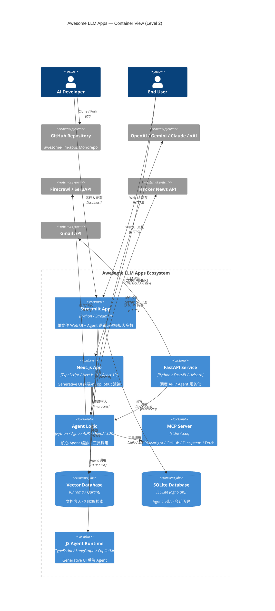

### 2.2.2 详细文字说明（400+ 字）

#### 容器定义与职责

C4 模型中的"容器"指 **可独立部署/运行的进程**。在 Awesome LLM Apps 中，我们识别出 **7 类容器**：

| 容器 | 技术栈 | 职责 | 代表子项目 |
|------|--------|------|----------|
| **Streamlit App** | Python + Streamlit | 默认前端；单文件内同时包含 UI 渲染与 Agent 调用 | travel_agent, rag_chain, deep_research |
| **Next.js App** | TypeScript + Next.js 16 + React 19 | Generative UI 前端；CopilotKit 渲染 Agent 生成的组件 | generative-ui-starter, ai-dashboard-canvas |
| **FastAPI Service** | Python + FastAPI + Uvicorn | 调度 API / Agent 服务化；接收 HTTP/PubSub 请求 | always_on_hn_briefing_agent, earnings_call_analyst |
| **Agent Logic** | Python + Agno/ADK/OpenAI SDK | 核心 Agent 编排；工具调用；记忆管理 | 所有 Agent 模板的核心 |
| **MCP Server** | stdio / SSE 进程 | 外部工具服务（Playwright/GitHub/Filesystem） | browser_mcp_agent, github_mcp_agent |
| **Vector Database** | Chroma / Qdrant | 文档嵌入存储与相似度检索 | rag_chain (Chroma), voice_rag (Qdrant) |
| **SQLite Database** | SQLite (agno.db) | Agent 记忆、会话历史、团队状态持久化 | finance_agent_team, 多数 Agno 模板 |

#### 容器间交互协议

| 交互 | 协议 | 说明 |
|------|------|------|
| Streamlit App ↔ Agent Logic | **in-process**（同进程函数调用） | 绝大多数 Starter/Advanced 模板模式 |
| Next.js App ↔ JS Agent | **HTTP / SSE** | Generative UI 前后端分离 |
| FastAPI Service ↔ Agent Logic | **in-process** | 调度 API 内嵌 Agent 调用 |
| Agent Logic ↔ LLM Provider | **HTTPS / API Key** | 出站调用 OpenAI/Gemini/Claude 等 |
| Agent Logic ↔ MCP Server | **stdio / SSE** | MCP 协议；启动子进程通信 |
| Streamlit App ↔ Vector DB | **in-process** | Chroma 本地持久化 |
| Next.js App ↔ Vector DB | **HTTP** | Qdrant 可远程部署 |
| FastAPI Service ↔ Gmail | **HTTPS OAuth2** | 邮件投递 |

#### 设计 Rationale

1. **为什么 Streamlit App 是主流容器？**：Python 开发者无需前端知识即可搭建交互界面；单文件模式降低认知负担；与 Agent Logic 同进程调用零网络开销。
2. **为什么 Next.js 独立存在？**：Generative UI 需要 React 组件级渲染、WebSocket/SSE 流式、复杂状态管理，Streamlit 无法满足。
3. **为什么 FastAPI 独立存在？**：Always-on Agent 需要接收外部调度请求（Cloud Scheduler Pub/Sub），Streamlit 不具备服务端接收能力。
4. **为什么 MCP Server 是独立容器？**：MCP 协议要求工具服务以独立进程运行（stdio 或 SSE），Agent 通过协议与之通信，实现工具与 Agent 解耦。
5. **为什么 Vector DB 有两种？**：Chroma 适合本地零配置（RAG 教程首选）；Qdrant 支持云端部署与混合搜索（Voice RAG 等高级场景）。

#### 容器部署拓扑

- **本地开发**：所有容器运行在开发者笔记本（localhost）
- **云部署**：Next.js 可部署到 Vercel/Render；FastAPI 可部署到 Cloud Run；Vector DB 可迁移到 Qdrant Cloud
- **混合模式**：Agent 在本地运行，LLM 调用在云端，Vector DB 在云端

---

## 2.3 Level 3 — 组件视图（Component View）

由于 Awesome LLM Apps 包含 100+ 子系统，无法在一张图中展示所有组件。本节按 **5 大分类** 分别绘制组件图，每个分类抽取代表性容器内部的组件结构。

### 2.3.1 Starter / Advanced Single Agent 类组件图

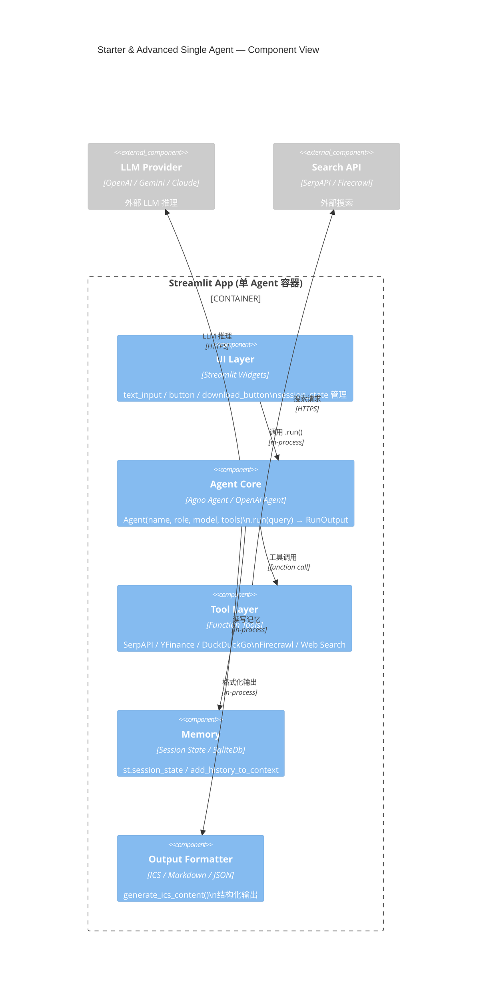

#### 组件说明

| 组件 | 职责 | 关键类/函数 | 设计模式 |
|------|------|------------|---------|
| **UI Layer** | 渲染交互界面；收集用户输入；展示结果 | `st.text_input`, `st.button`, `st.download_button`, `st.session_state` | MVC 中的 View |
| **Agent Core** | 核心推理循环；工具调度；响应生成 | `Agent(name, role, model, tools)`, `.run(query)` | Strategy（可替换模型/工具） |
| **Tool Layer** | 封装外部 API 调用；函数工具装饰器 | `SerpApiTools`, `YFinanceTools`, `@function_tool` | Command Pattern |
| **Memory** | 会话状态持久化；历史上下文注入 | `st.session_state`, `SqliteDb`, `add_history_to_context` | Memento Pattern |
| **Output Formatter** | 将 Agent 输出转为可交付格式 | `generate_ics_content()`, Markdown 渲染 | Adapter Pattern |

---

### 2.3.2 Multi-Agent Team 类组件图

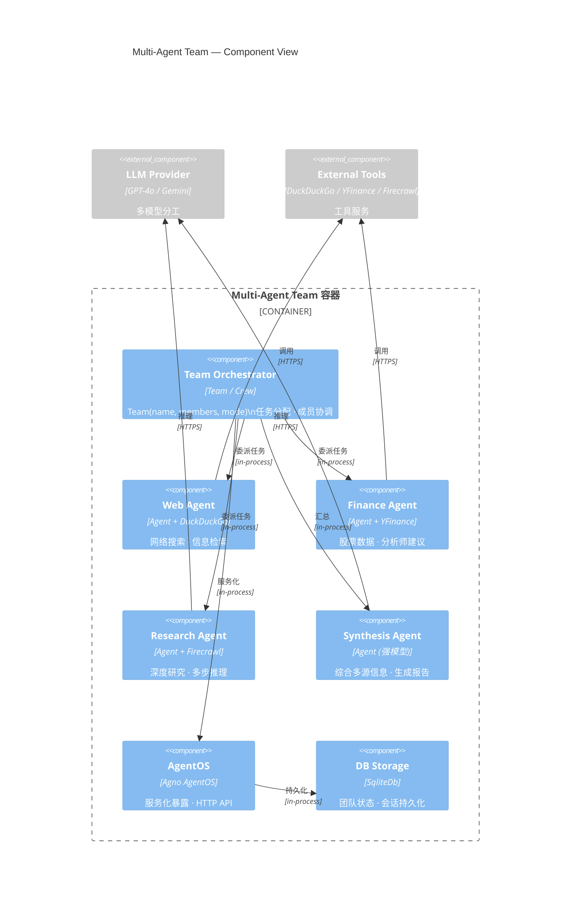

#### 组件说明

| 组件 | 职责 | 关键类/函数 | 设计模式 |
|------|------|------------|---------|
| **Team Orchestrator** | 团队协调；任务分配；成员通信 | `Team(members=[...])`, CrewAI `Crew` | Mediator Pattern |
| **Web Agent** | 网络搜索；信息检索 | `Agent(tools=[DuckDuckGoTools()])` | Specialist Role |
| **Finance Agent** | 金融数据获取 | `Agent(tools=[YFinanceTools(...)])` | Specialist Role |
| **Research Agent** | 深度研究；多步推理 | `Agent(tools=[Firecrawl])` | Specialist Role |
| **Synthesis Agent** | 综合多源信息；生成最终报告 | `Agent(model="gpt-4.1")`（强模型） | Facade Pattern |
| **AgentOS** | 将团队暴露为 HTTP 服务 | `AgentOS(teams=[...]).serve()` | Facade / Service Layer |
| **DB Storage** | 团队状态持久化 | `SqliteDb(db_file="agents.db")` | Repository Pattern |

---

### 2.3.3 Always-on Agent 类组件图

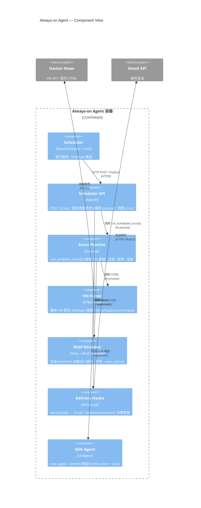

#### 组件说明

| 组件 | 职责 | 关键类/函数 | 设计模式 |
|------|------|------------|---------|
| **Scheduler** | 定时触发（Cloud Scheduler / Cron） | 外部系统 | — |
| **Scheduler API** | 接收调度请求；解析 payload；编排执行 | `FastAPI`, `run_scheduled_scout()` | Controller |
| **Scout Pipeline** | 核心管道：获取→过滤→排序→渲染 | `run_ambient_scout(live, top_n)` | Pipeline Pattern |
| **HN Parser** | 解析 Hacker News 首页 HTML | `HNFrontPageParser(HTMLParser)` | SAX-style Parser |
| **Brief Renderer** | 生成 text/html 双格式 Brief | `Story`, `Brief` dataclass | Builder Pattern |
| **Delivery Hooks** | 邮件/Webhook 投递 | `send_brief()`, `send_gmail()`, `send_webhook()` | Strategy Pattern |
| **ADK Agent** | LLM 增强的 Agent 包装 | `LlmAgent(name, model, instruction, tools)` | Facade |

---

### 2.3.4 RAG Pipeline 类组件图

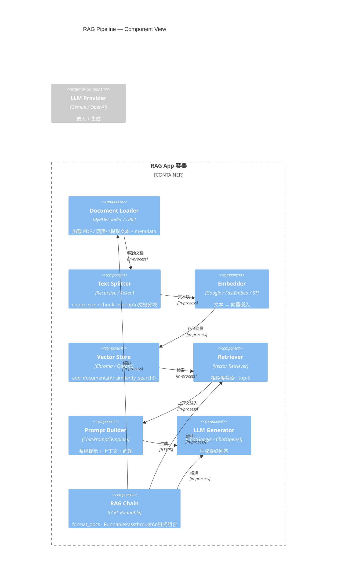

#### 组件说明

| 组件 | 职责 | 关键类/函数 | 设计模式 |
|------|------|------------|---------|
| **Document Loader** | 加载原始文档 | `PyPDFLoader`, URL loader | Factory Pattern |
| **Text Splitter** | 文档分块 | `RecursiveCharacterTextSplitter`, `SentenceTransformersTokenTextSplitter` | Strategy Pattern |
| **Embedder** | 文本向量化 | `GoogleGenerativeAIEmbeddings`, `FastEmbed`, `SentenceTransformers` | Adapter Pattern |
| **Vector Store** | 向量存储与检索 | `Chroma`, `QdrantClient` | Repository Pattern |
| **Retriever** | 相似度检索 | `as_retriever()`, `similarity_search()` | — |
| **Prompt Builder** | 构建 RAG 提示 | `ChatPromptTemplate.from_messages()` | Builder Pattern |
| **LLM Generator** | 生成最终回答 | `ChatGoogleGenerativeAI`, `ChatOpenAI` | — |
| **RAG Chain** | 链式编排 | LCEL `RunnablePassthrough` | Chain of Responsibility |

---

### 2.3.5 MCP Agent 类组件图

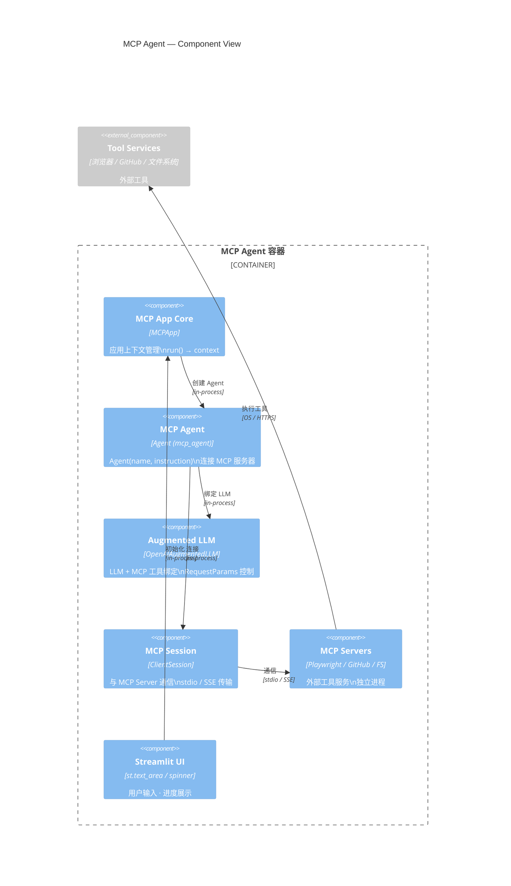

#### 组件说明

| 组件 | 职责 | 关键类/函数 | 设计模式 |
|------|------|------------|---------|
| **MCP App Core** | 应用上下文生命周期 | `MCPApp(name)`, `.run()` | Context Manager |
| **MCP Agent** | Agent 定义与服务器连接 | `Agent(instruction, mcp_servers=[...])` | Builder |
| **Augmented LLM** | LLM + 工具绑定 | `OpenAIAugmentedLLM.attach(agent)` | Decorator |
| **MCP Session** | 与 MCP Server 通信 | `ClientSession`, `stdio_client` | Session |
| **MCP Servers** | 外部工具服务进程 | Playwright / GitHub / Filesystem / Fetch | Service |
| **Streamlit UI** | 用户交互界面 | `st.text_area`, `st.spinner` | View |

---

## 2.4 Level 4 — 代码/类视图（Code / Class View）

本节选取 **4 个代表性子系统**，使用 Mermaid ClassDiagram 绘制核心类结构。

### 2.4.1 Agno 框架核心类图（基于 travel_agent / finance_agent_team）

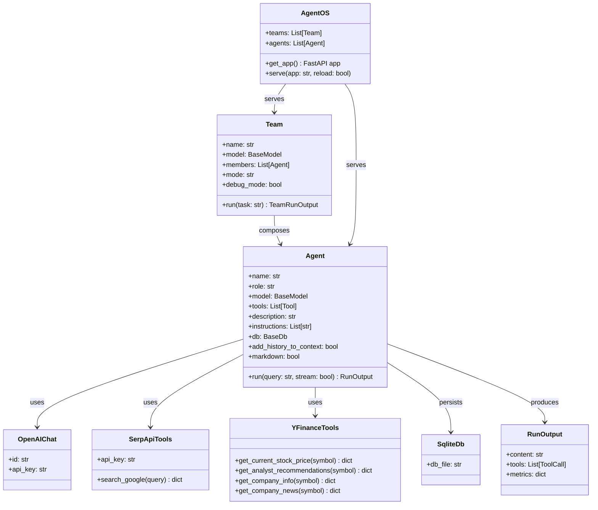

#### 类图说明

| 类 | 职责 | 关键方法/属性 | 设计模式 |
|---|------|-------------|---------|
| **Agent** | 核心 Agent 抽象 | `name`, `role`, `model`, `tools`, `run()` | Strategy（可替换 model/tools） |
| **Team** | 多 Agent 团队 | `members`, `mode`, `run()` | Mediator / Composite |
| **AgentOS** | 服务化运行时 | `get_app()`, `serve()` | Facade / Service Layer |
| **RunOutput** | Agent 运行结果 | `content`, `tools`, `metrics` | DTO |
| **OpenAIChat** | OpenAI 模型适配 | `id`, `api_key` | Adapter |
| **SqliteDb** | SQLite 持久化 | `db_file` | Repository |
| **SerpApiTools** | Google 搜索工具 | `search_google()` | Command |
| **YFinanceTools** | 金融数据工具 | `get_current_stock_price()` 等 | Command |

---

### 2.4.2 Always-on HN Briefing 类图（基于 scout.py / delivery.py）

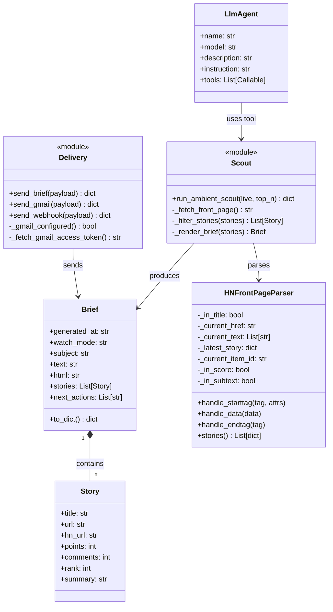

#### 类图说明

| 类/模块 | 职责 | 关键方法/属性 | 设计模式 |
|--------|------|-------------|---------|
| **Story** | HN 故事数据对象 | `title`, `url`, `points`, `comments`, `rank` | frozen dataclass（值对象） |
| **Brief** | 每日简报数据对象 | `text`, `html`, `stories`, `next_actions`, `to_dict()` | DTO / Builder |
| **HNFrontPageParser** | HN 首页 HTML 解析 | `handle_starttag/data/endtag`, `stories()` | SAX-style Parser |
| **LlmAgent** | ADK Agent 包装 | `name`, `model`, `instruction`, `tools` | Facade |
| **Delivery** | 邮件/Webhook 投递 | `send_brief()`, `send_gmail()`, `send_webhook()` | Strategy |
| **Scout** | 核心管道 | `run_ambient_scout(live, top_n)` | Pipeline |

---

### 2.4.3 DevPulse 信号智能管道类图（基于 devpulse_ai）

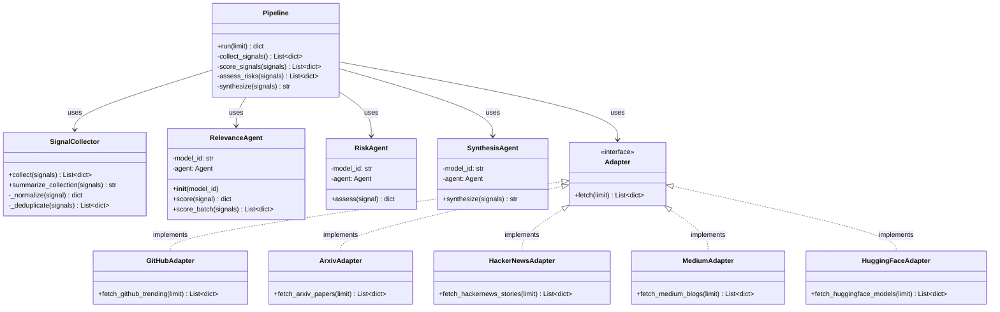

#### 类图说明

| 类 | 职责 | 关键方法/属性 | 设计模式 |
|---|------|-------------|---------|
| **SignalCollector** | 信号收集与归一化（非 Agent） | `collect()`, `summarize_collection()` | Utility / Pipeline Stage |
| **RelevanceAgent** | 相关性评分（Agent） | `score()`, `score_batch()` | Strategy（可替换模型） |
| **RiskAgent** | 风险评估（Agent） | `assess()` | Strategy |
| **SynthesisAgent** | 综合报告生成（Agent） | `synthesize()` | Facade |
| **Adapter** | 数据源适配接口 | `fetch(limit)` | Adapter / Port |
| **Pipeline** | 管道编排 | `run(limit)` | Pipeline / Template Method |

> **关键设计决策**：`SignalCollector` 是 **纯工具类（非 Agent）**，因为信号收集是确定性转换，不需要 LLM 推理。只有需要判断/推理的步骤才使用 Agent。这是仓库中"Agent 只用于需要推理的地方"这一设计哲学的体现。

---

### 2.4.4 RAG Pipeline 类图（基于 rag_chain / voice_rag）

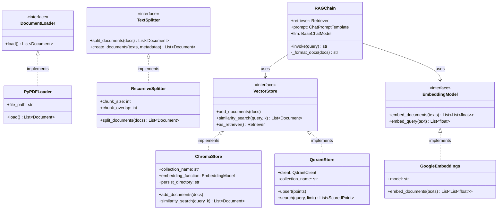

#### 类图说明

| 类 | 职责 | 关键方法/属性 | 设计模式 |
|---|------|-------------|---------|
| **DocumentLoader** | 文档加载接口 | `load()` | Strategy |
| **PyPDFLoader** | PDF 加载实现 | `file_path`, `load()` | Concrete Strategy |
| **TextSplitter** | 文本分块接口 | `split_documents()` | Strategy |
| **RecursiveSplitter** | 递归分块实现 | `chunk_size`, `chunk_overlap` | Concrete Strategy |
| **EmbeddingModel** | 嵌入接口 | `embed_documents()`, `embed_query()` | Strategy |
| **GoogleEmbeddings** | Gemini 嵌入实现 | `model="models/embedding-001"` | Concrete Strategy |
| **VectorStore** | 向量存储接口 | `add_documents()`, `similarity_search()` | Repository |
| **ChromaStore** | Chroma 实现 | `collection_name`, `persist_directory` | Concrete Repository |
| **QdrantStore** | Qdrant 实现 | `client`, `upsert()`, `search()` | Concrete Repository |
| **RAGChain** | RAG 链式编排 | `invoke()`, `_format_docs()` | Chain of Responsibility |

---

## 2.5 C4 模型总结

### 2.5.1 层级映射表

| C4 层级 | 本仓库对应 | 关键产出 |
|---------|----------|---------|
| **Context** | 整个 awesome-llm-apps 生态系统 | 外部系统边界、用户角色、交互协议 |
| **Container** | 7 类可运行进程（Streamlit/Next.js/FastAPI/MCP/VectorDB/SQLite/JSAgent） | 容器职责、交互协议、部署拓扑 |
| **Component** | 5 大分类的组件结构（Single/Multi/Always-on/RAG/MCP） | 组件职责、类/函数边界、设计模式 |
| **Code** | 4 个代表性子系统的类图（Agno/HN-Briefing/DevPulse/RAG） | 类关系、方法签名、设计模式 |

### 2.5.2 架构模式总结

| 模式 | 应用场景 | 代表实现 |
|------|---------|---------|
| **单文件 Agent** | Starter 模板 | travel_agent.py |
| **多文件模块** | Advanced 模板 | devpulse_ai/ |
| **管道模式** | Always-on / RAG | scout.py, rag_chain |
| **策略模式** | 模型/工具/向量库可替换 | Agent(model=), VectorStore |
| **中介者模式** | 多 Agent 团队 | Team, CrewAI |
| **适配器模式** | 外部 API 封装 | Adapter, EmbeddingModel |
| **外观模式** | 复杂子系统简化接口 | AgentOS, LlmAgent |
| **仓库模式** | 数据持久化 | SqliteDb, Chroma |

### 2.5.3 设计原则

1. **Agent 只用于需要推理的地方**：DevPulse 的 SignalCollector 是纯工具类，因为收集是确定性转换
2. **Provider-agnostic**：通过抽象接口（EmbeddingModel / VectorStore / BaseModel）实现可替换
3. **渐进式复杂度**：Starter（单文件）→ Advanced（多文件）→ Multi-agent（团队）→ Always-on（调度）
4. **自包含**：每个子项目独立可运行，不依赖仓库内其他子项目
5. **约定优于配置**：Streamlit 默认前端，Chroma 默认向量库，降低决策负担

---

> **下一章**：[03-系统流程与时序图.md](./03-系统流程与时序图.md) —— 10 个核心业务流程的流程图与时序图，细化到模块/函数/异常处理级别。

---

# ❤️ 制作不易，请我喝咖啡☕️关注我➕

