# 3. 系统流程与时序图（System Flows & Sequence Diagrams）

> **文档版本**：v1.0  
> **覆盖范围**：10 个核心业务流程，每个流程配 Mermaid 流程图 + 时序图 + 300-500 字说明  
> **细化级别**：模块 → 函数 → 异常处理 → 文件路径

---

## 3.0 流程总览

| # | 流程名称 | 代表子项目 | 核心模块/函数 |
|---|---------|----------|-------------|
| 3.1 | 单 Agent 旅行规划 | ai_travel_agent | `travel_agent.py` → `Agent.run()` → `generate_ics_content()` |
| 3.2 | 多 Agent 金融团队协同 | ai_finance_agent_team | `finance_agent_team.py` → `Team.run()` → `AgentOS.serve()` |
| 3.3 | Always-on HN Briefing 定时采集 | always_on_hn_briefing_agent | `scheduler_api.py` → `scout.py` → `delivery.py` |
| 3.4 | RAG 文档摄入与检索问答 | rag_chain | `app.py` → `add_to_db()` → RAG Chain |
| 3.5 | MCP Browser Agent 浏览器控制 | browser_mcp_agent | `main.py` → `MCPApp` → `ClientSession` |
| 3.6 | Generative UI 组件生成 | generative-ui-starter-project | Next.js → CopilotKit Runtime → LangGraph Agent |
| 3.7 | Voice RAG 语音问答 | voice_rag_openaisdk | `rag_voice.py` → STT → Qdrant → LLM → TTS |
| 3.8 | DevPulse 信号智能管道 | devpulse_ai | `main.py` → Adapters → Agents → Synthesis |
| 3.9 | Deep Research 深度研究 | ai_deep_research_agent | `deep_research_openai.py` → `deep_research()` |
| 3.10 | Agent Skills 自优化 | self-improving-agent-skills | backend → Gemini → 技能优化循环 |

---

## 3.1 单 Agent 旅行规划流程

### 3.1.1 代表子项目
`starter_ai_agents/ai_travel_agent/travel_agent.py`

### 3.1.2 核心函数
- `generate_ics_content(plan_text, start_date)` — ICS 日历生成
- `Agent(name, role, model, tools).run(query)` — Agno Agent 推理
- `SerpApiTools(api_key)` — Google 搜索工具

### 3.1.3 流程图

```mermaid
flowchart TD
    A[用户打开 Streamlit 页面] --> B[输入 OpenAI API Key + SerpAPI Key]
    B --> C[输入目的地 + 天数]
    C --> D[点击 Generate Itinerary]
    D --> E{API Key 已填写?}
    E -->|否| F[等待输入]
    E -->|是| G[创建 Researcher Agent<br/>model=gpt-4o, tools=SerpApiTools]
    F --> B
    G --> H[Researcher.run<br/>'Research {destination} for {n} days']
    H --> I[SerpApiTools.search_google<br/>多次搜索]
    I --> J[返回 10 条研究结果<br/>RunOutput]
    J --> K[创建 Planner Agent<br/>model=gpt-4o]
    K --> L[Planner.run<br/>整合目的地+天数+研究结果]
    L --> M[生成完整行程文本<br/>RunOutput.content]
    M --> N[存入 st.session_state.itinerary]
    N --> O[展示行程 Markdown]
    O --> P{用户点击 Download?}
    P -->|否| Q[结束]
    P -->|是| R[generate_ics_content<br/>解析 Day N 模式]
    R --> S{匹配到 Day 模式?}
    S -->|是| T[为每天创建 Event<br/>dtstart/dtend]
    S -->|否| U[创建单一全天 Event]
    T --> V[cal.to_ical → bytes]
    U --> V
    V --> W[st.download_button<br/>travel_itinerary.ics]
```

### 3.1.4 时序图

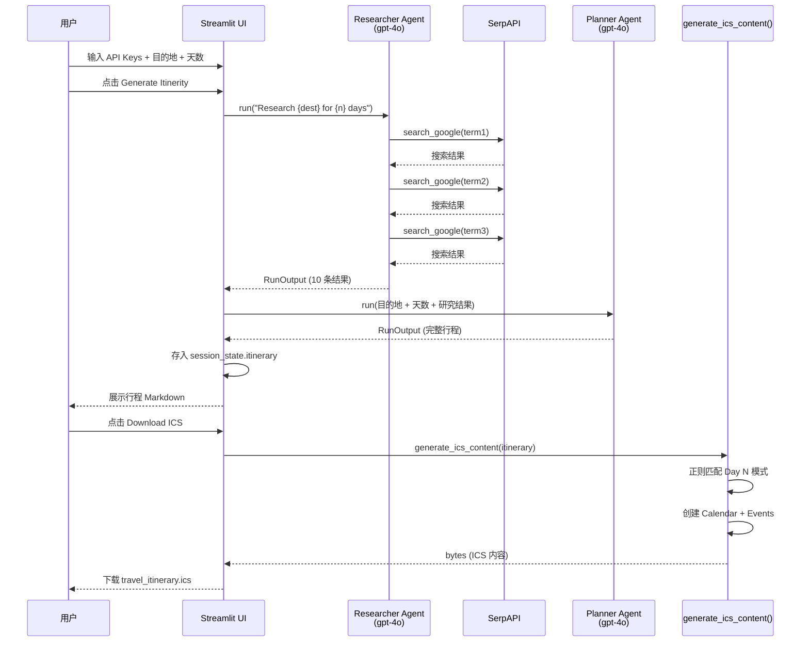

### 3.1.5 流程说明（300-500 字）

本流程展示了 **Agno 框架单 Agent 链式调用** 的完整生命周期。

**步骤逻辑**：
1. **UI 初始化**：Streamlit 渲染页面，收集 OpenAI API Key 与 SerpAPI Key（通过 `st.text_input` 密码框），初始化 `session_state.itinerary = None`。
2. **Researcher Agent 创建**：配置 `name="Researcher"`, `model=OpenAIChat(id="gpt-4o")`, `tools=[SerpApiTools(api_key=...)]`。Agent 的 `role` 和 `instructions` 指导其生成 3 个搜索词并逐一调用 `search_google`。
3. **搜索执行**：SerpApiTools 调用 Google Search API，返回结构化结果。Agent 分析后返回 10 条最相关结果（`RunOutput`）。
4. **Planner Agent 创建**：接收目的地、天数、研究结果，生成结构化行程（每日活动+住宿）。
5. **结果展示**：行程文本存入 `st.session_state.itinerary` 并在 UI 渲染。
6. **ICS 生成**：`generate_ics_content()` 使用正则 `Day (\d+)[:\s]+(.*?)(?=Day \d+|$)` 分割每日行程，为每天创建 `icalendar.Event`（全天事件），最终 `cal.to_ical()` 输出 bytes。

**异常处理**：
- API Key 未填写：UI 不显示 Generate 按钮（`if openai_api_key and serp_api_key` 守卫）
- 搜索失败：SerpApiTools 内部抛出异常，Streamlit 显示错误
- 无 Day 模式匹配：`generate_ics_content` 创建单一全天事件兜底

**涉及文件**：`travel_agent.py`（单文件完整实现）

**设计模式**：
- **Chain of Responsibility**：Researcher → Planner 链式传递
- **Strategy**：可替换模型（gpt-4o → gemini）和工具（SerpAPI → DuckDuckGo）

---

## 3.2 多 Agent 金融团队协同流程

### 3.2.1 代表子项目
`advanced_ai_agents/multi_agent_apps/agent_teams/ai_finance_agent_team/finance_agent_team.py`

### 3.2.2 核心类/函数
- `Agent(name, role, model, tools, db)` — 单 Agent 定义
- `Team(name, model, members)` — 团队编排
- `AgentOS(teams).serve()` — 服务化暴露

### 3.2.3 流程图

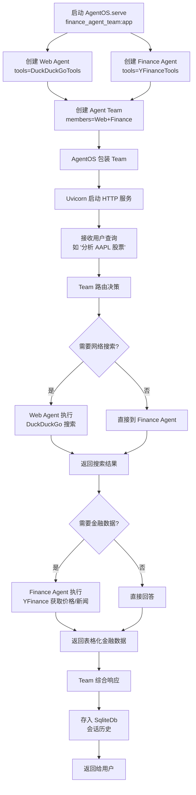

### 3.2.4 时序图

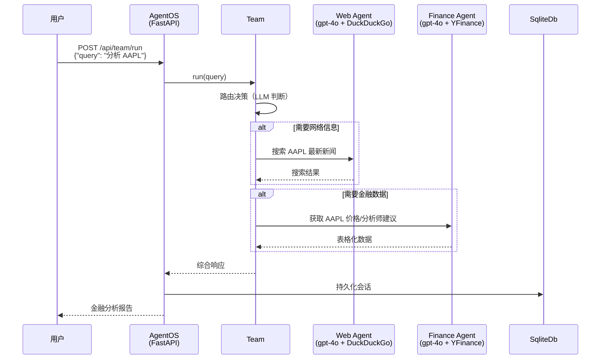

### 3.2.5 流程说明

本流程展示了 **Agno Team 多 Agent 协作** 模式。

**步骤逻辑**：
1. **Agent 定义**：Web Agent（DuckDuckGo 搜索）+ Finance Agent（YFinance 股票数据），各自配置 `db=SqliteDb(db_file="agents.db")` 和 `add_history_to_context=True`。
2. **Team 创建**：`Team(members=[web_agent, finance_agent])`，Team 自身也有模型（gpt-4o）用于路由决策。
3. **服务化**：`AgentOS(teams=[agent_team]).serve(app="finance_agent_team:app")` 将团队暴露为 FastAPI HTTP 服务。
4. **路由执行**：用户查询进入 Team，Team 的 LLM 判断需要哪些成员执行，依次/并行调用，综合结果。
5. **持久化**：会话历史存入 SQLite，支持跨请求上下文。

**关键设计**：
- **模型分工**：Web/Finance Agent 用 gpt-4o，Team 路由也用 gpt-4o
- **工具隔离**：每个 Agent 只绑定其领域工具，避免工具泛滥
- **数据库共享**：`db=db` 同一实例，团队共享记忆

---

## 3.3 Always-on HN Briefing 定时采集流程

### 3.3.1 代表子项目
`always_on_agents/always_on_hn_briefing_agent/`

### 3.3.2 核心函数
- `run_ambient_scout(live, top_n)` — 核心管道
- `fetch_hn_front_page(timeout_seconds)` — HN 首页抓取
- `curate_stories(stories, top_n)` — 过滤排序
- `render_brief(stories)` — 渲染 Brief
- `send_brief(payload)` — 投递（Gmail/Webhook）

### 3.3.3 流程图

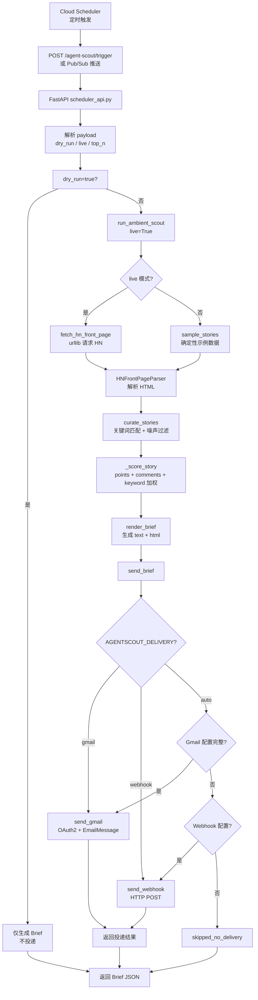

### 3.3.4 时序图

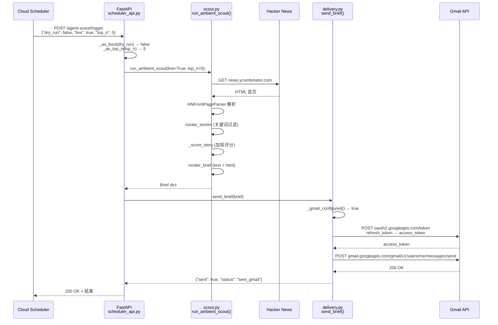

### 3.3.5 流程说明

本流程是仓库中 **最复杂的 Always-on Agent** 实现，展示了完整的"调度→采集→过滤→渲染→投递"管道。

**步骤逻辑**：
1. **调度触发**：Cloud Scheduler 定时（如每日 9:00 AM）发送 HTTP POST 到 FastAPI，或 Pub/Sub 推送。
2. **API 解析**：`scheduler_api.py` 的 `scheduler_trigger()` / `pubsub_trigger()` 解析 payload，提取 `dry_run`、`live`、`top_n` 参数。
3. **Scout 管道**：`run_ambient_scout()` 是核心：
   - `live=True`：`fetch_hn_front_page()` 用 `urllib` 抓取 HN 首页 HTML
   - `live=False`：`sample_stories()` 返回确定性示例数据（用于 demo/测试）
   - `HNFrontPageParser`（HTMLParser 子类）解析稳定 HN table markup，提取 title/url/points/comments
   - `curate_stories()` 使用 `AGENT_KEYWORDS` 集合匹配 + `NOISE_WORDS` 过滤
   - `_score_story()` 加权评分（points + comments + keyword hits）
   - `render_brief()` 生成 `Brief` 对象（text + html 双格式 + next_actions）
4. **投递**：`send_brief()` 根据配置选择 Gmail 或 Webhook：
   - Gmail：`_fetch_gmail_access_token()` 用 refresh_token 换 access_token，构建 `EmailMessage`，调用 Gmail API 发送
   - Webhook：HTTP POST 到 `AGENTSCOUT_WEBHOOK_URL`
5. **健康检查**：`GET /health` 和 `GET /agent-scout/dry-run` 用于监控和预览。

**异常处理**：
- HN 抓取超时：`fetch_hn_front_page(timeout_seconds=15)` 超时后返回空列表
- Gmail 配置不完整：`_gmail_configured()` 检查 5 个必需环境变量，缺失则降级
- Pub/Sub 认证：FastAPI 端点可添加 OIDC 验证（当前为示例级）

**涉及文件**：`scheduler_api.py`, `scout.py`, `delivery.py`, `agent.py`

---

## 3.4 RAG 文档摄入与检索问答流程

### 3.4.1 代表子项目
`rag_tutorials/rag_chain/app.py`

### 3.4.2 核心函数
- `add_to_db(uploaded_files)` — PDF 摄入
- `format_docs(docs)` — 文档格式化
- RAG Chain（LCEL）— 检索 + 提示 + 生成

### 3.4.3 流程图

```mermaid
flowchart TD
    A[用户上传 PDF 文件] --> B[add_to_db]
    B --> C[保存到临时文件<br/>./temp/{filename}]
    C --> D[PyPDFLoader<br/>加载 PDF 文本]
    D --> E[提取 metadata + page_content]
    E --> F[SentenceTransformersTokenTextSplitter<br/>chunk_size=100, overlap=50]
    F --> G[create_documents<br/>文本块 + metadata]
    G --> H[db.add_documents<br/>Chroma 持久化]
    H --> I[删除临时文件]
    I --> J[摄入完成]
    J --> K[用户输入问题]
    K --> L[Chroma similarity_search<br/>向量检索 top-k]
    L --> M[format_docs<br/>拼接上下文]
    M --> N[ChatPromptTemplate<br/>系统提示 + 上下文 + 问题]
    N --> O[ChatGoogleGenerativeAI<br/>Gemini 生成]
    O --> P[StrOutputParser<br/>解析响应]
    P --> Q[展示回答]
```

### 3.4.4 时序图

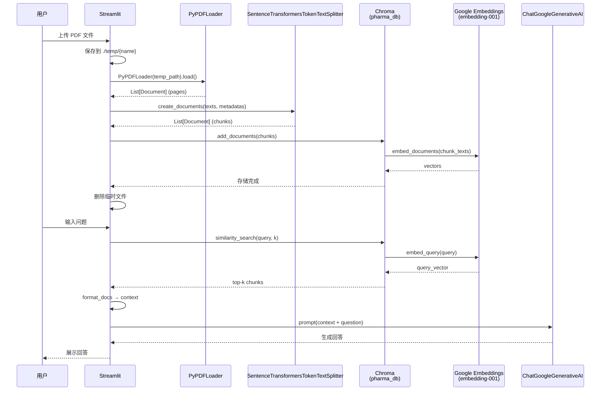

### 3.4.5 流程说明

本流程展示 **经典 RAG 管道**（Load → Split → Embed → Store → Retrieve → Generate）。

**步骤逻辑**：
1. **文档摄入**：`add_to_db()` 接收 Streamlit 上传的 PDF，保存临时文件 → PyPDFLoader 加载 → SentenceTransformersTokenTextSplitter 分块（chunk_size=100 tokens, overlap=50）→ Chroma `add_documents()` 持久化到 `./pharma_db`。
2. **嵌入模型**：`GoogleGenerativeAIEmbeddings(model="models/embedding-001")` 将文本块转为向量。
3. **检索问答**：用户输入问题 → Chroma `similarity_search()` 检索 top-k → `format_docs()` 拼接上下文 → `ChatPromptTemplate` 构建提示 → `ChatGoogleGenerativeAI` 生成 → `StrOutputParser` 解析。

**关键设计**：
- **LCEL 链式**：使用 LangChain Expression Language 的 `RunnablePassthrough` 组合
- **持久化**：Chroma `persist_directory` 保证重启后数据不丢失
- **Token 级切分**：`SentenceTransformersTokenTextSplitter` 比字符切分更精确

**异常处理**：
- 无文件上传：`st.error("No files uploaded!")`
- PDF 加载失败：PyPDFLoader 抛出异常

---

## 3.5 MCP Browser Agent 浏览器控制流程

### 3.5.1 代表子项目
`mcp_ai_agents/browser_mcp_agent/main.py`

### 3.5.2 核心类/函数
- `MCPApp(name)` — MCP 应用上下文
- `Agent(instruction, mcp_servers)` — MCP Agent
- `OpenAIAugmentedLLM` — LLM + 工具绑定
- `ClientSession` — MCP 会话

### 3.5.3 流程图

```mermaid
flowchart TD
    A[用户输入浏览器命令<br/>如 'Go to github.com'] --> B[Streamlit 渲染]
    B --> C[初始化 MCPApp<br/>name=streamlit_mcp_agent]
    C --> D[mcp_app.run()<br/>→ context]
    D --> E[context.__aenter__<br/>启动 MCP 运行时]
    E --> F[创建 browser_agent<br/>instruction + mcp_servers=playwright]
    F --> G[OpenAIAugmentedLLM<br/>绑定 Agent]
    G --> H[ClientSession 连接<br/>Playwright MCP Server<br/>npx @playwright/mcp]
    H --> H2[stdio 通信<br/>JSON-RPC]
    H2 --> I[agent.run(query)<br/>LLM 决策工具调用]
    I --> J{需要浏览器操作?}
    J -->|是| K[Playwright MCP<br/>执行 click/scroll/navigate]
    J -->|否| L[直接回答]
    K --> M[返回操作结果]
    L --> M
    M --> N[流式输出到 UI]
    N --> O[展示结果]
```

### 3.5.4 时序图

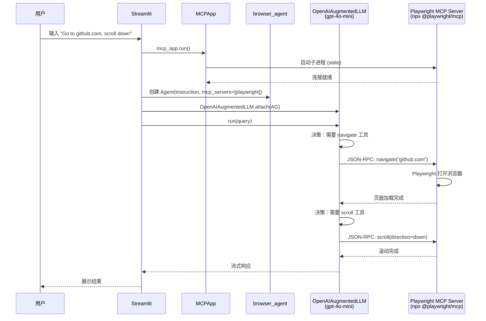

### 3.5.5 流程说明

本流程展示 **MCP 协议** 在浏览器自动化中的应用。

**步骤逻辑**：
1. **MCPApp 初始化**：`MCPApp(name="streamlit_mcp_agent")` 创建应用上下文，`mcp_app.run()` 返回异步上下文管理器。
2. **Agent 创建**：`Agent(instruction="...", mcp_servers=[playwright_config])` 定义 Agent 能力边界。
3. **LLM 绑定**：`OpenAIAugmentedLLM.attach(agent)` 将 LLM 与 Agent 的工具绑定。
4. **MCP 通信**：`ClientSession` 通过 stdio 与 Playwright MCP Server 通信（JSON-RPC 协议）。
5. **工具执行**：LLM 决策调用 `navigate`/`click`/`scroll` 等工具，Playwright 执行真实浏览器操作。

**关键设计**：
- **stdio 传输**：MCP Server 作为子进程启动，通过 stdin/stdout 通信
- **配置驱动**：`mcp_agent.config.yaml` 定义服务器配置
- **流式输出**：`progress_display: true` 实时展示进度

---

## 3.6 Generative UI 组件生成流程

### 3.6.1 代表子项目
`generative_ui_agents/generative-ui-starter-project/`

### 3.6.2 核心组件
- Next.js 16 + React 19 前端
- CopilotKit Runtime + a2ui-renderer
- LangGraph Agent 后端
- AG-UI 协议

### 3.6.3 流程图

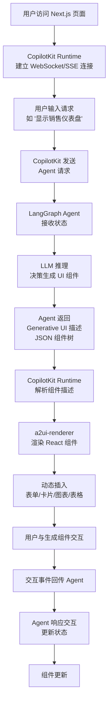

### 3.6.4 时序图

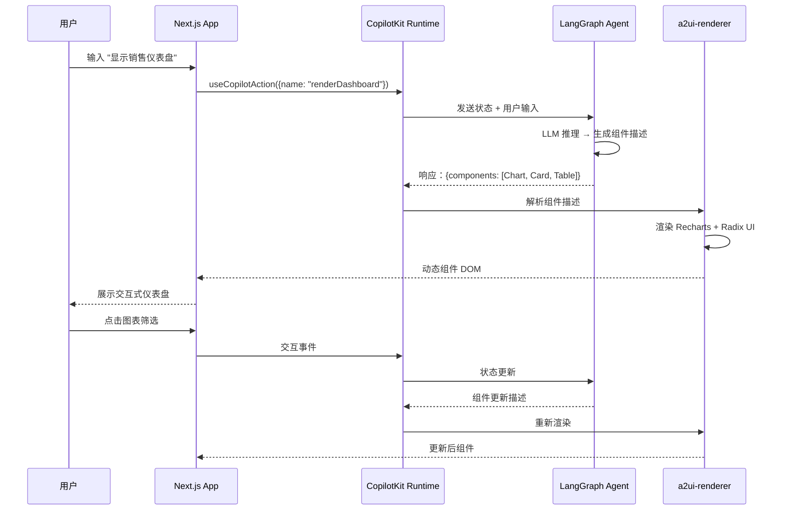

### 3.6.5 流程说明

本流程展示 **Generative UI** —— Agent 不仅输出文本，还渲染可交互 UI 组件。

**步骤逻辑**：
1. **前后端分离**：Next.js 前端通过 CopilotKit Runtime 与 LangGraph Agent 后端通信（WebSocket/SSE）。
2. **Agent 推理**：LangGraph Agent 接收用户输入，LLM 决策需要生成哪些 UI 组件（图表/卡片/表格/表单）。
3. **组件渲染**：`a2ui-renderer` 解析 Agent 返回的组件描述 JSON，动态渲染 React 组件（Recharts 图表 + Radix UI 组件）。
4. **交互闭环**：用户与生成组件交互（点击/筛选/输入），事件回传 Agent，Agent 更新状态并重新渲染。

**关键设计**：
- **AG-UI 协议**：Agent-UI 通信的标准协议
- **CopilotKit**：连接 Agent 与 React 的桥梁
- **动态渲染**：组件在运行时生成，非预定义

---

## 3.7 Voice RAG 语音问答流程

### 3.7.1 代表子项目
`voice_ai_agents/voice_rag_openaisdk/rag_voice.py`

### 3.7.2 核心函数
- `setup_qdrant()` — Qdrant 客户端初始化
- `process_pdf(file)` — PDF 处理
- `store_embeddings()` — 嵌入存储
- `setup_agents()` — Processor + TTS Agent 创建
- `process_query()` — 语音问答主流程

### 3.7.3 流程图

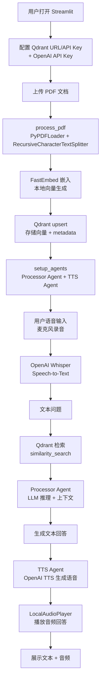

### 3.7.4 时序图

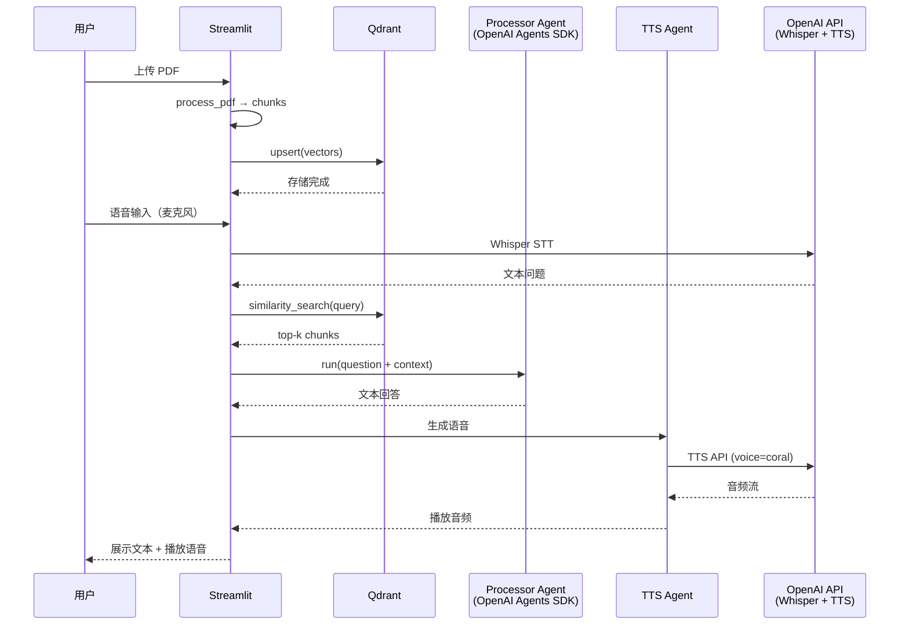

### 3.7.5 流程说明

本流程展示 **语音 + RAG** 的完整闭环。

**步骤逻辑**：
1. **配置**：用户输入 Qdrant URL/API Key + OpenAI API Key，选择语音（coral/alloy/echo 等 11 种）。
2. **文档摄入**：PDF → PyPDFLoader → RecursiveCharacterTextSplitter → FastEmbed 嵌入 → Qdrant upsert。
3. **语音输入**：麦克风录音 → OpenAI Whisper STT → 文本问题。
4. **RAG 检索**：Qdrant similarity_search → 上下文注入 Processor Agent。
5. **语音输出**：Processor Agent 生成文本回答 → TTS Agent 调用 OpenAI TTS → LocalAudioPlayer 播放。

**关键设计**：
- **双 Agent**：Processor（推理）+ TTS（语音生成）分离
- **本地嵌入**：FastEmbed 无需 API Key
- **语音选择**：11 种 OpenAI 语音可选

---

## 3.8 DevPulse 信号智能管道流程

### 3.8.1 代表子项目
`advanced_ai_agents/multi_agent_apps/devpulse_ai/`

### 3.8.2 核心函数
- `collect_signals(limit)` — 信号收集
- `SignalCollector.collect()` — 归一化去重
- `RelevanceAgent.score_batch()` — 相关性评分
- `RiskAgent.assess_batch()` — 风险评估
- `SynthesisAgent.synthesize()` — 综合报告

### 3.8.3 流程图

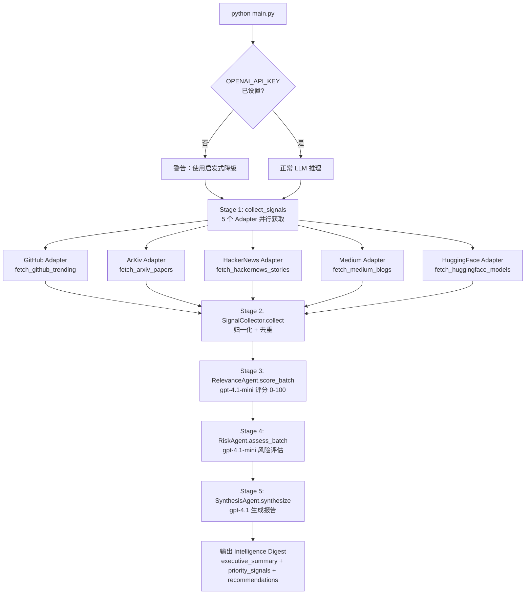

### 3.8.4 时序图

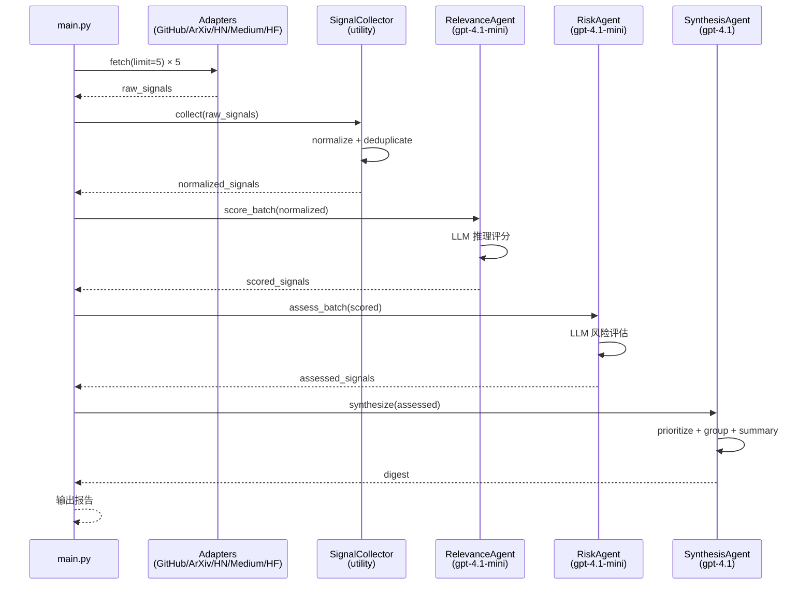

### 3.8.5 流程说明

本流程是仓库中 **架构最清晰的多 Agent 管道**，体现了"Agent 只用于需要推理的地方"的设计哲学。

**步骤逻辑**：
1. **信号收集**（无 LLM）：5 个 Adapter 分别从 GitHub/ArXiv/HN/Medium/HF 获取原始信号。
2. **归一化**（无 LLM）：`SignalCollector.collect()` 将异构信号归一化为统一 schema，使用 `source:id` 复合键去重。
3. **相关性评分**（Agent）：`RelevanceAgent` 使用 gpt-4.1-mini（快速廉价）对每条信号评分 0-100，附带理由。
4. **风险评估**（Agent）：`RiskAgent` 使用 gpt-4.1-mini 评估风险等级（LOW/MEDIUM/HIGH/CRITICAL）。
5. **综合报告**（Agent）：`SynthesisAgent` 使用 gpt-4.1（最强推理）生成执行摘要、优先级信号、可操作建议。

**降级策略**：无 API Key 时，Agent 使用启发式评分（基于关键词匹配、stars 数量等）。

**模型分工**：
- 分类任务（评分/风险）→ gpt-4.1-mini（快速廉价）
- 综合任务（报告）→ gpt-4.1（最强推理）

---

## 3.9 Deep Research 深度研究流程

### 3.9.1 代表子项目
`advanced_ai_agents/single_agent_apps/ai_deep_research_agent/deep_research_openai.py`

### 3.9.2 核心函数
- `deep_research(query, max_depth, time_limit, max_urls)` — Firecrawl 深度研究工具
- `run_research_process(topic)` — 研究流程编排

### 3.9.3 流程图

```mermaid
flowchart TD
    A[用户输入研究主题] --> B[创建 OpenAI Agent<br/>tools=deep_research]
    B --> C[Agent.run(topic)]
    C --> D[LLM 决策调用<br/>deep_research tool]
    D --> E[FirecrawlApp.deep_research<br/>params: maxDepth/timeLimit/maxUrls]
    E --> F[Firecrawl 执行<br/>多步网页抓取 + 分析]
    F --> G[on_activity 回调<br/>实时进度更新]
    G --> H[返回 final_analysis<br/>+ sources]
    H --> I[Agent 综合结果]
    I --> J[trace 记录<br/>可观测性]
    J --> K[展示研究报告]
```

### 3.9.4 时序图

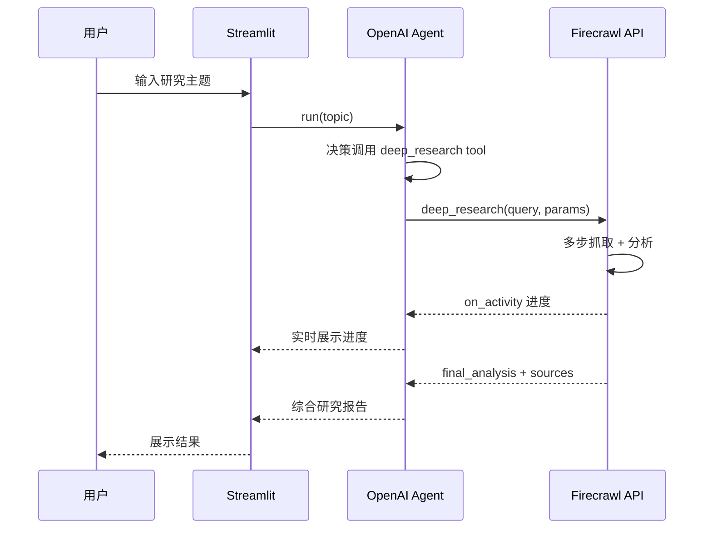

### 3.9.5 流程说明

本流程展示 **OpenAI Agents SDK + Firecrawl** 的深度研究模式。

**步骤逻辑**：
1. **Agent 创建**：使用 OpenAI Agents SDK 创建 Agent，绑定 `deep_research` 函数工具。
2. **工具调用**：LLM 决策调用 `deep_research`，传入 `max_depth`、`time_limit`、`max_urls` 参数。
3. **Firecrawl 执行**：Firecrawl API 执行多步网页抓取、内容提取、综合分析。
4. **实时进度**：`on_activity` 回调实时更新 UI 进度。
5. **结果综合**：Agent 将 Firecrawl 的 `final_analysis` 与自身推理结合，生成最终报告。

**关键设计**：
- **@function_tool 装饰器**：将 Python 函数转为 Agent 工具
- **trace 上下文**：`with trace(...)` 实现可观测性
- **实时反馈**：`on_activity` 回调 + `st.spinner` 进度展示

---

## 3.10 Agent Skills 自优化流程

### 3.10.1 代表子项目
`awesome_agent_skills/self-improving-agent-skills/`

### 3.10.2 核心概念
- Agent Skill 文件（Markdown 格式）
- Gemini 驱动的技能优化
- ADK 执行环境

### 3.10.3 流程图

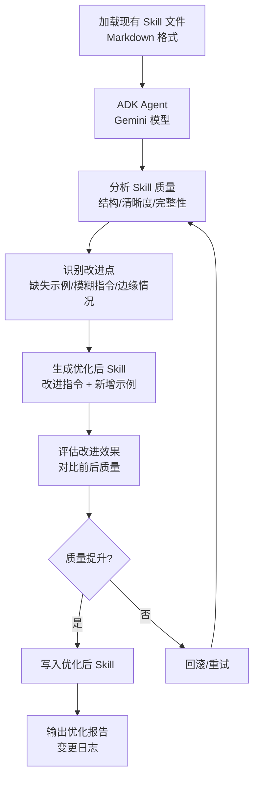

### 3.10.4 流程说明

本流程展示 **Agent Skills 自优化** —— Agent 自动改进自身的技能文件。

**步骤逻辑**：
1. **加载 Skill**：读取 Markdown 格式的 Agent Skill 文件。
2. **质量分析**：Gemini 模型分析 Skill 的结构、清晰度、完整性。
3. **改进生成**：识别缺失示例、模糊指令、未覆盖的边缘情况，生成优化版本。
4. **效果评估**：对比前后质量，确认提升。
5. **写入/回滚**：质量提升则写入，否则回滚重试。

**关键设计**：
- **自指改进**：Agent 改进自身的技能定义
- **评估闭环**：生成 → 评估 → 确认/回滚
- **ADK 执行**：使用 Google ADK 作为执行环境

---

## 3.11 流程总结

### 3.11.1 流程模式分类

| 模式 | 代表流程 | 核心特征 |
|------|---------|---------|
| **单 Agent 链式** | 3.1 旅行规划 | Researcher → Planner 链式传递 |
| **多 Agent 团队** | 3.2 金融团队 | Team 路由 + 成员协作 |
| **定时管道** | 3.3 HN Briefing | 调度 → 采集 → 过滤 → 渲染 → 投递 |
| **RAG 管道** | 3.4 RAG 问答 | Load → Split → Embed → Store → Retrieve → Generate |
| **MCP 工具调用** | 3.5 Browser Agent | Agent ↔ MCP Server（stdio JSON-RPC） |
| **Generative UI** | 3.6 组件生成 | Agent 渲染可交互 React 组件 |
| **语音闭环** | 3.7 Voice RAG | STT → RAG → TTS |
| **信号管道** | 3.8 DevPulse | Adapter → Collector → Agent → Synthesis |
| **深度研究** | 3.9 Deep Research | Agent + Firecrawl 多步抓取 |
| **自优化** | 3.10 Skills | Agent 改进自身技能文件 |

### 3.11.2 异常处理模式

| 异常类型 | 处理策略 | 代表实现 |
|---------|---------|---------|
| **API Key 缺失** | UI 守卫 + 启发式降级 | DevPulse 无 API Key 时启发式评分 |
| **网络超时** | 超时参数 + 空结果兜底 | `fetch_hn_front_page(timeout=15)` |
| **配置不完整** | 配置检查 + 降级投递 | `_gmail_configured()` 检查 |
| **解析失败** | 正则无匹配兜底 | `generate_ics_content` 单一事件兜底 |
| **LLM 失败** | 重试 + 启发式 fallback | DevPulse 启发式评分 |

---

> **下一章**：[04-模块结构与依赖分析.md](./04-模块结构与依赖分析.md) —— 完整目录树、模块职责矩阵、依赖关系图。

---

# ❤️ 制作不易，请我喝咖啡☕️关注我➕

