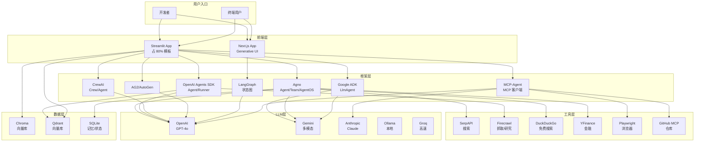
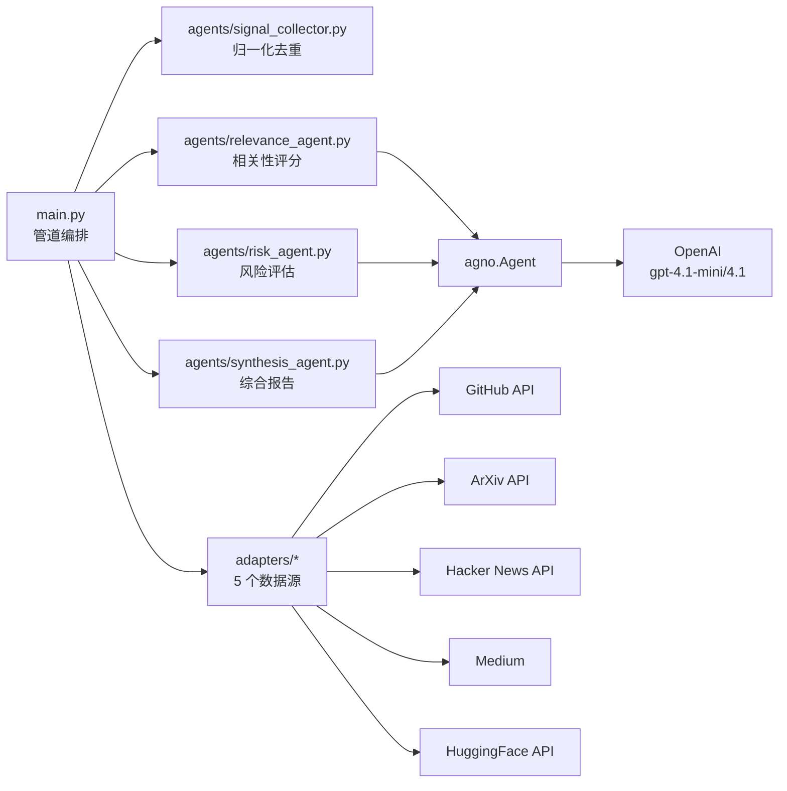

# 4. 模块/包结构与依赖分析（Module Structure & Dependency Analysis）

> **文档版本**：v1.0  
> **分析范围**：awesome-llm-apps 仓库全量目录结构（1768 文件 / 100+ 子项目）  
> **产出**：完整目录树、模块职责矩阵、依赖关系图

---

## 4.0 方法论说明

本章从三个维度分析仓库结构：

1. **目录结构树**：完整的文件系统层级（深度 3-4）
2. **模块职责矩阵**：每个主要目录的功能、输入、输出、依赖
3. **依赖关系图**：Mermaid 图展示模块间依赖

> **注意**：Awesome LLM Apps 是 Monorepo 模板集合，"模块"在此语境下指 **目录级功能单元**（子项目/分类目录），而非传统意义的 Python package。

---

## 4.1 完整项目目录结构树

### 4.1.1 仓库根层级（深度 1-2）

```
awesome-llm-apps/                          ← Monorepo 根目录
├── .git/                                  ← Git 版本控制
├── .github/                               ← GitHub 配置
│   └── workflows/
│       └── claude.yml                     ← Claude PR Assistant CI
├── .gitignore                             ← 忽略 .pyc/.env/venv/node_modules
├── LICENSE                                ← Apache-2.0
├── README.md                              ← 主文档（349 行，含完整分类导览）
├── docs/                                  ← 文档资源
│   └── banner/                            ← README 横幅图片
├── starter_ai_agents/                     ← 🌱 入门级单文件 Agent（16 个）
├── advanced_ai_agents/                    ← 🚀 生产级单/多 Agent
│   ├── single_agent_apps/                 ← 单 Agent 高级应用（18 个）
│   ├── multi_agent_apps/                  ← 多 Agent 应用
│   │   ├── agent_teams/                   ← 团队协作模板（13 个）
│   │   └── ...                            ← 其他多 Agent 应用（7 个）
│   └── autonomous_game_playing_agent_apps/← 游戏 Agent（3 个）
├── advanced_llm_apps/                     ← 🛠️ 高级 LLM 应用
│   ├── chat_with_X_tutorials/             ← Chat with X（6 个）
│   ├── llm_apps_with_memory_tutorials/     ← 记忆应用（6 个）
│   ├── llm_optimization_tools/            ← 优化工具（2 个）
│   ├── llm_finetuning_tutorials/          ← 微调教程（2 个）
│   ├── cursor_ai_experiments/             ← Cursor 实验（2 个）
│   ├── chat-with-tarots/                  ← 塔罗牌聊天
│   ├── gpt_oss_critique_improvement_loop/ ← GPT-OSS 批判改进
│   ├── multimodal_video_moment_finder/    ← 视频时刻查找
│   ├── resume_job_matcher/                ← 简历匹配
│   └── thinkpath_chatbot_app/             ← ThinkPath 聊天
├── always_on_agents/                      ← 🛰️ 始终在线 Agent（1 个）
├── voice_ai_agents/                       ← 🗣️ 语音 Agent（4 个）
├── mcp_ai_agents/                         ← ♾️ MCP Agent（6 个）
├── rag_tutorials/                         ← 📀 RAG 教程（22 个）
├── awesome_agent_skills/                  ← 🧩 Agent 技能（19 个）
├── generative_ui_agents/                  ← 🖼️ 生成式 UI（7 个）
└── ai_agent_framework_crash_course/       ← 🧑‍🏫 框架教程
    ├── google_adk_crash_course/           ← Google ADK（9 章）
    └── openai_sdk_crash_course/           ← OpenAI SDK（11 章）
```

### 4.1.2 代表性子项目内部结构

#### 单文件模板（Starter 模式）
```
ai_travel_agent/
├── README.md                              ← 使用说明
├── travel_agent.py                        ← 单文件完整实现（Agent + UI + ICS 生成）
├── local_travel_agent.py                  ← 本地版本
└── requirements.txt                       ← 依赖清单
```

#### 多文件模块模板（Advanced 模式）
```
devpulse_ai/
├── main.py                                ← 入口 + 管道编排
├── requirements.txt                       ← 依赖
├── README.md                              ← 文档
├── verify.py                              ← 验证脚本
├── streamlit_app.py                       ← Streamlit 前端
├── agents/                                ← Agent 模块
│   ├── __init__.py                        ← 导出 SignalCollector/RelevanceAgent/RiskAgent/SynthesisAgent
│   ├── signal_collector.py                ← 信号收集（非 Agent）
│   ├── relevance_agent.py                 ← 相关性评分 Agent
│   ├── risk_agent.py                      ← 风险评估 Agent
│   └── synthesis_agent.py                 ← 综合报告 Agent
├── adapters/                              ← 数据源适配
│   ├── github.py                          ← GitHub Trending
│   ├── arxiv.py                           ← ArXiv 论文
│   ├── hackernews.py                      ← Hacker News
│   ├── medium.py                          ← Medium 博客
│   └── huggingface.py                     ← HuggingFace 模型
└── workflows/                             ← 工作流定义
    └── signal-intelligence-pipeline.json  ← 管道配置
```

#### Always-on Agent（生产级）
```
always_on_hn_briefing_agent/
├── __init__.py                            ← 包初始化
├── agent.py                               ← ADK LlmAgent 定义
├── scout.py                               ← 核心管道（388 行）
├── delivery.py                            ← 投递钩子（202 行）
├── scheduler_api.py                       ← FastAPI 调度 API
├── requirements.txt                       ← google-adk + fastapi + uvicorn
├── README.md                              ← 文档
├── assets/                                ← 静态资源
└── tests/                                 ← 测试
    ├── eval/                              ← 评估测试
    └── unit/                              ← 单元测试
```

#### Generative UI（Next.js）
```
generative-ui-starter-project/
├── package.json                           ← npm 依赖
├── next.config.ts                         ← Next.js 配置
├── tsconfig.json                          ← TypeScript 配置
├── postcss.config.mjs                     ← PostCSS 配置
├── Dockerfile                             ← Docker 构建
├── docker-compose.test.yml                ← 测试编排
├── CLAUDE.md                              ← AI 辅助开发规范
├── agent/                                 ← Agent 后端
│   ├── main.py                            ← Agent 入口
│   ├── langgraph.json                     ← LangGraph 配置
│   └── pyproject.toml                     ← Python 依赖
├── src/                                   ← Next.js 前端源码
│   ├── app/                               ← App Router
│   │   ├── api/                           ← API 路由
│   │   ├── declarative-generative-ui/     ← 声明式生成 UI
│   │   ├── layout.tsx                     ← 根布局
│   │   ├── page.tsx                       ← 首页
│   │   └── globals.css                    ← 全局样式
│   ├── components/                        ← React 组件
│   ├── hooks/                             ← 自定义 Hooks
│   └── lib/                               ← 工具库
├── scripts/                               ← 开发脚本
├── docker/                                ← Docker 配置
├── fixtures/                              ← 测试夹具
└── public/                                ← 静态资源
```

#### MCP Agent（配置驱动）
```
browser_mcp_agent/
├── README.md                              ← 使用说明
├── main.py                                ← Streamlit + MCP-Agent 主程序
├── mcp_agent.config.yaml                  ← MCP 服务器配置
├── mcp_agent.secrets.yaml.example         ← 密钥模板
└── requirements.txt                       ← 依赖
```

#### RAG 教程
```
rag_chain/
├── README.md                              ← 使用说明
├── app.py                                 ← Streamlit + LangChain RAG
└── requirements.txt                       ← 依赖
```

#### Framework Crash Course
```
google_adk_crash_course/
├── README.md                              ← 课程概览
├── 1_starter_agent/                       ← 第 1 章
├── 2_model_agnostic_agent/                ← 第 2 章
├── 3_structured_output_agent/             ← 第 3 章
├── 4_tool_using_agent/                    ← 第 4 章
├── 5_memory_agent/                        ← 第 5 章
├── 6_callbacks/                           ← 第 6 章
├── 7_plugins/                             ← 第 7 章
├── 8_simple_multi_agent/                  ← 第 8 章
├── 9_multi_agent_patterns/                ← 第 9 章
└── adk_yaml_examples/                     ← YAML 配置示例
```

#### Agent Skills
```
awesome_agent_skills/
├── README.md                              ← 技能总览
├── academic-researcher/                   ← 学术研究员
├── code-reviewer/                         ← 代码审查员
│   └── rules/                             ← 审查规则
├── content-creator/                       ← 内容创作者
├── data-analyst/                          ← 数据分析师
├── debugger/                              ← 调试器
├── decision-helper/                       ← 决策助手
├── deep-research/                         ← 深度研究员
├── editor/                                ← 编辑
├── email-drafter/                         ← 邮件起草
├── fact-checker/                          ← 事实核查
├── fullstack-developer/                   ← 全栈开发者
├── meeting-notes/                         ← 会议记录
├── project-planner/                       ← 项目规划
├── python-expert/                         ← Python 专家
├── self-improving-agent-skills/           ← 自优化技能
│   ├── backend/                           ← 后端逻辑
│   ├── frontend/                          ← 前端界面
│   └── example_skills/                    ← 示例技能
├── sprint-planner/                        ← 冲刺规划
├── strategy-advisor/                      ← 策略顾问
├── technical-writer/                      ← 技术写作
├── ux-designer/                           ← UX 设计师
└── visualization-expert/                  ← 可视化专家
```

---

## 4.2 模块职责矩阵

### 4.2.1 顶级目录职责

| 目录 | 子项目数 | 功能定位 | 输入 | 输出 | 核心依赖 |
|------|---------|---------|------|------|---------|
| **starter_ai_agents/** | 16 | 单文件入门模板 | API Key + 用户输入 | Agent 响应 + 可选文件 | agno, openai, streamlit |
| **advanced_ai_agents/single/** | 18 | 生产级单 Agent | API Key + 复杂输入 | 结构化输出 + 工具调用 | agno, openai-agents, ADK |
| **advanced_ai_agents/multi/** | 20 | 多 Agent 团队协作 | 多源数据 + 用户查询 | 综合报告 + 协作推理 | agno, crewai, AG2 |
| **advanced_ai_agents/game/** | 3 | 游戏 AI | 游戏状态 | 策略决策 | openai, agno |
| **advanced_llm_apps/** | ~15 | RAG/记忆/Chat/优化/微调 | 文档/数据源 | 聊天界面/优化结果 | langchain, ollama, groq |
| **always_on_agents/** | 1 | 定时/事件驱动 Agent | 调度信号 | 邮件/Webhook 投递 | google-adk, fastapi |
| **voice_ai_agents/** | 4 | 语音 Agent | 音频输入 | 音频输出 + 文本 | openai-agents, qdrant |
| **mcp_ai_agents/** | 6 | MCP 协议 Agent | 用户命令 | 工具执行结果 | mcp, mcp-agent, anthropic |
| **rag_tutorials/** | 22 | RAG 教程矩阵 | 文档/URL | 检索增强回答 | langchain, chroma, qdrant |
| **awesome_agent_skills/** | 19 | 可复用 Agent 技能 | 任务描述 | 技能执行结果 | gemini, ADK |
| **generative_ui_agents/** | 7 | 生成式 UI | 用户请求 | 可交互 React 组件 | next.js, copilotkit, langgraph |
| **ai_agent_framework_crash_course/** | 2 课程 | 框架深度教程 | 学习者 | 框架掌握 | google-adk, openai-agents |

### 4.2.2 子项目内部模块职责（以 DevPulse 为例）

| 模块/文件 | 职责 | 输入 | 输出 | 依赖 |
|----------|------|------|------|------|
| **main.py** | 入口 + 管道编排 | CLI 调用 | 控制台输出 + digest | agents.*, adapters.* |
| **agents/signal_collector.py** | 信号归一化去重（非 Agent） | 原始信号列表 | 标准化信号列表 | datetime |
| **agents/relevance_agent.py** | 相关性评分（Agent） | 信号列表 | 带评分的信号列表 | agno, openai |
| **agents/risk_agent.py** | 风险评估（Agent） | 带评分信号 | 带风险等级信号 | agno, openai |
| **agents/synthesis_agent.py** | 综合报告（Agent） | 评估后信号 | Intelligence Digest | agno, openai |
| **adapters/github.py** | GitHub Trending 获取 | limit 参数 | 信号字典列表 | httpx |
| **adapters/arxiv.py** | ArXiv 论文获取 | limit 参数 | 信号字典列表 | httpx |
| **adapters/hackernews.py** | HN 故事获取 | limit 参数 | 信号字典列表 | httpx |
| **adapters/medium.py** | Medium 博客获取 | limit 参数 | 信号字典列表 | httpx |
| **adapters/huggingface.py** | HF 模型获取 | limit 参数 | 信号字典列表 | httpx |

### 4.2.3 跨子项目共享模式

虽然子项目独立，但存在以下共享模式：

| 共享模式 | 实现方式 | 示例 |
|---------|---------|------|
| **requirements.txt** | 每个子项目独立 | 53 个 requirements.txt，无统一依赖管理 |
| **README.md** | 每个子项目独立 | 202 个 README，统一模板结构 |
| **工具函数** | 内联实现 | `format_docs()` 在多个 RAG 模板中重复实现 |
| **Agent 配置** | 内联定义 | 每个模板独立定义 Agent(name, role, model, tools) |
| **环境变量** | `.env` / Streamlit 输入 | API Key 通过环境变量或 UI 输入 |
| **CLAUDE.md** | 部分子项目有 | generative-ui-starter-project/CLAUDE.md |

---

## 4.3 模块间依赖关系图

### 4.3.1 分类间依赖图（宏观）



### 4.3.2 子项目内部依赖图（以 DevPulse 为例）



### 4.3.3 依赖传递层级

```
用户代码（main.py / travel_agent.py）
    ↓
Agent 框架（agno / google-adk / openai-agents）
    ↓
LLM SDK（openai / google-genai / anthropic）
    ↓
HTTP 客户端（httpx / urllib / requests）
    ↓
外部 API（api.openai.com / generativelanguage.googleapis.com / ...）
```

---

## 4.4 依赖统计与热度分析

### 4.4.1 第三方库使用频率（基于 requirements.txt 统计）

| 库名 | 使用次数 | 类别 | 说明 |
|------|---------|------|------|
| **streamlit** | 45+ | 前端 | 默认 UI 框架 |
| **agno** | 25+ | Agent 框架 | 仓库首选框架 |
| **openai** | 20+ | LLM | OpenAI SDK |
| **google-generativeai / google-genai** | 10+ | LLM | Gemini SDK |
| **langchain-community** | 10+ | RAG | 文档加载/工具 |
| **langchain-chroma / chromadb** | 8+ | 向量库 | Chroma 存储 |
| **qdrant-client** | 7+ | 向量库 | Qdrant 存储 |
| **duckduckgo-search** | 7+ | 搜索 | 免费搜索 |
| **google-adk** | 6+ | Agent 框架 | Google ADK |
| **openai-agents** | 6+ | Agent 框架 | OpenAI SDK |
| **firecrawl-py** | 6+ | 抓取 | 网页抓取/研究 |
| **mcp** | 5+ | 协议 | MCP 客户端 |
| **anthropic** | 4+ | LLM | Claude SDK |
| **ollama** | 4+ | LLM | 本地推理 |
| **crewai** | 3+ | Agent 框架 | 多 Agent 协作 |
| **yfinance** | 3+ | 数据 | 金融数据 |
| **fastapi** | 3+ | 后端 | API 服务 |
| **uvicorn** | 3+ | 后端 | ASGI 服务器 |
| **icalendar** | 3+ | 工具 | 日历生成 |
| **google-search-results** | 3+ | 搜索 | SerpAPI |
| **pydantic** | 3+ | 数据 | 数据校验 |
| **python-dotenv** | 3+ | 配置 | 环境变量 |
| **elevenlabs** | 2+ | 语音 | TTS |
| **together** | 2+ | LLM | Together AI |
| **groq** | 1+ | LLM | Groq 高速推理 |
| **exa** | 1+ | 搜索 | 语义搜索 |
| **scrapegraphai** | 2+ | 抓取 | LLM 驱动抓取 |
| **playwright** | 3+ | 浏览器 | 浏览器自动化 |
| **browser-use** | 1+ | 浏览器 | AI 浏览器代理 |
| **e2b-code-interpreter** | 2+ | 执行 | 沙箱代码执行 |
| **newspaper4k** | 1+ | 抓取 | 新闻抓取 |
| **httpx** | 2+ | HTTP | 异步 HTTP |
| **sqlalchemy** | 1+ | ORM | 数据库 ORM |
| **Pillow** | 4+ | 图像 | 图像处理 |
| **pandas** | 3+ | 数据 | 数据处理 |
| **numpy** | 2+ | 数据 | 数值计算 |
| **matplotlib** | 1+ | 可视化 | 图表 |
| **pytest** | 1+ | 测试 | 单元测试 |
| **fastembed** | 1+ | 嵌入 | 轻量嵌入 |
| **langchain-qdrant** | 2+ | 向量 | Qdrant 集成 |
| **langchain-openai** | 2+ | LLM | LangChain OpenAI 集成 |
| **langchain-core** | 3+ | RAG | LangChain 核心 |
| **langchain-text-splitters** | 2+ | RAG | 文本切分 |
| **mcp-agent** | 2+ | Agent 框架 | MCP-Agent |
| **ag2** | 1+ | Agent 框架 | AutoGen |

### 4.4.2 依赖热度分层

```
Tier 1（核心，>20 次）: streamlit, agno, openai
Tier 2（常用，5-20 次）: google-genai, langchain-*, qdrant-client, duckduckgo-search, 
                          google-adk, openai-agents, firecrawl-py, mcp, anthropic, ollama
Tier 3（特定场景，2-5 次）: crewai, yfinance, fastapi, icalendar, playwright, elevenlabs, 
                            together, e2b, sqlalchemy, Pillow, pandas
Tier 4（单次使用，1 次）: groq, exa, scrapegraphai, browser-use, newspaper4k, pytest, 
                          fastembed, mcp-agent, ag2, matplotlib
```

---

## 4.5 目录设计模式

### 4.5.1 三种项目结构模式

| 模式 | 特征 | 代表 | 适用场景 |
|------|------|------|---------|
| **单文件模式** | 一个 `.py` 实现全部（Agent + UI + 工具） | travel_agent, rag_chain, deep_research | Starter 模板，快速上手 |
| **多文件模块模式** | agents/ + tools/ + adapters/ + main.py | devpulse_ai, insurance_claim_live_agent_team | Advanced 模板，职责分离 |
| **全栈分离模式** | frontend/ + backend/ + agent/ | multimodal_agentic_rag, generative-ui-starter | 复杂应用，前后端分离 |

### 4.5.2 命名约定

| 约定 | 示例 | 说明 |
|------|------|------|
| **kebab-case 目录** | `ai_travel_agent`, `rag_chain` | 全小写+下划线 |
| **数字编号教程** | `1_starter_agent`, `2_model_agnostic_agent` | Framework Crash Course 章节 |
| **分类前缀** | `single_agent_apps/`, `multi_agent_apps/` | Advanced Agents 子分类 |
| **统一入口名** | `main.py`, `app.py`, `agent.py` | 可预测的启动文件 |

### 4.5.3 配置文件模式

| 配置文件 | 用途 | 出现位置 |
|---------|------|---------|
| **requirements.txt** | Python 依赖 | 几乎所有 Python 子项目 |
| **package.json** | Node 依赖 | 所有 Next.js 项目 |
| **mcp_agent.config.yaml** | MCP 服务器配置 | MCP Agent 模板 |
| **mcp_agent.secrets.yaml** | MCP 密钥 | MCP Agent 模板 |
| **.env** | 环境变量 | 部分模板（被 gitignore） |
| **CLAUDE.md** | AI 开发规范 | generative-ui-starter |
| **langgraph.json** | LangGraph 配置 | generative-ui-starter/agent |
| **pyproject.toml** | Python 包配置 | generative-ui-starter/agent |
| **turbo.json** | Turborepo 配置 | ai-mcp-app-builder |
| **docker-compose.test.yml** | 测试编排 | generative-ui-starter |
| **Dockerfile** | 容器构建 | generative-ui-starter, ai-mcp-app-builder |
| **render.yaml** | Render 部署 | ai-mcp-app-builder |

---

## 4.6 模块结构总结

### 4.6.1 结构优点

1. **清晰的分类体系**：15 大分类 + 子分类，按复杂度递进
2. **自包含子项目**：每个模板独立可运行，无交叉依赖
3. **可预测的入口**：`main.py` / `app.py` / `travel_agent.py` 命名清晰
4. **渐进式复杂度**：单文件 → 多文件 → 全栈分离
5. **多框架覆盖**：让开发者接触不同框架设计哲学

### 4.6.2 结构缺点

1. **工具函数重复**：`format_docs()` 等在多个 RAG 模板中重复实现
2. **依赖版本不一致**：同一库在不同模板中版本不同（如 openai 1.x ~ 2.x）
3. **测试覆盖不均**：仅少数模板有测试目录
4. **无统一 SDK**：缺乏仓库级的共享工具层
5. **文档模板不统一**：README 质量参差不齐

### 4.6.3 改进建议（详见第 9 章）

1. 抽取共享工具函数到 `common/` 或 `utils/` 目录
2. 统一依赖版本管理（如 `constraints.txt`）
3. 建立 README 模板与最低文档标准
4. 增加 CI 检查（依赖安全、代码风格）
5. 为每个分类建立 `base_template/` 作为脚手架

---

> **下一章**：[05-核心代码讲解（上）.md](./05-核心代码讲解（上）.md) —— 单 Agent / Starter / RAG 类核心文件逐函数深度走读。

---

# ❤️ 制作不易，请我喝咖啡☕️关注我➕

