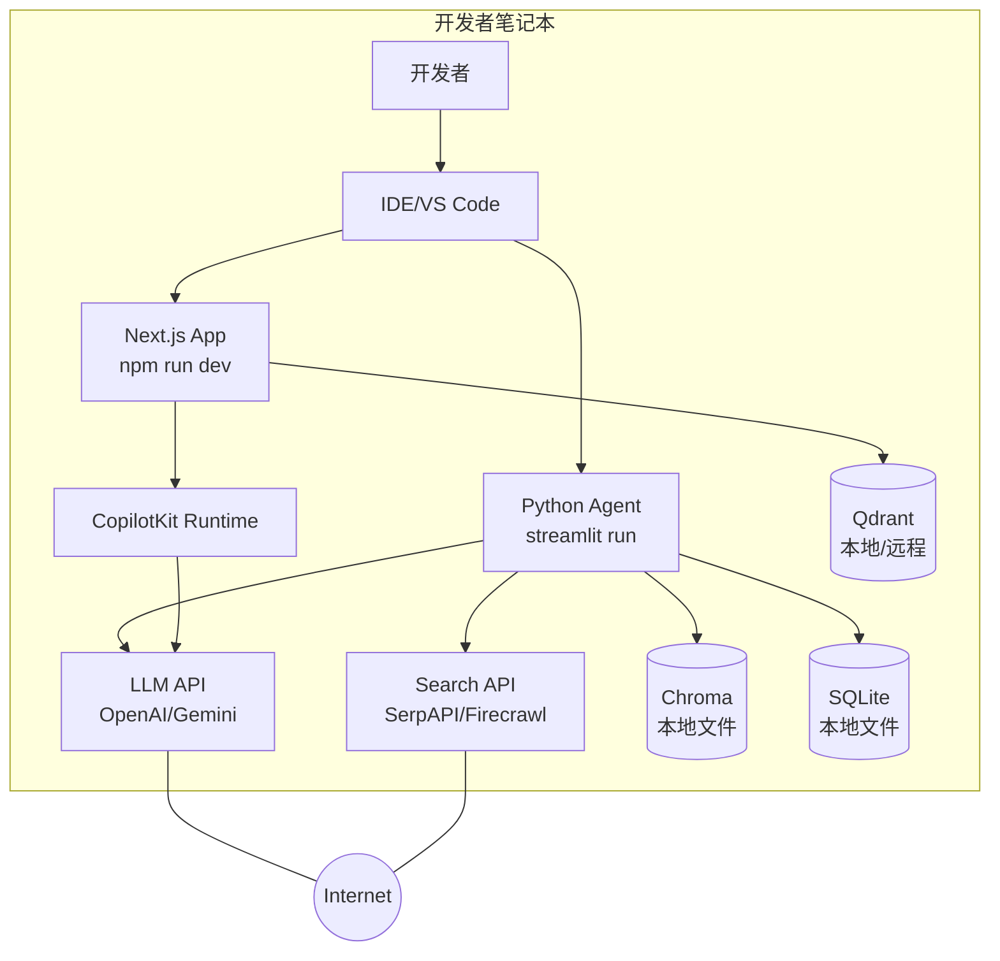
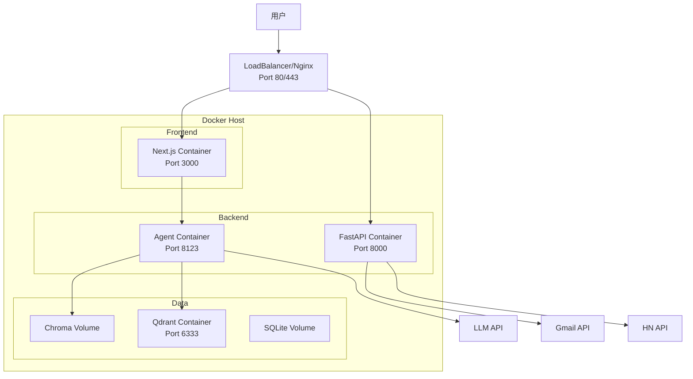
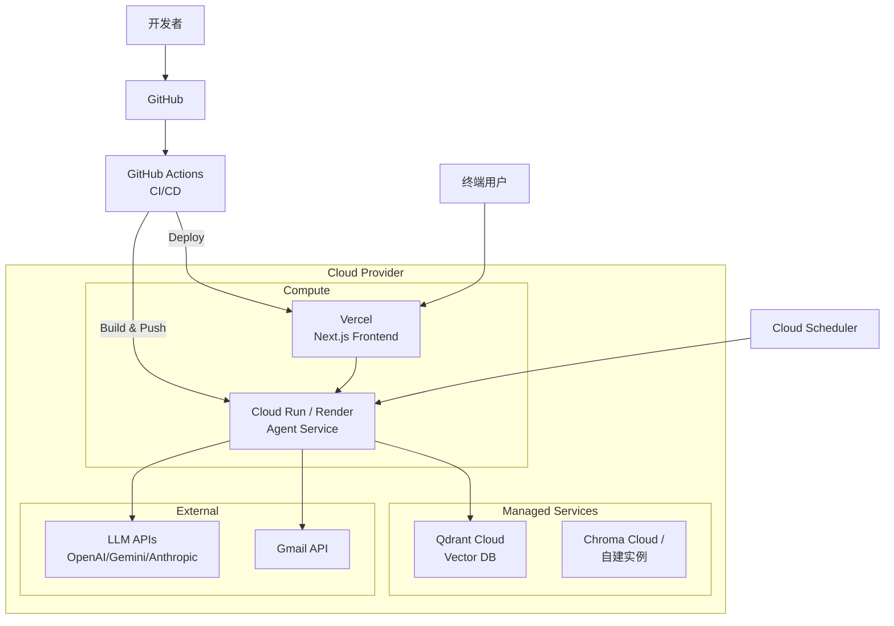

# 8. 部署、运维与基础设施（Deployment, Ops & Infrastructure）

> **文档版本**：v1.0  
> **覆盖范围**：部署架构图、Docker/K8s/CI-CD、监控日志告警、备份方案

---

## 8.0 部署全景

Awesome LLM Apps 的部署场景分为 3 类：

| 场景 | 技术栈 | 部署目标 | 复杂度 |
|------|--------|---------|--------|
| **本地开发** | Python/Node 直接运行 | 开发者笔记本 | 低 |
| **单机部署** | Docker Compose | 单台服务器/云 VM | 中 |
| **云原生部署** | Docker + 云服务 | Vercel/Render/Cloud Run | 中-高 |

---

## 8.1 部署架构图

### 8.1.1 本地开发架构



### 8.1.2 Docker 单机部署架构



### 8.1.3 云原生部署架构



---

## 8.2 Docker 化方案

### 8.2.1 多阶段构建（generative-ui-starter-project）

仓库中最完整的 Dockerfile 是 `generative-ui-starter-project/Dockerfile`，采用 **多阶段构建**：

#### Stage 1：Frontend Build

```dockerfile
FROM node:20-slim AS frontend
WORKDIR /app

# 安装依赖
COPY package.json ./
RUN npm install --ignore-scripts

# 复制源码
COPY src/ ./src/
COPY public/ ./public/
COPY next.config.ts tsconfig.json postcss.config.mjs ./

# Docker 路由覆盖（使用 AG-UI HttpAgent 替代 LangGraphAgent）
RUN rm -f ./src/app/api/copilotkit/\[\[...slug\]\]/route.ts
COPY docker-route-override.ts ./src/app/api/copilotkit/route.ts
RUN npm install @ag-ui/client

# 构建（使用 webpack 而非 turbopack 以兼容 serverExternalPackages）
ENV NODE_OPTIONS="--max-old-space-size=4096"
RUN npx next build --webpack
```

| 设计决策 | 理由 |
|---------|------|
| `node:20-slim` | 减小镜像体积 |
| `--ignore-scripts` | 跳过 postinstall（agent 安装单独处理） |
| `--webpack` | Next.js 16+ 默认 turbopack，但 webpack 兼容性更好 |
| 路由覆盖 | Docker 环境无 Docker-in-Docker，用 AG-UI 替代 LangGraph |

#### Stage 2：Production Runner

```dockerfile
FROM python:3.12.10-slim AS runner

# 安装 Node.js 20 + uv
RUN apt-get update && apt-get install -y curl ca-certificates && \
    curl -fsSL https://deb.nodesource.com/setup_20.x | bash - && \
    apt-get install -y nodejs && \
    apt-get clean && rm -rf /var/lib/apt/lists/*

# 安装 uv（从官方镜像复制，避免 curl|sh 管道问题）
COPY --from=ghcr.io/astral-sh/uv:latest /uv /uvx /usr/local/bin/

WORKDIR /app

# 安装 Python 依赖
COPY agent/ ./agent/
RUN uv pip install --system "ag-ui-langgraph[fastapi]==0.0.22" && \
    uv pip install --system --no-deps "copilotkit==0.1.78" && \
    uv pip install --system "langchain==1.0.1" \
        "langchain-openai>=1.1.0" \
        "langgraph==1.0.5" \
        "openai>=1.68.2,<2.0.0" \
        "fastapi>=0.115.5,<1.0.0" \
        "uvicorn>=0.29.0,<1.0.0"

# 复制 Next.js standalone build
COPY --from=frontend /app/.next/standalone ./
COPY --from=frontend /app/.next/static ./.next/static
COPY --from=frontend /app/public ./public

COPY entrypoint.sh ./
RUN chmod +x entrypoint.sh

EXPOSE 3000
ENV NODE_ENV=production
CMD ["./entrypoint.sh"]
```

| 设计决策 | 理由 |
|---------|------|
| `python:3.12.10-slim` | Python 3.12 + slim 减小体积 |
| `uv` 包管理器 | 比 pip 快 10-100x，lockfile 支持 |
| 版本锁定 | 所有依赖锁定精确版本，保证可复现 |
| standalone build | Next.js standalone 模式减小镜像 |

#### Entrypoint 脚本

```bash
#!/bin/bash
set -e

# 启动 Agent（AG-UI 协议）
AGENT_PORT=8123 python serve.py 2>&1 &
AGENT_PID=$!

sleep 3

# 启动 Next.js
HOSTNAME=0.0.0.0 PORT=${PORT:-3000} node server.js 2>&1 &
NEXT_PID=$!

wait -n $AGENT_PID $NEXT_PID
exit $?
```

---

### 8.2.2 Docker Compose 测试编排

`docker-compose.test.yml` 展示了完整的多服务测试栈：

```yaml
services:
  aimock:           # LLM Mock 服务（用于测试）
    image: ghcr.io/copilotkit/aimock:latest
    volumes: [./fixtures:/fixtures:ro]
    command: ["--fixtures", "/fixtures", "--host", "0.0.0.0", "--validate-on-load"]

  agent:            # Agent 服务
    build: {context: ./agent, dockerfile: ../docker/Dockerfile.agent}
    environment:
      - OPENAI_API_KEY=test-key-for-aimock
      - OPENAI_BASE_URL=http://aimock:4010/v1
    depends_on: {aimock: {condition: service_started}}
    healthcheck:
      test: ["CMD", "python", "-c", "... urllib.request.urlopen('http://localhost:8123/ok')"]
      interval: 5s, timeout: 5s, retries: 30, start_period: 30s

  app:              # Next.js 前端
    build: {context: ., dockerfile: docker/Dockerfile.app}
    environment: [LANGGRAPH_DEPLOYMENT_URL=http://agent:8123]
    depends_on: {agent: {condition: service_healthy}}
    healthcheck:
      test: ["CMD", "node", "-e", "... http.get('http://localhost:3000/')"]
      interval: 5s, timeout: 10s, retries: 30, start_period: 60s

  tests:            # Playwright E2E 测试
    image: mcr.microsoft.com/playwright:v1.52.0-noble
    volumes: ["../../../showcase/tests:/tests", test-results:/tests/test-results]
    environment: [STARTER_URL=http://app:3000]
    depends_on: {app: {condition: service_healthy}}
    command: ["bash", "-c", "cd /tests && npm install && npx playwright install chromium && npx playwright test starter-smoke"]
```

| 组件 | 职责 | 健康检查 |
|------|------|---------|
| aimock | 模拟 LLM API，返回 fixture 数据 | 无 |
| agent | Agent 后端服务 | `/ok` 端点 HTTP 200 |
| app | Next.js 前端 | `/` 端点 HTTP 200 |
| tests | Playwright E2E 测试 | 无（一次性任务） |

---

### 8.2.3 单文件模板的 Docker 化建议

对于多数单文件 Python 模板（如 travel_agent），可创建通用 Dockerfile：

```dockerfile
FROM python:3.12-slim
WORKDIR /app

COPY requirements.txt .
RUN pip install --no-cache-dir -r requirements.txt

COPY . .
EXPOSE 8501

HEALTHCHECK --interval=30s --timeout=3s \
  CMD curl -f http://localhost:8501/_stcore/health

ENTRYPOINT ["streamlit", "run", "travel_agent.py", \
            "--server.port=8501", "--server.address=0.0.0.0"]
```

---

## 8.3 CI/CD 配置

### 8.3.1 GitHub Actions（claude.yml）

仓库配置了 Claude PR Assistant 工作流：

```yaml
name: Claude PR Assistant

on:
  issue_comment: {types: [created]}
  pull_request_review_comment: {types: [created]}
  issues: {types: [opened, assigned]}
  pull_request_review: {types: [submitted]}

jobs:
  claude-code-action:
    if: |
      (github.event_name == 'issue_comment' && contains(@claude)) ||
      (github.event_name == 'pull_request_review_comment' && contains(@claude)) ||
      (github.event_name == 'pull_request_review' && contains(@claude)) ||
      (github.event_name == 'issues' && contains(@claude))
    runs-on: ubuntu-latest
    permissions:
      contents: read
      pull-requests: read
      issues: read
      id-token: write
    steps:
      - uses: actions/checkout@v4
      - uses: anthropics/claude-code-action@beta
        with:
          anthropic_api_key: ${{ secrets.ANTHROPIC_API_KEY }}
          timeout_minutes: "60"
```

| 触发条件 | 说明 |
|---------|------|
| `@claude` in issue_comment | 在 Issue 评论中 @Claude |
| `@claude` in PR review_comment | 在 PR 代码评审中 @Claude |
| `@claude` in PR review | 在 PR 评审中 @Claude |
| `@claude` in issues | 在 Issue 描述中 @Claude |

**功能**：Claude 自动分析 Issue/PR，生成回复、修改代码、回答问题。

### 8.3.2 建议的 CI/CD 扩展

```yaml
# 建议添加的工作流
name: CI

on: [push, pull_request]

jobs:
  test:
    runs-on: ubuntu-latest
    steps:
      - uses: actions/checkout@v4
      - uses: actions/setup-python@v5
        with: {python-version: '3.12'}
      - run: pip install -r requirements.txt
      - run: pytest tests/
  
  lint:
    runs-on: ubuntu-latest
    steps:
      - uses: actions/checkout@v4
      - run: pip install ruff
      - run: ruff check .
  
  security:
    runs-on: ubuntu-latest
    steps:
      - uses: actions/checkout@v4
      - run: pip install safety
      - run: safety check
```

---

## 8.4 监控、日志与告警

### 8.4.1 日志方案

#### MCP-Agent 结构化日志

```yaml
# mcp_agent.config.yaml
logger:
  transports: [console, file]
  level: debug
  progress_display: true
  path_settings:
    path_pattern: "logs/mcp-agent-{unique_id}.jsonl"
    unique_id: "timestamp"
    timestamp_format: "%Y%m%d_%H%M%S"
```

**日志输出**：
```
logs/mcp-agent-20260726_100000.jsonl
{"timestamp": "2026-07-26T10:00:00", "level": "info", "message": "Connected to playwright"}
{"timestamp": "2026-07-26T10:00:01", "level": "debug", "message": "Tool call: navigate", "args": {"url": "https://github.com"}}
```

#### Streamlit 日志

```python
import logging
logging.basicConfig(level=logging.INFO)
logger = logging.getLogger(__name__)

# 在 Streamlit 中显示日志
logger.info("Agent started")
```

#### FastAPI/Uvicorn 日志

```bash
uvicorn scheduler_api:app --log-level info --access-log
```

### 8.4.2 监控方案

#### 健康检查端点

| 服务 | 端点 | 方法 |
|------|------|------|
| AgentScout | `/health` | GET |
| AgentOS | `/api/v1/health` | GET |
| Streamlit | `/_stcore/health` | GET |
| Next.js | `/` | GET |

#### 建议的监控指标

| 指标 | 来源 | 告警阈值 |
|------|------|---------|
| LLM API 延迟 | 应用日志 | > 30s |
| LLM API 错误率 | HTTP 状态码 | > 5% |
| 向量库检索延迟 | 应用日志 | > 2s |
| 内存使用 | 系统监控 | > 80% |
| 磁盘使用 | 系统监控 | > 85% |

### 8.4.3 告警方案

```python
# 建议的告警集成（伪代码）
def send_alert(message: str, severity: str = "warning"):
    """发送告警到 Slack/PagerDuty"""
    if severity == "critical":
        requests.post(PAGERDUTY_WEBHOOK, json={"message": message})
    else:
        requests.post(SLACK_WEBHOOK, json={"text": message})

# 使用示例
try:
    response = call_llm_api()
except RateLimitError:
    send_alert("LLM API rate limit exceeded", severity="warning")
except Exception as e:
    send_alert(f"LLM API error: {e}", severity="critical")
```

---

## 8.5 备份方案

### 8.5.1 数据备份清单

| 数据类型 | 位置 | 备份策略 |
|---------|------|---------|
| SQLite 数据库 | `agents.db` | 每日自动备份到云存储 |
| Chroma 向量库 | `./pharma_db/` | 持久化目录 + 定期快照 |
| Qdrant 向量库 | Qdrant 容器/云端 | Qdrant 内置快照 |
| 配置文件 | `.env`, `*.yaml` | git + 密钥管理服务 |
| 日志文件 | `logs/*.jsonl` | 日志轮转 + 归档 |

### 8.5.2 备份脚本示例

```bash
#!/bin/bash
# backup.sh - 每日备份脚本

BACKUP_DIR="/backups/$(date +%Y%m%d)"
mkdir -p $BACKUP_DIR

# 备份 SQLite
cp agents.db $BACKUP_DIR/

# 备份 Chroma
tar -czf $BACKUP_DIR/chroma.tar.gz ./pharma_db/

# 上传到 S3
aws s3 sync $BACKUP_DIR s3://my-backups/awesome-llm-apps/

# 清理旧备份（保留 7 天）
find /backups -type d -mtime +7 -exec rm -rf {} \;
```

---

## 8.6 环境变量管理

### 8.6.1 必需环境变量清单

| 变量名 | 用途 | 使用模板 |
|--------|------|---------|
| `OPENAI_API_KEY` | OpenAI API Key | 所有 OpenAI 模板 |
| `GOOGLE_API_KEY` | Gemini API Key | rag_chain, multimodal |
| `ANTHROPIC_API_KEY` | Claude API Key | multi_mcp_agent_router |
| `SERPAPI_API_KEY` | SerpAPI Key | travel_agent |
| `FIRECRAWL_API_KEY` | Firecrawl Key | deep_research |
| `AGENTSCOUT_DELIVERY` | 投递模式 | always_on_hn |
| `AGENTSCOUT_LIVE_HN` | 实时 HN 模式 | always_on_hn |
| `AGENTSCOUT_EMAIL_TO` | 收件人 | always_on_hn |
| `AGENTSCOUT_EMAIL_FROM` | 发件人 | always_on_hn |
| `AGENTSCOUT_GMAIL_CLIENT_ID` | OAuth2 Client ID | always_on_hn |
| `AGENTSCOUT_GMAIL_CLIENT_SECRET` | OAuth2 Secret | always_on_hn |
| `AGENTSCOUT_GMAIL_REFRESH_TOKEN` | OAuth2 Refresh Token | always_on_hn |
| `AGENTSCOUT_WEBHOOK_URL` | Webhook URL | always_on_hn |

### 8.6.2 .env 文件模板

```bash
# .env.example
OPENAI_API_KEY=sk-...
GOOGLE_API_KEY=AIza...
ANTHROPIC_API_KEY=sk-ant-...
SERPAPI_API_KEY=...
FIRECRAWL_API_KEY=...

# AgentScout
AGENTSCOUT_DELIVERY=auto
AGENTSCOUT_LIVE_HN=false
AGENTSCOUT_EMAIL_TO=<EMAIL>
AGENTSCOUT_EMAIL_FROM=<EMAIL>
AGENTSCOUT_GMAIL_CLIENT_ID=...
AGENTSCOUT_GMAIL_CLIENT_SECRET=...
AGENTSCOUT_GMAIL_REFRESH_TOKEN=...
AGENTSCOUT_WEBHOOK_URL=https://hooks.slack.com/...
```

---

## 8.7 部署运维总结

### 8.7.1 优点

1. **Docker 化完整**：generative-ui-starter-project 提供生产级 Dockerfile
2. **多阶段构建**：减小镜像体积，分离构建与运行时
3. **健康检查**：Docker Compose 配置健康检查
4. **结构化日志**：MCP-Agent 输出 JSONL 日志
5. **CI/CD 集成**：GitHub Actions 已配置 Claude PR Assistant

### 8.7.2 缺点

1. **多数模板无 Dockerfile**：仅 Generative UI 模板有完整 Docker 化
2. **无编排模板**：缺少 Kubernetes manifests / Helm charts
3. **无监控集成**：无 Prometheus/Grafana 配置
4. **无日志聚合**：无 ELK/Loki 配置
5. **无密钥管理**：无 Vault/Secrets Manager 集成

### 8.7.3 改进建议

1. **P0**：为高频使用的 Streamlit 模板添加 Dockerfile
2. **P0**：统一 .env 管理（使用 .env.example 模板）
3. **P1**：添加 Prometheus metrics 端点
4. **P1**：配置日志聚合（ELK / Loki）
5. **P2**：创建 Kubernetes manifests / Helm charts
6. **P2**：集成密钥管理服务（Vault / AWS Secrets Manager）
7. **P3**：配置自动扩缩容（HPA）

---

> **下一章**：[09-改进建议与未来规划.md](./09-改进建议与未来规划.md) — 架构优缺点、技术债、安全/性能优化、路线图。

---

# ❤️ 制作不易，请我喝咖啡☕️关注我➕

