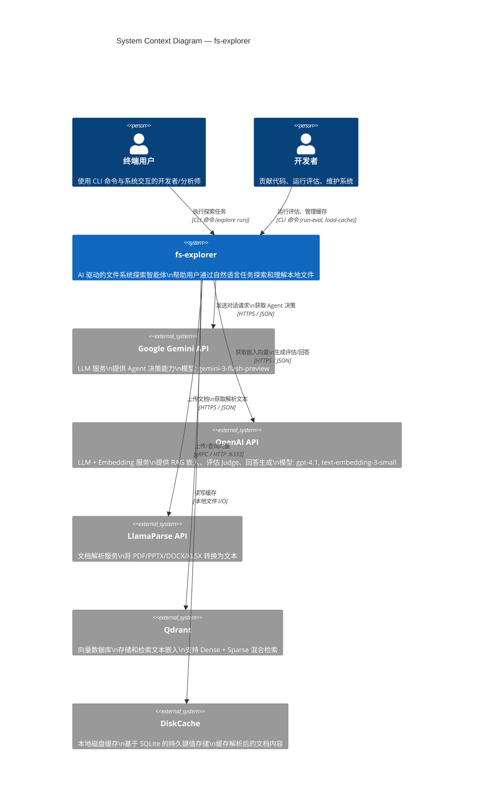

# 02-01 — Context 图（系统上下文）

> **本章内容**: 系统上下文图、外部系统识别、交互边界说明
> **预估字数**: ~6,000 字
> **C4 层级**: Level 1 — System Context

---

## 1. C4 模型概述

C4 模型是由 Simon Brown 提出的软件架构可视化方法，包含四个抽象层级：

| 层级 | 名称 | 关注点 | 类比 |
|------|------|--------|------|
| Level 1 | System Context | 系统与外部实体的关系 | 鸟瞰图 |
| Level 2 | Container | 系统内部的进程/服务 | 建筑平面图 |
| Level 3 | Component | 容器内部的模块/类 | 房间布局 |
| Level 4 | Code | 类、接口、函数的实现 | 家具摆放 |

本节聚焦 **Level 1 — 系统上下文**，展示 fs-explorer 系统与所有外部参与者（用户、外部服务）之间的交互关系。

---

## 2. 系统上下文图

### 2.1 Mermaid 图表



### 2.2 图表说明

该 Context 图展示了 fs-explorer 系统的边界及其与外部世界的所有交互。系统核心（蓝色矩形）是 **fs-explorer**，它接受来自两类用户的输入，并与五个外部系统交互。

---

## 3. 外部参与者详解

### 3.1 人类参与者

#### 终端用户 (End User)

| 属性 | 说明 |
|------|------|
| **角色定义** | 使用 fs-explorer 完成文件系统探索任务的个人 |
| **技术能力** | 熟悉基本命令行操作，了解文件系统概念 |
| **交互方式** | 通过终端执行 `explore run --task "..."` 命令 |
| **期望** | 系统能理解自然语言任务，自主完成文件搜索和分析 |
| **典型任务** | "找到包含订单信息的 PDF 并总结"、"查找所有包含 TODO 的 Python 文件" |

#### 开发者 (Developer)

| 属性 | 说明 |
|------|------|
| **角色定义** | 维护 fs-explorer 代码、运行评估、扩展功能的工程师 |
| **技术能力** | 熟悉 Python、异步编程、LLM API 使用 |
| **交互方式** | 执行 `run-eval`、`get-stats`、`load-cache`、`cache-arxiv` 等管理命令 |
| **期望** | 系统可测试、可扩展、可评估 |
| **典型任务** | 运行基准测试、添加新工具、优化 Agent 提示词 |

---

## 4. 外部系统详解

### 4.1 Google Gemini API

| 属性 | 说明 |
|------|------|
| **服务类型** | 大语言模型 API（LLM） |
| **用途** | Agent 的核心决策引擎 |
| **模型** | `gemini-3-flash-preview` |
| **协议** | HTTPS / JSON（通过 `google-genai` SDK） |
| **认证** | API Key（`GOOGLE_API_KEY` 环境变量） |
| **调用模式** | 异步（`client.aio.models.generate_content`） |
| **输出格式** | JSON（通过 `response_json_schema` 约束） |
| **必需性** | ✅ **必需** — Agent 无法脱离此服务运行 |
| **调用频率** | 每次 Agent 决策调用一次（每步一次） |
| **数据流向** | 发送对话历史 → 接收 Action JSON |

**交互细节**:

Gemini API 是 Agent 的"大脑"。每次 Agent 需要做出决策时，系统将完整的对话历史（包括系统提示、用户任务、之前的工具调用和结果）发送给 Gemini。Gemini 返回一个结构化的 JSON 对象，描述 Agent 下一步应采取的动作（工具调用、深入目录、询问用户或停止）。

系统通过 `response_json_schema` 参数强制 Gemini 输出符合 `Action` Pydantic 模型 Schema 的 JSON，确保输出可被程序解析。

### 4.2 OpenAI API

| 属性 | 说明 |
|------|------|
| **服务类型** | 大语言模型 + 嵌入模型 API |
| **用途** | 1. RAG 嵌入生成（text-embedding-3-small）<br>2. 评估 Judge（gpt-5.2）<br>3. RAG 文件过滤与回答生成（gpt-4.1） |
| **协议** | HTTPS / JSON（通过 `openai` SDK） |
| **认证** | API Key（`OPENAI_API_KEY` 环境变量） |
| **必需性** | ⚠️ **可选** — 仅 RAG 和评估模式需要 |
| **调用频率** | 嵌入：每批 chunk 一次；评估：每个任务一次；过滤：每次查询一次 |

**交互细节**:

OpenAI API 在项目中扮演三个角色：

1. **嵌入服务**: 使用 `text-embedding-3-small` 模型（768 维）为文本块生成稠密向量。调用 `client.embeddings.create()` 方法。

2. **评估 Judge**: 使用 `gpt-5.2` 模型评估 Agent 和 RAG 生成的回答。通过 `client.responses.parse()` 获取结构化输出。

3. **RAG 过滤与回答**: 使用 `gpt-4.1` 模型执行两个子任务：(a) 从文件列表中筛选最相关的文件；(b) 基于检索上下文生成最终回答。

### 4.3 LlamaParse API

| 属性 | 说明 |
|------|------|
| **服务类型** | 文档解析服务（OCR + 结构化提取） |
| **用途** | 将 PDF、DOC、DOCX、PPTX、XLSX 等非结构化文档转换为纯文本 |
| **协议** | HTTPS / JSON（通过 `llama-cloud-services` SDK） |
| **认证** | API Key（`LLAMA_CLOUD_API_KEY` 环境变量） |
| **必需性** | ⚠️ **可选** — 有缓存时可离线工作 |
| **调用模式** | 异步（`parser.aparse()`） |
| **配置** | `result_type=ResultType.TXT`, `fast_mode=True` |

**交互细节**:

LlamaParse 是处理非结构化文档的关键服务。当 Agent 遇到 PDF 等二进制文件时，调用 `parse_file` 工具：

1. 首先检查本地缓存（DiskCache）是否有该文件的解析结果。
2. 如果缓存未命中且 API Key 已配置，调用 LlamaParse API 解析文件。
3. 解析结果（纯文本）返回给 Agent，同时存入缓存供后续使用。

`fast_mode=True` 参数启用快速解析模式，牺牲部分精度换取更快的响应速度。

### 4.4 Qdrant

| 属性 | 说明 |
|------|------|
| **服务类型** | 向量数据库 |
| **用途** | 存储文本块嵌入，支持混合检索（Dense + Sparse） |
| **协议** | gRPC / HTTP（默认端口 6333/6334） |
| **部署** | Docker 容器（`qdrant/qdrant:latest`） |
| **认证** | 无（本地部署） |
| **必需性** | ⚠️ **可选** — 仅 RAG 模式需要 |
| **客户端** | `qdrant_client.AsyncQdrantClient` |

**交互细节**:

Qdrant 是 RAG 流水线的存储后端。系统创建两个 Collection：

- `rag-benchmark`: 标准评估集合（Dense + Sparse）
- `rag-benchmark-advanced`: 大规模评估集合（仅 Sparse）

每个 Collection 包含两种向量：
- `dense-text`: 768 维稠密向量（OpenAI Embedding），使用余弦距离
- `sparse-text`: 稀疏向量（BM25），存储在内存中

### 4.5 DiskCache

| 属性 | 说明 |
|------|------|
| **服务类型** | 本地磁盘键值存储 |
| **用途** | 缓存 LlamaParse 解析结果，避免重复 API 调用 |
| **实现** | SQLite（通过 `diskcache` 库） |
| **存储位置** | `tmp/cache/` 目录 |
| **必需性** | ⚠️ **可选** — 但强烈推荐用于性能优化 |
| **键格式** | 文件的绝对路径（`Path.resolve()`） |
| **值格式** | 解析后的纯文本内容 |

**交互细节**:

DiskCache 是性能优化的关键组件。由于 LlamaParse API 调用是异步的且有速率限制，缓存机制允许：

1. **预加载**: 通过 `explore load-cache` 命令批量解析目录中的所有文件。
2. **运行时命中**: Agent 在探索过程中直接从缓存读取，无需网络调用。
3. **跨会话持久化**: 缓存在多次运行之间保持有效。

---

## 5. 交互边界分析

### 5.1 信任边界

```
┌─────────────────────────────────────────────────────────────┐
│                    信任边界（Trust Boundary）                 │
│  ┌─────────────────────────────────────────────────────┐    │
│  │              可信区域（Trusted Zone）                 │    │
│  │  ┌─────────────┐  ┌─────────────┐  ┌────────────┐  │    │
│  │  │ fs-explorer │  │  DiskCache  │  │   Qdrant   │  │    │
│  │  │   (本地)     │  │   (本地)    │  │  (本地)    │  │    │
│  │  └─────────────┘  └─────────────┘  └────────────┘  │    │
│  └─────────────────────────────────────────────────────┘    │
│                          │                                   │
│  ════════════════════════╪════════════════════════════════   │
│                    网络边界（Network Boundary）                │
│  ════════════════════════╪════════════════════════════════   │
│                          │                                   │
│  ┌─────────────────────────────────────────────────────┐    │
│  │            不可信区域（Untrusted Zone）               │    │
│  │  ┌──────────┐  ┌──────────┐  ┌──────────────────┐  │    │
│  │  │  Gemini  │  │  OpenAI  │  │   LlamaParse     │  │    │
│  │  │  (云端)  │  │  (云端)  │  │    (云端)        │  │    │
│  │  └──────────┘  └──────────┘  └──────────────────┘  │    │
│  └─────────────────────────────────────────────────────┘    │
└─────────────────────────────────────────────────────────────┘
```

### 5.2 数据流分类

| 数据流 | 方向 | 内容 | 敏感度 |
|--------|------|------|--------|
| 用户任务 | 用户 → fs-explorer | 自然语言任务描述 | 低 |
| Agent 决策 | fs-explorer → Gemini | 对话历史（含文件内容片段） | 中 |
| 工具结果 | Gemini → fs-explorer | Action JSON | 低 |
| 文档内容 | fs-explorer → LlamaParse | 完整文件内容 | 高 |
| 嵌入向量 | fs-explorer → OpenAI | 文本块内容 | 中 |
| 评估回答 | fs-explorer → OpenAI | 问题、参考答案、生成回答 | 中 |
| 缓存数据 | fs-explorer ↔ DiskCache | 解析后的文档文本 | 高 |
| 向量数据 | fs-explorer ↔ Qdrant | 文本块 + 嵌入向量 | 中 |

### 5.3 故障域分析

| 外部系统 | 故障影响 | 降级策略 |
|---------|---------|---------|
| Gemini API | Agent 完全不可用 | 无（核心依赖） |
| OpenAI API | RAG 和评估不可用 | 仅使用 Agent 模式 |
| LlamaParse API | 无法解析新文档 | 使用缓存的解析结果 |
| Qdrant | RAG 检索不可用 | 仅使用 Agent 模式 |
| DiskCache | 无影响（自动创建） | 每次重新解析 |

---

## 6. 设计 Rationale

### 6.1 为什么选择 Gemini 作为 Agent 决策模型？

1. **结构化输出**: Gemini 支持 `response_json_schema`，可直接输出符合 Pydantic Schema 的 JSON，无需额外的格式解析。
2. **长上下文**: Gemini 模型支持较大的上下文窗口，适合处理包含大量文件内容的对话历史。
3. **成本效益**: `gemini-3-flash-preview` 是快速且经济的模型，适合需要频繁调用决策循环的场景。
4. **Google 生态**: 与 `google-genai` SDK 深度集成，异步支持良好。

### 6.2 为什么选择 OpenAI 作为 RAG 嵌入和评估模型？

1. **嵌入质量**: `text-embedding-3-small` 是经过广泛验证的嵌入模型，在 MTEB 基准上表现优异。
2. **评估能力**: GPT 系列模型在 LLM-as-Judge 任务上表现出色，能够准确评估回答质量。
3. **生态成熟**: OpenAI SDK 功能完善，支持结构化输出（`responses.parse`）。

### 6.3 为什么使用本地 Qdrant 而非云服务？

1. **数据隐私**: 文档内容可能敏感，本地部署避免数据外传。
2. **延迟**: 本地网络调用延迟远低于云服务。
3. **成本**: 无 API 调用费用，仅消耗本地资源。
4. **可复现性**: 本地部署确保评估环境一致。

### 6.4 为什么使用 DiskCache 而非 Redis/Memcached？

1. **零配置**: DiskCache 无需额外服务进程，开箱即用。
2. **持久化**: 数据在重启后仍保留，适合缓存解析结果。
3. **SQLite 可靠**: 底层使用 SQLite，数据完整性有保障。
4. **简单性**: 对于键值缓存场景，无需 Redis 的复杂数据结构。

---

## 7. 边界与约束

### 7.1 系统边界

| 边界 | 包含 | 不包含 |
|------|------|--------|
| **fs-explorer 核心** | Agent 决策、工具执行、缓存管理 | RAG 流水线、评估逻辑 |
| **rag-starterkit** | 文档解析、分块、嵌入、检索、生成 | Agent 逻辑、评估逻辑 |
| **eval-framework** | 双框架运行、LLM 评估、统计报告 | Agent 实现、RAG 实现 |
| **cache-arxiv** | arXiv 论文缓存 | 其他功能 |

### 7.2 技术约束

| 约束 | 说明 | 影响 |
|------|------|------|
| Python >= 3.10 | 使用 `match` 语句、`TypeAlias` 等新特性 | 不支持旧版 Python |
| 异步优先 | 所有 I/O 操作使用 `async/await` | 需要 Python 3.10+ 的异步支持 |
| API 速率限制 | Gemini/OpenAI/LlamaParse 均有调用频率限制 | 需要缓存和并发控制 |
| 网络依赖 | Agent 和 RAG 均依赖云端 API | 无法完全离线运行 |
| 文件系统访问 | Agent 只能访问运行用户有权限的文件 | 受操作系统权限限制 |

### 7.3 安全约束

| 约束 | 说明 |
|------|------|
| API Key 不落地 | 仅通过环境变量传递，不写入代码或日志 |
| 文件路径校验 | 所有工具调用前检查文件存在性 |
| 工具白名单 | Agent 只能调用预定义的工具集 |
| 超时控制 | 工作流 120 秒超时，防止无限循环 |
| 并发限制 | 异步任务使用 Semaphore 限制并发度为 5 |

---

☕️ 制作不易，请我喝咖啡☕️关注我➕

