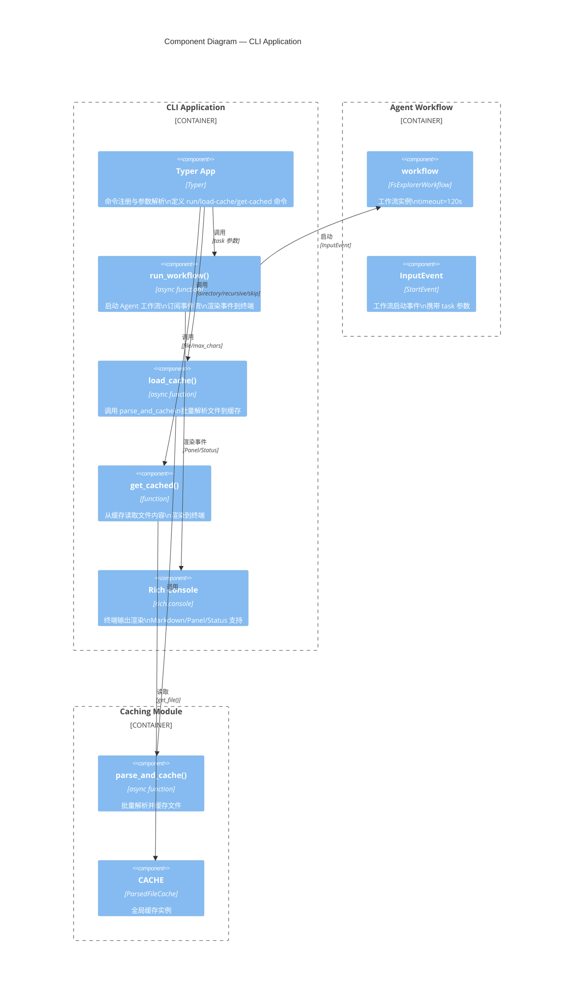
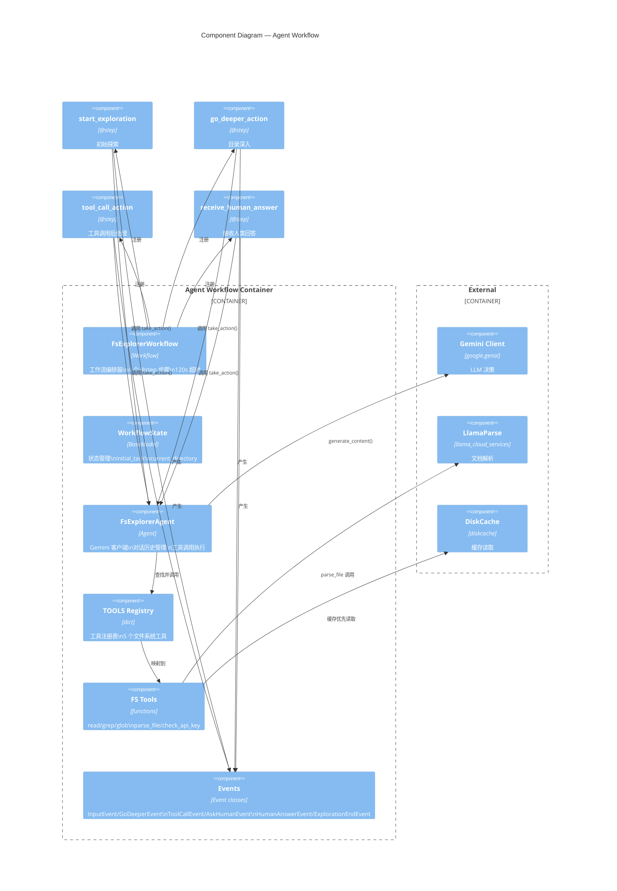
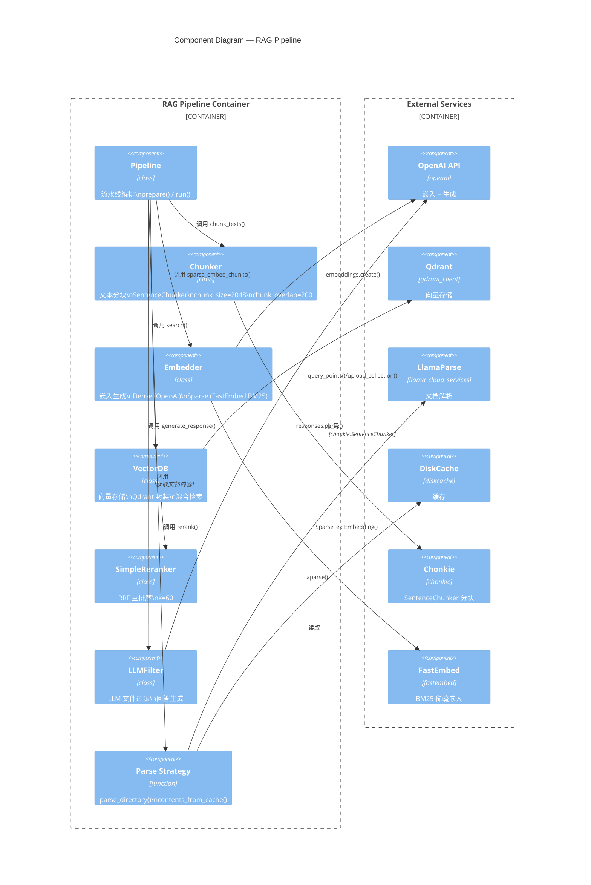
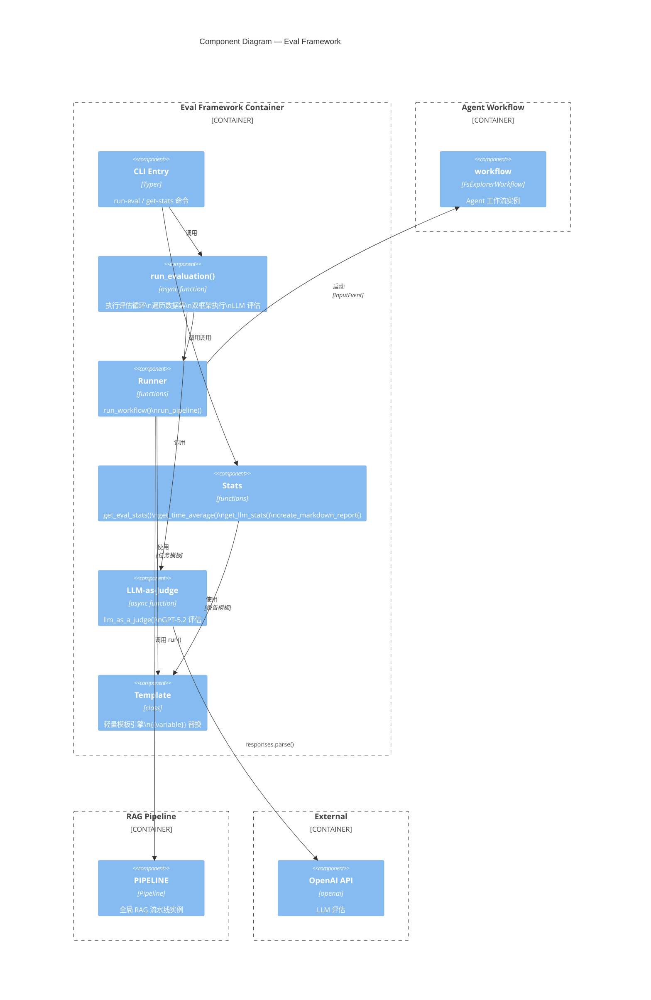

# 02-03 — Component 图（组件视图）

> **本章内容**: 各容器内部组件划分、组件职责、接口定义
> **预估字数**: ~10,000 字
> **C4 层级**: Level 3 — Component

---

## 1. 组件视图概述

组件视图展示每个容器内部的模块/类划分，以及它们之间的依赖关系。本节为 fs-explorer 的 4 个核心容器分别绘制组件图：

1. **CLI Application** — 命令定义与事件渲染
2. **Agent Workflow** — Agent 决策与工具执行
3. **RAG Pipeline** — 索引与检索流水线
4. **Eval Framework** — 评估执行与统计

---

## 2. CLI Application 组件图

### 2.1 Mermaid 图表



### 2.2 组件说明

| 组件 | 类型 | 职责 | 输入 | 输出 |
|------|------|------|------|------|
| `Typer App` | Typer 实例 | 命令注册、参数解析、帮助生成 | CLI 参数 | 调用对应函数 |
| `run_workflow()` | 异步函数 | 启动工作流、订阅事件、渲染输出 | task 字符串 | None（终端输出） |
| `load_cache()` | 异步函数 | 批量解析文件到缓存 | directory, recursive, to_skip | None |
| `get_cached()` | 同步函数 | 读取缓存内容并显示 | file, max_chars | None（终端输出） |
| `Rich Console` | Console 实例 | 终端渲染引擎 | Markdown/Panel 定义 | 终端输出 |

---

## 3. Agent Workflow 组件图

### 3.1 Mermaid 图表



### 3.2 组件说明

#### FsExplorerAgent（核心组件）

| 属性 | 说明 |
|------|------|
| **类型** | 类 |
| **职责** | 封装 Gemini 客户端，管理对话历史，执行工具调用 |
| **关键方法** | `__init__()`, `configure_task()`, `take_action()`, `call_tool()` |
| **状态** | `_chat_history: list[Content]` — 完整对话历史 |
| **依赖** | `google.genai.Client`, `TOOLS` 注册表, `fs` 模块 |

**设计模式**: **Facade 模式** — 封装了 Gemini API 调用、响应解析、工具调用的复杂性，对外提供简单的 `take_action()` 接口。

#### FsExplorerWorkflow（工作流编排器）

| 属性 | 说明 |
|------|------|
| **类型** | 类（继承 Workflow） |
| **职责** | 定义 4 个步骤，管理状态流转，注入 Agent 资源 |
| **关键方法** | `start_exploration()`, `go_deeper_action()`, `tool_call_action()`, `receive_human_answer()` |
| **状态** | `WorkflowState` — 通过 `Context` 管理 |
| **依赖** | `FsExplorerAgent`（通过 Resource 注入） |

**设计模式**: **State Machine 模式** — 每个步骤是一个状态，事件是状态转换的触发器。

#### TOOLS 注册表

| 属性 | 说明 |
|------|------|
| **类型** | `dict[Tools, Callable]` |
| **职责** | 将工具名称映射到实现函数 |
| **注册项** | `read`, `grep`, `glob`, `check_api_key`, `parse_file` |

**设计模式**: **Registry 模式** — 通过字典实现工具的动态查找和调用。

---

## 4. RAG Pipeline 组件图

### 4.1 Mermaid 图表



### 4.2 组件说明

#### Pipeline（流水线编排器）

| 属性 | 说明 |
|------|------|
| **类型** | 类 |
| **职责** | 编排索引和检索两个阶段，管理各组件的生命周期 |
| **关键方法** | `prepare()` — 索引阶段；`run(query, limit)` — 检索阶段 |
| **状态** | `is_ready: bool` — 标记是否已完成索引；`file_paths: list[str]` — 已索引文件列表 |
| **依赖** | Chunker, Embedder, VectorDB, LLMFilter, Parse Strategy |

**设计模式**: **Template Method 模式** — `prepare()` 和 `run()` 定义了固定的执行流程，各步骤的具体实现委托给组件。

#### Chunker（文本分块器）

| 属性 | 说明 |
|------|------|
| **类型** | 类 |
| **职责** | 将长文本切分为固定大小的块，保留句子边界 |
| **配置** | `chunk_size=2048`, `chunk_overlap=200` |
| **底层库** | `chonkie.SentenceChunker` |
| **输入** | `dict[str, str]` — 文件路径到内容的映射 |
| **输出** | `list[ChunkWithMetadata]` — 带元数据的块列表 |

#### Embedder（嵌入生成器）

| 属性 | 说明 |
|------|------|
| **类型** | 类 |
| **职责** | 为文本块生成稠密和稀疏两种嵌入 |
| **Dense 模型** | OpenAI `text-embedding-3-small` (768 维) |
| **Sparse 模型** | FastEmbed `Qdrant/bm25` |
| **关键方法** | `embed_chunks()` (异步), `sparse_embed_chunks()` (同步), `embed_query()`, `sparse_embed_query()` |

#### VectorDB（向量数据库封装）

| 属性 | 说明 |
|------|------|
| **类型** | 类 |
| **职责** | 封装 Qdrant 操作，支持混合检索和 RRF 重排序 |
| **关键方法** | `configure_collection()`, `upload()`, `search()`, `check_if_loaded()` |
| **依赖** | `AsyncQdrantClient`, `SimpleReranker`, `Embedder` |

#### SimpleReranker（RRF 重排序器）

| 属性 | 说明 |
|------|------|
| **类型** | 类 |
| **职责** | 使用倒数排名融合（RRF）算法合并 Dense 和 Sparse 检索结果 |
| **公式** | `score(d) = Σ 1/(k + rank_i(d))`，k=60 |
| **关键方法** | `rerank(dense_results, sparse_results, limit)` |

#### LLMFilter（LLM 过滤器）

| 属性 | 说明 |
|------|------|
| **类型** | 类 |
| **职责** | 1. 从文件列表中筛选最相关的文件<br>2. 基于检索上下文生成最终回答 |
| **模型** | OpenAI `gpt-4.1` |
| **关键方法** | `generate_filter()`, `generate_response()` |

---

## 5. Eval Framework 组件图

### 5.1 Mermaid 图表



### 5.2 组件说明

| 组件 | 类型 | 职责 |
|------|------|------|
| `CLI Entry` | Typer 实例 | 定义 `run-eval` 和 `get-stats` 命令 |
| `run_evaluation()` | 异步函数 | 遍历数据集，对每个任务执行双框架运行和 LLM 评估 |
| `run_workflow()` | 异步函数 | 运行 Agent Workflow，收集时间、工具调用、文件路径 |
| `run_pipeline()` | 异步函数 | 运行 RAG Pipeline，收集时间和回答 |
| `llm_as_a_judge()` | 异步函数 | 使用 GPT-5.2 评估回答的正确性和相关性 |
| `get_eval_stats()` | 函数 | 聚合评估结果，生成统计和报告 |
| `Template` | 类 | 轻量模板引擎，支持 `{{variable}}` 语法 |

---

## 6. 组件接口定义

### 6.1 Agent 组件接口

```python
# FsExplorerAgent 接口
class FsExplorerAgent:
    def __init__(self, api_key: str | None = None) -> None: ...
    def configure_task(self, task: str) -> None: ...
    async def take_action(self) -> tuple[Action, ActionType] | None: ...
    async def call_tool(self, tool_name: Tools, tool_input: dict[str, Any]) -> None: ...

# Workflow 步骤接口
class FsExplorerWorkflow(Workflow):
    @step
    async def start_exploration(self, ev: InputEvent, ctx: Context[WorkflowState], agent: FsExplorerAgent) -> ExplorationEndEvent | GoDeeperEvent | ToolCallEvent | AskHumanEvent: ...
    @step
    async def go_deeper_action(self, ev: GoDeeperEvent, ctx: Context[WorkflowState], agent: FsExplorerAgent) -> ...: ...
    @step
    async def tool_call_action(self, ev: ToolCallEvent, ctx: Context[WorkflowState], agent: FsExplorerAgent) -> ...: ...
    @step
    async def receive_human_answer(self, ev: HumanAnswerEvent, ctx: Context[WorkflowState], agent: FsExplorerAgent) -> ...: ...
```

### 6.2 RAG 组件接口

```python
# Pipeline 接口
class Pipeline:
    async def prepare(self) -> None: ...
    async def run(self, query: str, limit: int = 1) -> tuple[str | None, str | None]: ...

# Embedder 接口
class Embedder:
    async def embed_chunks(self, chunks: list[ChunkWithMetadata]) -> list[ChunkWithMetadata]: ...
    def sparse_embed_chunks(self, chunks: list[ChunkWithMetadata]) -> list[ChunkWithMetadata]: ...
    async def embed_query(self, query: str) -> list[float]: ...
    def sparse_embed_query(self, query: str) -> SparseEmbedding: ...

# VectorDB 接口
class VectorDB:
    async def configure_collection(self) -> None: ...
    async def upload(self, data: list[ChunkWithMetadata]) -> None: ...
    async def search(self, query: str, file_path: str | None = None, limit: int = 1) -> list[SearchResult]: ...
    async def check_if_loaded(self) -> bool: ...
```

---

## 7. 设计模式总结

| 模式 | 应用位置 | 说明 |
|------|---------|------|
| **Facade** | `FsExplorerAgent` | 封装 Gemini API 和工具调用复杂性 |
| **State Machine** | `FsExplorerWorkflow` | 步骤 = 状态，事件 = 转换 |
| **Registry** | `TOOLS` 字典 | 工具名称到实现的映射 |
| **Template Method** | `Pipeline.prepare/run` | 固定流程，可变步骤 |
| **Strategy** | `parse_directory` / `contents_from_cache` | 可替换的解析策略 |
| **Dependency Injection** | `Resource(get_agent)` | 将 Agent 注入到工作流步骤 |
| **Observer** | `stream_events()` | 事件流订阅与消费 |
| **Singleton** | `CACHE`, `AGENT`, `PIPELINE` | 全局唯一实例 |

---

# ❤️ 制作不易，请我喝咖啡☕️关注我➕


