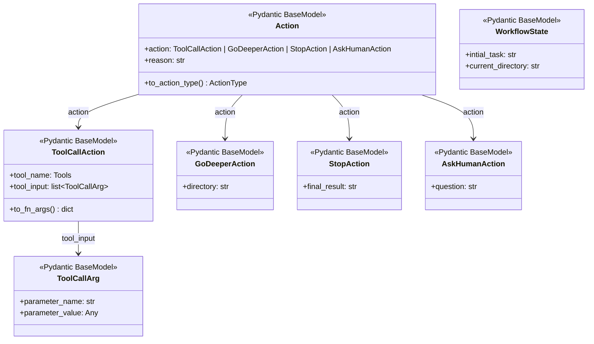
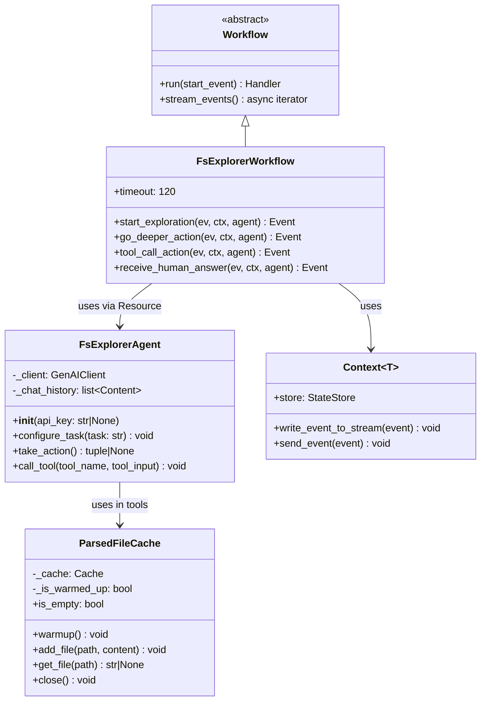
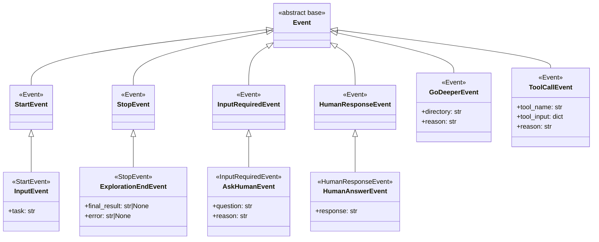
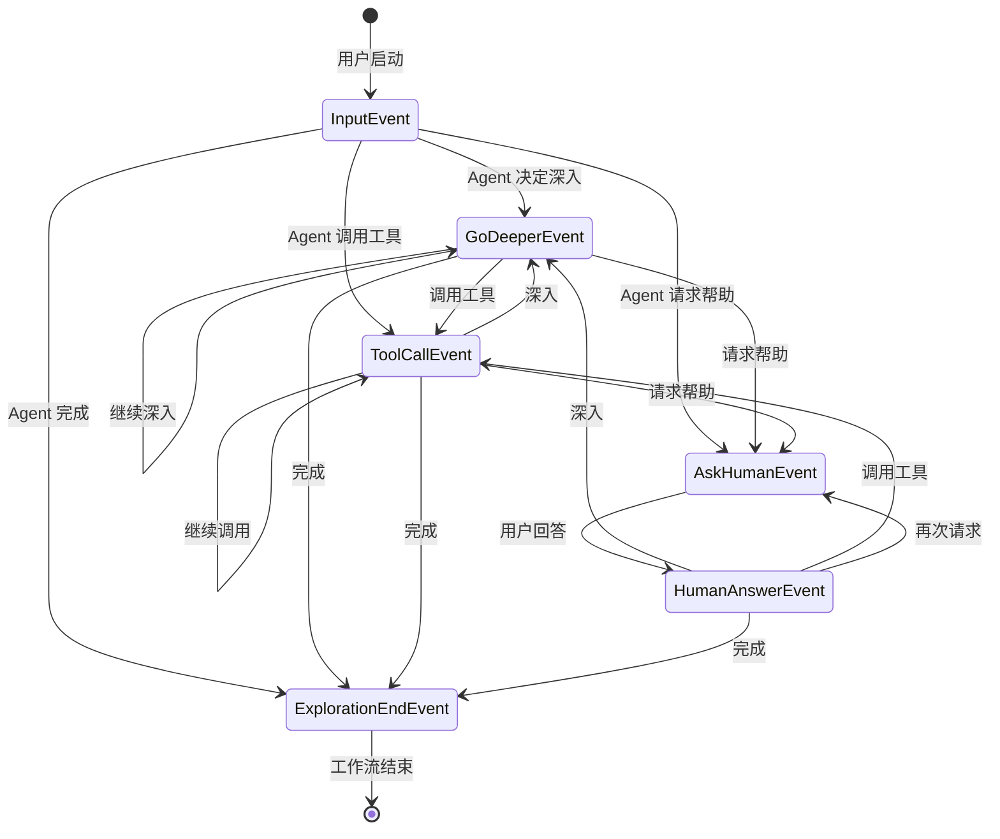
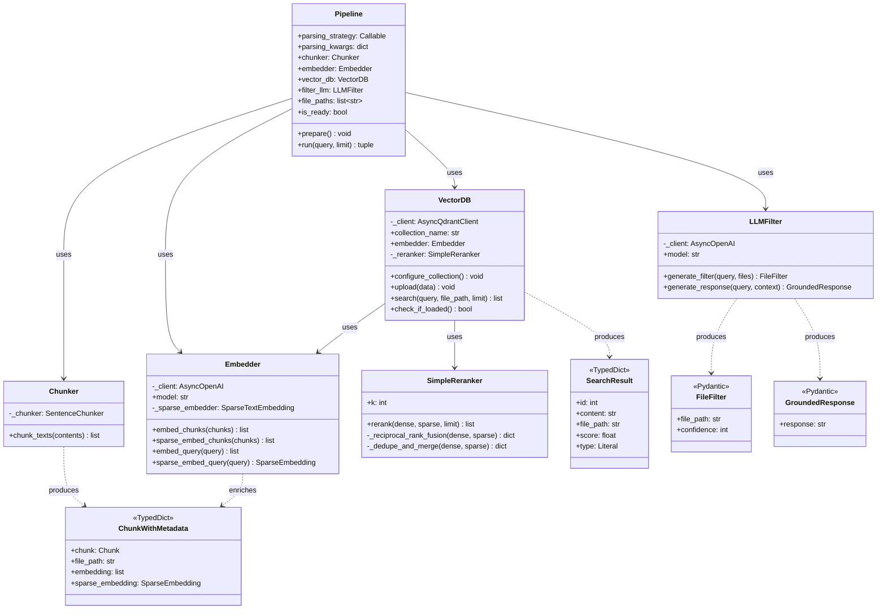
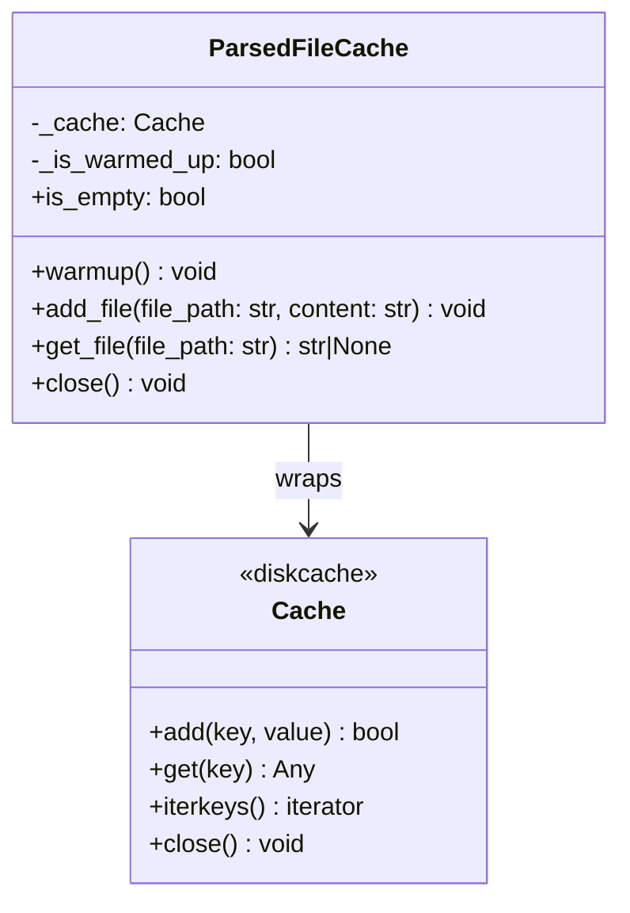

# 02-04 — Code 图（代码/类视图）

> **本章内容**: 核心类图、类型系统、继承体系、设计模式实现
> **预估字数**: ~10,000 字
> **C4 层级**: Level 4 — Code

---

## 1. 代码视图概述

代码视图展示系统中最重要的类、接口、枚举及其关系。本节通过 Mermaid 类图呈现 fs-explorer 项目的核心类型系统，包括：

1. **Pydantic 模型体系** — Action 继承体系
2. **Agent 与工作流类** — 核心业务逻辑
3. **RAG 组件类** — 流水线各阶段
4. **事件体系** — 工作流事件继承树

---

## 2. Action 模型继承体系

### 2.1 Mermaid 类图



### 2.2 类型别名定义

```python
Tools = Literal["read", "grep", "glob", "check_api_key", "parse_file"]
ActionType = Literal["stop", "godeeper", "toolcall", "askhuman"]
```

### 2.3 设计说明

**Action 模型** 使用 Pydantic 的 `Union` 类型实现多态：

- `action` 字段是一个联合类型，可以是 4 种具体 Action 之一。
- `to_action_type()` 方法通过 `isinstance` 检查返回类型标识字符串。
- 这种设计允许 Gemini 返回任意类型的 Action，由调用者根据类型分发处理。

**ToolCallArg** 模型将工具参数表示为键值对列表，而非固定字典，这是为了适配 LLM 的输出格式（LLM 更容易生成列表而非字典）。

---

## 3. Agent 与工作流类图

### 3.1 Mermaid 类图



### 3.2 类职责详解

#### FsExplorerAgent

| 成员 | 类型 | 职责 |
|------|------|------|
| `_client` | `GenAIClient` | Gemini API 客户端，用于发送对话请求 |
| `_chat_history` | `list[Content]` | 完整对话历史，包括系统提示、用户消息、模型回复、工具结果 |
| `__init__` | 构造函数 | 初始化客户端，设置系统提示 |
| `configure_task` | 方法 | 将用户任务追加到对话历史 |
| `take_action` | 异步方法 | 调用 Gemini 获取下一步 Action，如果是 toolcall 则自动执行工具 |
| `call_tool` | 异步方法 | 根据工具名称查找并执行工具，将结果追加到对话历史 |

**核心逻辑**:

```python
async def take_action(self):
    # 1. 发送对话历史到 Gemini
    response = await self._client.aio.models.generate_content(
        model="gemini-3-flash-preview",
        contents=self._chat_history,
        config={
            "response_mime_type": "application/json",
            "response_json_schema": Action.model_json_schema(),
        },
    )
    # 2. 解析响应为 Action 对象
    action = Action.model_validate_json(response.text)
    # 3. 如果是工具调用，自动执行
    if action.to_action_type() == "toolcall":
        await self.call_tool(tool_name, tool_input)
    return action, action_type
```

#### FsExplorerWorkflow

| 步骤 | 输入事件 | 输出事件 | 职责 |
|------|---------|---------|------|
| `start_exploration` | `InputEvent` | `GoDeeperEvent` / `ToolCallEvent` / `AskHumanEvent` / `ExplorationEndEvent` | 初始探索，描述当前目录，获取首个 Action |
| `go_deeper_action` | `GoDeeperEvent` | 同上 | 进入子目录后重新描述并决策 |
| `tool_call_action` | `ToolCallEvent` | 同上 | 工具执行后基于结果继续决策 |
| `receive_human_answer` | `HumanAnswerEvent` | 同上 | 接收用户回答后继续决策 |

**状态管理**:

```python
class WorkflowState(BaseModel):
    intial_task: str = ""        # 用户原始任务
    current_directory: str = "."  # 当前探索目录
```

---

## 4. 事件体系类图

### 4.1 Mermaid 类图



### 4.2 事件流转图



---

## 5. RAG 组件类图

### 5.1 Mermaid 类图



### 5.2 核心算法：RRF 重排序

```python
class SimpleReranker:
    def __init__(self, k: int = 60):
        self.k = k  # RRF 平滑常数

    def _reciprocal_rank_fusion(self, dense_results, sparse_results):
        rrf_scores = {}
        for rank, result in enumerate(dense_results, start=1):
            content = result["content"]
            rrf_scores[content] = rrf_scores.get(content, 0.0) + 1 / (self.k + rank)
        for rank, result in enumerate(sparse_results, start=1):
            content = result["content"]
            rrf_scores[content] = rrf_scores.get(content, 0.0) + 1 / (self.k + rank)
        return rrf_scores

    def rerank(self, dense_results, sparse_results, limit=1):
        if len(dense_results) == 0:
            return sparse_results[:limit]
        rrf_scores = self._reciprocal_rank_fusion(dense_results, sparse_results)
        results_map = self._dedupe_and_merge(dense_results, sparse_results)
        reranked_results = []
        for content, result in results_map.items():
            result_copy = result.copy()
            result_copy["score"] = rrf_scores[content]
            reranked_results.append(result_copy)
        reranked_results.sort(key=lambda x: x["score"], reverse=True)
        return reranked_results[:limit]
```

**时间复杂度**: O(n + m + p log p)，其中 n 和 m 分别是两路结果数量，p 是去重后的总数。

---

## 6. 缓存组件类图

### 6.1 Mermaid 类图



### 6.2 缓存键设计

| 属性 | 值 | 说明 |
|------|---|------|
| 键格式 | `str(Path(file_path).resolve())` | 文件的绝对路径 |
| 值格式 | `str` | 解析后的纯文本内容 |
| 存储引擎 | SQLite (via diskcache) | 持久化、事务安全 |
| 存储位置 | `tmp/cache/` | 本地磁盘 |

---

## 7. 工具注册表

### 7.1 工具映射

```python
TOOLS: dict[Tools, Callable] = {
    "read": read_file,           # 同步
    "grep": grep_file_content,   # 同步
    "glob": glob_paths,          # 同步
    "check_api_key": check_api_key,  # 同步
    "parse_file": parse_file,    # 异步
}
```

### 7.2 工具签名

| 工具 | 签名 | 返回类型 |
|------|------|---------|
| `read` | `(file_path: str)` | `str` |
| `grep` | `(file_path: str, pattern: str)` | `str` |
| `glob` | `(directory: str, pattern: str)` | `str` |
| `check_api_key` | `()` | `str` |
| `parse_file` | `(file_path: str)` async | `str` |

---

## 8. 设计模式详解

### 8.1 Facade 模式 — FsExplorerAgent

**意图**: 为复杂的 Gemini API 调用和工具执行子系统提供统一的高层接口。

**结构**:
- **Facade**: `FsExplorerAgent`
- **子系统**: `GenAIClient`, `TOOLS` 注册表, `fs` 模块

**优势**:
- 调用者只需调用 `take_action()`，无需了解 Gemini API 细节。
- 工具调用逻辑封装在 `call_tool()` 中，错误处理统一。

### 8.2 State Machine 模式 — FsExplorerWorkflow

**意图**: 将 Agent 决策循环建模为状态机，每个步骤是一个状态。

**结构**:
- **Context**: `FsExplorerWorkflow`
- **States**: `start_exploration`, `go_deeper_action`, `tool_call_action`, `receive_human_answer`
- **Transitions**: 事件类型决定状态转换

**优势**:
- 状态转换清晰可见。
- 新增状态（步骤）不影响现有代码。
- 状态历史可通过事件流追溯。

### 8.3 Strategy 模式 — 解析策略

**意图**: 允许在运行时选择文档解析算法。

**结构**:
- **Context**: `Pipeline`
- **Strategy**: `parse_directory`（实时解析）或 `contents_from_cache`（从缓存加载）

**优势**:
- 索引阶段可以灵活切换解析方式。
- 新增解析策略无需修改 Pipeline 代码。

### 8.4 Dependency Injection — Resource

**意图**: 将共享资源注入到工作流步骤，避免全局状态。

**结构**:
- **注入器**: `Resource(get_agent)`
- **消费者**: 所有 `@step` 方法

**优势**:
- 步骤函数无副作用，便于测试。
- 资源生命周期由工作流管理。

---

## 9. 类型系统总结

### 9.1 类型别名

```python
# 工具名称
Tools = Literal["read", "grep", "glob", "check_api_key", "parse_file"]

# 动作类型
ActionType = Literal["stop", "godeeper", "toolcall", "askhuman"]
```

### 9.2 TypedDict 定义

```python
class ChunkWithMetadata(TypedDict):
    chunk: Chunk
    file_path: str
    embedding: list[float]
    sparse_embedding: SparseEmbedding | None

class SearchResult(TypedDict):
    id: int
    content: str
    file_path: str
    score: float
    type: Literal["sparse", "dense"]

class EvalTask(TypedDict):
    question: str
    answer: str
    file: str
```

### 9.3 Pydantic 模型层次

```
BaseModel
├── Action (多态模型)
│   ├── ToolCallAction
│   │   └── ToolCallArg
│   ├── GoDeeperAction
│   ├── StopAction
│   └── AskHumanAction
├── WorkflowState
├── Evaluation
├── FileFilter
└── GroundedResponse
```

---

☕️ 制作不易，请我喝咖啡☕️关注我➕

