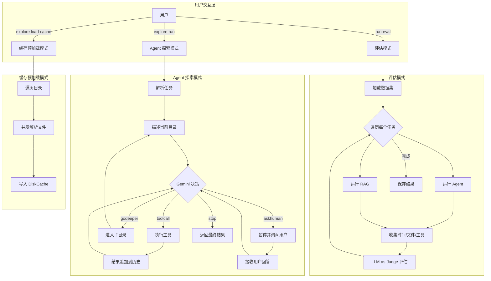
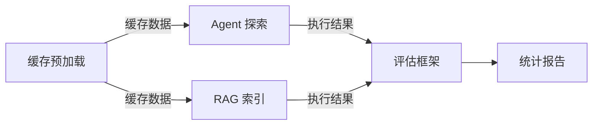

# 03-01 — 核心业务流程概述

> **本章内容**: 端到端业务流程全景图
> **预估字数**: ~5,000 字

---

## 1. 业务全景图

---

## 2. 流程分类

| 流程类别 | 触发命令 | 涉及模块 | 核心步骤数 |
|---------|---------|---------|-----------|
| **Agent 探索** | `explore run` | main → workflow → agent → fs | 4 步循环 |
| **缓存加载** | `explore load-cache` | main → caching | 3 步 |
| **缓存查询** | `explore get-cached` | main → caching | 2 步 |
| **RAG 索引** | Pipeline.prepare() | parse → chunk → embed → vectordb | 4 步 |
| **RAG 查询** | Pipeline.run() | filter → search → rerank → generate | 4 步 |
| **评估执行** | `run-eval` | evaluate → run_workflow / run_pipeline → judge | 3 步 |
| **统计报告** | `get-stats` | stats → aggregate → report | 3 步 |
| **arXiv 缓存** | `cache-arxiv` | utils → cache | 2 步 |

---

## 3. 各流程详细说明

### 3.1 Agent 探索流程

**触发**: `explore run --task "找到包含投诉的 PDF"`

**步骤**:
1. CLI 解析参数，启动异步运行时
2. 创建 `InputEvent(task=...)`
3. 启动 `FsExplorerWorkflow`
4. `start_exploration` 步骤：描述当前目录 → 调用 Agent → 获取 Action
5. 根据 Action 类型循环：
   - toolcall → 执行工具 → tool_call_action → 继续决策
   - godeeper → 更新目录 → go_deeper_action → 继续决策
   - askhuman → 暂停 → 等待输入 → receive_human_answer → 继续决策
   - stop → 结束工作流
6. 返回最终结果到 CLI

**详细流程**: 见 [03-02-智能体探索流程.md](./03-02-智能体探索流程.md)

### 3.2 工具调用流程

**触发**: Agent 决策返回 `toolcall` 类型

**步骤**:
1. Agent 调用 `call_tool(tool_name, tool_input)`
2. 在 `TOOLS` 注册表查找工具函数
3. 执行工具（同步或异步）
4. 将结果追加到对话历史
5. 发送 `ToolCallEvent` 到事件流
6. CLI 渲染事件到终端

**详细流程**: 见 [03-03-工具调用流程.md](./03-03-工具调用流程.md)

### 3.3 缓存加载流程

**触发**: `explore load-cache --directory . --recursive`

**步骤**:
1. CLI 解析参数
2. 调用 `parse_and_cache(directory, recursive, to_skip)`
3. 遍历目录获取文件列表
4. 创建 `LlamaParse` 实例
5. 使用 `asyncio.Semaphore(5)` 限制并发度为 5
6. 并发解析所有文件
7. 将解析结果写入 `DiskCache`

**详细流程**: 见 [03-04-缓存加载流程.md](./03-04-缓存加载流程.md)

### 3.4 RAG 索引流程

**触发**: `Pipeline.prepare()`

**步骤**:
1. 检查 Qdrant Collection 是否已加载
2. 如果未加载：
   a. 从缓存或 LlamaParse 获取文档内容
   b. 使用 Chunker 分块（chunk_size=2048, overlap=200）
   c. 使用 Embedder 生成稠密和稀疏嵌入
   d. 使用 VectorDB 上传到 Qdrant
3. 标记 `is_ready = True`

**详细流程**: 见 [03-05-RAG流水线流程.md](./03-05-RAG流水线流程.md)

### 3.5 RAG 查询流程

**触发**: `Pipeline.run(query)`

**步骤**:
1. 使用 LLMFilter 筛选最相关的文件
2. 生成查询的稠密和稀疏嵌入
3. 在 Qdrant 中执行混合检索
4. 使用 RRF 融合两路结果
5. 使用 LLMFilter 基于上下文生成回答
6. 返回回答和文件路径

**详细流程**: 见 [03-05-RAG流水线流程.md](./03-05-RAG流水线流程.md)

### 3.6 评估执行流程

**触发**: `run-eval -df questions_and_answers.json`

**步骤**:
1. 加载数据集（JSON 文件）
2. 遍历每个评估任务：
   a. 运行 Agent Workflow，收集时间、工具调用、文件路径
   b. 运行 RAG Pipeline，收集时间和回答
   c. 使用 LLM-as-Judge 评估两个回答
3. 保存结果到 JSON 文件

**详细流程**: 见 [03-06-评估框架流程.md](./03-06-评估框架流程.md)

---

## 4. 流程间的关系

**依赖关系**:

1. **缓存预加载** 为 **Agent 探索** 和 **RAG 索引** 提供缓存数据，加速执行。
2. **Agent 探索** 和 **RAG 索引/查询** 是评估框架的两个被评估对象。
3. **评估框架** 依赖前两者的执行结果，生成评估报告。

---

## 5. 异常处理策略

| 流程 | 异常类型 | 处理策略 |
|------|---------|---------|
| Agent 探索 | Gemini API 失败 | 返回 `ExplorationEndEvent(error=...)` |
| Agent 探索 | 工具执行异常 | 捕获异常，将错误信息作为工具结果 |
| Agent 探索 | 工作流超时 (120s) | 工作流引擎自动终止 |
| 缓存加载 | LlamaParse API 失败 | 跳过该文件，记录日志 |
| RAG 索引 | OpenAI API 失败 | 抛出异常，由调用者处理 |
| RAG 查询 | Qdrant 未启动 | 连接失败，抛出异常 |
| 评估执行 | 单个任务失败 | 捕获异常，继续下一个任务 |

---

## 6. 性能关键路径

| 路径 | 瓶颈 | 优化策略 |
|------|------|---------|
| Agent 决策 | Gemini API 延迟 | 使用 Flash 模型、缓存 |
| 文档解析 | LlamaParse API 延迟 | 预加载缓存、并发度 5 |
| 嵌入生成 | OpenAI API 延迟 | 批处理、并发控制 |
| 向量检索 | Qdrant 查询延迟 | 内存索引、过滤条件 |
| 评估执行 | LLM-as-Judge 调用 | 串行执行 + sleep 1s 限流 |

---

☕️ 制作不易，请我喝咖啡☕️关注我➕

