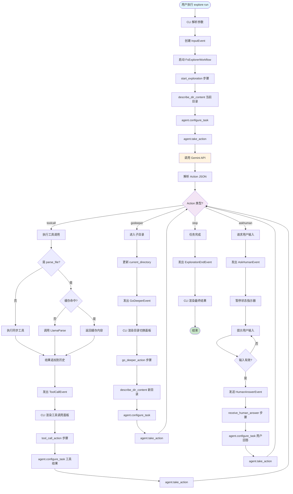
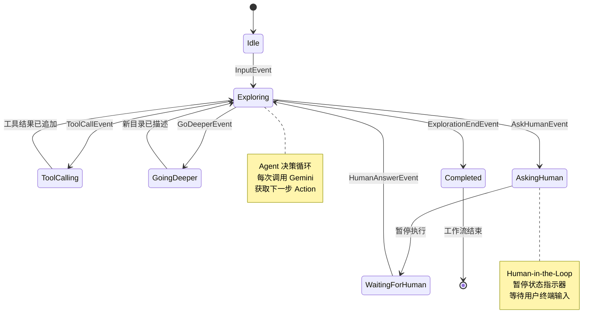

# 03-02 — 智能体探索流程

> **本章内容**: Agent 决策循环的详细流程
> **预估字数**: ~8,000 字

---

## 1. 流程概述

Agent 探索流程是 fs-explorer 的核心业务流程，实现了 AI 智能体自主探索文件系统以完成用户任务的能力。该流程是一个**事件驱动的状态机**，通过不断循环"感知 → 决策 → 行动 → 观察"四个阶段，直到任务完成或超时。

---

## 2. 完整流程图



---

## 3. 步骤详解

### 3.1 步骤 1: start_exploration（初始探索）

**触发事件**: `InputEvent(task=用户任务)`

**核心逻辑**:

```python
@step
async def start_exploration(self, ev: InputEvent, ctx: Context[WorkflowState], agent: FsExplorerAgent):
    # 1. 保存初始任务到状态
    async with ctx.store.edit_state() as state:
        state.intial_task = ev.task

    # 2. 描述当前目录内容
    dirdescription = describe_dir_content(".")

    # 3. 配置 Agent 任务
    agent.configure_task(
        f"Given that the current directory ('.') looks like this:\n\n```text\n{dirdescription}```\n\n"
        f"And that the user is giving you this task: '{ev.task}', what action should you take first?"
    )

    # 4. 获取 Agent 决策
    result = await agent.take_action()

    # 5. 根据 Action 类型路由到对应事件
    action, action_type = result
    if action_type == "godeeper":
        res = GoDeeperEvent(directory=godeeper.directory, reason=action.reason)
        async with ctx.store.edit_state() as state:
            state.current_directory = godeeper.directory
        ctx.write_event_to_stream(res)
    elif action_type == "toolcall":
        res = ToolCallEvent(tool_name=toolcall.tool_name, tool_input=toolcall.to_fn_args(), reason=action.reason)
        ctx.write_event_to_stream(res)
    elif action_type == "askhuman":
        res = AskHumanEvent(question=askhuman.question, reason=action.reason)
    else:
        res = ExplorationEndEvent(final_result=stopaction.final_result)
    return res
```

**关键设计**:
- 目录描述使用 `describe_dir_content()` 生成，包含 FILES 和 SUBFOLDERS 两部分。
- 任务提示词明确告诉 Agent "what action should you take first?"，引导其做出首个决策。
- 状态更新使用 `ctx.store.edit_state()` 确保线程安全。

### 3.2 步骤 2: go_deeper_action（目录深入）

**触发事件**: `GoDeeperEvent(directory=子目录, reason=原因)`

**核心逻辑**:

```python
@step
async def go_deeper_action(self, ev: GoDeeperEvent, ctx: Context[WorkflowState], agent: FsExplorerAgent):
    # 1. 获取当前状态
    state = await ctx.store.get_state()

    # 2. 描述新目录内容
    dirdescription = describe_dir_content(state.current_directory)

    # 3. 配置 Agent 任务
    agent.configure_task(
        f"Given that the current directory ('{state.current_directory}') looks like this:\n\n"
        f"```text\n{dirdescription}```\n\n"
        f"And that the user is giving you this task: '{state.intial_task}', what action should you take next?"
    )

    # 4. 获取 Agent 决策并路由（同 start_exploration）
    ...
```

**关键设计**:
- 每次进入新目录后重新描述，确保 Agent 了解新环境。
- 提示词使用 "what action should you take next?" 而非 "first"，表明这是后续决策。

### 3.3 步骤 3: tool_call_action（工具调用后处理）

**触发事件**: `ToolCallEvent(tool_name=工具名, tool_input=输入, reason=原因)`

**核心逻辑**:

```python
@step
async def tool_call_action(self, ev: ToolCallEvent, ctx: Context[WorkflowState], agent: FsExplorerAgent):
    # 1. 配置 Agent 任务
    agent.configure_task(
        "Given the result from the tool call you just performed, what action should you take next?"
    )

    # 2. 获取 Agent 决策并路由
    ...
```

**关键设计**:
- 工具结果已经通过 `agent.call_tool()` 追加到对话历史。
- Agent 只需基于结果决定下一步，无需再次了解目录内容。

### 3.4 步骤 4: receive_human_answer（接收人类回答）

**触发事件**: `HumanAnswerEvent(response=用户回答)`

**核心逻辑**:

```python
@step
async def receive_human_answer(self, ev: HumanAnswerEvent, ctx: Context[WorkflowState], agent: FsExplorerAgent):
    # 1. 获取当前状态
    state = await ctx.store.get_state()

    # 2. 配置 Agent 任务
    agent.configure_task(
        f"Human response to your question: {ev.response}\n\n"
        f"Based on it, proceed with you exploration based on the original task: {state.intial_task}"
    )

    # 3. 获取 Agent 决策并路由
    ...
```

**关键设计**:
- 将用户回答和原始任务一起传递给 Agent，确保上下文连贯。

---

## 4. Agent.take_action() 详细流程

```mermaid
flowchart TD                                                                                                                                                               
      A[take_action] --> B[构建请求]
      B --> C[发送对话历史到 Gemini]                                                                                                                                         
      C --> D{响应有效?}                                                                                                                                                     
      D -->|否| E[返回 None]                                                                                                                                                 
      D -->|是| F["解析 candidates[0].content"]                                                                                                                              
      F --> G[追加到 _chat_history]                                                                                                                                          
      G --> H[model_validate_json 解析 Action]                                                                                                                               
      H --> I{Action 类型?}                                                                                                                                                  
      I -->|toolcall| J[调用 call_tool]                                                                                                                                      
      I -->|其他| K[直接返回]                                                                                                                                                
      J --> L[查找 TOOLS 注册表]                                                                                                                                             
      L --> M{工具是异步?}                                                                                                                                                   
      M -->|是| N[await 执行]                                                                                                                                                
      M -->|否| O[同步执行]                                                                                                                                                  
      N --> P{执行成功?}                                                                                                                                                     
      O --> P                                                                                                                                                                
      P -->|是| Q[获取结果]                                                                                                                                                  
      P -->|否| R[捕获异常，生成错误信息]                                                                                                                                    
      Q --> S[追加到 _chat_history]                                                                                                                                          
      R --> S                                                                                                                                                                
      S --> T[返回 action, action_type]                                                                                                                                      
      K --> T
```



---

## 5. 状态机视图



---

## 6. 异常处理

### 6.1 Gemini API 调用失败

```python
# agent.py
async def take_action(self):
    response = await self._client.aio.models.generate_content(...)
    if response.candidates is not None:
        if response.candidates[0].content is not None:
            self._chat_history.append(response.candidates[0].content)
        if response.text is not None:
            action = Action.model_validate_json(response.text)
            ...
    return None  # 失败时返回 None
```

**处理**: 工作流步骤检查 `result is None`，返回 `ExplorationEndEvent(error="Could not produce action to take")`。

### 6.2 工具执行异常

```python
# agent.py
async def call_tool(self, tool_name, tool_input):
    try:
        if tool_name != "parse_file":
            result = TOOLS[tool_name](**tool_input)
        else:
            result = await TOOLS[tool_name](**tool_input)
    except Exception as e:
        result = f"An error occurred while calling tool {tool_name} with {tool_input}: {e}"
    # 将错误信息作为工具结果追加到历史
    self._chat_history.append(...)
```

**处理**: 异常被转换为错误字符串，作为工具结果返回给 Agent，Agent 可以据此调整策略。

### 6.3 工作流超时

```python
# workflow.py
workflow = FsExplorerWorkflow(timeout=120)
```

**处理**: 工作流引擎在 120 秒后自动终止，抛出 `TimeoutError`。

---

## 7. 性能分析

| 阶段 | 延迟来源 | 典型耗时 |
|------|---------|---------|
| 目录描述 | 文件系统 I/O | < 10ms |
| Gemini 决策 | 网络 API 调用 | 1-5s |
| 工具调用（本地） | 文件读取/正则匹配 | < 100ms |
| 工具调用（parse_file 缓存命中） | DiskCache 读取 | < 10ms |
| 工具调用（parse_file 缓存未命中） | LlamaParse API | 10-30s |
| 用户输入等待 | 用户响应时间 | 不确定 |

**优化建议**:
1. 预加载缓存可消除 parse_file 的网络延迟。
2. 使用 Gemini Flash 模型减少决策延迟。
3. 限制对话历史长度，避免上下文窗口溢出。

---

## 8. 设计模式应用

### 8.1 模板方法模式

四个步骤共享相同的决策后处理逻辑：

```python
# 伪代码展示模式
async def step_template(self, ev, ctx, agent):
    # 1. 准备上下文（各步骤不同）
    agent.configure_task(...)

    # 2. 获取决策（相同）
    result = await agent.take_action()

    # 3. 路由事件（相同）
    action, action_type = result
    if action_type == "godeeper": ...
    elif action_type == "toolcall": ...
    elif action_type == "askhuman": ...
    else: ...
```

⚠️ **代码重复**: 当前实现中，四个步骤的事件路由逻辑完全相同，存在大量重复代码。建议提取为共享方法。

### 8.2 观察者模式

CLI 通过订阅事件流观察 Agent 行为：

```python
async for event in handler.stream_events():
    if isinstance(event, ToolCallEvent):
        # 渲染工具调用面板
    elif isinstance(event, GoDeeperEvent):
        # 渲染目录切换面板
    elif isinstance(event, AskHumanEvent):
        # 暂停并请求输入
```

---

# ❤️ 制作不易，请我喝咖啡☕️关注我➕


