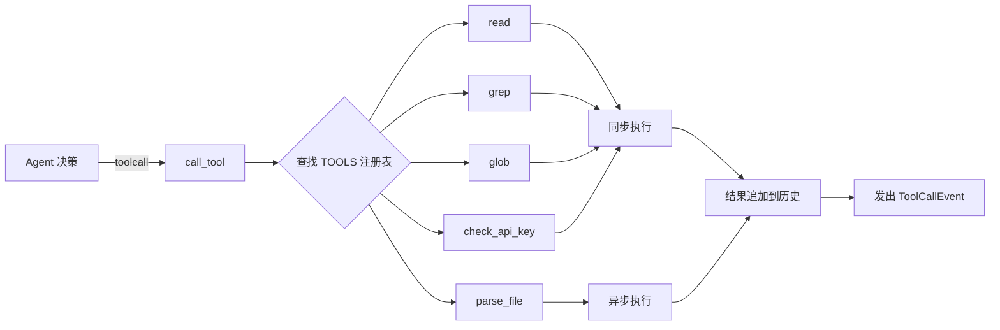
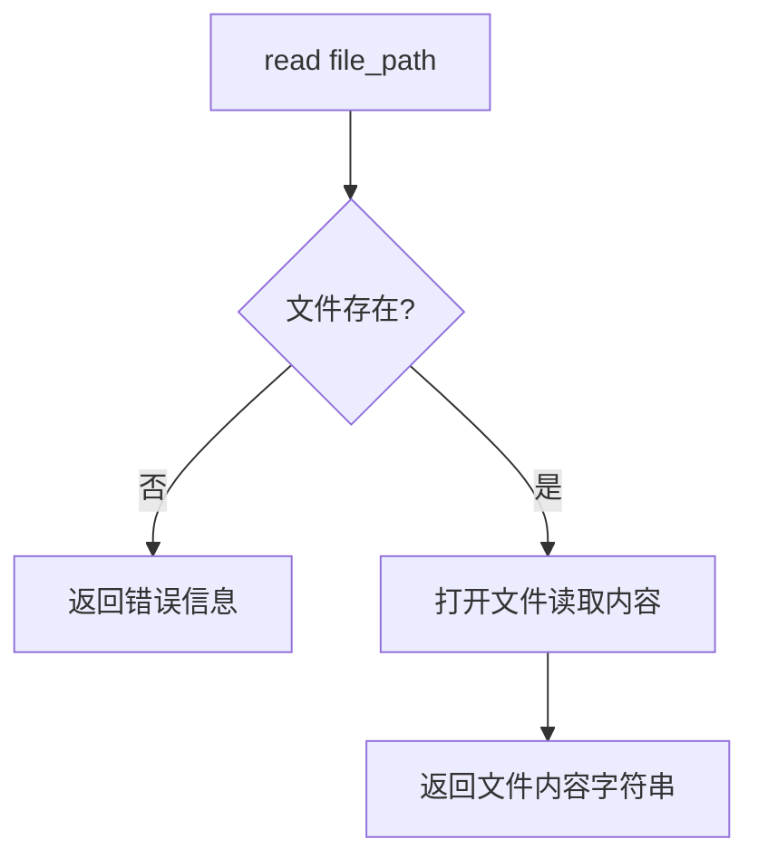
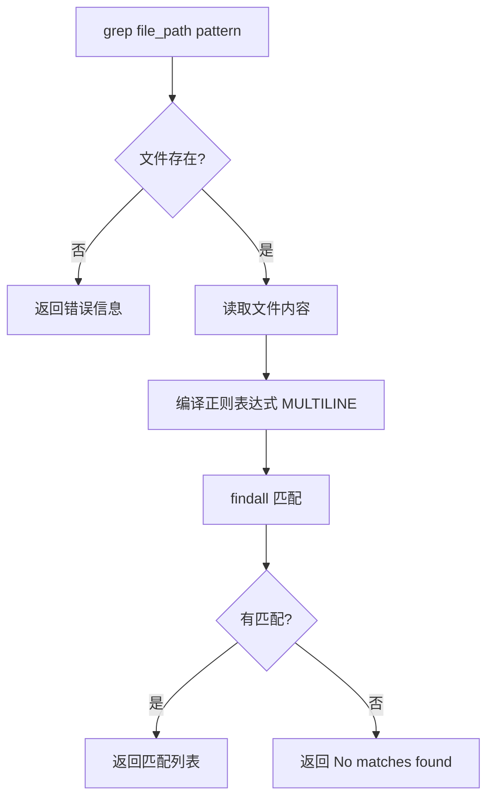
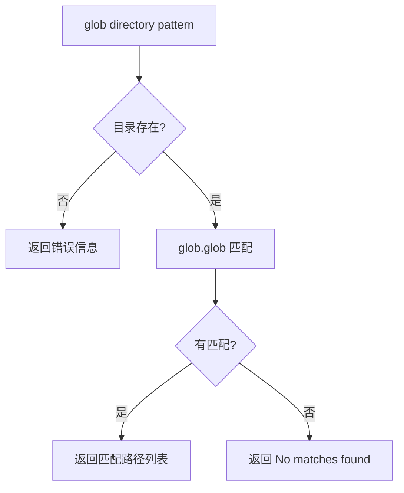
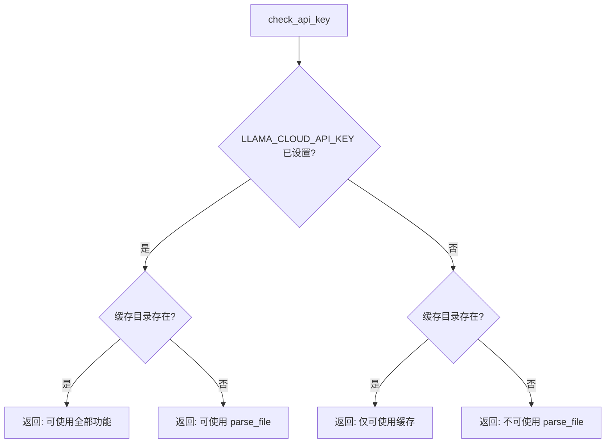
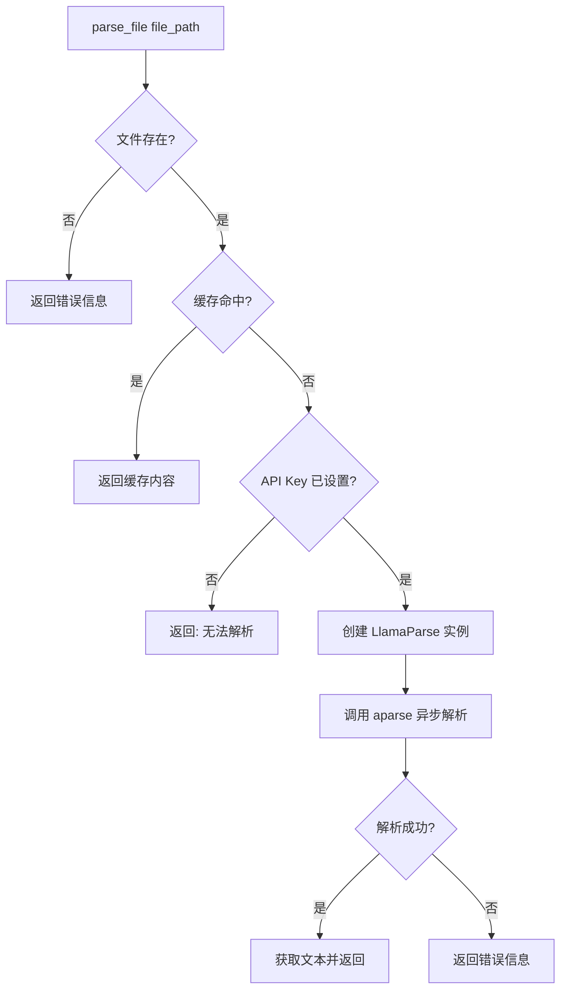

# 03-03 — 工具调用流程

> **本章内容**: 5 种工具调用的详细流程
> **预估字数**: ~6,000 字

---

## 1. 工具调用总览



---

## 2. read 工具

### 2.1 流程图



### 2.2 代码实现

```python
def read_file(file_path: str) -> str:
    if not os.path.exists(file_path) or not os.path.isfile(file_path):
        return f"No such file: {file_path}"
    with open(file_path, "r") as f:
        return f.read()
```

### 2.3 特性

- **同步执行**: 直接读取，无网络调用
- **错误处理**: 文件不存在时返回错误字符串而非抛出异常
- **编码**: 使用系统默认编码（UTF-8）

---

## 3. grep 工具

### 3.1 流程图



### 3.2 代码实现

```python
def grep_file_content(file_path: str, pattern: str) -> str:
    if not os.path.exists(file_path) or not os.path.isfile(file_path):
        return f"No such file: {file_path}"
    with open(file_path, "r") as f:
        content = f.read()
    r = re.compile(pattern=pattern, flags=re.MULTILINE)
    matches = r.findall(content)
    if matches:
        return f"MATCHES for {pattern} in {file_path}:\n\n- " + "\n- ".join(matches)
    return "No matches found"
```

### 3.3 特性

- **正则支持**: 使用 Python `re` 模块，支持完整正则语法
- **MULTILINE 标志**: 支持多行匹配
- **返回格式**: 匹配结果以列表形式返回

---

## 4. glob 工具

### 4.1 流程图



### 4.2 代码实现

```python
def glob_paths(directory: str, pattern: str) -> str:
    if not os.path.exists(directory) or not os.path.isdir(directory):
        return f"No such directory: {directory}"
    matches = glob.glob(f"./{directory}/{pattern}")
    if matches:
        return f"MATCHES for {pattern} in {directory}:\n\n- " + "\n- ".join(matches)
    return "No matches found"
```

### 4.3 特性

- **路径拼接**: 使用 `./{directory}/{pattern}` 格式
- **非递归**: 仅匹配当前目录，不进入子目录

---

## 5. check_api_key 工具

### 5.1 流程图



### 5.2 代码实现

```python
def check_api_key() -> str:
    if os.getenv("LLAMA_CLOUD_API_KEY") is not None:
        message = "LLAMA_CLOUD_API_KEY is set and you can use the 'parse_file' tool"
        if CACHING_DIR.is_dir():
            message += " in all its functionalities"
        return message
    else:
        if CACHING_DIR.is_dir():
            message = "LLAMA_CLOUD_API_KEY is not set and you can use 'parse_file', but you will only have access to cached files."
        else:
            message = "LLAMA_CLOUD_API_KEY is not set and you cannot use the 'parse_file' tool"
        return message
```

---

## 6. parse_file 工具

### 6.1 流程图



### 6.2 代码实现

```python
async def parse_file(file_path: str) -> str:
    if not os.path.exists(file_path) or not os.path.isfile(file_path):
        return f"No such file: {file_path}"
    # 1. 检查缓存
    if (content := CACHE.get_file(file_path)) is not None:
        return content
    # 2. 检查 API Key
    if os.getenv("LLAMA_CLOUD_API_KEY") is None:
        return f"Not possible to parse {file_path} because..."
    # 3. 调用 LlamaParse
    parser = LlamaParse(
        api_key=cast(str, os.getenv("LLAMA_CLOUD_API_KEY")),
        result_type=ResultType.TXT,
        fast_mode=True,
    )
    result = cast(JobResult, await parser.aparse(file_path=file_path))
    if result.error is None:
        return await result.aget_text()
    else:
        return f"There was an error while parsing the file {file_path}: {result.error}"
```

### 6.3 特性

- **异步执行**: 使用 `await parser.aparse()`
- **缓存优先**: 先检查 DiskCache，避免重复 API 调用
- **降级策略**: 无 API Key 时返回错误信息，不中断工作流

---

## 7. 工具调用结果处理

所有工具调用结果统一处理：

```python
async def call_tool(self, tool_name: Tools, tool_input: dict[str, Any]) -> None:
    try:
        if tool_name != "parse_file":
            result = TOOLS[tool_name](**tool_input)  # 同步
        else:
            result = await TOOLS[tool_name](**tool_input)  # 异步
    except Exception as e:
        result = f"An error occurred while calling tool {tool_name} with {tool_input}: {e}"
    # 统一追加到对话历史
    self._chat_history.append(
        Content(role="user", parts=[Part.from_text(text=f"Tool result for {tool_name}:\n\n{result}")])
    )
```

**设计要点**:
- 工具结果以 `role="user"` 追加，模拟用户反馈
- 格式统一为 `Tool result for {tool_name}:\n\n{result}`
- 异常被捕获并转换为错误字符串，不中断工作流

---

☕️ 制作不易，请我喝咖啡☕️关注我➕

