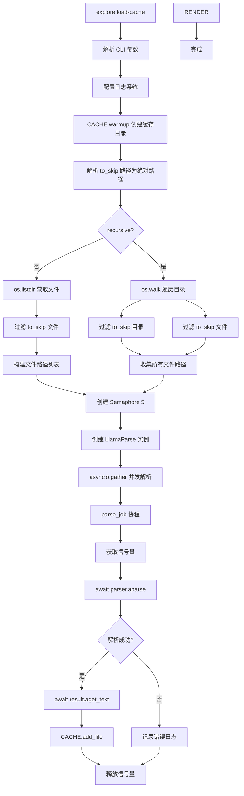

# 03-04 — 缓存加载流程

> **本章内容**: 预解析文件到持久缓存的完整流程
> **预估字数**: ~5,000 字

---

## 1. 流程概述

缓存加载流程允许用户预先将目录中的所有文件解析并存储到磁盘缓存中，从而在后续的 Agent 探索或 RAG 索引中避免重复的 LlamaParse API 调用。

**触发命令**: `explore load-cache --directory . --recursive --skip tmp`

---

## 2. 完整流程图



---

## 3. 代码实现

```python
async def parse_and_cache(directory: str, recursive: bool, to_skip: list[str]) -> None:
    logging.basicConfig(...)
    CACHE.warmup()
    dir_path = Path(directory)
    to_skip_resolved = [str((dir_path / path).resolve()) for path in to_skip]

    if not recursive:
        files = []
        fls = os.listdir(dir_path)
        for fl in fls:
            resolved = str(Path(dir_path / fl).resolve())
            if resolved not in to_skip_resolved:
                files.append(resolved)
    else:
        files = []
        for root, dirs, fls in os.walk(dir_path):
            dirs[:] = [str((Path(root) / d).resolve()) for d in dirs if d not in to_skip_resolved]
            fls[:] = [str((Path(root) / f).resolve()) for f in fls if f not in to_skip_resolved]
            for fl in fls:
                files.append(str((Path(root) / fl).resolve()))

    semaphore = asyncio.Semaphore(5)
    parser = LlamaParse(api_key=..., result_type=ResultType.TXT, fast_mode=True)

    async def parse_job(file_path: str) -> None:
        async with semaphore:
            result = cast(JobResult, await parser.aparse(file_path=file_path))
            if result.error is None:
                text = await result.aget_text()
                CACHE.add_file(file_path, text)
            else:
                logging.info(f"Could not parse file {file_path} because of {result.error}")

    await asyncio.gather(*(parse_job(file) for file in files))
```

---

## 4. 并发控制

### 4.1 Semaphore 机制

```python
semaphore = asyncio.Semaphore(5)  # 最大并发度 5

async def parse_job(file_path: str) -> None:
    async with semaphore:  # 获取信号量，达到上限时等待
        result = await parser.aparse(file_path=file_path)
        ...
```

**设计理由**:
- LlamaParse API 有速率限制，过高并发会导致 429 错误
- 5 个并发是经验值，平衡了速度和稳定性
- 使用 `async with` 确保信号量正确释放

### 4.2 asyncio.gather

```python
await asyncio.gather(*(parse_job(file) for file in files))
```

- 创建 N 个协程（N = 文件数量）
- 所有协程并发执行，但受 Semaphore 限制
- 等待所有协程完成

---

## 5. 路径处理

### 5.1 跳过路径解析

```python
to_skip_resolved = [str((dir_path / path).resolve()) for path in to_skip]
```

- 将相对路径转换为绝对路径
- 使用 `Path.resolve()` 规范化路径（解析符号链接、`..` 等）

### 5.2 os.walk 过滤

```python
for root, dirs, fls in os.walk(dir_path):
    dirs[:] = [...]  # 原地修改 dirs 控制遍历行为
    fls[:] = [...]
```

- `dirs[:] = ...` 原地修改，影响 `os.walk` 的递归行为
- 被跳过的目录不会进入下一轮遍历

---

## 6. 缓存写入

```python
CACHE.add_file(file_path, text)
```

**ParsedFileCache.add_file**:

```python
def add_file(self, file_path: str, content: str) -> None:
    resolved_path = str(Path(file_path).resolve())
    self._cache.add(resolved_path, content)
```

- 键: 文件绝对路径
- 值: 解析后的纯文本
- 存储: DiskCache (SQLite)

---

## 7. 性能分析

| 阶段 | 耗时 | 说明 |
|------|------|------|
| 目录遍历 | O(n) | n = 文件数量 |
| 并发解析 | O(n/5 × t) | t = 单次解析时间 |
| 缓存写入 | O(n) | SQLite 批量写入 |

**优化建议**:
1. 增加并发度（如果 API 允许）
2. 使用连接池复用 HTTP 连接
3. 增量缓存（仅解析新文件）

---

☕️ 制作不易，请我喝咖啡☕️关注我➕

