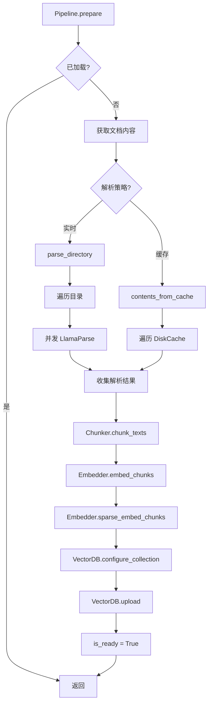
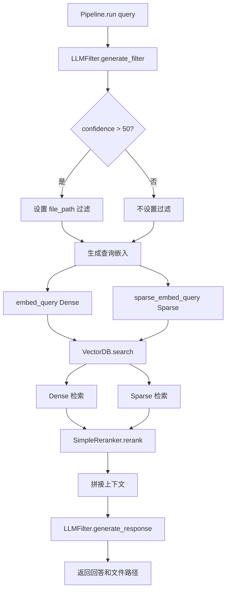
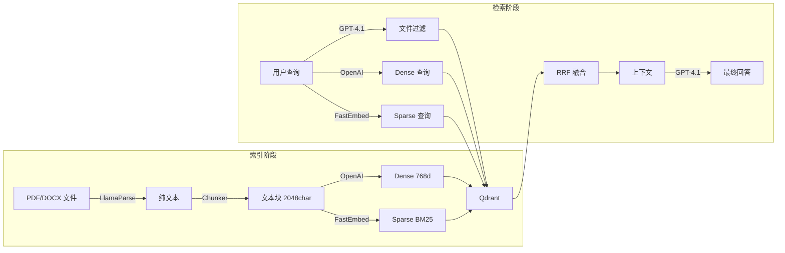

# 03-05 — RAG 流水线流程

> **本章内容**: RAG 索引和检索的完整流程
> **预估字数**: ~8,000 字

---

## 1. 流程概述

RAG 流水线分为两个阶段：

1. **索引阶段（prepare）**: 文档 → 解析 → 分块 → 嵌入 → 存储
2. **检索阶段（run）**: 查询 → 过滤 → 嵌入 → 检索 → 重排序 → 生成

---

## 2. 索引阶段流程图



---

## 3. 检索阶段流程图



---

## 4. 索引阶段详解

### 4.1 文档解析

**策略 1: 实时解析 (parse_directory)**

```python
async def parse_directory(directory: str, recursive: bool, to_skip: list[str]) -> dict[str, str]:
    # 1. 遍历目录获取文件列表
    # 2. 并发调用 LlamaParse（Semaphore 5）
    # 3. 收集结果为 {file_path: text}
    files_contents = await asyncio.gather(*(parse_job(file) for file in files))
    return {path: text for path, text in files_contents if el is not None}
```

**策略 2: 缓存加载 (contents_from_cache)**

```python
def contents_from_cache(cache_directory: str = "tmp/cache") -> dict[str, str]:
    cache = Cache(directory=cache_directory)
    data = {}
    for key in cache.iterkeys():
        value = cache.get(key)
        if value is not None:
            data[key] = value
    return data
```

### 4.2 文本分块

```python
class Chunker:
    def __init__(self):
        self._chunker = SentenceChunker(
            chunk_size=2048,      # 每块最大字符数
            chunk_overlap=200,    # 块间重叠字符数（约 10%）
        )

    def chunk_texts(self, contents: dict[str, str]) -> list[ChunkWithMetadata]:
        texts = list(contents.values())
        files = list(contents.keys())
        batch_chunks = self._chunker.chunk_batch(texts=texts)
        # 为每个 chunk 附加 file_path 元数据
        ...
```

**设计要点**:
- 使用 Chonkie 的 SentenceChunker，在句子边界处切分
- 200 字符重叠确保上下文连贯性
- `chunk_batch` 批量处理提升效率

### 4.3 嵌入生成

**稠密嵌入 (OpenAI)**:

```python
async def embed_chunks(self, chunks):
    texts = [chunk["chunk"].text for chunk in chunks]
    embeddings = await self._client.embeddings.create(
        input=texts, model=self.model, dimensions=768,
    )
    for i, embedding in enumerate(embeddings.data):
        chunks[i]["embedding"] = embedding.embedding
    return chunks
```

**稀疏嵌入 (FastEmbed BM25)**:

```python
def sparse_embed_chunks(self, chunks):
    texts = [chunk["chunk"].text for chunk in chunks]
    embeddings = list(self._sparse_embedder.embed(texts))
    for i, embedding in enumerate(embeddings):
        chunks[i]["sparse_embedding"] = embedding
    return chunks
```

### 4.4 向量上传

```python
async def upload(self, data: list[ChunkWithMetadata]) -> None:
    # 1. 准备稀疏向量
    sparse_embeddings = [{"sparse-text": SparseVector(indices=..., values=...)}]
    # 2. 准备稠密向量
    dense_embeddings = [{"dense-text": d["embedding"]}]
    # 3. 准备 payload
    payloads = [{"content": d["chunk"].text, "file_path": d["file_path"]}]
    # 4. 上传到 Qdrant
    self._client.upload_collection(self.collection_name, vectors=dense_embeddings, ...)
    self._client.upload_collection(self.collection_name, vectors=sparse_embeddings, ...)
```

---

## 5. 检索阶段详解

### 5.1 LLM 文件过滤

```python
async def generate_filter(self, query: str, file_paths: list[str]) -> FileFilter | None:
    # 使用 GPT-4.1 从文件列表中筛选最相关的文件
    response = await self._client.responses.parse(
        text_format=FileFilter,
        input=[message],
        model=self.model,
    )
    return response.output_parsed
```

**过滤条件**: `confidence > 50` 时才应用文件过滤，否则全库检索。

### 5.2 混合检索

```python
async def search(self, query: str, file_path: str | None = None, limit: int = 1):
    # 1. Dense 检索
    dense_embedding = await self.embedder.embed_query(query)
    result_dense = await self._client.query_points(..., using="dense-text", ...)

    # 2. Sparse 检索
    sparse_embedding = self.embedder.sparse_embed_query(query)
    result_sparse = await self._client.query_points(..., using="sparse-text", ...)

    # 3. RRF 重排序
    return self._reranker.rerank(dense_results, sparse_results, limit)
```

### 5.3 RRF 重排序

```python
def _reciprocal_rank_fusion(self, dense_results, sparse_results):
    rrf_scores = {}
    for rank, result in enumerate(dense_results, start=1):
        content = result["content"]
        rrf_scores[content] = rrf_scores.get(content, 0.0) + 1 / (self.k + rank)
    for rank, result in enumerate(sparse_results, start=1):
        content = result["content"]
        rrf_scores[content] = rrf_scores.get(content, 0.0) + 1 / (self.k + rank)
    return rrf_scores
```

**公式**: `score(d) = 1/(k + rank_dense(d)) + 1/(k + rank_sparse(d))`

**k=60**: 平滑常数，降低高排名项的权重差异。

### 5.4 回答生成

```python
async def generate_response(self, query: str, context: str) -> GroundedResponse | None:
    # 使用 GPT-4.1 基于检索上下文生成回答
    response = await self._client.responses.parse(
        text_format=GroundedResponse,
        input=[message],
        model=self.model,
    )
    return response.output_parsed
```

---

## 6. 数据流图



---

## 7. 性能分析

| 阶段 | 操作 | 耗时 | 瓶颈 |
|------|------|------|------|
| 索引 | 文档解析 | 10-30s/文件 | LlamaParse API |
| 索引 | 文本分块 | O(n) | CPU |
| 索引 | 嵌入生成 | 1-2s/批 | OpenAI API |
| 索引 | 向量上传 | O(n) | Qdrant |
| 检索 | 文件过滤 | 1-2s | GPT-4.1 API |
| 检索 | 查询嵌入 | 0.5-1s | OpenAI API |
| 检索 | 向量检索 | < 100ms | Qdrant |
| 检索 | 回答生成 | 1-3s | GPT-4.1 API |

---

# ❤️ 制作不易，请我喝咖啡☕️关注我➕

