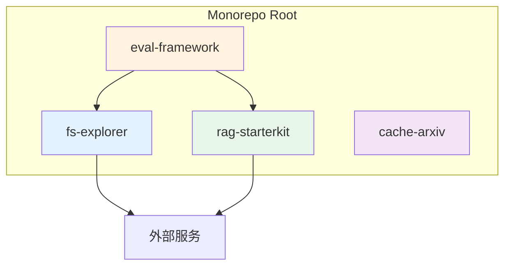
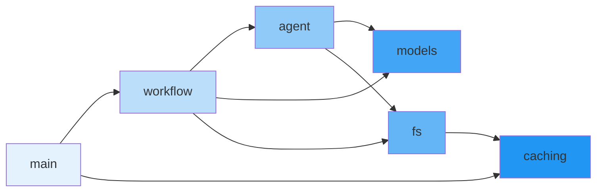
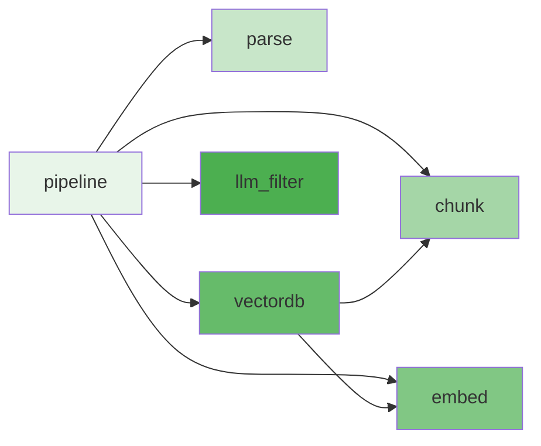
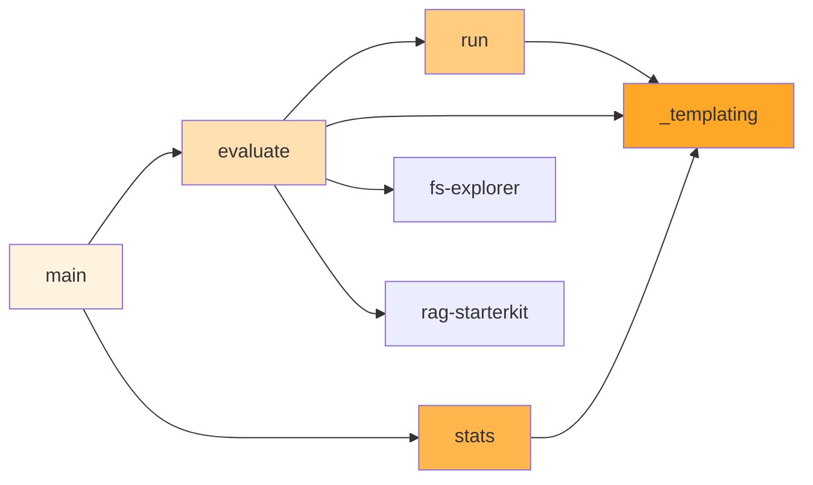

# 04-03 — 依赖关系图

> **本章内容**: 模块间依赖关系、第三方依赖分析
> **预估字数**: ~6,000 字

---

## 1. 包间依赖关系



**依赖说明**:
- `eval-framework` 依赖 `fs-explorer` 和 `rag-starterkit`
- `fs-explorer` 和 `rag-starterkit` 相互独立
- `cache-arxiv` 完全独立

---

## 2. fs_explorer 内部依赖



**依赖说明**:
- `main` 依赖 `workflow`（启动工作流）和 `caching`（缓存命令）
- `workflow` 依赖 `agent`（决策）、`models`（事件类型）、`fs`（目录描述）
- `agent` 依赖 `models`（Action 类型）和 `fs`（工具函数）
- `fs` 依赖 `caching`（parse_file 缓存优先）

---

## 3. rag-starterkit 内部依赖



**依赖说明**:
- `pipeline` 是所有组件的编排者
- `vectordb` 依赖 `embed`（查询嵌入）和 `chunk`（数据类型）
- 其他模块相互独立

---

## 4. eval-framework 内部依赖



---

## 5. 第三方依赖分析

### 5.1 fs-explorer 依赖

| 依赖 | 版本 | 用途 | 必需 |
|------|------|------|------|
| `diskcache` | >= 5.6.3 | 磁盘缓存 | ✅ |
| `google-genai` | >= 1.55.0 | Gemini API 客户端 | ✅ |
| `llama-cloud-services` | >= 0.6.88 | LlamaParse 客户端 | ✅ |
| `llama-index-workflows` | >= 2.11.5 | 工作流引擎 | ✅ |
| `typer` | >= 0.20.0 | CLI 框架 | ✅ |

### 5.2 rag-starterkit 依赖

| 依赖 | 版本 | 用途 | 必需 |
|------|------|------|------|
| `chonkie` | >= 1.5.2 | 文本分块 | ✅ |
| `diskcache` | >= 5.6.3 | 磁盘缓存 | ✅ |
| `fastembed` | >= 0.7.4 | 稀疏嵌入 | ✅ |
| `llama-cloud-services` | >= 0.6.88 | 文档解析 | ✅ |
| `openai` | >= 2.14.0 | OpenAI API 客户端 | ✅ |
| `qdrant-client` | >= 1.16.2 | Qdrant 客户端 | ✅ |

### 5.3 eval-framework 依赖

| 依赖 | 版本 | 用途 | 必需 |
|------|------|------|------|
| `fs-explorer` | workspace | Agent 框架 | ✅ |
| `rag-starterkit` | workspace | RAG 框架 | ✅ |
| `typer` | >= 0.20.0 | CLI 框架 | ✅ |

### 5.4 cache-arxiv 依赖

| 依赖 | 版本 | 用途 | 必需 |
|------|------|------|------|
| `diskcache` | >= 5.6.3 | 磁盘缓存 | ✅ |
| `typer` | >= 0.20.0 | CLI 框架 | ✅ |

---

## 6. 依赖矩阵

### 6.1 内部依赖矩阵

| 模块 | main | agent | workflow | fs | models | caching |
|------|------|-------|----------|-----|--------|---------|
| main | - | | ✓ | | | ✓ |
| agent | | - | | ✓ | ✓ | |
| workflow | | ✓ | - | ✓ | ✓ | |
| fs | | | | - | | ✓ |
| models | | | | | - | |
| caching | | | | | | - |

### 6.2 外部服务依赖矩阵

| 模块 | Gemini | OpenAI | LlamaParse | Qdrant | DiskCache |
|------|--------|--------|------------|--------|-----------|
| fs-explorer | ✅ | | ✅ | | ✅ |
| rag-starterkit | | ✅ | ✅ | ✅ | ✅ |
| eval-framework | ✅* | ✅ | ✅* | ✅* | ✅* |

*通过依赖包间接使用

---

## 7. 循环依赖检查

经过分析，项目**不存在循环依赖**：

```
fs_explorer: main → workflow → agent → fs → caching（单向）
rag-starterkit: pipeline → {parse, chunk, embed, vectordb, llm_filter}（星型）
eval-framework: main → evaluate → run（单向）
```

---

## 8. 依赖倒置原则检查

| 原则 | 遵守情况 | 说明 |
|------|---------|------|
| 高层模块不依赖低层实现 | ✅ | Pipeline 依赖抽象组件接口 |
| 抽象不依赖细节 | ✅ | 模型定义独立于实现 |
| 细节依赖抽象 | ⚠️ 部分 | 工具函数直接依赖具体实现 |

**改进建议**:
- `fs.py` 中的工具函数直接依赖 `caching.CACHE` 全局实例，建议通过参数注入。
- `workflow.py` 中的 `AGENT` 全局实例可通过参数传入而非 Resource 注入。

---

# ❤️ 制作不易，请我喝咖啡☕️关注我➕

