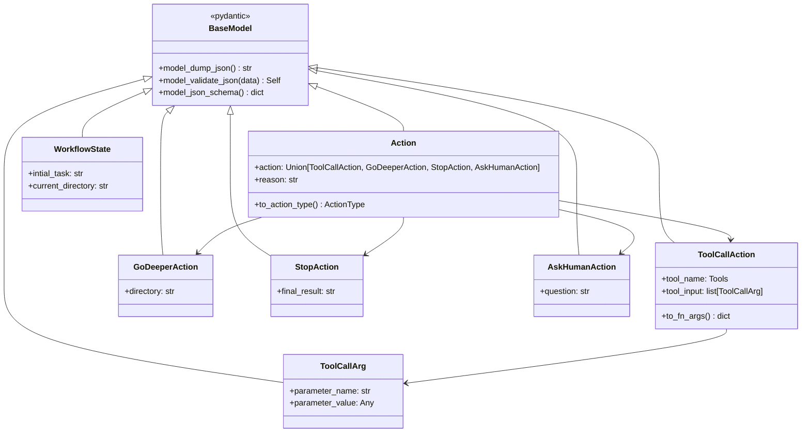

# 06-01 — Pydantic 模型详解

> **本章内容**: Action 继承体系、类型系统、JSON Schema 生成
> **预估字数**: ~8,000 字

---

## 1. 模型继承体系



---

## 2. Action JSON Schema

Pydantic 自动生成的 JSON Schema 用于约束 Gemini 输出：

```json
{
  "title": "Action",
  "type": "object",
  "properties": {
    "action": {
      "anyOf": [
        {"$ref": "#/$defs/ToolCallAction"},
        {"$ref": "#/$defs/GoDeeperAction"},
        {"$ref": "#/$defs/StopAction"},
        {"$ref": "#/$defs/AskHumanAction"}
      ]
    },
    "reason": {"type": "string"}
  },
  "required": ["action", "reason"],
  "$defs": {
    "ToolCallAction": {
      "properties": {
        "tool_name": {"enum": ["read", "grep", "glob", "check_api_key", "parse_file"]},
        "tool_input": {
          "items": {"$ref": "#/$defs/ToolCallArg"},
          "type": "array"
        }
      }
    },
    "GoDeeperAction": {
      "properties": {
        "directory": {"type": "string"}
      }
    },
    "StopAction": {
      "properties": {
        "final_result": {"type": "string"}
      }
    },
    "AskHumanAction": {
      "properties": {
        "question": {"type": "string"}
      }
    },
    "ToolCallArg": {
      "properties": {
        "parameter_name": {"type": "string"},
        "parameter_value": {}
      }
    }
  }
}
```

---

## 3. 类型别名

```python
Tools = Literal["read", "grep", "glob", "check_api_key", "parse_file"]
ActionType = Literal["stop", "godeeper", "toolcall", "askhuman"]
```

**作用**:
- 编译时类型检查
- IDE 自动补全
- 运行时类型安全

---

## 4. 模型验证

### 4.1 自动验证

Pydantic 在反序列化时自动验证：

```python
action = Action.model_validate_json(response.text)
# 如果 JSON 不符合 Schema，抛出 ValidationError
```

### 4.2 字段约束

```python
class Evaluation(BaseModel):
    relevance: int = Field(ge=0, le=10)  # 0-10 范围
    correctness: int = Field(ge=0, le=10)
    confidence: int = Field(ge=0, le=100)  # 0-100 范围
```

---

## 5. 序列化与反序列化

### 5.1 序列化

```python
action = Action(action=StopAction(final_result="完成"), reason="任务已完成")
json_str = action.model_dump_json()
# {"action": {"final_result": "完成"}, "reason": "任务已完成"}
```

### 5.2 反序列化

```python
action = Action.model_validate_json(json_str)
# Action(action=StopAction(final_result="完成"), reason="任务已完成")
```

### 5.3 Schema 生成

```python
schema = Action.model_json_schema()
# 返回完整的 JSON Schema 字典
```

---

☕️ 制作不易，请我喝咖啡☕️关注我➕

