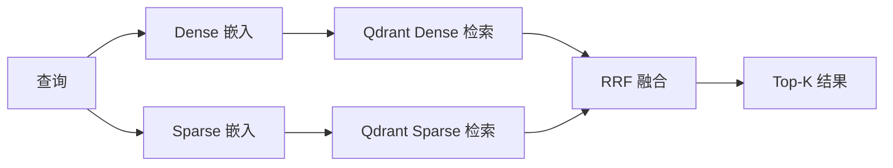

# 06-02 — Qdrant 向量库设计

> **本章内容**: Qdrant Collection 结构、向量配置、索引设计
> **预估字数**: ~6,000 字

---

## 1. Collection 配置

### 1.1 Collection 列表

| Collection 名称 | 向量类型 | 用途 |
|-----------------|---------|------|
| `rag-benchmark` | Dense + Sparse | 标准评估（少量 PDF） |
| `rag-benchmark-advanced` | Sparse only | 大规模评估（arXiv 论文） |

### 1.2 向量配置

```python
# Dense 向量配置
vectors_config = {
    "dense-text": VectorParams(size=768, distance=Distance.COSINE)
}

# Sparse 向量配置
sparse_vectors_config = {
    "sparse-text": SparseVectorParams(index=SparseIndexParams(on_disk=False))
}
```

**参数说明**:
- `size=768`: 嵌入维度（OpenAI text-embedding-3-small）
- `distance=COSINE`: 余弦相似度
- `on_disk=False`: 稀疏索引存储在内存中

---

## 2. Payload 结构

每个向量点附带 payload 元数据：

```python
payload = {
    "content": "文本块内容",      # str
    "file_path": "/path/to/file"  # str
}
```

---

## 3. 检索流程



---

## 4. 过滤查询

```python
# 按文件路径过滤
filt = Filter(
    must=FieldCondition(key="file_path", match=MatchValue(value=file_path))
)
result = await client.query_points(
    collection_name=collection_name,
    query=embedding,
    query_filter=filt,
)
```

---

## 5. 索引设计

| 索引类型 | 字段 | 用途 |
|---------|------|------|
| Dense 向量索引 | `dense-text` (768d) | 语义相似度检索 |
| Sparse 向量索引 | `sparse-text` | 关键词匹配检索 |
| Payload 索引 | `file_path` | 按文件过滤 |

---

☕️ 制作不易，请我喝咖啡☕️关注我➕

