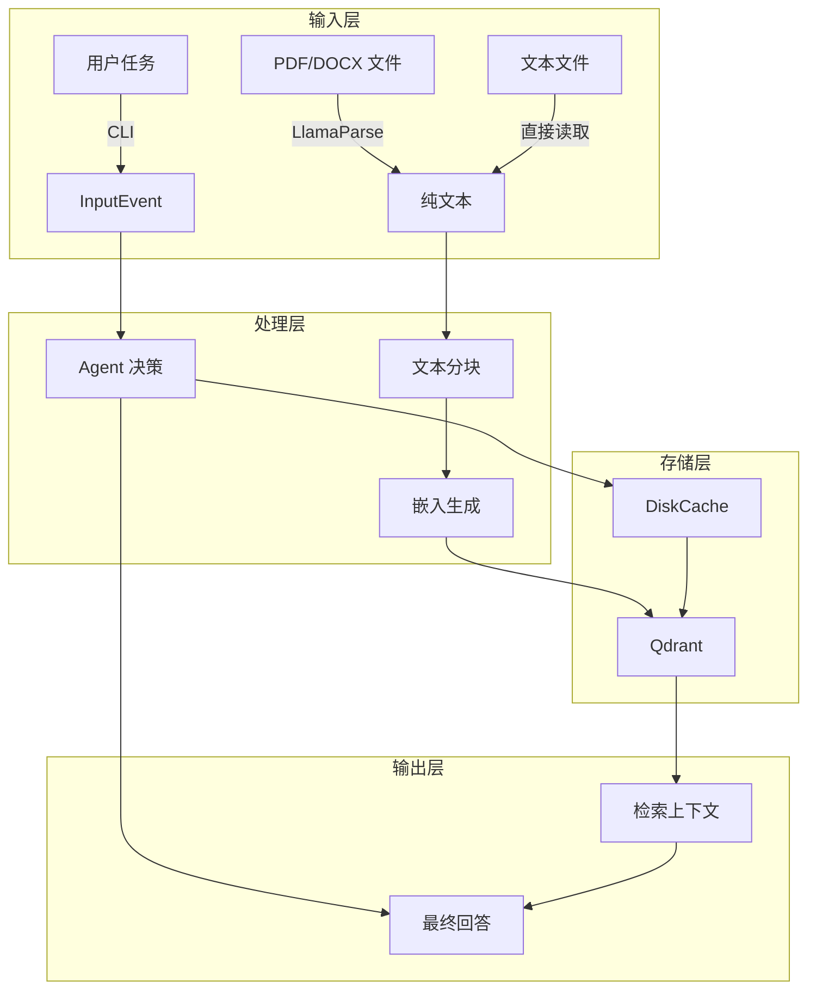
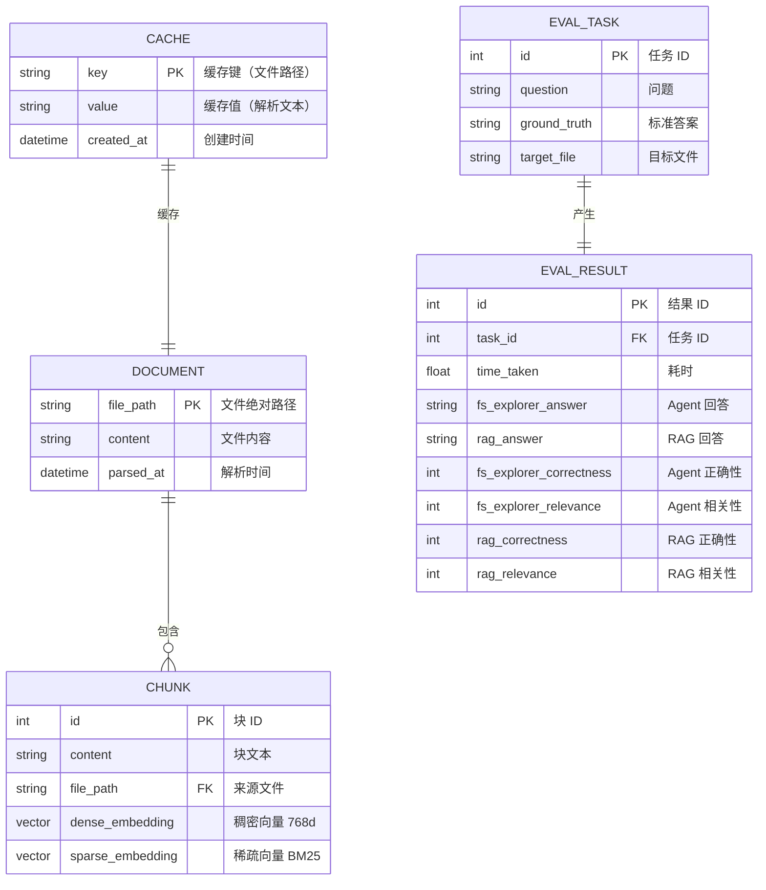

# 06-04 — 数据流向与 ER 图

> **本章内容**: 全链路数据流、实体关系图
> **预估字数**: ~5,000 字

---

## 1. 全局数据流图



---

## 2. ER 图



---

## 3. 数据流详解

### 3.1 Agent 探索数据流

```
用户任务
    ↓
InputEvent(task)
    ↓
start_exploration 步骤
    ↓
describe_dir_content() → 目录描述文本
    ↓
agent.configure_task() → 追加到对话历史
    ↓
agent.take_action() → Gemini API → Action
    ↓
┌─────────────────────────────────────────┐
│ toolcall → call_tool() → 工具结果 → 历史 │
│ godeeper → 更新目录 → 重新描述           │
│ askhuman → 暂停 → 用户输入 → 继续       │
│ stop → 返回最终结果                      │
└─────────────────────────────────────────┘
```

### 3.2 RAG 索引数据流

```
PDF/DOCX 文件
    ↓
LlamaParse API → 纯文本
    ↓
DiskCache (缓存)
    ↓
Chunker.chunk_texts() → 文本块 (2048char, 200overlap)
    ↓
Embedder.embed_chunks() → Dense 768d
Embedder.sparse_embed_chunks() → Sparse BM25
    ↓
Qdrant.upload_collection() → 向量存储
```

### 3.3 RAG 查询数据流

```
用户查询
    ↓
LLMFilter.generate_filter() → 文件路径筛选
    ↓
Embedder.embed_query() → Dense 查询向量
Embedder.sparse_embed_query() → Sparse 查询向量
    ↓
Qdrant.query_points() × 2 → Dense + Sparse 结果
    ↓
SimpleReranker.rerank() → RRF 融合 → Top-K
    ↓
LLMFilter.generate_response() → 最终回答
```

---

## 4. 数据生命周期

| 数据 | 创建时机 | 更新时机 | 删除时机 |
|------|---------|---------|---------|
| 解析缓存 | 首次解析 / load-cache | 永不（需手动清除） | 手动删除 |
| 向量索引 | Pipeline.prepare() | 重新 prepare | 删除 Collection |
| 评估结果 | run-eval | 重新运行 | 手动删除 |
| 对话历史 | Agent 初始化 | 每次交互 | 工作流结束 |

---

☕️ 制作不易，请我喝咖啡☕️关注我➕

