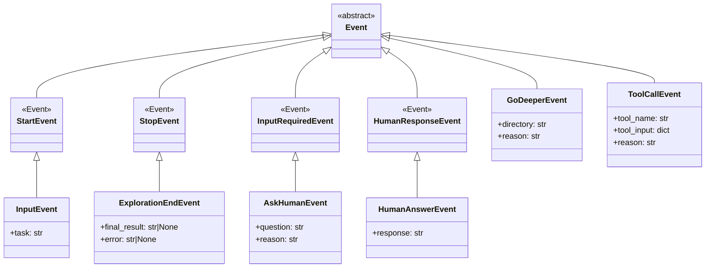

# 07-03 — 事件系统接口

> **本章内容**: 工作流事件类型和处理接口
> **预估字数**: ~5,000 字

---

## 1. 事件继承体系



---

## 2. 事件处理接口

### 2.1 订阅事件流

```python
handler = workflow.run(start_event=InputEvent(task=task))
async for event in handler.stream_events():
    if isinstance(event, ToolCallEvent):
        # 处理工具调用事件
    elif isinstance(event, GoDeeperEvent):
        # 处理目录深入事件
    elif isinstance(event, AskHumanEvent):
        # 处理人机交互事件
```

### 2.2 发送事件

```python
# 发送用户回答到工作流
handler.ctx.send_event(HumanAnswerEvent(response="用户输入"))
```

---

## 3. 事件类型详解

| 事件 | 字段 | 触发时机 | 处理方式 |
|------|------|---------|---------|
| InputEvent | task | 用户启动 | 工作流入口 |
| GoDeeperEvent | directory, reason | Agent 决定进入子目录 | 更新状态，重新描述 |
| ToolCallEvent | tool_name, tool_input, reason | Agent 调用工具 | 执行工具，追加结果 |
| AskHumanEvent | question, reason | Agent 请求澄清 | 暂停，等待输入 |
| HumanAnswerEvent | response | 用户输入 | 继续决策 |
| ExplorationEndEvent | final_result, error | Agent 完成/失败 | 结束工作流 |

---

# ❤️ 制作不易，请我喝咖啡☕️关注我➕

