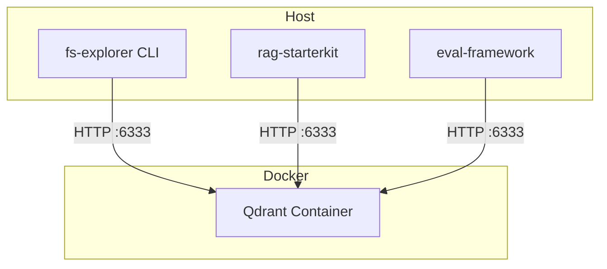

# 08-02 — Docker 与 compose 配置

> **本章内容**: Docker Compose 配置、Qdrant 部署
> **预估字数**: ~4,000 字

---

## 1. compose.yaml

```yaml
name: evaluation-framework

services:
  qdrant:
    image: qdrant/qdrant:latest
    restart: always
    ports:
      - "6333:6333"  # HTTP
      - "6334:6334"  # gRPC
    volumes:
      - "./qdrant_storage:/qdrant/storage"
```

---

## 2. 服务配置

| 属性 | 值 | 说明 |
|------|---|------|
| 镜像 | qdrant/qdrant:latest | 最新稳定版 |
| 重启策略 | always | 自动重启 |
| HTTP 端口 | 6333 | REST API |
| gRPC 端口 | 6334 | 高性能客户端 |
| 存储卷 | ./qdrant_storage | 持久化存储 |

---

## 3. 启动与停止

```bash
# 启动
docker compose up -d

# 查看日志
docker compose logs -f

# 停止
docker compose down

# 停止并删除数据
docker compose down -v
```

---

## 4. 部署架构图



---

# ❤️ 制作不易，请我喝咖啡☕️关注我➕

