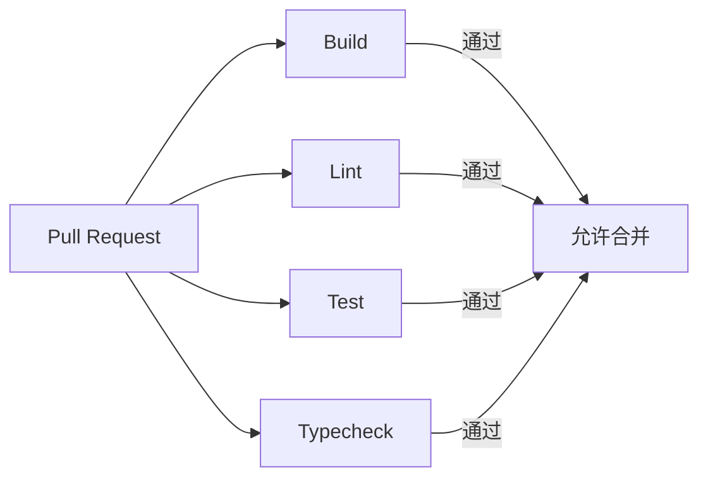

# 08-03 — CI/CD 流水线

> **本章内容**: GitHub Actions 配置、自动化流程
> **预估字数**: ~5,000 字

---

## 1. 工作流总览

| 工作流 | 文件 | 触发条件 | 用途 |
|--------|------|---------|------|
| Build | build.yaml | pull_request | 构建包 |
| Lint | lint.yaml | pull_request | 代码检查 |
| Test | test.yaml | pull_request | 运行测试 |
| Typecheck | typecheck.yaml | pull_request | 类型检查 |

---

## 2. Build 工作流

```yaml
name: Build
on:
  pull_request:
jobs:
  build:
    runs-on: ubuntu-latest
    steps:
      - uses: actions/checkout@v4
      - name: Install uv
        uses: astral-sh/setup-uv@v6
      - name: Set up Python
        run: uv python install 3.13
      - name: Build package
        run: make build
```

---

## 3. Test 工作流

```yaml
name: CI Tests - Pull Request
on:
  pull_request:
jobs:
  testing_pr:
    runs-on: ubuntu-latest
    strategy:
      matrix:
        python-version: ["3.10", "3.11", "3.12", "3.13"]
    steps:
      - uses: actions/checkout@v4
      - name: Install uv
        uses: astral-sh/setup-uv@v6
          python-version: ${{ matrix.python-version }}
      - name: Run Tests
        run: make test
```

**矩阵策略**: 在 Python 3.10-3.13 四个版本上运行测试。

---

## 4. 流水线图



---

# ❤️ 制作不易，请我喝咖啡☕️关注我➕

