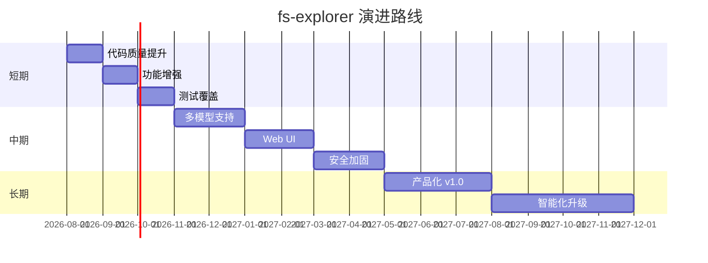

# 09-04 — 未来演进路线

> **本章内容**: 短期、中期、长期规划
> **预估字数**: ~4,000 字

---

## 1. 短期规划（1-3 个月）

### 1.1 代码质量提升

- [ ] 消除 workflow.py 代码重复
- [ ] 修复全局状态问题
- [ ] 添加 API 重试机制
- [ ] 实现对话历史截断

### 1.2 功能增强

- [ ] 支持更多文件格式（EPUB、HTML）
- [ ] 添加工具执行超时控制
- [ ] 改进错误处理和用户提示

### 1.3 测试覆盖

- [ ] 添加更多单元测试
- [ ] 添加集成测试
- [ ] 添加性能基准测试

---

## 2. 中期规划（3-6 个月）

### 2.1 架构演进

- [ ] 支持多 LLM 提供商（Claude、Llama、Mistral）
- [ ] 实现工具插件系统
- [ ] 添加 Web UI（Streamlit/Gradio）
- [ ] 支持分布式部署

### 2.2 性能优化

- [ ] 实现对话历史摘要压缩
- [ ] 添加连接池
- [ ] 实现增量缓存更新
- [ ] 优化并发控制

### 2.3 安全加固

- [ ] 实现文件访问沙箱
- [ ] 添加 API Key 加密存储
- [ ] 实现操作审计日志

---

## 3. 长期规划（6-12 个月）

### 3.1 产品化

- [ ] 发布 v1.0 稳定版
- [ ] 提供 PyPI 安装包
- [ ] 编写完整文档和教程
- [ ] 建立社区和贡献指南

### 3.2 智能化

- [ ] 实现自适应工具选择
- [ ] 添加任务规划能力
- [ ] 支持多步骤推理链
- [ ] 实现自我反思和纠错

### 3.3 生态集成

- [ ] 集成 LangChain/LlamaIndex
- [ ] 支持向量数据库切换（Pinecone、Weaviate）
- [ ] 提供 REST API
- [ ] 开发 IDE 插件

---

## 4. 演进路线图

---

# ❤️ 制作不易，请我喝咖啡☕️关注我➕

