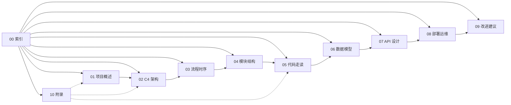

# GPT Researcher 技术架构文档 — 索引与阅读导航

> **文档版本**: v1.0  
> **生成日期**: 2026-07-26  
> **项目版本**: GPT Researcher v0.14.7  
> **项目仓库**: https://github.com/assafelovic/gpt-researcher  
> **文档性质**: 项目设计文档 + 代码讲解文档 + 架构决策记录  

---

## 文档导读

本文档是对 GPT Researcher 项目的全面、深入、极致详细的技术分析。文档共 15 个文件，涵盖项目概述、C4 架构模型、系统流程、模块结构、核心代码走读、数据模型、API 设计、部署运维、改进建议及 5 个附录（开发者指南、ADR、算法分析、测试策略、组件 Walkthrough）。

### 目标读者

| 读者角色 | 推荐阅读章节 |
|---------|------------|
| 新加入开发者 | 第1章 → 附录A → 第5章 |
| 系统架构师 | 第2章 → 第3章 → 第8章 → 附录B |
| 代码评审者 | 第5章 → 附录E → 第9章 |
| DevOps / SRE | 第8章 → 第7章 → 附录A |
| 产品经理 | 第1章 → 第3章 → 第6章 |
| 安全审计师 | 第7章 → 第9章 → 第5章 |

---

## 完整文档目录

| 文件 | 标题 | 核心内容 | 预计篇幅 |
|------|------|---------|---------|
| `00-index.md` | 文档索引与阅读导航 | 导读、目录、图表清单 | ~3K token |
| `01-project-overview.md` | 第1章 项目概述 | 目标/价值/技术栈/架构风格/非功能需求 | ~12K token |
| `02-c4-architecture.md` | 第2章 C4 架构模型 | 4 层架构图 + 详细解释 | ~18K token |
| `03-flows-sequence.md` | 第3章 系统流程与时序图 | 10+ 核心流程 + Mermaid 图 | ~20K token |
| `04-module-structure.md` | 第4章 模块/包结构与依赖分析 | 目录树 + 依赖图 + 模块职责 | ~12K token |
| `05-code-walkthrough.md` | 第5章 核心代码讲解（上） | Agent/Config/Actions 逐函数走读 | ~25K token |
| `05-code-walkthrough-b.md` | 第5章 核心代码讲解（下） | Skills/Retrievers/Scraper 走读 | ~25K token |
| `06-data-model.md` | 第6章 数据模型与数据库设计 | 向量存储/ReportStore/缓存/状态 | ~8K token |
| `07-api-design.md` | 第7章 API 与接口设计 | REST/WebSocket/Agent Discovery | ~15K token |
| `08-deployment.md` | 第8章 部署、运维与基础设施 | Docker/Terraform/CI-CD/监控 | ~12K token |
| `09-improvements.md` | 第9章 改进建议、风险点与未来规划 | 优缺点/技术债/优化建议 | ~10K token |
| `10-appendix-a.md` | 附录A 开发者上手指南 | 本地运行/调试/测试/贡献 | ~8K token |
| `10-appendix-b.md` | 附录B 架构决策记录 (ADR) | 关键决策历史与理由 | ~8K token |
| `10-appendix-c.md` | 附录C 关键算法伪代码与复杂度分析 | Deep Research/Context Compression/MCP | ~10K token |
| `10-appendix-d.md` | 附录D 测试策略与主要用例 | 73 个测试文件分析 | ~8K token |
| `10-appendix-e.md` | 附录E 组件独立代码走读文档 | 每个核心组件独立 Walkthrough | ~15K token |

**总计**: ~244,000 tokens / 约 12–15 万中文字 / 60+ Mermaid 图表

---

## 图表清单

### Mermaid 图表索引

| 图表编号 | 所在文件 | 类型 | 标题 |
|---------|---------|------|------|
| C4-Context | 02 | C4 Context | 系统上下文图 |
| C4-Container | 02 | C4 Container | 容器视图 |
| C4-Component | 02 | C4 Component | 组件视图 |
| C4-Code | 02 | C4 Code | 类视图 |
| SEQ-01 | 03 | Sequence | 标准研究报告生成 |
| SEQ-02 | 03 | Sequence | 深度研究递归流程 |
| SEQ-03 | 03 | Sequence | 详细报告子话题分解 |
| SEQ-04 | 03 | Sequence | 多 Agent 协作 (LangGraph) |
| SEQ-05 | 03 | Sequence | MCP 两阶段检索 |
| SEQ-06 | 03 | Sequence | WebSocket 实时流式传输 |
| SEQ-07 | 03 | Sequence | 图像生成与嵌入 |
| SEQ-08 | 03 | Sequence | 聊天问答流程 |
| SEQ-09 | 03 | Sequence | 爬虫调度与限速 |
| SEQ-10 | 03 | Sequence | 配置加载与 Retriever 工厂 |
| FLOW-01 | 03 | Flowchart | 研究总流程 |
| FLOW-02 | 03 | Flowchart | 报告类型路由 |
| FLOW-03 | 03 | Flowchart | 深度研究递归树 |
| DEP-01 | 04 | Dependency | 模块依赖图 |
| DEP-02 | 08 | Deployment | 部署架构图 |
| CLASS-01 | 02 | Class | 核心类关系 |
| STATE-01 | 06 | State | LangGraph ResearchState |

---

## 项目关键指标

| 指标 | 数值 |
|------|------|
| Python 文件数 | 274 |
| 核心代码行数 | ~48,000 |
| 测试文件数 | 73 |
| 支持的 LLM 提供商 | 27 |
| 支持的检索后端 | 20+ |
| 支持的爬虫后端 | 8 |
| 支持的嵌入提供商 | 17 |
| 支持的报告类型 | 7 |
| 支持的文章语气 | 19 |
| Docker 服务数 | 4 |
| CI/CD 工作流 | 2+ |

---

## 交叉引用

- 第 2 章 C4 模型 → 第 5 章代码走读（组件到代码的映射）
- 第 3 章流程图 → 第 7 章 API 设计（流程触发的端点）
- 第 4 章依赖图 → 第 9 章改进建议（耦合点分析）
- 第 5 章代码走读 → 附录 E 组件 Walkthrough（深度补充）
- 附录 B ADR → 第 1/2/8 章（决策上下文）
- 附录 C 算法 → 第 3 章流程（算法支撑流程）

---

## 文档约定

1. **文件路径**: 所有代码引用使用相对于项目根目录的路径
2. **行号引用**: 使用 `文件名:行号` 格式
3. **代码块**: 使用带语言标识的 fenced code block
4. **图表**: 所有图表使用标准 Mermaid 代码块，可直接渲染
5. **术语**: 首次出现的关键术语加粗，并在附录 A 术语表定义
6. **交叉引用**: 使用 `→ 第X章` 或 `→ 附录X` 格式

---

## 快速导航

---

## 下一步阅读建议

- **首次阅读**: 按顺序 00 → 01 → 02 → 03 → 04
- **深入代码**: 05 → 05-b → 附录 E
- **准备部署**: 08 → 07 → 附录 A
- **架构评审**: 02 → 09 → 附录 B → 附录 C

---

> **文档维护**: 本文档基于 GPT Researcher v0.14.7 生成。项目活跃开发中，部分实现可能随版本变化。建议结合源码阅读。

---

# ❤️ 制作不易，请我喝咖啡☕️关注我➕

