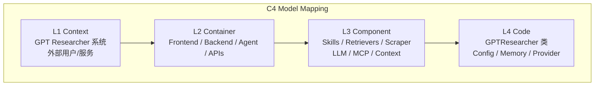
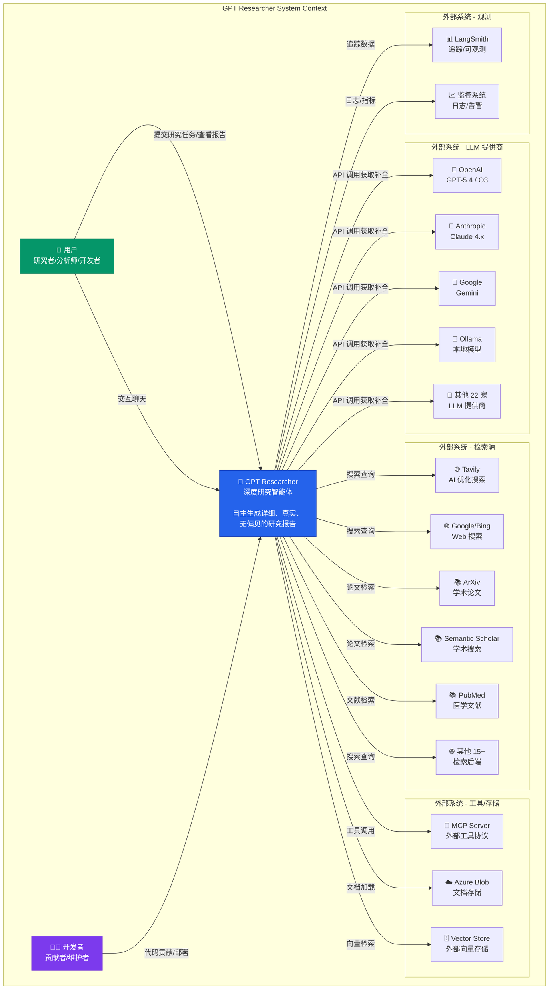
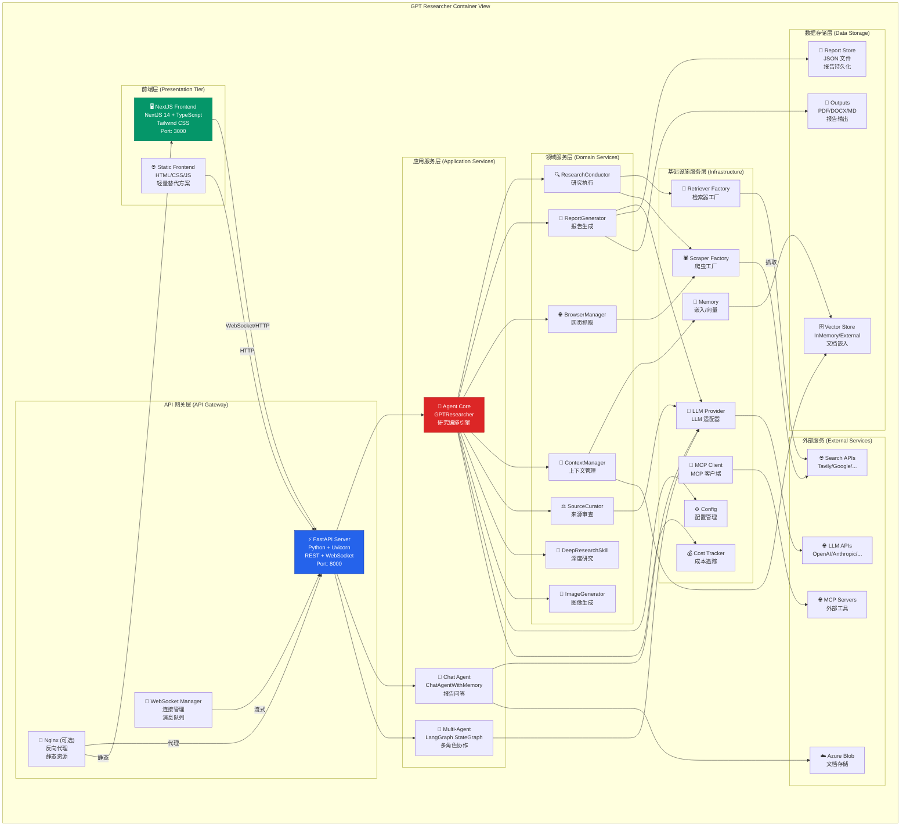
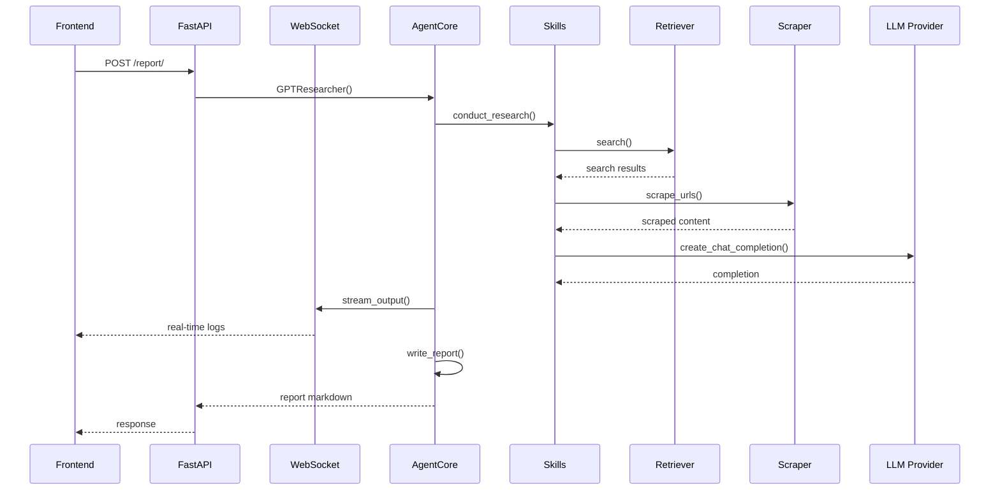
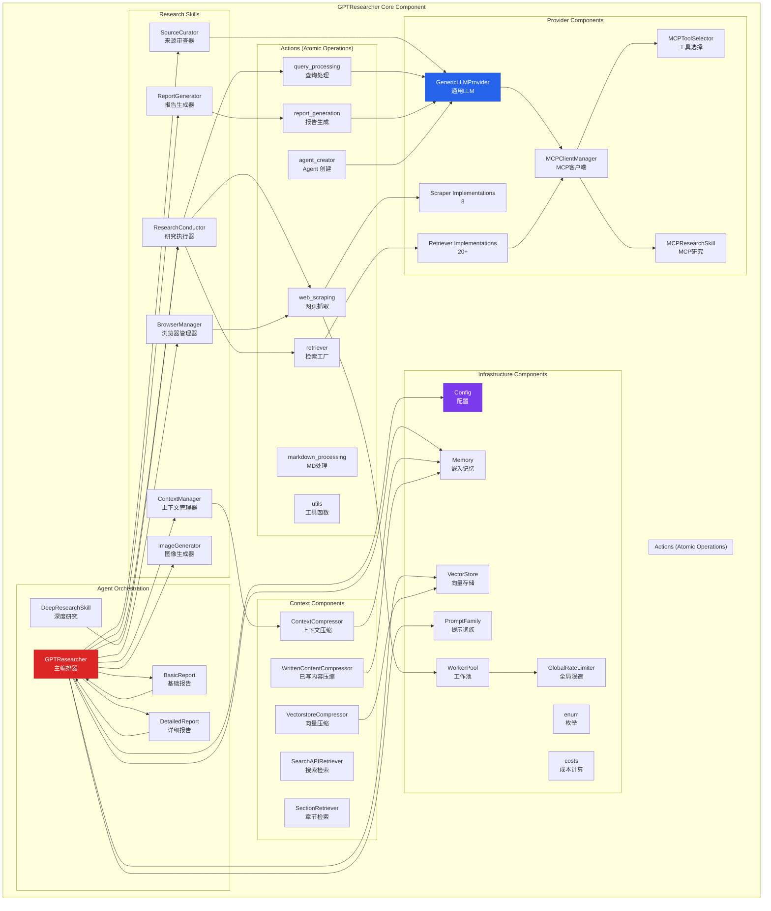

# 第2章 C4 架构模型

> **文件**: `docs/wangbin/02-c4-architecture.md`  
> **预计 Token**: ~18,000  
> **核心内容**: Context/Container/Component/Code 四层架构，每层含 Mermaid 图 + 400+ 字解释

---

## 2.1 C4 模型概述

C4 模型是由 Simon Brown 提出的软件架构文档化方法，包含四个抽象层级：

| 层级 | 名称 | 关注点 | 类比 |
|------|------|--------|------|
| **L1: Context** | 系统上下文 | 系统与外部实体关系 | 鸟瞰图 |
| **L2: Container** | 容器视图 | 应用程序、数据库、微服务 | 建筑平面图 |
| **L3: Component** | 组件视图 | 容器内部模块/包结构 | 房间布局 |
| **L4: Code** | 代码视图 | 类、接口、函数关系 | 家具布置 |

对于 GPT Researcher，各层映射如下：



---

## 2.2 L1: Context 图 (System Context)

### 2.2.1 Mermaid 图表



### 2.2.2 详细解释 (500+ 字)

#### 系统边界定义

GPT Researcher 系统的边界由以下要素界定：

**系统内 (In Scope)**:
- 研究任务的接收、解析与编排
- 智能体角色自动选择
- 子话题生成与并行研究
- 网页抓取与内容提取
- 上下文压缩与记忆管理
- 报告生成（引言/正文/结论/引用）
- 图像抓取与生成
- 成本追踪与流式传输

**系统外 (Out Scope)**:
- LLM 模型训练与推理（由外部提供商承担）
- 搜索引擎索引构建（由 Tavily/Google 等承担）
- 网页内容创作（由目标网站承担）
- 前端 UI 渲染逻辑（由浏览器承担）

#### 外部实体交互协议

| 外部实体 | 交互方向 | 协议 | 数据格式 |
|---------|---------|------|---------|
| LLM 提供商 | 双向 | HTTPS (OpenAI API) | JSON |
| 搜索 API | 双向 | HTTPS | JSON |
| MCP Server | 双向 | stdio/websocket/HTTP | JSON-RPC 2.0 |
| Azure Blob | 单向(读) | HTTPS | Binary/Text |
| Vector Store | 双向 | 内存/HTTP | Embeddings |
| LangSmith | 单向(写) | HTTPS | JSON |

#### 关键交互模式

1. **请求-响应模式**: LLM 调用、搜索 API 调用采用标准请求-响应
2. **流式传输**: LLM 响应通过 Server-Sent Events 流式返回
3. **事件驱动**: 前端通过 WebSocket 接收实时研究进度
4. **批处理**: 深度研究模式下递归处理多个子问题

#### 设计 Rationale

**为什么选择外部 LLM 而非自训练？**
- LLM 训练成本极高，使用 API 更具经济性
- 多提供商策略避免供应商锁定
- 用户可根据任务选择最适合的模型

**为什么支持多检索源？**
- 单一搜索引擎存在结果偏见
- 多源交叉验证提高结论可靠性
- 学术来源与 Web 来源互补

**为什么集成 MCP？**
- MCP 是开放的 AI 工具协议标准
- 允许用户接入自定义工具（数据库、API、文件系统）
- 扩展了 Agent 的能力边界

#### 安全边界

- 所有外部 API 调用通过 API Key 认证
- Key 通过环境变量注入，不进入代码仓库
- CORS 策略限制前端跨域访问
- MCP 服务器路径白名单限制文件访问范围

---

## 2.3 L2: Container 图 (Container View)

### 2.3.1 Mermaid 图表



### 2.3.2 详细解释 (600+ 字)

#### 容器职责定义

**1. 前端容器 (Frontend Containers)**

| 容器 | 技术栈 | 职责 |
|------|--------|------|
| **NextJS Frontend** | NextJS 14, React, TypeScript, Tailwind | 生产级 SPA，含研究表单、实时日志、报告展示、聊天交互 |
| **Static Frontend** | 原生 HTML/CSS/JS | 轻量级替代方案，无构建步骤，直接打开即用 |

NextJS 前端通过 `frontend/nextjs/` 组织，包含：
- `app/`: 路由页面（首页、研究详情页、API 路由）
- `components/`: 可复用组件（ResearchForm, Report, ChatInterface, AgentLogs）
- `hooks/`: 自定义 hooks（useWebSocket, useResearchHistory）
- `actions/`: 服务端 API 调用

静态前端通过 `frontend/index.html` 单文件实现，包含内联 CSS/JS，适合快速部署。

**2. API 网关容器 (API Gateway)**

| 容器 | 职责 |
|------|------|
| **FastAPI Server** | REST API 路由、请求验证、响应序列化 |
| **WebSocket Manager** | 连接生命周期管理、消息队列、广播 |
| **Nginx** (可选) | 反向代理、SSL 终止、静态资源服务 |

FastAPI 服务器 (`backend/server/app.py`) 定义了以下关键路由：
- `GET /`: 服务前端 HTML
- `POST /report/`: 创建研究报告
- `GET/POST/PUT/DELETE /api/reports`: 报告 CRUD
- `POST /api/chat`: 聊天问答
- `POST /api/multi_agents`: 多 Agent 研究
- `WebSocket /ws`: 实时通信
- `GET /.well-known/agent-discovery.json`: Agent 发现协议

**3. 应用服务容器 (Application Services)**

| 容器 | 职责 |
|------|------|
| **Agent Core** | GPTResearcher 主类，编排研究全流程 |
| **Chat Agent** | 基于报告的交互式问答 |
| **Multi-Agent** | LangGraph 驱动的多角色协作研究 |

Agent Core 是整个系统的核心容器，它组合了所有 Skill 组件：
```python
class GPTResearcher:
    self.research_conductor  # 研究执行
    self.report_generator    # 报告生成
    self.context_manager     # 上下文管理
    self.scraper_manager     # 网页抓取
    self.source_curator      # 来源审查
    self.deep_researcher     # 深度研究
    self.image_generator     # 图像生成
```

**4. 领域服务容器 (Domain Services)**

每个领域服务封装一个独立的研究子能力：

- **ResearchConductor**: 负责查询规划、网页搜索、上下文收集
- **ReportGenerator**: 负责报告写作、引言/结论生成、子话题管理
- **BrowserManager**: 负责 URL 调度、内容抓取、图像选择
- **ContextManager**: 负责上下文压缩、相似内容检索
- **SourceCurator**: 负责来源可信度评估与排序
- **DeepResearchSkill**: 负责递归深度探索
- **ImageGenerator**: 负责 AI 图像生成与嵌入

**5. 基础设施服务容器 (Infrastructure Services)**

提供横切关注点的技术能力：

- **RetrieverFactory**: 根据配置实例化检索器
- **ScraperFactory**: 根据 URL 类型选择爬虫
- **LLMProvider**: 统一 LLM 调用接口
- **MCPClient**: MCP 服务器连接管理
- **Memory**: 嵌入向量生成与管理
- **Config**: 配置加载与解析
- **CostTracker**: API 成本计算与追踪

**6. 数据存储容器 (Data Storage)**

| 容器 | 实现 | 用途 |
|------|------|------|
| **ReportStore** | JSON 文件 (`data/reports.json`) | 报告元数据持久化 |
| **VectorStore** | InMemoryVectorStore / 外部 | 文档嵌入存储 |
| **Outputs** | 文件系统 | PDF/DOCX/MD 报告输出 |

#### 容器间通信模式



#### 设计 Rationale

**为什么分为前端两个容器？**
- NextJS 提供完整 SPA 体验，适合生产部署
- 静态前端无需构建，适合快速演示和嵌入式使用
- 共享 API 层，后端无需关心前端实现

**为什么 API 网关独立于 Agent Core？**
- 关注点分离：HTTP 处理 vs 研究逻辑
- API 可独立扩展（多副本负载均衡）
- Agent Core 可脱离 HTTP 使用（CLI 模式）

**为什么 Skill 不直接访问外部服务？**
- 通过 Retriever/Scraper/LLM Provider 抽象层解耦
- 便于单元测试（Mock 抽象层）
- 便于插件化替换

#### 部署映射

| 容器 | Docker 服务 | 端口 |
|------|-----------|------|
| FastAPI + Agent Core | `gpt-researcher` | 8000 |
| NextJS Frontend | `gptr-nextjs` | 3000 |
| Nginx | (可选) | 80/443 |

---

## 2.4 L3: Component 图 (Component View)

### 2.4.1 Mermaid 图表



### 2.4.2 详细解释 (600+ 字)

#### 组件分类与职责

**1. Agent 编排组件**

GPTResearcher 是系统的核心编排器，它不直接执行底层操作，而是委托给各 Skill 组件：

```python
class GPTResearcher:
    def __init__(self, ...):
        self.research_conductor = ResearchConductor(self)
        self.report_generator = ReportGenerator(self)
        self.context_manager = ContextManager(self)
        self.scraper_manager = BrowserManager(self)
        self.source_curator = SourceCurator(self)
        self.deep_researcher = DeepResearchSkill(self)  # 条件性
        self.image_generator = ImageGenerator(self)     # 可选
```

这种设计的优势在于：
- **单一职责**: 每个 Skill 只负责一个研究子能力
- **可替换性**: 可自定义 Skill 实现替换默认行为
- **可测试性**: 每个 Skill 可独立单元测试

**2. Research Skills 组件**

| 组件 | 输入 | 输出 | 核心方法 |
|------|------|------|---------|
| ResearchConductor | 查询 + 配置 | 上下文列表 | `conduct_research()`, `plan_research()` |
| ReportGenerator | 上下文 + 配置 | 报告文本 | `write_report()`, `write_introduction()` |
| BrowserManager | URL 列表 | 抓取内容 | `browse_urls()`, `select_top_images()` |
| ContextManager | 文档 + 查询 | 相关上下文 | `get_similar_written_contents_by_draft_section_titles()` |
| SourceCurator | 来源列表 | 排序后来源 | `curate_sources()` |
| DeepResearchSkill | 查询 + 深度配置 | 深度上下文 | `run()` |
| ImageGenerator | 研究上下文 | 图像列表 | `plan_and_generate_images()` |

**3. Actions (原子操作)**

Actions 是最底层的操作单元，被 Skills 调用：

- **query_processing.py**: `get_search_results()`, `plan_research_outline()`, `generate_sub_queries()`
- **report_generation.py**: `generate_report()`, `write_conclusion()`, `write_report_introduction()`, `summarize_url()`
- **agent_creator.py**: `choose_agent()` — 自动选择 Agent 角色
- **web_scraping.py**: `scrape_urls()` — 调度 Scraper
- **retriever.py**: `get_retriever()`, `get_retrievers()` — 检索器工厂
- **markdown_processing.py**: `extract_headers()`, `extract_sections()`, `add_references()`
- **utils.py**: `stream_output()` — WebSocket 流式输出

**4. Provider 组件**

Provider 组件封装外部服务访问：

- **GenericLLMProvider**: 统一 LLM 接口，支持 27 家提供商
- **Retriever Implementations**: 20+ 检索器实现
- **Scraper Implementations**: 8 种爬虫实现
- **MCPClientManager**: MCP 服务器连接与工具管理

**5. Context 组件**

上下文管理组件处理信息压缩：

- **ContextCompressor**: 基于嵌入相似度的文档压缩
- **VectorstoreCompressor**: 向量存储检索压缩
- **WrittenContentCompressor**: 已写内容去重压缩
- **SearchAPIRetriever**: 搜索结果文档检索
- **SectionRetriever**: 章节内容检索

#### 组件交互模式

**模式1: 顺序编排**
```
GPTResearcher → ResearchConductor → query_processing → retriever → scraper
```

**模式2: 并行执行**
```
ResearchConductor → asyncio.gather([
    get_search_results(query1),
    get_search_results(query2),
    get_search_results(query3)
])
```

**模式3: 条件路由**
```
if report_type == "deep":
    DeepResearchSkill.run()
elif report_type == "detailed":
    DetailedReport.run()
else:
    BasicReport.run()
```

**模式4: 事件驱动**
```
Agent → stream_output() → WebSocket → Frontend
```

#### 关键设计决策

**为什么 Actions 与 Skills 分离？**
- Actions 是纯函数，无状态，易于测试
- Skills 是有状态的，持有 researcher 引用
- 同一个 Action 可被多个 Skills 使用（如 `stream_output`）

**为什么 Context 压缩独立成组件？**
- 上下文压缩是计算密集型操作，需要独立优化
- 不同场景需要不同压缩策略（文档 vs 已写内容 vs 向量存储）
- 压缩逻辑与报告生成分离，便于独立演进

**为什么 MCP 集成在 Retriever 层？**
- MCP 工具可视为一种特殊的"检索器"
- 统一接口允许 MCP 与传统检索器混合使用
- MCP 工具选择和执行逻辑独立于具体研究流程

---

## 2.5 L4: Code 图 (Code/Class View)

### 2.5.1 Mermaid 图表

```mermaid
classDiagram
    class GPTResearcher {
        +query: str
        +report_type: str
        +cfg: Config
        +context: List[str]
        +research_costs: float
        +retrievers: List
        +memory: Memory
        +websocket: WebSocket
        +mcp_configs: List[Dict]
        +mcp_strategy: str
        +research_conductor: ResearchConductor
        +report_generator: ReportGenerator
        +context_manager: ContextManager
        +scraper_manager: BrowserManager
        +source_curator: SourceCurator
        +deep_researcher: DeepResearchSkill
        +image_generator: ImageGenerator
        +__init__(query, report_type, ...)
        +conduct_research(on_progress) List[str]
        +write_report(...) str
        +write_report_conclusion(report_body) str
        +write_introduction() str
        +quick_search(query, ...) List|str
        +get_subtopics() List
        +get_costs() float
        +add_costs(cost) void
    }
    
    class Config {
        +config_path: str
        +retrievers: List[str]
        +fast_llm: str
        +smart_llm: str
        +strategic_llm: str
        +fast_llm_model: str
        +smart_llm_model: str
        +strategic_llm_model: str
        +fast_llm_provider: str
        +smart_llm_provider: str
        +strategic_llm_provider: str
        +embedding: str
        +embedding_provider: str
        +embedding_model: str
        +temperature: float
        +max_iterations: int
        +max_subtopics: int
        +max_search_results_per_query: int
        +scraper: str
        +max_scraper_workers: int
        +tone: Tone
        +language: str
        +report_source: str
        +report_format: str
        +mcp_strategy: str
        +__init__(config_path)
        +load_config(path) Dict
        +parse_retrievers(env) List
        +parse_llm(llm) Tuple
    }
    
    class GenericLLMProvider {
        +llm: Any
        +chat_logger: ChatLogger
        +last_usage_metadata: Dict
        +__init__(llm, chat_log, verbose)
        +from_provider(provider, **kwargs) GenericLLMProvider
        +get_chat_response(messages, stream, websocket) str
    }
    
    class Memory {
        +_embeddings: Any
        +__init__(embedding_provider, model, **kwargs)
        +get_embeddings() Any
    }
    
    class ResearchConductor {
        +researcher: GPTResearcher
        +logger: Logger
        +json_handler: JSONResearchHandler
        +_mcp_results_cache: Any
        +conduct_research() List[str]
        +plan_research(query) List[str]
        +_get_context_by_web_search(query, docs) List[str]
        +_get_context_by_urls(urls) List[str]
    }
    
    class ReportGenerator {
        +researcher: GPTResearcher
        +research_params: Dict
        +write_report(...) str
        +write_report_conclusion(content) str
        +write_introduction() str
        +get_subtopics() List
    }
    
    class BrowserManager {
        +researcher: GPTResearcher
        +worker_pool: WorkerPool
        +browse_urls(urls) List[Dict]
        +select_top_images(images, k) List[str]
    }
    
    class ContextCompressor {
        +documents: List
        +embeddings: Any
        +max_results: int
        +similarity_threshold: float
        +async_get_context(query, ...) List[str]
    }
    
    class SourceCurator {
        +researcher: GPTResearcher
        +curate_sources(source_data, max_results) List
    }
    
    class DeepResearchSkill {
        +researcher: GPTResearcher
        +breadth: int
        +depth: int
        +concurrency_limit: int
        +run(on_progress) List[str]
    }
    
    class ImageGenerator {
        +researcher: GPTResearcher
        +image_provider: Any
        +max_images: int
        +is_enabled() bool
        +plan_and_generate_images(context, query) List[Dict]
    }
    
    class Scraper {
        +urls: List[str]
        +session: Session
        +scraper: str
        +worker_pool: WorkerPool
        +__init__(urls, user_agent, scraper, worker_pool)
        +run() List[Dict]
        +get_scraper(link) class
        +extract_data_from_url(link, session) Dict
    }
    
    class MCPRetriever {
        +query: str
        +mcp_configs: List[Dict]
        +cfg: Config
        +client_manager: MCPClientManager
        +tool_selector: MCPToolSelector
        +search(max_results) List[Dict]
        +search_async(max_results) List[Dict]
    }
    
    class PromptFamily {
        +cfg: Config
        +__init__(config)
        +generate_search_queries_prompt(...) str
        +generate_report_prompt(...) str
        +generate_report_introduction(...) str
        +generate_report_conclusion(...) str
        +curate_sources(query, sources) str
        +pretty_print_docs(docs) str
    }
    
    class ReportStore {
        +storage_path: Path
        +list_reports(report_ids) List
        +get_report(id) Dict
        +upsert_report(id, report) void
        +delete_report(id) bool
    }
    
    class WebSocketManager {
        +active_connections: List~WebSocket~
        +sender_tasks: Dict
        +message_queues: Dict
        +connect(websocket) void
        +disconnect(websocket) void
        +start_sender(websocket) void
        +start_streaming(...) str
    }
    
    class GlobalRateLimiter {
        -_instance: GlobalRateLimiter
        +last_request_time: float
        +rate_limit_delay: float
        +configure(delay) void
        +wait_if_needed() void
        +reset() void
    }
    
    class WorkerPool {
        +max_workers: int
        +executor: ThreadPoolExecutor
        +semaphore: Semaphore
        +throttle() AsyncContextManager
    }
    
    GPTResearcher --> ResearchConductor
    GPTResearcher --> ReportGenerator
    GPTResearcher --> BrowserManager
    GPTResearcher --> ContextManager
    GPTResearcher --> SourceCurator
    GPTResearcher --> DeepResearchSkill
    GPTResearcher --> ImageGenerator
    GPTResearcher --> Config
    GPTResearcher --> Memory
    GPTResearcher --> GenericLLMProvider
    GPTResearcher --> PromptFamily
    ResearchConductor --> GenericLLMProvider
    ReportGenerator --> GenericLLMProvider
    BrowserManager --> Scraper
    BrowserManager --> WorkerPool
    ContextManager --> ContextCompressor
    SourceCurator --> GenericLLMProvider
    Scraper --> WorkerPool
    WorkerPool --> GlobalRateLimiter
    DeepResearchSkill --> ResearchConductor
    ImageGenerator --> GenericLLMProvider
    MCPRetriever --> Config
    GPTResearcher --> MCPRetriever
    GPTResearcher --> ReportStore
    GPTResearcher --> WebSocketManager
```



### 2.5.2 详细解释 (600+ 字)

#### 核心类详解

**1. GPTResearcher (主类)**
- **位置**: `gpt_researcher/agent.py:794`
- **职责**: 研究全流程编排
- **生命周期**: 初始化 → conduct_research → write_report → (可选) write_conclusion
- **关键属性**:
  - `cfg`: 配置对象，所有参数的单一来源
  - ` retrievers`: 检索器列表，支持多源搜索
  - `memory`: 嵌入模型，用于上下文相似度计算
  - `context`: 累积的研究上下文（字符串列表）
  - `research_costs`: 累计 API 成本

**2. Config (配置管理)**
- **位置**: `gpt_researcher/config/config.py`
- **职责**: 加载、解析、管理所有配置
- **配置优先级**: 环境变量 > 配置文件 > 默认值
- **关键方法**:
  - `load_config()`: 加载 JSON 配置文件
  - `parse_retrievers()`: 解析检索器字符串为列表
  - `parse_llm()`: 解析 `provider:model` 格式
  - `parse_embedding()`: 分离嵌入提供商和模型

**3. GenericLLMProvider (LLM 适配器)**
- **位置**: `gpt_researcher/llm_provider/generic/base.py`
- **职责**: 统一 27 家 LLM 提供商的调用接口
- **工厂方法**: `from_provider(provider_name, **kwargs)` 返回对应提供商实例
- **特殊处理**:
  - `NO_SUPPORT_TEMPERATURE_MODELS`: 不支持温度参数的模型列表
  - `SUPPORT_REASONING_EFFORT_MODELS`: 支持推理努力的模型列表
  - `stream_usage`: 流式响应时追踪 token 用量

**4. Memory (嵌入管理)**
- **位置**: `gpt_researcher/memory/embeddings.py`
- **职责**: 管理 17 家嵌入提供商的实例化
- **懒加载**: 仅在首次使用时加载对应提供商的依赖
- **Match-Case**: 使用 Python 3.11+ 的 match-case 进行提供商路由

**5. ResearchConductor (研究执行器)**
- **位置**: `gpt_researcher/skills/researcher.py:1082`
- **职责**: 协调查询规划、搜索、抓取、上下文收集
- **状态**: 持有 `_mcp_results_cache` 和 `_mcp_cache_lock` 用于 MCP 结果缓存
- **并发**: 使用 `asyncio.Lock` 保护缓存的并发访问

**6. ReportGenerator (报告生成器)**
- **位置**: `gpt_researcher/skills/writer.py`
- **职责**: 报告写作、引言/结论生成、子话题管理
- **空内容保护**: 如果上下文为空，返回拒绝生成的消息而非伪造报告

**7. BrowserManager (浏览器管理器)**
- **位置**: `gpt_researcher/skills/browser.py`
- **职责**: URL 调度、内容抓取、图像选择
- **图像去重**: 基于图像哈希的去重算法

**8. Scraper (爬虫调度器)**
- **位置**: `gpt_researcher/scraper/scraper.py`
- **职责**: URL 去重、爬虫选择、并行抓取
- **爬虫路由**: `get_scraper(link)` 根据 URL 后缀/内容选择爬虫
  - `.pdf` → PyMuPDFScraper
  - `arxiv.org` → ArxivScraper
  - 其他 → 配置的默认爬虫

**9. PromptFamily (提示词族)**
- **位置**: `gpt_researcher/prompts.py:903`
- **职责**: 封装所有 LLM 提示词
- **可扩展**: 支持 Granite 系列变体
- **关键方法**: 
  - `generate_search_queries_prompt()`: 子查询生成
  - `generate_report_prompt()`: 报告写作
  - `curate_sources()`: 来源审查
  - `pretty_print_docs()`: 文档格式化

**10. MCPRetriever (MCP 检索器)**
- **位置**: `gpt_researcher/retrievers/mcp/retriever.py`
- **职责**: 两阶段 MCP 工具选择与执行
- **依赖**: `MCPClientManager` + `MCPToolSelector` + `MCPResearchSkill`

#### 设计模式应用

| 模式 | 应用位置 | 说明 |
|------|---------|------|
| **工厂模式** | `get_retriever()`, `GenericLLMProvider.from_provider()` | 根据名称创建实例 |
| **策略模式** | Retriever/Scraper 实现 | 可替换的算法实现 |
| **模板方法** | Skill 基类 | 定义研究流程骨架 |
| **观察者模式** | WebSocket 流式传输 | 事件订阅与通知 |
| **单例模式** | `GlobalRateLimiter` | 全局限速器唯一实例 |
| **外观模式** | `GPTResearcher` | 简化复杂子系统的使用 |
| **依赖注入** | Skills 接收 researcher 引用 | 解耦组件依赖 |
| **组合模式** | Skills 组合 | Agent 由多个 Skill 组合 |

#### 关键接口定义

```python
# 检索器接口
class BaseRetriever:
    def __init__(self, query: str, headers: dict = None, query_domains: list = None): ...
    def search(self, max_results: int = 10) -> list[dict]: ...

# 爬虫接口
class BaseScraper:
    def __init__(self, url: str, session: Session): ...
    def scrape(self) -> tuple[str, list[str], str]: ...  # content, images, title

# LLM 接口
class GenericLLMProvider:
    async def get_chat_response(self, messages, stream, websocket, **kwargs) -> str: ...

# 嵌入接口
class Memory:
    def get_embeddings(self): ...
```

---

## 2.6 架构层次总结

| 层级 | 抽象程度 | 受众 | 关键产出 |
|------|---------|------|---------|
| L1 Context | 最高 | 产品经理/利益相关者 | 系统边界、外部依赖 |
| L2 Container | 高 | 架构师/DevOps | 部署单元、技术选型 |
| L3 Component | 中 | 开发者 | 模块划分、接口定义 |
| L4 Code | 低 | 实现者 | 类设计、方法签名 |

**C4 模型在 GPT Researcher 中的价值**:
1. **多层次视角**: 不同角色可关注不同层级
2. **渐进式细化**: 从宏观到微观逐步深入
3. **沟通工具**: 统一的架构语言
4. **文档化**: 代码即文档，图表即规范

---

> **下一章**: → `03-flows-sequence.md` — 系统流程与时序图

---

☕️ 制作不易，请我喝咖啡☕️关注我➕

