# 第4章 模块/包结构与依赖分析

> **文件**: `docs/wangbin/04-module-structure.md`  
> **预计 Token**: ~12,000  
> **核心内容**: 目录树、模块职责、依赖关系图

---

## 4.1 完整项目目录结构树

```
gpt-researcher/                          # 项目根目录
│
├── 📄 配置与元数据
│   ├── pyproject.toml                   # Poetry 项目定义 + 依赖
│   ├── requirements.txt                 # pip 依赖清单
│   ├── setup.py                         # 包安装入口
│   ├── poetry.toml                      # Poetry 配置
│   ├── .python-version                  # Python 版本 (>=3.11)
│   ├── .env.example                     # 环境变量模板
│   ├── .gitignore                       # Git 忽略规则
│   ├── .dockerignore                    # Docker 忽略规则
│   ├── .mcp.json                        # MCP 配置
│   ├── langgraph.json                   # LangGraph 配置
│   ├── Procfile                         # Heroku/Render 部署
│   ├── citation.cff                     # 学术引用格式
│   └── json_schema_generator.py         # JSON Schema 生成器
│
├── 📄 文档
│   ├── README.md                        # 英文主文档
│   ├── README-zh_CN.md                  # 中文文档
│   ├── README-ja_JP.md                  # 日文文档
│   ├── README-ko_KR.md                  # 韩文文档
│   ├── CONTRIBUTING.md                  # 贡献指南
│   ├── CODE_OF_CONDUCT.md               # 行为准则
│   ├── SECURITY.md                      # 安全政策
│   ├── LICENSE                          # MIT 许可证
│   ├── CURSOR_RULES.md                  # Cursor IDE 规则
│   └── ISSUE_BACKLOG.md                 # Issue 待办
│
├── 📦 gpt_researcher/                   # ★ 核心包
│   ├── __init__.py                      # 包初始化
│   ├── agent.py                         # 主 Agent 类 (794 行)
│   ├── prompts.py                       # 提示词管理 (903 行)
│   │
│   ├── 📁 actions/                      # 原子操作层
│   │   ├── __init__.py                  # 导出公共 API
│   │   ├── agent_creator.py             # Agent 角色自动选择
│   │   ├── query_processing.py          # 查询规划与搜索
│   │   ├── report_generation.py         # 报告生成操作
│   │   ├── retriever.py                 # 检索器工厂
│   │   ├── web_scraping.py              # 网页抓取操作
│   │   ├── markdown_processing.py       # Markdown 处理
│   │   └── utils.py                     # 流式输出/成本计算
│   │
│   ├── 📁 skills/                       # 技能层
│   │   ├── __init__.py
│   │   ├── researcher.py                # 研究执行器 (1082 行)
│   │   ├── writer.py                    # 报告生成器
│   │   ├── browser.py                   # 浏览器管理器
│   │   ├── context_manager.py           # 上下文管理器
│   │   ├── curator.py                   # 来源审查器
│   │   ├── deep_research.py             # 深度研究技能 (646 行)
│   │   └── image_generator.py           # 图像生成器 (771 行)
│   │
│   ├── 📁 retrievers/                   # 检索后端 (20+)
│   │   ├── __init__.py                  # 统一导出
│   │   ├── utils.py                     # 检索工具函数
│   │   ├── 📁 tavily/                   # Tavily 搜索
│   │   ├── 📁 duckduckgo/              # DuckDuckGo
│   │   ├── 📁 google/                   # Google Custom Search
│   │   ├── 📁 bing/                     # Bing
│   │   ├── 📁 brave/                    # Brave Search
│   │   ├── 📁 searx/                    # SearX
│   │   ├── 📁 serper/                   # Serper
│   │   ├── 📁 serpapi/                  # SerpAPI
│   │   ├── 📁 searchapi/                # SearchAPI
│   │   ├── 📁 exa/                      # Exa
│   │   ├── 📁 groundroute/              # GroundRoute
│   │   ├── 📁 crw/                      # CRW (Firecrawl)
│   │   ├── 📁 bocha/                    # Bocha
│   │   ├── 📁 getxapi/                  # GetXAPI
│   │   ├── 📁 xquik/                    # Xquik
│   │   ├── 📁 arxiv/                    # ArXiv
│   │   ├── 📁 semantic_scholar/         # Semantic Scholar
│   │   ├── 📁 pubmed_central/           # PubMed Central
│   │   ├── 📁 openalex/                 # OpenAlex
│   │   ├── 📁 custom/                   # 自定义检索器
│   │   └── 📁 mcp/                      # MCP 检索器
│   │
│   ├── 📁 scraper/                      # 爬虫后端 (8)
│   │   ├── __init__.py                  # 统一导出
│   │   ├── scraper.py                   # Scraper 主类
│   │   ├── utils.py                     # 爬虫工具
│   │   ├── 📁 beautiful_soup/          # BeautifulSoup
│   │   ├── 📁 browser/                  # Selenium 浏览器
│   │   │   ├── browser.py               # BrowserScraper
│   │   │   ├── nodriver_scraper.py      # NoDriver
│   │   │   └── 📁 processing/           # 处理逻辑
│   │   ├── 📁 pymupdf/                 # PyMuPDF
│   │   ├── 📁 firecrawl/               # FireCrawl
│   │   ├── 📁 tavily_extract/          # Tavily Extract
│   │   ├── 📁 web_base_loader/         # WebBaseLoader
│   │   └── 📁 arxiv/                   # ArXiv 论文
│   │
│   ├── 📁 llm_provider/                 # LLM 适配器
│   │   ├── __init__.py
│   │   ├── 📁 generic/                  # 通用 LLM 提供商
│   │   │   ├── __init__.py
│   │   │   └── base.py                  # GenericLLMProvider (420 行)
│   │   └── 📁 image/                    # 图像生成提供商
│   │       ├── __init__.py
│   │       ├── image_generator.py       # ImageGeneratorProvider
│   │       └── modelslab_image_generator.py  # ModelsLab
│   │
│   ├── 📁 mcp/                          # MCP 集成
│   │   ├── __init__.py
│   │   ├── client.py                    # MCPClientManager
│   │   ├── tool_selector.py             # MCPToolSelector
│   │   ├── research.py                  # MCPResearchSkill
│   │   └── streaming.py                 # MCPStreamer
│   │
│   ├── 📁 context/                      # 上下文压缩
│   │   ├── __init__.py
│   │   ├── compression.py               # 压缩器实现
│   │   └── retriever.py                 # 检索器实现
│   │
│   ├── 📁 memory/                       # 嵌入记忆
│   │   ├── __init__.py
│   │   └── embeddings.py                # Memory 类
│   │
│   ├── 📁 vector_store/                 # 向量存储
│   │   ├── __init__.py
│   │   └── vector_store.py              # VectorStoreWrapper
│   │
│   ├── 📁 config/                       # 配置管理
│   │   ├── __init__.py
│   │   ├── config.py                    # Config 类
│   │   └── 📁 variables/                # 配置变量
│   │       ├── __init__.py
│   │       ├── base.py                  # BaseConfig TypedDict
│   │       └── default.py               # DEFAULT_CONFIG
│   │
│   ├── 📁 utils/                        # 工具函数
│   │   ├── __init__.py
│   │   ├── costs.py                     # 成本计算
│   │   ├── enum.py                      # 枚举定义
│   │   ├── llm.py                       # LLM 工具
│   │   ├── logger.py                    # 日志配置
│   │   ├── logging_config.py            # 研究日志
│   │   ├── rate_limiter.py              # 全局限速
│   │   ├── tools.py                     # 工具调用
│   │   ├── validators.py                # 验证器
│   │   └── workers.py                   # 工作池
│   │
│   └── 📁 document/                     # 文档加载
│       ├── __init__.py
│       ├── document.py                  # 本地文档加载
│       ├── langchain_document.py        # LangChain 文档
│       ├── online_document.py           # 在线文档
│       └── azure_document_loader.py     # Azure Blob
│
├── 📦 backend/                          # 后端服务层
│   ├── __init__.py
│   ├── utils.py                         # 报告导出工具
│   ├── run_server.py                    # 服务器启动入口
│   │
│   ├── 📁 server/                       # FastAPI 服务
│   │   ├── __init__.py
│   │   ├── app.py                       # FastAPI 应用 (500+ 行)
│   │   ├── websocket_manager.py         # WebSocket 管理
│   │   ├── server_utils.py              # 服务器工具
│   │   ├── agent_discovery.py           # Agent 发现协议
│   │   ├── logging_config.py            # 日志配置
│   │   ├── multi_agent_runner.py        # 多 Agent 运行器
│   │   └── report_store.py              # 报告存储
│   │
│   ├── 📁 chat/                         # 聊天
│   │   ├── __init__.py
│   │   └── chat.py                      # ChatAgentWithMemory
│   │
│   ├── 📁 report_type/                  # 报告类型
│   │   ├── __init__.py
│   │   ├── 📁 basic_report/            # 基础报告
│   │   ├── 📁 detailed_report/          # 详细报告
│   │   └── 📁 deep_research/           # 深度研究报告
│   │
│   ├── 📁 memory/                       # 后端记忆
│   │   ├── __init__.py
│   │   ├── draft.py                     # 草稿记忆
│   │   └── research.py                  # 研究状态记忆
│   │
│   └── 📁 styles/                       # PDF 样式
│       └── pdf_styles.css
│
├── 📦 multi_agents/                     # 多 Agent 协作
│   ├── __init__.py
│   ├── agent.py                         # Agent 基类
│   ├── main.py                          # 多 Agent 入口
│   ├── task.json                        # 任务配置
│   │
│   ├── 📁 agents/                       # Agent 实现
│   │   ├── __init__.py
│   │   ├── orchestrator.py              # ChiefEditorAgent
│   │   ├── researcher.py                # ResearchAgent
│   │   ├── editor.py                    # EditorAgent
│   │   ├── writer.py                    # WriterAgent
│   │   ├── publisher.py                 # PublisherAgent
│   │   ├── fact_checker.py              # FactCheckerAgent
│   │   ├── review.py                    # ReviewAgent
│   │   ├── fact_review.py               # FactReviewAgent
│   │   ├── plan_review.py               # PlanReviewAgent
│   │   ├── reviser.py                   # ReviserAgent
│   │   ├── human.py                     # HumanAgent
│   │   ├── visualizer.py                # VisualizerAgent
│   │   ├── draft_review.py              # DraftReviewAgent
│   │   └── 📁 utils/                    # Agent 工具
│   │
│   ├── 📁 memory/                       # 多 Agent 记忆
│   │   ├── __init__.py
│   │   ├── draft.py
│   │   └── research.py                  # ResearchState
│   │
│   └── 📁 ag2/                          # AG2 (AutoGen) 集成
│       ├── __init__.py
│       ├── main.py
│       └── 📁 agents/
│
├── 📦 frontend/                         # 前端
│   ├── index.html                       # 静态前端 (23KB)
│   ├── scripts.js                       # 静态前端脚本 (84KB)
│   ├── styles.css                       # 静态前端样式 (48KB)
│   ├── pdf_styles.css                   # PDF 样式
│   ├── README.md
│   │
│   ├── 📁 nextjs/                       # NextJS 前端
│   │   ├── package.json
│   │   ├── tsconfig.json
│   │   ├── tailwind.config.ts
│   │   ├── 📁 app/                     # 路由
│   │   ├── 📁 components/              # 组件
│   │   ├── 📁 hooks/                   # 自定义 hooks
│   │   ├── 📁 actions/                 # API 调用
│   │   ├── 📁 config/                  # 配置
│   │   ├── 📁 helpers/                 # 辅助函数
│   │   ├── 📁 types/                   # TypeScript 类型
│   │   ├── 📁 utils/                   # 工具函数
│   │   ├── 📁 public/                  # 静态资源
│   │   └── 📁 styles/                  # 样式
│   │
│   └── 📁 static/                       # 静态资源
│
├── 📦 deep_agents/                      # 深度 Agent 基准测试
│   ├── __init__.py
│   ├── agent.py
│   ├── main.py
│   ├── benchmark.py
│   ├── breadth_benchmark.py
│   ├── recency_benchmark.py
│   ├── report_benchmark.py
│   ├── hybrid_benchmark.py
│   ├── drb_generate.py
│   └── 📁 benchmark_data/               # 基准测试数据
│
├── 📦 docs/                             # 文档站 (Docusaurus)
│   ├── 📁 docs/                         # 文档内容
│   ├── 📁 blog/                         # 博客
│   ├── 📁 src/                          # 源码
│   ├── 📁 static/                       # 静态资源
│   └── 📁 discord-bot/                  # Discord Bot 文档
│
├── 📦 terraform/                        # IaC
│   ├── main.tf                          # 主配置
│   ├── variables.tf                     # 变量
│   ├── outputs.tf                       # 输出
│   ├── versions.tf                      # 版本约束
│   ├── 📁 ecr-setup/                    # ECR 仓库
│   └── 📁 github-actions-setup/         # GitHub OIDC
│
├── 📦 evals/                            # 评估框架
│   ├── __init__.py
│   ├── 📁 hallucination_eval/           # 幻觉评估
│   └── 📁 simple_evals/                 # 简单评估
│
├── 📦 tests/                            # 测试 (73 文件)
│   ├── test_*.py                        # 测试文件
│   └── ...
│
├── 📦 skills/                           # Claude Skills
│   └── (Claude Skill 定义)
│
├── 📦 mcp-server/                       # MCP Server 模式
│   └── ...
│
├── 📦 .github/                          # GitHub 配置
│   ├── 📁 workflows/                    # CI/CD
│   └── 📁 ISSUE_TEMPLATE/               # Issue 模板
│
├── 📦 .triage/                          # Issue 分诊
├── 📦 .claude/                          # Claude Code 配置
├── 📦 .codex-plugin/                    # Codex 插件
└── 📦 .vscode/                          # VS Code 配置
```

---

## 4.2 核心包职责详解

### 4.2.1 gpt_researcher/ (核心包)

| 子包/文件 | 职责 | 输入 | 输出 | 行数 |
|----------|------|------|------|------|
| `agent.py` | 主编排器 | 查询 + 配置 | 研究上下文/报告 | 794 |
| `prompts.py` | 提示词管理 | 查询/上下文 | 格式化提示词 | 903 |
| `actions/` | 原子操作 | 各异 | 各异 | ~1500 |
| `skills/` | 技能模块 | researcher 引用 | 各异 | ~3500 |
| `retrievers/` | 检索后端 | 查询 | 搜索结果 | ~1200 |
| `scraper/` | 爬虫后端 | URL | 网页内容 | ~1000 |
| `llm_provider/` | LLM 适配器 | 消息 | 补全响应 | ~600 |
| `mcp/` | MCP 集成 | 查询 | 工具结果 | ~800 |
| `context/` | 上下文压缩 | 文档+查询 | 相关上下文 | ~400 |
| `memory/` | 嵌入管理 | 文本 | 嵌入向量 | ~200 |
| `vector_store/` | 向量存储 | 文档 | 检索结果 | ~80 |
| `config/` | 配置管理 | 路径/环境 | 配置对象 | ~300 |
| `utils/` | 工具函数 | 各异 | 各异 | ~1500 |

### 4.2.2 backend/ (后端服务层)

| 子包/文件 | 职责 | 说明 |
|----------|------|------|
| `server/app.py` | FastAPI 应用 | 路由定义、中间件、生命周期 |
| `server/websocket_manager.py` | WebSocket 管理 | 连接池、消息队列 |
| `server/report_store.py` | 报告存储 | JSON 文件持久化 |
| `server/server_utils.py` | 服务器工具 | 文件上传/环境变量 |
| `chat/chat.py` | 聊天 Agent | 基于报告的问答 |
| `report_type/` | 报告类型 | BasicReport/DetailedReport |

### 4.2.3 multi_agents/ (多 Agent 协作)

| 子包/文件 | 职责 | 说明 |
|----------|------|------|
| `agents/orchestrator.py` | 主编排 | ChiefEditorAgent + StateGraph |
| `agents/researcher.py` | 研究 Agent | 初始研究 + 并行研究 |
| `agents/editor.py` | 编辑 Agent | 研究计划制定 |
| `agents/writer.py` | 写作 Agent | 报告撰写 |
| `agents/publisher.py` | 发布 Agent | 最终输出 |
| `agents/fact_checker.py` | 事实核查 | 内容验证 |
| `agents/visualizer.py` | 可视化 | 报告增强 |
| `agents/human.py` | 人类交互 | Human-in-the-loop |

---

## 4.3 模块间依赖关系图

### 4.3.1 Mermaid 依赖图

```mermaid
graph TB
    subgraph "Frontend Layer"
        NEXTJS["frontend/nextjs"]
        STATIC["frontend/static"]
    end
    
    subgraph "API Layer"
        APP["backend/server/app.py"]
        WSMGR["backend/server/websocket_manager.py"]
        REPORTSTORE["backend/server/report_store.py"]
    end
    
    subgraph "Report Type Layer"
        BASIC["backend/report_type/basic_report"]
        DETAILED["backend/report_type/detailed_report"]
        DEEPRPT["backend/report_type/deep_research"]
    end
    
    subgraph "Agent Layer"
        AGENT["gpt_researcher/agent.py"]
        PROMPTS["gpt_researcher/prompts.py"]
    end
    
    subgraph "Skills Layer"
        CONDUCTOR["skills/researcher.py"]
        WRITER["skills/writer.py"]
        BROWSER["skills/browser.py"]
        CTXMGR["skills/context_manager.py"]
        CURATOR["skills/curator.py"]
        DEEPSKILL["skills/deep_research.py"]
        IMGGEN["skills/image_generator.py"]
    end
    
    subgraph "Actions Layer"
        QPROC["actions/query_processing.py"]
        RGEN["actions/report_generation.py"]
        ACRTR["actions/agent_creator.py"]
        WSCRP["actions/web_scraping.py"]
        RFACT["actions/retriever.py"]
        MDPROC["actions/markdown_processing.py"]
        AUTIL["actions/utils.py"]
    end
    
    subgraph "Infrastructure Layer"
        CONFIG["config/config.py"]
        MEMORY["memory/embeddings.py"]
        VSTORE["vector_store/vector_store.py"]
        ENUM["utils/enum.py"]
        COSTS["utils/costs.py"]
        LLMUTIL["utils/llm.py"]
        WORKERS["utils/workers.py"]
        RATELIMIT["utils/rate_limiter.py"]
        TOOLS["utils/tools.py"]
    end
    
    subgraph "Provider Layer"
        LLM["llm_provider/generic/base.py"]
        RETRIEVERS["retrievers/*"]
        SCRAPERS["scraper/*"]
        MCP["mcp/*"]
    end
    
    subgraph "Multi-Agent Layer"
        ORCHESTRATOR["multi_agents/agents/orchestrator.py"]
        MA_AGENTS["multi_agents/agents/*"]
        MA_MEMORY["multi_agents/memory/research.py"]
    end
    
    subgraph "Chat Layer"
        CHAT["backend/chat/chat.py"]
    end
    
    %% Frontend → API
    NEXTJS -->|HTTP/WS| APP
    STATIC -->|HTTP| APP
    
    %% API → Report Types
    APP --> BASIC
    APP --> DETAILED
    APP --> DEEPRPT
    APP --> WSMGR
    APP --> REPORTSTORE
    APP --> CHAT
    
    %% Report Types → Agent
    BASIC --> AGENT
    DETAILED --> AGENT
    DEEPRPT --> AGENT
    
    %% Multi-Agent → Agent
    ORCHESTRATOR --> MA_AGENTS
    MA_AGENTS --> AGENT
    ORCHESTRATOR --> MA_MEMORY
    
    %% Agent → Skills
    AGENT --> CONDUCTOR
    AGENT --> WRITER
    AGENT --> BROWSER
    AGENT --> CTXMGR
    AGENT --> CURATOR
    AGENT --> DEEPSKILL
    AGENT --> IMGGEN
    
    %% Agent → Core
    AGENT --> CONFIG
    AGENT --> MEMORY
    AGENT --> PROMPTS
    
    %% Skills → Actions
    CONDUCTOR --> QPROC
    CONDUCTOR --> WSCRP
    CONDUCTOR --> RFACT
    WRITER --> RGEN
    BROWSER --> WSCRP
    CTXMGR --> MEMORY
    CURATOR --> LLMUTIL
    DEEPSKILL --> QPROC
    DEEPSKILL --> WSCRP
    DEEPSKILL --> LLMUTIL
    
    %% Actions → Infrastructure
    QPROC --> LLMUTIL
    QPROC --> RFACT
    RGEN --> LLMUTIL
    ACRTR --> LLMUTIL
    WSCRP --> WORKERS
    AUTIL -->|log| CONFIG
    
    %% Skills → LLM
    CONDUCTOR --> LLM
    WRITER --> LLM
    CURATOR --> LLM
    DEEPSKILL --> LLM
    IMGGEN --> LLM
    CHAT --> LLM
    
    %% Infrastructure Dependencies
    LLM --> CONFIG
    MEMORY --> CONFIG
    WORKERS --> RATELIMIT
    LLMUTIL --> COSTS
    CTXMGR --> MEMORY
    CTXMGR --> VSTORE
    
    %% Provider Dependencies
    RFACT --> RETRIEVERS
    WSCRP --> SCRAPERS
    RETRIEVERS --> MCP
    
    style AGENT fill:#dc2626,stroke:#b91c1c,color:#fff
    style APP fill:#2563eb,stroke:#1e40af,color:#fff
    style LLM fill:#7c3aed,stroke:#6d28d9,color:#fff
```



### 4.3.2 依赖方向说明

**单向依赖规则**:
1. **上层依赖下层**: Skills → Actions → Infrastructure
2. **禁止循环**: 下层不依赖上层
3. **横向解耦**: 同层模块通过接口交互

**关键依赖路径**:

| 路径 | 说明 |
|------|------|
| `Agent → Skills → Actions → LLM/Retriever/Scraper` | 主要研究路径 |
| `Agent → Config` | 配置注入 |
| `Agent → Memory → VectorStore` | 嵌入管理 |
| `Actions → Workers → RateLimiter` | 并发控制 |
| `Skills → Agent` (反向引用) | Skills 持有 researcher 回调 |

---

## 4.4 接口契约定义

### 4.4.1 Retriever 接口

```python
class BaseRetriever:
    """所有检索器必须实现的接口"""
    
    def __init__(self, query: str, headers: dict = None, query_domains: list = None):
        ...
    
    def search(self, max_results: int = 10) -> list[dict[str, Any]]:
        """返回搜索结果列表
        
        Returns:
            [{"href": "url", "body": "content"}, ...]
        """
        ...
```

### 4.4.2 Scraper 接口

```python
class BaseScraper:
    """所有爬虫必须实现的接口"""
    
    def __init__(self, url: str, session: requests.Session):
        ...
    
    def scrape(self) -> tuple[str, list[str], str]:
        """抓取网页内容
        
        Returns:
            (content, image_urls, title)
        """
        ...
```

### 4.4.3 LLM Provider 接口

```python
class GenericLLMProvider:
    """LLM 提供商统一接口"""
    
    @classmethod
    def from_provider(cls, provider: str, **kwargs) -> 'GenericLLMProvider':
        """工厂方法"""
        ...
    
    async def get_chat_response(
        self, messages: list, stream: bool, websocket: Any, **kwargs
    ) -> str:
        """获取聊天补全"""
        ...
```

### 4.4.4 Skill 接口

```python
class BaseSkill:
    """技能基类（隐式接口）"""
    
    def __init__(self, researcher: GPTResearcher):
        self.researcher = researcher
        ...
```

---

## 4.5 模块耦合度分析

### 4.5.1 耦合度矩阵

| 模块 | agent | actions | skills | retrievers | scraper | llm_provider | config | utils |
|------|-------|---------|--------|------------|---------|-------------|--------|-------|
| **agent** | - | 调用 | 拥有 | 间接 | 间接 | 间接 | 使用 | 调用 |
| **actions** | 被调用 | - | 被调用 | 调用 | 调用 | 调用 | 使用 | 调用 |
| **skills** | 回调 | 调用 | - | 间接 | 间接 | 调用 | 使用 | 调用 |
| **retrievers** | - | 被调用 | - | - | - | - | - | 调用 |
| **scraper** | - | 被调用 | - | - | - | - | - | 调用 |
| **llm_provider** | - | 被调用 | 被调用 | - | - | - | 使用 | 调用 |
| **config** | 被使用 | 被使用 | 被使用 | - | - | 被使用 | - | 被使用 |
| **utils** | - | 被使用 | 被使用 | 被使用 | 被使用 | 被使用 | - | - |

### 4.5.2 高耦合点

| 耦合点 | 类型 | 风险 | 建议 |
|--------|------|------|------|
| `Agent ↔ Skills` | 双向 | 中 | 通过接口解耦 |
| `Actions → LLM` | 单向 | 低 | 良好 |
| `Config → 所有模块` | 被依赖 | 低 | 良好（配置对象） |
| `Utils → 所有模块` | 被依赖 | 低 | 良好（工具函数） |

### 4.5.3 低耦合模块

| 模块 | 说明 |
|------|------|
| `retrievers/*` | 独立实现，仅依赖 utils |
| `scraper/*` | 独立实现，仅依赖 utils |
| `llm_provider/generic` | 独立实现，仅依赖 utils |
| `mcp/*` | 模块化设计，独立演进 |

---

## 4.6 包初始化文件分析

### 4.6.1 `gpt_researcher/actions/__init__.py`

```python
# 显式导出公共 API
from .retriever import get_retriever, get_retrievers
from .query_processing import plan_research_outline, get_search_results
from .agent_creator import extract_json_with_regex, choose_agent
from .web_scraping import scrape_urls
from .report_generation import write_conclusion, summarize_url, 
    generate_draft_section_titles, generate_report, write_report_introduction
from .markdown_processing import extract_headers, extract_sections, 
    table_of_contents, add_references
from .utils import stream_output
```

**设计模式**: 显式导出模式，控制公共 API 表面。

### 4.6.2 `gpt_researcher/retrievers/__init__.py`

```python
# 统一导出所有检索器类
from .tavily.tavily_search import TavilySearch
from .duckduckgo.duckduckgo import Duckduckgo
from .google.google import GoogleSearch
# ... 20+ 导出
```

**设计模式**: 注册表模式，简化导入。

---

## 4.7 命名约定与代码组织

### 4.7.1 文件命名约定

| 类型 | 约定 | 示例 |
|------|------|------|
| 类文件 | PascalCase 目录 + snake_case 文件 | `retrievers/tavily/tavily_search.py` |
| 工具模块 | snake_case | `utils/costs.py` |
| 测试文件 | test_*.py | `tests/test_agent.py` |
| 配置模块 | lowercase | `config/config.py` |

### 4.7.2 类命名约定

| 类型 | 约定 | 示例 |
|------|------|------|
| 主类 | PascalCase | `GPTResearcher` |
| 技能类 | PascalCase + 后缀 | `ResearchConductor`, `ReportGenerator` |
| 检索器 | PascalCase + Search | `TavilySearch`, `GoogleSearch` |
| 爬虫 | PascalCase + Scraper | `BrowserScraper`, `PyMuPDFScraper` |
| Provider | 功能 + Provider | `GenericLLMProvider`, `ImageGeneratorProvider` |
| 状态 | PascalCase + State | `ResearchState` |

---

## 4.8 总结

### 4.8.1 架构优势

1. **清晰的分层**: Agent → Skills → Actions → Infrastructure
2. **高内聚低耦合**: 每个模块职责单一
3. **插件化**: Retriever/Scraper/LLM 可热插拔
4. **可测试性**: 每层可独立 Mock 测试

### 4.8.2 架构风险

1. **Agent 类过大**: 794 行，承担过多职责
2. **Skills 与 Agent 双向引用**: 增加耦合度
3. **Actions 层部分冗余**: 部分函数仅调用一次
4. **配置全局化**: Config 被所有模块依赖，变更影响面大

### 4.8.3 改进建议

1. **拆分 Agent**: 将 MCP/图像生成逻辑独立
2. **引入接口**: 定义 Skill/Retriever/Scraper 抽象基类
3. **减少 Actions 层**: 部分逻辑可内联到 Skills
4. **配置隔离**: 按模块拆分配置

---

> **下一章**: → `05-code-walkthrough.md` — 核心代码讲解（上）

---

☕️ 制作不易，请我喝咖啡☕️关注我➕

