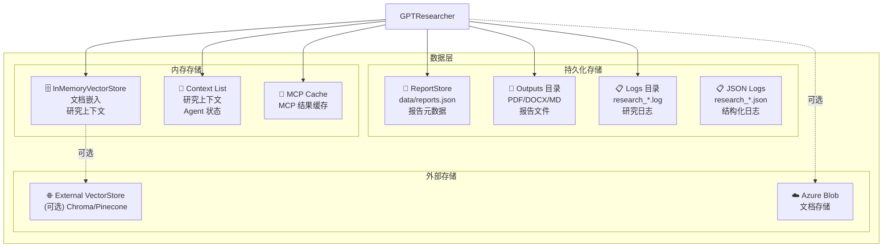
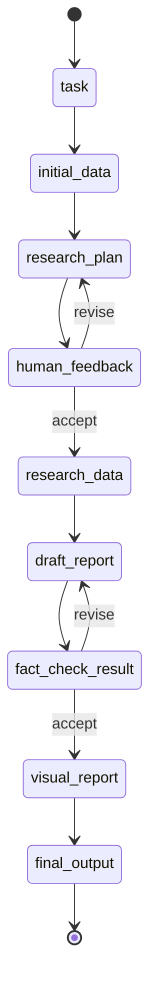
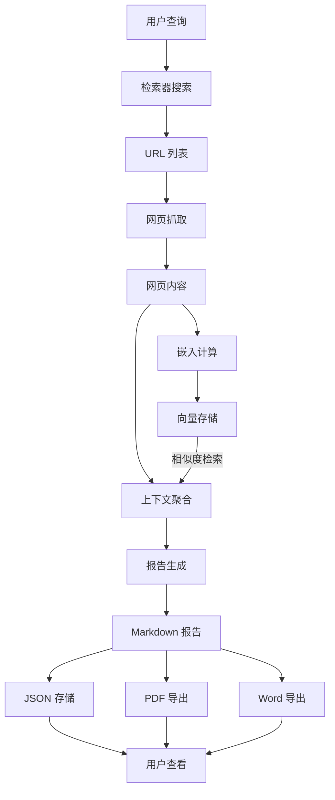

# 第6章 数据模型与数据库设计

> **文件**: `docs/wangbin/06-data-model.md`  
> **预计 Token**: ~8,000  
> **核心内容**: 向量存储、ReportStore、缓存策略、状态管理

---

## 6.1 数据架构概述

GPT Researcher **不使用传统关系数据库**，而是采用**轻量级 JSON 文件持久化** + **内存向量存储**的混合架构：



---

## 6.2 ReportStore 数据模型

### 6.2.1 存储实现

**文件**: `backend/server/report_store.py`  
**存储方式**: JSON 文件 (`data/reports.json`)  
**用途**: 报告元数据持久化

### 6.2.2 数据结构

```python
# 报告文档结构
ReportDocument = {
    "id": str,                    # 研究 ID (唯一标识)
    "question": str,              # 研究问题
    "answer": str,                # 研究答案/报告内容
    "orderedData": list,          # 有序研究数据
    "chatMessages": list,         # 聊天消息历史
    "timestamp": int,             # 时间戳 (毫秒)
}
```

### 6.2.3 字段详细说明

| 字段 | 类型 | 必填 | 说明 |
|------|------|------|------|
| `id` | string | 是 | 研究唯一标识，格式: `task_{timestamp}_{query_hash}` |
| `question` | string | 是 | 用户输入的研究查询 |
| `answer` | string | 否 | 生成的研究报告（Markdown 格式） |
| `orderedData` | array | 否 | 有序的研究数据块 |
| `chatMessages` | array | 否 | 与报告的交互聊天消息 |
| `timestamp` | integer | 是 | 最后更新时间戳（毫秒） |

### 6.2.4 ReportStore 类实现

```python
class ReportStore:
    def __init__(self, storage_path: Path):
        self.storage_path = storage_path
        self._cache: Dict[str, dict] = {}
        self._lock = asyncio.Lock()
    
    async def list_reports(self, report_ids: list[str] = None) -> list[dict]:
        """列出报告"""
        if report_ids:
            return [self._cache.get(id) for id in report_ids if id in self._cache]
        return list(self._cache.values())
    
    async def get_report(self, research_id: str) -> dict | None:
        """获取单个报告"""
        return self._cache.get(research_id)
    
    async def upsert_report(self, research_id: str, report: dict) -> None:
        """插入或更新报告"""
        async with self._lock:
            self._cache[research_id] = report
            await self._persist()
    
    async def delete_report(self, research_id: str) -> bool:
        """删除报告"""
        async with self._lock:
            if research_id in self._cache:
                del self._cache[research_id]
                await self._persist()
                return True
            return False
    
    async def _persist(self) -> None:
        """持久化到 JSON 文件"""
        async with aiofiles.open(self.storage_path, 'w') as f:
            await f.write(json.dumps(self._cache, indent=2))
```

**并发控制**: 使用 `asyncio.Lock` 保护写操作。

### 6.2.5 聊天消息结构

```python
ChatMessage = {
    "role": "user" | "assistant",
    "content": str,
    "timestamp": int,             # 毫秒
    "metadata": {                 # 可选
        "tool_calls": [
            {
                "tool": str,
                "args": dict,
                "call_id": str,
                "result": str
            }
        ]
    } | None
}
```

---

## 6.3 向量存储模型

### 6.3.1 VectorStoreWrapper

**文件**: `gpt_researcher/vector_store/vector_store.py`  
**底层实现**: LangChain VectorStore (InMemoryVectorStore / 外部)

### 6.3.2 文档模型

```python
# LangChain Document 结构
Document = {
    "page_content": str,          # 文档内容（截断至 MAX_CONTENT_CHARS）
    "metadata": {
        "source": str,            # 来源 URL
        "title": str,             # 文档标题（可选）
    }
}
```

### 6.3.3 分块策略

```python
def _split_documents(self, documents, chunk_size=1000, chunk_overlap=200):
    text_splitter = RecursiveCharacterTextSplitter(
        chunk_size=chunk_size,
        chunk_overlap=chunk_overlap,
    )
    return text_splitter.split_documents(documents)
```

**参数**:
- `chunk_size`: 1000 字符/块
- `chunk_overlap`: 200 字符重叠

### 6.3.4 向量搜索

```python
async def asimilarity_search(self, query, k, filter):
    return await self.vector_store.asimilarity_search(query=query, k=k, filter=filter)
```

**参数**:
- `query`: 搜索查询
- `k`: 返回结果数
- `filter`: 元数据过滤器

---

## 6.4 嵌入模型

### 6.4.1 嵌入提供商配置

```python
# config/variables/default.py
"EMBEDDING": "openai:text-embedding-3-small"
```

**格式**: `provider:model`

### 6.4.2 支持的嵌入提供商

| 提供商 | 默认模型 | 维度 |
|--------|---------|------|
| OpenAI | text-embedding-3-small | 1536 |
| Azure OpenAI | text-embedding-3-small | 1536 |
| Cohere | embed-v4 | 1024 |
| Google GenAI | text-embedding-004 | 768 |
| Ollama | mxbai-embed-large | 1024 |
| HuggingFace | all-MiniLM-L6-v2 | 384 |
| Nomic | nomic-embed-text | 768 |
| VoyageAI | voyage-3 | 1024 |

### 6.4.3 嵌入成本计算

```python
EMBEDDING_COST = 0.02 / 1000000  # 每 token $0.02 (ada-3-small)

def estimate_embedding_cost(model: str, docs: list) -> float:
    encoding = tiktoken.encoding_for_model(model)
    total_tokens = sum(len(encoding.encode(str(doc))) for doc in docs)
    return total_tokens * EMBEDDING_COST
```

---

## 6.5 研究状态模型 (LangGraph)

### 6.5.1 ResearchState (多 Agent)

**文件**: `multi_agents/memory/research.py`

```python
class ResearchState(TypedDict):
    task: Dict                    # 任务信息
    initial_data: str             # 初始研究结果
    research_plan: str            # 研究计划
    human_feedback: str | None    # 人类反馈
    revisions_count: int          # 修订计数
    research_data: str            # 研究数据
    draft_report: str             # 草稿报告
    fact_check_result: str        # 事实检查结果
    visual_report: str            # 可视化报告
    final_output: str             # 最终输出
```

### 6.5.2 状态转换



---

## 6.6 上下文数据模型

### 6.6.1 研究上下文

```python
# GPTResearcher.context 类型
context: list[str]  # 研究上下文列表（字符串数组）

# 示例
context = [
    "Source 1: Title\nContent from URL 1...",
    "Source 2: Title\nContent from URL 2]",
    ...
]
```

### 6.6.2 来源数据结构

```python
# 搜索结果 (Retriever 返回)
SearchResult = {
    "href": str,          # URL
    "body": str,          # 内容摘要
    "title": str,         # 标题（可选）
}

# 抓取结果 (Scraper 返回)
ScrapedContent = {
    "url": str,           # URL
    "raw_content": str,   # 原始内容
    "image_urls": list,   # 图像 URL 列表
    "title": str,         # 标题
}
```

### 6.6.3 已访问 URL 集合

```python
visited_urls: set[str]  # 已访问 URL 集合（去重用）
```

---

## 6.7 缓存策略

### 6.7.1 MCP 结果缓存

```python
# ResearchConductor 中的 MCP 缓存
self._mcp_results_cache = None
self._mcp_cache_lock = asyncio.Lock()

async def _get_mcp_results(self):
    async with self._mcp_cache_lock:
        if self._mcp_results_cache is not None:
            return self._mcp_results_cache
        # 执行 MCP 搜索
        self._mcp_results_cache = await self._execute_mcp_search()
        return self._mcp_results_cache
```

**策略**: 单次研究中缓存 MCP 结果，避免重复调用。

### 6.7.2 Tavily 搜索缓存

```python
# Tavily API 内置缓存
data = {
    "query": query,
    "use_cache": True,  # 启用缓存
    ...
}
```

**策略**: Tavily 服务端缓存，减少重复查询成本。

### 6.7.3 嵌入缓存

**当前实现**: 无显式嵌入缓存，每次实时计算。

**优化建议**: 对重复查询可使用 LRU 缓存。

---

## 6.8 日志数据模型

### 6.8.1 研究日志 (JSON)

**文件**: `logs/research_{timestamp}.json`

```python
{
    "timestamp": "2024-01-01T12:00:00",
    "events": [
        {
            "timestamp": "2024-01-01T12:00:01",
            "type": "research_start",
            "data": {"query": "...", "report_type": "..."}
        },
        ...
    ],
    "content": {
        "query": "研究查询",
        "sources": ["url1", "url2"],
        "context": ["context1", "context2"],
        "report": "最终报告",
        "costs": 0.05
    }
}
```

### 6.8.2 聊天日志

**文件**: `chat_{timestamp}.jsonl`

```python
{"messages": [...], "response": "...", "stacktrace": "..."}
```

**用途**: 记录所有 LLM 请求和响应，用于调试和审计。

---

## 6.9 文件存储结构

### 6.9.1 Outputs 目录

```
outputs/
├── research_1234567890_abc123.md      # Markdown 报告
├── research_1234567890_abc123.pdf     # PDF 报告
├── research_1234567890_abc123.docx    # Word 报告
└── ...
```

### 6.9.2 文件命名规则

```python
# 报告 ID 生成
def _generate_research_id(self, query: str) -> str:
    timestamp = str(int(time.time()))
    query_hash = hashlib.md5(query.encode()).hexdigest()[:8]
    return f"research_{timestamp}_{query_hash}"

# 详细报告 ID
def _generate_research_id(self, query: str) -> str:
    timestamp = str(int(time.time()))
    query_hash = hashlib.md5(query.encode()).hexdigest()[:8]
    return f"detailed_{timestamp}_{query_hash}"
```

### 6.9.3 报告导出

```python
# PDF 导出
async def write_md_to_pdf(report_markdown: str, research_id: str) -> str:
    # 使用 md2pdf 或 WeasyPrint
    ...

# Word 导出
async def write_md_to_word(report_markdown: str, research_id: str) -> str:
    # 使用 python-docx 或 htmldocx
    ...
```

---

## 6.10 数据流图



---

## 6.11 数据安全

### 6.11.1 敏感数据

| 数据类型 | 存储位置 | 保护措施 |
|---------|---------|---------|
| API Key | 环境变量 | 不进入代码仓库 |
| 报告内容 | JSON 文件 | 文件系统权限 |
| 聊天历史 | JSON 文件 | 文件系统权限 |
| 嵌入向量 | 内存 | 进程隔离 |

### 6.11.2 数据保留

- **报告**: 永久存储（手动删除）
- **日志**: 无自动清理（需手动管理）
- **向量**: 进程重启后丢失（除非使用外部 VectorStore）

---

## 6.12 总结

### 6.12.1 设计特点

1. **轻量级**: 无数据库依赖，JSON 文件即可运行
2. **简单**: 易于部署和理解
3. **可扩展**: 可替换为外部 VectorStore

### 6.12.2 限制

1. **并发**: JSON 文件写入需要锁
2. **查询**: 无复杂查询能力
3. **规模**: 不适合海量数据

### 6.12.3 改进建议

1. **引入 SQLite**: 更可靠的本地存储
2. **添加 TTL**: 自动清理过期报告
3. **嵌入缓存**: 减少重复计算

---

> **下一章**: → `07-api-design.md` — API 与接口设计

---

☕️ 制作不易，请我喝咖啡☕️关注我➕

