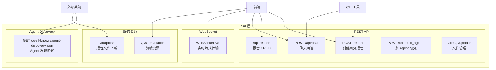
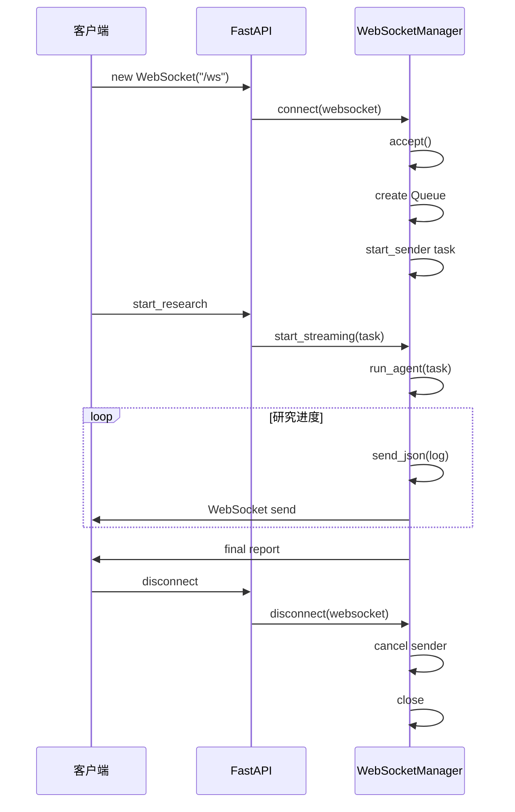

# 第7章 API 与接口设计

> **文件**: `docs/wangbin/07-api-design.md`  
> **预计 Token**: ~15,000  
> **核心内容**: REST API、WebSocket、请求/响应示例、认证、Agent Discovery

---

## 7.1 API 架构概述

GPT Researcher 提供以下 API 类型：



---

## 7.2 REST API 端点

### 7.2.1 API 总览

| 方法 | 路径 | 说明 | 请求体 | 响应 |
|------|------|------|--------|------|
| `GET` | `/` | 前端 HTML | - | HTML |
| `POST` | `/report/` | 创建研究报告 | ResearchRequest | ResearchResponse |
| `GET` | `/api/reports` | 列出报告 | Query: report_ids | {reports: []} |
| `GET` | `/api/reports/{id}` | 获取报告 | - | {report: {}} |
| `POST` | `/api/reports` | 创建/更新报告 | ReportDocument | {success, id} |
| `PUT` | `/api/reports/{id}` | 更新报告 | ReportDocument | {success, id} |
| `DELETE` | `/api/reports/{id}` | 删除报告 | - | {success, id} |
| `GET` | `/api/reports/{id}/chat` | 获取聊天历史 | - | {chatMessages: []} |
| `POST` | `/api/reports/{id}/chat` | 添加聊天消息 | ChatMessage | {success, id} |
| `POST` | `/api/chat` | 聊天问答 | ChatRequest | {response: {}} |
| `POST` | `/api/multi_agents` | 多 Agent 研究 | - | ResearchResponse |
| `GET` | `/files/` | 列出文件 | - | {files: []} |
| `POST` | `/upload/` | 上传文件 | multipart/form-data | {success} |
| `DELETE` | `/files/{name}` | 删除文件 | - | {success} |
| `GET` | `/report/{id}` | 下载报告文件 | - | FileResponse |
| `GET` | `/.well-known/agent-discovery.json` | Agent 发现 | - | AgentDiscovery |

---

## 7.3 核心 API 详解

### 7.3.1 创建研究报告

#### 端点

```
POST /report/
```

#### 请求模型

```python
class ResearchRequest(BaseModel):
    task: str                                    # 研究任务（必填）
    report_type: str = "research_report"         # 报告类型
    report_source: str = "web"                   # 数据来源
    tone: str = "Objective"                      # 文章语气
    headers: dict | None = None                  # 额外头部
    repo_name: str = ""                          # 仓库名（GitHub 集成）
    branch_name: str = ""                        # 分支名
    generate_in_background: bool = True          # 是否后台生成
```

#### 请求示例

```bash
curl -X POST http://localhost:8000/report/ \
  -H "Content-Type: application/json" \
  -d '{
    "task": "2024年AI Agent最新进展",
    "report_type": "research_report",
    "report_source": "web",
    "tone": "Objective",
    "generate_in_background": false
  }'
```

#### 响应模型

```python
# 前台生成
{
    "research_id": "research_1234567890_abc123",
    "research_information": {
        "source_urls": ["url1", "url2"],
        "research_costs": 0.05,
        "visited_urls": ["url1", "url2"],
        "research_images": [{"url": "...", "title": "..."}]
    },
    "report": "# 2024年AI Agent最新进展\n\n...",
    "docx_path": "outputs/research_1234567890_abc123.docx",
    "pdf_path": "outputs/research_1234567890_abc123.pdf"
}

# 后台生成
{
    "message": "Your report is being generated in the background...",
    "research_id": "research_1234567890_abc123"
}
```

#### 报告类型枚举

```python
class ReportType(str, Enum):
    ResearchReport = "research_report"
    DetailedReport = "detailed_report"
    ResourceReport = "resource_report"
    OutlineReport = "outline_report"
    CustomReport = "custom_report"
    SubtopicReport = "subtopic_report"
    DeepResearch = "deep"
```

#### 数据来源枚举

```python
class ReportSource(str, Enum):
    Web = "web"
    Local = "local"
    Azure = "azure"
    LangChainDocuments = "langchain_documents"
    LangChainVectorStore = "langchain_vectorstore"
    Static = "static"
    Hybrid = "hybrid"
```

#### 语气枚举

```python
class Tone(str, Enum):
    Objective = "Objective (impartial and unbiased...)"
    Formal = "Formal (adheres to academic standards...)"
    Analytical = "Analytical (critical evaluation...)"
    Persuasive = "Persuasive (convincing the audience...)"
    Informative = "Informative (providing clear...)"
    Explanatory = "Explanatory (clarifying complex...)"
    Descriptive = "Descriptive (detailed depiction...)"
    Critical = "Critical (judging the validity...)"
    Comparative = "Comparative (juxtaposing...)"
    Speculative = "Speculative (exploring hypotheses...)"
    Reflective = "Reflective (considering the process...)"
    Narrative = "Narrative (telling a story...)"
    Humorous = "Humorous (light-hearted...)"
    Optimistic = "Optimistic (highlighting positive...)"
    Pessimistic = "Pessimistic (focusing on limitations...)"
    Simple = "Simple (written for young readers...)"
    Casual = "Casual (conversational...)"
```

---

### 7.3.2 报告 CRUD

#### 列出报告

```
GET /api/reports?report_ids=id1,id2,id3
```

**响应**:
```json
{
    "reports": [
        {
            "id": "research_123",
            "question": "查询",
            "answer": "报告内容",
            "timestamp": 1234567890000
        }
    ]
}
```

#### 获取单个报告

```
GET /api/reports/{research_id}
```

**响应**:
```json
{
    "report": {
        "id": "research_123",
        "question": "查询",
        "answer": "报告内容",
        "orderedData": [],
        "chatMessages": [],
        "timestamp": 1234567890000
    }
}
```

#### 创建/更新报告

```
POST /api/reports
Content-Type: application/json

{
    "id": "custom_id",
    "question": "问题",
    "answer": "答案",
    "orderedData": [],
    "chatMessages": [],
    "timestamp": 1234567890000
}
```

**响应**:
```json
{"success": true, "id": "custom_id"}
```

#### 更新报告

```
PUT /api/reports/{research_id}
Content-Type: application/json

{
    "answer": "更新后的内容"
}
```

#### 删除报告

```
DELETE /api/reports/{research_id}
```

**响应**:
```json
{"success": true, "id": "research_123"}
```

---

### 7.3.3 聊天问答

#### 端点

```
POST /api/chat
```

#### 请求模型

```python
class ChatRequest(BaseModel):
    model_config = ConfigDict(extra="allow")  # 允许额外字段
    
    report: str                                    # 报告内容
    messages: list[dict[str, Any]]                 # 消息历史
```

#### 请求示例

```bash
curl -X POST http://localhost:8000/api/chat \
  -H "Content-Type: application/json" \
  -d '{
    "report": "# 2024年AI Agent最新进展\n\n...",
    "messages": [
        {"role": "user", "content": "这篇报告提到了哪些关键技术？"}
    ]
  }'
```

#### 响应模型

```json
{
    "response": {
        "role": "assistant",
        "content": "这篇报告提到了以下关键技术：\n\n1. **ReAct**...\n2. **Chain-of-Thought**...",
        "timestamp": 1721234567890,
        "metadata": {
            "tool_calls": [
                {
                    "tool": "quick_search",
                    "args": {"query": "AI Agent 2024 关键技术"},
                    "call_id": "call_abc123",
                    "result": "Search results..."
                }
            ]
        }
    }
}
```

#### 错误响应

```json
{
    "error": "Error message"
}
```

---

### 7.3.4 报告关联聊天

#### 获取聊天历史

```
GET /api/reports/{research_id}/chat
```

**响应**:
```json
{
    "chatMessages": [
        {"role": "user", "content": "问题1"},
        {"role": "assistant", "content": "回答1"}
    ]
}
```

#### 添加聊天消息

```
POST /api/reports/{research_id}/chat
Content-Type: application/json

{
    "report": "报告内容",
    "messages": [
        {"role": "user", "content": "新问题"}
    ]
}
```

#### 报告聊天（直接处理）

```
POST /api/reports/{research_id}/chat
Content-Type: application/json

{
    "report": "报告内容",
    "messages": [...]
}
```

**响应**: 同 `/api/chat`

---

### 7.3.5 多 Agent 协作研究

#### 端点

```
POST /api/multi_agents
```

#### 请求

无需请求体（任务配置从 `multi_agents/task.json` 读取）。

#### 响应

```json
{
    "report": "多 Agent 协作生成的报告...",
    "research_id": "multi_1234567890"
}
```

---

### 7.3.6 文件管理

#### 列出文件

```
GET /files/
```

**响应**:
```json
{"files": ["doc1.pdf", "doc2.txt"]}
```

#### 上传文件

```
POST /upload/
Content-Type: multipart/form-data

file: <binary>
```

#### 删除文件

```
DELETE /files/{filename}
```

---

### 7.3.7 报告下载

#### 下载 DOCX 报告

```
GET /report/{research_id}
```

**响应**: FileResponse (application/vnd.openxmlformats-officedocument.wordprocessingml.document)

#### 下载输出文件

```
GET /outputs/{filename}
```

---

## 7.4 WebSocket API

### 7.4.1 连接

```
WebSocket /ws
```

### 7.4.2 消息类型

#### 客户端 → 服务器

```json
{
    "type": "start_research",
    "task": "研究查询",
    "report_type": "research_report",
    "report_source": "web",
    "tone": "Objective",
    "query_domains": [],
    "mcp_enabled": false,
    "mcp_strategy": "fast",
    "mcp_configs": []
}
```

#### 服务器 → 客户端

**日志消息**:
```json
{
    "type": "logs",
    "content": "scraping_urls",
    "output": "🌐 Scraping content from 5 URLs..."
}
```

**图像消息**:
```json
{
    "type": "images",
    "content": "selected_images",
    "output": "🖼️ Selected 3 images",
    "data": [{"url": "...", "title": "..."}]
}
```

**成本消息**:
```json
{
    "type": "cost",
    "content": "cost_update",
    "output": "$0.05"
}
```

**报告消息**:
```json
{
    "type": "research_report",
    "content": "final_report",
    "output": "# 报告标题\n\n..."
}
```

**Pong 消息**:
```
"pong"
```

### 7.4.3 连接生命周期



---

## 7.5 Agent Discovery API

### 7.5.1 端点

```
GET /.well-known/agent-discovery.json
```

### 7.5.2 响应

```json
{
    "GPT Researcher": {
        "name": "GPT Researcher",
        "description": "Autonomous agent for comprehensive online research",
        "url": "http://localhost:8000",
        "authentication": {
            "type": "none"
        },
        "endpoints": {
            "research": {
                "method": "POST",
                "path": "/report/",
                "description": "Generate a research report"
            },
            "chat": {
                "method": "POST",
                "path": "/api/chat",
                "description": "Chat with a research report"
            }
        },
        "capabilities": [
            "Web research",
            "Report generation",
            "Multi-source aggregation",
            "Citation tracking"
        ],
        "contact": "assaf.elovic@gmail.com"
    }
}
```

### 7.5.3 实现

```python
@app.get("/.well-known/agent-discovery.json")
async def agent_discovery(request: Request):
    origin = str(request.base_url).rstrip("/")
    domain = request.url.hostname or request.headers.get("host", "")
    contact = os.getenv("AGENT_DISCOVERY_CONTACT")
    
    document = build_agent_discovery_document(
        origin=origin, domain=domain, contact=contact
    )
    response = JSONResponse(content=document)
    response.headers["Access-Control-Allow-Origin"] = "*"
    return response
```

---

## 7.6 CORS 配置

### 7.6.1 允许来源

```python
ALLOWED_ORIGINS = (
    [o.strip() for o in allowed_origins_env.split(",") if o.strip()]
    if allowed_origins_env
    else [
        "http://localhost:3000",
        "http://127.0.0.1:3000",
        "https://app.gptr.dev",
    ]
)
```

### 7.6.2 CORS 中间件

```python
app.add_middleware(
    CORSMiddleware,
    allow_origins=ALLOWED_ORIGINS,
    allow_credentials=True,
    allow_methods=["*"],
    allow_headers=["*"],
)
```

---

## 7.7 认证与安全

### 7.7.1 认证策略

| 端点类型 | 认证方式 |
|---------|---------|
| REST API | 无（内部服务） |
| WebSocket | 无（内部服务） |
| Agent Discovery | 无（公开） |
| API Key 传递 | headers 传递 |

### 7.7.2 API Key 传递

```bash
curl -X POST http://localhost:8000/report/ \
  -H "Content-Type: application/json" \
  -H "tavily_api_key: tvly-xxx" \
  -H "OPENAI_API_KEY: sk-xxx" \
  -d '{"task": "..."}'
```

### 7.7.3 安全头

```python
# Agent Discovery 端点
response.headers["Access-Control-Allow-Origin"] = "*"
```

---

## 7.8 限流与配额

### 7.8.1 服务端限流

**当前实现**: 无显式 API 限流。

**建议**: 在生产部署中添加 Nginx 限流或 API Gateway。

### 7.8.2 外部 API 限流

| API | 限速 | 处理方式 |
|------|------|---------|
| Tavily | 1000/月 (Free) | 客户端重试 |
| OpenAI | RPM/TPM 限制 | 指数退避 |
| Scraper | 可配 | GlobalRateLimiter |

---

## 7.9 API 版本控制

### 7.9.1 当前策略

**无显式版本前缀**: 所有端点直接挂载在 `/` 下。

**路由组织**:
```
/api/reports     # v1 报告 API
/api/chat        # v1 聊天 API
/report/         # v1 研究 API (遗留)
```

### 7.9.2 建议

```
/api/v1/reports   # 版本化 API
/api/v1/chat
/api/v1/research
```

---

## 7.10 OpenAPI/Swagger

### 7.10.1 自动文档

FastAPI 自动生成 OpenAPI 文档：

```
GET /docs    # Swagger UI
GET /openapi.json  # OpenAPI Schema
```

### 7.10.2 OpenAPI 示例

```yaml
openapi: 3.1.0
info:
  title: GPT Researcher API
  version: 0.14.7
  description: Autonomous research agent API

paths:
  /report/:
    post:
      summary: Generate a research report
      requestBody:
        content:
          application/json:
            schema:
              $ref: '#/components/schemas/ResearchRequest'
      responses:
        '200':
          description: Report generated successfully
          content:
            application/json:
              schema:
                $ref: '#/components/schemas/ResearchResponse'

components:
  schemas:
    ResearchRequest:
      type: object
      required: [task, report_type]
      properties:
        task:
          type: string
          description: Research query
        report_type:
          type: string
          enum: [research_report, detailed_report, deep, ...]
        tone:
          type: string
          enum: [Objective, Formal, Analytical, ...]
```

---

## 7.11 错误处理

### 7.11.1 HTTP 错误码

| 状态码 | 场景 | 响应 |
|--------|------|------|
| 400 | 请求参数错误 | {"detail": "..."} |
| 404 | 报告不存在 | {"detail": "Report not found"} |
| 500 | 服务器内部错误 | {"detail": "Error message"} |

### 7.11.2 错误响应示例

```json
{
    "detail": "Report not found"
}
```

### 7.11.3 WebSocket 错误

```json
{
    "type": "error",
    "content": "research_error",
    "output": "An error occurred during research: ..."
}
```

---

## 7.12 API 使用示例

### 7.12.1 Python 客户端

```python
import httpx

async def generate_report(query: str) -> str:
    async with httpx.AsyncClient() as client:
        response = await client.post(
            "http://localhost:8000/report/",
            json={
                "task": query,
                "report_type": "research_report",
                "tone": "Objective",
                "generate_in_background": False
            }
        )
        data = response.json()
        return data["report"]
```

### 7.12.2 JavaScript 客户端

```javascript
async function generateReport(query) {
    const response = await fetch('http://localhost:8000/report/', {
        method: 'POST',
        headers: {'Content-Type': 'application/json'},
        body: JSON.stringify({
            task: query,
            report_type: 'research_report',
            tone: 'Objective',
            generate_in_background: false
        })
    });
    const data = await response.json();
    return data.report;
}
```

### 7.12.3 WebSocket 客户端

```javascript
const ws = new WebSocket('ws://localhost:8000/ws');

ws.onopen = () => {
    ws.send(JSON.stringify({
        type: 'start_research',
        task: 'AI Agent 2024',
        report_type: 'research_report',
        tone: 'Objective'
    }));
};

ws.onmessage = (event) => {
    const data = JSON.parse(event.data);
    console.log(data.type, data.output);
};
```

---

## 7.13 总结

### 7.13.1 API 设计特点

1. **RESTful**: 清晰的资源命名
2. **WebSocket**: 实时流式传输
3. **灵活**: 支持多种报告类型和配置
4. **可发现**: Agent Discovery 协议
5. **轻量**: 无复杂认证机制

### 7.13.2 改进建议

1. **版本控制**: 添加 `/api/v1/` 前缀
2. **认证**: 添加 API Key 认证
3. **限流**: 添加请求限流
4. **文档**: 完善 OpenAPI 描述
5. **错误**: 统一错误响应格式

---

> **下一章**: → `08-deployment.md` — 部署、运维与基础设施

---

☕️ 制作不易，请我喝咖啡☕️关注我➕

