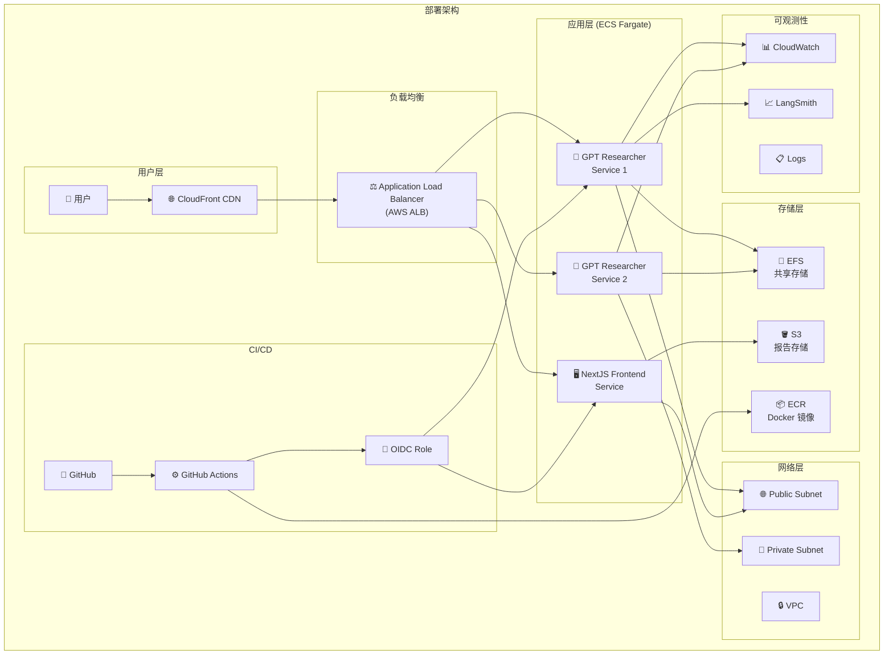
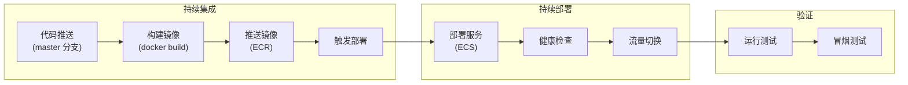

# 第8章 部署、运维与基础设施

> **文件**: `docs/wangbin/08-deployment.md`  
> **预计 Token**: ~12,000  
> **核心内容**: Docker、Terraform、CI/CD、监控、日志

---

## 8.1 部署架构概述



---

## 8.2 Docker 配置

### 8.2.1 主 Dockerfile

**文件**: `Dockerfile`  
**阶段**: 3 阶段构建

```dockerfile
# Stage 1: 浏览器安装
FROM python:3.12-slim-bookworm AS install-browser
RUN apt-get install -y chromium chromium-driver firefox-esr

# Stage 2: Python 依赖
FROM install-browser AS gpt-researcher-install
COPY requirements.txt .
RUN pip install -r requirements.txt

# Stage 3: 最终镜像
FROM gpt-researcher-install AS gpt-researcher
RUN useradd gpt-researcher
USER gpt-researcher
EXPOSE 8000
CMD ["uvicorn", "main:app", "--host", "0.0.0.0", "--port", "8000"]
```

**多阶段构建优势**:
1. **减小镜像体积**: 构建工具不包含在最终镜像
2. **安全**: 非 root 用户运行
3. **缓存**: 依赖层独立缓存

### 8.2.2 Fullstack Dockerfile

**文件**: `Dockerfile.fullstack`  
**用途**: 包含完整浏览器和工具链的开发镜像

### 8.2.3 Docker Compose

**文件**: `docker-compose.yml`

```yaml
services:
  gpt-researcher:
    pull_policy: build
    image: gptresearcher/gpt-researcher
    build: ./
    environment:
      OPENAI_API_KEY: ${OPENAI_API_KEY}
      TAVILY_API_KEY: ${TAVILY_API_KEY}
      LANGCHAIN_API_KEY: ${LANGCHAIN_API_KEY}
    volumes:
      - ${PWD}/my-docs:/usr/src/app/my-docs:rw
      - ${PWD}/outputs:/usr/src/app/outputs:rw
      - ${PWD}/logs:/usr/src/app/logs:rw
    ports:
      - 8000:8000
    restart: always

  gptr-nextjs:
    pull_policy: build
    image: gptresearcher/gptr-nextjs
    build:
      dockerfile: Dockerfile.dev
      context: frontend/nextjs
    environment:
      NEXT_PUBLIC_GPTR_API_URL: ${NEXT_PUBLIC_GPTR_API_URL}
    volumes:
      - ./frontend/nextjs:/app
    ports:
      - 3000:3000
    restart: always

  gpt-researcher-tests:
    build: ./
    profiles: ["test"]
    command: pytest tests/

  discord-bot:
    build: ./docs/discord-bot
    profiles: ["discord"]
    ports:
      - 3001:3000
```

**服务说明**:

| 服务 | 端口 | 用途 | Profile |
|------|------|------|---------|
| gpt-researcher | 8000 | 核心 API | 默认 |
| gptr-nextjs | 3000 | 前端 | 默认 |
| gpt-researcher-tests | - | 测试 | test |
| discord-bot | 3001 | Discord Bot | discord |

### 8.2.4 卷映射

| 宿主机路径 | 容器路径 | 用途 |
|-----------|---------|------|
| `./my-docs` | `/usr/src/app/my-docs` | 本地文档目录 |
| `./outputs` | `/usr/src/app/outputs` | 报告输出 |
| `./logs` | `/usr/src/app/logs` | 日志文件 |

---

## 8.3 Terraform 基础设施

### 8.3.1 目录结构

```
terraform/
├── main.tf                  # 主配置
├── variables.tf             # 变量定义
├── outputs.tf               # 输出定义
├── versions.tf              # 版本约束
├── ecr-setup/               # ECR 仓库配置
│   └── main.tf
└── github-actions-setup/    # GitHub OIDC 配置
    └── main.tf
```

### 8.3.2 ECR 仓库

**文件**: `terraform/ecr-setup/main.tf`

```hcl
resource "aws_ecr_repository" "gpt_researcher" {
  name                 = "gpt-researcher"
  image_tag_mutability = "MUTABLE"
  
  image_scanning_configuration {
    scan_on_push = true
  }
}

resource "aws_ecr_repository" "gptr_nextjs" {
  name                 = "gptr-nextjs"
  image_tag_mutability = "MUTABLE"
}
```

### 8.3.3 GitHub Actions OIDC

**文件**: `terraform/github-actions-setup/main.tf`

```hcl
resource "aws_iam_role" "github_actions" {
  name = "gpt-researcher-github-actions-role"
  
  assume_role_policy = jsonencode({
    Version = "2012-10-17"
    Statement = [{
      Effect = "Allow"
      Principal = {
        Federated = "arn:aws:iam::${var.account_id}:oidc-provider/token.actions.githubusercontent.com"
      }
      Action = "sts:AssumeRoleWithWebIdentity"
      Condition = {
        StringEquals = {
          "token.actions.githubusercontent.com:aud" = "sts.amazonaws.com"
        }
        StringLike = {
          "token.actions.githubusercontent.com:sub" = "repo:assafelovic/gpt-researcher:*"
        }
      }
    }]
  })
}
```

**OIDC 优势**: 无需长期 AWS 凭证，使用短期令牌。

### 8.3.4 ECS 服务

**文件**: `terraform/main.tf`

```hcl
resource "aws_ecs_cluster" "gpt_researcher" {
  name = "gpt-researcher-cluster"
}

resource "aws_ecs_task_definition" "gpt_researcher" {
  family                   = "gpt-researcher"
  network_mode             = "awsvpc"
  requires_compatibilities = ["FARGATE"]
  cpu                      = "1024"
  memory                   = "2048"
  
  container_definitions = jsonencode([{
    name  = "gpt-researcher"
    image = "${aws_ecr_repository.gpt_researcher.repository_url}:latest"
    
    portMappings = [{
      containerPort = 8000
      hostPort      = 8000
    }]
    
    environment = [
      { name = "OPENAI_API_KEY", value = var.openai_api_key },
      { name = "TAVILY_API_KEY", value = var.tavily_api_key }
    ]
    
    logConfiguration = {
      logDriver = "awslogs"
      options = {
        "awslogs-group"         = "/ecs/gpt-researcher"
        "awslogs-region"        = var.aws_region
        "awslogs-stream-prefix" = "ecs"
      }
    }
  }])
}

resource "aws_ecs_service" "gpt_researcher" {
  name            = "gpt-researcher-service"
  cluster         = aws_ecs_cluster.gpt_researcher.id
  task_definition = aws_ecs_task_definition.gpt_researcher.arn
  desired_count   = 2
  
  load_balancer {
    target_group_arn = aws_lb_target_group.gpt_researcher.arn
    container_name   = "gpt-researcher"
    container_port   = 8000
  }
}
```

---

## 8.4 CI/CD 流水线

### 8.4.1 构建与推送工作流

**文件**: `.github/workflows/build-push.yml`

```yaml
name: Build-Push and Update Image Tag

on:
  push:
    branches: [master]
    paths-ignore:
      - 'terraform/**'

jobs:
  build-and-update:
    runs-on: ubuntu-latest
    permissions:
      contents: write
      id-token: write
      actions: write
    
    steps:
      - uses: actions/checkout@v5
      
      - name: Configure AWS Credentials
        uses: aws-actions/configure-aws-credentials@v4
        with:
          role-to-assume: arn:aws:iam::908027381725:role/gpt-researcher-github-actions-role
          aws-region: us-east-1
      
      - name: Login to ECR
        uses: aws-actions/amazon-ecr-login@v2
      
      - name: Build and Push
        run: |
          IMAGE_TAG="${TIMESTAMP}-${SHORT_SHA}"
          docker build -t $ECR_REGISTRY/gpt-researcher:$IMAGE_TAG .
          docker push $ECR_REGISTRY/gpt-researcher:$IMAGE_TAG
      
      - name: Trigger Deployment
        run: |
          gh workflow run deploy.yml --field image_tag=$IMAGE_TAG
```

### 8.4.2 部署工作流

**文件**: `.github/workflows/deploy.yml`

```yaml
name: Deploy

on:
  workflow_dispatch:
    inputs:
      image_tag:
        required: true
        type: string

jobs:
  deploy:
    runs-on: ubuntu-latest
    steps:
      - name: Deploy to ECS
        run: |
          aws ecs update-service \
            --cluster gpt-researcher-cluster \
            --service gpt-researcher-service \
            --force-new-deployment
```

### 8.4.3 CI/CD 流程图



---

## 8.5 监控与可观测性

### 8.5.1 日志架构

```mermaid
graph TB
        subgraph "日志源"
            APP["应用日志<br/>(Loguru)"]
            UVICORN["Uvicorn 日志"]
            RESEARCH["研究日志<br/>(JSON)"]
        end
        
        subgraph "日志处理"
            FILE["文件日志<br/>(logs/)"]
            STDOUT["标准输出"]
            CW_LOGS["CloudWatch Logs"]
        end
        
        subgraph "日志分析"
            CW_METRICS["CloudWatch Metrics"]
            ALARMS["告警"]
            DASHBOARD["仪表盘"]
        end
        
        APP --> FILE
        APP --> STDOUT
        UVICORN --> STDOUT
        RESEARCH --> FILE
        
        STDOUT --> CW_LOGS
        FILE --> CW_LOGS
        
        CW_LOGS --> CW_METRICS
        CW_METRICS --> ALARMS
        CW_METRICS --> DASHBOARD
    </div>
</div>
```

### 8.5.2 日志配置

**文件**: `main.py`

```python
logging.basicConfig(
    level=logging.INFO,
    format='%(asctime)s - %(name)s - %(levelname)s - %(message)s',
    handlers=[
        logging.FileHandler('logs/app.log'),
        logging.StreamHandler()
    ]
)
```

**文件**: `gpt_researcher/utils/logging_config.py`

```python
class JSONResearchHandler:
    def __init__(self, json_file):
        self.research_data = {
            "timestamp": datetime.now().isoformat(),
            "events": [],
            "content": {
                "query": "",
                "sources": [],
                "context": [],
                "report": "",
                "costs": 0.0
            }
        }
```

### 8.5.3 LangSmith 追踪

```python
# 可选配置
if os.environ.get("LANGCHAIN_API_KEY"):
    os.environ["LANGCHAIN_TRACING_V2"] = "true"
```

**功能**:
- LLM 调用链追踪
- Token 用量统计
- 延迟分析
- 错误诊断

### 8.5.4 成本追踪

**实时成本更新**:
```python
def add_costs(self, cost: float) -> None:
    self.research_costs += cost
    step = self._current_step
    self.step_costs[step] = self.step_costs.get(step, 0.0) + cost
```

**成本通过 WebSocket 推送到前端**:
```json
{
    "type": "cost",
    "content": "cost_update",
    "output": "$0.05"
}
```

---

## 8.6 告警方案

### 8.6.1 CloudWatch 告警

```hcl
resource "aws_cloudwatch_metric_alarm" "high_error_rate" {
  alarm_name          = "gpt-researcher-high-error-rate"
  comparison_operator = "GreaterThanThreshold"
  evaluation_periods  = 2
  metric_name         = "5xx"
  namespace           = "AWS/ApplicationELB"
  period              = 300
  statistic           = "Sum"
  threshold           = 10
  alarm_description   = "High 5xx error rate"
  
  dimensions = {
    LoadBalancer = aws_lb.gpt_researcher.arn_suffix
  }
}

resource "aws_cloudwatch_metric_alarm" "high_latency" {
  alarm_name          = "gpt-researcher-high-latency"
  comparison_operator = "GreaterThanThreshold"
  evaluation_periods  = 3
  metric_name         = "TargetResponseTime"
  namespace           = "AWS/ApplicationELB"
  period              = 300
  statistic           = "Average"
  threshold           = 5
}
```

### 8.6.2 告警类型

| 告警 | 条件 | 通知方式 |
|------|------|---------|
| 高错误率 | 5xx > 10/5min | Email/Slack |
| 高延迟 | P99 > 30s | Email/Slack |
| 服务不可用 | Health Check 失败 | PagerDuty |
| 成本超限 | 日成本 > $100 | Email |

---

## 8.7 备份方案

### 8.7.1 数据备份

| 数据类型 | 备份策略 | 保留期 |
|---------|---------|--------|
| 报告文件 (S3) | 版本控制 + 跨区域复制 | 永久 |
| 日志 (CloudWatch) | 导出到 S3 | 90 天 |
| 配置 (Terraform) | Git 版本控制 | 永久 |
| Docker 镜像 | ECR 保留最近 30 个 | 30 天 |

### 8.7.2 灾难恢复

| 场景 | RTO | RPO | 恢复策略 |
|------|-----|-----|---------|
| 单实例故障 | < 1min | 0 | ECS 自动替换 |
| 可用区故障 | < 5min | 0 | 多 AZ 部署 |
| 区域故障 | < 30min | 1h | 跨区域备份恢复 |

---

## 8.8 本地开发部署

### 8.8.1 前置条件

```bash
# Python 3.11+
python --version

# 环境变量
cp .env.example .env
# 编辑 .env 添加 API Key
```

### 8.8.2 本地运行

```bash
# 克隆仓库
git clone https://github.com/assafelovic/gpt-researcher.git
cd gpt-researcher

# 安装依赖
pip install -r requirements.txt

# 设置 API Key
export OPENAI_API_KEY="sk-xxx"
export TAVILY_API_KEY="tvly-xxx"

# 启动服务
python main.py
# 或
uvicorn main:app --reload --port 8000
```

### 8.8.3 Docker 本地部署

```bash
# 构建镜像
docker-compose build

# 启动所有服务
docker-compose up -d

# 查看日志
docker-compose logs -f gpt-researcher

# 停止服务
docker-compose down
```

### 8.8.4 前端开发

```bash
cd frontend/nextjs
npm install
npm run dev
# 访问 http://localhost:3000
```

---

## 8.9 生产部署清单

### 8.9.1 部署前检查

- [ ] API Key 已配置
- [ ] CORS 来源已设置
- [ ] SSL 证书已配置
- [ ] 数据库备份已启用
- [ ] 监控告警已配置
- [ ] 日志聚合已配置
- [ ] 安全扫描已通过

### 8.9.2 环境变量

```bash
# 必需
OPENAI_API_KEY=sk-xxx
TAVILY_API_KEY=tvly-xxx

# 可选
LANGCHAIN_API_KEY=xxx
GOOGLE_API_KEY=xxx  # 图像生成
LOGGING_LEVEL=INFO

# CORS
CORS_ALLOW_ORIGINS=https://yourdomain.com

# 配置
CONFIG_PATH=/path/to/config.json
```

### 8.9.3 性能调优

| 参数 | 默认值 | 建议值 | 说明 |
|------|-------|--------|------|
| WORKERS | 1 | 2-4 | Uvicorn Worker 数 |
| MAX_SCRAPER_WORKERS | 15 | 10-20 | 并发抓取数 |
| SCRAPER_RATE_LIMIT_DELAY | 0 | 0-6 | 抓取间隔(秒) |
| FAST_TOKEN_LIMIT | 6000 | 4000-8000 | Fast LLM Token 限制 |
| SMART_TOKEN_LIMIT | 12000 | 8000-16000 | Smart LLM Token 限制 |

---

## 8.10 总结

### 8.10.1 部署特点

1. **容器化**: Docker 多阶段构建，减小镜像体积
2. **IaC**: Terraform 管理基础设施
3. **CI/CD**: GitHub Actions 自动构建部署
4. **可观测**: LangSmith + CloudWatch 全面监控
5. **安全**: OIDC 认证，非 root 运行

### 8.10.2 改进建议

1. **蓝绿部署**: 减少部署停机时间
2. **自动扩缩**: 基于 CPU/内存的 ECS 自动扩缩
3. **缓存层**: 添加 Redis 缓存频繁查询
4. **CDN**: 使用 CloudFront 加速前端资源
5. **WAF**: 添加 AWS WAF 防护

---

> **下一章**: → `09-improvements.md` — 改进建议、风险点与未来规划

---

☕️ 制作不易，请我喝咖啡☕️关注我➕

