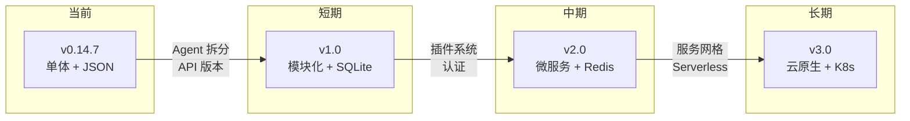

# 第9章 改进建议、风险点与未来规划

> **文件**: `docs/wangbin/09-improvements.md`  
> **预计 Token**: ~10,000  
> **核心内容**: 架构优缺点、风险点、技术债、优化建议、未来规划

---

## 9.1 当前架构优点

### 9.1.1 高度模块化

| 优点 | 说明 | 影响 |
|------|------|------|
| **插件化设计** | Retriever/Scraper/LLM 可热插拔 | 易于扩展新功能 |
| **分层清晰** | Agent → Skills → Actions → Infrastructure | 易于理解和维护 |
| **单一职责** | 每个模块职责明确 | 降低耦合度 |
| **接口统一** | 所有检索器/爬虫实现相同接口 | 易于替换实现 |

### 9.1.2 多提供商支持

| 优点 | 说明 |
|------|------|
| **无供应商锁定** | 27 家 LLM 提供商可选 |
| **灵活配置** | 通过环境变量切换提供商 |
| **成本优化** | 可根据任务选择性价比最高的模型 |
| **容错能力** | 单提供商故障可切换到其他提供商 |

### 9.1.3 丰富的功能特性

- **7 种报告类型**: 适应不同研究深度需求
- **20+ 检索后端**: 覆盖 Web、学术、社交等多源
- **8 种爬虫后端**: 支持静态/动态/PDF 等多种内容
- **19 种文章语气**: 适应不同受众和场景
- **MCP 集成**: 接入外部工具扩展能力
- **多 Agent 协作**: LangGraph 驱动复杂任务

### 9.1.4 开发体验

- **类型注解**: 全代码类型提示，IDE 友好
- **异步优先**: asyncio 全异步 I/O
- **配置灵活**: 环境变量 + 配置文件 + 默认值
- **文档完善**: 73 个测试文件，覆盖核心路径

---

## 9.2 当前架构缺点

### 9.2.1 代码结构问题

| 问题 | 位置 | 影响 | 严重性 |
|------|------|------|--------|
| **Agent 类过大** | `agent.py` (794行) | 承担过多职责，难以维护 | 高 |
| **Skills 与 Agent 双向引用** | `skills/*` | 增加耦合度 | 中 |
| **Actions 层部分冗余** | `actions/*` | 部分函数仅调用一次 | 低 |
| **配置全局化** | `config.py` | 所有模块依赖 Config | 中 |
| **缺乏抽象基类** | `retrievers/*`, `scraper/*` | 接口约定不明确 | 中 |

### 9.2.2 架构设计问题

| 问题 | 说明 | 影响 |
|------|------|------|
| **全局状态** | `GlobalRateLimiter` 单例模式 | 测试困难，并发风险 |
| **错误处理不一致** | 部分返回空值，部分抛异常 | 下游难以调试 |
| **缺乏事务性** | 研究过程无原子性保证 | 部分失败难以回滚 |
| **无版本控制** | API 无版本前缀 | 升级可能破坏兼容性 |

### 9.2.3 性能瓶颈

| 瓶颈 | 场景 | 影响 |
|------|------|------|
| **LLM 调用延迟** | 深度研究多次调用 | 总耗时线性增长 |
| **嵌入计算** | 大量文档嵌入 | CPU 密集 |
| **JSON 文件写入** | 高并发报告存储 | I/O 阻塞 |
| **内存占用** | 大量上下文累积 | OOM 风险 |

---

## 9.3 风险点分析

### 9.3.1 安全风险

| 风险 | 描述 | 可能性 | 影响 | 缓解措施 |
|------|------|--------|------|---------|
| **Prompt 注入** | 恶意网页内容注入 LLM | 中 | 高 | 输入过滤、输出验证 |
| **API Key 泄露** | 日志或错误信息泄露 Key | 低 | 高 | Key 脱敏、环境变量 |
| **成本失控** | 深度研究产生高额费用 | 中 | 高 | 成本上限、告警 |
| **MCP 路径遍历** | MCP 服务器访问未授权路径 | 低 | 高 | 路径白名单 |
| **依赖漏洞** | 第三方库安全漏洞 | 中 | 中 | 定期扫描、版本约束 |

### 9.3.2 可用性风险

| 风险 | 描述 | 缓解措施 |
|------|------|---------|
| **LLM 服务中断** | OpenAI/Anthropic 服务不可用 | 多提供商降级 |
| **搜索引擎限流** | Tavily/Google API 限流 | 限速、重试、多源 |
| **内存泄漏** | 长时间运行内存累积 | 进程重启、内存监控 |
| **磁盘空间耗尽** | 日志和报告文件累积 | 日志轮转、定期清理 |

### 9.3.3 数据风险

| 风险 | 描述 | 缓解措施 |
|------|------|---------|
| **数据丢失** | JSON 文件损坏 | 定期备份 |
| **数据泄露** | 报告内容敏感 | 访问控制、加密 |
| **一致性问题** | 并发写入冲突 | 文件锁、事务 |

---

## 9.4 技术债清单

### 9.4.1 高优先级

| 技术债 | 位置 | 修复成本 | 说明 |
|--------|------|---------|------|
| **Agent 类拆分** | `agent.py` | 中 | 拆分为 AgentOrchestrator + AgentConfig |
| **API 版本控制** | `backend/server/app.py` | 低 | 添加 `/api/v1/` 前缀 |
| **统一错误处理** | 全局 | 中 | 定义标准错误响应格式 |
| **配置验证** | `config.py` | 低 | 添加 Pydantic 配置模型 |

### 9.4.2 中优先级

| 技术债 | 位置 | 修复成本 | 说明 |
|--------|------|---------|------|
| **弃用配置清理** | `config.py` | 低 | 移除 `EMBEDDING_PROVIDER` 等弃用项 |
| **重复路由合并** | `app.py` | 低 | 合并 `/api/reports` 和 `/report/` |
| **抽象基类** | `retrievers/*` | 中 | 定义 `BaseRetriever` ABC |
| **测试覆盖提升** | `tests/` | 中 | 提升覆盖率至 80%+ |

### 9.4.3 低优先级

| 技术债 | 位置 | 修复成本 | 说明 |
|--------|------|---------|------|
| **前端双版本维护** | `frontend/` | 高 | 统一为 NextJS |
| **文档同步** | `docs/` | 中 | 保持文档与代码同步 |
| **类型注解完善** | 全局 | 中 | 消除 `Any` 类型 |
| **日志格式统一** | 全局 | 低 | 统一使用结构化日志 |

---

## 9.5 性能优化建议

### 9.5.1 LLM 调用优化

| 优化 | 说明 | 预期收益 |
|------|------|---------|
| **结果缓存** | 缓存相同查询的 LLM 响应 | 减少 30% 调用 |
| **批量请求** | 合并多个小请求为大请求 | 减少延迟 |
| **模型选择** | 简单任务使用 Fast LLM | 降低成本 50% |
| **流式处理** | 已使用，可进一步优化 | 提升用户体验 |

### 9.5.2 爬虫优化

| 优化 | 说明 | 预期收益 |
|------|------|---------|
| **连接池复用** | 复用 HTTP 连接 | 减少 TCP 握手 |
| **智能调度** | 优先抓取高价值 URL | 提升信息密度 |
| **增量抓取** | 仅抓取变更内容 | 减少带宽 |
| **分布式抓取** | 多节点并行 | 线性扩展 |

### 9.5.3 嵌入优化

| 优化 | 说明 | 预期收益 |
|------|------|---------|
| **批量嵌入** | 一次嵌入多个文档 | 减少 API 调用 |
| **嵌入缓存** | 缓存文档嵌入 | 减少重复计算 |
| **降维** | 使用低维嵌入 | 减少存储和计算 |

### 9.5.4 存储优化

| 优化 | 说明 | 预期收益 |
|------|------|---------|
| **SQLite 替代 JSON** | 更可靠的本地存储 | 支持并发写入 |
| **S3 存储报告** | 云存储 | 持久化、可共享 |
| **日志轮转** | 自动清理旧日志 | 节省磁盘空间 |

---

## 9.6 安全加固建议

### 9.6.1 认证与授权

| 建议 | 说明 | 优先级 |
|------|------|--------|
| **API Key 认证** | 添加 API Key 中间件 | 高 |
| **OAuth 集成** | 支持 Google/GitHub 登录 | 中 |
| **RBAC** | 基于角色的访问控制 | 中 |
| **速率限制** | 限制单用户请求频率 | 高 |

### 9.6.2 输入验证

| 建议 | 说明 | 优先级 |
|------|------|--------|
| **查询长度限制** | 限制研究查询最大长度 | 低 |
| **URL 白名单** | 限制可抓取的域名 | 中 |
| **内容过滤** | 过滤恶意内容 | 高 |
| **Prompt 注入防护** | 检测和阻止注入攻击 | 高 |

### 9.6.3 输出安全

| 建议 | 说明 | 优先级 |
|------|------|--------|
| **输出脱敏** | 移除敏感信息 | 中 |
| **引用验证** | 验证引用 URL 有效性 | 低 |
| **内容审核** | LLM 输出内容审核 | 中 |

---

## 9.7 可扩展性建议

### 9.7.1 水平扩展

| 建议 | 说明 |
|------|------|
| **无状态服务** | Agent Core 无状态，可多副本 |
| **消息队列** | 使用 SQS/SNS 解耦任务 |
| **分布式缓存** | Redis 共享缓存 |
| **数据库** | PostgreSQL 替代 JSON |

### 9.7.2 功能扩展

| 建议 | 说明 |
|------|------|
| **插件系统** | 第三方插件注册机制 |
| **Webhook** | 研究完成回调通知 |
| **多语言** | 国际化支持 |
| **协作编辑** | 多人协作研究 |

### 9.7.3 部署扩展

| 建议 | 说明 |
|------|------|
| **K8s 支持** | Helm Chart 部署 |
| **Serverless** | Lambda/Cloud Functions |
| **边缘计算** | Cloudflare Workers |

---

## 9.8 重构建议

### 9.8.1 Agent 类重构

**当前问题**: 794 行，30+ 参数，承担过多职责

**建议方案**:

```python
# 拆分前
class GPTResearcher:
    # 794 行，包含所有逻辑

# 拆分后
class AgentConfig:
    """配置管理"""
    ...

class AgentSkills:
    """技能组合"""
    conductor: ResearchConductor
    generator: ReportGenerator
    ...

class AgentOrchestrator:
    """编排器（精简）"""
    config: AgentConfig
    skills: AgentSkills
    
    async def conduct_research(self): ...
    async def write_report(self): ...
```

### 9.8.2 错误处理重构

**当前问题**: 错误处理不一致

**建议方案**:

```python
# 定义标准错误类
class GPTResearcherError(Exception): ...
class RetrieverError(GPTResearcherError): ...
class ScraperError(GPTResearcherError): ...
class LLMError(GPTResearcherError): ...

# 统一错误响应
class ErrorResponse(BaseModel):
    error: str
    detail: str
    code: int
```

### 9.8.3 配置重构

**当前问题**: 配置项分散，缺乏验证

**建议方案**:

```python
class AppSettings(BaseSettings):
    """Pydantic 配置模型"""
    openai_api_key: str
    tavily_api_key: str
    fast_llm: str = "openai:gpt-5.4-mini"
    smart_llm: str = "openai:gpt-5.4"
    max_scraper_workers: int = 15
    
    class Config:
        env_file = ".env"
```

---

## 9.9 未来规划建议

### 9.9.1 短期 (1-3 个月)

| 任务 | 说明 | 优先级 |
|------|------|--------|
| Agent 类拆分 | 提升可维护性 | 高 |
| API 版本控制 | 添加 v1 前缀 | 高 |
| 统一错误处理 | 标准错误响应 | 高 |
| 测试覆盖率 | 提升至 80% | 中 |
| 文档完善 | API 文档、架构文档 | 中 |

### 9.9.2 中期 (3-6 个月)

| 任务 | 说明 | 优先级 |
|------|------|--------|
| 插件系统 | 第三方插件注册 | 中 |
| 认证系统 | API Key + OAuth | 中 |
| 缓存层 | Redis 缓存 | 中 |
| 消息队列 | SQS 任务解耦 | 低 |
| 多语言支持 | i18n | 低 |

### 9.9.3 长期 (6-12 个月)

| 任务 | 说明 | 优先级 |
|------|------|--------|
| K8s 支持 | Helm Chart | 低 |
| 协作编辑 | 多人实时协作 | 低 |
| 知识图谱 | 研究知识积累 | 低 |
| 自动评估 | 报告质量自动评估 | 低 |
| 联邦学习 | 隐私保护研究 | 低 |

---

## 9.10 架构演进路线



---

## 9.11 总结

### 9.11.1 架构健康度评分

| 维度 | 评分 (1-10) | 说明 |
|------|-----------|------|
| **模块化** | 8 | 插件化设计优秀 |
| **可扩展性** | 7 | 支持水平扩展 |
| **可维护性** | 6 | Agent 类需拆分 |
| **可测试性** | 7 | 测试覆盖良好 |
| **性能** | 7 | 异步设计优秀 |
| **安全性** | 6 | 需加强认证 |
| **文档** | 7 | 文档较完善 |
| **总体** | 7/10 | 良好，有改进空间 |

### 9.11.2 关键行动项

1. **立即**: Agent 类拆分、API 版本控制
2. **短期**: 统一错误处理、提升测试覆盖
3. **中期**: 插件系统、认证系统
4. **长期**: 云原生架构、协作功能

---

> **下一章**: → `10-appendix-a.md` — 附录A 开发者上手指南

---

☕️ 制作不易，请我喝咖啡☕️关注我➕

