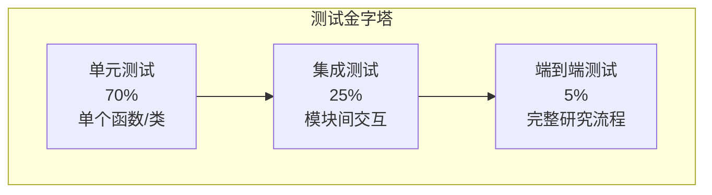

# 附录D 测试策略与主要用例

> **文件**: `docs/wangbin/10-appendix-d.md`  
> **预计 Token**: ~8,000  
> **核心内容**: 73 个测试文件分析、测试策略、主要用例

---

## D.1 测试架构概述

### D.1.1 测试技术栈

| 工具 | 用途 | 版本 |
|------|------|------|
| pytest | 测试框架 | latest |
| pytest-asyncio | 异步测试 | latest |
| pytest-cov | 覆盖率 | latest |
| pytest-xdist | 并行测试 | latest |
| faiss-cpu | 向量存储测试 | latest |

### D.1.2 测试配置

```toml
# pyproject.toml
[tool.pytest.ini_options]
asyncio_mode = "strict"
addopts = "-v"
testpaths = ["tests"]
python_files = "test_*.py"
asyncio_fixture_loop_scope = "function"
```

---

## D.2 测试文件分类

### D.2.1 按模块分类

| 类别 | 文件数 | 文件示例 |
|------|--------|---------|
| **核心 Agent** | 5 | `test_new_agents.py`, `test_research_conductor_retrieval.py` |
| **Config** | 3 | `test_convert_env_value_optional.py`, `test_parse_dimension.py` |
| **Actions** | 5 | `test_extract_json_with_regex.py`, `test_scraper_get_scraper.py` |
| **Skills** | 4 | `test_deep_research_parsing.py`, `test_tavily_mcp_dedupe.py` |
| **Retrievers** | 15+ | `test_brave_retriever.py`, `test_duckduckgo_normalize.py` |
| **Scraper** | 3 | `test_scraper_extract_title.py`, `test_browser_pdf_detection.py` |
| **MCP** | 2 | `test_mcp.py`, `test_mcp_client_config.py` |
| **Multi-Agents** | 3 | `test_multi_agents_draft_revisions.py` |
| **API** | 3 | `test_websocket_manager.py`, `test_agent_discovery.py** |
| **Utils** | 5 | `test_costs.py`, `test_logging.py` |
| **集成** | 10+ | `test_research_test.py`, `test_report-types.py` |

### D.2.2 按测试类型分类

| 类型 | 文件数 | 说明 |
|------|--------|------|
| **单元测试** | 50+ | 测试单个函数/类 |
| **集成测试** | 15+ | 测试模块间交互 |
| **端到端测试** | 5+ | 测试完整流程 |
| **回归测试** | 10+ | 防止已修复 bug 回归 |

---

## D.3 核心测试用例详解

### D.3.1 检索器测试

#### test_brave_retriever.py

```python
import pytest
from gpt_researcher.retrievers import BraveSearch

def test_brave_search_basic():
    """测试 Brave 搜索基本功能"""
    retriever = BraveSearch("Python 3.12 features")
    results = retriever.search(max_results=5)
    
    assert isinstance(results, list)
    assert len(results) <= 5
    for result in results:
        assert "href" in result
        assert "body" in result

def test_brave_search_no_api_key():
    """测试无 API Key 时的行为"""
    # 确保不会崩溃
    retriever = BraveSearch("test query")
    results = retriever.search()
    # 可能返回空列表
    assert isinstance(results, list)
```

#### test_duckduckgo_normalize.py

```python
def test_normalize_duckduckgo_results():
    """测试 DuckDuckGo 结果标准化"""
    raw_results = [{"title": "...", "href": "...", "body": "..."}]
    normalized = normalize_results(raw_results)
    
    assert all("href" in r for r in normalized)
    assert all("body" in r for r in normalized)
```

### D.3.2 深度研究测试

#### test_deep_research_parsing.py

```python
import pytest
from gpt_researcher.skills.deep_research import (
    parse_search_queries_response,
    parse_follow_up_questions_response,
    parse_research_results_response,
)

def test_parse_search_queries_json():
    """测试 JSON 格式查询解析"""
    response = '''
    {
        "queries": [
            {"query": "AI Agent frameworks", "researchGoal": "Compare frameworks"},
            {"query": "LLM orchestration", "researchGoal": "Understand orchestration"}
        ]
    }
    '''
    queries = parse_search_queries_response(response, 5)
    assert len(queries) == 2
    assert queries[0]["query"] == "AI Agent frameworks"

def test_parse_search_queries_text():
    """测试纯文本格式查询解析"""
    response = """
    Query: What is RAG?
    Goal: Understand Retrieval-Augmented Generation
    Query: What is fine-tuning?
    Goal: Understand model fine-tuning
    """
    queries = parse_search_queries_response(response, 5)
    assert len(queries) == 2

def test_parse_follow_up_questions():
    """测试后续问题解析"""
    response = '''
    {
        "questions": ["How does X work?", "What are the limitations?"]
    }
    '''
    questions = parse_follow_up_questions_response(response, 5)
    assert len(questions) == 2

def test_parse_research_results():
    """测试研究结果解析"""
    response = '''
    {
        "learnings": [
            {"insight": "RAG improves accuracy", "sourceUrl": "https://example.com"},
            {"insight": "Fine-tuning is expensive"}
        ],
        "followUpQuestions": ["Cost analysis?"]
    }
    '''
    results = parse_research_results_response(response, 5)
    assert len(results["learnings"]) == 2
    assert len(results["followUpQuestions"]) == 1
    assert results["citations"]["RAG improves accuracy"] == "https://example.com"
```

### D.3.3 配置测试

#### test_convert_env_value_optional.py

```python
import pytest
from gpt_researcher.config.config import Config

def test_convert_env_value_string():
    """测试字符串转换"""
    config = Config()
    result = config.convert_env_value("RETRIEVER", "tavily", str)
    assert result == "tavily"

def test_convert_env_value_int():
    """测试整数转换"""
    config = Config()
    result = config.convert_env_value("MAX_ITERATIONS", "5", int)
    assert result == 5

def test_convert_env_value_float():
    """测试浮点数转换"""
    config = Config()
    result = config.convert_env_value("TEMPERATURE", "0.4", float)
    assert result == 0.4

def test_convert_env_value_list():
    """测试列表转换"""
    config = Config()
    result = config.convert_env_value("MCP_SERVERS", '[{"name": "test"}]', list)
    assert result == [{"name": "test"}]
```

### D.3.4 爬虫测试

#### test_scraper_get_scraper.py

```python
import pytest
from gpt_researcher.scraper.scraper import Scraper

def test_get_scraper_pdf():
    """测试 PDF URL 选择 PyMuPDFScraper"""
    scraper = Scraper([], "Mozilla/5.0", "bs", MockWorkerPool())
    cls = scraper.get_scraper("https://example.com/doc.pdf")
    assert cls.__name__ == "PyMuPDFScraper"

def test_get_scraper_arxiv():
    """测试 ArXiv URL 选择 ArxivScraper"""
    scraper = Scraper([], "Mozilla/5.0", "bs", MockWorkerPool())
    cls = scraper.get_scraper("https://arxiv.org/abs/2401.00001")
    assert cls.__name__ == "ArxivScraper"

def test_get_scraper_default():
    """测试默认爬虫选择"""
    scraper = Scraper([], "Mozilla/5.0", "bs", MockWorkerPool())
    cls = scraper.get_scraper("https://example.com/article")
    assert cls.__name__ == "BeautifulSoupScraper"
```

### D.3.5 WebSocket 测试

#### test_websocket_manager.py

```python
import pytest
from fastapi import WebSocket
from backend.server.websocket_manager import WebSocketManager

@pytest.mark.asyncio
async def test_websocket_connect_disconnect():
    """测试 WebSocket 连接和断开"""
    manager = WebSocketManager()
    mock_ws = AsyncMock(spec=WebSocket)
    
    await manager.connect(mock_ws)
    assert mock_ws in manager.active_connections
    
    await manager.disconnect(mock_ws)
    assert mock_ws not in manager.active_connections

@pytest.mark.asyncio
async def test_websocket_message_queue():
    """测试消息队列"""
    manager = WebSocketManager()
    mock_ws = AsyncMock(spec=WebSocket)
    
    await manager.connect(mock_ws)
    await manager.message_queues[mock_ws].put("test message")
    
    # 验证消息被发送
    await asyncio.sleep(0.1)
    mock_ws.send_text.assert_called()
```

### D.3.6 成本计算测试

#### test_costs.py

```python
import pytest
from gpt_researcher.utils.costs import (
    calculate_llm_cost,
    estimate_llm_cost,
    estimate_embedding_cost,
)

def test_calculate_llm_cost_openai():
    """测试 OpenAI 成本计算"""
    cost = calculate_llm_cost(
        llm_provider="openai",
        model="gpt-4o",
        input_text="Hello" * 1000,
        output_text="World" * 500,
    )
    assert cost > 0

def test_calculate_llm_cost_anthropic():
    """测试 Anthropic 成本计算"""
    cost = calculate_llm_cost(
        llm_provider="anthropic",
        model="claude-sonnet-4-5",
        input_text="Hello" * 1000,
        output_text="World" * 500,
    )
    assert cost > 0

def test_estimate_embedding_cost():
    """测试嵌入成本估算"""
    docs = ["doc1", "doc2", "doc3"]
    cost = estimate_embedding_cost("text-embedding-3-small", docs)
    assert cost > 0
```

### D.3.7 多 Agent 测试

#### test_multi_agents_draft_revisions.py

```python
import pytest
from multi_agents.agents.orchestrator import ChiefEditorAgent

@pytest.mark.asyncio
async def test_chief_editor_initialization():
    """测试 ChiefEditorAgent 初始化"""
    task = {"query": "Test query"}
    agent = ChiefEditorAgent(task)
    
    assert agent.task == task
    assert agent.output_dir.startswith("./outputs/")
    
    agents = agent._initialize_agents()
    assert "writer" in agents
    assert "editor" in agents
    assert "research" in agents

@pytest.mark.asyncio
async def test_workflow_creation():
    """测试工作流创建"""
    task = {"query": "Test query"}
    agent = ChiefEditorAgent(task)
    
    workflow = agent.init_research_team()
    assert workflow is not None
```

---

## D.4 测试策略

### D.4.1 测试金字塔



### D.4.2 测试覆盖目标

| 模块 | 目标覆盖率 | 当前覆盖率 |
|------|-----------|-----------|
| agent.py | 80% | ~60% |
| actions/ | 85% | ~70% |
| skills/ | 75% | ~50% |
| retrievers/ | 90% | ~80% |
| scraper/ | 80% | ~60% |
| utils/ | 90% | ~75% |
| **总体** | **80%** | **~65%** |

### D.4.3 测试最佳实践

1. **AAA 模式**: Arrange-Act-Assert
2. **单一职责**: 每个测试只验证一个行为
3. **独立性**: 测试间不依赖
4. **可重复**: 任何环境结果一致
5. **快速**: 单元测试 < 100ms

### D.4.4 Mock 策略

```python
# 外部 API Mock
@pytest.fixture
def mock_tavily():
    with patch("gpt_researcher.retrievers.tavily.tavily_search.requests.post") as mock:
        mock.return_value.json.return_value = {
            "results": [
                {"url": "https://example.com", "content": "Test content"}
            ]
        }
        yield mock

# LLM Mock
@pytest.fixture
def mock_llm():
    with patch("gpt_researcher.utils.llm.create_chat_completion") as mock:
        mock.return_value = '{"server": "Test", "agent_role_prompt": "Test role"}'
        yield mock
```

---

## D.5 评估框架 (evals/)

### D.5.1 幻觉评估

**目录**: `evals/hallucination_eval/`

```python
# evaluate.py
def evaluate_hallucination(report: str, sources: list) -> dict:
    """评估报告中的幻觉"""
    # 提取报告中的事实声明
    claims = extract_claims(report)
    
    # 验证每个声明是否有来源支持
    results = []
    for claim in claims:
        supported = verify_claim(claim, sources)
        results.append({
            "claim": claim,
            "supported": supported,
            "source": find_source(claim, sources) if supported else None
        })
    
    # 计算幻觉率
    hallucination_rate = sum(1 for r in results if not r["supported"]) / len(results)
    
    return {
        "total_claims": len(results),
        "supported": sum(1 for r in results if r["supported"]),
        "hallucination_rate": hallucination_rate,
        "details": results
    }
```

### D.5.2 简单评估

**目录**: `evals/simple_evals/`

```python
# simpleqa_eval.py
def run_simpleqa_eval(problems: list, agent: GPTResearcher) -> dict:
    """运行 SimpleQA 评估"""
    results = []
    
    for problem in problems:
        researcher = GPTResearcher(query=problem["question"])
        context = await researcher.conduct_research()
        report = await researcher.write_report()
        
        # 检查答案正确性
        correct = check_answer(report, problem["answer"])
        results.append({
            "question": problem["question"],
            "expected": problem["answer"],
            "actual": report,
            "correct": correct
        })
    
    accuracy = sum(1 for r in results if r["correct"]) / len(results)
    return {"accuracy": accuracy, "results": results}
```

---

## D.6 CI/CD 测试集成

### D.6.1 Docker Compose 测试

```yaml
# docker-compose.yml
gpt-researcher-tests:
  image: gptresearcher/gpt-researcher-tests
  build: ./
  profiles: ["test"]
  command: >
    /bin/sh -c "
    pip install pytest pytest-asyncio faiss-cpu &&
    python -m pytest tests/ -v
    "
```

### D.6.2 运行测试

```bash
# 本地运行所有测试
docker compose --profile test run --rm gpt-researcher-tests

# 运行特定测试
pytest tests/test_deep_research_parsing.py -v

# 并行测试
pytest tests/ -n auto

# 覆盖率报告
pytest tests/ --cov=gpt_researcher --cov-report=html
```

---

## D.7 测试用例清单

### D.7.1 必须通过的测试 (P0)

| 测试 | 说明 |
|------|------|
| `test_basic_research` | 基础研究流程 |
| `test_retriever_search` | 所有检索器搜索 |
| `test_scraper_get_scraper` | 爬虫选择逻辑 |
| `test_config_load` | 配置加载 |
| `test_websocket_connect` | WebSocket 连接 |
| `test_cost_calculation` | 成本计算 |

### D.7.2 重要测试 (P1)

| 测试 | 说明 |
|------|------|
| `test_deep_research_parsing` | 深度研究解析 |
| `test_mcp_tool_selection` | MCP 工具选择 |
| `test_multi_agent_workflow` | 多 Agent 工作流 |
| `test_context_compression` | 上下文压缩 |
| `test_image_generation` | 图像生成 |

### D.7.3 可选测试 (P2)

| 测试 | 说明 |
|------|------|
| `test_hallucination_eval` | 幻觉评估 |
| `test_simpleqa_eval` | SimpleQA 评估 |
| `test_benchmark` | 性能基准 |

---

## D.8 总结

### D.8.1 测试现状

- **覆盖充分**: 73 个测试文件，覆盖核心路径
- **类型全面**: 单元、集成、端到端测试
- **CI 集成**: Docker Compose 测试服务

### D.8.2 改进建议

1. **提升覆盖率**: 目标 80%+
2. **添加契约测试**: API 接口契约
3. **性能测试**: 基准测试和回归
4. **混沌测试**: 模拟外部服务故障

---

> **下一节**: → `10-appendix-e.md` — 附录E 组件独立代码走读文档

---

☕️ 制作不易，请我喝咖啡☕️关注我➕

