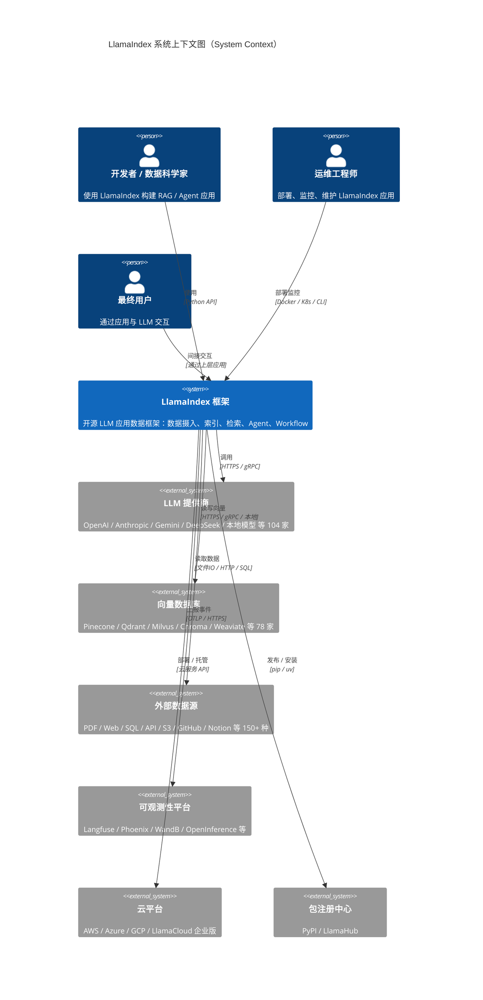
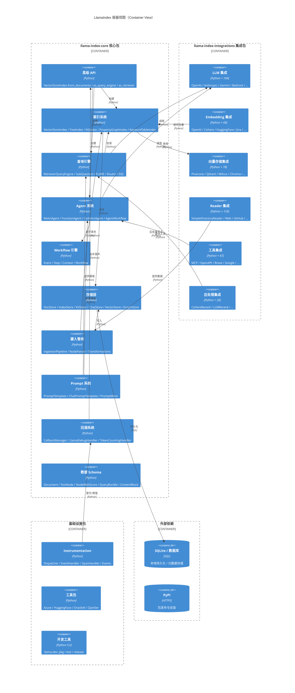
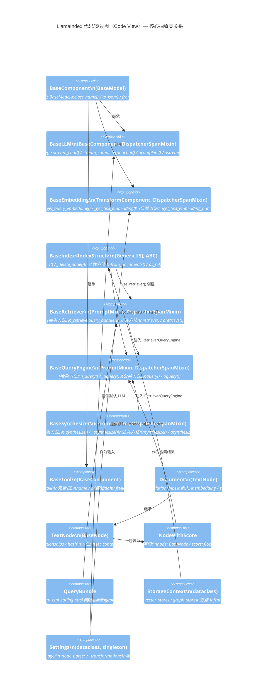

# 第 2 章：C4 架构模型

> 本章使用 C4 模型（Context / Container / Component / Code）从四个抽象层级完整描述 LlamaIndex 的系统架构。每个层级均包含 Mermaid 图表和详细文字解释。

---

## 2.1 Context 图（System Context）

### 2.1.1 Mermaid 图表



### 2.1.2 详细解释

Context 图展示了 LlamaIndex 作为系统与外部实体之间的**最高层关系**。LlamaIndex 不是一个独立运行的应用程序，而是一个 **嵌入在用户应用中的框架**，它连接了开发者、外部服务与最终用户。

#### 系统边界

- **系统名称**: LlamaIndex 框架
- **系统类型**: 开源 Python 框架（库），不是独立服务
- **核心价值**: 在 LLM 与外部数据之间架设桥梁

#### 外部角色（Persona）

1. **开发者 / 数据科学家**: 直接使用 LlamaIndex Python API 构建 RAG 管线、Agent 应用。他们是框架的主要用户。
2. **运维工程师**: 负责将基于 LlamaIndex 构建的应用部署到生产环境，配置监控、日志、告警。
3. **最终用户**: 不直接接触 LlamaIndex，而是通过上层应用（Chatbot、知识库问答系统等）间接使用。

#### 外部系统

| 外部系统 | 数量 | 与 LlamaIndex 的关系 |
|----------|------|---------------------|
| **LLM 提供商** | 104 家 | LlamaIndex 通过 `BaseLLM` 抽象层调用各提供商的 API（HTTPS/gRPC），执行推理、对话、函数调用 |
| **向量数据库** | 78 家 | LlamaIndex 通过 `BasePydanticVectorStore` 抽象层读写向量，支持语义检索 |
| **外部数据源** | 150+ 种 | LlamaIndex 通过 Reader 生态从各种来源摄入数据（文件、网页、API、数据库等） |
| **可观测性平台** | 12+ 家 | LlamaIndex 通过 Instrumentation/Callback 系统上报事件、Span、指标 |
| **云平台** | AWS/Azure/GCP/LlamaCloud | 托管部署、企业版服务 |
| **包注册中心** | PyPI / LlamaHub | 包的发布与安装 |

#### 设计 Rationale

将 LlamaIndex 定位为**框架而非服务**的决策基于以下考量：
- **灵活性**: 框架可以嵌入任何应用（Flask/FastAPI/Streamlit/Docker）
- **无状态**: 框架本身不持有状态，状态由 Storage 层管理
- **可组合**: 用户可以选择只使用其中一部分（如只用 Index，不用 Agent）
- **零部署成本**: 不需要额外的服务进程，降低运维复杂度

---

## 2.2 Container 图（Container View）

### 2.2.1 Mermaid 图表



### 2.2.2 详细解释

Container 图展示了 LlamaIndex 的**顶层模块划分**，即 Monorepo 中各个包的职责边界和交互方式。

#### 核心包（llama-index-core）

核心包是 LlamaIndex 的心脏，包含所有抽象层和默认实现：

| 容器 | 职责 | 关键类 |
|------|------|--------|
| **高级 API** | 面向用户的入口 | `VectorStoreIndex`, `SimpleDirectoryReader`, `Settings` |
| **索引系统** | 7 种索引结构 | `VectorStoreIndex`, `TreeIndex`, `PropertyGraphIndex` |
| **查询引擎** | 检索 + 合成 | `RetrieverQueryEngine`, `SubQuestionQueryEngine` |
| **Agent 系统** | 多步推理 | `ReActAgent`, `FunctionAgent`, `AgentWorkflow` |
| **Workflow 引擎** | 事件驱动工作流 | `Workflow`, `Context`, `Event`, `step` |
| **存储层** | 持久化抽象 | `StorageContext`, `DocStore`, `IndexStore`, `KVStore` |
| **摄入管线** | 数据转换链 | `IngestionPipeline`, `SentenceSplitter` |
| **Prompt 系统** | 模板管理 | `PromptTemplate`, `PromptMixin` |
| **回调系统** | 事件通知 | `CallbackManager`, `LlamaDebugHandler` |
| **数据 Schema** | 核心数据结构 | `Document`, `TextNode`, `NodeWithScore` |

#### 集成包（llama-index-integrations）

集成包是 LlamaIndex 的**生态护城河**，每个集成都遵循统一的契约：
- 继承核心包中的 `Base*` 抽象类
- 实现抽象方法
- 在 `pyproject.toml` 中注册 `[tool.llamahub]`
- 提供 `class_name()` 用于序列化

#### 基础设施包

| 容器 | 职责 |
|------|------|
| **Instrumentation** | 新一代可观测性系统（Dispatcher + Span + Event） |
| **工具包** | 特定云/平台工具（Azure / HuggingFace / OracleAI / Qianfan） |
| **开发工具** | `llama-dev` CLI：包管理、测试编排、发布流程 |

#### 关键交互流

1. **数据摄入流**: `Reader` → `IngestionPipeline` → `NodeParser` → `Embedding` → `VectorStore` + `DocStore`
2. **查询流**: `QueryEngine` → `Retriever` → `Index` → `VectorStore` → `NodeWithScore` → `Postprocessor` → `Synthesizer` → `LLM`
3. **Agent 流**: `AgentWorkflow` → `Workflow` → `LLM` → `Tool` → 循环
4. **持久化流**: `StorageContext` → `DocStore/IndexStore/KVStore` → SQLite/数据库

---

## 2.3 Component 图（Component View）

### 2.3.1 Mermaid 图表

```mermaid
C4Component
    title LlamaIndex 组件视图（Component View）— 核心包内部

    Container_Boundary(core, "llama-index-core") {

        Component_Boundary(llm_comp, "LLM 抽象层") {
            Component(basellm, "BaseLLM", "抽象基类：chat/complete/stream_chat/stream_complete")
            Component(llmclass, "LLM", "通用 LLM：system_prompt/output_parser/structured_predict")
            Component(structllm, "StructuredLLM", "结构化输出 LLM 包装器")
            Component(fcallllm, "FunctionCallingLLM", "函数调用 LLM 基类")
        }

        Component_Boundary(emb_comp, "Embedding 抽象层") {
            Component(baseemb, "BaseEmbedding", "抽象基类：get_query_embedding/get_text_embedding_batch")
            Component(multimemb, "MultiModalEmbedding", "多模态 Embedding")
            Component(pooling, "Pooling", "池化策略")
        }

        Component_Boundary(idx_comp, "索引层") {
            Component(baseidx, "BaseIndex<IndexStruct>", "抽象基类：from_documents/as_retriever/as_query_engine")
            Component(vsidx, "VectorStoreIndex", "向量索引：IndexDict + VectorStore")
            Component(tidx, "TreeIndex", "树索引：自底向上聚类")
            Component(kidx, "KeywordTableIndex", "关键词表索引")
            Component(kgidx, "PropertyGraphIndex", "属性图索引")
            Component(lidx, "ListIndex", "列表/摘要索引")
        }

        Component_Boundary(ret_comp, "检索层") {
            Component(baseret, "BaseRetriever", "抽象基类：retrieve/aretrieve")
            Component(vret, "VectorIndexRetriever", "向量检索器")
            Component(amret, "AutoMergingRetriever", "自动合并检索器")
            Component(fret, "QueryFusionRetriever", "融合检索器")
            Component(rret, "RecursiveRetriever", "递归检索器")
            Component(rtret, "RouterRetriever", "路由检索器")
        }

        Component_Boundary(qe_comp, "查询引擎层") {
            Component(bqe, "BaseQueryEngine", "抽象基类：query/aquery")
            Component(rqe, "RetrieverQueryEngine", "检索+合成引擎")
            Component(sqe, "SubQuestionQueryEngine", "子问题分解引擎")
            Component(fqe, "FLAREQueryEngine", "FLARE 前瞻引擎")
            Component(rtqe, "RouterQueryEngine", "路由查询引擎")
            Component(cqe, "CitationQueryEngine", "引用查询引擎")
        }

        Component_Boundary(syn_comp, "响应合成层") {
            Component(basesyn, "BaseSynthesizer", "抽象基类：synthesize/asynthesize")
            Component(treesyn, "TreeSummarize", "树形摘要")
            Component(refinesyn, "CompactAndRefine", "紧凑精炼")
            Component(accumsyn, "Accumulate", "累积合成")
        }

        Component_Boundary(ag_comp, "Agent 层") {
            Component(bagent, "BaseWorkflowAgent", "抽象 Agent：take_step/finalize")
            Component(react, "ReActAgent", "ReAct 推理 Agent")
            Component(fagent, "FunctionAgent", "函数调用 Agent")
            Component(cagent, "CodeActAgent", "代码执行 Agent")
            Component(awf, "AgentWorkflow", "多 Agent 工作流")
        }

        Component_Boundary(wf_comp, "Workflow 层") {
            Component(workflow, "Workflow", "工作流引擎")
            Component(wfctx, "Context", "工作流上下文")
            Component(event, "Event", "事件基类")
            Component(wfstep, "@step", "步骤装饰器")
        }

        Component_Boundary(st_comp, "存储层") {
            Component(sctx, "StorageContext", "存储上下文")
            Component(docstore, "BaseDocumentStore", "文档存储")
            Component(idxstore, "BaseIndexStore", "索引存储")
            Component(kvstore, "BaseKVStore", "KV 存储")
            Component(chatstore, "BaseChatStore", "对话存储")
        }

        Component_Boundary(ing_comp, "摄入层") {
            Component(pipeline, "IngestionPipeline", "摄入管线")
            Component(nodeparser, "NodeParser", "节点解析器")
            Component(transform, "TransformComponent", "转换组件")
            Component(cache, "IngestionCache", "摄入缓存")
        }

        Component_Boundary(cb_comp, "回调/可观测层") {
            Component(cbm, "CallbackManager", "回调管理器")
            Component(disp, "Dispatcher", "事件派发器")
            Component(span, "Span", "调用链 Span")
        }
    }

    Rel(basellm, llmclass, "继承")
    Rel(llmclass, structllm, "包装")
    Rel(llmclass, fcallllm, "继承")
    Rel(baseemb, multimemb, "继承")
    Rel(baseidx, vsidx, "继承")
    Rel(baseidx, tidx, "继承")
    Rel(baseidx, kgidx, "继承")
    Rel(baseret, vret, "继承")
    Rel(bqe, rqe, "继承")
    Rel(bqe, sqe, "继承")
    Rel(basesyn, treesyn, "继承")
    Rel(bagent, react, "继承")
    Rel(bagent, fagent, "继承")
    Rel(workflow, bagent, "Agent 基于 Workflow")
    Rel(rqe, baseret, "组合")
    Rel(rqe, basesyn, "组合")
    Rel(vsidx, baseemb, "使用")
    Rel(vsidx, docstore, "使用")
    Rel(pipeline, nodeparser, "使用")
    Rel(pipeline, transform, "使用")
    Rel(sctx, docstore, "组合")
    Rel(sctx, idxstore, "组合")
    Rel(cbm, disp, "演进为")
```

### 2.3.2 详细解释

Component 图展示了核心包内部的**组件划分、继承关系和组合关系**。LlamaIndex 的架构精髓在于其**清晰的分层抽象**。

#### 继承体系（Is-A 关系）

LlamaIndex 的每个核心概念都有一个**抽象基类**和**多个具体实现**：

1. **LLM 继承链**: `BaseComponent → BaseLLM → LLM → FunctionCallingLLM → OpenAI/Anthropic/...`
2. **Index 继承链**: `BaseIndex<IndexStruct> → VectorStoreIndex/TreeIndex/PropertyGraphIndex/...`
3. **Retriever 继承链**: `BaseRetriever → VectorIndexRetriever/AutoMergingRetriever/...`
4. **QueryEngine 继承链**: `BaseQueryEngine → RetrieverQueryEngine/SubQuestionQueryEngine/...`
5. **Synthesizer 继承链**: `BaseSynthesizer → TreeSummarize/CompactAndRefine/...`
6. **Agent 继承链**: `Workflow + BaseModel → BaseWorkflowAgent → ReActAgent/FunctionAgent/...`

#### 组合关系（Has-A 关系）

- `RetrieverQueryEngine` **组合**了 `BaseRetriever` + `BaseSynthesizer` + `NodePostprocessors`
- `VectorStoreIndex` **使用** `BaseEmbedding` + `BaseDocumentStore` + `BasePydanticVectorStore`
- `StorageContext` **组合**了 `DocStore` + `IndexStore` + `KVStore` + `VectorStores` + `GraphStore`
- `IngestionPipeline` **使用** `NodeParser` + `TransformComponent` + `IngestionCache`

#### 设计 Rationale

1. **依赖倒置**: 高层模块（QueryEngine）依赖抽象（BaseRetriever），不依赖具体实现
2. **开闭原则**: 新增 LLM/VectorStore/Reader 只需继承基类，无需修改核心代码
3. **单一职责**: 每个组件只负责一件事（Index 管存储、Retriever 管检索、Synthesizer 管合成）
4. **可测试性**: 每个抽象都可以被 Mock，便于单元测试

---

## 2.4 Code 图（Code / Class View）

### 2.4.1 Mermaid 图表



### 2.4.2 核心类详细走读

#### 2.4.2.1 BaseComponent（`schema.py`）

`BaseComponent` 是所有 LlamaIndex 组件的根类，继承自 Pydantic `BaseModel`：

```python
class BaseComponent(BaseModel):
    @classmethod
    def class_name(cls) -> str:
        return "base_component"

    @model_serializer(mode="wrap")
    def custom_model_dump(self, handler, info):
        data = handler(self)
        data["class_name"] = self.class_name()
        return data
```

**设计要点**：
- `class_name()` 作为序列化的唯一 ID，即使类名改变也不影响反序列化
- `custom_model_dump` 自动注入 `class_name` 字段
- `__get_pydantic_json_schema__` 在 JSON Schema 中注入 `class_name`

#### 2.4.2.2 BaseLLM（`base/llms/base.py`）

`BaseLLM` 定义了 LLM 的 8 个核心方法（4 同步 + 4 异步）：

| 方法 | 同步 | 异步 |
|------|------|------|
| 对话 | `chat(messages)` | `achat(messages)` |
| 补全 | `complete(prompt)` | `acomplete(prompt)` |
| 流式对话 | `stream_chat(messages)` | `astream_chat(messages)` |
| 流式补全 | `stream_complete(prompt)` | `astream_complete(prompt)` |

**关键属性**：
- `metadata: LLMMetadata` — 上下文窗口、是否 Chat 模型、是否支持函数调用
- `callback_manager: CallbackManager` — 回调管理

#### 2.4.2.3 BaseIndex（`indices/base.py`）

`BaseIndex` 是泛型抽象类，参数化类型为 `IndexStruct`：

```python
class BaseIndex(Generic[IS], ABC):
    index_struct_cls: Type[IS]

    def from_documents(cls, documents) -> IndexType: ...
    def as_retriever(**kwargs) -> BaseRetriever: ...
    def as_query_engine(llm, **kwargs) -> BaseQueryEngine: ...
    def as_chat_engine(chat_mode, **kwargs) -> BaseChatEngine: ...
    def insert_nodes(nodes) -> None: ...
    def delete_ref_doc(ref_doc_id) -> None: ...
```

**三种转换方法**是 LlamaIndex 的核心设计理念：
- `as_retriever()` → 检索模式
- `as_query_engine()` → 单次问答模式
- `as_chat_engine()` → 多轮对话模式

#### 2.4.2.4 StorageContext（`storage/storage_context.py`）

`StorageContext` 是存储层的统一入口：

```python
@dataclass
class StorageContext:
    docstore: BaseDocumentStore
    index_store: BaseIndexStore
    vector_stores: Dict[str, BasePydanticVectorStore]
    graph_store: GraphStore
    property_graph_store: Optional[PropertyGraphStore]

    @classmethod
    def from_defaults(cls, ...) -> StorageContext: ...
    def persist(self, persist_dir) -> None: ...
```

#### 2.4.2.5 Settings（`settings.py`）

`Settings` 是全局单例配置，使用 lazy initialization：

```python
@dataclass
class _Settings:
    _llm: Optional[LLM] = None
    _embed_model: Optional[BaseEmbedding] = None
    _callback_manager: Optional[CallbackManager] = None
    _node_parser: Optional[NodeParser] = None
    _transformations: Optional[List[TransformComponent]] = None

    @property
    def llm(self) -> LLM:
        if self._llm is None:
            self._llm = resolve_llm("default")
        return self._llm

Settings = _Settings()
```

**设计要点**：
- 全局唯一实例 `Settings`
- 首次访问时 lazy 初始化
- 支持 `Settings.llm = "openai"` 字符串快捷设置

---

## 2.5 架构设计原则总结

| 原则 | 体现 |
|------|------|
| **依赖倒置** | 高层依赖抽象（BaseRetriever），不依赖具体实现 |
| **开闭原则** | 新增集成只需继承基类，核心代码无需修改 |
| **单一职责** | Index/Retriever/Synthesizer 各司其职 |
| **接口隔离** | BaseLLM 只定义 LLM 相关方法，BaseEmbedding 只定义 Embedding 方法 |
| **里氏替换** | 任何 BaseLLM 子类都可以替换父类使用 |
| **组合优于继承** | RetrieverQueryEngine 组合 Retriever + Synthesizer |
| **模板方法** | BaseIndex.from_documents() 定义骨架，子类实现 _build_index_from_nodes() |
| **策略模式** | Retriever/Synthesizer/NodeParser 都是可替换策略 |

---

## 2.6 小结

通过 C4 模型的四个层级，我们完整地剖析了 LlamaIndex 的架构：

- **Context 图**: LlamaIndex 作为框架连接 LLM 提供商、向量数据库、数据源、可观测平台
- **Container 图**: Monorepo 结构，核心包 + 集成包 + 基础设施包
- **Component 图**: 清晰的分层抽象（LLM/Index/Retriever/QueryEngine/Agent/Workflow/Storage）
- **Code 图**: 基于 Pydantic 的类继承体系，BaseComponent 为根，Base* 为抽象，具体类为实现

在下一章中，我们将深入到系统的动态行为，通过流程图和时序图展示核心业务流程。

---

# ❤️ 制作不易，请我喝咖啡☕️关注我➕

