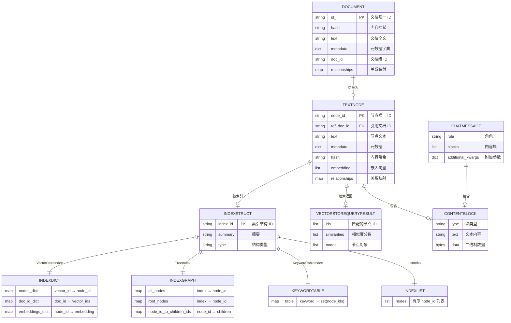

# 第 7 章：数据模型与数据库设计

> 本章详细描述 LlamaIndex 的核心数据模型，包括 ER 图、主要表/集合结构、字段说明、索引、约束、缓存策略、事务设计和数据流向。

---

## 7.1 ER 图（实体关系图）

### 7.1.1 Mermaid ER 图



### 7.1.2 核心实体说明

| 实体 | 说明 | 存储位置 |
|------|------|----------|
| **Document** | 原始文档（摄入前） | DocStore |
| **TextNode** | 文档切片（索引最小单元） | DocStore + VectorStore |
| **IndexStruct** | 索引结构元数据 | IndexStore |
| **ChatMessage** | 对话消息 | ChatMemoryBuffer |
| **ContentBlock** | 内容块（文本/图像/音频等） | ChatMessage.blocks |

---

## 7.2 主要表/集合详细结构

### 7.2.1 Document（文档）

**文件**: `llama-index-core/llama_index/core/schema.py`

```python
class Document(TextNode):
    """文档类——摄入前的原始数据容器"""
    id_: str = Field(default_factory=lambda: str(uuid4()))
    text: str = ""
    metadata: Dict[str, Any] = {}
    metadata_seperator: str = "\n"
    text_template: str = "{metadata_str}\n\n{content}"
    metadata_template: str = "{key}: {value}"
    excluded_llm_metadata_keys: List[str] = []
    excluded_embed_metadata_keys: List[str] = []
    relationships: Dict[NodeRelationship, RelatedNodeInfo] = {}
```

**字段说明**:

| 字段 | 类型 | 说明 |
|------|------|------|
| `id_` | `str` | 文档唯一 ID（UUID4） |
| `text` | `str` | 文档全文内容 |
| `metadata` | `Dict[str, Any]` | 元数据字典（作者、日期、来源等） |
| `metadata_seperator` | `str` | 元数据分隔符（默认 `\n`） |
| `text_template` | `str` | 文本模板（控制 LLM 看到的格式） |
| `metadata_template` | `str` | 元数据模板 |
| `excluded_llm_metadata_keys` | `List[str]` | 排除在 LLM 之外的元数据键 |
| `excluded_embed_metadata_keys` | `List[str]` | 排除在 Embedding 之外的元数据键 |
| `relationships` | `Dict[NodeRelationship, RelatedNodeInfo]` | 节点关系（父子、前后、引用等） |

**关系类型** (`NodeRelationship`):
- `PARENT`: 父节点
- `CHILD`: 子节点
- `PREVIOUS`: 前一个节点
- `NEXT`: 后一个节点
- `SOURCE`: 源文档
- `RELATED`: 相关节点

### 7.2.2 TextNode（文本节点）

```python
class TextNode(BaseNode):
    text: str = ""
    metadata: Dict[str, Any] = {}
    relationships: Dict[NodeRelationship, RelatedNodeInfo] = {}
    hash: Optional[str] = None
    embedding: Optional[List[float]] = None
    excluded_embed_metadata_keys: List[str] = []
    excluded_llm_metadata_keys: List[str] = []
    metadata_separator: str = "\n"
    text_template: str = "{metadata_str}\n\n{content}"
    metadata_template: str = "{key}: {value}"
```

**与 Document 的区别**:
- `TextNode` 是 Document 切分后的结果
- 包含 `embedding` 字段（向量）
- 包含 `ref_doc_id` 字段（引用源文档）
- 包含 `hash` 字段（内容哈希，用于去重）

### 7.2.3 NodeWithScore（带评分的节点）

```python
class NodeWithScore(BaseNode):
    node: SerializeAsAny[BaseNode]
    score: Optional[float] = None
```

**用途**: 检索结果包装，包含相似度评分。

### 7.2.4 IndexStruct 体系

**文件**: `llama-index-core/llama_index/core/data_structs/data_structs.py`

#### IndexDict（向量索引结构）

```python
@dataclass
class IndexDict(IndexStruct):
    nodes_dict: Dict[str, str] = {}  # vector_id → node_id
    doc_id_dict: Dict[str, List[str]] = {}  # doc_id → vector_ids (deprecated)
    embeddings_dict: Dict[str, List[float]] = {}  # node_id → embedding (deprecated)
```

**字段说明**:
- `nodes_dict`: 向量存储 ID 到节点 ID 的映射
- `doc_id_dict`: 文档 ID 到向量 ID 列表的映射（已弃用）
- `embeddings_dict`: 节点 ID 到嵌入向量的映射（已弃用）

#### IndexGraph（树索引结构）

```python
@dataclass
class IndexGraph(IndexStruct):
    all_nodes: Dict[int, str] = {}  # index → node_id
    root_nodes: Dict[int, str] = {}  # index → node_id (根节点)
    node_id_to_children_ids: Dict[str, List[str]] = {}  # node_id → children
```

**字段说明**:
- `all_nodes`: 所有节点的索引映射
- `root_nodes`: 根节点映射（顶层摘要）
- `node_id_to_children_ids`: 父子关系映射

#### KeywordTable（关键词表结构）

```python
@dataclass
class KeywordTable(IndexStruct):
    table: Dict[str, Set[str]] = {}  # keyword → set(node_ids)
```

#### IndexList（列表结构）

```python
@dataclass
class IndexList(IndexStruct):
    nodes: List[str] = []  # 有序 node_id 列表
```

#### IndexLPG（属性图结构）

```python
@dataclass
class IndexLPG(IndexStruct):
    """属性图索引结构（不存储数据，数据在 PropertyGraphStore 中）"""
    pass
```

#### KG（知识图谱结构）

```python
@dataclass
class KG(IndexStruct):
    table: Dict[str, Set[str]] = {}  # keyword → set(node_ids)
    rel_map: Dict[str, List[List[str]]] = {}  # 关系映射 (deprecated)
    embedding_dict: Dict[str, List[float]] = {}  # 嵌入字典
```

### 7.2.5 ChatMessage（对话消息）

```python
class ChatMessage(BaseModel):
    role: MessageRole
    blocks: List[BaseContentBlock] = Field(default_factory=list)
    additional_kwargs: Dict[str, Any] = {}
    metadata: Optional[Dict[str, Any]] = None
```

**MessageRole 枚举**:
- `SYSTEM`: 系统消息
- `DEVELOPER`: 开发者消息
- `USER`: 用户消息
- `ASSISTANT`: 助手消息
- `FUNCTION`: 函数消息
- `TOOL`: 工具消息
- `CHATBOT`: 聊天机器人消息
- `MODEL`: 模型消息

### 7.2.6 ContentBlock 体系

```python
class BaseContentBlock(ABC):
    """内容块基类"""

class TextBlock(BaseContentBlock):
    text: str

class ImageBlock(BaseContentBlock):
    url: Optional[AnyUrl] = None
    image: Optional[bytes] = None
    image_mimetype: Optional[str] = None
    detail: Optional[str] = None

class AudioBlock(BaseContentBlock):
    url: Optional[AnyUrl] = None
    audio: Optional[bytes] = None

class VideoBlock(BaseContentBlock):
    url: Optional[AnyUrl] = None
    video: Optional[bytes] = None

class DocumentBlock(BaseContentBlock):
    data: Optional[bytes] = None
    url: Optional[AnyUrl] = None

class ThinkingBlock(BaseContentBlock):
    content: str
    thinking: str

class CachePoint(BaseContentBlock):
    config: Optional[CachePointConfig] = None
```

### 7.2.7 QueryBundle（查询封装）

```python
class QueryBundle(BaseModel):
    query_str: str
    custom_embedding_strs: Optional[List[str]] = None
    embedding: Optional[List[float]] = None
    embedding_image_assets: Optional[List[ImageNode]] = None
```

---

## 7.3 存储层详细设计

### 7.3.1 DocStore（文档存储）

**文件**: `llama-index-core/llama_index/core/storage/docstore/`

**BaseDocumentStore 接口**:

```python
class BaseDocumentStore(BaseModel):
    docs: Dict[str, BaseNode] = Field(default_factory=dict)

    def add_documents(self, docs, store_text=True, allow_update=False): ...
    def get_document(self, doc_id, raise_error=True) -> Optional[BaseNode]: ...
    def delete_document(self, doc_id, raise_error=True): ...
    def get_all_document_hashes(self) -> Dict[str, str]: ...
    def set_document_hashes(self, doc_hashes): ...
    def get_document_hash(self, doc_id) -> Optional[str]: ...
    def set_document_hash(self, doc_id, doc_hash): ...
```

**SimpleDocumentStore 实现**:
- 基于 `SimpleKVStore`（内存字典）
- 持久化格式: JSON 文件
- 键: `doc_id`, 值: `BaseNode.model_dump()`

**持久化结构**:
```json
{
  "docstore/metadata": {
    "doc_id_1": {"id_": "...", "hash": "...", "text": "...", "metadata": {...}},
    "doc_id_2": {...}
  },
  "docstore/data": {
    "doc_id_1": {"class_name": "TextNode", ...},
    "doc_id_2": {...}
  },
  "docstore/ref_doc_info": {
    "doc_id_1": {"node_ids": [...], "metadata": {...}}
  }
}
```

### 7.3.2 IndexStore（索引存储）

**BaseIndexStore 接口**:

```python
class BaseIndexStore(BaseModel):
    def add_index_struct(self, index_struct: IndexStruct): ...
    def get_index_struct(self, struct_id=None) -> Optional[IndexStruct]: ...
    def delete_index_struct(self, struct_id): ...
    def get_all_index_structs(self) -> Dict[str, IndexStruct]: ...
```

**SimpleIndexStore 实现**:
- 基于 `SimpleKVStore`
- 键: `index_id`, 值: `IndexStruct.to_dict()`

### 7.3.3 KVStore（KV 存储）

**BaseKVStore 接口**:

```python
class BaseKVStore(BaseModel, ABC):
    @abstractmethod
    def put(self, key, val, collection=None): ...
    @abstractmethod
    async def aput(self, key, val, collection=None): ...
    @abstractmethod
    def get(self, key, collection=None): ...
    @abstractmethod
    async def aget(self, key, collection=None): ...
    @abstractmethod
    def get_all(self, collection=None): ...
    @abstractmethod
    def delete(self, key, collection=None): ...
```

**SimpleKVStore 实现**:
- 数据结构: `Dict[str, Dict[str, dict]]`（collection → key → value）
- 持久化: JSON 文件
- 支持多 collection（命名空间隔离）

### 7.3.4 VectorStore（向量存储）

**BasePydanticVectorStore 接口**:

```python
class BasePydanticVectorStore(BaseComponent):
    @abstractmethod
    def add(self, nodes: List[BaseNode]) -> List[str]: ...
    @abstractmethod
    def delete(self, ref_doc_id: str, **kwargs): ...
    @abstractmethod
    def delete_nodes(self, node_ids: List[str], **kwargs): ...
    @abstractmethod
    def query(self, query: VectorStoreQuery, **kwargs) -> VectorStoreQueryResult: ...
    @property
    def stores_text() -> bool: ...
    @property
    def client(self): ...
```

**VectorStoreQuery 结构**:

```python
class VectorStoreQuery(BaseModel):
    query_embedding: List[float]
    similarity_top_k: int = 1
    node_ids: Optional[List[str]] = None
    doc_ids: Optional[List[str]] = None
    query_str: Optional[str] = None
    mode: VectorStoreQueryMode = VectorStoreQueryMode.DEFAULT
    alpha: Optional[float] = None
    filters: Optional[MetadataFilters] = None
```

**VectorStoreQueryResult 结构**:

```python
@dataclass
class VectorStoreQueryResult:
    nodes: Optional[Sequence[BaseNode]] = None
    similarities: Optional[List[float]] = None
    ids: Optional[List[str]] = None
```

**FilterOperator 枚举**:
- `EQ`: 等于（默认）
- `GT` / `LT` / `GTE` / `LTE`: 比较
- `NE`: 不等于
- `IN` / `NIN`: 在/不在数组中
- `ANY` / `ALL`: 包含任意/全部
- `TEXT_MATCH` / `TEXT_MATCH_INSENSITIVE`: 全文匹配

### 7.3.5 ChatStore（对话存储）

**BaseChatStore 接口**:

```python
class BaseChatStore(BaseModel):
    @abstractmethod
    def set_messages(self, key, messages): ...
    @abstractmethod
    def get_messages(self, key) -> List[ChatMessage]: ...
    @abstractmethod
    def add_message(self, key, message): ...
    @abstractmethod
    def delete_messages(self, key): ...
    @abstractmethod
    def delete_message(self, key, idx): ...
```

**SimpleChatStore 实现**: 基于内存字典。

**持久化实现**: PostgresChatStore, RedisChatStore, MongoDBChatStore 等。

---

## 7.4 缓存策略

### 7.4.1 IngestionCache（摄入缓存）

**文件**: `llama-index-core/llama_index/core/ingestion/cache.py`

```python
class IngestionCache(BaseModel):
    cache: BaseKVStore = Field(default_factory=IngestionCacheCollection)
    collection: str = Field(default=DEFAULT_CACHE_NAME)

    def put(self, hash, nodes, collection=None):
        self.cache.put(hash, [n.model_dump() for n in nodes], collection=collection)

    def get(self, hash, collection=None):
        data = self.cache.get(hash, collection=collection)
        if data is None:
            return None
        return [Node.model_validate(d) for d in data]
```

**缓存键**: `SHA256(nodes_content + transformation_dict)`
**缓存值**: 转换后的节点列表（序列化为 dict）

### 7.4.2 Embedding 缓存

**BaseEmbedding.embeddings_cache**:
```python
class BaseEmbedding:
    embeddings_cache: Optional[BaseKVStore] = None
```

**缓存键**: 文本内容
**缓存值**: 嵌入向量 List[float]

### 7.4.3 持久化缓存

所有缓存都支持通过 `persist()` / `load()` 持久化到磁盘。

---

## 7.5 事务设计

### 7.5.1 写入事务

LlamaIndex 的事务是**最终一致性**模型：

1. **索引写入**: 先写 VectorStore，再写 DocStore，最后写 IndexStore
2. **删除操作**: 先删 VectorStore，再删 DocStore，最后更新 IndexStore
3. **失败处理**: 部分写入成功时，需要手动清理或使用 `delete_ref_doc()` 回滚

### 7.5.2 并发控制

- **DocStore**: 使用 `allow_update` 参数控制是否允许覆盖
- **VectorStore**: 依赖底层存储的并发控制
- **KVStore**: 单线程安全（Python dict），多进程需外部锁

---

## 7.6 数据流向

### 7.6.1 摄入数据流

```
外部数据源
  → Reader.load_data() → List[Document]
  → IngestionPipeline.run()
    → NodeParser.parse_nodes() → List[TextNode]
    → Embedding.get_text_embedding_batch() → List[TextNode with embedding]
    → VectorStore.add() → 写入向量
    → DocStore.add_documents() → 写入文档
    → IndexStore.add_index_struct() → 写入索引结构
```

### 7.6.2 查询数据流

```
用户查询
  → QueryEngine.query()
    → Retriever.retrieve()
      → Embedding.get_query_embedding() → query_embedding
      → VectorStore.query() → VectorStoreQueryResult
      → DocStore.get_document() → TextNode
      → 包装为 NodeWithScore
    → NodePostprocessor.postprocess_nodes() → 过滤/重排
    → Synthesizer.synthesize()
      → 构造 Prompt（query + node 内容）
      → LLM.chat() → ChatResponse
    → Response(response, source_nodes)
```

### 7.6.3 Agent 数据流

```
用户消息
  → AgentWorkflow.run()
    → init_run() → 初始化 memory + state
    → setup_agent() → 拼接 system_prompt
    → run_agent_step() → take_step()
      → LLM.chat() → 推理 + 工具选择
    → call_tool() → 执行工具
    → aggregate_tool_results() → 收集结果
    → 循环或 finalize()
```

---

## 7.7 索引设计

### 7.7.1 向量索引

- **类型**: ANN（近似最近邻）
- **算法**: 取决于 VectorStore（HNSW、IVF、Flat 等）
- **度量**: 余弦相似度 / 内积 / 欧氏距离
- **维度**: 取决于 Embedding 模型（如 OpenAI 1536 维）

### 7.7.2 文档哈希索引

- **键**: `doc_id` 或 `ref_doc_id`
- **值**: `hash`（内容 SHA256）
- **用途**: 去重、增量更新

### 7.7.3 关键词索引

- **结构**: `Dict[keyword, Set[node_id]]`
- **用途**: KeywordTableIndex 的精确匹配

---

## 7.8 序列化设计

### 7.8.1 序列化格式

LlamaIndex 使用 **Pydantic v2** 的 `model_dump()` / `model_validate()` 进行序列化：

```python
# 序列化
data = node.model_dump()  # → dict
json_str = node.model_dump_json()  # → JSON 字符串

# 反序列化
node = TextNode.model_validate(data)  # ← dict
node = TextNode.model_validate_json(json_str)  # ← JSON 字符串
```

### 7.8.2 class_name 注入

`BaseComponent.custom_model_dump()` 自动注入 `class_name` 字段：

```python
@model_serializer(mode="wrap")
def custom_model_dump(self, handler, info):
    data = handler(self)
    data["class_name"] = self.class_name()
    return data
```

**用途**: 反序列化时通过 `class_name` 找到正确的类。

### 7.8.3 持久化目录结构

```
storage/
├── docstore.json          # 文档存储
├── index_store.json       # 索引存储
├── vector_store.json      # 向量存储（SimpleVectorStore）
├── graph_store.json       # 图存储
├── property_graph.json    # 属性图存储
└── image_store.json       # 图像存储
```

---

## 7.9 小结

本章详细描述了 LlamaIndex 的数据模型：

1. **核心实体**: Document → TextNode → NodeWithScore
2. **索引结构**: IndexDict / IndexGraph / KeywordTable / IndexList / IndexLPG / KG
3. **存储层**: DocStore + IndexStore + KVStore + VectorStore + ChatStore
4. **缓存策略**: IngestionCache + Embedding 缓存
5. **序列化**: Pydantic v2 + class_name 注入
6. **数据流向**: 摄入 → 索引 → 查询 → 响应

在下一章中，我们将分析 API 与接口设计。

---

# ❤️ 制作不易，请我喝咖啡☕️关注我➕

